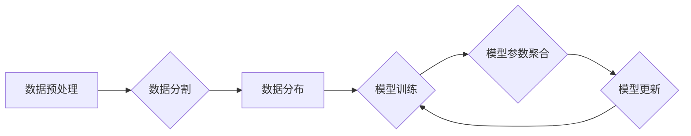

> 大规模语言模型，数据并行，深度学习，Transformer，分布式训练，模型压缩

## 1. 背景介绍

近年来，深度学习技术取得了飞速发展，特别是大规模语言模型（Large Language Models，LLMs）的出现，为自然语言处理（NLP）领域带来了革命性的变革。LLMs，如GPT-3、BERT、LaMDA等，拥有数十亿甚至数千亿的参数，能够理解和生成人类语言，并在文本生成、机器翻译、问答系统等任务中表现出惊人的能力。

然而，训练这些庞大的模型需要海量数据和强大的计算资源，这对于大多数研究机构和企业来说是一个巨大的挑战。数据并行训练成为解决这一问题的关键技术之一。

## 2. 核心概念与联系

数据并行训练是指将训练数据分割成多个子集，分别在不同的计算节点上进行训练，然后将各个节点的模型参数进行聚合，最终得到一个全局的模型。

**数据并行训练的优势:**

* **提高训练速度:** 将数据分布到多个节点上，可以显著加速模型的训练速度。
* **训练更大规模的模型:** 通过数据并行，可以训练规模更大的模型，因为每个节点的计算资源有限，但多个节点的总计算资源可以扩展。
* **提高模型鲁棒性:** 使用多个数据子集进行训练，可以使模型对数据分布的偏差更加鲁棒。

**数据并行训练的挑战:**

* **数据分布不均匀:** 不同的数据子集可能包含不同的信息，导致模型训练不均衡。
* **通信开销:** 数据并行训练需要频繁地进行模型参数的聚合，这会带来一定的通信开销。
* **模型并行与数据并行的结合:** 如何将数据并行与模型并行结合起来，以进一步提高训练效率，是一个重要的研究方向。

**数据并行训练流程图:**



## 3. 核心算法原理 & 具体操作步骤

### 3.1  算法原理概述

数据并行训练的核心算法是分布式梯度下降（Distributed Gradient Descent）。该算法将模型参数分布到多个计算节点上，每个节点对局部数据进行梯度计算，然后将梯度信息汇总到参数服务器，最终更新全局模型参数。

### 3.2  算法步骤详解

1. **数据预处理:** 将原始数据进行清洗、格式化和编码，使其适合模型训练。
2. **数据分割:** 将预处理后的数据分割成多个子集，每个子集分配给不同的计算节点。
3. **数据分布:** 将数据子集分布到各个计算节点上。
4. **模型初始化:** 在每个计算节点上初始化模型参数。
5. **模型训练:** 每个节点对分配到的数据子集进行训练，计算局部梯度。
6. **模型参数聚合:** 将各个节点计算出的梯度信息汇总到参数服务器。
7. **模型更新:** 根据汇总的梯度信息，更新全局模型参数。
8. **重复步骤5-7:** 迭代训练模型，直到达到预设的精度或训练次数。

### 3.3  算法优缺点

**优点:**

* 能够训练更大规模的模型。
* 训练速度更快。
* 提高模型鲁棒性。

**缺点:**

* 数据分布不均匀可能导致模型训练不均衡。
* 通信开销较大。

### 3.4  算法应用领域

数据并行训练广泛应用于各种深度学习任务，例如：

* 自然语言处理：文本分类、机器翻译、问答系统等。
* computer vision：图像识别、目标检测、图像分割等。
* speech recognition：语音识别、语音合成等。

## 4. 数学模型和公式 & 详细讲解 & 举例说明

### 4.1  数学模型构建

假设模型参数为$\theta$, 训练数据为$\{x_i, y_i\}_{i=1}^{N}$, 损失函数为$L(\theta, x_i, y_i)$. 数据并行训练的目标是找到最优参数$\theta$，使得损失函数最小化。

### 4.2  公式推导过程

分布式梯度下降算法的目标是迭代更新模型参数$\theta$，使其逐渐逼近最优解。

更新公式为：

$$\theta = \theta - \eta \frac{1}{N} \sum_{i=1}^{N} \nabla_{\theta} L(\theta, x_i, y_i)$$

其中：

* $\eta$ 为学习率。
* $\nabla_{\theta} L(\theta, x_i, y_i)$ 为损失函数对参数$\theta$的梯度。

### 4.3  案例分析与讲解

假设我们有一个包含10000个样本的数据集，将其分割成10个子集，每个子集包含1000个样本。我们将这些子集分别分配给10个计算节点，每个节点对分配到的数据子集进行训练，计算局部梯度。然后将所有节点计算出的梯度信息汇总到参数服务器，根据汇总的梯度信息更新全局模型参数。

## 5. 项目实践：代码实例和详细解释说明

### 5.1  开发环境搭建

* 操作系统：Linux
* Python版本：3.7+
* 深度学习框架：PyTorch

### 5.2  源代码详细实现

```python
import torch
import torch.nn as nn
from torch.utils.data import Dataset, DataLoader

# 定义模型
class MyModel(nn.Module):
    def __init__(self):
        super(MyModel, self).__init__()
        # 模型结构定义

    def forward(self, x):
        # 模型前向传播过程

# 定义数据集
class MyDataset(Dataset):
    def __init__(self, data):
        self.data = data

    def __len__(self):
        return len(self.data)

    def __getitem__(self, idx):
        return self.data[idx]

# 数据加载
train_data = ...  # 加载训练数据
train_dataset = MyDataset(train_data)
train_loader = DataLoader(train_dataset, batch_size=32, shuffle=True)

# 模型实例化
model = MyModel()

# 定义损失函数和优化器
criterion = nn.CrossEntropyLoss()
optimizer = torch.optim.Adam(model.parameters(), lr=0.001)

# 数据并行训练
for epoch in range(num_epochs):
    for batch_idx, (data, target) in enumerate(train_loader):
        # 前向传播
        output = model(data)
        loss = criterion(output, target)

        # 反向传播
        optimizer.zero_grad()
        loss.backward()

        # 参数更新
        optimizer.step()

    print(f'Epoch: {epoch+1}, Loss: {loss.item()}')
```

### 5.3  代码解读与分析

* 代码首先定义了模型、数据集和数据加载器。
* 然后实例化模型、损失函数和优化器。
* 最后，使用循环迭代训练模型，并计算每轮训练的损失值。

### 5.4  运行结果展示

训练完成后，可以将模型保存下来，并使用它进行预测。

## 6. 实际应用场景

数据并行训练在实际应用场景中得到了广泛的应用，例如：

* **大型语言模型训练:** 训练GPT-3、BERT等大型语言模型需要海量数据和强大的计算资源，数据并行训练是实现这一目标的关键技术。
* **图像识别:** 在图像识别任务中，数据并行训练可以提高模型的精度和速度。
* **语音识别:** 语音识别任务也需要处理大量的数据，数据并行训练可以有效地提高训练效率。

### 6.4  未来应用展望

随着计算资源的不断发展，数据并行训练技术将会得到更广泛的应用，例如：

* **更大型模型的训练:** 数据并行训练将使我们能够训练规模更大的模型，从而进一步提高模型的性能。
* **更复杂的模型架构:** 数据并行训练可以支持更复杂的模型架构，例如Transformer等。
* **边缘计算:** 数据并行训练技术也可以应用于边缘计算，使模型能够在设备上进行高效的训练和推理。

## 7. 工具和资源推荐

### 7.1  学习资源推荐

* **书籍:**
    * Deep Learning by Ian Goodfellow, Yoshua Bengio, and Aaron Courville
    * Distributed Deep Learning with PyTorch by Eli Stevens, Luca Antiga, and Thomas Viehmann
* **在线课程:**
    * Stanford CS231n: Convolutional Neural Networks for Visual Recognition
    * Deep Learning Specialization by Andrew Ng

### 7.2  开发工具推荐

* **PyTorch:** 一个开源的深度学习框架，支持数据并行训练。
* **TensorFlow:** 另一个开源的深度学习框架，也支持数据并行训练。
* **Horovod:** 一个开源的分布式深度学习训练框架，可以与PyTorch和TensorFlow集成。

### 7.3  相关论文推荐

* **Distributed Training of Deep Neural Networks** by Dean et al. (2012)
* **Parameter Server: A Distributed Machine Learning System** by Recht et al. (2011)
* **Deep Learning with Large-Scale Distributed Training** by Abadi et al. (2016)

## 8. 总结：未来发展趋势与挑战

### 8.1  研究成果总结

数据并行训练技术取得了显著的进展，使我们能够训练规模更大的模型，并提高模型的训练效率。

### 8.2  未来发展趋势

* **模型并行与数据并行的结合:** 将模型并行与数据并行结合起来，以进一步提高训练效率。
* **混合精度训练:** 使用混合精度训练，可以加速模型训练速度。
* **自动化数据并行:** 自动化数据并行训练流程，降低训练门槛。

### 8.3  面临的挑战

* **数据分布不均匀:** 如何解决数据分布不均匀的问题，使模型训练更加均衡。
* **通信开销:** 如何降低通信开销，提高训练效率。
* **模型复杂度:** 如何训练更加复杂的模型，例如Transformer等。

### 8.4  研究展望

未来，数据并行训练技术将会继续发展，并应用于更多领域，例如：

* **人工智能芯片:** 数据并行训练技术将推动人工智能芯片的开发，使模型能够在更小的芯片上进行高效的训练和推理。
* **边缘计算:** 数据并行训练技术将使模型能够在设备上进行高效的训练和推理，从而实现更智能的边缘计算。


## 9. 附录：常见问题与解答

**Q1: 数据并行训练和模型并行有什么区别？**

**A1:** 数据并行训练是指将数据分割到多个节点上进行训练，而模型并行是指将模型参数分割到多个节点上进行训练。

**Q2: 数据并行训练的通信开销如何降低？**

**A2:** 可以使用一些技术来降低通信开销，例如：

* 使用更有效的通信协议。
* 使用数据压缩技术。
* 使用模型并行技术。

**Q3: 如何选择合适的分布式深度学习框架？**

**A3:** 选择合适的分布式深度学习框架取决于具体的应用场景和需求。

* PyTorch 和 TensorFlow 是两个流行的框架，它们都支持数据并行训练。
* Horovod 是一个专门用于分布式深度学习训练的框架，可以与 PyTorch 和 TensorFlow 集成。


作者：禅与计算机程序设计艺术 / Zen and the Art of Computer Programming 
<end_of_turn>