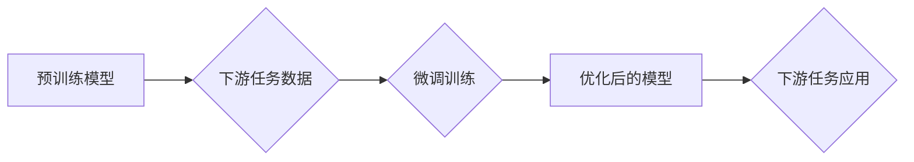

> 大规模语言模型，微调，下游任务，有监督学习，Transformer，BERT，GPT，Fine-tuning

## 1. 背景介绍

近年来，大规模语言模型（Large Language Models，LLMs）在自然语言处理（NLP）领域取得了显著的进展。这些模型，例如 GPT-3 和 BERT，通过训练在海量文本数据上，能够执行各种复杂的任务，如文本生成、翻译、问答和代码生成。然而，这些预训练模型通常需要大量的计算资源和时间进行训练，并且在特定下游任务上的性能可能并不理想。

为了解决这个问题，**有监督下游任务微调**（Supervised Fine-tuning）应运而生。微调是指在预训练模型的基础上，使用特定任务的数据进行进一步训练，以提高模型在该任务上的性能。

## 2. 核心概念与联系

**2.1 预训练模型**

预训练模型是指在大量通用文本数据上进行训练的语言模型。这些模型学习了语言的语法、语义和结构等知识，并能够在各种下游任务中作为基础模型使用。

**2.2 下游任务**

下游任务是指特定领域或应用场景下的任务，例如文本分类、情感分析、机器翻译等。

**2.3 微调**

微调是指在预训练模型的基础上，使用特定任务的数据进行进一步训练，以提高模型在该任务上的性能。

**2.4 有监督学习**

有监督学习是指利用标记数据训练模型，模型学习从输入到输出的映射关系。

**2.5 Transformer**

Transformer是一种新型的深度学习架构，其核心是注意力机制，能够有效地捕捉文本序列中的长距离依赖关系。

**2.6 BERT、GPT**

BERT 和 GPT 都是基于 Transformer 架构的预训练语言模型，分别擅长文本理解和文本生成任务。

**2.7 流程图**



## 3. 核心算法原理 & 具体操作步骤

### 3.1 算法原理概述

有监督下游任务微调的核心思想是利用预训练模型已经学习到的语言知识，通过在特定任务的数据上进行微调，进一步提升模型在该任务上的性能。

具体来说，微调过程通常包括以下步骤：

1. 选择一个预训练模型作为基础模型。
2. 使用特定任务的数据进行数据预处理，例如文本分类任务需要将文本转换为类别标签。
3. 将预训练模型的某些参数冻结，只训练部分参数，例如最后一层全连接层。
4. 使用优化算法，例如 Adam，对模型参数进行更新，以最小化模型在特定任务上的损失函数。
5. 评估模型在验证集上的性能，并根据性能调整超参数，例如学习率和训练轮数。

### 3.2 算法步骤详解

1. **选择预训练模型:** 

   根据下游任务的特点选择合适的预训练模型。例如，对于文本分类任务，可以使用 BERT 模型；对于文本生成任务，可以使用 GPT 模型。

2. **数据预处理:** 

   将下游任务的数据进行预处理，例如文本清洗、分词、词向量化等。

3. **模型结构调整:** 

   根据下游任务的需求，对预训练模型进行结构调整。例如，对于文本分类任务，需要添加一个全连接层，输出每个类别的概率。

4. **参数初始化:** 

   将预训练模型的参数作为微调模型的初始参数。

5. **微调训练:** 

   使用优化算法对模型参数进行更新，以最小化模型在特定任务上的损失函数。

6. **模型评估:** 

   在验证集上评估模型的性能，并根据性能调整超参数，例如学习率和训练轮数。

7. **模型部署:** 

   将训练好的模型部署到生产环境中，用于实际应用。

### 3.3 算法优缺点

**优点:**

* **性能提升:** 微调可以显著提升模型在特定任务上的性能。
* **效率提升:** 相比于从头训练模型，微调只需要训练少量参数，可以节省时间和计算资源。
* **可解释性增强:** 微调后的模型参数更容易解释，可以帮助我们理解模型的决策过程。

**缺点:**

* **数据依赖:** 微调的性能依赖于下游任务数据的质量和数量。
* **过拟合风险:** 如果训练数据不足，模型容易过拟合。
* **模型复杂度:** 微调后的模型可能比预训练模型更加复杂，部署和维护成本更高。

### 3.4 算法应用领域

* **文本分类:** 邮件过滤、情感分析、主题分类
* **问答系统:** 自动回答问题、搜索引擎
* **机器翻译:** 将文本从一种语言翻译成另一种语言
* **文本生成:** 自动写作、对话系统
* **代码生成:** 自动生成代码

## 4. 数学模型和公式 & 详细讲解 & 举例说明

### 4.1 数学模型构建

在微调过程中，我们通常使用交叉熵损失函数来衡量模型的性能。

**交叉熵损失函数:**

$$
Loss = - \sum_{i=1}^{N} y_i \log(p_i)
$$

其中：

* $N$ 是样本数量
* $y_i$ 是真实标签
* $p_i$ 是模型预测的概率

### 4.2 公式推导过程

交叉熵损失函数的推导过程可以参考机器学习相关的教材和论文。

### 4.3 案例分析与讲解

假设我们有一个文本分类任务，需要将文本分类为正类和负类。

* **真实标签:** $y = [1, 0, 1, 0]$
* **模型预测概率:** $p = [0.8, 0.2, 0.3, 0.7]$

使用交叉熵损失函数计算损失值：

$$
Loss = - (1 \log(0.8) + 0 \log(0.2) + 1 \log(0.3) + 0 \log(0.7))
$$

$$
Loss \approx 0.22
$$

## 5. 项目实践：代码实例和详细解释说明

### 5.1 开发环境搭建

* Python 3.6+
* TensorFlow 或 PyTorch
* CUDA 和 cuDNN (可选)

### 5.2 源代码详细实现

```python
import tensorflow as tf

# 加载预训练模型
model = tf.keras.applications.BERT_model(weights='bert_base_uncased')

# 冻结预训练模型的层
for layer in model.layers:
    layer.trainable = False

# 添加新的全连接层
output_layer = tf.keras.layers.Dense(units=2, activation='softmax')(model.output)

# 创建模型
model = tf.keras.Model(inputs=model.input, outputs=output_layer)

# 编译模型
model.compile(optimizer='adam', loss='sparse_categorical_crossentropy', metrics=['accuracy'])

# 训练模型
model.fit(x_train, y_train, epochs=3)

# 评估模型
loss, accuracy = model.evaluate(x_test, y_test)
print('Loss:', loss)
print('Accuracy:', accuracy)
```

### 5.3 代码解读与分析

* **加载预训练模型:** 使用 `tf.keras.applications.BERT_model` 加载预训练的 BERT 模型。
* **冻结预训练模型的层:** 使用 `layer.trainable = False` 将预训练模型的层冻结，只训练新的全连接层。
* **添加新的全连接层:** 使用 `tf.keras.layers.Dense` 添加一个全连接层，输出每个类别的概率。
* **创建模型:** 使用 `tf.keras.Model` 创建一个新的模型，输入为预训练模型的输入，输出为新的全连接层的输出。
* **编译模型:** 使用 `model.compile` 编译模型，指定优化器、损失函数和评估指标。
* **训练模型:** 使用 `model.fit` 训练模型，输入训练数据和标签。
* **评估模型:** 使用 `model.evaluate` 评估模型在测试集上的性能。

### 5.4 运行结果展示

训练完成后，可以查看模型在测试集上的损失值和准确率。

## 6. 实际应用场景

### 6.1 文本分类

* **垃圾邮件过滤:** 将邮件分类为垃圾邮件和正常邮件。
* **情感分析:** 分析文本的情感倾向，例如正面、负面或中性。
* **主题分类:** 将文本分类为不同的主题，例如新闻、体育、财经等。

### 6.2 问答系统

* **自动回答问题:** 根据用户的问题，自动从知识库中找到答案。
* **搜索引擎:** 使用问答系统来提高搜索结果的准确性和相关性。

### 6.3 机器翻译

* **将文本从一种语言翻译成另一种语言:** 例如，将英文翻译成中文。

### 6.4 文本生成

* **自动写作:** 自动生成新闻报道、产品描述、故事等文本。
* **对话系统:** 使用文本生成模型来构建聊天机器人。

### 6.5 代码生成

* **自动生成代码:** 根据用户需求，自动生成代码。

## 7. 工具和资源推荐

### 7.1 学习资源推荐

* **书籍:**
    * 《深度学习》 by Ian Goodfellow, Yoshua Bengio, and Aaron Courville
    * 《自然语言处理》 by Dan Jurafsky and James H. Martin
* **在线课程:**
    * Coursera: Natural Language Processing Specialization
    * Udacity: Deep Learning Nanodegree

### 7.2 开发工具推荐

* **TensorFlow:** https://www.tensorflow.org/
* **PyTorch:** https://pytorch.org/
* **Hugging Face Transformers:** https://huggingface.co/transformers/

### 7.3 相关论文推荐

* BERT: Pre-training of Deep Bidirectional Transformers for Language Understanding
* GPT-3: Language Models are Few-Shot Learners
* Fine-Tuning BERT for Text Classification

## 8. 总结：未来发展趋势与挑战

### 8.1 研究成果总结

近年来，大规模语言模型在自然语言处理领域取得了显著的进展，特别是微调技术在提升模型性能方面发挥了重要作用。

### 8.2 未来发展趋势

* **模型规模更大:** 预训练模型的规模将继续扩大，从而提升模型的性能和泛化能力。
* **多模态学习:** 将文本与其他模态数据，例如图像和音频，进行融合学习，构建更强大的多模态模型。
* **可解释性增强:** 研究更有效的模型解释方法，提高模型的透明度和可信度。

### 8.3 面临的挑战

* **计算资源需求:** 训练大型语言模型需要大量的计算资源，这对于资源有限的机构和个人来说是一个挑战。
* **数据获取和标注:** 高质量的训练数据是模型性能的关键，但获取和标注高质量数据仍然是一个难题。
* **伦理问题:** 大规模语言模型可能存在一些伦理问题，例如生成虚假信息、歧视等，需要引起重视并进行相应的规制。

### 8.4 研究展望

未来，大规模语言模型的研究将继续朝着更强大、更智能、更安全的方向发展。


## 9. 附录：常见问题与解答

**Q1: 微调模型需要多少数据？**

A1: 微调模型所需的训练数据量取决于下游任务的复杂度和模型的规模。一般来说，需要至少几千条数据才能达到较好的效果。

**Q2: 如何选择合适的预训练模型？**

A2: 选择预训练模型时，需要考虑下游任务的特点和模型的规模。对于文本分类任务，可以使用 BERT 模型；对于文本生成任务，可以使用 GPT 模型。

**Q3: 如何避免模型过拟合？**

A3: 为了避免模型过拟合，可以使用