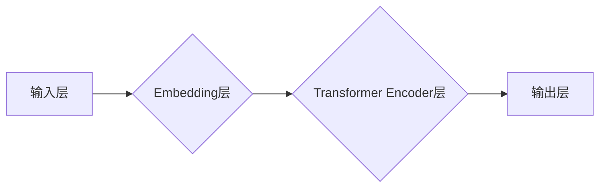

> 大语言模型，BERT，Encoder，Transformer，自然语言处理，深度学习，文本理解

## 1. 背景介绍

自然语言处理 (NLP) 领域近年来取得了飞速发展，深度学习技术的应用推动了 NLP 领域的新突破。其中，大语言模型 (LLM) 作为 NLP 领域的重要研究方向，凭借其强大的文本理解和生成能力，在各种 NLP 任务中展现出令人瞩目的性能。

BERT (Bidirectional Encoder Representations from Transformers) 是 Google AI 团队于 2018 年提出的一个开源的 Transformer 基于编码器的预训练语言模型，它在许多 NLP 任务中取得了显著的成绩，例如文本分类、问答系统、文本摘要等。BERT 的出现标志着 NLP 领域进入了新的时代，它为后续的 LLM 研究和应用提供了重要的参考和借鉴。

## 2. 核心概念与联系

BERT 模型的核心思想是通过双向编码来捕捉文本的语义信息。传统的语言模型通常采用单向编码方式，只考虑词语的前后上下文信息，而 BERT 则通过 Transformer 架构的注意力机制，能够同时考虑词语前后所有上下文信息，从而更全面地理解文本语义。

**BERT 模型架构**



**核心概念解释:**

* **输入层:** 将文本序列转换为词向量表示。
* **Embedding层:** 将每个词向量映射到一个低维向量空间。
* **Transformer Encoder层:** 利用多头注意力机制和前馈神经网络，对文本序列进行双向编码，捕捉词语之间的语义关系。
* **输出层:** 根据编码后的文本序列，输出相应的预测结果。

## 3. 核心算法原理 & 具体操作步骤

### 3.1  算法原理概述

BERT 模型的核心算法是 Transformer 架构，它由多层编码器组成，每一层编码器包含多头注意力机制和前馈神经网络。

* **多头注意力机制:** 能够同时关注文本序列中不同位置的词语，捕捉词语之间的长距离依赖关系。
* **前馈神经网络:** 对每个词语的编码结果进行进一步的处理，提取更深层次的语义信息。

### 3.2  算法步骤详解

1. **词嵌入:** 将输入文本序列中的每个词语转换为词向量表示。
2. **多头注意力:** 对每个词语的词向量表示，使用多头注意力机制计算其与其他词语之间的注意力权重。
3. **前馈神经网络:** 对每个词语的注意力加权结果，使用前馈神经网络进行处理，提取更深层次的语义信息。
4. **重复步骤 2-3:** 将步骤 2-3 循环进行多层编码，最终得到文本序列的最终编码表示。

### 3.3  算法优缺点

**优点:**

* 能够捕捉文本序列中长距离依赖关系。
* 训练效率高，能够在大型数据集上进行预训练。
* 在许多 NLP 任务中取得了显著的性能提升。

**缺点:**

* 计算复杂度高，需要大量的计算资源进行训练。
* 模型参数量大，需要较大的存储空间。

### 3.4  算法应用领域

BERT 模型在以下 NLP 任务中取得了广泛应用:

* 文本分类
* 问答系统
* 文本摘要
* 机器翻译
* 情感分析
* 语义相似度计算

## 4. 数学模型和公式 & 详细讲解 & 举例说明

### 4.1  数学模型构建

BERT 模型的数学模型主要基于 Transformer 架构，其核心是多头注意力机制和前馈神经网络。

**多头注意力机制:**

$$
Attention(Q, K, V) = softmax(\frac{QK^T}{\sqrt{d_k}})V
$$

其中:

* $Q$, $K$, $V$ 分别代表查询矩阵、键矩阵和值矩阵。
* $d_k$ 代表键向量的维度。
* $softmax$ 函数将注意力权重归一化到 [0, 1] 之间。

**前馈神经网络:**

$$
FFN(x) = \max(0, xW_1 + b_1)W_2 + b_2
$$

其中:

* $x$ 代表输入向量。
* $W_1$, $W_2$ 代表权重矩阵。
* $b_1$, $b_2$ 代表偏置项。
* $\max(0, \cdot)$ 代表 ReLU 激活函数。

### 4.2  公式推导过程

多头注意力机制的公式推导过程可以参考 Transformer 原文论文。

### 4.3  案例分析与讲解

假设我们有一个文本序列 "The cat sat on the mat"，使用 BERT 模型进行编码，可以得到每个词语的编码表示。例如，"cat" 的编码表示可能包含关于 "猫" 的语义信息，例如 "哺乳动物", "毛茸茸", "喜欢抓老鼠" 等。

## 5. 项目实践：代码实例和详细解释说明

### 5.1  开发环境搭建

BERT 模型的开发环境搭建需要以下软件:

* Python 3.6+
* TensorFlow 或 PyTorch
* CUDA 和 cuDNN (可选)

### 5.2  源代码详细实现

BERT 模型的源代码可以从 Hugging Face 库中获取:

```python
from transformers import BertTokenizer, BertModel

# 加载预训练模型和词典
tokenizer = BertTokenizer.from_pretrained('bert-base-uncased')
model = BertModel.from_pretrained('bert-base-uncased')

# 对文本序列进行编码
input_text = "The cat sat on the mat"
input_ids = tokenizer.encode(input_text, add_special_tokens=True)
output = model(input_ids)
```

### 5.3  代码解读与分析

* `BertTokenizer` 用于将文本序列转换为词向量表示。
* `BertModel` 用于对文本序列进行编码。
* `encode()` 方法将文本序列转换为词向量表示。
* `model()` 方法对文本序列进行编码，输出编码结果。

### 5.4  运行结果展示

BERT 模型的运行结果是一个包含文本序列编码表示的张量。

## 6. 实际应用场景

BERT 模型在许多实际应用场景中发挥着重要作用:

* **搜索引擎:** BERT 可以用于理解用户搜索意图，提高搜索结果的准确率。
* **聊天机器人:** BERT 可以用于训练聊天机器人，使其能够更好地理解用户对话内容。
* **文本摘要:** BERT 可以用于自动生成文本摘要，提取文本的关键信息。
* **机器翻译:** BERT 可以用于机器翻译，提高翻译质量。

### 6.4  未来应用展望

BERT 模型的未来应用前景广阔，例如:

* **个性化推荐:** BERT 可以用于个性化推荐，根据用户的兴趣爱好推荐相关内容。
* **医疗诊断:** BERT 可以用于辅助医疗诊断，分析患者病历信息，辅助医生做出诊断。
* **法律文本分析:** BERT 可以用于分析法律文本，提取法律条款，辅助法律研究。

## 7. 工具和资源推荐

### 7.1  学习资源推荐

* **BERT 原文论文:** https://arxiv.org/abs/1810.04805
* **Hugging Face BERT 库:** https://huggingface.co/transformers/model_doc/bert.html
* **Stanford NLP Group:** https://nlp.stanford.edu/

### 7.2  开发工具推荐

* **TensorFlow:** https://www.tensorflow.org/
* **PyTorch:** https://pytorch.org/
* **Jupyter Notebook:** https://jupyter.org/

### 7.3  相关论文推荐

* **Transformer:** https://arxiv.org/abs/1706.03762
* **GPT-3:** https://openai.com/blog/gpt-3/
* **T5:** https://arxiv.org/abs/1910.10683

## 8. 总结：未来发展趋势与挑战

### 8.1  研究成果总结

BERT 模型的提出标志着 NLP 领域进入了新的时代，它为后续的 LLM 研究和应用提供了重要的参考和借鉴。BERT 模型在许多 NLP 任务中取得了显著的成绩，推动了 NLP 领域的快速发展。

### 8.2  未来发展趋势

未来 LLM 研究将朝着以下方向发展:

* **模型规模更大:** 训练更大规模的 LLM 模型，提升模型的性能。
* **模型效率更高:** 探索新的模型架构和训练方法，提高模型的训练效率和推理效率。
* **模型更通用:** 训练更通用的 LLM 模型，能够适应更多不同的 NLP 任务。
* **模型更安全可靠:** 研究 LLM 模型的安全性、可靠性和可解释性，确保模型的负责任使用。

### 8.3  面临的挑战

LLM 研究还面临着一些挑战:

* **数据规模:** 训练大型 LLM 模型需要海量的数据，数据获取和预处理是一个难题。
* **计算资源:** 训练大型 LLM 模型需要大量的计算资源，成本较高。
* **模型可解释性:** LLM 模型的决策过程难以解释，缺乏透明度。
* **伦理问题:** LLM 模型可能存在偏见和歧视问题，需要关注模型的伦理问题。

### 8.4  研究展望

未来 LLM 研究将继续探索新的模型架构、训练方法和应用场景，推动 NLP 领域的发展，为人类社会带来更多价值。

## 9. 附录：常见问题与解答

**Q1: BERT 模型的训练数据是什么？**

A1: BERT 模型的训练数据来自 Google 的公开数据集，包括书籍、文章、网页等多种文本类型。

**Q2: BERT 模型的预训练方式是什么？**

A2: BERT 模型采用 masked language modeling (MLM) 和 next sentence prediction (NSP) 两种预训练任务。

**Q3: 如何使用 BERT 模型进行文本分类？**

A3: 可以将 BERT 模型的输出结果作为文本分类模型的输入，使用分类器进行分类。

**Q4: BERT 模型的开源代码在哪里可以找到？**

A4: BERT 模型的开源代码可以从 Hugging Face 库中获取。


作者：禅与计算机程序设计艺术 / Zen and the Art of Computer Programming 
<end_of_turn>