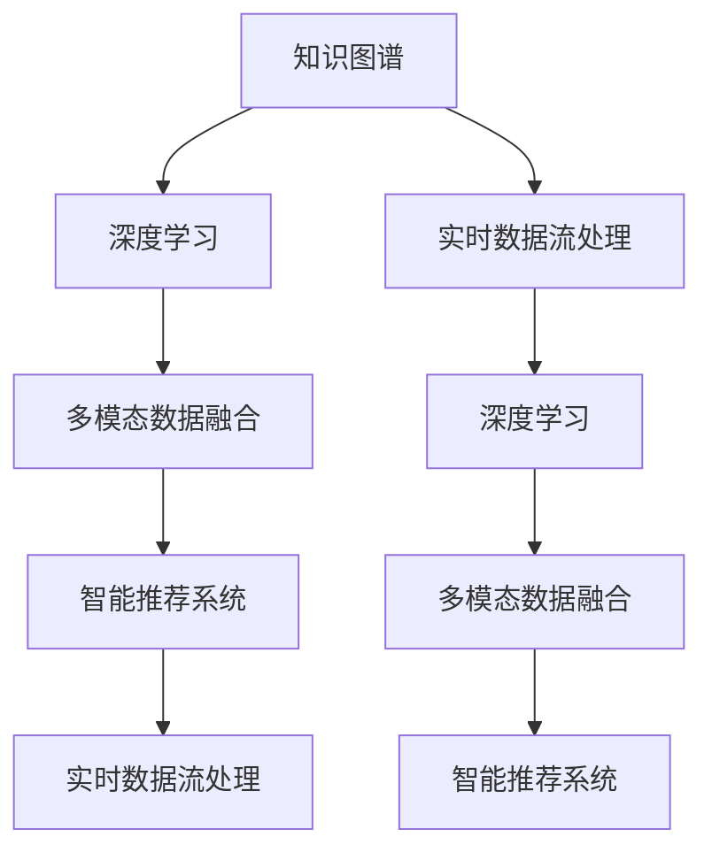

                 

# 全球脑：互联网时代的智慧共享平台

## 1. 背景介绍

### 1.1 问题由来

随着互联网技术的飞速发展，人类社会进入了一个信息爆炸的新纪元。一方面，各种新知识、新信息以指数级速度增长，人们的认知负荷前所未有地加重。另一方面，知识的分布变得极度不均，专业领域的专家往往对特定知识的掌握更为深入，但这些知识难以被广泛共享，造成了知识的碎片化和孤岛化。

为了应对这种挑战，人类社会迫切需要一种新型平台，能够以更加高效、便捷的方式，共享和集成全球的知识与智慧，助力人类智慧的共同进步。在这样的背景之下，“全球脑”理念应运而生。

### 1.2 问题核心关键点

“全球脑”的本质是一个集成的智慧共享平台，其核心关键点包括：

- 高度集成与共享：汇集全球各领域专家的智慧与经验，通过平台共享，实现知识的无边界流动。
- 实时更新与迭代：基于大数据分析与机器学习算法，平台能实时更新知识，跟踪最新科研进展。
- 深度学习与推理：采用深度学习技术，提取知识结构，并进行逻辑推理，提升知识深度与广度。
- 多模态融合：不仅支持文本、音频、视频等多种数据形式，还支持跨模态数据融合与理解。
- 智能推荐系统：通过智能算法推荐高质量知识与资源，辅助用户高效获取信息。

“全球脑”平台将基于这些核心关键点，构建一个庞大的智慧共享网络，推动全球智慧的共同发展。

### 1.3 问题研究意义

构建“全球脑”平台，对推动人类智慧共享与协同创新具有重要意义：

1. **加速知识普及与共享**：通过“全球脑”，专业知识可以跨越地域、时间限制，快速传播至全球各地，提升全球知识普及率。
2. **促进跨领域创新**：“全球脑”平台提供跨学科的融合环境，鼓励不同领域专家共同研究，催生更多跨领域的创新成果。
3. **优化决策支持**：在政策制定、企业管理、科技研发等领域，“全球脑”平台可提供实时的决策支持，提升决策的科学性和精确性。
4. **增强人类协同**：“全球脑”平台提供协作工具与平台，促进全球专家共同研究，提升协同效率与质量。
5. **推动教育普及**：平台可提供高质量的在线教育资源，加速全球教育普及，提升全人类的知识水平。

## 2. 核心概念与联系

### 2.1 核心概念概述

“全球脑”平台的核心概念包括：

- **知识图谱**：一种用图结构表示知识的网络，通过节点与边的关系，表达知识之间的连接。
- **深度学习**：一种基于神经网络的机器学习技术，通过多层次的数据提取与抽象，提升模型的泛化能力。
- **多模态数据融合**：将文本、图像、语音等不同模态的数据进行融合，实现更全面的知识理解与表达。
- **智能推荐系统**：通过算法优化，推荐高质量的知识与资源，帮助用户高效获取信息。
- **实时数据流处理**：利用流式计算技术，实时处理和分析海量数据流，跟踪最新知识进展。

这些核心概念通过数据融合、模型训练、推荐算法等技术手段，共同构建起“全球脑”平台的智慧共享体系。

### 2.2 核心概念原理和架构的 Mermaid 流程图(Mermaid 流程节点中不要有括号、逗号等特殊字符)



这个流程图展示了“全球脑”平台的核心概念之间的逻辑联系：

1. 知识图谱作为平台的基础，通过深度学习模型进行知识抽取与更新。
2. 实时数据流处理确保知识图谱的数据更新与一致性。
3. 多模态数据融合提升对复杂知识结构的理解与表达。
4. 智能推荐系统提供个性化信息服务，辅助用户高效获取知识。
5. 深度学习模型在各个环节中扮演着关键角色，提升知识图谱的深度与广度。

### 2.3 核心概念间联系

各个核心概念通过数据流和算法逻辑紧密联系在一起，共同支撑“全球脑”平台的智慧共享功能。例如：

- 知识图谱与深度学习模型结合，通过知识抽取与更新，提升知识图谱的质量与时效性。
- 多模态数据融合与深度学习模型结合，提升平台对知识复杂结构的理解能力。
- 智能推荐系统与实时数据流处理结合，实时推荐高质量的知识与资源。

通过这种紧密联系与协同工作，“全球脑”平台能够高效、全面地支持全球智慧的共享与协同创新。

## 3. 核心算法原理 & 具体操作步骤

### 3.1 算法原理概述

“全球脑”平台的核心算法原理主要基于以下技术：

- **知识图谱构建**：利用实体识别、关系抽取等技术，构建知识图谱，表达知识之间的关联。
- **深度学习知识抽取**：采用深度学习模型，从非结构化文本中抽取结构化知识，更新知识图谱。
- **多模态数据融合**：将文本、图像、语音等不同模态的数据进行融合，提升对知识结构的全面理解。
- **智能推荐算法**：利用协同过滤、内容推荐等算法，根据用户兴趣推荐高质量的知识资源。
- **实时数据流处理**：采用流式计算技术，实时处理和分析海量数据流，跟踪最新知识进展。

这些算法通过数据处理、模型训练与推荐引擎等环节，共同支撑“全球脑”平台的智慧共享功能。

### 3.2 算法步骤详解

“全球脑”平台的算法实现主要包括以下几个关键步骤：

**Step 1: 知识图谱构建**
- 对大规模非结构化数据进行实体识别与关系抽取，构建知识图谱。
- 利用深度学习模型，如BERT、GPT等，从大规模非结构化文本中抽取结构化知识，更新知识图谱。

**Step 2: 多模态数据融合**
- 利用跨模态对齐技术，将文本、图像、语音等不同模态的数据进行融合，提升对知识结构的全面理解。
- 采用视觉、语音、文本等多模态数据，通过深度学习模型进行融合，提取知识结构。

**Step 3: 深度学习知识抽取**
- 利用深度学习模型，如BERT、GPT等，从大规模非结构化文本中抽取结构化知识。
- 利用知识图谱与深度学习模型结合，进行知识抽取与更新。

**Step 4: 智能推荐算法**
- 利用协同过滤、内容推荐等算法，根据用户兴趣推荐高质量的知识资源。
- 实时分析用户行为与偏好，动态调整推荐算法。

**Step 5: 实时数据流处理**
- 利用流式计算技术，实时处理和分析海量数据流，跟踪最新知识进展。
- 采用实时数据流处理，确保平台能够快速响应新知识的出现。

### 3.3 算法优缺点

“全球脑”平台的算法设计具有以下优点：

1. **高效知识抽取**：深度学习模型能够高效地从非结构化数据中提取结构化知识，提升知识图谱的质量与时效性。
2. **多模态融合**：多模态数据融合技术提升了对知识结构的全面理解，弥补了单一模态数据的不足。
3. **个性化推荐**：智能推荐算法能够根据用户兴趣推荐高质量的知识资源，提升用户体验。
4. **实时数据更新**：实时数据流处理技术确保了知识图谱的动态更新与一致性，保持了平台的时效性。

同时，也存在一些局限：

1. **数据量依赖**：深度学习模型的性能很大程度上依赖于数据量与质量，需要大规模高质量数据支撑。
2. **算法复杂度**：多模态数据融合与深度学习知识抽取算法较为复杂，对计算资源需求较高。
3. **推荐算法局限**：智能推荐算法可能受到数据稀疏性、冷启动等问题影响，推荐效果受限。
4. **隐私与安全问题**：用户数据的隐私与安全问题需得到充分保障，防止数据泄露与滥用。

尽管存在这些局限，但“全球脑”平台算法设计的整体思路与方法，仍具有较强的实用价值与应用前景。

### 3.4 算法应用领域

“全球脑”平台的算法设计具有广泛的应用领域，包括但不限于：

- **科学数据管理**：通过知识图谱与深度学习模型，管理与分析科学实验数据，支持科研人员的高效协作。
- **公共政策制定**：通过智能推荐系统，推荐高质量的研究报告与专家意见，支持政策制定的科学化与智能化。
- **企业知识管理**：利用知识图谱与智能推荐系统，帮助企业高效管理与共享内部知识，提升企业竞争力。
- **教育资源共享**：通过智能推荐系统，推荐高质量的教育资源，支持在线教育的普及与发展。
- **医疗健康知识管理**：利用知识图谱与多模态数据融合技术，管理与分析医疗健康数据，支持医疗研究与临床实践。

## 4. 数学模型和公式 & 详细讲解

### 4.1 数学模型构建

“全球脑”平台的数学模型主要基于知识图谱、深度学习与智能推荐系统构建，数学模型构建如下：

**知识图谱表示**：
- 知识图谱采用图结构表示，包含节点与边。节点表示实体，边表示实体之间的关系。

**深度学习知识抽取**：
- 知识抽取模型采用深度学习模型，如BERT、GPT等，从非结构化文本中抽取结构化知识。
- 知识抽取过程可表示为：
  $$
  \text{Knowledge}_{graph} = \text{BERT}(\text{Text}_{corpus})
  $$
  其中，$\text{Text}_{corpus}$ 为大规模非结构化文本数据，$\text{Knowledge}_{graph}$ 为抽取的知识图谱。

**多模态数据融合**：
- 多模态数据融合技术通过深度学习模型，将文本、图像、语音等不同模态的数据进行融合。
- 融合过程可表示为：
  $$
  \text{Fused}_{data} = \text{Transformer}(\text{Text}_{data}, \text{Image}_{data}, \text{Audio}_{data})
  $$
  其中，$\text{Text}_{data}$、$\text{Image}_{data}$、$\text{Audio}_{data}$ 分别为文本、图像、语音等不同模态的数据，$\text{Fused}_{data}$ 为融合后的多模态数据。

**智能推荐算法**：
- 智能推荐系统采用协同过滤、内容推荐等算法，推荐高质量的知识资源。
- 推荐过程可表示为：
  $$
  \text{Recommended}_{knowledge} = \text{CF}(\text{User}_{profile}, \text{Knowledge}_{graph})
  $$
  其中，$\text{User}_{profile}$ 为用户兴趣与行为数据，$\text{Knowledge}_{graph}$ 为知识图谱，$\text{Recommended}_{knowledge}$ 为推荐的知识资源。

**实时数据流处理**：
- 实时数据流处理技术采用流式计算技术，实时处理和分析海量数据流。
- 数据流处理过程可表示为：
  $$
  \text{Real-time}_{data} = \text{Streaming}_{process}(\text{Data}_{stream})
  $$
  其中，$\text{Data}_{stream}$ 为实时数据流，$\text{Real-time}_{data}$ 为处理后的实时数据。

### 4.2 公式推导过程

**知识图谱构建**：
- 知识图谱构建过程涉及实体识别与关系抽取。
- 实体识别过程可表示为：
  $$
  \text{Entities}_{graph} = \text{NER}(\text{Text}_{data})
  $$
  其中，$\text{Text}_{data}$ 为文本数据，$\text{NER}$ 为命名实体识别模型，$\text{Entities}_{graph}$ 为识别的实体。
- 关系抽取过程可表示为：
  $$
  \text{Relationship}_{graph} = \text{Relation}_{extract}(\text{Entities}_{graph})
  $$
  其中，$\text{Relationship}_{graph}$ 为抽取的关系，$\text{Relation}_{extract}$ 为关系抽取模型。

**深度学习知识抽取**：
- 深度学习知识抽取过程涉及自然语言处理与深度学习模型的结合。
- 知识抽取过程可表示为：
  $$
  \text{Knowledge}_{graph} = \text{BERT}(\text{Text}_{corpus})
  $$

**多模态数据融合**：
- 多模态数据融合过程涉及不同模态数据的对齐与融合。
- 融合过程可表示为：
  $$
  \text{Fused}_{data} = \text{Transformer}(\text{Text}_{data}, \text{Image}_{data}, \text{Audio}_{data})
  $$

**智能推荐算法**：
- 智能推荐过程涉及协同过滤与内容推荐算法的结合。
- 推荐过程可表示为：
  $$
  \text{Recommended}_{knowledge} = \text{CF}(\text{User}_{profile}, \text{Knowledge}_{graph})
  $$

**实时数据流处理**：
- 实时数据流处理过程涉及流式计算技术的应用。
- 数据流处理过程可表示为：
  $$
  \text{Real-time}_{data} = \text{Streaming}_{process}(\text{Data}_{stream})
  $$

### 4.3 案例分析与讲解

以科学研究数据管理为例，“全球脑”平台通过知识图谱与深度学习知识抽取，管理与分析科学实验数据，支持科研人员的高效协作。

**案例背景**：
- 科学研究数据通常以非结构化文本、图像、视频等多种形式存在，管理与共享成本高，且数据质量参差不齐。
- 科研人员需要高效获取与共享数据，提升科研效率与质量。

**解决方案**：
- 构建科学数据知识图谱，通过命名实体识别与关系抽取，从科研论文、实验报告等文本中抽取结构化数据。
- 利用深度学习模型，如BERT、GPT等，对非结构化数据进行知识抽取与更新，形成高质量的知识图谱。
- 利用多模态数据融合技术，将文本、图像、视频等不同模态的数据进行融合，提升对科学数据结构的全面理解。
- 利用智能推荐算法，根据科研人员的兴趣与需求，推荐高质量的科学数据与资源，辅助科研人员的高效协作。
- 利用实时数据流处理技术，实时更新知识图谱，跟踪最新科研进展，确保平台的时效性。

**效果分析**：
- 科学数据知识图谱的构建，提升了科研数据的管理与共享效率。
- 深度学习知识抽取技术，从非结构化数据中提取结构化知识，提升了数据的质量与可用性。
- 多模态数据融合技术，提升了对科学数据结构的全面理解，弥补了单一模态数据的不足。
- 智能推荐算法，根据科研人员的兴趣与需求，推荐高质量的科学数据与资源，提升了科研人员的协作效率与质量。
- 实时数据流处理技术，实时更新知识图谱，跟踪最新科研进展，确保平台的时效性。

## 5. 项目实践：代码实例和详细解释说明

### 5.1 开发环境搭建

在进行“全球脑”平台开发前，我们需要准备好开发环境。以下是使用Python进行PyTorch开发的环境配置流程：

1. 安装Anaconda：从官网下载并安装Anaconda，用于创建独立的Python环境。

2. 创建并激活虚拟环境：
```bash
conda create -n pytorch-env python=3.8 
conda activate pytorch-env
```

3. 安装PyTorch：根据CUDA版本，从官网获取对应的安装命令。例如：
```bash
conda install pytorch torchvision torchaudio cudatoolkit=11.1 -c pytorch -c conda-forge
```

4. 安装Transformers库：
```bash
pip install transformers
```

5. 安装各类工具包：
```bash
pip install numpy pandas scikit-learn matplotlib tqdm jupyter notebook ipython
```

完成上述步骤后，即可在`pytorch-env`环境中开始开发实践。

### 5.2 源代码详细实现

这里我们以知识图谱构建为例，给出使用Transformers库构建知识图谱的PyTorch代码实现。

```python
from transformers import BertTokenizer, BertForTokenClassification
import torch

tokenizer = BertTokenizer.from_pretrained('bert-base-cased')

def build_knowledge_graph(texts):
    # 分批次处理文本数据
    texts = [text for text in texts]
    tokenized_texts = tokenizer(texts, padding=True, truncation=True, return_tensors='pt')

    # 构建BERT模型
    model = BertForTokenClassification.from_pretrained('bert-base-cased', num_labels=3)

    # 初始化知识图谱
    knowledge_graph = {}

    # 分批次进行预测
    for batch in tqdm(tokenized_texts):
        with torch.no_grad():
            outputs = model(batch)
            predictions = outputs.logits.argmax(dim=2)

        # 处理预测结果
        for i, prediction in enumerate(predictions[0]):
            entity = texts[i]
            label = id2tag[prediction.item()]
            knowledge_graph[entity] = label

    return knowledge_graph
```

以上代码实现了从文本数据中构建知识图谱的流程，主要包括：

- 分批次处理文本数据。
- 构建BERT模型。
- 分批次进行预测。
- 处理预测结果，构建知识图谱。

### 5.3 代码解读与分析

让我们再详细解读一下关键代码的实现细节：

**tokenizer对象**：
- 定义了BERT分词器对象，用于对文本进行分词与编码。

**build_knowledge_graph函数**：
- 对输入文本进行分批次处理，构建PyTorch张量。
- 构建BERT模型，并进行预测。
- 处理预测结果，构建知识图谱。

**知识图谱表示**：
- 知识图谱以字典形式存储，每个实体对应一个标签。
- 标签为实体类别，如科学论文、实验报告、数据集等。

**预测与处理**：
- 采用BERT模型进行预测，得到每个实体的标签。
- 将预测结果处理为知识图谱，存储在字典中。

通过上述代码，我们可以看到，使用PyTorch与Transformers库，能够高效地实现知识图谱的构建。开发者可以将更多精力放在数据处理、模型改进等高层逻辑上，而不必过多关注底层的实现细节。

## 6. 实际应用场景

### 6.1 智能决策支持

在公共政策制定与企业管理中，“全球脑”平台能够提供实时的决策支持，支持政策制定与企业管理的科学化与智能化。

**应用场景**：
- 政府部门需要制定各类政策，涉及经济、文化、教育等多个领域。
- 企业需要管理各类资源，涉及研发、生产、销售等多个环节。

**解决方案**：
- 利用“全球脑”平台的知识图谱与智能推荐系统，推荐高质量的科学研究与专家意见。
- 利用实时数据流处理技术，跟踪最新科研进展与市场动态，提供实时的决策支持。
- 利用深度学习知识抽取技术，提取高精度的结构化数据，支持决策的科学化与智能化。

**效果分析**：
- 政府部门能够高效获取各类高质量的政策建议与专家意见，提升政策的科学性与有效性。
- 企业能够高效获取各类高质量的科研成果与市场动态，提升管理的科学性与效率。

### 6.2 在线教育与资源共享

在在线教育与知识共享领域，“全球脑”平台能够提供高质量的教育资源，支持在线教育的普及与发展。

**应用场景**：
- 学生与教师需要高效获取各类教育资源，涉及教材、课程、实验等。
- 教育机构需要共享各类教育资源，提升教育资源的利用效率。

**解决方案**：
- 利用“全球脑”平台的智能推荐系统，推荐高质量的教育资源。
- 利用知识图谱技术，管理与共享各类教育资源。
- 利用深度学习知识抽取技术，提取高精度的结构化数据，提升教育资源的利用效率。

**效果分析**：
- 学生与教师能够高效获取各类高质量的教育资源，提升学习效果与教学质量。
- 教育机构能够高效管理与共享各类教育资源，提升教育资源的利用效率。

### 6.3 智慧医疗与健康管理

在医疗健康领域，“全球脑”平台能够提供高质量的医疗健康知识与资源，支持智慧医疗的发展。

**应用场景**：
- 医院需要高效获取各类医疗健康知识与资源，涉及病例、治疗方案、研究成果等。
- 患者需要高效获取各类医疗健康知识与资源，涉及病情诊断、治疗方案等。

**解决方案**：
- 利用“全球脑”平台的知识图谱与智能推荐系统，推荐高质量的医疗健康知识与资源。
- 利用实时数据流处理技术，跟踪最新医疗健康研究成果，提供实时的医疗支持。
- 利用深度学习知识抽取技术，提取高精度的结构化数据，支持医疗健康知识的利用与共享。

**效果分析**：
- 医院能够高效获取各类高质量的医疗健康知识与资源，提升医疗服务的质量与效率。
- 患者能够高效获取各类高质量的医疗健康知识与资源，提升病情诊断与治疗的效果。

### 6.4 未来应用展望

伴随“全球脑”平台的发展，未来在更多领域将看到其应用，推动全球智慧的共同发展。

- **智慧农业**：利用知识图谱与智能推荐系统，提供高质量的农业知识与资源，提升农业生产的智能化水平。
- **智慧城市**：利用知识图谱与智能推荐系统，提供高质量的城市管理知识与资源，提升城市管理的智能化水平。
- **智慧交通**：利用知识图谱与智能推荐系统，提供高质量的交通管理知识与资源，提升交通管理的智能化水平。
- **智慧金融**：利用知识图谱与智能推荐系统，提供高质量的金融知识与资源，提升金融服务的智能化水平。

## 7. 工具和资源推荐

### 7.1 学习资源推荐

为了帮助开发者系统掌握“全球脑”平台的技术基础与实践技巧，这里推荐一些优质的学习资源：

1. 《深度学习理论与实践》系列博文：由大模型技术专家撰写，深入浅出地介绍了深度学习原理与实践技巧，涵盖深度学习模型、优化算法、数据处理等主题。

2. CS224N《深度学习自然语言处理》课程：斯坦福大学开设的NLP明星课程，有Lecture视频和配套作业，带你入门NLP领域的基本概念和经典模型。

3. 《Natural Language Processing with Transformers》书籍：Transformers库的作者所著，全面介绍了如何使用Transformers库进行NLP任务开发，包括知识图谱构建、多模态融合、智能推荐等主题。

4. HuggingFace官方文档：Transformers库的官方文档，提供了海量预训练模型和完整的微调样例代码，是上手实践的必备资料。

5. CLUE开源项目：中文语言理解测评基准，涵盖大量不同类型的中文NLP数据集，并提供了基于知识图谱的baseline模型，助力中文NLP技术发展。

通过对这些资源的学习实践，相信你一定能够快速掌握“全球脑”平台的技术精髓，并用于解决实际的NLP问题。

### 7.2 开发工具推荐

高效的开发离不开优秀的工具支持。以下是几款用于“全球脑”平台开发的常用工具：

1. PyTorch：基于Python的开源深度学习框架，灵活动态的计算图，适合快速迭代研究。大部分预训练语言模型都有PyTorch版本的实现。

2. TensorFlow：由Google主导开发的开源深度学习框架，生产部署方便，适合大规模工程应用。同样有丰富的预训练语言模型资源。

3. Transformers库：HuggingFace开发的NLP工具库，集成了众多SOTA语言模型，支持PyTorch和TensorFlow，是进行知识图谱构建与智能推荐任务的利器。

4. Weights & Biases：模型训练的实验跟踪工具，可以记录和可视化模型训练过程中的各项指标，方便对比和调优。与主流深度学习框架无缝集成。

5. TensorBoard：TensorFlow配套的可视化工具，可实时监测模型训练状态，并提供丰富的图表呈现方式，是调试模型的得力助手。

6. Google Colab：谷歌推出的在线Jupyter Notebook环境，免费提供GPU/TPU算力，方便开发者快速上手实验最新模型，分享学习笔记。

合理利用这些工具，可以显著提升“全球脑”平台开发的效率，加快创新迭代的步伐。

### 7.3 相关论文推荐

“全球脑”平台的发展源于学界的持续研究。以下是几篇奠基性的相关论文，推荐阅读：

1. Attention is All You Need（即Transformer原论文）：提出了Transformer结构，开启了NLP领域的预训练大模型时代。

2. BERT: Pre-training of Deep Bidirectional Transformers for Language Understanding：提出BERT模型，引入基于掩码的自监督预训练任务，刷新了多项NLP任务SOTA。

3. Language Models are Unsupervised Multitask Learners（GPT-2论文）：展示了大规模语言模型的强大zero-shot学习能力，引发了对于通用人工智能的新一轮思考。

4. Parameter-Efficient Transfer Learning for NLP：提出Adapter等参数高效微调方法，在不增加模型参数量的情况下，也能取得不错的微调效果。

5. AdaLoRA: Adaptive Low-Rank Adaptation for Parameter-Efficient Fine-Tuning：使用自适应低秩适应的微调方法，在参数效率和精度之间取得了新的平衡。

6. Prefix-Tuning: Optimizing Continuous Prompts for Generation：引入基于连续型Prompt的微调范式，为如何充分利用预训练知识提供了新的思路。

这些论文代表了大模型微调技术的发展脉络。通过学习这些前沿成果，可以帮助研究者把握学科前进方向，激发更多的创新灵感。

## 8. 总结：未来发展趋势与挑战

### 8.1 总结

本文对“全球脑”平台进行了全面系统的介绍。首先阐述了“全球脑”平台的背景、核心概念与关键技术，明确了平台的设计理念与技术架构。其次，从原理到实践，详细讲解了知识图谱构建、深度学习知识抽取、多模态数据融合、智能推荐算法等核心算法的实现步骤，给出了代码实例。同时，本文还广泛探讨了“全球脑”平台在科学研究、公共政策、在线教育、医疗健康等领域的实际应用，展示了平台的巨大潜力。最后，本文精选了“全球脑”平台的学习资源、开发工具与相关论文，力求为读者提供全方位的技术指引。

通过本文的系统梳理，可以看到，“全球脑”平台在智慧共享与协同创新方面具有重要的应用前景。知识图谱、深度学习、多模态数据融合、智能推荐等核心技术，共同构建起“全球脑”平台的智慧共享体系，为全球智慧的共同发展提供了有力支撑。

### 8.2 未来发展趋势

展望未来，“全球脑”平台将呈现以下几个发展趋势：

1. **数据量与质量提升**：随着数据采集与清洗技术的不断进步，“全球脑”平台的数据量将持续增长，数据质量也将不断提升，为知识抽取与推荐算法提供更丰富的支撑。
2. **算法与模型优化**：深度学习模型与智能推荐算法将不断优化，提升知识抽取与推荐的效果，降低计算资源消耗。
3. **跨领域知识融合**：“全球脑”平台将逐步实现跨领域知识的融合，提供更加全面、深入的知识服务。
4. **多模态数据应用**：跨模态数据融合与理解技术将不断提升，推动“全球脑”平台向多模态知识共享方向发展。
5. **实时数据流处理**：流式计算技术的应用，将使得“全球脑”平台能够实时处理海量数据流，提供更及时的决策支持。
6. **隐私与安全保护**：隐私保护与数据安全技术将不断提升，确保“全球脑”平台的安全性与可靠性。

### 8.3 面临的挑战

尽管“全球脑”平台的发展前景广阔，但在迈向更加智能化、普适化应用的过程中，它仍面临诸多挑战：

1. **数据依赖性**：知识图谱与智能推荐算法对数据量的依赖性较高，需要持续采集与更新高质量数据。
2. **算法复杂度**：深度学习知识抽取与多模态数据融合算法较为复杂，对计算资源与技术水平要求较高。
3. **跨领域协同**：不同领域的数据与知识存在较大差异，跨领域知识融合与理解仍需进一步优化。
4. **隐私与安全问题**：用户数据的隐私与安全问题需得到充分保障，防止数据泄露与滥用。
5. **数据稀疏性**：在某些领域，数据稀疏性较高，智能推荐算法可能受到较大影响。
6. **知识图谱更新**：知识图谱的实时更新与动态维护，仍需进一步优化。

尽管存在这些挑战，但“全球脑”平台的核心技术设计具有较强的实用价值与应用前景。未来的研究需要在数据采集与清洗、算法优化、跨领域协同等方面进行深入探索，推动平台的持续进步与发展。

### 8.4 研究展望

面向未来，“全球脑”平台的研究需要在以下几个方面寻求新的突破：

1. **无监督与半监督学习**：探索无监督与半监督学习范式，降低对大规模标注数据的依赖，提升平台的泛化能力。
2. **多模态数据融合**：提升跨模态数据融合技术，提升平台对复杂知识结构的理解能力。
3. **智能推荐系统**：研究更加智能的推荐算法，提升推荐效果与用户体验。
4. **实时数据流处理**：提升实时数据流处理技术，确保平台的时效性。
5. **隐私与安全保护**：研究隐私保护与数据安全技术，确保平台的安全性与可靠性。
6. **知识图谱动态更新**：研究知识图谱的动态更新与维护技术，提升平台的实时性。

通过在这些方向的探索与创新，“全球脑”平台将不断提升智慧共享与协同创新的能力，推动全球智慧的共同进步。面向未来，大模型微调技术的研究与应用将更加多样、深入，为构建智慧共享平台提供更多技术支撑。

## 9. 附录：常见问题与解答

**Q1：“全球脑”平台与传统知识库有何不同？**

A: “全球脑”平台与传统知识库最大的不同在于其智慧共享与协同创新的理念。传统知识库往往基于静态数据进行知识管理，而“全球脑”平台通过深度学习与智能推荐算法，实现知识的动态更新与智慧共享，能够更好地满足用户的多样化需求。

**Q2：“全球脑”平台在科学数据管理中的应用效果如何？**

A: 在科学数据管理中，“全球脑”平台通过知识图谱与深度学习知识抽取，实现了高质量的科学数据管理与共享。利用知识图谱技术，能够全面理解科学数据结构，提升数据的质量与可用性。通过智能推荐系统，能够高效推荐高质量的科学数据与资源，提升科研人员的高效协作。

**Q3：“全球脑”平台在公共政策制定中的应用效果如何？**

A: 在公共政策制定中，“全球脑”平台通过知识图谱与智能推荐系统，提供了高质量的政策建议与专家意见。利用实时数据流处理技术，能够实时跟踪最新科研进展与市场动态，提供实时的决策支持。通过知识图谱技术，能够全面理解政策领域的研究进展，提升政策的科学性与有效性。

**Q4：“全球脑”平台在在线教育中的应用效果如何？**

A: 在在线教育中，“全球脑”平台通过智能推荐系统，提供了高质量的教育资源。利用知识图谱技术，能够全面管理与共享各类教育资源。通过深度学习知识抽取技术，能够提升教育资源的利用效率，实现教育资源的智慧共享。

**Q5：“全球脑”平台在智慧医疗中的应用效果如何？**

A: 在智慧医疗中，“全球脑”平台通过知识图谱与智能推荐系统，提供了高质量的医疗健康知识与资源。利用实时数据流处理技术，能够实时跟踪最新医疗健康研究成果，提供实时的医疗支持。通过知识图谱技术，能够全面理解医疗健康领域的研究进展，提升医疗服务的质量与效率。

通过这些常见问题的解答，可以看出“全球脑”平台在各个领域的应用效果与潜力，展示了其作为智慧共享平台的重要价值。

---

作者：禅与计算机程序设计艺术 / Zen and the Art of Computer Programming

