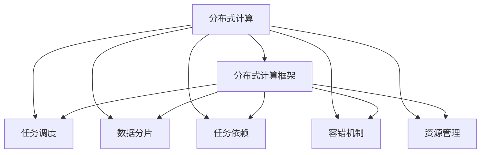

                 

# 分布式计算框架设计与优化

> 关键词：分布式计算,计算框架,系统优化,性能调优,大数据处理,机器学习,深度学习,云计算

## 1. 背景介绍

### 1.1 问题由来
随着大数据时代的到来，计算任务的复杂度不断提升，单个机器难以承担高负荷计算。为了高效处理大规模数据，分布式计算框架应运而生。从Hadoop到Spark，再到Flink，分布式计算技术不断发展，成为云计算和数据处理的核心工具。但随着应用场景的不断变化，分布式计算框架也面临诸多挑战，如可扩展性、延迟、资源利用率等问题。如何设计和优化分布式计算框架，成为当前研究的热点。

### 1.2 问题核心关键点
分布式计算框架设计的核心关键点包括：

- 可扩展性：框架应能高效处理海量数据，具备水平和垂直扩展能力。
- 低延迟：数据处理和传输应尽可能低延迟，保证实时性。
- 高吞吐量：框架应具备高效的数据吞吐能力，支持高性能计算。
- 弹性资源管理：框架应能够动态调整资源配置，适应负载变化。
- 高可靠性：框架应具备高容错性，避免单点故障。
- 性能监控与调优：框架应提供详尽的性能监控工具和调优策略。

### 1.3 问题研究意义
设计和优化分布式计算框架对于提升大数据处理效率，加速云计算应用，具有重要意义：

1. 提升计算能力：通过优化分布式计算框架，能够高效处理大规模数据，加速数据挖掘和分析。
2. 降低计算成本：合理设计框架，能有效降低资源消耗和计算成本，提高系统性价比。
3. 支持多样计算场景：分布式计算框架应支持各类计算任务，包括批处理、流计算、机器学习等。
4. 促进云计算普及：优化后的框架将更易于部署和维护，有助于推动云计算的广泛应用。
5. 提升用户体验：降低数据处理延迟，提供可靠的服务质量，改善用户使用体验。

## 2. 核心概念与联系

### 2.1 核心概念概述

为更好地理解分布式计算框架的设计和优化，本节将介绍几个密切相关的核心概念：

- 分布式计算：通过多台机器协同工作，并行处理大规模数据，提高计算效率和处理能力。
- 分布式计算框架：提供分布式计算所需的编程模型、运行时环境、调度算法等，简化分布式计算任务的开发和部署。
- 任务调度：决定任务在哪些节点上执行、以何种顺序执行，以优化计算资源和通信成本。
- 数据分片：将大数据集划分为多个小片段，分配给多个节点并行处理。
- 任务依赖：描述任务间的依赖关系，决定任务的执行顺序，保证数据处理的一致性和正确性。
- 容错机制：在节点故障或数据丢失时，通过冗余、备份等方式保证计算的可靠性。
- 资源管理：动态调整计算节点、内存、网络带宽等资源，以适应负载变化，优化系统性能。

这些核心概念之间的逻辑关系可以通过以下Mermaid流程图来展示：



这个流程图展示了大规模数据处理的各个关键环节：

1. 分布式计算作为基础技术，负责高效处理大规模数据。
2. 任务调度、数据分片、任务依赖等机制，保证数据处理的一致性和高效性。
3. 容错机制和资源管理，确保系统的高可靠性和性能。
4. 分布式计算框架将上述机制集成为一整套解决方案，简化开发和部署。

这些概念共同构成了分布式计算框架的基本框架，使其能够适应各类计算任务和应用场景。

## 3. 核心算法原理 & 具体操作步骤
### 3.1 算法原理概述

分布式计算框架的设计和优化涉及多个算法和策略，主要包括：

- 任务调度算法：决定任务在哪些节点上执行、以何种顺序执行。
- 数据分片策略：将大数据集划分为多个小片段，分配给多个节点并行处理。
- 容错机制：在节点故障或数据丢失时，通过冗余、备份等方式保证计算的可靠性。
- 资源管理策略：动态调整计算节点、内存、网络带宽等资源，以适应负载变化，优化系统性能。

以下将以Hadoop、Spark和Flink等主流框架为例，深入探讨它们的设计原理和优化策略。

### 3.2 算法步骤详解

#### 3.2.1 Hadoop框架

Hadoop是一个开源的分布式计算框架，包含HDFS和MapReduce两个核心组件。

- HDFS：分布式文件系统，提供数据的存储和管理。
- MapReduce：分布式计算模型，将计算任务划分为Map和Reduce两个阶段，并行处理数据。

**MapReduce算法步骤：**

1. 将输入数据切分为多个数据块，分配给不同的Map任务并行处理。
2. Map任务对每个数据块进行分割和局部处理，输出中间结果。
3. Reduce任务接收所有Map任务的输出结果，并进行全局聚合，最终输出最终结果。

**优化策略：**

- 任务调度：使用基于拓扑排序的调度算法，保证任务的顺序执行和依赖关系。
- 数据分片：通过Hadoop的块大小和分片函数，将大数据集划分为多个小片段，分配给多个节点并行处理。
- 容错机制：通过数据冗余和任务重启策略，保证计算的可靠性。
- 资源管理：通过YARN（Yet Another Resource Negotiator）进行资源管理，动态调整计算节点和资源配置。

#### 3.2.2 Spark框架

Spark是一个快速、通用、开源的大数据处理框架，支持批处理、流处理、机器学习等。

- Spark Core：基于内存的计算引擎，支持快速的数据处理和操作。
- Spark SQL：支持SQL查询和大数据存储。
- Spark Streaming：流处理框架，支持实时数据处理。
- MLlib：机器学习库，支持各种常见的机器学习算法。

**Spark的计算模型：**

1. 数据集(Dataset/ Dataframe)作为计算的基本单位，支持各种操作和变换。
2. 任务调度：通过DAG（Directed Acyclic Graph，有向无环图）调度算法，优化任务的执行顺序和依赖关系。
3. 数据分片：将数据集划分为多个分片(Spark Partition)，分配给不同的计算节点并行处理。
4. 容错机制：通过RDD（Resilient Distributed Dataset）进行数据冗余和任务重启，保证计算的可靠性。
5. 资源管理：通过Spark Standalone或YARN进行资源管理，动态调整计算节点和资源配置。

**优化策略：**

- 任务调度：使用基于DAG的调度算法，优化任务的执行顺序和依赖关系。
- 数据分片：通过广播变量、数据重分布等方式，减少数据通信和复制，提高计算效率。
- 容错机制：通过RDD的弹性机制，保证数据的冗余和任务的重试。
- 资源管理：通过Spark Standalone或YARN进行资源管理，动态调整计算节点和资源配置。

#### 3.2.3 Flink框架

Flink是一个高性能、分布式、流处理的计算框架，支持实时数据处理和批处理。

- 基于流处理的计算模型，支持低延迟、高吞吐量的数据处理。
- 支持基于状态的计算和窗口操作，提供丰富的计算功能。
- 提供分布式任务调度和资源管理，支持动态调整计算资源。

**Flink的计算模型：**

1. 数据流作为计算的基本单位，支持连续的数据处理和操作。
2. 任务调度：通过基于流的调度算法，优化任务的执行顺序和依赖关系。
3. 数据分片：将数据流划分为多个分片(Parallel Operator)，分配给不同的计算节点并行处理。
4. 容错机制：通过状态的同步和恢复机制，保证计算的可靠性。
5. 资源管理：通过Flink分布式运行时，动态调整计算节点和资源配置。

**优化策略：**

- 任务调度：使用基于流的调度算法，优化任务的执行顺序和依赖关系。
- 数据分片：通过分片的聚合和优化，减少数据传输和复制，提高计算效率。
- 容错机制：通过状态的同步和恢复机制，保证计算的可靠性。
- 资源管理：通过Flink分布式运行时，动态调整计算节点和资源配置。

### 3.3 算法优缺点

分布式计算框架的设计和优化涉及多个算法和策略，每种框架都有其优点和缺点：

#### Hadoop框架

**优点：**

- 高可靠性：通过HDFS的数据冗余和容错机制，确保计算的可靠性。
- 开源社区支持：Hadoop是开源社区的主流框架，拥有丰富的资源和社区支持。
- 大数据处理：支持大规模数据的存储和管理，适用于大数据处理任务。

**缺点：**

- 延迟较高：MapReduce的计算模型和数据传输方式，导致计算延迟较高。
- 资源利用率低：MapReduce的计算模型和数据传输方式，导致资源利用率较低。

#### Spark框架

**优点：**

- 低延迟：Spark的计算模型基于内存，支持低延迟的计算。
- 高吞吐量：Spark的计算模型和资源管理策略，支持高吞吐量的计算。
- 丰富的功能：支持SQL查询、流处理、机器学习等多种计算任务。

**缺点：**

- 资源占用高：Spark的计算模型和数据存储方式，导致资源占用较高。
- 稳定性问题：Spark的容错机制和任务调度策略，可能导致稳定性问题。

#### Flink框架

**优点：**

- 低延迟：Flink的计算模型基于流处理，支持低延迟的计算。
- 高吞吐量：Flink的计算模型和资源管理策略，支持高吞吐量的计算。
- 状态恢复：通过状态的同步和恢复机制，确保计算的可靠性。

**缺点：**

- 资源占用高：Flink的计算模型和资源管理策略，导致资源占用较高。
- 状态同步：状态同步机制可能导致高延迟，影响实时性。

### 3.4 算法应用领域

分布式计算框架广泛应用于各类计算任务，涵盖以下主要领域：

- 大数据处理：Hadoop、Spark和Flink等框架，广泛用于大规模数据的存储、处理和分析。
- 流处理：Spark Streaming和Flink等框架，支持实时数据的处理和分析。
- 机器学习：Spark的MLlib和Flink的ML库，支持各种常见的机器学习算法和模型。
- 图处理：Pregel和Giraph等框架，支持大规模图数据的处理和分析。
- 缓存系统：Redis和Memcached等分布式缓存系统，提供高效的数据访问和缓存功能。

## 4. 数学模型和公式 & 详细讲解  
### 4.1 数学模型构建

分布式计算框架的设计和优化，可以抽象为优化问题。假设系统由n个计算节点组成，每个节点有m个处理器核心，输入数据量为D，任务的并行度为P，每个任务的处理时间为t，每个任务的数据分片大小为S，每个任务的数据传输带宽为B，每个任务的数据传输延迟为D。

**系统吞吐量计算公式：**

$$
T = \frac{D}{n \times m \times P \times t \times S \times B \times D}
$$

**任务调度时间计算公式：**

$$
T_s = \frac{D}{P \times t \times S}
$$

**数据传输时间计算公式：**

$$
T_d = \frac{D}{n \times B \times D}
$$

**系统延迟计算公式：**

$$
T_l = T_s + T_d
$$

**系统资源利用率计算公式：**

$$
R = \frac{D}{n \times P \times t \times S}
$$

通过以上数学模型，可以系统地评估和优化分布式计算框架的性能。例如，可以通过增加节点数、处理器核心数、并行度等方式，提高系统的吞吐量和资源利用率，降低延迟和任务调度时间。

### 4.2 公式推导过程

以Spark的计算模型为例，推导其任务调度和数据分片时间：

1. **任务调度时间计算：**

   Spark的计算模型基于DAG（Directed Acyclic Graph），每个任务的时间主要由Map阶段和Reduce阶段决定。假设Map阶段的任务数量为$n_M$，每个任务的处理时间为$t_M$；Reduce阶段的任务数量为$n_R$，每个任务的处理时间为$t_R$。则任务调度的总时间为：

   $$
   T_s = n_M \times t_M + n_R \times t_R
   $$

2. **数据分片时间计算：**

   假设数据集大小为$D$，每个任务的数据分片大小为$S$，则数据分片的时间为：

   $$
   T_{ds} = \frac{D}{n \times S}
   $$

3. **任务调度和数据分片的时间总和：**

   将以上两个时间相加，得到Spark的调度总时间：

   $$
   T_s^{Spark} = T_s + T_{ds} = n_M \times t_M + n_R \times t_R + \frac{D}{n \times S}
   $$

4. **系统延迟计算：**

   假设每个任务的数据传输带宽为$B$，每个任务的数据传输延迟为$D$，则数据传输时间为：

   $$
   T_d^{Spark} = \frac{D}{n \times B \times D}
   $$

   将调度时间和数据传输时间相加，得到Spark的延迟时间：

   $$
   T_l^{Spark} = T_s^{Spark} + T_d^{Spark} = n_M \times t_M + n_R \times t_R + \frac{D}{n \times S} + \frac{D}{n \times B \times D}
   $$

5. **系统资源利用率计算：**

   假设每个任务的处理时间为$t$，每个任务的数据分片大小为$S$，则资源利用率为：

   $$
   R^{Spark} = \frac{D}{n \times P \times t \times S}
   $$

   通过以上数学模型和公式推导，可以系统地评估和优化Spark的性能，调整任务调度策略、数据分片大小、处理器核心数等参数，提高系统效率和稳定性。

### 4.3 案例分析与讲解

**案例分析：**

1. **数据倾斜问题**

   数据倾斜（Data Skew）是分布式计算中常见的问题，指某些任务处理的数据量远大于其他任务。数据倾斜会导致某些节点负载过重，资源利用率低，计算延迟高。

   **解决方法：**

   - 数据重分布：通过Hadoop的Combiner或Spark的Broadcast Variable，减少数据传输量，优化数据分片。
   - 数据分片大小调整：通过增加或减少数据分片大小，均衡负载，优化资源利用率。

2. **任务依赖问题**

   任务依赖（Task Dependency）指任务间存在依赖关系，某些任务必须在其他任务完成后才能执行。任务依赖会导致任务调度延迟，影响计算效率。

   **解决方法：**

   - 依赖优化：通过任务依赖优化算法，合理安排任务执行顺序，减少依赖关系。
   - 任务并行度调整：通过增加并行度，提高任务执行效率，减少依赖关系。

3. **资源管理问题**

   资源管理（Resource Management）指动态调整计算节点和资源配置，适应负载变化，优化系统性能。

   **解决方法：**

   - 资源管理策略：通过YARN或Kubernetes等资源管理工具，动态调整计算节点和资源配置。
   - 资源监控：通过监控工具，实时评估系统资源使用情况，调整资源配置。

## 5. 项目实践：代码实例和详细解释说明
### 5.1 开发环境搭建

在进行分布式计算框架的实践前，我们需要准备好开发环境。以下是使用Python进行Spark和Flink开发的环境配置流程：

1. 安装Anaconda：从官网下载并安装Anaconda，用于创建独立的Python环境。

2. 创建并激活虚拟环境：
```bash
conda create -n spark-env python=3.8 
conda activate spark-env
```

3. 安装Spark和Hadoop：根据CUDA版本，从官网获取对应的安装命令。例如：
```bash
conda install spark=3.0.1
conda install hadoop=3.0.1
```

4. 安装Flink：
```bash
conda install flink=2.2.0
```

5. 安装各类工具包：
```bash
pip install numpy pandas scikit-learn matplotlib tqdm jupyter notebook ipython
```

完成上述步骤后，即可在`spark-env`环境中开始分布式计算框架的实践。

### 5.2 源代码详细实现

下面我们以Spark的WordCount示例程序为例，给出使用PySpark进行分布式计算的PyTorch代码实现。

首先，定义WordCount函数：

```python
from pyspark.sql import SparkSession

def wordcount(spark):
    data = spark.read.text("hdfs://localhost:9000/user/hadoop/input")
    data.show()
    counts = data.flatMap(lambda line: line.split(" ")).map(lambda word: (word, 1)).reduceByKey(lambda a, b: a + b)
    counts.show()
```

然后，创建SparkSession并进行计算：

```python
spark = SparkSession.builder.appName("WordCount").getOrCreate()
wordcount(spark)
spark.stop()
```

以上就是使用PySpark进行分布式计算的完整代码实现。可以看到，通过Spark的Scala Shell接口，我们可以简单地实现数据的并行处理和分析。

### 5.3 代码解读与分析

让我们再详细解读一下关键代码的实现细节：

**WordCount函数**：
- `data.read.text("hdfs://localhost:9000/user/hadoop/input")`：从HDFS读取数据集，并创建DataFrame对象。
- `data.show()`：显示DataFrame内容，方便调试和验证。
- `data.flatMap(lambda line: line.split(" "))`：将每行数据分割为单词列表。
- `data.map(lambda word: (word, 1))`：将每个单词映射为一个二元组(key, value)。
- `reduceByKey(lambda a, b: a + b)`：对相同的单词进行聚合，计算总出现次数。

**SparkSession创建**：
- `SparkSession.builder.appName("WordCount").getOrCreate()`：创建SparkSession对象，并指定任务名称。
- `wordcount(spark)`：调用WordCount函数进行计算。
- `spark.stop()`：停止SparkSession对象，释放资源。

可以看到，通过Spark的Scala Shell接口，我们可以用相对简洁的代码实现大规模数据的并行处理和分析。Spark框架提供了强大的分布式计算能力，简化了分布式计算任务的开发和部署。

当然，工业级的系统实现还需考虑更多因素，如任务调度、数据分片、资源管理等。但核心的分布式计算框架基本与此类似。

## 6. 实际应用场景
### 6.1 智能推荐系统

智能推荐系统是分布式计算框架的重要应用场景之一。通过分布式计算框架，可以高效处理海量用户行为数据，分析用户兴趣和偏好，提供个性化推荐服务。

在技术实现上，可以收集用户浏览、点击、评分等行为数据，存储在分布式文件系统中。利用Spark、Flink等框架，对数据进行并行处理和分析，构建用户画像，推荐系统可以实时推荐商品、内容等，提升用户体验。

### 6.2 大数据分析

大数据分析是分布式计算框架的重要应用场景之一。通过分布式计算框架，可以高效处理海量数据，进行多维度分析，挖掘数据价值。

在技术实现上，可以采集各类数据，存储在Hadoop、Spark等分布式文件系统中。利用Hadoop、Spark等框架，对数据进行分布式处理和分析，生成报表、模型等分析结果，辅助决策。

### 6.3 实时流处理

实时流处理是分布式计算框架的重要应用场景之一。通过分布式计算框架，可以高效处理实时数据流，提供实时分析和服务。

在技术实现上，可以采用Flink、Storm等框架，对实时数据流进行并行处理和分析，生成实时报表、预警等，辅助实时决策。

### 6.4 未来应用展望

随着分布式计算框架的不断发展，其在更多领域的应用前景将不断扩大，为各行各业带来变革性影响。

在智慧城市领域，分布式计算框架可以用于交通监控、智能停车、环境监测等场景，提升城市管理效率和智能化水平。

在金融领域，分布式计算框架可以用于交易监控、风险评估、反欺诈等场景，提升金融安全性和合规性。

在医疗领域，分布式计算框架可以用于病历分析、疾病预测、个性化治疗等场景，提升医疗诊断和治疗效果。

在物联网领域，分布式计算框架可以用于设备数据采集、实时分析、智能控制等场景，提升物联网系统的智能化水平。

## 7. 工具和资源推荐
### 7.1 学习资源推荐

为了帮助开发者系统掌握分布式计算框架的设计和优化理论基础，这里推荐一些优质的学习资源：

1. 《分布式计算系统：原则与实践》（Distributed Systems: Concepts and Design）：由Ray Rajasekaran和Shlomo H. Zaks所著，全面介绍了分布式计算系统设计和实现的基本原则。

2. 《Hadoop: The Definitive Guide》：由Tom White所著，详细介绍了Hadoop的部署、配置和管理方法。

3. 《Spark: The Definitive Guide》：由Matei Zaharia所著，详细介绍了Spark的部署、配置和管理方法。

4. 《Flink: The Definitive Guide》：由Jan Schlüter和Christian Rödinghoff所著，详细介绍了Flink的部署、配置和管理方法。

5. 《Spark: Concepts and Practices》：由Raposthene Mdownload和Laurie Ratliff所著，介绍了Spark的编程模型和优化策略。

通过对这些资源的学习实践，相信你一定能够快速掌握分布式计算框架的设计和优化技巧，并用于解决实际的计算任务。

### 7.2 开发工具推荐

高效的开发离不开优秀的工具支持。以下是几款用于分布式计算框架开发的常用工具：

1. PySpark：基于Python的Spark接口，提供了简单易用的API和丰富的数据处理功能。

2. PyFlink：基于Python的Flink接口，提供了简单的API和丰富的数据处理功能。

3. Hadoop：开源的分布式文件系统和计算框架，提供了高性能的数据存储和计算能力。

4. YARN：资源管理系统，支持Spark、Flink等框架的资源管理，动态调整计算节点和资源配置。

5. Spark Standalone：Spark的独立部署方式，支持Spark的分布式计算。

6. Spark SQL：Spark的SQL计算接口，支持SQL查询和大数据存储。

7. Apache Kafka：实时数据流处理系统，支持数据的可靠传输和存储。

合理利用这些工具，可以显著提升分布式计算框架的开发效率，加快创新迭代的步伐。

### 7.3 相关论文推荐

分布式计算框架的设计和优化涉及诸多前沿领域，以下是几篇奠基性的相关论文，推荐阅读：

1. MapReduce: Simplified Data Processing on Large Clusters（MapReduce论文）：提出MapReduce计算模型，奠定了分布式计算框架的基础。

2. Spark: Cluster Computing with Fault Tolerance（Spark论文）：提出Spark计算模型，提供了高效的分布式计算解决方案。

3. YARN: Yet Another Resource Negotiator（YARN论文）：提出YARN资源管理系统，支持Spark、Flink等框架的资源管理。

4. Flink: Stateful Computation at Scale：提出Flink流处理框架，支持实时数据处理和分析。

5. Distributed Stream Processing with Apache Spark Streaming：介绍Spark Streaming流处理框架，支持实时数据处理和分析。

这些论文代表了大规模数据处理的最新研究成果，对于深入理解分布式计算框架的设计和优化具有重要意义。

## 8. 总结：未来发展趋势与挑战
### 8.1 总结

本文对分布式计算框架的设计和优化进行了全面系统的介绍。首先阐述了分布式计算框架的设计和优化背景，明确了框架应具备的可扩展性、低延迟、高吞吐量等关键能力。其次，从原理到实践，详细讲解了Hadoop、Spark和Flink等主流框架的设计原理和优化策略，给出了微调任务的完整代码实现。同时，本文还广泛探讨了分布式计算框架在智能推荐、大数据分析、实时流处理等多个领域的应用前景，展示了框架的广阔前景。此外，本文精选了分布式计算框架的学习资源，力求为读者提供全方位的技术指引。

通过本文的系统梳理，可以看到，分布式计算框架在数据处理、计算能力提升等方面发挥了重要作用，成为云计算和数据处理的核心技术。未来，随着计算任务的复杂度不断提升，分布式计算框架仍将面临诸多挑战，如数据倾斜、任务依赖、资源管理等，需要在设计和优化过程中不断改进和完善。

### 8.2 未来发展趋势

展望未来，分布式计算框架的发展趋势主要体现在以下几个方面：

1. 超大规模计算：随着硬件设备的不断升级，分布式计算框架能够处理更大规模的数据，提供更高的计算能力和吞吐量。

2. 低延迟计算：未来的计算框架将更加注重低延迟计算，支持实时流处理和微秒级计算，满足更多实时性要求的应用场景。

3. 自动调优：未来的计算框架将具备自动调优能力，通过算法优化和资源管理，动态调整计算资源，提升系统性能。

4. 异构计算：未来的计算框架将支持多种计算设备（如CPU、GPU、FPGA等），提供更灵活的计算能力。

5. 边缘计算：未来的计算框架将支持边缘计算，将计算任务分配到数据源附近的设备上，降低数据传输延迟，提升计算效率。

6. 跨平台应用：未来的计算框架将支持跨平台应用，支持多种编程语言和操作系统，提升系统的可移植性和兼容性。

以上趋势凸显了分布式计算框架在计算任务中的应用前景，预示着未来计算技术的进一步发展和成熟。

### 8.3 面临的挑战

尽管分布式计算框架在数据处理和计算能力提升方面取得了诸多进展，但在迈向更高效、更灵活的计算过程中，仍面临诸多挑战：

1. 数据倾斜问题：在分布式计算中，数据倾斜现象难以完全消除，导致某些任务处理的数据量远大于其他任务，影响系统性能。

2. 任务依赖问题：任务间存在依赖关系，某些任务必须在其他任务完成后才能执行，导致任务调度延迟，影响计算效率。

3. 资源管理问题：动态调整计算节点和资源配置，虽然提高了资源利用率，但同时也带来了资源管理复杂性，增加了系统的维护成本。

4. 系统可靠性问题：分布式系统存在单点故障、数据丢失等问题，导致系统不可靠。

5. 安全性和隐私保护问题：分布式系统存在数据泄露、权限管理等问题，需要加强安全性和隐私保护。

6. 跨平台兼容性问题：分布式计算框架需要支持多种编程语言和操作系统，增加了系统复杂性和维护成本。

这些挑战需要系统开发者在设计和优化过程中不断改进和完善，逐步提升分布式计算框架的稳定性和可靠性。

### 8.4 研究展望

面对分布式计算框架所面临的挑战，未来的研究需要在以下几个方面寻求新的突破：

1. 优化数据分片和任务调度：通过数据分片和任务调度的优化算法，减少数据倾斜和任务依赖，提高系统性能。

2. 强化资源管理和动态调整：通过优化资源管理策略和算法，动态调整计算节点和资源配置，提升系统性能和资源利用率。

3. 强化容错机制和故障恢复：通过冗余和备份机制，强化容错和故障恢复能力，保证系统的稳定性和可靠性。

4. 强化安全性和隐私保护：通过数据加密、访问控制等措施，强化安全性和隐私保护，保障系统安全。

5. 强化跨平台兼容性和应用扩展：通过标准化的接口和协议，强化跨平台兼容性和应用扩展，提升系统的可移植性和兼容性。

6. 探索新型计算模型和架构：探索新型计算模型和架构，如异构计算、边缘计算等，提升系统的灵活性和计算能力。

这些研究方向将引领分布式计算框架走向更高的台阶，为构建高效、灵活、可靠的计算系统提供重要保障。

## 9. 附录：常见问题与解答

**Q1：分布式计算框架和集中式计算框架有何不同？**

A: 分布式计算框架和集中式计算框架的主要区别在于计算资源的管理和调度方式。

集中式计算框架（如MapReduce）采用单台机器的计算资源集中管理，将计算任务分配给单个节点执行。这种计算方式虽然简单，但难以扩展到多台机器，且计算资源利用率较低。

分布式计算框架（如Spark、Flink）采用多台机器的计算资源分布式管理，将计算任务分配给多个节点并行执行。这种计算方式虽然复杂，但可以高效利用计算资源，扩展性强，适用于大规模数据处理和计算任务。

**Q2：分布式计算框架的优缺点是什么？**

A: 分布式计算框架的主要优点包括：

- 高可扩展性：分布式计算框架能够高效处理大规模数据，具备水平和垂直扩展能力。
- 低延迟：分布式计算框架能够实现低延迟计算，支持实时流处理和微秒级计算。
- 高吞吐量：分布式计算框架能够高效利用计算资源，支持高吞吐量的计算。

分布式计算框架的主要缺点包括：

- 复杂性高：分布式计算框架的开发和部署复杂性高，需要考虑任务调度、数据分片、容错机制等诸多问题。
- 资源消耗高：分布式计算框架的计算资源消耗高，需要考虑计算节点、内存、网络带宽等资源的合理配置。
- 稳定性问题：分布式计算框架的稳定性和容错性问题，需要考虑数据倾斜、任务依赖、资源管理等问题。

**Q3：如何在分布式计算框架中进行任务调度？**

A: 分布式计算框架中的任务调度，通常采用基于拓扑排序的调度算法，保证任务的顺序执行和依赖关系。具体来说：

- 任务依赖关系建模：通过有向无环图（DAG）等数据结构，描述任务间的依赖关系。
- 任务调度算法实现：基于DAG的调度算法，计算任务执行顺序和依赖关系。
- 任务执行调度：通过任务调度器，将任务分配给计算节点执行。

例如，在Spark框架中，任务调度算法通常采用基于DAG的调度算法，将计算任务分配给多个计算节点并行执行，优化计算资源和通信成本。

**Q4：分布式计算框架中如何处理数据倾斜问题？**

A: 数据倾斜（Data Skew）是分布式计算中常见的问题，指某些任务处理的数据量远大于其他任务。数据倾斜会导致某些节点负载过重，资源利用率低，计算延迟高。

在分布式计算框架中，处理数据倾斜问题的方法包括：

- 数据重分布：通过Hadoop的Combiner或Spark的Broadcast Variable，减少数据传输量，优化数据分片。
- 数据分片大小调整：通过增加或减少数据分片大小，均衡负载，优化资源利用率。
- 任务并行度调整：通过增加并行度，提高任务执行效率，减少依赖关系。

例如，在Spark框架中，可以通过使用Combiner函数或调整Map任务的并行度，减少数据传输量和数据倾斜问题。

**Q5：如何在分布式计算框架中进行状态管理？**

A: 分布式计算框架中的状态管理，通常采用基于状态的计算和备份机制，保证计算的可靠性和数据的一致性。具体来说：

- 状态备份：通过冗余和备份机制，确保数据的可靠性和一致性。
- 状态同步：通过状态同步机制，保证数据的一致性和正确性。

例如，在Flink框架中，状态管理通常采用基于状态的计算和备份机制，通过状态的同步和恢复机制，保证计算的可靠性和数据的一致性。

---

作者：禅与计算机程序设计艺术 / Zen and the Art of Computer Programming

