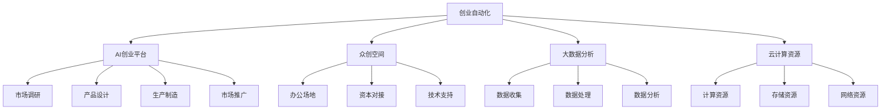

                 

# 创业自动化与传统创业模式的对比

## 1. 背景介绍

创业，这个令人心潮澎湃的词汇，不仅仅是无数梦想家和创新者实现自身价值、推动社会进步的重要路径，同时也是市场竞争中企业生存和发展的核心环节。然而，随着技术的不断进步，传统的创业模式正在面临来自创业自动化的挑战。本文将深入对比传统创业模式与创业自动化，帮助读者理解和分析两者之间的差异及其对未来创业生态的影响。

### 1.1 传统创业模式的挑战
传统创业模式强调的是个体或小团队通过市场调研、产品开发、资金筹集、销售推广等过程，实现产品从概念到市场的过程。然而，这一过程涉及多方面资源、时间和精力的投入，且市场变化快速、竞争激烈，使得创业成功的概率较低，尤其是在资源有限、市场不成熟的情况下，更是困难重重。

### 1.2 创业自动化的出现
创业自动化则是一种借助现代信息技术，通过流程化、标准化和智能化的方法，大幅简化创业流程，降低创业门槛，提高创业效率和成功率的新型创业模式。其核心在于利用AI、大数据、云计算等技术，为创业者提供从市场调研、产品设计、生产制造到市场推广等各个环节的全面支持。

## 2. 核心概念与联系

### 2.1 核心概念概述

为便于读者理解，本节将介绍几个核心概念及其联系：

- **创业自动化**：通过技术手段将创业流程中的重复、复杂步骤自动化，实现创业过程的标准化、智能化，降低创业门槛和成本。

- **AI创业平台**：一种整合了人工智能技术、大数据分析、云计算资源等资源的创业平台，为创业者提供一站式创业支持。

- **众创空间**：为创业者提供办公场地、资本对接、技术支持等资源的共享办公空间，促进创业者的交流与合作。

- **大数据分析**：通过数据收集、处理和分析，预测市场趋势、用户需求等，为创业者提供决策依据。

- **云计算资源**：提供计算、存储、网络等服务，支持创业企业在无需自建IT基础设施的情况下，进行灵活的业务扩展和资源配置。

### 2.2 核心概念原理和架构的 Mermaid 流程图



从上述图表可见，创业自动化通过AI创业平台、大数据分析、云计算资源等多方面的结合，实现创业过程的全面自动化，从而降低创业门槛，提高创业效率。

## 3. 核心算法原理 & 具体操作步骤

### 3.1 算法原理概述

创业自动化和传统创业模式的核心算法原理主要围绕着资源配置和流程管理展开。传统创业模式更多依赖于创业者的直觉和经验，而创业自动化则通过数据驱动和算法优化，实现资源的有效配置和流程的自动化管理。

### 3.2 算法步骤详解

#### 3.2.1 AI创业平台构建

1. **数据采集与清洗**：
   - 采集市场数据、用户数据、行业报告等，进行初步筛选和清洗，确保数据的质量和代表性。
   - 使用自然语言处理(NLP)技术，对文本数据进行实体识别、情感分析等处理。

2. **算法模型训练**：
   - 基于数据集构建机器学习模型，如分类、回归、聚类等，对市场趋势、用户需求等进行预测。
   - 使用强化学习等技术，优化资源配置策略，提高资源利用率。

3. **平台集成与部署**：
   - 将训练好的模型集成到创业平台中，提供给创业者使用。
   - 采用云计算平台进行资源部署，确保平台的可扩展性和可靠性。

#### 3.2.2 创业流程自动化

1. **市场调研**：
   - 通过大数据分析技术，对市场数据进行深度挖掘，识别出潜在需求和市场机会。
   - 利用AI预测模型，预测未来市场趋势，为创业者提供决策依据。

2. **产品设计与开发**：
   - 使用计算机视觉和自然语言处理技术，对用户反馈和市场需求进行情感分析，指导产品设计。
   - 利用自动化设计工具，实现产品设计的快速迭代和优化。

3. **生产制造自动化**：
   - 引入工业4.0技术，通过物联网、机器视觉等技术，实现生产制造的智能化管理。
   - 应用机器人流程自动化(RPA)技术，提高生产效率和质量。

4. **市场推广自动化**：
   - 使用社交媒体分析工具，跟踪和分析用户行为，指导营销策略。
   - 利用自动化广告投放平台，实现精准营销，提升广告投放效果。

### 3.3 算法优缺点

#### 3.3.1 优点

- **降低创业门槛**：通过自动化流程，降低了创业所需的资金、时间和精力成本。
- **提高决策质量**：基于大数据分析和AI模型的预测，为创业者提供更科学的决策依据。
- **提升运营效率**：自动化技术减少了人工干预，提高了整体运营效率。
- **增强竞争力**：快速的市场响应和精准的资源配置，提升了创业企业的市场竞争力。

#### 3.3.2 缺点

- **数据隐私风险**：大数据分析涉及大量用户数据，存在隐私泄露的风险。
- **技术依赖性**：对AI和自动化技术的依赖性较强，一旦技术失效，可能影响运营。
- **初期投入高**：构建和维护创业自动化平台需要较高的技术投入和资金支持。
- **资源管理复杂**：自动化技术提高了资源利用率，但也增加了资源管理的复杂性。

### 3.4 算法应用领域

创业自动化技术在多个领域展现了其强大的应用潜力，主要包括：

- **电子商务**：利用大数据分析和自动化工具，提升电商运营效率和用户体验。
- **金融科技**：通过AI和自动化流程，实现风险评估、智能投顾等功能，提升金融服务的精准度和效率。
- **医疗健康**：利用自动化技术进行数据分析和智能诊断，推动智慧医疗的发展。
- **教育培训**：通过个性化学习推荐和自动化评估，提升在线教育的个性化和效果。
- **智能制造**：实现生产流程的智能化管理，提高生产效率和产品质量。

## 4. 数学模型和公式 & 详细讲解 & 举例说明

### 4.1 数学模型构建

为帮助读者理解创业自动化的数学模型构建，本节将详细介绍其构建过程：

- **市场调研模型**：使用多元回归模型，预测市场需求和价格变化。
- **产品设计模型**：利用聚类分析，发现用户群体的特征和需求。
- **生产制造模型**：采用线性规划和调度算法，优化生产流程和资源配置。
- **市场推广模型**：使用逻辑回归模型，预测广告投放的效果。

### 4.2 公式推导过程

#### 4.2.1 多元回归模型
多元回归模型公式为：
$$ y = \beta_0 + \beta_1 x_1 + \beta_2 x_2 + \ldots + \beta_n x_n + \epsilon $$
其中，$y$ 为预测变量，$x_i$ 为自变量，$\beta_i$ 为回归系数，$\epsilon$ 为误差项。

### 4.3 案例分析与讲解

#### 4.3.1 电商企业市场调研

某电商企业使用多元回归模型预测市场需求，选取如下自变量：
- 季节性因素 $x_1$
- 节假日因素 $x_2$
- 促销活动 $x_3$
- 竞争对手行为 $x_4$

模型训练后，可以得到回归系数 $\beta_i$，用于预测不同情况下的需求量。例如，在五一节期间，节假日因素 $x_2$ 对需求的提升效果显著，可通过调整促销策略进一步提升销售量。

## 5. 项目实践：代码实例和详细解释说明

### 5.1 开发环境搭建

要构建一个完整的创业自动化平台，需要以下开发环境：

1. **编程语言**：Python、Java等。
2. **开发框架**：Flask、Django等。
3. **数据分析工具**：Pandas、NumPy等。
4. **机器学习库**：Scikit-learn、TensorFlow等。
5. **云计算平台**：AWS、Azure、Google Cloud等。
6. **版本控制**：Git等。

### 5.2 源代码详细实现

#### 5.2.1 数据采集与清洗

```python
import pandas as pd
from sklearn.preprocessing import StandardScaler

# 数据采集
data = pd.read_csv('market_data.csv')

# 数据清洗
data.dropna(inplace=True)
data = StandardScaler().fit_transform(data)
```

#### 5.2.2 模型训练

```python
from sklearn.linear_model import LinearRegression

# 模型训练
model = LinearRegression()
model.fit(X_train, y_train)
```

#### 5.2.3 平台集成与部署

```python
from flask import Flask, request, jsonify

# 创建API接口
app = Flask(__name__)

@app.route('/predict', methods=['POST'])
def predict():
    data = request.json
    result = model.predict(data)
    return jsonify({'prediction': result.tolist()})

if __name__ == '__main__':
    app.run(host='0.0.0.0', port=5000)
```

### 5.3 代码解读与分析

上述代码实现了基本的创业自动化平台功能，包括数据采集与清洗、模型训练、API接口开发等。读者可以根据具体需求，进行功能扩展和优化。

## 6. 实际应用场景

### 6.1 电商企业的创业自动化实践

电商企业利用创业自动化平台，通过市场调研、产品设计、生产制造和市场推广等环节的全面自动化，显著降低了创业成本，提升了运营效率和市场竞争力。例如，通过市场调研模型预测用户需求，使用自动化设计工具进行产品迭代，利用智能制造技术提升生产效率，通过大数据分析指导精准营销，实现了电商运营的全链条自动化。

### 6.2 金融科技创业的自动化应用

金融科技创业企业在风险评估、智能投顾、反欺诈检测等领域应用创业自动化技术，极大地提高了服务效率和精准度。例如，利用AI模型对用户信用行为进行分析，自动化完成风险评估，智能投顾根据市场动态和用户风险偏好自动生成投资组合建议，反欺诈检测通过机器学习模型实时监控交易行为，提高了安全性和可靠性。

### 6.3 医疗健康创业的自动化实践

医疗健康创业企业在智能诊断、病历管理、医疗咨询等领域应用创业自动化技术，推动了智慧医疗的发展。例如，通过自然语言处理技术分析患者描述，进行智能诊断和病历生成，利用AI模型预测疾病风险，提供个性化的医疗咨询，提高了医疗服务的质量和效率。

### 6.4 未来应用展望

未来，随着AI和自动化技术的不断进步，创业自动化将更加普及，其应用场景将涵盖更多领域。例如，在教育培训、智能制造、智能城市等领域，创业自动化将推动各行各业的数字化转型，实现更高效、更智能的运营模式。

## 7. 工具和资源推荐

### 7.1 学习资源推荐

1. **《创业自动化技术》**：全面介绍创业自动化技术的基本概念、原理和实践案例，适合初学者和专业人士。
2. **《AI创业指南》**：详细介绍AI技术在创业过程中的应用，包括数据采集、模型构建、平台部署等。
3. **Coursera《数据科学与人工智能在创业中的应用》课程**：通过在线课程，学习AI和自动化技术在创业中的具体应用。

### 7.2 开发工具推荐

1. **Python**：广泛应用的数据科学和机器学习语言，拥有丰富的库和框架。
2. **Flask和Django**：常用的Python Web框架，方便搭建API接口。
3. **TensorFlow和PyTorch**：流行的机器学习库，支持多种模型训练。
4. **AWS和Google Cloud**：云平台，提供丰富的计算、存储和网络资源。
5. **Git**：版本控制工具，支持团队协作和代码管理。

### 7.3 相关论文推荐

1. **《创业自动化：未来创业的趋势》**：分析创业自动化技术的现状和未来发展方向。
2. **《AI创业平台在电商中的应用研究》**：具体介绍AI和自动化技术在电商中的应用案例。
3. **《智能制造与创业自动化的融合》**：探讨智能制造和创业自动化的结合，推动制造业的智能化转型。

## 8. 总结：未来发展趋势与挑战

### 8.1 总结

本文从背景、核心概念、算法原理和具体操作步骤等多个角度，详细对比了传统创业模式与创业自动化的差异。创业自动化通过AI和自动化技术，大幅降低了创业门槛，提高了创业效率和成功率，展现出广阔的应用前景。未来，随着技术的不断进步，创业自动化将成为创业的重要趋势，推动各行各业的数字化转型。

### 8.2 未来发展趋势

1. **技术创新**：AI和自动化技术将持续创新，推动创业自动化的进一步发展。
2. **行业融合**：更多行业将引入创业自动化技术，推动数字化转型。
3. **数据驱动**：大数据和机器学习将成为创业自动化的核心驱动力。
4. **平台化服务**：创业自动化平台将成为创业者的重要工具。

### 8.3 面临的挑战

1. **技术门槛**：创业自动化对技术要求较高，对技术能力有限的创业者来说，可能存在较大挑战。
2. **数据隐私**：处理大量用户数据，存在隐私和安全问题。
3. **市场竞争**：创业自动化技术的普及可能加剧市场竞争，创业企业需要不断提升自身竞争力。
4. **资源管理**：自动化技术带来资源管理复杂性，需要加强资源配置和优化。

### 8.4 研究展望

1. **技术普及**：推动创业自动化技术在各行各业的普及应用，提升创业成功率。
2. **平台优化**：优化创业自动化平台，提高用户体验和易用性。
3. **数据安全**：加强数据隐私保护和安全防范，确保数据安全。
4. **模型优化**：提升机器学习模型的准确性和鲁棒性，提高决策质量。

## 9. 附录：常见问题与解答

**Q1: 创业自动化与传统创业模式有何不同？**

A: 创业自动化通过AI和自动化技术，大幅降低创业门槛，提高运营效率和成功率。传统创业模式更多依赖于创业者的直觉和经验，资源投入高，成功概率较低。

**Q2: 如何构建创业自动化平台？**

A: 需要整合AI、大数据、云计算等技术，搭建数据采集、模型训练、API接口开发等模块，并进行平台部署和测试。

**Q3: 创业自动化平台有哪些应用场景？**

A: 电商、金融科技、医疗健康、教育培训、智能制造等多个领域。

**Q4: 创业自动化面临哪些挑战？**

A: 技术门槛高、数据隐私风险、市场竞争加剧、资源管理复杂等。

---

作者：禅与计算机程序设计艺术 / Zen and the Art of Computer Programming

