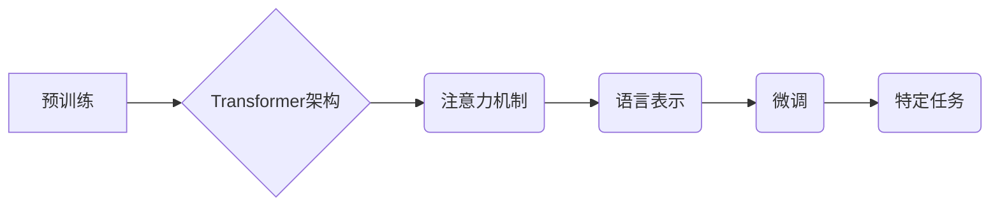

> 大语言模型，Transformer，自然语言处理，深度学习，预训练，微调，局限性

## 1. 背景介绍

近年来，大语言模型（Large Language Models，LLMs）在自然语言处理（Natural Language Processing，NLP）领域取得了令人瞩目的成就。从文本生成、翻译到问答和代码编写，LLMs展现出强大的能力，深刻地改变了我们与语言交互的方式。

这些模型的成功离不开深度学习技术的进步，特别是Transformer架构的提出。Transformer引入了注意力机制，有效解决了传统RNN模型在处理长文本序列时的梯度消失问题，为LLMs的发展奠定了坚实的基础。

然而，尽管LLMs取得了显著进展，但它们也面临着诸多挑战和局限性。本文将深入探讨LLMs的原理、工程实践以及目前存在的局限性，并展望未来发展趋势。

## 2. 核心概念与联系

大语言模型的核心概念包括：

* **Transformer架构:** Transformer是一种基于注意力机制的神经网络架构，能够有效处理长文本序列。

* **预训练:** 预训练是指在大量文本数据上训练模型，学习语言的通用表示。

* **微调:** 微调是指在特定任务数据上对预训练模型进行进一步训练，以提高其在该任务上的性能。

* **注意力机制:** 注意力机制允许模型关注输入序列中与当前任务相关的部分，提高了模型的理解能力。

**Mermaid 流程图:**



## 3. 核心算法原理 & 具体操作步骤

### 3.1  算法原理概述

Transformer架构的核心是注意力机制和多头注意力机制。注意力机制允许模型在处理文本序列时，根据上下文信息对不同词语赋予不同的权重，从而更好地理解句子含义。多头注意力机制则通过使用多个注意力头，捕捉不同层次的语义信息。

### 3.2  算法步骤详解

1. **输入嵌入:** 将输入文本序列中的每个词语转换为向量表示。

2. **多头注意力:** 使用多头注意力机制计算每个词语与其他词语之间的关系，生成注意力权重。

3. **前馈神经网络:** 对每个词语的嵌入向量进行线性变换和非线性激活，进一步提取语义信息。

4. **位置编码:** 将词语在序列中的位置信息编码到向量中，因为Transformer模型没有循环结构，无法直接捕捉词语的顺序信息。

5. **堆叠Transformer层:** 将多个Transformer层堆叠在一起，形成深度网络，进一步提取语义信息。

6. **输出层:** 将最终的隐藏状态转换为输出向量，用于预测下一个词语或完成其他任务。

### 3.3  算法优缺点

**优点:**

* 能够有效处理长文本序列。
* 捕捉不同层次的语义信息。
* 训练效率高。

**缺点:**

* 计算量大，需要大量的计算资源。
* 对训练数据质量要求高。
* 容易出现过拟合问题。

### 3.4  算法应用领域

* 文本生成
* 机器翻译
* 问答系统
* 代码生成
* 文本摘要

## 4. 数学模型和公式 & 详细讲解 & 举例说明

### 4.1  数学模型构建

Transformer模型的数学模型主要包括以下几个部分：

* **嵌入层:** 将词语转换为向量表示。

* **注意力层:** 计算每个词语与其他词语之间的关系。

* **前馈神经网络层:** 对每个词语的嵌入向量进行线性变换和非线性激活。

* **位置编码层:** 将词语在序列中的位置信息编码到向量中。

### 4.2  公式推导过程

**注意力机制公式:**

$$
Attention(Q, K, V) = softmax(\frac{QK^T}{\sqrt{d_k}})V
$$

其中：

* $Q$：查询矩阵
* $K$：键矩阵
* $V$：值矩阵
* $d_k$：键向量的维度

**多头注意力机制公式:**

$$
MultiHead(Q, K, V) = Concat(head_1, head_2, ..., head_h)W_O
$$

其中：

* $head_i$：第 $i$ 个注意力头的输出
* $h$：注意力头的数量
* $W_O$：最终输出层的权重矩阵

### 4.3  案例分析与讲解

**举例说明:**

假设我们有一个句子 "The cat sat on the mat"，我们要计算每个词语与其他词语之间的关系。

1. 将每个词语转换为向量表示。

2. 计算每个词语与其他词语之间的注意力权重。

3. 根据注意力权重，计算每个词语的加权平均值，作为该词语的上下文表示。

## 5. 项目实践：代码实例和详细解释说明

### 5.1  开发环境搭建

* Python 3.7+
* PyTorch 1.7+
* CUDA 10.2+

### 5.2  源代码详细实现

```python
import torch
import torch.nn as nn

class Transformer(nn.Module):
    def __init__(self, vocab_size, embedding_dim, num_heads, num_layers):
        super(Transformer, self).__init__()
        self.embedding = nn.Embedding(vocab_size, embedding_dim)
        self.transformer_layers = nn.ModuleList([
            nn.TransformerEncoderLayer(embedding_dim, num_heads)
            for _ in range(num_layers)
        ])

    def forward(self, x):
        x = self.embedding(x)
        for layer in self.transformer_layers:
            x = layer(x)
        return x
```

### 5.3  代码解读与分析

* `__init__` 方法初始化模型参数，包括词嵌入层、Transformer层数等。

* `forward` 方法定义模型的正向传播过程，将输入序列转换为输出向量。

### 5.4  运行结果展示

使用预训练的Transformer模型进行文本生成任务，例如生成一段关于猫的描述。

## 6. 实际应用场景

### 6.1  文本生成

* 自动写作
* 代码生成
* 创意写作

### 6.2  机器翻译

* 将文本从一种语言翻译成另一种语言。

### 6.3  问答系统

* 回答用户提出的问题。

### 6.4  未来应用展望

* 更智能的聊天机器人
* 个性化教育
* 自动化客服

## 7. 工具和资源推荐

### 7.1  学习资源推荐

* **书籍:**

    * 《深度学习》
    * 《自然语言处理》

* **在线课程:**

    * Coursera: 自然语言处理
    * Udacity: 深度学习

### 7.2  开发工具推荐

* **PyTorch:** 深度学习框架
* **TensorFlow:** 深度学习框架
* **HuggingFace:** 预训练模型库

### 7.3  相关论文推荐

* 《Attention Is All You Need》
* 《BERT: Pre-training of Deep Bidirectional Transformers for Language Understanding》

## 8. 总结：未来发展趋势与挑战

### 8.1  研究成果总结

LLMs在NLP领域取得了显著进展，但仍存在一些局限性，例如：

* **数据依赖性:** LLMs的性能很大程度上依赖于训练数据的质量和数量。

* **可解释性:** LLMs的决策过程难以解释，这限制了其在一些安全关键应用中的使用。

* **偏见和公平性:** LLMs可能继承训练数据中的偏见，导致不公平的结果。

### 8.2  未来发展趋势

* **更强大的模型:** 研究人员将继续探索更强大的模型架构和训练方法，以提高LLMs的性能。

* **更有效的训练方法:** 研究人员将探索更有效的训练方法，例如迁移学习和联邦学习，以降低训练成本和数据需求。

* **增强可解释性:** 研究人员将致力于提高LLMs的可解释性，以便更好地理解其决策过程。

* **解决偏见和公平性问题:** 研究人员将致力于开发方法来识别和缓解LLMs中的偏见和公平性问题。

### 8.3  面临的挑战

* **计算资源:** 训练大型LLMs需要大量的计算资源，这对于许多研究机构和个人来说是一个挑战。

* **数据获取:** 获取高质量的训练数据是一个挑战，特别是对于一些特定领域的应用。

* **伦理问题:** LLMs的应用可能引发一些伦理问题，例如隐私保护和信息操纵，需要谨慎考虑。

### 8.4  研究展望

未来，LLMs将继续在NLP领域发挥重要作用，并扩展到其他领域，例如计算机视觉和音频处理。研究人员将继续探索LLMs的潜力，并解决其面临的挑战，以推动人工智能技术的进步。

## 9. 附录：常见问题与解答

* **什么是预训练？**

预训练是指在大量文本数据上训练模型，学习语言的通用表示。

* **什么是微调？**

微调是指在特定任务数据上对预训练模型进行进一步训练，以提高其在该任务上的性能。

* **Transformer模型的优势是什么？**

Transformer模型能够有效处理长文本序列，捕捉不同层次的语义信息，训练效率高。

* **LLMs有哪些局限性？**

LLMs的数据依赖性强，可解释性差，可能存在偏见和公平性问题。


作者：禅与计算机程序设计艺术 / Zen and the Art of Computer Programming 
<end_of_turn>