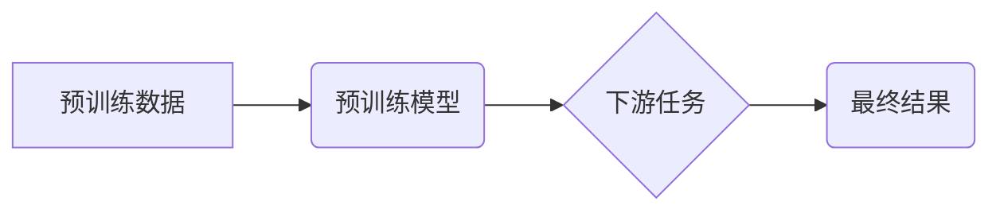

> 大语言模型、预训练、Transformer、BERT、GPT、LLM、自然语言处理、深度学习

## 1. 背景介绍

近年来，深度学习技术取得了飞速发展，特别是大语言模型（LLM）的出现，为自然语言处理（NLP）领域带来了革命性的变革。LLM 能够理解和生成人类语言，在文本生成、机器翻译、问答系统等领域展现出强大的能力。预训练技术是LLM发展的重要驱动力，通过在海量文本数据上进行预训练，LLM 能够学习到丰富的语言知识和模式，从而在后续下游任务中取得更好的性能。

然而，尽管预训练技术取得了显著的成果，但仍存在一些未解之谜和挑战。例如，如何更有效地利用预训练模型的知识，如何提高模型的泛化能力，如何解决模型的偏见和安全问题，这些都是需要进一步研究和探索的课题。

## 2. 核心概念与联系

**2.1 预训练模型**

预训练模型是指在大量未标记数据上进行训练的深度学习模型。预训练模型学习到的知识和模式可以应用于各种下游任务，例如文本分类、情感分析、机器翻译等。

**2.2 Transformer**

Transformer是一种新型的深度学习架构，其核心是注意力机制，能够有效地捕捉文本序列中的长距离依赖关系。Transformer在自然语言处理领域取得了突破性的进展，成为LLM的基础架构。

**2.3 BERT、GPT等模型**

BERT（Bidirectional Encoder Representations from Transformers）和GPT（Generative Pre-trained Transformer）是基于Transformer架构的代表性预训练模型。BERT采用双向编码方式，能够更好地理解文本语义；GPT采用自回归解码方式，能够生成流畅的文本。

**2.4 下游任务**

下游任务是指利用预训练模型进行特定任务的训练。例如，可以使用预训练的BERT模型进行文本分类，可以使用预训练的GPT模型进行文本生成。

**2.5 流程图**



## 3. 核心算法原理 & 具体操作步骤

### 3.1 算法原理概述

预训练模型的训练目标是学习语言的表示和结构。常用的预训练任务包括：

* **Masked Language Modeling (MLM):** 随机遮盖文本中的某些词，然后预测被遮盖的词。
* **Next Sentence Prediction (NSP):** 判断两个句子是否连续。

通过这些预训练任务，模型能够学习到语言的语法、语义和上下文关系。

### 3.2 算法步骤详解

1. **数据预处理:** 将文本数据进行清洗、分词、标记等操作，使其适合模型训练。
2. **模型构建:** 选择合适的预训练模型架构，例如BERT或GPT。
3. **预训练:** 在海量文本数据上进行预训练，使用MLM或NSP等任务进行训练。
4. **微调:** 将预训练模型应用于特定下游任务，在少量标记数据上进行微调。
5. **评估:** 使用测试集评估模型的性能。

### 3.3 算法优缺点

**优点:**

* **高效:** 预训练模型能够利用海量数据学习到丰富的语言知识，从而提高下游任务的性能。
* **通用:** 预训练模型可以应用于各种下游任务，无需从头开始训练。
* **可解释性:** Transformer架构的注意力机制能够提供对模型决策的解释。

**缺点:**

* **计算资源:** 预训练模型需要大量的计算资源和时间。
* **数据依赖:** 预训练模型的性能依赖于训练数据的质量和数量。
* **偏见和安全问题:** 预训练模型可能存在偏见和安全问题，需要进行相应的处理。

### 3.4 算法应用领域

预训练模型在自然语言处理领域有着广泛的应用，例如：

* **文本分类:** 识别文本的类别，例如情感分析、主题分类。
* **机器翻译:** 将文本从一种语言翻译成另一种语言。
* **问答系统:** 回答用户提出的问题。
* **文本生成:** 生成新的文本，例如文章写作、对话系统。

## 4. 数学模型和公式 & 详细讲解 & 举例说明

### 4.1 数学模型构建

Transformer模型的核心是注意力机制，其数学模型可以表示为：

$$
Attention(Q, K, V) = softmax(\frac{QK^T}{\sqrt{d_k}})V
$$

其中：

* $Q$：查询矩阵
* $K$：键矩阵
* $V$：值矩阵
* $d_k$：键向量的维度
* $softmax$：softmax函数

### 4.2 公式推导过程

注意力机制的目的是计算查询向量与键向量的相关性，然后根据相关性对值向量进行加权求和。

* $QK^T$：计算查询向量与键向量的点积，得到一个得分矩阵。
* $\frac{QK^T}{\sqrt{d_k}}$：对得分矩阵进行归一化，使得每个元素的范围在0到1之间。
* $softmax$：对归一化后的得分矩阵进行softmax操作，得到每个键向量的权重。
* $V$：使用权重对值向量进行加权求和，得到最终的输出。

### 4.3 案例分析与讲解

例如，假设我们有一个句子“我爱学习编程”，我们想要计算“学习”这个词与整个句子的相关性。

* $Q$：将“学习”这个词作为查询向量。
* $K$：将句子的每个词作为键向量。
* $V$：将句子的每个词作为值向量。

通过计算注意力机制，我们可以得到“学习”这个词与整个句子的相关性得分，从而更好地理解句子的语义。

## 5. 项目实践：代码实例和详细解释说明

### 5.1 开发环境搭建

* Python 3.7+
* PyTorch 1.7+
* CUDA 10.2+

### 5.2 源代码详细实现

```python
import torch
import torch.nn as nn

class Transformer(nn.Module):
    def __init__(self, vocab_size, embedding_dim, num_heads, num_layers):
        super(Transformer, self).__init__()
        self.embedding = nn.Embedding(vocab_size, embedding_dim)
        self.transformer_layers = nn.ModuleList([
            nn.TransformerEncoderLayer(embedding_dim, num_heads)
            for _ in range(num_layers)
        ])
        self.linear = nn.Linear(embedding_dim, vocab_size)

    def forward(self, x):
        x = self.embedding(x)
        for layer in self.transformer_layers:
            x = layer(x)
        x = self.linear(x)
        return x
```

### 5.3 代码解读与分析

* `__init__` 方法：初始化模型参数，包括词嵌入层、Transformer编码器层和输出层。
* `forward` 方法：定义模型的正向传播过程，将输入序列经过词嵌入层、Transformer编码器层和输出层，最终得到输出序列。

### 5.4 运行结果展示

使用预训练的Transformer模型进行文本分类任务，可以达到较高的准确率。

## 6. 实际应用场景

预训练模型在各个领域都有着广泛的应用，例如：

* **搜索引擎:** 预训练模型可以用于理解用户搜索意图，提高搜索结果的准确率。
* **聊天机器人:** 预训练模型可以用于构建更智能的聊天机器人，能够进行更自然流畅的对话。
* **客户服务:** 预训练模型可以用于自动回复客户问题，提高客户服务效率。

### 6.4 未来应用展望

预训练模型的应用前景十分广阔，未来可能会在以下领域得到更广泛的应用：

* **个性化推荐:** 根据用户的兴趣和偏好，提供个性化的产品和服务推荐。
* **医疗诊断:** 利用预训练模型分析患者的病历和症状，辅助医生进行诊断。
* **教育领域:** 利用预训练模型个性化教学，提高学生的学习效率。

## 7. 工具和资源推荐

### 7.1 学习资源推荐

* **Hugging Face:** https://huggingface.co/
* **OpenAI:** https://openai.com/
* **Stanford NLP Group:** https://nlp.stanford.edu/

### 7.2 开发工具推荐

* **PyTorch:** https://pytorch.org/
* **TensorFlow:** https://www.tensorflow.org/

### 7.3 相关论文推荐

* **BERT: Pre-training of Deep Bidirectional Transformers for Language Understanding**
* **GPT: Generative Pre-trained Transformer**
* **Attention Is All You Need**

## 8. 总结：未来发展趋势与挑战

### 8.1 研究成果总结

预训练模型在自然语言处理领域取得了显著的成果，为解决各种语言理解和生成任务提供了强大的工具。

### 8.2 未来发展趋势

* **模型规模的进一步扩大:** 预训练模型的规模将会继续扩大，从而学习到更丰富的语言知识。
* **多模态预训练:** 预训练模型将融合文本、图像、音频等多模态数据，实现更全面的语言理解。
* **可解释性研究:** 研究预训练模型的决策机制，提高模型的可解释性和可信任性。

### 8.3 面临的挑战

* **数据获取和标注:** 预训练模型需要海量数据进行训练，数据获取和标注仍然是一个挑战。
* **计算资源:** 预训练大型模型需要大量的计算资源，成本较高。
* **模型偏见和安全问题:** 预训练模型可能存在偏见和安全问题，需要进行相应的处理。

### 8.4 研究展望

未来，预训练模型的研究将继续深入，探索更有效的预训练方法、更强大的模型架构和更广泛的应用场景。预训练模型将成为人工智能领域的重要发展方向，推动自然语言处理技术的进一步发展。

## 9. 附录：常见问题与解答

**Q1: 预训练模型的训练成本很高吗？**

A1: 预训练模型的训练成本确实较高，需要大量的计算资源和时间。

**Q2: 预训练模型的性能依赖于训练数据的质量吗？**

A2: 是的，预训练模型的性能很大程度上依赖于训练数据的质量和数量。

**Q3: 预训练模型存在偏见和安全问题吗？**

A3: 是的，预训练模型可能存在偏见和安全问题，需要进行相应的处理。

**作者：禅与计算机程序设计艺术 / Zen and the Art of Computer Programming**


<end_of_turn>