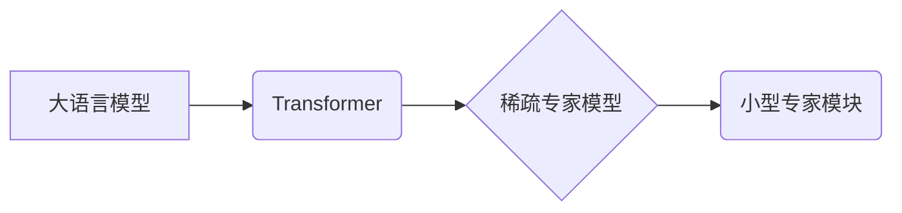

> 大语言模型，稀疏专家模型，Transformer，注意力机制，参数效率，知识蒸馏，高效训练

## 1. 背景介绍

近年来，大语言模型（Large Language Models，LLMs）在自然语言处理领域取得了显著进展，展现出强大的文本生成、翻译、问答等能力。这些模型通常拥有数十亿甚至数千亿个参数，需要海量数据和计算资源进行训练。然而，随着模型规模的不断增长，训练成本和部署难度也随之增加，限制了其在实际应用中的推广。

稀疏专家模型（Sparse Expert Models）作为一种新的模型架构，旨在解决大规模LLM训练和部署的挑战。它通过将模型分解成多个小型专家模块，每个专家只负责处理特定类型的任务或知识领域，从而降低模型参数量和计算复杂度，同时保持模型性能。

## 2. 核心概念与联系

### 2.1 核心概念

* **大语言模型 (LLM):** 拥有大量参数的深度学习模型，能够理解和生成人类语言。
* **Transformer:** 基于注意力机制的深度学习架构，是构建现代LLM的基础。
* **稀疏专家模型:** 将模型分解成多个小型专家模块，每个专家只负责处理特定类型的任务或知识领域。

### 2.2 架构关系



## 3. 核心算法原理 & 具体操作步骤

### 3.1 算法原理概述

稀疏专家模型的核心思想是将一个大型的通用模型分解成多个小型、专门化的专家模块。每个专家模块都专注于处理特定类型的任务或知识领域，并通过共享的底层表示进行交互。

当输入数据进入模型时，首先会经过一个路由机制，将数据分配到最合适的专家模块。每个专家模块对输入数据进行处理，并输出其专家的预测结果。最终，所有专家模块的预测结果会进行融合，得到最终的模型输出。

### 3.2 算法步骤详解

1. **模型分解:** 将大语言模型分解成多个小型专家模块，每个模块负责处理特定类型的任务或知识领域。
2. **专家训练:** 每个专家模块分别使用特定任务或知识领域的训练数据进行训练。
3. **路由机制:** 设计一个路由机制，根据输入数据的内容和类型，将数据分配到最合适的专家模块。
4. **专家融合:** 将所有专家模块的预测结果进行融合，得到最终的模型输出。

### 3.3 算法优缺点

**优点:**

* **参数效率:** 相比于大型通用模型，稀疏专家模型的参数量更少，训练和部署成本更低。
* **可解释性:** 由于模型被分解成多个小型模块，每个模块的功能更明确，模型的决策过程更容易理解。
* **可扩展性:** 可以根据需要添加新的专家模块，扩展模型的功能。

**缺点:**

* **路由机制设计:** 路由机制的设计对模型性能至关重要，需要精心设计才能保证数据分配的合理性。
* **专家融合:** 不同专家模块的预测结果融合需要考虑各个模块的权重和置信度，需要设计合适的融合策略。

### 3.4 算法应用领域

* **自然语言理解:** 文本分类、情感分析、问答系统等。
* **机器翻译:** 将一种语言翻译成另一种语言。
* **文本生成:** 自动生成新闻、故事、诗歌等文本。
* **代码生成:** 根据自然语言描述自动生成代码。

## 4. 数学模型和公式 & 详细讲解 & 举例说明

### 4.1 数学模型构建

假设我们有N个专家模块，每个专家模块的参数为θi，i=1,2,...,N。输入数据为x，输出为y。

稀疏专家模型的预测结果可以表示为：

$$
y = \sum_{i=1}^{N} \alpha_i f_{\theta_i}(x)
$$

其中，αi为专家模块的权重，fθi(x)为专家模块i的预测函数。

### 4.2 公式推导过程

权重αi的计算可以采用多种方法，例如：

* **基于专家性能的权重分配:** 根据每个专家模块在特定任务上的性能，分配不同的权重。
* **基于数据分布的权重分配:** 根据输入数据的分布，分配不同的权重。

### 4.3 案例分析与讲解

假设我们有一个文本分类任务，需要将文本分类为正例或负例。我们可以将模型分解成两个专家模块，一个负责处理正面文本，另一个负责处理负面文本。

在训练过程中，每个专家模块分别使用对应类型的文本数据进行训练。在预测阶段，根据输入文本的内容，路由机制将文本分配到最合适的专家模块，并根据专家模块的预测结果进行融合，得到最终的分类结果。

## 5. 项目实践：代码实例和详细解释说明

### 5.1 开发环境搭建

* Python 3.7+
* TensorFlow 2.0+
* PyTorch 1.0+

### 5.2 源代码详细实现

```python
# 导入必要的库
import tensorflow as tf

# 定义专家模块
class Expert(tf.keras.Model):
    def __init__(self, units):
        super(Expert, self).__init__()
        self.dense = tf.keras.layers.Dense(units, activation='relu')

    def call(self, inputs):
        return self.dense(inputs)

# 定义稀疏专家模型
class SparseExpertModel(tf.keras.Model):
    def __init__(self, num_experts, units):
        super(SparseExpertModel, self).__init__()
        self.experts = [Expert(units) for _ in range(num_experts)]
        self.routing_layer = tf.keras.layers.Dense(num_experts, activation='softmax')

    def call(self, inputs):
        # 路由机制
        routing_logits = self.routing_layer(inputs)
        routing_probs = tf.nn.softmax(routing_logits, axis=-1)

        # 专家预测
        expert_outputs = [expert(inputs) * routing_probs[:, i, None] for i, expert in enumerate(self.experts)]

        # 专家融合
        fused_output = tf.reduce_sum(expert_outputs, axis=0)
        return fused_output

# 实例化模型
model = SparseExpertModel(num_experts=2, units=64)

# 训练模型
# ...

# 预测
predictions = model(inputs)
```

### 5.3 代码解读与分析

* **专家模块:** 每个专家模块是一个简单的全连接神经网络，负责处理特定类型的任务或知识领域。
* **路由机制:** 路由机制使用一个全连接层和softmax激活函数，将输入数据分配到最合适的专家模块。
* **专家融合:** 专家模块的预测结果通过加权求和进行融合，得到最终的模型输出。

### 5.4 运行结果展示

* 训练完成后，可以将模型应用于实际任务，例如文本分类、机器翻译等。
* 可以通过评估指标，例如准确率、F1-score等，评估模型的性能。

## 6. 实际应用场景

### 6.1 自然语言理解

* **文本分类:** 将文本分类为不同的类别，例如情感分析、主题分类等。
* **问答系统:** 根据用户的问题，从文本库中找到最合适的答案。
* **文本摘要:** 从长文本中提取关键信息，生成简短的摘要。

### 6.2 机器翻译

* 将一种语言翻译成另一种语言，例如英语翻译成中文。

### 6.3 文本生成

* 自动生成新闻、故事、诗歌等文本。
* 根据自然语言描述自动生成代码。

### 6.4 未来应用展望

* **个性化推荐:** 根据用户的兴趣和偏好，推荐个性化的内容。
* **智能客服:** 自动回答用户的常见问题，提供24小时在线服务。
* **医疗诊断:** 辅助医生进行疾病诊断，提高诊断准确率。

## 7. 工具和资源推荐

### 7.1 学习资源推荐

* **书籍:**
    * 《深度学习》
    * 《自然语言处理》
* **在线课程:**
    * Coursera: 自然语言处理
    * edX: 深度学习

### 7.2 开发工具推荐

* **TensorFlow:** 开源深度学习框架。
* **PyTorch:** 开源深度学习框架。
* **Hugging Face Transformers:** 提供预训练的Transformer模型和工具。

### 7.3 相关论文推荐

* **Sparse Transformer:** https://arxiv.org/abs/2006.04759
* **Efficient Transformer:** https://arxiv.org/abs/2005.08217

## 8. 总结：未来发展趋势与挑战

### 8.1 研究成果总结

稀疏专家模型是一种高效的LLM架构，能够有效降低模型参数量和训练成本，同时保持模型性能。

### 8.2 未来发展趋势

* **更有效的路由机制:** 设计更有效的路由机制，能够更准确地将数据分配到最合适的专家模块。
* **动态专家组:** 根据输入数据的内容和类型，动态地组建专家模块，提高模型的适应性。
* **跨模态稀疏专家模型:** 将文本、图像、音频等多模态数据融合到稀疏专家模型中，构建更强大的多模态模型。

### 8.3 面临的挑战

* **专家模块的训练:** 如何训练高质量的专家模块，是稀疏专家模型的关键挑战。
* **路由机制的设计:** 设计高效、鲁棒的路由机制，是稀疏专家模型性能的关键因素。
* **模型的可解释性:** 稀疏专家模型的决策过程相对复杂，如何提高模型的可解释性，是未来研究方向之一。

### 8.4 研究展望

稀疏专家模型在LLM领域具有广阔的应用前景，未来研究将继续探索更有效的模型架构、训练方法和应用场景。


## 9. 附录：常见问题与解答

* **Q1: 稀疏专家模型与Transformer模型有什么区别？**

* **A1:** Transformer模型是一个通用的深度学习架构，而稀疏专家模型是一种基于Transformer的模型架构，通过将模型分解成多个小型专家模块，提高模型的效率和可解释性。

* **Q2: 稀疏专家模型的训练成本比Transformer模型低吗？**

* **A2:** 是的，由于稀疏专家模型的参数量更少，因此训练成本比Transformer模型低。

* **Q3: 稀疏专家模型的性能是否会低于Transformer模型？**

* **A3:** 稀疏专家模型的性能与模型架构、训练数据和路由机制等因素有关，在某些任务上，稀疏专家模型的性能甚至可以超过Transformer模型。


作者：禅与计算机程序设计艺术 / Zen and the Art of Computer Programming 
<end_of_turn>