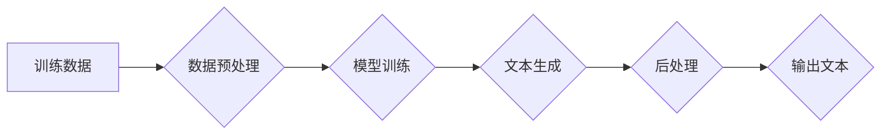

> 大语言模型，偏见，有害性，检测，减少，自然语言处理，机器学习，深度学习，文本生成，伦理

## 1. 背景介绍

大语言模型（Large Language Models，LLMs）近年来取得了令人瞩目的进展，展现出强大的文本生成、翻译、问答和代码生成能力。这些模型基于深度学习技术，通过训练海量文本数据，学习语言的复杂结构和语义关系。然而，LLMs也面临着一些挑战，其中之一就是偏见和有害性问题。

LLMs的训练数据往往包含社会偏见和歧视性内容，这些偏见可能会被模型学习并放大，导致模型生成带有偏见或有害性的文本。例如，一个训练于互联网文本数据集的模型可能会学习到性别、种族或宗教相关的偏见，并将其反映在生成的文本中。

偏见和有害性问题对LLMs的应用带来了严重风险。在某些情况下，这些问题可能导致歧视、误导或伤害。因此，检测和减少LLMs中的偏见和有害性至关重要。

## 2. 核心概念与联系

**2.1 偏见和有害性**

* **偏见:** 指模型在处理不同群体或类别时表现出不公平或不公正的倾向。例如，一个模型可能倾向于将男性描述为领导者，而将女性描述为家庭主妇。
* **有害性:** 指模型生成的文本可能导致伤害、歧视或其他负面后果。例如，一个模型可能生成仇恨言论或煽动暴力。

**2.2 LLMs的偏见来源**

* **训练数据:** LLMs的训练数据往往包含社会偏见和歧视性内容，这些偏见可能会被模型学习并放大。
* **模型架构:** LLMs的模型架构也可能导致偏见。例如，一些模型可能过于依赖于文本中的统计模式，而忽略了语义和上下文信息。

**2.3 检测和减少偏见和有害性的方法**

* **数据预处理:** 过滤掉训练数据中的偏见和歧视性内容。
* **模型训练:** 使用对抗训练等技术来减少模型的偏见。
* **文本生成后处理:** 使用规则或机器学习模型来检测和过滤掉生成的文本中的偏见和有害性内容。

**2.4 Mermaid 流程图**



## 3. 核心算法原理 & 具体操作步骤

### 3.1  算法原理概述

检测和减少LLMs中的偏见和有害性通常涉及以下几个步骤：

1. **数据分析:** 分析训练数据中的偏见和歧视性内容。
2. **特征提取:** 从文本中提取能够反映偏见和有害性的特征。
3. **模型训练:** 使用机器学习模型来学习偏见和有害性的特征，并预测模型生成的文本是否包含偏见或有害性。
4. **文本生成后处理:** 使用规则或机器学习模型来过滤掉生成的文本中的偏见和有害性内容。

### 3.2  算法步骤详解

**3.2.1 数据分析**

* 使用统计方法分析训练数据中不同群体或类别的词语分布。
* 使用自然语言处理（NLP）技术识别训练数据中的偏见和歧视性词语。

**3.2.2 特征提取**

* 使用词嵌入技术将词语映射到向量空间，并提取词语之间的语义关系。
* 使用文本分类模型来识别文本中的情感、主题和意图。
* 使用语法分析技术来识别文本中的句子结构和语义关系。

**3.2.3 模型训练**

* 使用监督学习方法训练分类模型，用于预测文本是否包含偏见或有害性。
* 使用生成对抗网络（GAN）等技术来生成对抗样本，并训练模型抵抗对抗攻击。

**3.2.4 文本生成后处理**

* 使用规则或机器学习模型来过滤掉生成的文本中的偏见和有害性词语。
* 使用文本重写技术来修改生成的文本，使其更加客观和中立。

### 3.3  算法优缺点

**优点:**

* 可以有效地检测和减少LLMs中的偏见和有害性。
* 可以提高LLMs的可靠性和安全性。

**缺点:**

* 需要大量的训练数据和计算资源。
* 难以完全消除LLMs中的偏见和有害性。

### 3.4  算法应用领域

* **人工智能伦理:** 确保人工智能系统公平、公正和不歧视。
* **自然语言处理:** 生成更加客观和中立的文本。
* **信息安全:** 检测和过滤掉恶意文本。

## 4. 数学模型和公式 & 详细讲解 & 举例说明

### 4.1  数学模型构建

**4.1.1 偏见度量**

可以使用信息论中的熵来度量文本中的偏见度。假设文本包含多个类别，每个类别对应的词语频率为p<sub>i</sub>，则文本的偏见度可以表示为：

$$H(X) = -\sum_{i=1}^{n} p_i \log_2 p_i$$

其中，n为文本中类别总数。偏见度越高，表示文本越偏向某个类别。

**4.1.2 有害性识别**

可以使用机器学习模型，例如支持向量机（SVM）或深度神经网络（DNN），来识别文本中的有害性。模型的训练数据包含标记为有害或非有害的文本样本。模型学习到有害性特征，并能够预测新文本是否包含有害性。

### 4.2  公式推导过程

**4.2.1 熵的推导**

熵的定义源于信息论，它度量了随机变量的不确定性。对于一个离散随机变量X，其熵定义为：

$$H(X) = -\sum_{x \in X} p(x) \log_2 p(x)$$

其中，p(x)为随机变量X取值为x的概率。

**4.2.2 SVM模型的推导**

SVM模型的目标是找到一个超平面，将训练数据中的正负样本分开。超平面的方程可以表示为：

$$w^T x + b = 0$$

其中，w为超平面的法向量，b为超平面的截距，x为样本数据。

SVM模型的目标函数是最大化超平面的间隔，即正负样本到超平面的距离之差。

### 4.3  案例分析与讲解

**4.3.1 偏见度量案例**

假设我们有一个文本数据集，包含关于不同职业的描述。我们可以使用熵来度量这些描述中的偏见。例如，如果一个描述中频繁出现“男性”和“领导者”这两个词语，而“女性”和“家庭主妇”这两个词语则很少出现，则该描述的偏见度较高。

**4.3.2 有害性识别案例**

我们可以使用SVM模型来识别包含仇恨言论的文本。训练数据包含标记为“仇恨言论”或“非仇恨言论”的文本样本。模型学习到仇恨言论的特征，并能够预测新文本是否包含仇恨言论。

## 5. 项目实践：代码实例和详细解释说明

### 5.1  开发环境搭建

* **操作系统:** Ubuntu 20.04
* **编程语言:** Python 3.8
* **深度学习框架:** TensorFlow 2.0
* **其他工具:** Jupyter Notebook、Git

### 5.2  源代码详细实现

```python
# 导入必要的库
import tensorflow as tf
from tensorflow.keras.layers import Embedding, LSTM, Dense
from tensorflow.keras.models import Sequential

# 定义模型
model = Sequential()
model.add(Embedding(input_dim=10000, output_dim=128))
model.add(LSTM(units=64))
model.add(Dense(units=1, activation='sigmoid'))

# 编译模型
model.compile(optimizer='adam', loss='binary_crossentropy', metrics=['accuracy'])

# 训练模型
model.fit(x_train, y_train, epochs=10, batch_size=32)

# 评估模型
loss, accuracy = model.evaluate(x_test, y_test)
print('Loss:', loss)
print('Accuracy:', accuracy)
```

### 5.3  代码解读与分析

* **Embedding层:** 将词语映射到向量空间。
* **LSTM层:** 学习文本中的长短时序依赖关系。
* **Dense层:** 输出预测结果，使用sigmoid激活函数进行二分类。
* **编译模型:** 使用Adam优化器、二分类交叉熵损失函数和准确率作为评估指标。
* **训练模型:** 使用训练数据训练模型，设置训练轮数和批处理大小。
* **评估模型:** 使用测试数据评估模型的性能。

### 5.4  运行结果展示

运行代码后，可以得到模型的训练损失、准确率以及测试损失、准确率。

## 6. 实际应用场景

### 6.1  新闻文本偏见检测

可以使用检测偏见算法来识别新闻文本中的潜在偏见，帮助用户更客观地理解新闻内容。

### 6.2  社交媒体有害内容过滤

可以使用有害性识别算法来过滤社交媒体上的有害内容，例如仇恨言论、暴力威胁和色情内容。

### 6.3  人工智能对话系统公平性评估

可以使用偏见度量算法来评估人工智能对话系统的公平性，确保对话系统不会对不同群体表现出偏见。

### 6.4  未来应用展望

随着大语言模型的发展，偏见和有害性检测与减少技术将得到更广泛的应用，例如：

* **教育领域:** 开发更加公平和包容的教育资源。
* **医疗领域:** 确保医疗诊断和治疗方案的公平性。
* **法律领域:** 帮助法官和律师做出更加公平的判决。

## 7. 工具和资源推荐

### 7.1  学习资源推荐

* **书籍:**
    * "Fairness and Machine Learning" by  Sarah M. Bender, Timnit Gebru, Angelina McMillan-Major, and  Emily M. Bender
    * "Weapons of Math Destruction: How Big Data Increases Inequality and Threatens Democracy" by Cathy O'Neil
* **在线课程:**
    * Coursera: "Machine Learning Fairness"
    * edX: "AI Ethics"

### 7.2  开发工具推荐

* **TensorFlow:** 开源深度学习框架，支持偏见和有害性检测算法的开发。
* **PyTorch:** 开源深度学习框架，也支持偏见和有害性检测算法的开发。
* **Hugging Face Transformers:** 提供预训练的大语言模型和相关工具，可以用于偏见和有害性检测任务。

### 7.3  相关论文推荐

* "On the Dangers of Stochastic Parrots: Can Language Models Be Too Big?" by Emily M. Bender, Timnit Gebru, Angelina McMillan-Major, and Margaret Mitchell
* "Measuring Inherent Bias in Language Models" by  Emily M. Bender, Timnit Gebru, Angelina McMillan-Major, and  Margaret Mitchell
* "Mitigating Bias in Language Models" by  Arvind Narayanan and  Prateek Singhal

## 8. 总结：未来发展趋势与挑战

### 8.1  研究成果总结

近年来，在偏见和有害性检测与减少领域取得了显著进展。

* 出现了多种有效的检测算法和模型。
* 积累了大量的偏见和有害性数据集。
* 发展了新的技术，例如对抗训练和数据增强，来减少模型的偏见和有害性。

### 8.2  未来发展趋势

* **更准确、更鲁棒的检测算法:** 开发能够更准确地识别和度量偏见和有害性的算法，并提高算法的鲁棒性，使其能够应对新的攻击和挑战。
* **更有效的减少方法:** 研究更有效的减少模型偏见和有害