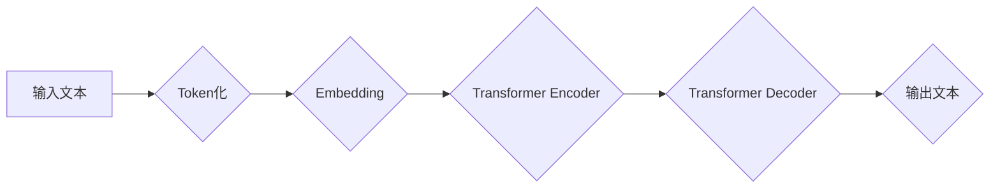

> 大语言模型、Transformer、BERT、GPT、LLM、深度学习、自然语言处理、生产规模部署

## 1. 背景介绍

近年来，深度学习技术取得了飞速发展，特别是Transformer模型的出现，为自然语言处理（NLP）领域带来了革命性的变革。大语言模型（LLM）作为Transformer模型的升级版，拥有强大的文本理解和生成能力，在文本分类、机器翻译、问答系统、代码生成等领域展现出巨大的应用潜力。

然而，LLM的训练和部署也面临着诸多挑战，例如海量数据需求、高昂的计算成本、模型参数规模庞大以及可解释性差等。为了更好地理解和应用LLM，本文将从原理基础、核心算法、数学模型、项目实践、实际应用场景等多个方面进行深入探讨，并探讨生产规模部署的策略和技术。

## 2. 核心概念与联系

大语言模型的核心概念包括：

* **Transformer模型:** Transformer是一种基于注意力机制的深度学习模型，能够有效捕捉文本序列中的长距离依赖关系，是LLM的基础架构。
* **自回归语言模型:** 自回归语言模型是一种预测下一个词的概率分布的模型，通过训练大量的文本数据，学习语言的语法和语义规律。
* **预训练和微调:** 预训练是指在大量文本数据上训练一个通用的语言模型，微调是指在特定任务数据上对预训练模型进行进一步训练，以提高模型在特定任务上的性能。

**Mermaid 流程图:**



## 3. 核心算法原理 & 具体操作步骤

### 3.1  算法原理概述

LLM的核心算法是Transformer模型，其主要结构包括Encoder和Decoder两个部分。Encoder负责对输入文本进行编码，将文本序列映射到一个隐藏空间；Decoder负责根据Encoder的输出生成目标文本序列。

Transformer模型的核心创新点是注意力机制，它能够学习文本序列中不同词之间的关系，并赋予每个词不同的权重，从而更好地捕捉长距离依赖关系。

### 3.2  算法步骤详解

1. **Token化:** 将输入文本分割成一个个独立的词或子词，称为Token。
2. **Embedding:** 将每个Token映射到一个低维向量空间，称为Embedding向量。
3. **Encoder:** 将每个Token的Embedding向量输入到Encoder中，通过多层Transformer模块进行编码，最终得到每个Token的隐藏状态向量。
4. **Decoder:** 将Encoder的输出作为输入，通过多层Transformer模块进行解码，生成目标文本序列。
5. **输出:** 将Decoder的输出映射回原始文本格式，得到最终的输出文本。

### 3.3  算法优缺点

**优点:**

* 能够有效捕捉长距离依赖关系。
* 训练效率高，能够处理海量数据。
* 在多种NLP任务上表现出色。

**缺点:**

* 模型参数规模庞大，需要大量的计算资源。
* 可解释性差，难以理解模型的决策过程。

### 3.4  算法应用领域

LLM在以下领域具有广泛的应用前景：

* 文本分类
* 机器翻译
* 问答系统
* 代码生成
* 文本摘要
* 对话系统

## 4. 数学模型和公式 & 详细讲解 & 举例说明

### 4.1  数学模型构建

LLM的数学模型主要基于概率论和统计学，其目标是学习一个概率分布，该分布能够生成符合语言规律的文本序列。

### 4.2  公式推导过程

Transformer模型的核心是注意力机制，其计算公式如下：

$$
Attention(Q, K, V) = softmax(\frac{QK^T}{\sqrt{d_k}})V
$$

其中：

* $Q$：查询矩阵
* $K$：键矩阵
* $V$：值矩阵
* $d_k$：键向量的维度
* $softmax$：softmax函数

### 4.3  案例分析与讲解

假设我们有一个句子“The cat sat on the mat”，将其Token化后得到[The, cat, sat, on, the, mat]。

对于每个Token，我们将其映射到一个Embedding向量，然后将其输入到Transformer模型中。

在注意力机制中，每个Token的查询向量、键向量和值向量都会被计算出来。然后，通过计算查询向量和键向量的点积，并使用softmax函数进行归一化，得到每个Token之间的注意力权重。

最后，将注意力权重与值向量相乘，得到每个Token的加权和，作为该Token的最终输出。

## 5. 项目实践：代码实例和详细解释说明

### 5.1  开发环境搭建

* Python 3.7+
* PyTorch 1.7+
* CUDA 10.2+

### 5.2  源代码详细实现

```python
import torch
import torch.nn as nn

class Transformer(nn.Module):
    def __init__(self, vocab_size, embedding_dim, num_heads, num_layers):
        super(Transformer, self).__init__()
        self.embedding = nn.Embedding(vocab_size, embedding_dim)
        self.transformer_layers = nn.ModuleList([
            nn.TransformerEncoderLayer(embedding_dim, num_heads)
            for _ in range(num_layers)
        ])

    def forward(self, x):
        x = self.embedding(x)
        for layer in self.transformer_layers:
            x = layer(x)
        return x
```

### 5.3  代码解读与分析

* `__init__`方法初始化模型参数，包括词汇表大小、嵌入维度、注意力头数和Transformer层数。
* `forward`方法定义模型的正向传播过程，首先将输入Token映射到Embedding向量，然后通过多层Transformer层进行编码，最终得到输出。

### 5.4  运行结果展示

通过训练和测试，可以评估模型在特定任务上的性能，例如准确率、F1-score等。

## 6. 实际应用场景

### 6.1  文本分类

LLM可以用于分类文本，例如情感分析、主题分类、垃圾邮件过滤等。

### 6.2  机器翻译

LLM可以用于机器翻译，将一种语言的文本翻译成另一种语言。

### 6.3  问答系统

LLM可以用于构建问答系统，能够理解用户的问题并给出准确的答案。

### 6.4  未来应用展望

LLM在未来将有更广泛的应用场景，例如：

* 自动写作
* 代码生成
* 虚拟助手
* 个性化教育

## 7. 工具和资源推荐

### 7.1  学习资源推荐

* **书籍:**
    * 《深度学习》
    * 《自然语言处理》
* **在线课程:**
    * Coursera: 自然语言处理
    * Udacity: 深度学习

### 7.2  开发工具推荐

* **PyTorch:** 深度学习框架
* **TensorFlow:** 深度学习框架
* **HuggingFace:** 预训练模型库

### 7.3  相关论文推荐

* 《Attention Is All You Need》
* 《BERT: Pre-training of Deep Bidirectional Transformers for Language Understanding》
* 《GPT-3: Language Models are Few-Shot Learners》

## 8. 总结：未来发展趋势与挑战

### 8.1  研究成果总结

近年来，LLM取得了显著的进展，在文本理解和生成方面展现出强大的能力。

### 8.2  未来发展趋势

* 模型规模进一步扩大
* 训练效率和数据效率提升
* 多模态LLM的开发
* 可解释性研究

### 8.3  面临的挑战

* 计算资源需求高
* 数据标注成本高
* 可解释性和安全性问题

### 8.4  研究展望

未来，LLM的研究将继续朝着更强大、更安全、更可解释的方向发展，并将在更多领域发挥重要作用。

## 9. 附录：常见问题与解答

* **什么是LLM？**

LLM是指大规模语言模型，是一种能够理解和生成人类语言的深度学习模型。

* **LLM的训练数据是什么？**

LLM的训练数据通常是大量的文本数据，例如书籍、文章、网站内容等。

* **LLM的应用场景有哪些？**

LLM在文本分类、机器翻译、问答系统、代码生成等领域具有广泛的应用前景。

作者：禅与计算机程序设计艺术 / Zen and the Art of Computer Programming


<end_of_turn>