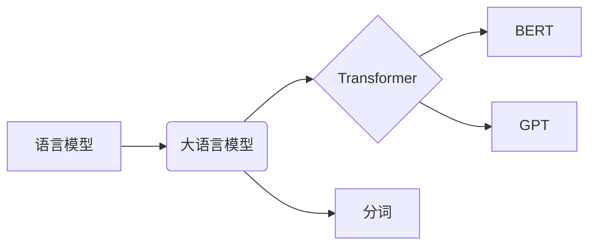

> 大语言模型、Transformer、BERT、GPT、分词、自然语言处理、深度学习、机器学习

## 1. 背景介绍

近年来，深度学习技术取得了飞速发展，尤其是在自然语言处理（NLP）领域取得了突破性进展。大语言模型（LLM）作为深度学习在NLP领域的代表性成果，展现出强大的文本理解和生成能力，在机器翻译、文本摘要、对话系统等领域取得了令人瞩目的成就。

传统的NLP模型主要依赖于手工设计的特征工程，而LLM则通过学习海量文本数据，自动提取文本的语义特征，从而实现更精准、更自然的语言理解和生成。

## 2. 核心概念与联系

**2.1  语言模型**

语言模型是机器学习领域的一个重要分支，旨在预测下一个词出现的概率，从而实现文本生成和理解。

**2.2  大语言模型**

大语言模型是指参数量巨大、训练数据量庞大的语言模型。这些模型通常拥有数十亿甚至数千亿个参数，能够学习到更丰富的语言知识和语义关系。

**2.3  Transformer**

Transformer是一种新型的深度学习架构，其核心是自注意力机制（Self-Attention），能够有效捕捉文本序列中的长距离依赖关系。Transformer的出现极大地推动了LLM的发展，使其能够处理更长的文本序列，并取得更好的性能。

**2.4  BERT、GPT**

BERT（Bidirectional Encoder Representations from Transformers）和GPT（Generative Pre-trained Transformer）是基于Transformer架构的代表性LLM。BERT采用双向编码方式，能够更好地理解上下文信息，而GPT则采用自回归解码方式，擅长文本生成任务。

**2.5  分词**

分词是NLP的基础任务之一，是指将文本分割成一个个独立的词语或词性单元。准确的分词能够有效提高后续文本处理任务的性能。

**2.6  关系图**



## 3. 核心算法原理 & 具体操作步骤

### 3.1  算法原理概述

LLM的训练主要基于深度学习的监督学习和无监督学习方法。

**3.1.1  监督学习**

监督学习是指在已知输入输出对的情况下，训练模型预测未知输入的输出。在LLM的训练中，可以使用预标注的文本数据，例如句子对、文本分类标签等，训练模型进行文本分类、问答、机器翻译等任务。

**3.1.2  无监督学习**

无监督学习是指在没有标签数据的情况下，训练模型发现数据中的潜在结构和规律。LLM的预训练阶段通常采用无监督学习方法，例如语言建模、文本生成等，训练模型学习语言的语法和语义知识。

### 3.2  算法步骤详解

**3.2.1  数据预处理**

首先需要对训练数据进行预处理，例如文本清洗、分词、词向量化等，将文本数据转换为模型能够理解的格式。

**3.2.2  模型训练**

使用深度学习框架，例如TensorFlow或PyTorch，训练LLM模型。训练过程包括前向传播、反向传播和参数更新等步骤。

**3.2.3  模型评估**

在训练过程中，需要定期评估模型的性能，例如使用测试集计算准确率、困惑度等指标，并根据评估结果调整训练参数。

**3.2.4  模型部署**

训练完成的LLM模型可以部署到服务器或云平台，用于实际应用场景。

### 3.3  算法优缺点

**优点:**

* 强大的文本理解和生成能力
* 能够学习到丰富的语言知识和语义关系
* 适用于多种NLP任务

**缺点:**

* 训练成本高，需要大量计算资源和数据
* 模型参数量大，部署成本较高
* 容易受到训练数据偏差的影响

### 3.4  算法应用领域

* 机器翻译
* 文本摘要
* 问答系统
* 对话系统
* 代码生成
* 文本分类
* 情感分析

## 4. 数学模型和公式 & 详细讲解 & 举例说明

### 4.1  数学模型构建

LLM通常采用神经网络模型，其核心是多层感知机（MLP）和自注意力机制（Self-Attention）。

**4.1.1  多层感知机（MLP）**

MLP是一种前馈神经网络，由多个全连接层组成。每个层的神经元接收上一层的输出作为输入，并通过激活函数进行非线性变换，输出到下一层。

**4.1.2  自注意力机制（Self-Attention）**

自注意力机制能够捕捉文本序列中的长距离依赖关系。其核心思想是计算每个词与其他词之间的注意力权重，并根据权重对词向量进行加权求和，从而得到每个词的上下文表示。

### 4.2  公式推导过程

**4.2.1  注意力权重计算**

$$
\text{Attention}(Q, K, V) = \text{softmax}\left(\frac{Q K^T}{\sqrt{d_k}}\right) V
$$

其中：

* $Q$：查询矩阵
* $K$：键矩阵
* $V$：值矩阵
* $d_k$：键向量的维度
* $\text{softmax}$：softmax函数

**4.2.2  上下文表示计算**

$$
\text{Context}(x) = \sum_{i=1}^{n} \text{Attention}(x, K_i, V_i)
$$

其中：

* $x$：当前词
* $K_i$：第 $i$ 个词的键向量
* $V_i$：第 $i$ 个词的值向量
* $n$：文本序列的长度

### 4.3  案例分析与讲解

假设我们有一个文本序列“我爱学习编程”，我们想要计算“学习”这个词的上下文表示。

1. 将文本序列转换为词向量表示。
2. 计算“学习”词与其他词之间的注意力权重。
3. 根据权重对其他词的词向量进行加权求和，得到“学习”词的上下文表示。

## 5. 项目实践：代码实例和详细解释说明

### 5.1  开发环境搭建

* Python 3.7+
* TensorFlow 或 PyTorch
* CUDA 和 cuDNN（可选，用于GPU加速）

### 5.2  源代码详细实现

```python
import tensorflow as tf

# 定义Transformer模型
class Transformer(tf.keras.Model):
    def __init__(self, vocab_size, embedding_dim, num_heads, num_layers):
        super(Transformer, self).__init__()
        self.embedding = tf.keras.layers.Embedding(vocab_size, embedding_dim)
        self.transformer_layers = [
            tf.keras.layers.MultiHeadAttention(num_heads=num_heads, key_dim=embedding_dim)
            for _ in range(num_layers)
        ]
        self.dense = tf.keras.layers.Dense(vocab_size)

    def call(self, inputs):
        # Embedding
        x = self.embedding(inputs)
        # Transformer layers
        for layer in self.transformer_layers:
            x = layer(x)
        # Output layer
        x = self.dense(x)
        return x

# 实例化模型
model = Transformer(vocab_size=10000, embedding_dim=128, num_heads=8, num_layers=6)

# 训练模型
# ...

```

### 5.3  代码解读与分析

* **Embedding层:** 将词索引转换为词向量表示。
* **Transformer层:** 包含多头注意力机制和前馈神经网络，用于捕捉文本序列中的长距离依赖关系。
* **Dense层:** 将上下文表示转换为预测下一个词的概率分布。

### 5.4  运行结果展示

训练完成后，模型可以用于文本生成、翻译等任务。

## 6. 实际应用场景

### 6.1  机器翻译

LLM可以用于机器翻译，例如将英文文本翻译成中文。

### 6.2  文本摘要

LLM可以用于文本摘要，例如将长篇文章总结成简短的摘要。

### 6.3  问答系统

LLM可以用于问答系统，例如根据给定的问题回答相关信息。

### 6.4  未来应用展望

LLM在未来将有更广泛的应用场景，例如：

* 自动写作
* 代码生成
* 个性化教育
* 虚拟助手

## 7. 工具和资源推荐

### 7.1  学习资源推荐

* **书籍:**
    * 《深度学习》
    * 《自然语言处理》
* **在线课程:**
    * Coursera: 自然语言处理
    * edX: 深度学习

### 7.2  开发工具推荐

* **TensorFlow:** 开源深度学习框架
* **PyTorch:** 开源深度学习框架
* **Hugging Face:** 提供预训练LLM模型和工具

### 7.3  相关论文推荐

* BERT: Pre-training of Deep Bidirectional Transformers for Language Understanding
* GPT: Attention Is All You Need

## 8. 总结：未来发展趋势与挑战

### 8.1  研究成果总结

LLM取得了显著的进展，在文本理解和生成方面展现出强大的能力。

### 8.2  未来发展趋势

* 模型规模更大，参数量更多
* 训练数据更加丰富多样
* 算法更加高效，训练速度更快
* 应用场景更加广泛

### 8.3  面临的挑战

* 训练成本高昂
* 模型解释性差
* 数据偏差问题
* 伦理和安全问题

### 8.4  研究展望

未来研究将重点关注：

* 更高效的训练方法
* 更强大的模型架构
* 更好的模型解释性
* 更加安全可靠的应用

## 9. 附录：常见问题与解答

### 9.1  什么是预训练？

预训练是指在大量无标注数据上训练模型，使其学习到语言的语法和语义知识。

### 9.2  什么是微调？

微调是指在预训练模型的基础上，在特定任务的数据上进行进一步训练，以提高模型在该任务上的性能。

### 9.3  LLM有哪些应用场景？

LLM的应用场景非常广泛，例如机器翻译、文本摘要、问答系统、对话系统、代码生成等。

### 9.4  如何选择合适的LLM模型？

选择合适的LLM模型需要考虑任务类型、数据规模、计算资源等因素。

### 9.5  LLM有哪些伦理和安全问题？

LLM可能存在生成虚假信息、传播偏见、侵犯隐私等伦理和安全问题。


作者：禅与计算机程序设计艺术 / Zen and the Art of Computer Programming 
<end_of_turn>