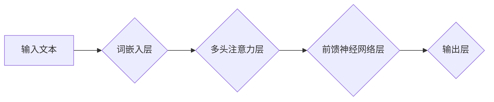

> 大语言模型、训练过程、Transformer、深度学习、自然语言处理、文本生成、机器学习

## 1. 背景介绍

近年来，深度学习技术取得了飞速发展，特别是Transformer模型的出现，为自然语言处理（NLP）领域带来了革命性的变革。大语言模型（LLM）作为深度学习在NLP领域的代表性成果，展现出强大的文本理解和生成能力，在文本分类、机器翻译、问答系统、代码生成等领域取得了令人瞩目的成就。

LLM的训练过程是一个复杂而耗时的过程，需要大量的计算资源和海量文本数据。本文将深入探讨LLM的训练过程，从核心概念到算法原理、数学模型、代码实现以及实际应用场景，全面介绍LLM训练的各个环节，帮助读者理解LLM的训练机制，并为深入研究和应用LLM打下坚实的基础。

## 2. 核心概念与联系

### 2.1  大语言模型（LLM）

大语言模型是指在海量文本数据上训练的深度学习模型，能够理解和生成人类语言。LLM通常具有以下特点：

* **规模庞大:** LLM拥有数亿甚至数十亿个参数，使其能够学习复杂的语言模式和语义关系。
* **多任务学习:** LLM能够胜任多种自然语言处理任务，例如文本分类、机器翻译、问答系统、文本摘要等。
* **零样本学习:** LLM能够在没有特定任务训练数据的情况下，通过少量示例学习新的任务。

### 2.2  Transformer模型

Transformer模型是LLM训练的核心架构，它利用自注意力机制（Self-Attention）和多头注意力机制（Multi-Head Attention）来捕捉文本序列中的长距离依赖关系，有效提升了模型的表达能力和性能。

**Mermaid 流程图:**



### 2.3  训练过程

LLM的训练过程主要包括以下步骤：

1. **数据预处理:** 将原始文本数据进行清洗、分词、标记等预处理操作，使其能够被模型理解和处理。
2. **模型初始化:** 初始化模型参数，通常采用随机初始化或预训练模型的权重。
3. **前向传播:** 将预处理后的文本数据输入模型，计算模型输出。
4. **损失函数计算:** 计算模型输出与真实标签之间的差异，使用损失函数衡量模型的训练误差。
5. **反向传播:** 利用梯度下降算法，根据损失函数的梯度更新模型参数，降低模型的训练误差。
6. **迭代训练:** 重复前向传播、损失函数计算和反向传播步骤，直到模型达到预设的性能指标。

## 3. 核心算法原理 & 具体操作步骤

### 3.1  算法原理概述

LLM的训练主要基于深度学习的监督学习方法，利用海量文本数据训练模型，使其能够学习语言的语法、语义和上下文关系。

Transformer模型的核心是自注意力机制，它能够捕捉文本序列中不同词之间的依赖关系，即使这些词之间相隔很远。多头注意力机制则通过多个注意力头，从不同的角度捕捉文本信息，进一步提升模型的表达能力。

### 3.2  算法步骤详解

1. **词嵌入:** 将每个词转换为一个低维向量，表示词的语义信息。
2. **多头注意力:** 利用多个注意力头，分别关注不同词之间的关系，并生成注意力权重，表示每个词对其他词的影响程度。
3. **前馈神经网络:** 对每个词的注意力输出进行非线性变换，进一步提取语义特征。
4. **位置编码:** 将词的顺序信息编码到词向量中，因为Transformer模型没有循环结构，无法直接捕捉词的顺序信息。
5. **解码器:** 利用编码器输出的语义信息，生成目标文本序列。

### 3.3  算法优缺点

**优点:**

* 能够捕捉长距离依赖关系，提升模型的表达能力。
* 并行训练效率高，适合大规模模型训练。
* 多任务学习能力强，能够胜任多种NLP任务。

**缺点:**

* 训练成本高，需要大量的计算资源和海量文本数据。
* 模型参数量大，部署成本较高。
* 容易出现过拟合问题，需要精心设计训练策略。

### 3.4  算法应用领域

LLM的训练算法广泛应用于以下领域：

* **自然语言理解:** 文本分类、情感分析、问答系统、文本摘要等。
* **自然语言生成:** 机器翻译、文本生成、对话系统等。
* **代码生成:** 代码自动补全、代码生成等。
* **其他领域:** 医学诊断、法律分析、金融预测等。

## 4. 数学模型和公式 & 详细讲解 & 举例说明

### 4.1  数学模型构建

LLM的训练过程本质上是一个优化问题，目标是找到模型参数，使得模型输出与真实标签之间的差异最小。

**损失函数:**

常用的损失函数包括交叉熵损失函数、均方误差损失函数等。

**交叉熵损失函数:**

$$
L = -\sum_{i=1}^{N} y_i \log(\hat{y}_i)
$$

其中：

* $N$ 是样本数量。
* $y_i$ 是真实标签。
* $\hat{y}_i$ 是模型预测的概率。

**梯度下降算法:**

梯度下降算法用于更新模型参数，使其朝着损失函数最小化的方向进行调整。

$$
\theta = \theta - \alpha \nabla L(\theta)
$$

其中：

* $\theta$ 是模型参数。
* $\alpha$ 是学习率。
* $\nabla L(\theta)$ 是损失函数对模型参数的梯度。

### 4.2  公式推导过程

**自注意力机制:**

自注意力机制计算每个词与其他词之间的注意力权重，表示每个词对其他词的影响程度。

$$
Attention(Q, K, V) = softmax(\frac{QK^T}{\sqrt{d_k}})V
$$

其中：

* $Q$ 是查询矩阵。
* $K$ 是键矩阵。
* $V$ 是值矩阵。
* $d_k$ 是键向量的维度。

**多头注意力机制:**

多头注意力机制通过多个注意力头，分别关注不同词之间的关系，并将其结果进行拼接，进一步提升模型的表达能力。

### 4.3  案例分析与讲解

**BERT模型:**

BERT（Bidirectional Encoder Representations from Transformers）模型是基于Transformer架构的预训练语言模型，通过双向语言建模，学习到更丰富的文本语义信息。

BERT模型在许多NLP任务上取得了优异的性能，例如文本分类、问答系统、文本相似度计算等。

## 5. 项目实践：代码实例和详细解释说明

### 5.1  开发环境搭建

LLM的训练需要强大的计算资源，通常使用GPU加速训练。

常用的开发环境包括：

* **PyTorch:** 深度学习框架，支持GPU加速训练。
* **TensorFlow:** 深度学习框架，支持GPU加速训练。
* **HuggingFace Transformers:** 提供预训练模型和训练工具，简化LLM训练过程。

### 5.2  源代码详细实现

以下是一个使用PyTorch训练简单LLM的代码示例：

```python
import torch
import torch.nn as nn

class SimpleLLM(nn.Module):
    def __init__(self, vocab_size, embedding_dim, hidden_dim):
        super(SimpleLLM, self).__init__()
        self.embedding = nn.Embedding(vocab_size, embedding_dim)
        self.lstm = nn.LSTM(embedding_dim, hidden_dim)
        self.fc = nn.Linear(hidden_dim, vocab_size)

    def forward(self, x):
        x = self.embedding(x)
        x, _ = self.lstm(x)
        x = self.fc(x[:, -1, :])
        return x

# 模型参数
vocab_size = 10000
embedding_dim = 128
hidden_dim = 256

# 实例化模型
model = SimpleLLM(vocab_size, embedding_dim, hidden_dim)

# 损失函数和优化器
criterion = nn.CrossEntropyLoss()
optimizer = torch.optim.Adam(model.parameters())

# 训练循环
for epoch in range(num_epochs):
    for batch in train_data:
        # 前向传播
        outputs = model(batch)
        loss = criterion(outputs, batch_labels)

        # 反向传播
        optimizer.zero_grad()
        loss.backward()
        optimizer.step()

    print(f'Epoch {epoch+1}/{num_epochs}, Loss: {loss.item()}')
```

### 5.3  代码解读与分析

* **模型定义:** 代码定义了一个简单的LLM模型，包含词嵌入层、LSTM层和全连接层。
* **参数设置:** 设置了模型参数，例如词汇大小、嵌入维度和隐藏维度。
* **损失函数和优化器:** 使用交叉熵损失函数和Adam优化器进行训练。
* **训练循环:** 训练循环迭代训练模型，计算损失并更新模型参数。

### 5.4  运行结果展示

训练完成后，可以评估模型的性能，例如在测试集上的准确率、BLEU分数等。

## 6. 实际应用场景

### 6.1  文本生成

LLM能够生成高质量的文本，例如：

* **小说、诗歌、剧本:** 创作原创的文学作品。
* **新闻报道、文章:** 自动生成新闻报道或文章内容。
* **对话系统:** 与用户进行自然流畅的对话。

### 6.2  机器翻译

LLM能够将文本从一种语言翻译成另一种语言，例如：

* **网页翻译:** 将网页内容翻译成目标语言。
* **文档翻译:** 将文档翻译成目标语言。
* **实时翻译:** 将语音实时翻译成目标语言。

### 6.3  问答系统

LLM能够理解用户的问题，并从知识库中找到答案，例如：

* **搜索引擎:** 帮助用户找到相关信息。
* **聊天机器人:** 回答用户的常见问题。
* **教育系统:** 为学生提供个性化的学习帮助。

### 6.4  未来应用展望

LLM的应用前景广阔，未来可能在以下领域发挥更大的作用：

* **个性化教育:** 为每个学生提供个性化的学习方案。
* **医疗诊断:** 辅助医生进行疾病诊断。
* **法律分析:** 自动分析法律文件，提供法律建议。
* **科学研究:** 帮助科学家进行数据分析和模型构建。

## 7. 工具和资源推荐

### 7.1  学习资源推荐

* **书籍:**
    * 《深度学习》
    * 《自然语言处理》
    * 《Transformer模型》
* **在线课程:**
    * Coursera: 深度学习
    * Udacity: 自然语言处理
    * fast.ai: 深度学习

### 7.2  开发工具推荐

* **PyTorch:** 深度学习框架
* **TensorFlow:** 深度学习框架
* **HuggingFace Transformers:** 预训练模型和训练工具

### 7.3  相关论文推荐

* **Attention Is All You Need:** https://arxiv.org/abs/1706.03762
* **BERT: Pre-training of Deep Bidirectional Transformers for Language Understanding:** https://arxiv.org/abs/1810.04805

## 8. 总结：未来发展趋势与挑战

### 8.1  研究成果总结

LLM的训练取得了显著进展，模型规模不断扩大，性能不断提升。

LLM在许多NLP任务上取得了优异的性能，展现出强大的文本理解和生成能力。

### 8.2  未来发展趋势

* **模型规模进一步扩大:** 训练更大规模的LL