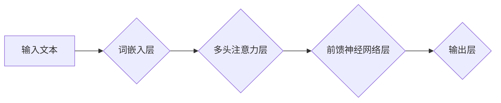

> 大语言模型、LLM、自然语言处理、NLP、文本生成、机器学习、深度学习、Transformer、应用指南、工具

## 1. 背景介绍

近年来，深度学习技术取得了飞速发展，特别是Transformer模型的出现，为自然语言处理（NLP）领域带来了革命性的变革。大语言模型（LLM）作为Transformer模型的升级版，拥有强大的文本理解和生成能力，在各个领域展现出巨大的应用潜力。

从ChatGPT的爆火到各行各业的LLM应用，我们看到了LLM技术带来的巨大变革。然而，对于许多开发者和研究者来说，如何有效地利用LLM，将其转化为实际应用，仍然是一个挑战。

本指南旨在为读者提供一个全面的LLM应用指南，涵盖从核心概念到实际应用的各个方面，帮助读者更好地理解和利用LLM技术。

## 2. 核心概念与联系

### 2.1 大语言模型 (LLM)

大语言模型是指在海量文本数据上训练的深度学习模型，能够理解和生成人类语言。其核心特点是：

* **规模庞大:** LLM通常拥有数十亿甚至数千亿个参数，拥有强大的学习能力。
* **多任务学习:** LLM能够胜任多种自然语言处理任务，例如文本分类、问答、机器翻译、文本摘要等。
* **上下文理解:** LLM能够理解文本中的上下文关系，生成更自然流畅的文本。

### 2.2 Transformer模型

Transformer模型是LLM的基础架构，其核心创新在于使用注意力机制，能够有效地捕捉文本中的长距离依赖关系。

**Mermaid 流程图:**



### 2.3 训练数据

LLM的训练数据是其学习和优化的基础。高质量的文本数据能够帮助LLM更好地理解语言结构和语义关系。

### 2.4 微调

微调是指在预训练的LLM模型基础上，针对特定任务进行进一步训练，以提高模型在该任务上的性能。

## 3. 核心算法原理 & 具体操作步骤

### 3.1 算法原理概述

LLM的核心算法是基于Transformer模型的深度学习算法。其主要原理是通过多层神经网络结构，学习文本数据的表示和关系，从而实现文本理解和生成。

### 3.2 算法步骤详解

1. **词嵌入:** 将文本中的每个词转换为向量表示，捕捉词语的语义信息。
2. **多头注意力:** 利用注意力机制，学习文本中不同词语之间的关系，捕捉长距离依赖关系。
3. **前馈神经网络:** 对注意力输出进行进一步处理，提取更深层次的语义特征。
4. **输出层:** 将处理后的特征映射到目标输出空间，例如预测下一个词语、生成文本摘要等。

### 3.3 算法优缺点

**优点:**

* 强大的文本理解和生成能力
* 能够胜任多种自然语言处理任务
* 具有良好的泛化能力

**缺点:**

* 训练成本高
* 容易受到训练数据质量的影响
* 缺乏对真实世界知识的理解

### 3.4 算法应用领域

LLM在各个领域都有广泛的应用，例如：

* **聊天机器人:** 构建更智能、更自然的对话系统
* **文本生成:** 自动生成新闻、故事、诗歌等文本
* **机器翻译:** 实现更高质量的机器翻译
* **问答系统:** 构建更准确、更全面的问答系统
* **代码生成:** 自动生成代码片段

## 4. 数学模型和公式 & 详细讲解 & 举例说明

### 4.1 数学模型构建

LLM的数学模型主要基于Transformer架构，其核心是注意力机制和多层神经网络结构。

**注意力机制:**

注意力机制能够学习文本中不同词语之间的关系，并赋予不同词语不同的权重。其公式如下：

$$
Attention(Q, K, V) = softmax(\frac{QK^T}{\sqrt{d_k}})V
$$

其中：

* $Q$：查询矩阵
* $K$：键矩阵
* $V$：值矩阵
* $d_k$：键向量的维度
* $softmax$：softmax函数

**多层神经网络:**

LLM通常由多层Transformer编码器和解码器组成，每层包含多头注意力层和前馈神经网络层。

### 4.2 公式推导过程

注意力机制的公式推导过程可以参考相关文献，其核心思想是通过计算查询向量与键向量的相似度，来确定不同词语之间的关系，并赋予不同的权重。

### 4.3 案例分析与讲解

例如，在机器翻译任务中，LLM可以利用注意力机制，将源语言文本中的每个词语与目标语言文本中的每个词语进行匹配，从而找到最合适的翻译词语。

## 5. 项目实践：代码实例和详细解释说明

### 5.1 开发环境搭建

* Python 3.7+
* PyTorch 或 TensorFlow
* CUDA 和 cuDNN (可选)

### 5.2 源代码详细实现

```python
# 使用HuggingFace Transformers库加载预训练的LLM模型
from transformers import AutoModelForCausalLM, AutoTokenizer

model_name = "gpt2"
tokenizer = AutoTokenizer.from_pretrained(model_name)
model = AutoModelForCausalLM.from_pretrained(model_name)

# 输入文本
input_text = "今天天气真好"

# Token化文本
input_ids = tokenizer.encode(input_text, return_tensors="pt")

# 生成文本
output = model.generate(input_ids, max_length=50)

# 解码文本
generated_text = tokenizer.decode(output[0], skip_special_tokens=True)

print(generated_text)
```

### 5.3 代码解读与分析

* 使用HuggingFace Transformers库加载预训练的LLM模型，例如gpt2。
* Token化输入文本，将文本转换为模型可以理解的格式。
* 使用模型的`generate`方法生成文本，指定最大长度等参数。
* 解码生成的文本，将其转换为人类可读的格式。

### 5.4 运行结果展示

```
今天天气真好，阳光明媚，鸟儿歌唱。
```

## 6. 实际应用场景

### 6.1 聊天机器人

LLM可以构建更智能、更自然的对话系统，例如聊天机器人、虚拟助手等。

### 6.2 文本生成

LLM可以自动生成各种文本，例如新闻、故事、诗歌、代码等。

### 6.3 机器翻译

LLM可以实现更高质量的机器翻译，跨越语言障碍。

### 6.4 其他应用场景

LLM还可以应用于问答系统、文本摘要、情感分析、代码生成等领域。

### 6.5 未来应用展望

随着LLM技术的不断发展，其应用场景将更加广泛，例如：

* 个性化教育
* 医疗诊断
* 法律服务
* 艺术创作

## 7. 工具和资源推荐

### 7.1 学习资源推荐

* **书籍:**
    * 《深度学习》
    * 《自然语言处理》
* **在线课程:**
    * Coursera: 自然语言处理
    * edX: 深度学习
* **博客和网站:**
    * HuggingFace Blog
    * OpenAI Blog

### 7.2 开发工具推荐

* **HuggingFace Transformers:** 用于加载和使用预训练的LLM模型
* **TensorFlow:** 深度学习框架
* **PyTorch:** 深度学习框架

### 7.3 相关论文推荐

* Attention Is All You Need
* BERT: Pre-training of Deep Bidirectional Transformers for Language Understanding
* GPT-3: Language Models are Few-Shot Learners

## 8. 总结：未来发展趋势与挑战

### 8.1 研究成果总结

LLM技术取得了显著的进展，在文本理解和生成方面展现出强大的能力。

### 8.2 未来发展趋势

* 模型规模进一步扩大
* 训练数据质量提升
* 算法效率优化
* 多模态LLM发展

### 8.3 面临的挑战

* 训练成本高
* 容易受到训练数据质量的影响
* 缺乏对真实世界知识的理解
* 伦理和安全问题

### 8.4 研究展望

未来研究将重点关注解决上述挑战，开发更安全、更可靠、更智能的LLM技术。

## 9. 附录：常见问题与解答

* **什么是LLM？**

LLM是指在海量文本数据上训练的深度学习模型，能够理解和生成人类语言。

* **LLM有哪些应用场景？**

LLM在各个领域都有广泛的应用，例如聊天机器人、文本生成、机器翻译等。

* **如何使用LLM？**

可以使用预训练的LLM模型，例如gpt2，通过HuggingFace Transformers库进行调用。

* **LLM有哪些挑战？**

LLM面临的挑战包括训练成本高、容易受到训练数据质量的影响、缺乏对真实世界知识的理解等。


作者：禅与计算机程序设计艺术 / Zen and the Art of Computer Programming 
<end_of_turn>