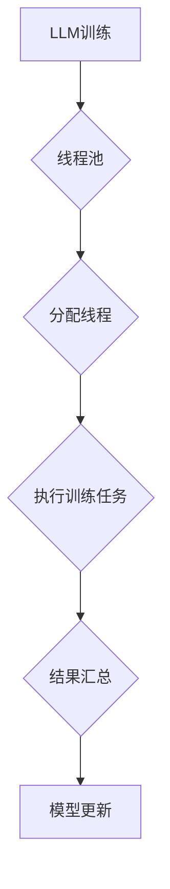

> 大语言模型，线程，并发，效率，性能，应用场景

## 1. 背景介绍

大语言模型（LLM）近年来取得了令人瞩目的进展，在文本生成、翻译、问答等领域展现出强大的能力。然而，随着模型规模的不断扩大，训练和推理效率成为一个瓶颈。传统的单线程执行方式难以满足LLM对计算资源的需求，因此，探索并行执行策略成为提升LLM性能的关键。

线程技术作为一种并行执行机制，能够有效地利用多核处理器，提高程序的执行效率。将线程技术应用于LLM的训练和推理，可以显著加速模型的训练速度和推理速度，从而降低成本，提高效率。

## 2. 核心概念与联系

### 2.1 线程概述

线程是程序执行的最小单位，它拥有自己的独立执行栈和局部变量。多个线程可以同时运行在同一个进程中，共享进程的资源，例如内存空间和文件描述符。

### 2.2 线程与进程的关系

进程是程序运行的基本单位，它拥有独立的内存空间和资源。进程内部可以创建多个线程，每个线程共享进程的资源，但它们可以并行执行不同的任务。

### 2.3 线程模型

常见的线程模型包括：

* **用户级线程模型：**由用户程序直接管理线程，例如pthread库。
* **内核级线程模型：**由操作系统内核管理线程，例如Windows的线程。

### 2.4 线程同步与通信

当多个线程访问共享资源时，需要进行同步和通信，以避免数据竞争和死锁。常见的同步机制包括：

* **互斥锁：**保证只有一个线程可以同时访问共享资源。
* **条件变量：**允许线程等待特定条件的满足。
* **信号量：**控制对共享资源的访问权限。

### 2.5 线程池

线程池是一种管理线程的机制，它预先创建一组线程，并在需要时从池中分配线程执行任务。线程池可以提高线程的复用率，减少线程创建和销毁的开销。

### 2.6 Mermaid 流程图



## 3. 核心算法原理 & 具体操作步骤

### 3.1 算法原理概述

将LLM的训练和推理任务分解成多个子任务，每个子任务由一个线程执行。通过线程池管理线程，可以实现并行执行，提高效率。

### 3.2 算法步骤详解

1. **数据切片：**将训练数据或推理数据切分成多个小块，每个小块由一个线程处理。
2. **线程池创建：**创建线程池，预先创建一组线程。
3. **任务分配：**将数据切片分配给线程池中的线程。
4. **并行执行：**线程池中的线程并发执行任务，例如训练模型或进行推理。
5. **结果汇总：**线程执行完成后，将结果汇总到主线程。
6. **模型更新：**根据汇总的结果，更新模型参数。

### 3.3 算法优缺点

**优点：**

* **提高效率：**并行执行可以显著提高训练和推理速度。
* **利用多核处理器：**充分利用多核处理器的计算能力。
* **降低成本：**提高效率可以降低训练和推理的成本。

**缺点：**

* **线程同步：**需要处理线程同步和通信问题，避免数据竞争和死锁。
* **开发复杂度：**开发多线程程序比单线程程序复杂。
* **资源消耗：**多个线程同时运行会消耗更多的系统资源。

### 3.4 算法应用领域

* **自然语言处理：**文本生成、翻译、问答、情感分析等。
* **计算机视觉：**图像识别、目标检测、图像分割等。
* **语音识别：**语音转文本、语音合成等。
* **机器学习：**模型训练、模型推理等。

## 4. 数学模型和公式 & 详细讲解 & 举例说明

### 4.1 数学模型构建

假设我们有一个包含N个样本的数据集D，每个样本由输入向量x和输出向量y组成。LLM的目标是学习一个映射函数f，将输入向量x映射到输出向量y。

我们可以使用以下数学模型来表示LLM：

$$
f(x) = W_1 * tanh(W_2 * x + b_2) + b_1
$$

其中：

* $x$ 是输入向量
* $W_1$ 和 $W_2$ 是权重矩阵
* $b_1$ 和 $b_2$ 是偏置向量
* $tanh$ 是双曲正切激活函数

### 4.2 公式推导过程

LLM的训练过程是通过最小化损失函数来实现的。损失函数通常是预测值与真实值的差的平方和。

$$
L(f(x), y) = \frac{1}{N} \sum_{i=1}^{N} (f(x_i) - y_i)^2
$$

通过梯度下降算法，我们可以更新权重矩阵和偏置向量，以最小化损失函数。

### 4.3 案例分析与讲解

假设我们有一个简单的LLM，用于预测文本的下一个单词。训练数据包含一系列文本片段，每个片段包含一个输入序列和一个输出单词。

我们可以使用上述数学模型和损失函数来训练LLM。训练完成后，我们可以使用LLM预测新的文本序列的下一个单词。

## 5. 项目实践：代码实例和详细解释说明

### 5.1 开发环境搭建

* 操作系统：Linux
* Python版本：3.8+
* 库依赖：

```
pip install torch torchvision transformers
```

### 5.2 源代码详细实现

```python
import torch
import torch.nn as nn
from transformers import GPT2Tokenizer, GPT2LMHeadModel

# 定义模型
class MyLLM(nn.Module):
    def __init__(self, vocab_size, embedding_dim, hidden_dim):
        super(MyLLM, self).__init__()
        self.embedding = nn.Embedding(vocab_size, embedding_dim)
        self.lstm = nn.LSTM(embedding_dim, hidden_dim)
        self.fc = nn.Linear(hidden_dim, vocab_size)

    def forward(self, x):
        x = self.embedding(x)
        x, _ = self.lstm(x)
        x = self.fc(x[:, -1, :])
        return x

# 加载预训练模型
tokenizer = GPT2Tokenizer.from_pretrained('gpt2')
model = GPT2LMHeadModel.from_pretrained('gpt2')

# 实例化模型
model = MyLLM(vocab_size=tokenizer.vocab_size, embedding_dim=768, hidden_dim=1024)

# 定义损失函数和优化器
criterion = nn.CrossEntropyLoss()
optimizer = torch.optim.Adam(model.parameters(), lr=1e-5)

# 训练模型
for epoch in range(10):
    for batch in dataloader:
        # 前向传播
        outputs = model(batch['input_ids'])
        loss = criterion(outputs.view(-1, tokenizer.vocab_size), batch['labels'].view(-1))

        # 反向传播
        optimizer.zero_grad()
        loss.backward()
        optimizer.step()

# 保存模型
torch.save(model.state_dict(), 'my_llm.pth')
```

### 5.3 代码解读与分析

* 代码首先定义了一个简单的LLM模型，包含嵌入层、LSTM层和全连接层。
* 然后加载预训练的GPT2模型和Tokenizer。
* 实例化自定义模型，并定义损失函数和优化器。
* 训练模型，迭代训练数据，并更新模型参数。
* 最后保存训练好的模型。

### 5.4 运行结果展示

训练完成后，我们可以使用训练好的模型进行文本生成等任务。

## 6. 实际应用场景

### 6.1 文本生成

LLM可以用于生成各种类型的文本，例如：

* **小说、诗歌、剧本等创意写作**
* **新闻报道、文章、博客等内容创作**
* **代码生成、文档自动完成等开发辅助工具**

### 6.2 翻译

LLM可以用于将文本从一种语言翻译成另一种语言。

### 6.3 问答

LLM可以用于回答用户的问题，例如：

* **搜索引擎问答**
* **聊天机器人**
* **教育辅助工具**

### 6.4 其他应用场景

* **情感分析**
* **语音识别**
* **机器翻译**
* **代码生成**

### 6.5 未来应用展望

随着LLM技术的不断发展，其应用场景将更加广泛，例如：

* **个性化教育**
* **智能客服**
* **自动驾驶**
* **医疗诊断**

## 7. 工具和资源推荐

### 7.1 学习资源推荐

* **书籍：**
    * 《深度学习》
    * 《自然语言处理》
* **在线课程：**
    * Coursera
    * edX
    * fast.ai

### 7.2 开发工具推荐

* **框架：**
    * TensorFlow
    * PyTorch
* **库：**
    * transformers
    * gensim

### 7.3 相关论文推荐

* **Attention Is All You Need**
* **BERT: Pre-training of Deep Bidirectional Transformers for Language Understanding**
* **GPT-3: Language Models are Few-Shot Learners**

## 8. 总结：未来发展趋势与挑战

### 8.1 研究成果总结

近年来，LLM取得了显著的进展，在文本生成、翻译、问答等领域展现出强大的能力。线程技术在LLM的训练和推理中发挥着重要作用，提高了效率和性能。

### 8.2 未来发展趋势

* **模型规模的进一步扩大：**更大的模型可以学习更复杂的语言模式，从而提高性能。
* **训练效率的提升：**新的训练算法和硬件加速技术可以显著提高训练效率。
* **多模态LLM的开发：**将文本、图像、音频等多种模态信息融合到LLM中，可以实现更丰富的应用场景。
* **可解释性研究：**提高LLM的透明度和可解释性，帮助人们理解模型的决策过程。

### 8.3 面临的挑战

* **计算资源需求：**大型LLM的训练和推理需要大量的计算资源，这对于资源有限的机构和个人来说是一个挑战。
* **数据获取和标注：**高质量的训练数据是LLM训练的关键，但获取和标注高质量数据是一个耗时和费力的过程。
* **伦理问题：**LLM的应用可能带来一些伦理问题，例如信息泄露、偏见和歧视等，需要引起重视和解决。

### 8.4 研究展望

未来，LLM研究将继续朝着更强大、更智能、更安全的方向发展。

## 9. 附录：常见问题与解答

* **Q：线程池如何管理线程？**

* **A：**线程池使用一个队列来存储待执行的任务，并维护一个线程池，其中包含一组预先创建的线程。当有新的任务到来时，线程池会从队列中取出任务，并分配给空闲的线程执行。

* **Q：如何避免线程同步问题？**

* **A：**可以使用互斥锁、条件变量和信号量等同步机制来避免线程同步问题。

* **Q：线程技术与GPU并行计算的关系是什么？**

* **A：**线程技术和GPU并行计算可以相互配合，提高LLM的训练和推理效率。线程技术可以将任务分解成多个子任务，并行执行，而GPU可以并行处理多个子任务，从而进一步提高效率。


作者：禅与计算机程序设计艺术 / Zen and the Art of Computer Programming 
<end_of_turn>