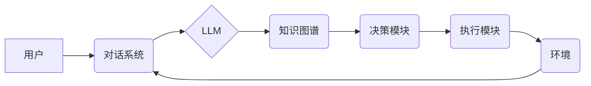

> 大语言模型、自主Agent、强化学习、对话系统、知识图谱、应用案例

## 1. 背景介绍

近年来，大语言模型（LLM）的快速发展，为人工智能领域带来了革命性的变革。LLM 拥有强大的文本理解和生成能力，能够完成从文本摘要、翻译到代码生成等多种复杂任务。与此同时，自主Agent的概念也逐渐受到关注，它代表着人工智能系统能够自主学习、决策和执行任务的能力。将LLM与自主Agent相结合，可以构建出更智能、更灵活、更具自主性的AI系统。

本系列文章将深入探讨大语言模型在自主Agent系统中的应用，并通过案例分析，阐述其核心概念、算法原理、技术实现以及实际应用场景。

## 2. 核心概念与联系

**2.1  大语言模型 (LLM)**

大语言模型是一种基于Transformer架构的深度学习模型，通过训练海量文本数据，学习语言的语法、语义和上下文关系。其强大的文本处理能力使其能够理解和生成人类语言，并完成各种自然语言处理任务。

**2.2  自主Agent**

自主Agent是一种能够感知环境、设定目标、做出决策并执行行动的智能体。它具有以下关键特征：

* **自主性:**  Agent能够独立地做出决策，无需人工干预。
* **目标导向:** Agent拥有明确的目标，并努力实现这些目标。
* **环境感知:** Agent能够感知周围环境的变化，并根据环境信息调整其行为。
* **学习能力:** Agent能够从经验中学习，不断改进其决策和行为策略。

**2.3  LLM与自主Agent的结合**

将LLM与自主Agent相结合，可以赋予Agent更强大的语言理解和生成能力，使其能够更好地感知环境、理解用户需求、制定决策并执行行动。

**2.4  架构图**



## 3. 核心算法原理 & 具体操作步骤

**3.1  算法原理概述**

LLM与自主Agent的结合主要基于以下核心算法：

* **强化学习 (RL):** RL是一种机器学习算法，通过奖励机制训练Agent，使其在特定环境中学习最优的行为策略。
* **对话管理:**  对话管理系统负责引导对话流程，理解用户意图，并生成相应的回复。
* **知识图谱:** 知识图谱是一种结构化的知识表示形式，可以帮助Agent理解和推理复杂信息。

**3.2  算法步骤详解**

1. **环境建模:**  首先需要构建一个模拟真实世界的环境，并定义Agent的目标和奖励机制。
2. **LLM预训练:**  使用海量文本数据对LLM进行预训练，使其具备强大的语言理解和生成能力。
3. **对话管理模型训练:**  使用对话数据训练对话管理模型，使其能够理解用户意图并生成合适的回复。
4. **知识图谱构建:**  构建一个知识图谱，存储与任务相关的知识和关系。
5. **强化学习训练:**  使用RL算法训练Agent，使其在环境中学习最优的行为策略。
6. **系统集成:**  将LLM、对话管理模型、知识图谱和RL算法集成到一个完整的自主Agent系统中。

**3.3  算法优缺点**

* **优点:**

    * 能够实现更智能、更灵活、更具自主性的AI系统。
    * 能够处理更复杂的任务，例如对话理解、文本生成、知识推理等。
    * 能够不断学习和改进，提高其性能。

* **缺点:**

    * 训练复杂，需要大量的计算资源和数据。
    * 算法设计和调参难度较大。
    * 存在安全性和伦理问题，需要谨慎使用。

**3.4  算法应用领域**

* **客服机器人:**  提供24小时在线客服服务，解答用户疑问，处理简单问题。
* **教育机器人:**  提供个性化学习辅导，帮助学生理解知识，提高学习效率。
* **游戏AI:**  开发更智能、更具挑战性的游戏对手。
* **医疗诊断:**  辅助医生诊断疾病，提高诊断准确率。

## 4. 数学模型和公式 & 详细讲解 & 举例说明

**4.1  数学模型构建**

自主Agent系统可以抽象为一个马尔可夫决策过程 (MDP)，其中：

* **状态空间 (S):**  Agent所处的环境状态集合。
* **动作空间 (A):**  Agent可以执行的动作集合。
* **转移概率 (P):**  从一个状态到另一个状态的概率分布。
* **奖励函数 (R):**  Agent在某个状态执行某个动作后获得的奖励值。

**4.2  公式推导过程**

目标是找到一个最优策略 π，使得Agent在长期内获得最大的总奖励。可以使用动态规划或蒙特卡罗方法来求解最优策略。

**Bellman方程:**

$$
V^{\pi}(s) = \max_{a \in A} \left[ R(s, a) + \gamma \sum_{s' \in S} P(s' | s, a) V^{\pi}(s') \right]
$$

其中：

* $V^{\pi}(s)$ 是状态 $s$ 下按照策略 $\pi$ 的价值函数。
* $R(s, a)$ 是状态 $s$ 下执行动作 $a$ 后获得的奖励。
* $\gamma$ 是折扣因子，控制未来奖励的权重。

**4.3  案例分析与讲解**

例如，训练一个自主Agent玩游戏，可以将游戏状态作为状态空间，游戏动作作为动作空间，游戏规则作为转移概率，游戏得分作为奖励函数。通过RL算法训练，Agent可以学习到最优的游戏策略，从而获得更高的得分。

## 5. 项目实践：代码实例和详细解释说明

**5.1  开发环境搭建**

* Python 3.7+
* TensorFlow/PyTorch
* OpenAI Gym

**5.2  源代码详细实现**

```python
import gym
import tensorflow as tf

# 定义环境
env = gym.make('CartPole-v1')

# 定义模型
model = tf.keras.Sequential([
    tf.keras.layers.Dense(128, activation='relu'),
    tf.keras.layers.Dense(env.action_space.n)
])

# 定义损失函数和优化器
optimizer = tf.keras.optimizers.Adam()
loss_fn = tf.keras.losses.SparseCategoricalCrossentropy()

# 训练循环
for episode in range(1000):
    state = env.reset()
    done = False
    total_reward = 0

    while not done:
        # 选择动作
        action = model.predict(state[None, :])[0]
        action = tf.argmax(action).numpy()

        # 执行动作
        next_state, reward, done, _ = env.step(action)

        # 更新模型
        with tf.GradientTape() as tape:
            prediction = model(state[None, :])
            loss = loss_fn(tf.one_hot(action, depth=env.action_space.n), prediction)
        gradients = tape.gradient(loss, model.trainable_variables)
        optimizer.apply_gradients(zip(gradients, model.trainable_variables))

        # 更新状态
        state = next_state
        total_reward += reward

    print(f"Episode {episode+1}, Total Reward: {total_reward}")

# 保存模型
model.save('cartpole_model.h5')
```

**5.3  代码解读与分析**

* 代码首先定义了环境和模型，并选择合适的损失函数和优化器。
* 训练循环中，Agent会根据当前状态选择动作，执行动作后获得奖励和下一个状态。
* 使用梯度下降算法更新模型参数，使其能够更好地预测动作。
* 训练结束后，保存模型以便后续使用。

**5.4  运行结果展示**

训练完成后，可以加载模型并测试其性能。如果模型训练成功，Agent应该能够在环境中表现良好，例如在CartPole游戏中保持平衡杆的稳定。

## 6. 实际应用场景

**6.1  智能客服机器人**

LLM可以帮助客服机器人理解用户的自然语言请求，并生成更自然、更人性化的回复。

**6.2  个性化教育助手**

LLM可以根据学生的学习进度和需求，提供个性化的学习辅导和知识讲解。

**6.3  自动代码生成工具**

LLM可以根据用户的需求，自动生成代码片段，提高开发效率。

**6.4  未来应用展望**

随着LLM技术的不断发展，其在自主Agent系统中的应用场景将会更加广泛，例如：

* **医疗诊断辅助系统:**  帮助医生更快、更准确地诊断疾病。
* **金融风险管理系统:**  识别和预测金融风险，降低损失。
* **自动驾驶系统:**  提高自动驾驶系统的安全性、可靠性和智能化程度。

## 7. 工具和资源推荐

**7.1  学习资源推荐**

* **书籍:**

    * 《深度学习》
    * 《强化学习：原理、算法和应用》
    * 《自然语言处理》

* **在线课程:**

    * Coursera: 深度学习
    * Udacity: 强化学习
    * fast.ai: 自然语言处理

**7.2  开发工具推荐**

* **TensorFlow:**  开源深度学习框架
* **PyTorch:**  开源深度学习框架
* **OpenAI Gym:**  强化学习环境库

**7.3  相关论文推荐**

* **Attention Is All You Need**
* **Deep Reinforcement Learning with Double Q-learning**
* **BERT: Pre-training of Deep Bidirectional Transformers for Language Understanding**

## 8. 总结：未来发展趋势与挑战

**8.1  研究成果总结**

近年来，LLM与自主Agent系统的结合取得了显著进展，在多个领域展现出巨大的应用潜力。

**8.2  未来发展趋势**

* **模型规模和能力的提升:**  随着计算资源的不断发展，LLM模型规模将进一步扩大，能力将更加强大。
* **多模态学习:**  LLM将融合文本、图像、音频等多模态数据，实现更全面的感知和理解能力。
* **可解释性增强:**  研究更有效的算法和方法，提高LLM模型的可解释性，增强用户信任。

**8.3  面临的挑战**

* **数据安全和隐私保护:**  LLM训练需要大量数据，如何保证数据安全和隐私保护是一个重要挑战。
* **算法偏见和公平性:**  LLM模型可能存在算法偏见，需要采取措施确保其公平性和公正性。
* **伦理和社会影响:**  LLM技术的应用可能带来伦理和社会问题，需要进行深入思考和探讨。

**8.4  研究展望**

未来，LLM与自主Agent系统的研究将继续深入，探索更智能、更安全、更可解释的AI系统，为人类社会带来更多福祉。

## 9. 附录：常见问题与解答

**9.1  LLM模型训练需要多少数据？**

LLM模型训练需要海量文本数据，通常需要数十亿甚至数千亿个单词。

**9.2  LLM模型训练需要多长时间？**

LLM模型训练时间取决于模型规模、数据量和计算资源等因素，通常需要数天甚至数周的时间。

**9.3  如何评估LLM模型的性能？**

LLM模型的性能可以评估指标包括准确率、困惑度、BLEU分数等。

**9.4  LLM模型可以用于哪些领域？**

LLM模型可以应用于自然语言处理、机器翻译、文本生成、代码生成、对话系统等多个领域。


作者：禅与计算机程序设计艺术 / Zen and the Art