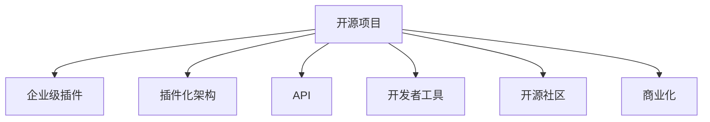

                 

# 创建开源项目的企业级插件：扩展收入来源

> 关键词：开源项目,企业级插件,收入来源,生态系统,插件化架构,API,开发者工具,开源社区,商业模式

## 1. 背景介绍

### 1.1 问题由来

在数字化转型的浪潮下，企业越来越重视开源项目的重要性。开源项目不仅有助于快速迭代技术，提升产品竞争力，还能够在开源社区建立起良好的品牌声誉。然而，许多企业在使用开源项目时，存在诸多困扰：

- 企业级需求与开源项目脱节，难以直接应用。
- 开源项目缺乏稳定性，企业难以信任。
- 开源项目生态分散，使用成本高。

为了解决这些问题，许多企业开始探索如何更好地利用开源项目，通过开发企业级插件，将开源项目融入企业级架构，以实现更高的效率和灵活性。

### 1.2 问题核心关键点

企业级插件是针对企业需求，将开源项目进行二次开发，适配成符合企业级架构的工具或服务。其主要特点包括：

- **深度定制**：针对企业需求进行深度定制，提供符合企业需求的解决方案。
- **性能优化**：通过定制和优化，提升开源项目的性能和稳定性，满足企业级应用的需求。
- **开放性**：保持开源项目的开放性，便于企业加入开源社区，提升自身影响力。
- **收入模式**：通过订阅、授权、咨询等方式，实现收入模式的创新。

通过开发企业级插件，企业可以将开源项目的优势最大化，降低使用成本，同时拓展收入来源，形成良性循环。

### 1.3 问题研究意义

开发企业级插件对于企业而言，具有以下重要意义：

- **加速技术迭代**：利用开源项目的快速迭代特性，加速企业自身技术栈的更新。
- **降低使用成本**：通过插件化的方式，降低企业对原开源项目的依赖和集成成本。
- **提升品牌价值**：通过企业级插件，展示企业在技术领域的实力和影响力。
- **拓展收入来源**：通过商业化插件，实现二次开发和服务的收入。

总之，企业级插件的开发和应用，是企业充分利用开源项目优势，拓展新业务模式，提升市场竞争力的重要手段。

## 2. 核心概念与联系

### 2.1 核心概念概述

为了更好地理解企业级插件的开发和应用，本节将介绍几个关键概念：

- **开源项目**：指开放源码的软件项目，允许用户自由使用、修改和分发。开源项目通常具有较高的技术灵活性和创新性。
- **企业级插件**：指针对企业级需求，对开源项目进行二次开发，适配成符合企业级架构的工具或服务。
- **插件化架构**：指将软件系统设计为可插拔的模块，支持快速集成和定制。
- **API**：指应用程序接口，用于实现不同模块之间的通信和交互。
- **开发者工具**：指帮助开发者进行软件开发和测试的工具，如IDE、调试器、构建工具等。
- **开源社区**：指基于开源理念，聚集技术爱好者和专业开发者，共同贡献、分享和使用的平台。
- **商业化**：指将技术产品或服务转化为商业价值的过程，包括定价、销售、营销等环节。

这些核心概念之间的关系可以通过以下Mermaid流程图来展示：



这个流程图展示了几大核心概念之间的逻辑关系：

1. 开源项目是基础，企业级插件基于其进行二次开发。
2. 插件化架构和API支持插件之间的通信和集成。
3. 开发者工具提升开发效率。
4. 开源社区提供交流平台，促进技术进步。
5. 商业化将技术转化为商业价值。

通过理解这些概念，我们可以更好地把握企业级插件的开发和应用框架，构建更高效、灵活的软件系统。

## 3. 核心算法原理 & 具体操作步骤
### 3.1 算法原理概述

企业级插件的开发，本质上是一个需求映射和适配的过程。其核心思想是：

- 基于开源项目的API接口，获取其功能模块。
- 根据企业需求，定制和优化这些模块，形成符合企业级架构的插件。
- 将插件集成到企业系统，实现业务功能和性能提升。

形式化地，假设开源项目为 $P$，企业级需求为 $Q$。企业级插件的开发过程可以表示为：

$$
\text{插件} = \text{Map}(P, Q) + \text{Optimization}(P)
$$

其中，$\text{Map}(P, Q)$ 表示基于API接口映射 $P$ 的功能模块到 $Q$，$\text{Optimization}(P)$ 表示对 $P$ 进行优化，提升性能和稳定性。

### 3.2 算法步骤详解

企业级插件的开发一般包括以下几个关键步骤：

**Step 1: 识别需求和定制化设计**

- 根据企业需求，识别出需要适配的模块和功能。
- 设计符合企业架构的插件架构，包括模块划分、接口设计等。

**Step 2: 适配开源项目API**

- 通过阅读开源项目的官方文档，获取其API接口。
- 根据定制化需求，适配API接口，实现企业级插件的功能。

**Step 3: 性能优化**

- 对插件进行性能调优，提升响应速度和稳定性。
- 引入缓存、异步处理等技术，优化资源利用率。

**Step 4: 集成和测试**

- 将插件集成到企业系统中，进行功能测试和性能测试。
- 通过自动化测试工具，确保插件稳定性和兼容性。

**Step 5: 发布和维护**

- 将插件发布到开源社区或私有仓库。
- 根据反馈和需求，定期更新插件，保持其与企业架构的同步。

**Step 6: 商业化和营销**

- 制定商业化策略，通过订阅、授权等方式，实现收入。
- 在开源社区和行业会议中宣传推广，提升品牌影响力。

以上是企业级插件开发的一般流程。在实际应用中，还需要针对具体任务进行优化设计，如改进API接口、优化性能测试方法等，以进一步提升插件的可用性和可维护性。

### 3.3 算法优缺点

企业级插件开发具有以下优点：

- **灵活性高**：根据企业需求进行深度定制，灵活适配开源项目。
- **集成方便**：基于API接口，插件可以快速集成到现有系统中。
- **效率提升**：优化后的插件性能和稳定性更高，提升业务效率。
- **成本低**：通过二次开发和优化，降低企业对开源项目的依赖和集成成本。

同时，该方法也存在一定的局限性：

- **开发周期长**：深度定制和优化需要较长开发周期，难以快速迭代。
- **技术门槛高**：需要熟悉开源项目和API接口，开发难度较大。
- **生态系统单一**：企业级插件通常聚焦于特定需求，生态系统较窄。
- **推广困难**：与开源项目相比，企业级插件在推广和社区交流上存在困难。

尽管存在这些局限性，但就目前而言，企业级插件开发仍是提升企业级应用效率和性能的重要手段。未来相关研究的重点在于如何进一步降低开发难度，拓展插件生态，同时兼顾推广和社区交流。

### 3.4 算法应用领域

企业级插件的应用场景广泛，涵盖了企业信息化建设中的多个环节，例如：

- **CRM系统**：通过适配开源CRM系统，添加企业专属的功能模块，提升客户关系管理能力。
- **ERP系统**：基于开源ERP系统，开发符合企业流程的插件，提升企业资源管理效率。
- **BPM系统**：对开源BPM系统进行二次开发，实现工作流自动化和优化。
- **项目管理工具**：基于开源项目管理工具，添加项目监控、资源分配等功能，提升项目管理能力。
- **数据可视化**：通过适配开源数据可视化工具，开发符合企业需求的报表和仪表盘。
- **业务智能**：基于开源BI工具，开发企业级数据分析和决策支持插件。

除了上述这些典型应用外，企业级插件还被创新性地应用于更多场景中，如智能运维、数字化营销、智能客服等，为企业的数字化转型提供了新的技术路径。

## 4. 数学模型和公式 & 详细讲解 & 举例说明
### 4.1 数学模型构建

企业级插件的开发过程中，涉及到的数学模型主要包括：

- **需求映射模型**：表示企业需求与开源项目功能之间的映射关系。
- **性能优化模型**：用于评估插件的性能指标，如响应时间、吞吐量等。
- **优化决策模型**：用于指导插件的优化策略，如优先级排序、资源分配等。

形式化地，假设企业需求 $Q$ 和开源项目 $P$ 的功能模块集合为 $F$，需求映射模型 $M$ 可以表示为：

$$
M(Q, F) = \{\{q_i, f_j\}|q_i \in Q, f_j \in F, q_i \leftrightarrow f_j\}
$$

性能优化模型 $O$ 可以表示为：

$$
O(P) = \{\text{response time}, \text{throughput}, \text{error rate}, \dots\}
$$

优化决策模型 $D$ 可以表示为：

$$
D(O) = \text{sort}(O) \times \text{allocate resources}(\text{sort}(O))
$$

### 4.2 公式推导过程

以下我们以CRM系统为例，推导需求映射模型和性能优化模型的公式。

假设企业需求 $Q=\{客户管理、销售管理、客户服务\}$，开源CRM系统 $P$ 的功能模块集合 $F=\{客户信息管理、订单管理、客户服务支持\}$。需求映射模型 $M$ 可以表示为：

$$
M(Q, F) = \{\{客户管理, 客户信息管理\}, \{销售管理, 订单管理\}, \{客户服务, 客户服务支持\}}
$$

性能优化模型 $O$ 可以表示为：

$$
O(P) = \{\text{response time of 客户信息管理}, \text{response time of 订单管理}, \text{response time of 客户服务支持}\}
$$

根据需求映射模型和性能优化模型，可以设计出企业级插件的功能模块和性能指标，从而进行下一步的定制化开发和优化。

### 4.3 案例分析与讲解

**案例：企业级CRM插件的开发**

假设某企业希望使用开源CRM系统，但需要增加客户反馈管理和客户细分分析的功能。此时，企业可以基于开源CRM系统的API接口，开发相应的企业级插件。

首先，需要识别出需要适配的模块：客户反馈管理和客户细分分析。

其次，设计符合企业架构的插件架构。例如，可以在开源CRM系统的顶部增加一个插件化层，用于管理企业专属功能。

接着，适配开源CRM系统的API接口。例如，通过调用CRM系统的API，获取客户信息，并根据反馈内容进行分析和记录。

最后，进行性能优化。例如，引入缓存技术，提高客户反馈的响应速度；使用异步处理，提升客户细分分析的效率。

## 5. 项目实践：代码实例和详细解释说明
### 5.1 开发环境搭建

在进行企业级插件开发前，我们需要准备好开发环境。以下是使用Python进行Django开发的环境配置流程：

1. 安装Anaconda：从官网下载并安装Anaconda，用于创建独立的Python环境。

2. 创建并激活虚拟环境：
```bash
conda create -n django-env python=3.8 
conda activate django-env
```

3. 安装Django：
```bash
pip install django
```

4. 安装必要的第三方库：
```bash
pip install django-rest-framework
```

5. 安装数据库：如MySQL、PostgreSQL等。

完成上述步骤后，即可在`django-env`环境中开始企业级插件的开发。

### 5.2 源代码详细实现

下面我以CRM系统为例，给出使用Django框架开发企业级CRM插件的Python代码实现。

首先，定义CRM系统的API接口：

```python
from django.urls import path
from .views import CustomerView, OrderView, ServiceView

urlpatterns = [
    path('customer/', CustomerView.as_view(), name='customer'),
    path('order/', OrderView.as_view(), name='order'),
    path('service/', ServiceView.as_view(), name='service'),
]
```

然后，定义企业级插件的API接口：

```python
from django.http import JsonResponse

def customer_feedback(request):
    # 获取客户反馈内容
    feedback = request.POST.get('feedback')
    
    # 获取客户信息
    customer_id = request.POST.get('customer_id')
    customer = Customer.objects.get(id=customer_id)
    
    # 保存客户反馈
    customer.feedback = feedback
    customer.save()
    
    return JsonResponse({'success': True})

def customer_segmentation(request):
    # 获取客户数据
    customer_data = request.POST.get('customer_data')
    
    # 进行客户细分分析
    segments = customer_data.split(',')
    segmentations = {}
    for segment in segments:
        segmentations[segment] = len(segment.split())
    
    return JsonResponse(segments)
```

最后，进行集成和测试：

```python
from django.contrib.auth.decorators import login_required

@login_required
def customer_feedback(request):
    # 获取客户反馈内容
    feedback = request.POST.get('feedback')
    
    # 获取客户信息
    customer_id = request.POST.get('customer_id')
    customer = Customer.objects.get(id=customer_id)
    
    # 保存客户反馈
    customer.feedback = feedback
    customer.save()
    
    return JsonResponse({'success': True})

@login_required
def customer_segmentation(request):
    # 获取客户数据
    customer_data = request.POST.get('customer_data')
    
    # 进行客户细分分析
    segments = customer_data.split(',')
    segmentations = {}
    for segment in segments:
        segmentations[segment] = len(segment.split())
    
    return JsonResponse(segments)
```

以上就是使用Django框架开发CRM系统企业级插件的完整代码实现。可以看到，通过适配开源CRM系统的API接口，企业级插件能够轻松地添加新的功能模块。

### 5.3 代码解读与分析

让我们再详细解读一下关键代码的实现细节：

**views.py**：
- `CustomerView`：继承自Django的视图类，用于处理客户信息管理的API接口。
- `OrderView`：继承自Django的视图类，用于处理订单管理的API接口。
- `ServiceView`：继承自Django的视图类，用于处理客户服务支持的API接口。

**urls.py**：
- 定义了CRM系统的API接口路径，如`/customer/`、`/order/`、`/service/`等。

**customer_feedback**：
- 获取客户反馈内容和客户ID，通过API接口调用CRM系统的客户信息管理功能，保存客户反馈。

**customer_segmentation**：
- 获取客户数据，进行客户细分分析，生成客户细分标签。

通过这些代码，我们可以看到企业级插件是如何基于开源CRM系统的API接口，实现深度定制和优化的。企业可以根据自身需求，灵活扩展和优化这些API接口，从而满足特定的业务需求。

## 6. 实际应用场景
### 6.1 智能客服系统

企业级插件在智能客服系统中的应用，能够显著提升客户服务质量。通过适配开源客服系统，添加客户反馈管理和客户细分分析等功能，客服系统能够更快速、精准地响应客户需求。

例如，某电商企业希望提升客户服务体验，在开源客服系统上开发了企业级插件，实现了以下功能：

- 客户反馈管理：通过插件，客户可以实时提交反馈，客服系统能够及时处理和反馈。
- 客户细分分析：根据客户行为和反馈，进行客户分群分析，提升服务精准度。
- 智能推荐：根据客户细分结果，智能推荐产品和服务，提升转化率。

这些功能极大地提升了客户服务效率和质量，提升了客户满意度。

### 6.2 金融交易系统

金融企业需要实时监控市场动态，快速响应交易请求。通过适配开源交易系统，开发企业级插件，实现实时行情分析、交易指令生成等功能，能够提升交易系统的稳定性和响应速度。

例如，某金融企业在使用开源交易系统时，开发了企业级插件，实现了以下功能：

- 行情分析：通过插件，实时获取市场行情数据，进行分析和预测。
- 交易指令生成：根据市场分析结果，自动生成交易指令，快速响应市场变化。
- 风险管理：通过插件，实时监控交易风险，保障交易安全。

这些功能使得交易系统更稳定、响应更快速，提升了交易效率和安全性。

### 6.3 人力资源管理

人力资源管理是企业管理的重要环节。通过适配开源HR系统，开发企业级插件，添加员工招聘、绩效评估等功能，能够提升人力资源管理的效率和质量。

例如，某制造企业在使用开源HR系统时，开发了企业级插件，实现了以下功能：

- 员工招聘：通过插件，自动化发布招聘信息，筛选和推荐合适的候选人。
- 绩效评估：通过插件，自动生成绩效评估报告，提升评估的公平性和科学性。
- 员工培训：通过插件，推荐和安排员工培训课程，提升员工技能。

这些功能使得HR系统更高效、科学，提升了员工满意度和企业竞争力。

### 6.4 未来应用展望

随着企业级插件的不断发展，其在各行各业的应用前景将更加广阔。未来，企业级插件有望在更多场景下发挥其作用，带来新的商业模式和价值。

- **工业互联网**：通过适配开源工业系统，开发企业级插件，提升工业自动化和智能化水平。
- **智慧农业**：通过适配开源农业系统，开发企业级插件，提升农业生产和管理效率。
- **健康医疗**：通过适配开源医疗系统，开发企业级插件，提升医疗服务质量和效率。
- **智慧城市**：通过适配开源城市管理系统，开发企业级插件，提升城市管理和运营效率。

总之，企业级插件在各行业的数字化转型中将扮演重要角色，推动企业向智能、高效、安全的方向发展。

## 7. 工具和资源推荐
### 7.1 学习资源推荐

为了帮助开发者系统掌握企业级插件的开发方法，这里推荐一些优质的学习资源：

1. **《Django实战》书籍**：深入浅出地介绍了Django框架的使用方法和企业级插件的开发实践。

2. **Django官方文档**：提供了详细的API接口文档和示例，方便开发者进行二次开发。

3. **企业级架构设计指南**：介绍企业架构设计的最佳实践，帮助开发者设计符合企业需求的系统架构。

4. **企业级插件开发案例集**：收录了大量企业级插件开发案例，供开发者参考和学习。

通过这些资源的学习实践，相信你一定能够快速掌握企业级插件的开发方法和思路，应用到实际的项目中。

### 7.2 开发工具推荐

高效的开发离不开优秀的工具支持。以下是几款用于企业级插件开发的常用工具：

1. **Django框架**：灵活高效的Web框架，支持企业级插件的快速开发。

2. **PostgreSQL数据库**：企业级数据管理平台，支持高并发和大数据量的处理。

3. **JIRA工具**：项目管理工具，支持敏捷开发和任务跟踪。

4. **Jenkins CI/CD工具**：持续集成和持续部署工具，自动化测试和发布。

5. **Slack通信工具**：团队沟通工具，支持实时消息和任务分配。

6. **Git版本控制**：版本控制工具，支持团队协作和代码管理。

合理利用这些工具，可以显著提升企业级插件的开发效率，加快创新迭代的步伐。

### 7.3 相关论文推荐

企业级插件的发展源于学界的持续研究。以下是几篇奠基性的相关论文，推荐阅读：

1. **《OpenAPI in Enterprise Applications》**：介绍了企业级API接口的设计原则和最佳实践，为企业级插件开发提供了理论支持。

2. **《RESTful API in Enterprise Architecture》**：讨论了RESTful API在企业架构中的应用，为企业级插件开发提供了架构参考。

3. **《Enterprise Software Architecture: Principles and Patterns》**：全面介绍了企业级软件架构的设计原则和模式，为开发者提供了系统化的指导。

4. **《Cloud Native Enterprise Architecture》**：探讨了云计算环境下的企业架构设计，为企业级插件开发提供了新的思路。

这些论文代表了大规模企业级插件开发的技术趋势，通过学习这些前沿成果，可以帮助研究者把握学科前进方向，激发更多的创新灵感。

## 8. 总结：未来发展趋势与挑战
### 8.1 总结

本文对企业级插件的开发方法进行了全面系统的介绍。首先阐述了企业级插件的背景和意义，明确了其与开源项目、API接口、插件化架构等核心概念之间的关系。其次，从原理到实践，详细讲解了企业级插件的数学模型和关键步骤，给出了企业级插件开发和测试的完整代码实例。同时，本文还广泛探讨了企业级插件在各行业的应用场景，展示了其广阔的应用前景。此外，本文精选了企业级插件的相关学习资源、开发工具和学术论文，力求为开发者提供全方位的技术指引。

通过本文的系统梳理，可以看到，企业级插件的开发和应用对于企业级软件系统建设具有重要意义。通过基于开源项目的二次开发，企业级插件能够实现灵活定制和优化，提升系统性能和效率，拓展收入来源。未来，伴随企业级插件技术的持续演进，相信其在各行业的数字化转型中将发挥更加重要的作用。

### 8.2 未来发展趋势

展望未来，企业级插件的发展趋势包括：

1. **灵活性增强**：通过插件化架构和API接口，企业级插件能够更灵活地适配不同的业务需求，提升系统适应性和可维护性。

2. **生态系统丰富**：企业级插件的生态系统将不断丰富，形成更完善的插件库和社区支持。

3. **自动化提升**：通过自动化测试和持续集成工具，企业级插件的开发和发布效率将显著提升。

4. **商业化拓展**：企业级插件的商业模式将更加多样化，除了订阅和授权，还包括云服务、定制开发等多种形式。

5. **智能应用**：企业级插件将更多地引入人工智能技术，提升智能化水平，如智能推荐、智能分析等。

6. **跨平台支持**：企业级插件将支持跨平台部署，满足企业不同环境的需求。

这些趋势凸显了企业级插件技术的广阔前景，预示着其在各行业数字化转型中的重要地位。

### 8.3 面临的挑战

尽管企业级插件技术已经取得了一定的进展，但在推广和应用过程中，仍面临诸多挑战：

1. **开发成本高**：深度定制和性能优化需要投入大量的人力和时间，成本较高。

2. **技术门槛高**：需要具备较高的技术水平和丰富的开发经验，对开发人员的要求较高。

3. **生态系统分散**：企业级插件生态系统较为分散，缺乏统一的社区支持和技术标准。

4. **推广困难**：企业级插件在推广和社区交流上存在困难，难以获得广泛认可。

5. **安全性问题**：企业级插件可能引入新的安全漏洞，需要进行严格的安全评估和管理。

6. **系统复杂性增加**：企业级插件的集成和维护可能增加系统的复杂性，提升运维难度。

这些挑战需要企业和开发者共同努力，通过技术创新和市场推广，逐步克服，提升企业级插件的可用性和普及度。

### 8.4 研究展望

未来，企业级插件的研究需要在以下几个方面寻求新的突破：

1. **自动化开发工具**：开发自动化工具，降低企业级插件的开发难度，提升开发效率。

2. **插件标准化**：制定企业级插件的标准化规范，提高插件的通用性和可维护性。

3. **社区共建**：推动企业级插件社区的共建，促进开发者之间的交流和合作。

4. **跨平台支持**：开发跨平台支持的技术，使企业级插件能够兼容不同的操作系统和环境。

5. **安全保障**：加强安全性和隐私保护，确保企业级插件的安全性和可靠性。

6. **AI与插件融合**：将人工智能技术融入企业级插件，提升智能化水平。

这些研究方向将引领企业级插件技术迈向更高的台阶，为企业的数字化转型提供更强有力的技术支持。

## 9. 附录：常见问题与解答
### 9.1 常见问题解答

**Q1：企业级插件与开源项目的关系是什么？**

A: 企业级插件是基于开源项目进行深度定制和优化，适配成符合企业级架构的工具或服务。企业级插件与开源项目的关系可以表示为：

$$
\text{插件} = \text{Map}(P, Q) + \text{Optimization}(P)
$$

其中，$P$表示开源项目，$Q$表示企业需求，$\text{Map}(P, Q)$表示需求映射模型，$\text{Optimization}(P)$表示性能优化模型。

**Q2：企业级插件如何保持与开源项目的同步？**

A: 企业级插件的开发需要定期同步更新，以保持与开源项目的版本一致。通常可以采取以下措施：

1. 订阅开源项目的更新通知，及时获取最新版本的API接口和功能。
2. 通过自动化测试工具，持续测试插件的功能和性能，确保与开源项目同步。
3. 定期审查插件代码，修正与开源项目不兼容的问题。

**Q3：企业级插件的性能优化策略有哪些？**

A: 企业级插件的性能优化策略包括：

1. 缓存技术：使用缓存技术，减少数据库访问，提升响应速度。
2. 异步处理：采用异步处理方式，提升系统吞吐量和响应速度。
3. 负载均衡：使用负载均衡技术，分散请求，提升系统稳定性和可扩展性。
4. 代码优化：通过代码优化，减少不必要的计算，提升系统性能。

**Q4：企业级插件的收入模式有哪些？**

A: 企业级插件的收入模式包括：

1. 订阅模式：企业按月或按年订阅企业级插件，支付一定的费用。
2. 授权模式：企业获得企业级插件的授权许可，支付一次性费用。
3. 咨询模式：企业聘请专家对企业级插件进行定制和优化，支付咨询服务费用。
4. 云服务模式：企业通过云平台部署企业级插件，按使用量或时长支付费用。

这些收入模式可以灵活选择，根据企业需求和预算，选择最适合的商业模式。

通过本文的系统梳理，可以看到，企业级插件的开发和应用对于企业级软件系统建设具有重要意义。通过基于开源项目的二次开发，企业级插件能够实现灵活定制和优化，提升系统性能和效率，拓展收入来源。未来，伴随企业级插件技术的持续演进，相信其在各行业的数字化转型中将发挥更加重要的作用。面对挑战和趋势，企业和开发者需要共同努力，推动企业级插件技术不断创新和进步。

