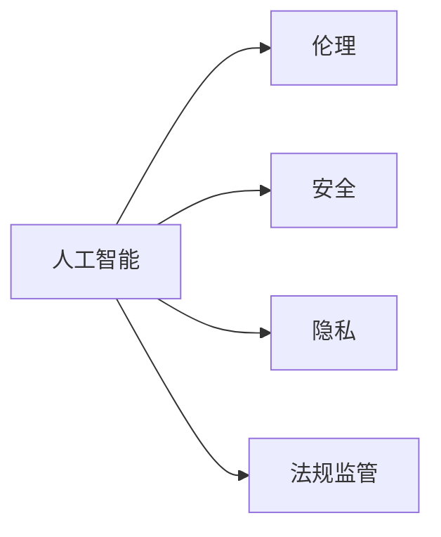

                 

# 创新与监管：平衡人工智能发展

## 1. 背景介绍

在过去的几十年里，人工智能(AI)技术取得了飞速的发展，从机器学习、深度学习到目前火热的强化学习和生成对抗网络，AI技术已经深刻改变了各行各业的生产方式和商业模式。然而，随着技术的不断成熟和应用范围的拓展，AI发展过程中所面临的挑战和争议也日益凸显。如何平衡技术创新和监管约束，成为当下社会、政府和学术界亟需解决的重大课题。

### 1.1 问题的由来
人工智能的发展带来了前所未有的机遇，但也伴随着诸多挑战：

- **伦理问题**：AI决策透明性和可解释性不足，可能引发偏见、歧视等伦理风险。
- **安全问题**：恶意攻击和自动化对抗，可能导致严重的系统崩溃和数据泄露。
- **就业问题**：自动化可能取代大量工作岗位，导致社会结构和职业路径发生巨大变化。
- **数据隐私**：大规模数据收集和分析可能侵犯个人隐私，引发数据安全和隐私保护问题。

这些挑战迫使我们必须在创新与监管之间找到平衡点，确保AI技术既能带来益处，又能避免潜在的危害。本文将深入探讨这一问题，提出一些创新与监管之间的平衡策略，以期为AI发展的健康和可持续提供指导。

## 2. 核心概念与联系

### 2.1 核心概念概述

要理解AI发展中的创新与监管平衡问题，首先需要明确几个核心概念：

- **人工智能(AI)**：指通过计算机程序和算法使机器具备人类智能的领域，包括机器学习、深度学习、强化学习等技术。
- **伦理(AI Ethics)**：指研究和探讨AI技术在开发、应用过程中所涉及的道德和伦理问题。
- **安全(AI Security)**：指确保AI系统不受恶意攻击、数据泄露等安全威胁的措施。
- **隐私(AI Privacy)**：指在AI技术中保护个人数据隐私和安全的方法。
- **法规监管(AI Regulation)**：指政府、监管机构制定和实施的AI相关法律法规和政策。

这些概念之间的关系可以通过以下Mermaid流程图来展示：



这个流程图展示了AI技术发展与伦理、安全、隐私、法规监管之间的关系：

1. **人工智能**：是所有其他概念的基础。
2. **伦理**：从道德角度对AI技术提出要求，如公正、透明、可解释性等。
3. **安全**：确保AI系统不受到恶意攻击和数据泄露的风险。
4. **隐私**：保护个人数据免受不当使用和滥用。
5. **法规监管**：通过法律法规来规范和限制AI技术的开发和应用。

## 3. 核心算法原理 & 具体操作步骤
### 3.1 算法原理概述

在探讨创新与监管平衡问题时，我们需要理解AI技术的核心算法原理。本文将以深度学习中的生成对抗网络(GANs)为例，探讨AI技术创新背后的算法原理及其对社会的影响。

生成对抗网络由一个生成器(G)和一个判别器(D)组成。生成器负责生成假样本，判别器负责判断样本的真伪。训练过程中，生成器不断生成更逼真的样本，而判别器则不断学习如何区分真样本和假样本。最终，生成器生成的样本与真样本难以区分，达到了生成逼真数据的效果。

### 3.2 算法步骤详解

生成对抗网络的核心训练步骤如下：

1. **初始化模型**：定义生成器和判别器的网络结构，并进行随机初始化。
2. **数据准备**：准备训练数据集，并将数据分为训练集和测试集。
3. **迭代训练**：
   - 生成器尝试生成假样本，并输出给判别器进行判断。
   - 判别器对真样本和假样本进行判别，并输出判别结果。
   - 根据判别器的输出，生成器调整生成策略，使其生成的样本更接近真实样本。
   - 判别器调整判别策略，使其能够更准确地识别真样本和假样本。
4. **测试和评估**：使用测试集评估生成器的生成效果，并进行调整优化。

### 3.3 算法优缺点

生成对抗网络具有以下优点：

- **生成效果逼真**：生成的假样本质量高，可以用于图像、音频、文本等多种数据类型的生成。
- **训练效率高**：生成器和判别器并行训练，可以快速迭代优化。

同时，生成对抗网络也存在一些缺点：

- **训练不稳定**：生成器与判别器之间的对抗性强，训练过程容易不稳定。
- **生成样本多样性不足**：生成的样本可能过于依赖训练数据的分布，缺乏多样性。
- **应用场景有限**：虽然生成效果逼真，但在实际应用中，可能存在伦理和法律问题，如用于假新闻生成、非法数据生成等。

### 3.4 算法应用领域

生成对抗网络已经广泛应用于计算机视觉、自然语言处理、音乐生成等领域。例如：

- **图像生成**：生成逼真的图像，用于游戏、虚拟现实、艺术创作等。
- **文本生成**：生成逼真的文本内容，用于内容创作、自动化翻译等。
- **音乐生成**：生成逼真的音乐，用于音乐创作、娱乐等。
- **数据增强**：生成训练集中的噪声样本，用于提高模型鲁棒性。

## 4. 数学模型和公式 & 详细讲解 & 举例说明
### 4.1 数学模型构建

生成对抗网络的数学模型由生成器 $G$ 和判别器 $D$ 组成。生成器 $G$ 输入随机噪声 $\epsilon$，输出生成样本 $G(\epsilon)$。判别器 $D$ 接收样本 $x$ 和 $G(\epsilon)$，输出真样本的判别概率 $D(x)$ 和假样本的判别概率 $D(G(\epsilon))$。训练目标函数为：

$$
\min_{G} \max_{D} \mathbb{E}_{x\sim p_{\text{real}}} [\log D(x)] + \mathbb{E}_{\epsilon \sim p_{\epsilon}} [\log(1-D(G(\epsilon)))]
$$

其中，$p_{\text{real}}$ 是真实样本分布，$p_{\epsilon}$ 是随机噪声分布。

### 4.2 公式推导过程

生成对抗网络的训练过程可以通过梯度下降算法来实现。生成器的损失函数为：

$$
\mathcal{L}_G = -\mathbb{E}_{x\sim p_{\text{real}}} [\log D(x)] - \mathbb{E}_{\epsilon \sim p_{\epsilon}} [\log(1-D(G(\epsilon)))]
$$

判别器的损失函数为：

$$
\mathcal{L}_D = -\mathbb{E}_{x\sim p_{\text{real}}} [\log D(x)] + \mathbb{E}_{\epsilon \sim p_{\epsilon}} [\log D(G(\epsilon))]
$$

通过链式法则，可以计算生成器和判别器的梯度：

$$
\nabla_{\theta_G} \mathcal{L}_G = \nabla_{\theta_G} [-\mathbb{E}_{x\sim p_{\text{real}}} [\log D(x)] - \mathbb{E}_{\epsilon \sim p_{\epsilon}} [\log(1-D(G(\epsilon)))]
$$

$$
\nabla_{\theta_D} \mathcal{L}_D = \nabla_{\theta_D} [-\mathbb{E}_{x\sim p_{\text{real}}} [\log D(x)] + \mathbb{E}_{\epsilon \sim p_{\epsilon}} [\log D(G(\epsilon))]
$$

### 4.3 案例分析与讲解

以图像生成为例，生成对抗网络可以用于生成逼真的手写数字图像。在训练过程中，生成器 $G$ 接收随机噪声 $\epsilon$，生成手写数字图像 $G(\epsilon)$。判别器 $D$ 接收真实的手写数字图像和生成的手写数字图像，判断其真伪。训练过程中，生成器不断生成更逼真的手写数字图像，而判别器则不断学习如何区分真实的手写数字图像和生成的手写数字图像。最终，生成器生成的手写数字图像质量逼真，可以用于手写数字识别等应用。

## 5. 项目实践：代码实例和详细解释说明
### 5.1 开发环境搭建

在进行生成对抗网络实践前，我们需要准备好开发环境。以下是使用Python进行TensorFlow开发的环境配置流程：

1. 安装Anaconda：从官网下载并安装Anaconda，用于创建独立的Python环境。

2. 创建并激活虚拟环境：
```bash
conda create -n tf-env python=3.8 
conda activate tf-env
```

3. 安装TensorFlow：根据CUDA版本，从官网获取对应的安装命令。例如：
```bash
conda install tensorflow==2.8 tensorflow-gpu
```

4. 安装Keras：
```bash
pip install keras
```

5. 安装各类工具包：
```bash
pip install numpy matplotlib scikit-image
```

完成上述步骤后，即可在`tf-env`环境中开始生成对抗网络实践。

### 5.2 源代码详细实现

下面是使用TensorFlow实现生成对抗网络的Python代码：

```python
import tensorflow as tf
from tensorflow.keras import layers

# 定义生成器
def make_generator_model():
    model = tf.keras.Sequential()
    model.add(layers.Dense(256, use_bias=False, input_shape=(100,)))
    model.add(layers.BatchNormalization())
    model.add(layers.LeakyReLU())
    model.add(layers.Dense(512))
    model.add(layers.BatchNormalization())
    model.add(layers.LeakyReLU())
    model.add(layers.Dense(784, activation='tanh'))
    return model

# 定义判别器
def make_discriminator_model():
    model = tf.keras.Sequential()
    model.add(layers.Flatten(input_shape=(28, 28, 1)))
    model.add(layers.Dense(1024))
    model.add(layers.LeakyReLU())
    model.add(layers.Dropout(0.3))
    model.add(layers.Dense(512))
    model.add(layers.LeakyReLU())
    model.add(layers.Dropout(0.3))
    model.add(layers.Dense(1, activation='sigmoid'))
    return model

# 定义损失函数
def make_gan_loss():
    def discriminator_loss(real_output, fake_output):
        real_loss = tf.keras.losses.BinaryCrossentropy()(tf.ones_like(real_output), real_output)
        fake_loss = tf.keras.losses.BinaryCrossentropy()(tf.zeros_like(fake_output), fake_output)
        return real_loss + fake_loss
    def generator_loss(fake_output):
        return tf.keras.losses.BinaryCrossentropy()(tf.ones_like(fake_output), fake_output)
    return discriminator_loss, generator_loss

# 定义生成器和判别器的优化器
def make_optimizer():
    gen_optimizer = tf.keras.optimizers.Adam(1e-4)
    disc_optimizer = tf.keras.optimizers.Adam(1e-4)
    return gen_optimizer, disc_optimizer

# 定义训练函数
def train_gan(generator, discriminator, loss, opt_g, opt_d, dataset):
    @tf.function
    def train_step(images):
        noise = tf.random.normal([BATCH_SIZE, 100])
        with tf.GradientTape() as gen_tape, tf.GradientTape() as disc_tape:
            generated_images = generator(noise, training=True)
            real_output = discriminator(images, training=True)
            fake_output = discriminator(generated_images, training=True)
            
            gen_loss = loss[1](fake_output)
            disc_loss = loss[0](real_output, fake_output)
        
        gradients_of_generator = gen_tape.gradient(gen_loss, generator.trainable_variables)
        gradients_of_discriminator = disc_tape.gradient(disc_loss, discriminator.trainable_variables)
        
        opt_g.apply_gradients(zip(gradients_of_generator, generator.trainable_variables))
        opt_d.apply_gradients(zip(gradients_of_discriminator, discriminator.trainable_variables))

    EPOCHS = 200
    BATCH_SIZE = 128
    for epoch in range(EPOCHS):
        for image_batch in dataset:
            train_step(image_batch)
        print(f"Epoch {epoch+1}, Discriminator Loss: {disc_loss:.4f}, Generator Loss: {gen_loss:.4f}")

# 加载数据集
mnist = tf.keras.datasets.mnist.load_data()
(train_images, train_labels), (_, _) = mnist
train_images = train_images / 255.0
train_images = train_images.reshape(train_images.shape[0], 28, 28, 1)
train_images = train_images.astype('float32')

# 构建模型
generator = make_generator_model()
discriminator = make_discriminator_model()

# 设置损失函数和优化器
loss = make_gan_loss()
opt_g, opt_d = make_optimizer()

# 训练生成对抗网络
train_gan(generator, discriminator, loss, opt_g, opt_d, train_images)
```

这段代码实现了生成对抗网络的训练，使用MNIST数据集生成手写数字图像。代码解释如下：

1. 定义生成器和判别器模型。
2. 定义损失函数和优化器。
3. 定义训练函数，对生成器和判别器进行交替训练。
4. 加载MNIST数据集，并对其进行处理。
5. 构建生成对抗网络模型，并设置损失函数和优化器。
6. 开始训练生成对抗网络。

### 5.3 代码解读与分析

这段代码展示了生成对抗网络的实现过程，核心步骤包括：

1. **生成器和判别器模型定义**：使用TensorFlow定义生成器和判别器的网络结构。
2. **损失函数和优化器定义**：根据生成器和判别器的输出，定义损失函数。
3. **训练函数实现**：定义训练函数，实现生成器和判别器的交替训练。
4. **数据集加载和处理**：加载MNIST数据集，并对图像进行归一化处理。
5. **模型训练**：通过交替训练生成器和判别器，逐步优化生成器生成图像的质量。

这段代码的优点在于，使用了TensorFlow的高阶API，使得模型定义和训练过程变得简洁高效。同时，通过函数式编程和TensorFlow的GradientTape机制，可以实现高效的梯度计算和反向传播。

## 6. 实际应用场景
### 6.1 智能驾驶

生成对抗网络在智能驾驶领域有着广泛的应用。例如，生成逼真的模拟交通场景，用于自动驾驶车辆的训练和测试。通过生成对抗网络，可以生成与现实世界相似但更为安全的驾驶场景，帮助自动驾驶系统提升鲁棒性和安全性。

### 6.2 虚拟现实

在虚拟现实领域，生成对抗网络可以用于生成逼真的虚拟环境和角色，提升用户体验。通过生成对抗网络，可以动态生成虚拟场景和角色，实现实时交互和互动。

### 6.3 艺术创作

生成对抗网络在艺术创作中也有着重要的应用。例如，生成逼真的艺术作品，用于艺术创作和研究。通过生成对抗网络，可以生成逼真的绘画、雕塑、音乐等作品，为艺术创作提供新的灵感和思路。

## 7. 工具和资源推荐
### 7.1 学习资源推荐

为了帮助开发者系统掌握生成对抗网络的技术基础和实践技巧，这里推荐一些优质的学习资源：

1. 《生成对抗网络》（Generative Adversarial Networks）：Ian Goodfellow等人撰写的生成对抗网络领域的经典书籍，详细介绍了生成对抗网络的理论基础和应用实践。
2. TensorFlow官方文档：TensorFlow的官方文档，提供了生成对抗网络的全面介绍和样例代码，是学习生成对抗网络的首选资料。
3. Kaggle生成对抗网络竞赛：Kaggle平台上的生成对抗网络竞赛，提供了丰富的数据集和竞赛任务，可以用于实践和交流。
4. GitHub生成对抗网络项目：GitHub上的生成对抗网络开源项目，提供了大量的实现和应用案例，可以用于学习和参考。

通过对这些资源的学习实践，相信你一定能够快速掌握生成对抗网络的核心技术，并用于解决实际问题。

### 7.2 开发工具推荐

高效的开发离不开优秀的工具支持。以下是几款用于生成对抗网络开发的常用工具：

1. TensorFlow：由Google主导开发的开源深度学习框架，生产部署方便，适合大规模工程应用。
2. Keras：基于TensorFlow的高层API，提供了简单易用的接口，适合快速原型开发。
3. PyTorch：基于Python的开源深度学习框架，灵活动态的计算图，适合快速迭代研究。
4. OpenAI GPT-3：生成对抗网络的最新研究进展，提供了高效的生成模型，可以用于文本生成等任务。

合理利用这些工具，可以显著提升生成对抗网络的开发效率，加快创新迭代的步伐。

### 7.3 相关论文推荐

生成对抗网络的研究始于2014年，自那时以来，研究者们不断探索其各种变体和应用，推动了该领域的快速发展。以下是几篇奠基性的相关论文，推荐阅读：

1. Generative Adversarial Nets（原论文）：Ian Goodfellow等人提出的生成对抗网络原论文，奠定了该领域的基础。
2. Progressive Growing of GANs for Improved Quality, Stability, and Variation：Tero Karras等人提出的渐进式增长生成对抗网络，提高了生成样本的质量和多样性。
3. Conditional Image Synthesis with Auxiliary Classifier GANs：Tacjee Kim等人提出的条件生成对抗网络，用于生成条件约束下的图像样本。
4. StyleGAN：Karras等人提出的风格生成对抗网络，用于生成高质量的图像样本，广泛应用于图像生成和图像编辑等领域。

这些论文代表了大规模生成对抗网络研究的发展脉络。通过学习这些前沿成果，可以帮助研究者把握学科前进方向，激发更多的创新灵感。

## 8. 总结：未来发展趋势与挑战
### 8.1 总结

本文对生成对抗网络的创新与监管平衡问题进行了全面系统的介绍。首先阐述了生成对抗网络的发展背景和意义，明确了其对社会的影响。其次，从原理到实践，详细讲解了生成对抗网络的数学原理和关键步骤，给出了生成对抗网络任务开发的完整代码实例。同时，本文还广泛探讨了生成对抗网络在智能驾驶、虚拟现实、艺术创作等多个领域的应用前景，展示了生成对抗网络的技术潜力。最后，本文精选了生成对抗网络的学习资源、开发工具和相关论文，力求为研究者提供全方位的技术指引。

通过本文的系统梳理，可以看到，生成对抗网络在技术和应用上都取得了显著进展，但其在伦理、安全、隐私等方面的挑战也日益凸显。如何在创新与监管之间找到平衡，推动生成对抗网络健康、可持续的发展，是未来研究的重要方向。

### 8.2 未来发展趋势

展望未来，生成对抗网络将呈现以下几个发展趋势：

1. **生成效果提升**：生成对抗网络的生成效果将进一步提升，可以生成更加逼真、多样化的图像、视频、音频等数据。
2. **训练稳定性增强**：训练过程中不稳定的问题将得到解决，生成对抗网络的训练更加稳定可控。
3. **应用场景扩展**：生成对抗网络的应用场景将进一步扩展，应用于更多的领域和任务。
4. **模型解释性增强**：生成对抗网络的生成过程将更加透明和可解释，帮助人们理解其生成机制。
5. **跨模态生成能力增强**：生成对抗网络将支持跨模态数据的生成，如图像-文本、音频-图像等的联合生成。

以上趋势凸显了生成对抗网络的发展前景。这些方向的探索发展，必将进一步提升生成对抗网络的应用范围和技术水平，为社会带来更多创新和变革。

### 8.3 面临的挑战

尽管生成对抗网络在生成效果和应用方面取得了显著进展，但在其发展和应用过程中，仍面临着诸多挑战：

1. **伦理问题**：生成对抗网络生成的假样本可能用于欺骗和恶意攻击，带来伦理风险。
2. **安全问题**：生成对抗网络生成的样本可能用于对抗训练，破坏系统的安全性和鲁棒性。
3. **隐私问题**：生成对抗网络可能用于生成个人隐私信息，侵犯用户隐私。
4. **计算资源消耗**：生成对抗网络的训练和推理过程消耗大量计算资源，可能难以在资源有限的设备上运行。

这些挑战需要我们在未来研究和应用过程中加以克服。只有通过不断创新和完善，才能充分发挥生成对抗网络的优势，同时避免潜在的危害。

### 8.4 研究展望

面对生成对抗网络所面临的挑战，未来的研究需要在以下几个方面寻求新的突破：

1. **生成对抗网络伦理研究**：探讨生成对抗网络生成的假样本可能带来的伦理问题，制定相应的规范和标准。
2. **生成对抗网络安全研究**：研究生成对抗网络对抗训练的防御方法，提升生成对抗网络的鲁棒性和安全性。
3. **生成对抗网络隐私保护**：研究生成对抗网络生成的个人隐私信息保护方法，确保用户隐私安全。
4. **生成对抗网络资源优化**：研究生成对抗网络的高效计算方法，降低其计算资源消耗，支持在更多设备上运行。

这些研究方向的探索，必将推动生成对抗网络技术走向更加成熟和可靠，为社会带来更多创新和变革。

## 9. 附录：常见问题与解答

**Q1：生成对抗网络的应用范围有哪些？**

A: 生成对抗网络已经广泛应用于计算机视觉、自然语言处理、音乐生成等领域。例如：

- **图像生成**：生成逼真的图像，用于游戏、虚拟现实、艺术创作等。
- **文本生成**：生成逼真的文本内容，用于内容创作、自动化翻译等。
- **音乐生成**：生成逼真的音乐，用于音乐创作、娱乐等。
- **数据增强**：生成训练集中的噪声样本，用于提高模型鲁棒性。

**Q2：生成对抗网络训练过程中需要注意哪些问题？**

A: 生成对抗网络训练过程中需要注意以下问题：

1. **数据质量**：训练数据质量直接影响生成效果，需要确保数据集的完整性和多样性。
2. **生成器与判别器均衡训练**：生成器和判别器需要交替训练，避免生成器过于强大或过于弱小。
3. **正则化**：使用L2正则化、Dropout等技术避免过拟合。
4. **训练稳定性**：使用梯度裁剪、学习率调度等技术确保训练过程的稳定性。
5. **超参数调整**：需要调整生成器和判别器的网络结构、学习率、批次大小等超参数，以获得最佳生成效果。

**Q3：如何提升生成对抗网络的生成效果？**

A: 提升生成对抗网络的生成效果需要综合考虑以下几个方面：

1. **网络结构设计**：设计更为复杂和精细的网络结构，增加网络层数和神经元数量。
2. **损失函数改进**：改进损失函数，提高生成器和判别器之间的对抗性。
3. **训练方法优化**：使用改进的训练方法，如WGAN-GP、StyleGAN等。
4. **数据增强**：通过数据增强技术，提高生成样本的多样性和逼真度。
5. **样本筛选**：对生成的样本进行筛选和过滤，去除低质量样本。

**Q4：生成对抗网络在实际应用中存在哪些伦理问题？**

A: 生成对抗网络在实际应用中可能存在以下伦理问题：

1. **假新闻和虚假信息**：生成的假新闻和虚假信息可能用于欺骗和误导，带来严重的社会影响。
2. **身份盗用和诈骗**：生成的假身份信息可能用于身份盗用和诈骗，带来安全隐患。
3. **隐私侵犯**：生成的个人隐私信息可能用于侵犯用户隐私，带来法律风险。

**Q5：如何确保生成对抗网络的安全性？**

A: 确保生成对抗网络的安全性需要采取以下措施：

1. **对抗样本检测**：使用对抗样本检测技术，识别并过滤生成的对抗样本。
2. **模型鲁棒性增强**：使用鲁棒性增强技术，提升模型的抗干扰能力和鲁棒性。
3. **用户授权和监控**：在使用生成对抗网络生成内容时，需要获得用户授权，并进行实时监控，确保内容合法合规。

---

作者：禅与计算机程序设计艺术 / Zen and the Art of Computer Programming

