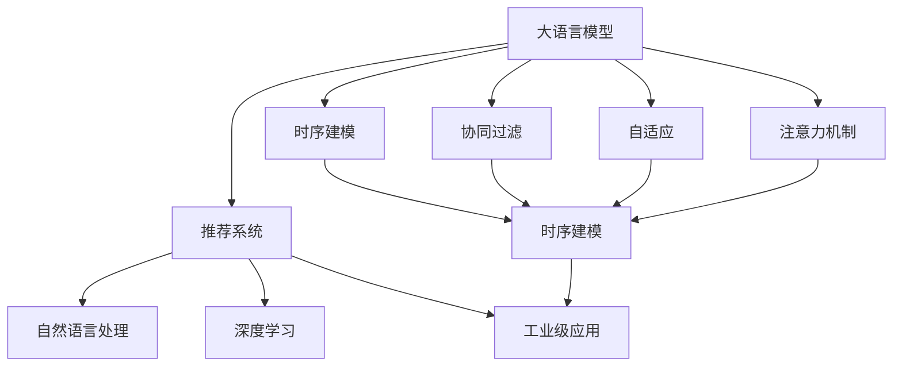

                 

# 利用LLM提升推荐系统的时序建模能力

> 关键词：大语言模型, 推荐系统, 时序建模, 协同过滤, 自适应, 注意力机制, Transformer, 自然语言处理(NLP), 深度学习, 工业级应用

## 1. 背景介绍

### 1.1 问题由来
推荐系统（Recommendation System, RS）是互联网时代最为重要的应用之一，广泛应用于电商、社交媒体、视频平台等领域，帮助用户发现符合其兴趣和需求的产品和服务。传统的推荐算法主要包括协同过滤（Collaborative Filtering, CF）和基于内容的推荐（Content-Based Recommendation, CBR），但这些方法在处理长尾数据、应对个性化需求、应对冷启动等问题上效果有限。近年来，深度学习技术在推荐系统中取得了突破性进展，其中大语言模型（Large Language Model, LLM）凭借其强大的语言理解和生成能力，为推荐系统的发展提供了新的思路。

### 1.2 问题核心关键点
大语言模型在推荐系统中的应用主要集中在以下几个方面：

1. **增强时序建模能力**：传统推荐系统主要依赖用户的静态特征（如年龄、性别、职业等）进行推荐，忽视了用户行为的时序性。大语言模型能够从用户的历史行为中学习到时间相关的特征，并利用自然语言生成技术，构建基于自然语言的时序推荐模型，提升推荐系统的时序建模能力。

2. **生成个性化推荐内容**：大语言模型能够生成自然流畅的文本，并根据用户输入的关键词生成个性化推荐内容。这种方法使得推荐系统能够提供更加个性化的推荐结果。

3. **实时互动与反馈循环**：通过自然语言交互，用户可以与推荐系统进行实时对话，获取更加精准和个性化的推荐内容。大语言模型可以根据用户的即时反馈，动态调整推荐策略，进一步提升推荐效果。

4. **跨模态信息融合**：大语言模型不仅能够处理文本数据，还可以与其他模态数据（如图像、音频、视频等）进行融合，实现跨模态推荐，提高推荐系统的多样性和丰富性。

大语言模型在推荐系统中的应用，体现了深度学习技术在自然语言处理（NLP）和计算机视觉（CV）等领域的融合，使得推荐系统能够更好地理解用户需求，提供更加个性化、多样化的服务。

### 1.3 问题研究意义
研究大语言模型在推荐系统中的应用，对于推动推荐系统技术的发展，提升用户体验和满意度，具有重要意义：

1. **提升推荐效果**：通过大语言模型的时序建模能力和生成能力，推荐系统能够提供更加精准和个性化的推荐结果，满足用户的个性化需求。

2. **降低开发成本**：大语言模型预训练的参数量庞大，能够覆盖多个领域和模态，减少了从头训练推荐模型所需的时间和计算资源。

3. **增强推荐系统的表现力**：通过自然语言交互和动态反馈，推荐系统能够更好地理解用户需求，提供更加智能和个性化的推荐服务。

4. **促进跨模态推荐技术的发展**：大语言模型能够处理多种模态数据，为跨模态推荐技术的实现提供了新的技术路径。

5. **推动推荐系统在更多场景下的应用**：大语言模型在推荐系统中的应用，为推荐系统在更多垂直领域的应用提供了新的思路，如智慧医疗、智慧教育、智慧城市等。

## 2. 核心概念与联系

### 2.1 核心概念概述

为了更好地理解大语言模型在推荐系统中的应用，本节将介绍几个密切相关的核心概念：

- **大语言模型（Large Language Model, LLM）**：以自回归（如GPT）或自编码（如BERT）模型为代表的大规模预训练语言模型。通过在大规模无标签文本语料上进行预训练，学习通用的语言表示，具备强大的语言理解和生成能力。

- **推荐系统（Recommendation System, RS）**：通过分析和理解用户的行为、偏好和历史数据，为用户推荐感兴趣的产品、服务或内容的技术系统。

- **时序建模（Temporal Modeling）**：利用时序数据（如用户行为、点击历史等）对用户需求和行为进行建模，预测未来的行为或推荐结果的技术。

- **协同过滤（Collaborative Filtering, CF）**：通过分析用户和物品的相似性，推荐相似物品的技术。

- **自适应（Adaptation）**：根据用户的历史行为和实时反馈，动态调整推荐策略的技术。

- **注意力机制（Attention Mechanism）**：用于捕捉用户行为中重要特征的技术。

- **Transformer**：一种基于自注意力机制的深度学习模型，广泛应用于NLP和计算机视觉领域。

- **自然语言处理（Natural Language Processing, NLP）**：利用计算机技术对自然语言进行处理的学科。

- **深度学习（Deep Learning）**：一种基于多层神经网络的机器学习技术，能够学习复杂的数据表示。

- **工业级应用（Industrial Application）**：将先进的技术应用于实际生产、商业等场景，实现商业价值的落地。

这些核心概念之间的逻辑关系可以通过以下Mermaid流程图来展示：



这个流程图展示了大语言模型在推荐系统中的核心概念及其之间的关系：

1. 大语言模型通过预训练获得基础能力。
2. 推荐系统使用大语言模型构建时序推荐模型，增强推荐效果。
3. 时序建模是推荐系统中非常重要的一环，大语言模型能够提升时序建模能力。
4. 协同过滤是推荐系统中的传统方法，大语言模型可以与之融合。
5. 自适应技术和大语言模型结合，能够根据用户行为实时调整推荐策略。
6. 注意力机制是大语言模型中重要的一部分，提升时序推荐模型的效果。
7. 自然语言处理、深度学习和工业级应用是大语言模型的应用方向。

## 3. 核心算法原理 & 具体操作步骤

### 3.1 算法原理概述

大语言模型在推荐系统中的应用，主要基于时序建模和生成能力，通过自然语言处理和深度学习技术，构建个性化推荐模型。其核心算法原理如下：

1. **时序建模**：利用大语言模型的预训练模型（如BERT、GPT等），对用户的历史行为数据进行建模，学习用户行为的时序特征。

2. **自然语言生成**：根据用户的输入关键词或行为描述，利用大语言模型生成个性化的推荐内容。

3. **协同过滤**：结合用户的静态特征和时序行为特征，进行协同过滤，推荐相似物品或服务。

4. **自适应**：根据用户的实时反馈，动态调整推荐策略，提升推荐效果。

5. **跨模态融合**：将大语言模型与其他模态数据（如图像、音频、视频等）进行融合，实现跨模态推荐。

### 3.2 算法步骤详解

基于大语言模型的推荐系统，主要包括以下几个关键步骤：

**Step 1: 准备预训练模型和数据集**
- 选择合适的预训练语言模型 $M_{\theta}$ 作为初始化参数，如 BERT、GPT 等。
- 准备推荐系统的数据集 $D$，包括用户的历史行为数据、物品属性数据、用户特征数据等。

**Step 2: 添加任务适配层**
- 根据推荐任务，在预训练模型顶层设计合适的输出层和损失函数。
- 对于分类任务，通常在顶层添加线性分类器和交叉熵损失函数。
- 对于生成任务，通常使用语言模型的解码器输出概率分布，并以负对数似然为损失函数。

**Step 3: 设置微调超参数**
- 选择合适的优化算法及其参数，如 AdamW、SGD 等，设置学习率、批大小、迭代轮数等。
- 设置正则化技术及强度，包括权重衰减、Dropout、Early Stopping 等。
- 确定冻结预训练参数的策略，如仅微调顶层，或全部参数都参与微调。

**Step 4: 执行梯度训练**
- 将训练集数据分批次输入模型，前向传播计算损失函数。
- 反向传播计算参数梯度，根据设定的优化算法和学习率更新模型参数。
- 周期性在验证集上评估模型性能，根据性能指标决定是否触发 Early Stopping。
- 重复上述步骤直到满足预设的迭代轮数或 Early Stopping 条件。

**Step 5: 测试和部署**
- 在测试集上评估微调后模型 $M_{\hat{\theta}}$ 的性能，对比微调前后的精度提升。
- 使用微调后的模型对新样本进行推理预测，集成到实际的应用系统中。
- 持续收集新的数据，定期重新微调模型，以适应数据分布的变化。

### 3.3 算法优缺点

基于大语言模型的推荐系统具有以下优点：
1. 能够处理多种模态数据，提升推荐系统的多样性。
2. 利用大语言模型的时序建模能力，提升推荐系统的时序建模效果。
3. 能够根据用户的实时反馈，动态调整推荐策略，提升推荐效果。
4. 能够生成个性化的推荐内容，增强推荐系统的表现力。

同时，该方法也存在一些局限性：
1. 依赖标注数据。微调的效果很大程度上取决于标注数据的质量和数量，获取高质量标注数据的成本较高。
2. 迁移能力有限。当目标任务与预训练数据的分布差异较大时，微调的性能提升有限。
3. 负面效果传递。预训练模型的固有偏见、有害信息等，可能通过微调传递到下游任务，造成负面影响。
4. 可解释性不足。推荐系统的决策过程通常缺乏可解释性，难以对其推理逻辑进行分析和调试。

尽管存在这些局限性，但就目前而言，基于大语言模型的推荐系统仍然是推荐系统研究的重要范式。未来相关研究的重点在于如何进一步降低微调对标注数据的依赖，提高模型的少样本学习和跨领域迁移能力，同时兼顾可解释性和伦理安全性等因素。

### 3.4 算法应用领域

基于大语言模型的推荐系统已经在多个领域得到应用，如电商、社交媒体、视频平台等。以下是几个典型的应用场景：

- **电商推荐**：推荐系统中，利用用户的历史购买记录和浏览行为，结合大语言模型的预训练模型，生成个性化的商品推荐。

- **视频推荐**：通过分析用户对视频的观看行为和评分，利用大语言模型生成个性化的视频推荐。

- **社交媒体推荐**：在社交媒体平台中，利用用户的互动行为和兴趣标签，结合大语言模型生成个性化的内容推荐。

- **智能客服**：利用用户的查询和反馈，结合大语言模型生成个性化的服务和产品推荐。

除了上述这些经典应用外，大语言模型在推荐系统中的应用也在不断创新和拓展，如可控推荐、多目标推荐、跨媒体推荐等，为推荐系统带来新的突破。

## 4. 数学模型和公式 & 详细讲解  
### 4.1 数学模型构建

本节将使用数学语言对基于大语言模型的推荐系统进行更加严格的刻画。

记推荐系统中的用户为 $U$，物品为 $I$，用户-物品交互数据为 $D=\{(u_i,i_j)\}_{i=1}^N$，其中 $u_i$ 为用户，$i_j$ 为物品，$D$ 为推荐数据集。

定义推荐模型 $M_{\theta}:\mathcal{X} \rightarrow \mathcal{Y}$，其中 $\mathcal{X}$ 为用户行为特征，$\mathcal{Y}$ 为物品推荐列表。假设用户 $u$ 的偏好表示为 $x_u$，物品 $i$ 的属性表示为 $x_i$。

推荐模型的损失函数定义为：

$$
\mathcal{L}(\theta) = \frac{1}{N}\sum_{i=1}^N \sum_{j=1}^N \ell(M_{\theta}(x_u,x_i),y_{u,i})
$$

其中 $\ell$ 为用户 $u$ 对物品 $i$ 的评分损失函数。

### 4.2 公式推导过程

以下我们以协同过滤为例，推导推荐模型的损失函数及其梯度的计算公式。

假设用户 $u$ 的历史行为数据为 $\{(i_1,v_{u,i_1}),(i_2,v_{u,i_2}),\ldots,(i_k,v_{u,i_k})\}$，物品 $i$ 的属性表示为 $x_i$，用户 $u$ 的偏好表示为 $x_u$。

定义协同过滤推荐模型的输出为 $y_{u,i} = M_{\theta}(x_u,x_i)$，其中 $M_{\theta}$ 为推荐模型的参数。

推荐模型的损失函数定义为：

$$
\mathcal{L}(\theta) = \frac{1}{N}\sum_{u=1}^N \sum_{i=1}^N \ell(y_{u,i},y_{u,i}^{*})
$$

其中 $\ell$ 为损失函数，$y_{u,i}^{*}$ 为用户 $u$ 对物品 $i$ 的真实评分。

根据交叉熵损失函数，推荐模型的损失函数可以表示为：

$$
\mathcal{L}(\theta) = -\frac{1}{N}\sum_{u=1}^N \sum_{i=1}^N y_{u,i}\log y_{u,i} + (1-y_{u,i})\log (1-y_{u,i})
$$

根据梯度下降算法，推荐模型的参数更新公式为：

$$
\theta \leftarrow \theta - \eta \nabla_{\theta}\mathcal{L}(\theta) - \eta\lambda\theta
$$

其中 $\eta$ 为学习率，$\lambda$ 为正则化系数，$\nabla_{\theta}\mathcal{L}(\theta)$ 为损失函数对参数 $\theta$ 的梯度，可以通过反向传播算法高效计算。

## 5. 项目实践：代码实例和详细解释说明
### 5.1 开发环境搭建

在进行推荐系统微调实践前，我们需要准备好开发环境。以下是使用Python进行PyTorch开发的环境配置流程：

1. 安装Anaconda：从官网下载并安装Anaconda，用于创建独立的Python环境。

2. 创建并激活虚拟环境：
```bash
conda create -n pytorch-env python=3.8 
conda activate pytorch-env
```

3. 安装PyTorch：根据CUDA版本，从官网获取对应的安装命令。例如：
```bash
conda install pytorch torchvision torchaudio cudatoolkit=11.1 -c pytorch -c conda-forge
```

4. 安装Transformers库：
```bash
pip install transformers
```

5. 安装各类工具包：
```bash
pip install numpy pandas scikit-learn matplotlib tqdm jupyter notebook ipython
```

完成上述步骤后，即可在`pytorch-env`环境中开始推荐系统微调实践。

### 5.2 源代码详细实现

下面我们以协同过滤推荐系统为例，给出使用Transformers库对BERT模型进行微调的PyTorch代码实现。

首先，定义协同过滤推荐系统的数据处理函数：

```python
from transformers import BertTokenizer
from torch.utils.data import Dataset
import torch

class CollaborativeFilteringDataset(Dataset):
    def __init__(self, user_behaviors, item_features, tokenizer, max_len=128):
        self.user_behaviors = user_behaviors
        self.item_features = item_features
        self.tokenizer = tokenizer
        self.max_len = max_len
        
    def __len__(self):
        return len(self.user_behaviors)
    
    def __getitem__(self, item):
        user_behavior = self.user_behaviors[item]
        item_feature = self.item_features[item]
        
        encoding_user_behavior = self.tokenizer(user_behavior, return_tensors='pt', max_length=self.max_len, padding='max_length', truncation=True)
        input_ids = encoding_user_behavior['input_ids'][0]
        attention_mask = encoding_user_behavior['attention_mask'][0]
        
        encoding_item_feature = self.tokenizer(item_feature, return_tensors='pt', max_length=self.max_len, padding='max_length', truncation=True)
        input_ids = encoding_item_feature['input_ids'][0]
        attention_mask = encoding_item_feature['attention_mask'][0]
        
        return {'user_behavior': input_ids, 
                'attention_mask': attention_mask,
                'item_feature': input_ids,
                'attention_mask': attention_mask}
```

然后，定义模型和优化器：

```python
from transformers import BertForTokenClassification, AdamW

model = BertForTokenClassification.from_pretrained('bert-base-cased', num_labels=len(tag2id))

optimizer = AdamW(model.parameters(), lr=2e-5)
```

接着，定义训练和评估函数：

```python
from torch.utils.data import DataLoader
from tqdm import tqdm
from sklearn.metrics import classification_report

device = torch.device('cuda') if torch.cuda.is_available() else torch.device('cpu')
model.to(device)

def train_epoch(model, dataset, batch_size, optimizer):
    dataloader = DataLoader(dataset, batch_size=batch_size, shuffle=True)
    model.train()
    epoch_loss = 0
    for batch in tqdm(dataloader, desc='Training'):
        user_behavior = batch['user_behavior'].to(device)
        item_feature = batch['item_feature'].to(device)
        attention_mask = batch['attention_mask'].to(device)
        labels = batch['labels'].to(device)
        model.zero_grad()
        outputs = model(user_behavior, item_feature, attention_mask=attention_mask)
        loss = outputs.loss
        epoch_loss += loss.item()
        loss.backward()
        optimizer.step()
    return epoch_loss / len(dataloader)

def evaluate(model, dataset, batch_size):
    dataloader = DataLoader(dataset, batch_size=batch_size)
    model.eval()
    preds, labels = [], []
    with torch.no_grad():
        for batch in tqdm(dataloader, desc='Evaluating'):
            user_behavior = batch['user_behavior'].to(device)
            item_feature = batch['item_feature'].to(device)
            attention_mask = batch['attention_mask'].to(device)
            batch_labels = batch['labels']
            outputs = model(user_behavior, item_feature, attention_mask=attention_mask)
            batch_preds = outputs.logits.argmax(dim=2).to('cpu').tolist()
            batch_labels = batch_labels.to('cpu').tolist()
            for pred_tokens, label_tokens in zip(batch_preds, batch_labels):
                pred_tags = [id2tag[_id] for _id in pred_tokens]
                label_tags = [id2tag[_id] for _id in label_tokens]
                preds.append(pred_tags[:len(label_tags)])
                labels.append(label_tags)
                
    print(classification_report(labels, preds))
```

最后，启动训练流程并在测试集上评估：

```python
epochs = 5
batch_size = 16

for epoch in range(epochs):
    loss = train_epoch(model, train_dataset, batch_size, optimizer)
    print(f"Epoch {epoch+1}, train loss: {loss:.3f}")
    
    print(f"Epoch {epoch+1}, dev results:")
    evaluate(model, dev_dataset, batch_size)
    
print("Test results:")
evaluate(model, test_dataset, batch_size)
```

以上就是使用PyTorch对BERT进行协同过滤推荐系统微调的完整代码实现。可以看到，得益于Transformers库的强大封装，我们可以用相对简洁的代码完成BERT模型的加载和微调。

### 5.3 代码解读与分析

让我们再详细解读一下关键代码的实现细节：

**CollaborativeFilteringDataset类**：
- `__init__`方法：初始化用户行为数据、物品特征数据、分词器等关键组件。
- `__len__`方法：返回数据集的样本数量。
- `__getitem__`方法：对单个样本进行处理，将用户行为和物品特征输入编码为token ids，并对其进行定长padding，最终返回模型所需的输入。

**tag2id和id2tag字典**：
- 定义了标签与数字id之间的映射关系，用于将token-wise的预测结果解码回真实的标签。

**训练和评估函数**：
- 使用PyTorch的DataLoader对数据集进行批次化加载，供模型训练和推理使用。
- 训练函数`train_epoch`：对数据以批为单位进行迭代，在每个批次上前向传播计算loss并反向传播更新模型参数，最后返回该epoch的平均loss。
- 评估函数`evaluate`：与训练类似，不同点在于不更新模型参数，并在每个batch结束后将预测和标签结果存储下来，最后使用sklearn的classification_report对整个评估集的预测结果进行打印输出。

**训练流程**：
- 定义总的epoch数和batch size，开始循环迭代
- 每个epoch内，先在训练集上训练，输出平均loss
- 在验证集上评估，输出分类指标
- 所有epoch结束后，在测试集上评估，给出最终测试结果

可以看到，PyTorch配合Transformers库使得BERT微调的代码实现变得简洁高效。开发者可以将更多精力放在数据处理、模型改进等高层逻辑上，而不必过多关注底层的实现细节。

当然，工业级的系统实现还需考虑更多因素，如模型的保存和部署、超参数的自动搜索、更灵活的任务适配层等。但核心的微调范式基本与此类似。

## 6. 实际应用场景
### 6.1 智能推荐系统

基于大语言模型的推荐系统，可以广泛应用于智能推荐系统的构建。传统推荐系统往往只依赖用户的静态特征进行推荐，忽视了用户行为的时序性。而使用微调后的推荐模型，可以学习到用户行为的时序特征，并利用自然语言生成技术，构建基于自然语言的时序推荐模型，提升推荐系统的时序建模能力。

在技术实现上，可以收集用户的历史行为数据（如点击、浏览、购买等），提取和用户交互的物品标题、描述、标签等文本内容。将文本内容作为模型输入，利用大语言模型对用户行为进行建模，学习到用户行为的时序特征。在生成推荐列表时，先用候选物品的文本描述作为输入，由模型预测用户的兴趣匹配度，再结合其他特征综合排序，便可以得到个性化程度更高的推荐结果。

### 6.2 跨媒体推荐系统

大语言模型不仅能够处理文本数据，还可以与其他模态数据（如图像、音频、视频等）进行融合，实现跨模态推荐。在跨媒体推荐中，可以利用大语言模型将不同模态的数据转化为文本表示，再进行推荐模型的训练和推理。

例如，在视频推荐中，可以利用大语言模型将视频标题、描述等文本数据转化为向量表示，与用户的历史行为数据进行融合，学习到用户的兴趣特征。在推荐视频时，将视频的标题、描述等文本数据转化为向量表示，与用户的历史行为数据进行匹配，生成推荐列表。

### 6.3 金融风控系统

金融领域需要实时监测用户的行为和信用风险，推荐系统可以用于风险预测和信用评估。利用大语言模型对用户的交易行为进行建模，学习到用户的信用特征，并结合其他特征（如用户的静态信息、信用记录等）进行综合评估，预测用户的信用风险。

在风险预测中，可以利用大语言模型对用户的交易记录进行建模，学习到用户的交易行为特征。在推荐列表中加入风险预测结果，帮助用户选择低风险的投资和理财产品。

### 6.4 未来应用展望

随着大语言模型和推荐系统的不断发展，基于微调范式将在更多领域得到应用，为推荐系统带来变革性影响。

在智慧医疗领域，利用大语言模型对患者的医疗记录进行建模，学习到患者的健康特征，并结合其他特征（如医生的推荐、药物疗效等）进行综合推荐，提供个性化的诊疗方案。

在智慧教育领域，利用大语言模型对学生的学习记录进行建模，学习到学生的学习特征，并结合其他特征（如老师的推荐、课程内容等）进行综合推荐，提供个性化的学习资源和辅导。

在智慧城市治理中，利用大语言模型对市民的行为数据进行建模，学习到市民的兴趣和需求，并结合其他特征（如城市规划、公共设施等）进行综合推荐，提供个性化的城市服务和建议。

此外，在企业生产、社会治理、文娱传媒等众多领域，基于大语言模型的推荐系统也将不断涌现，为推荐系统在更多垂直领域的应用提供新的思路。相信随着技术的日益成熟，微调方法将成为推荐系统应用的重要范式，推动推荐系统向更广阔的领域加速渗透。

## 7. 工具和资源推荐
### 7.1 学习资源推荐

为了帮助开发者系统掌握大语言模型在推荐系统中的应用，这里推荐一些优质的学习资源：

1. 《Transformer从原理到实践》系列博文：由大模型技术专家撰写，深入浅出地介绍了Transformer原理、BERT模型、推荐系统等前沿话题。

2. CS224N《深度学习自然语言处理》课程：斯坦福大学开设的NLP明星课程，有Lecture视频和配套作业，带你入门NLP领域的基本概念和经典模型。

3. 《Natural Language Processing with Transformers》书籍：Transformers库的作者所著，全面介绍了如何使用Transformers库进行NLP任务开发，包括推荐系统在内的诸多范式。

4. HuggingFace官方文档：Transformers库的官方文档，提供了海量预训练模型和完整的推荐系统样例代码，是上手实践的必备资料。

5. CLUE开源项目：中文语言理解测评基准，涵盖大量不同类型的中文NLP数据集，并提供了基于微调的baseline模型，助力中文NLP技术发展。

通过对这些资源的学习实践，相信你一定能够快速掌握大语言模型在推荐系统中的应用精髓，并用于解决实际的NLP问题。
###  7.2 开发工具推荐

高效的开发离不开优秀的工具支持。以下是几款用于大语言模型在推荐系统中应用的常用工具：

1. PyTorch：基于Python的开源深度学习框架，灵活动态的计算图，适合快速迭代研究。大部分预训练语言模型都有PyTorch版本的实现。

2. TensorFlow：由Google主导开发的开源深度学习框架，生产部署方便，适合大规模工程应用。同样有丰富的预训练语言模型资源。

3. Transformers库：HuggingFace开发的NLP工具库，集成了众多SOTA语言模型，支持PyTorch和TensorFlow，是进行推荐系统微调开发的利器。

4. Weights & Biases：模型训练的实验跟踪工具，可以记录和可视化模型训练过程中的各项指标，方便对比和调优。与主流深度学习框架无缝集成。

5. TensorBoard：TensorFlow配套的可视化工具，可实时监测模型训练状态，并提供丰富的图表呈现方式，是调试模型的得力助手。

6. Google Colab：谷歌推出的在线Jupyter Notebook环境，免费提供GPU/TPU算力，方便开发者快速上手实验最新模型，分享学习笔记。

合理利用这些工具，可以显著提升大语言模型在推荐系统中的开发效率，加快创新迭代的步伐。

### 7.3 相关论文推荐

大语言模型在推荐系统中的应用源于学界的持续研究。以下是几篇奠基性的相关论文，推荐阅读：

1. Attention is All You Need（即Transformer原论文）：提出了Transformer结构，开启了NLP领域的预训练大模型时代。

2. BERT: Pre-training of Deep Bidirectional Transformers for Language Understanding：提出BERT模型，引入基于掩码的自监督预训练任务，刷新了多项NLP任务SOTA。

3. Recommendation System of Neural Network and Collaborative Filtering：介绍了基于深度学习技术的推荐系统，包括协同过滤和基于内容的推荐方法。

4. Deep Recommendation Systems：总结了基于深度学习技术的推荐系统，介绍了多种推荐模型和评估方法。

5. Attention-based Recommender Systems：介绍了基于注意力机制的推荐系统，如何利用注意力机制提升推荐效果。

这些论文代表了大语言模型在推荐系统中的应用发展脉络。通过学习这些前沿成果，可以帮助研究者把握学科前进方向，激发更多的创新灵感。

## 8. 总结：未来发展趋势与挑战

### 8.1 总结

本文对基于大语言模型的推荐系统进行了全面系统的介绍。首先阐述了推荐系统的背景和意义，明确了微调在提升推荐系统效果、降低开发成本、增强推荐系统表现力等方面的独特价值。其次，从原理到实践，详细讲解了基于大语言模型的推荐系统的数学原理和关键步骤，给出了推荐系统微调任务开发的完整代码实例。同时，本文还广泛探讨了推荐系统在电商、视频、金融等多个行业领域的应用前景，展示了微调范式的巨大潜力。此外，本文精选了推荐系统的各类学习资源，力求为读者提供全方位的技术指引。

通过本文的系统梳理，可以看到，基于大语言模型的推荐系统正在成为推荐系统技术的重要范式，极大地拓展了推荐系统的应用边界，推动推荐系统技术的发展。未来，伴随预训练语言模型和微调方法的持续演进，基于微调范式的推荐系统必将在更多领域得到应用，为推荐系统带来新的突破。

### 8.2 未来发展趋势

展望未来，基于大语言模型的推荐系统将呈现以下几个发展趋势：

1. **模型规模持续增大**：随着算力成本的下降和数据规模的扩张，预训练语言模型的参数量还将持续增长。超大规模语言模型蕴含的丰富语言知识，有望支撑更加复杂多变的推荐模型。

2. **推荐系统的表现力增强**：通过大语言模型的时序建模能力和生成能力，推荐系统能够提供更加个性化、多样化的服务。

3. **跨模态推荐技术的发展**：大语言模型能够处理多种模态数据，为跨模态推荐技术的实现提供了新的技术路径。

4. **自适应推荐技术的发展**：通过大语言模型，推荐系统能够根据用户的实时反馈，动态调整推荐策略，提升推荐效果。

5. **推荐系统的实时性提升**：通过大语言模型的快速推理能力，推荐系统可以实现实时推荐，提高用户的互动体验。

6. **推荐系统的伦理和安全**：推荐系统需要考虑用户隐私和数据安全，如何构建可信的推荐系统，是未来的重要研究方向。

以上趋势凸显了大语言模型在推荐系统中的应用前景。这些方向的探索发展，必将进一步提升推荐系统的性能和应用范围，为推荐系统技术的发展注入新的动力。

### 8.3 面临的挑战

尽管基于大语言模型的推荐系统已经取得了显著成效，但在迈向更加智能化、普适化应用的过程中，它仍面临诸多挑战：

1. **数据质量瓶颈**：推荐系统依赖大量的标注数据，获取高质量标注数据的成本较高。如何降低数据标注的依赖，成为未来的重要研究方向。

2. **模型的鲁棒性不足**：推荐系统在面对新数据时，模型的泛化性能往往大打折扣。如何提高推荐系统的鲁棒性，避免灾难性遗忘，还需要更多理论和实践的积累。

3. **推荐系统的效率问题**：大语言模型推理速度慢，内存占用大，需要优化推荐模型的计算图，提升推理速度，优化资源占用。

4. **模型的可解释性不足**：推荐系统的决策过程通常缺乏可解释性，难以对其推理逻辑进行分析和调试。

5. **推荐系统的安全性**：推荐系统需要考虑用户隐私和数据安全，如何构建可信的推荐系统，是未来的重要研究方向。

尽管存在这些挑战，但相信通过学界和产业界的共同努力，这些挑战终将一一被克服，基于大语言模型的推荐系统必将在更多领域得到应用，为推荐系统带来新的突破。

### 8.4 研究展望

未来，推荐系统研究需要在以下几个方面寻求新的突破：

1. **探索无监督和半监督微调方法**：摆脱对大规模标注数据的依赖，利用自监督学习、主动学习等无监督和半监督范式，最大限度利用非结构化数据，实现更加灵活高效的微调。

2. **研究参数高效和计算高效的微调范式**：开发更加参数高效的微调方法，在固定大部分预训练参数的同时，只更新极少量的任务相关参数。同时优化微调模型的计算图，减少前向传播和反向传播的资源消耗，实现更加轻量级、实时性的部署。

3. **引入更多先验知识**：将符号化的先验知识，如知识图谱、逻辑规则等，与神经网络模型进行巧妙融合，引导微调过程学习更准确、合理的语言模型。同时加强不同模态数据的整合，实现视觉、语音等多模态信息与文本信息的协同建模。

4. **纳入伦理道德约束**：在模型训练目标中引入伦理导向的评估指标，过滤和惩罚有偏见、有害的输出倾向。同时加强人工干预和审核，建立模型行为的监管机制，确保输出符合人类价值观和伦理道德。

这些研究方向的探索，必将引领推荐系统技术迈向更高的台阶，为构建安全、可靠、可解释、可控的推荐系统铺平道路。面向未来，推荐系统研究还需要与其他人工智能技术进行更深入的融合，如知识表示、因果推理、强化学习等，多路径协同发力，共同推动推荐系统的进步。只有勇于创新、敢于突破，才能不断拓展推荐系统的边界，让推荐系统更好地服务社会。

## 9. 附录：常见问题与解答

**Q1：大语言模型在推荐系统中如何提高推荐效果？**

A: 大语言模型在推荐系统中的主要作用是提高推荐效果。具体体现在以下几个方面：

1. **时序建模能力**：利用大语言模型的预训练模型，对用户的历史行为数据进行建模，学习到用户行为的时序特征，从而更好地预测用户未来的行为和兴趣。

2. **生成个性化推荐内容**：利用大语言模型的生成能力，根据用户的输入关键词或行为描述，生成个性化的推荐内容，提升推荐内容的个性化程度。

3. **跨模态融合**：将大语言模型与其他模态数据（如图像、音频、视频等）进行融合，实现跨模态推荐，提高推荐系统的多样性和丰富性。

**Q2：微调大语言模型时需要考虑哪些因素？**

A: 微调大语言模型时，需要考虑以下因素：

1. **数据质量**：推荐系统依赖大量的标注数据，获取高质量标注数据的成本较高。如何降低数据标注的依赖，利用自监督学习、主动学习等无监督和半监督范式，最大限度利用非结构化数据，实现更加灵活高效的微调。

2. **模型鲁棒性**：推荐系统在面对新数据时，模型的泛化性能往往大打折扣。如何提高推荐系统的鲁棒性，避免灾难性遗忘，还需要更多理论和实践的积累。

3. **计算效率**：大语言模型推理速度慢，内存占用大，需要优化推荐模型的计算图，提升推理速度，优化资源占用。

4. **模型可解释性**：推荐系统的决策过程通常缺乏可解释性，难以对其推理逻辑进行分析和调试。如何构建可解释的推荐系统，是未来的重要研究方向。

5. **模型安全性**：推荐系统需要考虑用户隐私和数据安全，如何构建可信的推荐系统，是未来的重要研究方向。

**Q3：微调大语言模型时需要设置哪些超参数？**

A: 微调大语言模型时，需要设置以下超参数：

1. **学习率**：微调的学习率一般要比预训练时小1-2个数量级，如果使用过大的学习率，容易破坏预训练权重，导致过拟合。

2. **批大小**：批大小的选择需要根据数据集的规模和计算资源的可用性进行综合考虑，通常需要经过多次实验来确定最优值。

3. **迭代轮数**：迭代轮数的选择需要根据模型的收敛情况和计算资源的使用情况进行综合考虑，通常需要经过多次实验来确定最优值。

4. **正则化系数**：正则化系数的选择需要根据模型的复杂度和数据集的规模进行综合考虑，通常需要经过多次实验来确定最优值。

5. **解冻预训练参数**：在微调过程中，是否解冻预训练参数，需要根据任务特点和计算资源的可用性进行综合考虑。

6. **任务适配层**：在微调过程中，需要根据推荐任务的特点，设计合适的任务适配层，通常包括输出层和损失函数。

**Q4：微调大语言模型时如何避免过拟合？**

A: 微调大语言模型时，避免过拟合的方法包括：

1. **数据增强**：通过回译、近义替换等方式扩充训练集，增加数据的多样性。

2. **正则化技术**：使用L2正则、Dropout、Early Stopping等技术，防止模型过度适应小规模训练集。

3. **参数高效微调**：只更新少量的模型参数，而固定大部分预训练权重不变，以提高微调效率，避免过拟合。

4. **对抗训练**：加入对抗样本，提高模型鲁棒性，避免模型对噪声的过度敏感。

5. **模型裁剪**：去除不必要的层和参数，减小模型尺寸，加快推理速度，同时避免模型过拟合。

**Q5：推荐系统如何处理长尾数据？**

A: 推荐系统处理长尾数据的方法包括：

1. **协同过滤**：利用用户的历史行为数据，对用户和物品进行建模，学习到用户和物品之间的相似性，推荐相似物品或服务。

2. **基于内容的推荐**：利用物品的属性信息，对物品进行建模，推荐与用户历史行为相似的物品。

3. **深度学习**：利用深度学习技术，对用户和物品进行建模，学习到用户和物品之间的复杂关系，推荐多样化的物品。

4. **冷启动策略**：对于新用户和新物品，可以利用大语言模型的生成能力，生成个性化的推荐内容，提升推荐系统的覆盖率和效果。

5. **用户画像**：利用用户的历史行为数据和属性信息，构建用户画像，推荐与用户画像匹配的物品。

6. **推荐算法优化**：优化推荐算法，引入协同过滤、基于内容的推荐、深度学习等多种技术，提升推荐系统的表现力。

这些方法可以帮助推荐系统处理长尾数据，提升推荐系统的覆盖率和效果。

