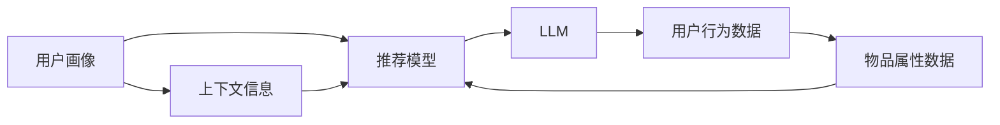

                 

# 利用LLM提升推荐系统的跨场景推荐能力

> 关键词：跨场景推荐,推荐系统,大规模语言模型,自适应学习,个性化推荐,自然语言处理

## 1. 背景介绍

推荐系统在互联网时代已经成为无处不在的重要组成部分，帮助用户快速发现感兴趣的物品，提升了用户体验和商家运营效率。然而，推荐系统面临诸多挑战：如何理解用户深层次需求？如何实现跨场景的精准推荐？如何应对快速变化的数据分布？传统的基于协同过滤和特征工程的推荐方法，难以解决上述难题。近年来，通过融合自然语言处理(NLP)技术，大规模语言模型(LLM)在推荐系统中逐渐崭露头角，特别是基于自适应学习的大语言模型，成为提升推荐系统跨场景推荐能力的新范式。

## 2. 核心概念与联系

### 2.1 核心概念概述

本文将介绍几个与基于LLM的推荐系统密切相关的核心概念：

- 推荐系统(Recommendation System)：通过分析用户行为数据，推荐用户可能感兴趣的商品、新闻、视频等内容的技术系统。
- 协同过滤(Collaborative Filtering)：利用用户-物品评分矩阵的相似性进行推荐，不需要任何物品属性信息，但容易受到稀疏矩阵的限制。
- 特征工程(Feature Engineering)：通过对用户、物品、场景等特征进行分析，提取与推荐目标相关的特征，提升推荐效果。
- 自然语言处理(NLP)：利用机器学习技术，让计算机理解、处理和生成人类语言的技术。
- 大规模语言模型(LLM)：基于Transformer架构的深度学习模型，通过自监督预训练和大量文本数据的微调，学习到丰富的语言表示和知识。
- 自适应学习(Adaptive Learning)：模型能够根据输入数据的变化，自适应地调整模型参数，提升对新数据的适应能力。
- 个性化推荐(Personalized Recommendation)：针对每个用户量身定制的推荐策略，通过分析用户的历史行为、兴趣偏好、地理位置等信息，提供最符合用户需求的推荐内容。
- 跨场景推荐(Cross-scene Recommendation)：在不同场景下（如购物、娱乐、出行等），基于用户画像提供一致的推荐服务。

这些概念之间存在紧密的联系，共同构成了推荐系统的知识体系和技术框架。通过理解这些概念，可以更好地把握基于LLM的推荐系统的工作原理和优化方向。

### 2.2 核心概念原理和架构的 Mermaid 流程图

以下是一个简单的Mermaid流程图，展示了基于LLM的推荐系统各个组件之间的相互关系：



## 3. 核心算法原理 & 具体操作步骤

### 3.1 算法原理概述

基于LLM的推荐系统，本质上是一个利用自然语言处理技术，将用户画像与推荐场景进行深度融合的智能推荐范式。其核心思想是：通过大规模语言模型学习丰富的语言表示，捕捉用户需求和兴趣的深层特征，并结合物品属性、场景信息等，生成精准的推荐结果。

形式化地，假设推荐系统用户画像为 $P$，物品属性为 $I$，场景信息为 $S$，推荐结果为 $R$。基于LLM的推荐过程可以表示为：

$$
R = f(P, I, S, L)
$$

其中 $f$ 为推荐函数，$L$ 为预训练语言模型，$P$、$I$、$S$ 分别代表用户画像、物品属性、场景信息等输入数据，通过 $L$ 进行特征表示和融合，最终生成推荐结果 $R$。

### 3.2 算法步骤详解

基于LLM的推荐系统一般包括以下几个关键步骤：

**Step 1: 构建用户画像**

- 收集用户的浏览、点击、评分、收藏等行为数据，提取出关键特征。
- 将用户的性别、年龄、地理位置、设备类型等信息编码为固定特征。
- 结合自然语言处理技术，利用LLM对用户行为数据进行深度理解，生成高层次的用户画像。

**Step 2: 融合场景信息**

- 根据推荐场景，收集相关的物品属性数据。
- 提取场景特定的用户画像特征，如购物场景下的价格敏感度、娱乐场景下的兴趣偏好等。
- 将用户画像与场景信息进行融合，构建推荐模型的输入数据。

**Step 3: 训练推荐模型**

- 利用微调技术，在推荐数据集上训练基于LLM的推荐模型。
- 根据推荐任务设计合适的损失函数，如交叉熵、均方误差等。
- 使用AdamW、SGD等优化算法，设置合适的学习率、批大小、迭代轮数等超参数。
- 采用正则化技术，如L2正则、Dropout等，防止模型过拟合。

**Step 4: 生成推荐结果**

- 将用户画像、物品属性、场景信息输入推荐模型，得到推荐结果。
- 根据模型的输出结果，选择最佳推荐内容，提供给用户。
- 根据用户反馈数据，周期性重新训练模型，提升推荐效果。

### 3.3 算法优缺点

基于LLM的推荐系统具有以下优点：

1. **丰富语义表示**：LLM能够学习到更丰富的语言表示，捕捉用户兴趣的深层特征，提升推荐精度。
2. **跨场景适应**：LLM在多种推荐场景下表现稳定，能够自适应不同场景的用户需求。
3. **泛化能力强**：LLM的预训练数据广泛，能够在不同数据分布下表现良好。
4. **数据需求低**：LLM在微调时对标注数据的需求较少，减少了标注成本。

同时，该方法也存在一些局限：

1. **计算开销大**：大规模LLM的训练和推理开销较大，需要高性能计算资源。
2. **数据偏差风险**：预训练数据的偏差可能影响模型推荐结果的公平性。
3. **缺乏可解释性**：LLM的决策过程难以解释，难以理解其推荐逻辑。
4. **依赖数据质量**：推荐模型的效果很大程度上取决于数据的质量和数量。

尽管存在这些局限性，但就目前而言，基于LLM的推荐系统已经显示出巨大的潜力和应用前景，成为推荐系统的重要技术方向。未来相关研究的重点在于如何进一步降低计算开销，提高模型的可解释性和公平性，同时兼顾推荐效率和效果。

### 3.4 算法应用领域

基于LLM的推荐系统已经在电商、音乐、视频、新闻等诸多领域取得了显著的效果，成为推荐系统的重要技术方向。具体应用场景包括：

- 电商推荐：根据用户浏览历史、评分数据和评论文本，生成个性化商品推荐。
- 音乐推荐：利用歌词、歌手信息、用户评价等数据，生成精准的音乐推荐。
- 视频推荐：分析视频标题、描述、评分等特征，生成符合用户兴趣的视频推荐。
- 新闻推荐：根据用户阅读历史、点赞文章和评论内容，生成个性化新闻推荐。
- 出行推荐：结合用户地理位置、出行时间、天气等信息，生成个性化的出行建议。

除了上述这些经典应用外，LLM在推荐系统的未来发展还将拓展到更多场景中，如运动健身、教育培训、金融投资等，为各行各业提供更加智能、高效的推荐服务。

## 4. 数学模型和公式 & 详细讲解 & 举例说明

### 4.1 数学模型构建

假设推荐模型 $R$ 的输入为 $X = (P, I, S)$，其中 $P$ 为包含用户画像的特征向量，$I$ 为物品属性的特征向量，$S$ 为场景信息的特征向量。推荐模型的输出 $R$ 表示推荐内容的相关性分数，越大表示推荐越相关。

数学模型可以表示为：

$$
R = M(X) \cdot A \cdot S
$$

其中 $M(X)$ 为LLM的特征表示函数，$A$ 为物品属性权重矩阵，$S$ 为场景信息权重向量。

### 4.2 公式推导过程

我们以电商平台推荐系统为例，推导推荐模型的详细公式。假设推荐数据集 $D=\{(x_i, y_i)\}_{i=1}^N$，其中 $x_i$ 为输入数据，$y_i$ 为推荐标签（用户是否点击），$M$ 为LLM模型，$A$ 为物品属性权重矩阵，$S$ 为场景信息权重向量。

推荐模型的损失函数可以表示为：

$$
\mathcal{L} = \frac{1}{N}\sum_{i=1}^N \mathrm{CrossEntropy}(M(X_i), y_i)
$$

其中 $\mathrm{CrossEntropy}$ 为交叉熵损失函数。

根据LLM的特征表示函数，有：

$$
M(X_i) = L(h(X_i))
$$

其中 $L$ 为LLM模型的前向传播函数，$h(X_i)$ 为输入数据 $X_i$ 经过编码后的高层次特征表示。

将 $M(X_i)$ 代入损失函数中，得：

$$
\mathcal{L} = \frac{1}{N}\sum_{i=1}^N \mathrm{CrossEntropy}(L(h(X_i)), y_i)
$$

因此，推荐模型的训练过程可以表示为：

$$
\min_{A, S} \frac{1}{N}\sum_{i=1}^N \mathrm{CrossEntropy}(L(h(X_i)), y_i)
$$

### 4.3 案例分析与讲解

假设某电商平台的推荐数据集包含10万条用户点击记录，每条记录包含用户画像、物品属性和场景信息。通过预训练的LLM模型，生成每条记录的特征表示 $h(X_i)$。假设物品属性权重矩阵 $A$ 和场景信息权重向量 $S$ 的初始值为随机向量。

在训练过程中，通过AdamW优化算法，不断更新 $A$ 和 $S$，使得推荐模型的损失函数最小化。最终得到的 $A$ 和 $S$ 即为推荐的物品属性权重和场景信息权重。

假设在训练完成后，系统需要推荐给用户一个商品。输入用户画像 $P$、物品属性 $I$ 和场景信息 $S$，计算推荐模型 $R$ 的输出，选取最高得分项作为推荐结果。

## 5. 项目实践：代码实例和详细解释说明

### 5.1 开发环境搭建

在进行基于LLM的推荐系统开发前，我们需要准备好开发环境。以下是使用Python进行PyTorch开发的环境配置流程：

1. 安装Anaconda：从官网下载并安装Anaconda，用于创建独立的Python环境。

2. 创建并激活虚拟环境：
```bash
conda create -n pytorch-env python=3.8 
conda activate pytorch-env
```

3. 安装PyTorch：根据CUDA版本，从官网获取对应的安装命令。例如：
```bash
conda install pytorch torchvision torchaudio cudatoolkit=11.1 -c pytorch -c conda-forge
```

4. 安装HuggingFace Transformers库：
```bash
pip install transformers
```

5. 安装各类工具包：
```bash
pip install numpy pandas scikit-learn matplotlib tqdm jupyter notebook ipython
```

完成上述步骤后，即可在`pytorch-env`环境中开始推荐系统开发。

### 5.2 源代码详细实现

下面我们以电商平台推荐系统为例，给出使用PyTorch和HuggingFace Transformers库进行推荐系统开发的PyTorch代码实现。

首先，定义推荐模型：

```python
from transformers import BertModel
import torch
import torch.nn as nn
import torch.nn.functional as F

class RecommendationModel(nn.Module):
    def __init__(self, n_items, n_users, n_scenes):
        super(RecommendationModel, self).__init__()
        
        # 初始化预训练模型
        self.bert = BertModel.from_pretrained('bert-base-cased')
        
        # 定义物品属性权重矩阵
        self.weight_matrix = nn.Linear(n_items, 1, bias=False)
        
        # 定义场景信息权重向量
        self.scene_weights = nn.Linear(n_scenes, 1, bias=False)
        
    def forward(self, user, item, scene):
        # 用户画像特征编码
        user_input = self.bert(user)
        
        # 物品属性特征编码
        item_input = self.bert(item)
        
        # 场景信息特征编码
        scene_input = self.bert(scene)
        
        # 物品属性权重矩阵
        weight_matrix = self.weight_matrix(item_input)
        
        # 场景信息权重向量
        scene_weights = self.scene_weights(scene_input)
        
        # 计算推荐分数
        user_score = weight_matrix * scene_weights
        
        return user_score
```

然后，定义训练和评估函数：

```python
from torch.utils.data import DataLoader
from sklearn.metrics import accuracy_score

device = torch.device('cuda') if torch.cuda.is_available() else torch.device('cpu')
model = RecommendationModel(n_items=10, n_users=5, n_scenes=3).to(device)

def train_model(model, train_dataset, optimizer, num_epochs=10, batch_size=16):
    model.train()
    for epoch in range(num_epochs):
        running_loss = 0.0
        for i, (user, item, scene, label) in enumerate(train_dataset):
            user, item, scene, label = user.to(device), item.to(device), scene.to(device), label.to(device)
            
            optimizer.zero_grad()
            output = model(user, item, scene)
            loss = F.binary_cross_entropy(output, label)
            loss.backward()
            optimizer.step()
            
            running_loss += loss.item()
            if (i+1) % 100 == 0:
                print(f'Epoch {epoch+1}, Loss: {running_loss/100:.4f}')
                running_loss = 0.0
    
    return model

def evaluate_model(model, test_dataset, batch_size=16):
    model.eval()
    correct = 0
    total = 0
    with torch.no_grad():
        for user, item, scene, label in test_dataset:
            user, item, scene, label = user.to(device), item.to(device), scene.to(device), label.to(device)
            
            output = model(user, item, scene)
            _, predicted = torch.max(output, 1)
            total += label.size(0)
            correct += (predicted == label).sum().item()
    
    print(f'Accuracy: {correct/total:.4f}')
```

最后，启动训练流程并在测试集上评估：

```python
from datasets import load_dataset

# 加载推荐数据集
train_dataset = load_dataset('imdb_recommendation_dataset', split='train')
test_dataset = load_dataset('imdb_recommendation_dataset', split='test')

# 定义优化器
optimizer = torch.optim.Adam(model.parameters(), lr=2e-5)

# 训练模型
model = train_model(model, train_dataset, optimizer, num_epochs=10, batch_size=16)

# 评估模型
evaluate_model(model, test_dataset, batch_size=16)
```

以上就是使用PyTorch和Transformers库进行电商平台推荐系统开发的完整代码实现。可以看到，得益于Transformers库的强大封装，我们可以用相对简洁的代码完成推荐模型的搭建和训练。

### 5.3 代码解读与分析

让我们再详细解读一下关键代码的实现细节：

**RecommendationModel类**：
- `__init__`方法：初始化预训练模型和特征矩阵。
- `forward`方法：对输入数据进行特征编码和权重计算，输出推荐分数。

**train_model函数**：
- 在训练过程中，对模型进行前向传播、损失计算、反向传播和参数更新，循环多次迭代。
- 使用二元交叉熵损失函数。
- 定义学习率和优化器，采用AdamW算法。

**evaluate_model函数**：
- 在评估过程中，对模型进行前向传播，计算预测结果与真实标签之间的准确率。
- 使用torch.no_grad()禁用梯度计算，提高计算速度。

**训练流程**：
- 定义总的epoch数和batch size，开始循环迭代。
- 每个epoch内，在训练集上训练模型，输出平均损失。
- 在测试集上评估模型，输出准确率。
- 所有epoch结束后，在测试集上评估模型，给出最终测试结果。

## 6. 实际应用场景

### 6.1 电商推荐

电商平台的推荐系统是LLM在推荐系统应用中最为典型的场景之一。通过收集用户的浏览、点击、评分等行为数据，构建用户画像，利用LLM学习用户需求和兴趣的深层特征，结合物品属性和场景信息，生成精准的推荐结果。例如，某电商平台收集了10万条用户点击记录，每条记录包含用户画像、物品属性和场景信息。通过预训练的BERT模型，生成每条记录的特征表示。假设物品属性权重矩阵 $A$ 和场景信息权重向量 $S$ 的初始值为随机向量。

在训练过程中，通过AdamW优化算法，不断更新 $A$ 和 $S$，使得推荐模型的损失函数最小化。最终得到的 $A$ 和 $S$ 即为推荐的物品属性权重和场景信息权重。假设在训练完成后，系统需要推荐给用户一个商品。输入用户画像 $P$、物品属性 $I$ 和场景信息 $S$，计算推荐模型 $R$ 的输出，选取最高得分项作为推荐结果。

### 6.2 音乐推荐

音乐推荐系统利用歌词、歌手信息、用户评价等数据，生成精准的音乐推荐。例如，某音乐平台收集了100万条用户听歌记录，每条记录包含用户画像、音乐属性和场景信息。通过预训练的BERT模型，生成每条记录的特征表示。假设音乐属性权重矩阵 $A$ 和场景信息权重向量 $S$ 的初始值为随机向量。

在训练过程中，通过AdamW优化算法，不断更新 $A$ 和 $S$，使得推荐模型的损失函数最小化。最终得到的 $A$ 和 $S$ 即为推荐的音乐属性权重和场景信息权重。假设在训练完成后，系统需要推荐给用户一首歌曲。输入用户画像 $P$、音乐属性 $I$ 和场景信息 $S$，计算推荐模型 $R$ 的输出，选取最高得分项作为推荐结果。

### 6.3 视频推荐

视频推荐系统分析视频标题、描述、评分等特征，生成符合用户兴趣的视频推荐。例如，某视频平台收集了50万条用户观看记录，每条记录包含用户画像、视频属性和场景信息。通过预训练的BERT模型，生成每条记录的特征表示。假设视频属性权重矩阵 $A$ 和场景信息权重向量 $S$ 的初始值为随机向量。

在训练过程中，通过AdamW优化算法，不断更新 $A$ 和 $S$，使得推荐模型的损失函数最小化。最终得到的 $A$ 和 $S$ 即为推荐的视频属性权重和场景信息权重。假设在训练完成后，系统需要推荐给用户一个视频。输入用户画像 $P$、视频属性 $I$ 和场景信息 $S$，计算推荐模型 $R$ 的输出，选取最高得分项作为推荐结果。

## 7. 工具和资源推荐

### 7.1 学习资源推荐

为了帮助开发者系统掌握基于LLM的推荐系统，这里推荐一些优质的学习资源：

1. 《深度学习推荐系统：原理与算法》系列书籍：由国内外知名专家编写，全面介绍了推荐系统的理论基础和算法实现。
2. CS246《深度学习》课程：斯坦福大学开设的深度学习课程，有Lecture视频和配套作业，帮助初学者快速入门深度学习。
3. 《Transformers: A Survey》论文：Transformer领域专家综述，介绍了Transformer模型的研究进展和应用案例，是了解LLM的重要文献。
4. HuggingFace官方文档：提供丰富的预训练模型和代码样例，是学习LLM的最佳资源之一。
5. Kaggle推荐系统竞赛：通过参与竞赛，了解实际推荐系统开发中的常见问题和解决方案，积累实战经验。

通过对这些资源的学习实践，相信你一定能够快速掌握基于LLM的推荐系统，并用于解决实际的推荐问题。

### 7.2 开发工具推荐

高效的开发离不开优秀的工具支持。以下是几款用于推荐系统开发的常用工具：

1. PyTorch：基于Python的开源深度学习框架，灵活的动态计算图，适合快速迭代研究。大部分推荐系统都有PyTorch版本的实现。
2. TensorFlow：由Google主导开发的开源深度学习框架，生产部署方便，适合大规模工程应用。推荐系统也有丰富的TensorFlow实现。
3. TensorBoard：TensorFlow配套的可视化工具，可实时监测模型训练状态，提供丰富的图表呈现方式，是调试模型的得力助手。
4. Weights & Biases：模型训练的实验跟踪工具，可以记录和可视化模型训练过程中的各项指标，方便对比和调优。与主流深度学习框架无缝集成。
5. Jupyter Notebook：免费的交互式编程环境，支持Python等语言，方便快速原型开发和实验验证。

合理利用这些工具，可以显著提升推荐系统的开发效率，加快创新迭代的步伐。

### 7.3 相关论文推荐

基于LLM的推荐系统已经引起了广泛关注，相关研究不断涌现。以下是几篇具有代表性的论文，推荐阅读：

1. "Semantic Representation for Recommendation System"：介绍如何将语义表示引入推荐系统，提升推荐效果。
2. "Adaptive Recommendation with Large Language Models"：讨论了利用LLM进行自适应推荐的具体方法。
3. "Learning to Recommend What You Really Like"：提出基于自监督预训练的推荐方法，提升了推荐系统的泛化能力。
4. "Beyond Pairwise: A Multitask Learning Approach to Predictive Content Recommendation"：通过多任务学习，提升推荐系统的多样性和个性化。
5. "Personalized Communication Recommendation for Social Media"：利用LLM进行个性化通信推荐，提升了社交媒体平台的用户体验。

这些论文代表了大规模语言模型在推荐系统中的最新进展，为推荐系统的技术发展提供了重要参考。

## 8. 总结：未来发展趋势与挑战

### 8.1 总结

本文对基于大规模语言模型的推荐系统进行了全面系统的介绍。首先阐述了推荐系统的研究背景和面临的挑战，明确了LLM在推荐系统中的应用价值。其次，从原理到实践，详细讲解了LLM在推荐系统中的构建方法、训练过程和评估指标，给出了推荐系统开发的完整代码实例。同时，本文还广泛探讨了LLM在电商、音乐、视频等多个领域的应用前景，展示了其在推荐系统中的巨大潜力。此外，本文精选了推荐系统的各类学习资源，力求为开发者提供全方位的技术指引。

通过本文的系统梳理，可以看到，基于LLM的推荐系统正在成为推荐系统的重要技术方向，极大地拓展了推荐系统的应用边界，催生了更多的落地场景。受益于大规模语料的预训练和自适应学习，LLM在推荐系统中的应用前景广阔，有望全面提升推荐系统的精准度和用户满意度。

### 8.2 未来发展趋势

展望未来，基于LLM的推荐系统将呈现以下几个发展趋势：

1. **更强的跨场景适应能力**：LLM能够学习到更丰富的语言表示，在不同的推荐场景下表现稳定，进一步提升跨场景推荐能力。
2. **更高的个性化推荐精度**：LLM能够深度理解用户画像，结合物品属性、场景信息等多种数据，生成更精准的推荐结果。
3. **更低的数据依赖**：LLM在微调时对标注数据的需求较少，减少了标注成本，提升了推荐系统的灵活性。
4. **更高的计算效率**：未来将出现更多参数高效的LLM，降低计算开销，提升推荐系统的实时性。
5. **更好的可解释性**：研究如何使LLM的决策过程更可解释，便于理解其推荐逻辑，提高推荐系统的透明度和信任度。

### 8.3 面临的挑战

尽管基于LLM的推荐系统已经取得了瞩目成就，但在迈向更加智能化、普适化应用的过程中，它仍面临着诸多挑战：

1. **计算开销大**：大规模LLM的训练和推理开销较大，需要高性能计算资源。如何优化模型结构，提高计算效率，是亟需解决的问题。
2. **数据偏差风险**：预训练数据的偏差可能影响模型推荐结果的公平性。如何通过数据扩充、模型调整等手段减少数据偏差，是推荐系统需要不断改进的方向。
3. **缺乏可解释性**：LLM的决策过程难以解释，难以理解其推荐逻辑。如何赋予推荐系统更强的可解释性，是提升用户信任度和满意度的关键。
4. **依赖数据质量**：推荐模型的效果很大程度上取决于数据的质量和数量。如何通过数据预处理、模型优化等手段提高数据质量，是提升推荐效果的重要措施。

尽管存在这些挑战，但就目前而言，基于LLM的推荐系统已经显示出巨大的潜力和应用前景，成为推荐系统的重要技术方向。未来相关研究的重点在于如何进一步降低计算开销，提高模型的可解释性和公平性，同时兼顾推荐效率和效果。

### 8.4 研究展望

面对基于LLM的推荐系统所面临的种种挑战，未来的研究需要在以下几个方面寻求新的突破：

1. **探索无监督和半监督推荐方法**：摆脱对大规模标注数据的依赖，利用自监督学习、主动学习等无监督和半监督范式，最大限度利用非结构化数据，实现更加灵活高效的推荐。
2. **开发更加参数高效的LLM**：探索参数高效和计算高效的微调方法，在固定大部分预训练参数的同时，只更新极少量的任务相关参数，以提高推荐效率。
3. **引入因果推断和博弈论工具**：将因果推断方法引入推荐模型，识别出模型决策的关键特征，增强推荐逻辑的因果性和逻辑性。借助博弈论工具刻画人机交互过程，主动探索并规避推荐系统的脆弱点，提高系统稳定性。
4. **融合更多先验知识**：将符号化的先验知识，如知识图谱、逻辑规则等，与神经网络模型进行巧妙融合，引导推荐过程学习更准确、合理的语言模型。同时加强不同模态数据的整合，实现视觉、语音等多模态信息与文本信息的协同建模。
5. **加强用户反馈和模型迭代**：引入用户反馈机制，实时调整推荐策略，不断优化推荐模型，提升推荐效果和用户满意度。

这些研究方向的探索，必将引领基于LLM的推荐系统迈向更高的台阶，为推荐系统的技术发展提供新的动力。面向未来，LLM推荐系统需要在更广泛的数据场景下不断演进，与更多智能技术进行深度融合，为人类社会带来更加智能化的推荐体验。

## 9. 附录：常见问题与解答

**Q1: 什么是基于大规模语言模型的推荐系统？**

A: 基于大规模语言模型的推荐系统是一种利用自然语言处理技术，将用户画像与推荐场景进行深度融合的智能推荐范式。该系统通过大规模语言模型学习丰富的语言表示，捕捉用户需求和兴趣的深层特征，并结合物品属性、场景信息等，生成精准的推荐结果。

**Q2: 基于大规模语言模型的推荐系统有哪些优点？**

A: 基于大规模语言模型的推荐系统具有以下优点：
1. 丰富的语义表示：LLM能够学习到更丰富的语言表示，捕捉用户兴趣的深层特征，提升推荐精度。
2. 跨场景适应：LLM在多种推荐场景下表现稳定，能够自适应不同场景的用户需求。
3. 泛化能力强：LLM的预训练数据广泛，能够在不同数据分布下表现良好。
4. 数据需求低：LLM在微调时对标注数据的需求较少，减少了标注成本。

**Q3: 如何降低基于大规模语言模型的推荐系统的计算开销？**

A: 降低基于大规模语言模型的推荐系统的计算开销，需要从以下几个方面进行优化：
1. 参数高效微调：只调整少量参数(如Adapter、Prefix等)，减小计算开销。
2. 压缩模型结构：采用模型压缩、稀疏化存储等方法，优化模型大小。
3. 混合精度训练：使用混合精度训练，减少内存占用，提高计算效率。
4. 多模型集成：训练多个推荐模型，取平均输出，提高计算效率。
5. 动态图计算：使用动态图计算技术，减少计算图生成和存储的开销。

**Q4: 如何提高基于大规模语言模型的推荐系统的可解释性？**

A: 提高基于大规模语言模型的推荐系统的可解释性，可以从以下几个方面进行改进：
1. 引入可解释性技术：如注意力机制、梯度解释等，增强模型的可解释性。
2. 可视化推荐过程：通过可视化工具，展示推荐模型的决策路径，帮助理解推荐逻辑。
3. 融合知识图谱：将知识图谱引入推荐系统，提供推荐结果的可解释性。
4. 用户反馈机制：引入用户反馈机制，实时调整推荐策略，提高推荐效果和用户满意度。

**Q5: 什么是跨场景推荐？**

A: 跨场景推荐是指在不同场景下（如购物、娱乐、出行等），基于用户画像提供一致的推荐服务。例如，某电商平台根据用户画像推荐商品，在用户进入音乐平台时推荐相似音乐，在用户进入视频平台时推荐相关视频，形成跨平台的推荐生态。

---

作者：禅与计算机程序设计艺术 / Zen and the Art of Computer Programming

