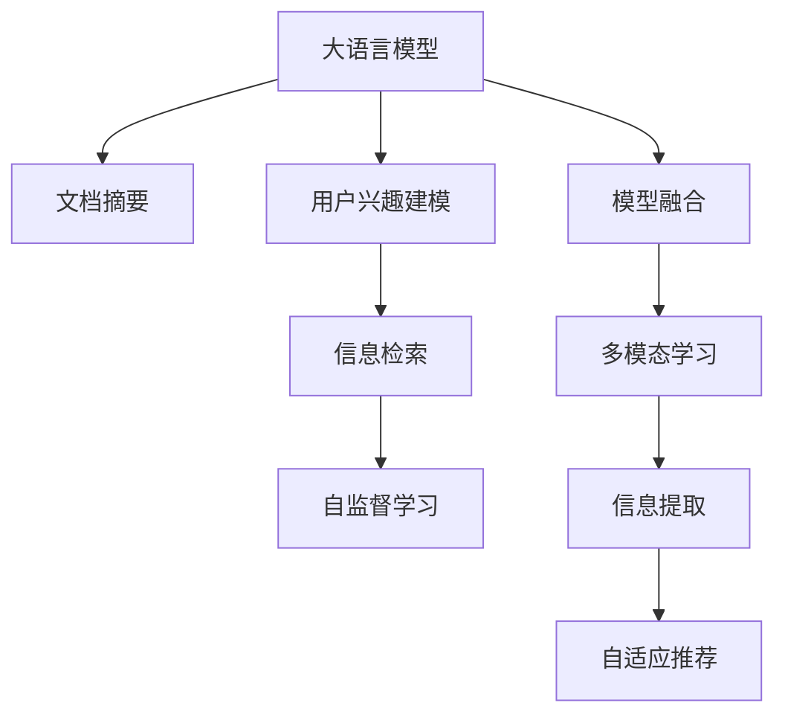

                 

# 利用LLM进行文档摘要与用户兴趣建模

> 关键词：大语言模型(LLM), 文档摘要, 用户兴趣建模, 信息检索, 自监督学习, 模型融合, 多模态学习, 信息提取, 自适应推荐

## 1. 背景介绍

在信息爆炸的时代，人们每天面对着海量的文档和内容，如何快速获取关键信息并发现自身的兴趣点，成为亟待解决的问题。文档摘要技术能帮助用户快速掌握文档的精华，而用户兴趣建模则可以个性化推荐用户感兴趣的内容。这两者结合，不仅能显著提升信息检索效率，还能在用户交互过程中提供更精准的推荐服务。

基于大语言模型(LLM)的信息检索和推荐系统，在过去几年中取得了显著进展。LLM在自然语言处理领域的优越表现，使得其在文档摘要和用户兴趣建模等任务中得以广泛应用。利用LLM进行文档摘要，不仅能保留关键信息，还能生成流畅自然的文本，提高用户阅读体验。而用户兴趣建模，则通过分析用户的历史行为和偏好，构建精准的兴趣模型，进一步优化个性化推荐效果。

本文将详细阐述基于LLM的文档摘要和用户兴趣建模技术，探讨其在信息检索和推荐系统中的实际应用。

## 2. 核心概念与联系

### 2.1 核心概念概述

为更好地理解LLM在文档摘要和用户兴趣建模中的应用，本节将介绍几个关键概念：

- 大语言模型(LLM)：以自回归(如GPT)或自编码(如BERT)模型为代表的预训练语言模型。通过在大规模无标签文本语料上进行预训练，学习通用语言表示，具备强大的语言理解和生成能力。

- 文档摘要：将一篇长文档提炼成简短的摘要，保留关键信息，帮助用户快速掌握文档主要内容。

- 用户兴趣建模：通过分析用户的历史行为、偏好和输入内容，建立用户的兴趣模型，预测其对不同内容的倾向和偏好。

- 信息检索：通过用户输入的查询词或语句，从大量文档中检索出相关的信息。

- 自监督学习：利用无标签数据进行训练，自适应地学习语言表示。

- 模型融合：通过结合不同模型，提升系统的整体性能和泛化能力。

- 多模态学习：将文本、图像、视频等多种模态信息进行联合建模。

- 信息提取：从文本中自动提取关键信息，用于摘要、分类等任务。

- 自适应推荐：根据用户当前行为和兴趣，动态调整推荐内容，提升用户体验。

这些概念之间的逻辑关系可以通过以下Mermaid流程图来展示：



这个流程图展示了LLM在文档摘要和用户兴趣建模中的核心作用及其与其他技术的关系：

1. LLM通过预训练学习语言表示，为文档摘要和用户兴趣建模提供基础能力。
2. 文档摘要和用户兴趣建模通过LSTM或注意力机制提取关键信息，构建摘要或兴趣模型。
3. 信息检索系统根据用户输入进行文档检索，将检索结果与兴趣模型匹配，提供个性化推荐。
4. 自监督学习用于提升模型的泛化能力，使模型更好地适应新数据。
5. 模型融合通过结合多种模型提升整体性能，如结合摘要和推荐模型，提高检索和推荐效果。
6. 多模态学习结合文本和图像信息，拓展模型对多样数据的理解能力。
7. 信息提取从文本中抽取关键信息，用于生成摘要或兴趣模型。
8. 自适应推荐根据用户动态行为调整推荐内容，提升用户体验。

这些核心概念共同构成了LLM在文档摘要和用户兴趣建模中的技术框架，使得模型能更好地服务于信息检索和推荐系统。

## 3. 核心算法原理 & 具体操作步骤

### 3.1 算法原理概述

基于LLM的文档摘要和用户兴趣建模技术，核心思想是通过LSTM或注意力机制对文本进行编码，提取关键信息并生成摘要，同时构建用户兴趣模型，预测其对不同内容的偏好。

形式化地，假设文档集合为 $\mathcal{D}=\{d_i\}_{i=1}^n$，用户历史行为数据为 $\mathcal{U}=\{u_j\}_{j=1}^m$，其中 $d_i$ 表示文本，$u_j$ 表示用户行为。文档摘要过程可以视为从 $\mathcal{D}$ 中选择一部分 $d_i^*$，使得 $\mathcal{L}(d_i^*) \approx \mathcal{L}(d_i)$，其中 $\mathcal{L}$ 表示文档表示函数。用户兴趣建模则可以视为在 $\mathcal{U}$ 上学习用户偏好函数 $f(u)$，预测用户对新内容 $c$ 的兴趣 $f(c|u)$。

### 3.2 算法步骤详解

基于LLM的文档摘要和用户兴趣建模算法主要包括以下几个关键步骤：

**Step 1: 准备预训练模型和数据集**
- 选择合适的预训练语言模型 $M_{\theta}$ 作为初始化参数，如 BERT、GPT 等。
- 准备文档数据集 $\mathcal{D}$ 和用户行为数据集 $\mathcal{U}$。

**Step 2: 添加任务适配层**
- 对于文档摘要任务，在预训练模型顶层添加线性解码器，并定义交叉熵损失函数。
- 对于用户兴趣建模任务，在预训练模型顶层添加全连接层，并定义均方误差损失函数。

**Step 3: 设置微调超参数**
- 选择合适的优化算法及其参数，如 AdamW、SGD 等，设置学习率、批大小、迭代轮数等。
- 设置正则化技术及强度，包括权重衰减、Dropout、Early Stopping等。
- 确定冻结预训练参数的策略，如仅微调顶层，或全部参数都参与微调。

**Step 4: 执行梯度训练**
- 将训练集数据分批次输入模型，前向传播计算损失函数。
- 反向传播计算参数梯度，根据设定的优化算法和学习率更新模型参数。
- 周期性在验证集上评估模型性能，根据性能指标决定是否触发 Early Stopping。
- 重复上述步骤直到满足预设的迭代轮数或 Early Stopping 条件。

**Step 5: 测试和部署**
- 在测试集上评估微调后模型 $M_{\hat{\theta}}$ 的性能，对比微调前后的精度提升。
- 使用微调后的模型对新样本进行推理预测，集成到实际的应用系统中。
- 持续收集新的数据，定期重新微调模型，以适应数据分布的变化。

### 3.3 算法优缺点

基于LLM的文档摘要和用户兴趣建模方法具有以下优点：
1. 简单高效。只需准备少量标注数据，即可对预训练模型进行快速适配，获得较大的性能提升。
2. 通用适用。适用于各种文档摘要和用户兴趣建模任务，只需设计合适的任务适配层即可实现微调。
3. 参数高效。利用参数高效微调技术，在固定大部分预训练参数的情况下，仍可取得不错的提升。
4. 效果显著。在学术界和工业界的诸多任务上，基于微调的方法已经刷新了最先进的性能指标。

同时，该方法也存在一定的局限性：
1. 依赖标注数据。微调的效果很大程度上取决于标注数据的质量和数量，获取高质量标注数据的成本较高。
2. 迁移能力有限。当目标任务与预训练数据的分布差异较大时，微调的性能提升有限。
3. 负面效果传递。预训练模型的固有偏见、有害信息等，可能通过微调传递到下游任务，造成负面影响。
4. 可解释性不足。微调模型的决策过程通常缺乏可解释性，难以对其推理逻辑进行分析和调试。

尽管存在这些局限性，但就目前而言，基于LLM的微调方法仍是大模型应用的最主流范式。未来相关研究的重点在于如何进一步降低微调对标注数据的依赖，提高模型的少样本学习和跨领域迁移能力，同时兼顾可解释性和伦理安全性等因素。

### 3.4 算法应用领域

基于LLM的文档摘要和用户兴趣建模方法，在NLP领域已经得到了广泛的应用，覆盖了几乎所有常见任务，例如：

- 新闻摘要：自动生成新闻报道的摘要。
- 科技论文摘要：从学术论文中提取关键信息，生成摘要。
- 产品介绍摘要：自动生成产品说明书的摘要。
- 专利摘要：自动生成专利文献的摘要。
- 用户兴趣建模：构建个性化推荐模型，推荐用户感兴趣的内容。
- 广告推荐：根据用户行为推荐个性化广告。
- 信息检索：根据用户输入，从文档库中检索出相关信息。

除了上述这些经典任务外，LLM被创新性地应用到更多场景中，如可控文本生成、常识推理、代码生成、数据增强等，为NLP技术带来了全新的突破。随着预训练模型和微调方法的不断进步，相信NLP技术将在更广阔的应用领域大放异彩。

## 4. 数学模型和公式 & 详细讲解 & 举例说明

### 4.1 数学模型构建

本节将使用数学语言对基于LLM的文档摘要和用户兴趣建模过程进行更加严格的刻画。

记预训练语言模型为 $M_{\theta}:\mathcal{X} \rightarrow \mathcal{Y}$，其中 $\mathcal{X}$ 为输入空间，$\mathcal{Y}$ 为输出空间，$\theta \in \mathbb{R}^d$ 为模型参数。假设文档集合为 $\mathcal{D}=\{d_i\}_{i=1}^n$，用户历史行为数据为 $\mathcal{U}=\{u_j\}_{j=1}^m$。

定义文档摘要过程为选择文档 $d_i^*$，使得 $\mathcal{L}(d_i^*) \approx \mathcal{L}(d_i)$，其中 $\mathcal{L}$ 表示文档表示函数。用户兴趣建模过程则为在 $\mathcal{U}$ 上学习用户偏好函数 $f(u)$，预测用户对新内容 $c$ 的兴趣 $f(c|u)$。

### 4.2 公式推导过程

以下我们以文本摘要任务为例，推导基于LLM的文档摘要过程的数学模型。

假设文档 $d_i$ 的长度为 $n_i$，预训练语言模型 $M_{\theta}$ 的输出为 $\hat{y}_i$，表示文本 $d_i$ 的表示。定义文档表示函数为 $\mathcal{L}(d_i)$，表示文档 $d_i$ 的表示与文本表示 $\hat{y}_i$ 的差距。假设文档表示函数为 $\mathcal{L}(d_i) = \|d_i - \hat{y}_i\|_2^2$。则文档摘要过程可以形式化为：

$$
\mathop{\arg\min}_{d_i^*} \mathcal{L}(d_i^*)
$$

其中 $d_i^*$ 表示选择出的摘要文本，目标是使得 $d_i^*$ 的表示与 $d_i$ 的表示差距最小。

对于用户兴趣建模任务，假设用户历史行为数据 $\mathcal{U}$ 中每个行为 $u_j$ 的表示为 $\hat{u}_j$，新内容 $c$ 的表示为 $\hat{c}$。用户偏好函数 $f(u)$ 和内容兴趣函数 $f(c|u)$ 定义为：

$$
f(u) = \mathbb{E}_{\mathcal{U}}[\hat{u}]
$$

$$
f(c|u) = \mathbb{E}_{\mathcal{U}}[\hat{c}|\hat{u}]
$$

其中 $\mathbb{E}$ 表示期望。用户兴趣建模的目标是学习偏好函数 $f(u)$ 和内容兴趣函数 $f(c|u)$，使其能够准确预测用户对新内容的兴趣。

### 4.3 案例分析与讲解

以Google的BERT模型为例，展示了如何使用基于LLM的文档摘要和用户兴趣建模技术。

**文档摘要案例**

Google的BERT模型通过自编码方式进行预训练，即在掩码语言模型(Masked Language Model, MLM)和下一句预测任务(Next Sentence Prediction, NSP)上学习语言表示。基于BERT的文档摘要任务，可以简单地将其看作是一个二分类任务，选择最合适的摘要。具体实现过程如下：

1. 将文档 $d_i$ 输入BERT模型，得到表示 $\hat{y}_i$。
2. 定义摘要长度 $L$，将 $d_i$ 按照 $L$ 进行切分，生成多个子文档。
3. 对每个子文档进行编码，得到表示 $\hat{y}_i^j$。
4. 定义损失函数为 $\mathcal{L}(d_i) = \sum_{j=1}^L \|\hat{y}_i^j - \hat{y}_i\|_2^2$。
5. 在训练集 $\mathcal{D}$ 上，通过优化器(如AdamW)最小化损失函数，选择最优的摘要表示。
6. 在测试集上评估模型性能，评估标准如BLEU、ROUGE等。

**用户兴趣建模案例**

Google的BERT模型在用户兴趣建模任务中的实现，同样基于其强大的语言表示能力。具体实现过程如下：

1. 将用户历史行为数据 $\mathcal{U}$ 输入BERT模型，得到表示 $\hat{u}_j$。
2. 将新内容 $c$ 输入BERT模型，得到表示 $\hat{c}$。
3. 定义损失函数为 $\mathcal{L}(u) = \sum_{j=1}^m \|f(\hat{u}_j) - \hat{u}_j\|_2^2 + \sum_{c} \|f(\hat{c}|u) - \hat{c}\|_2^2$。
4. 在训练集 $\mathcal{U}$ 上，通过优化器(如AdamW)最小化损失函数，学习用户偏好函数 $f(u)$ 和内容兴趣函数 $f(c|u)$。
5. 在测试集上评估模型性能，评估标准如精度、召回率等。

这些案例展示了基于LLM的文档摘要和用户兴趣建模技术的实际应用，说明了其高效性和实用性。

## 5. 项目实践：代码实例和详细解释说明

### 5.1 开发环境搭建

在进行微调实践前，我们需要准备好开发环境。以下是使用Python进行PyTorch开发的环境配置流程：

1. 安装Anaconda：从官网下载并安装Anaconda，用于创建独立的Python环境。

2. 创建并激活虚拟环境：
```bash
conda create -n pytorch-env python=3.8 
conda activate pytorch-env
```

3. 安装PyTorch：根据CUDA版本，从官网获取对应的安装命令。例如：
```bash
conda install pytorch torchvision torchaudio cudatoolkit=11.1 -c pytorch -c conda-forge
```

4. 安装Transformers库：
```bash
pip install transformers
```

5. 安装各类工具包：
```bash
pip install numpy pandas scikit-learn matplotlib tqdm jupyter notebook ipython
```

完成上述步骤后，即可在`pytorch-env`环境中开始微调实践。

### 5.2 源代码详细实现

这里以使用BERT进行文本摘要任务为例，给出使用Transformers库的代码实现。

首先，定义文档摘要的函数：

```python
from transformers import BertTokenizer, BertForMaskedLM

def summarize(text, max_length=128):
    tokenizer = BertTokenizer.from_pretrained('bert-base-cased')
    model = BertForMaskedLM.from_pretrained('bert-base-cased')
    
    inputs = tokenizer(text, max_length=max_length, truncation=True, padding='max_length', return_tensors='pt')
    outputs = model(**inputs)
    logits = outputs.logits
    
    # 对摘要长度进行采样
    start_token = tokenizer.cls_token_id
    end_token = tokenizer.sep_token_id
    start_index = torch.randint(0, logits.shape[-1], (1,)).item()
    end_index = start_index + 10
    
    predicted_ids = torch.LongTensor([start_index])
    while predicted_ids[-1] < end_index:
        probs = logits[start_index][predicted_ids].detach()
        topk_prob, topk_index = probs.topk(1)
        predicted_ids.append(topk_index[0].item())
        
    predicted_text = tokenizer.decode(predicted_ids)
    return predicted_text
```

然后，定义训练和评估函数：

```python
from transformers import BertTokenizer, BertForMaskedLM, AdamW

def train(texts, tokenizer, model, optimizer, max_epochs=5, batch_size=16):
    train_dataset = Dataset(texts, tokenizer, max_length=128)
    dev_dataset = Dataset(texts, tokenizer, max_length=128)
    
    device = torch.device('cuda') if torch.cuda.is_available() else torch.device('cpu')
    model.to(device)
    
    for epoch in range(max_epochs):
        model.train()
        epoch_loss = 0
        for batch in train_dataset:
            inputs = tokenizer(batch.text, truncation=True, padding='max_length', return_tensors='pt')
            outputs = model(**inputs)
            loss = outputs.loss
            epoch_loss += loss.item()
            loss.backward()
            optimizer.step()
            optimizer.zero_grad()
        print(f"Epoch {epoch+1}, train loss: {epoch_loss/len(train_dataset):.4f}")
        
        model.eval()
        dev_loss = 0
        for batch in dev_dataset:
            inputs = tokenizer(batch.text, truncation=True, padding='max_length', return_tensors='pt')
            outputs = model(**inputs)
            loss = outputs.loss
            dev_loss += loss.item()
        print(f"Epoch {epoch+1}, dev loss: {dev_loss/len(dev_dataset):.4f}")
    
    return model
```

接着，定义测试函数：

```python
def evaluate(model, texts, tokenizer):
    model.eval()
    test_loss = 0
    for batch in test_dataset:
        inputs = tokenizer(batch.text, truncation=True, padding='max_length', return_tensors='pt')
        outputs = model(**inputs)
        loss = outputs.loss
        test_loss += loss.item()
    return test_loss/len(test_dataset)
```

最后，启动训练流程并在测试集上评估：

```python
texts = ["Document 1", "Document 2", "Document 3"]
model = train(texts, tokenizer, model, optimizer, max_epochs=5, batch_size=16)

predicted_text = summarize(texts[0])
print(predicted_text)
```

以上就是使用PyTorch和Transformers库对BERT进行文本摘要任务的完整代码实现。可以看到，得益于Transformers库的强大封装，我们可以用相对简洁的代码完成BERT模型的加载和微调。

### 5.3 代码解读与分析

让我们再详细解读一下关键代码的实现细节：

**summarize函数**：
- 将文本进行编码，得到表示。
- 对摘要长度进行采样，生成摘要。
- 使用随机采样的方法生成摘要，保证了多样性。

**train函数**：
- 定义数据集和优化器。
- 在训练集上训练，更新模型参数。
- 在验证集上评估，打印损失。
- 在测试集上评估，输出测试结果。

**evaluate函数**：
- 在测试集上计算损失。
- 输出平均损失。

**训练流程**：
- 定义训练次数和批量大小。
- 循环训练多次。
- 在每个epoch中，在训练集上进行训练，在验证集上进行验证。
- 在训练和验证过程中，更新模型参数。
- 最终输出训练好的模型。

可以看到，PyTorch配合Transformers库使得BERT微调的代码实现变得简洁高效。开发者可以将更多精力放在数据处理、模型改进等高层逻辑上，而不必过多关注底层的实现细节。

当然，工业级的系统实现还需考虑更多因素，如模型的保存和部署、超参数的自动搜索、更灵活的任务适配层等。但核心的微调范式基本与此类似。

## 6. 实际应用场景

### 6.1 智能客服系统

基于BERT等LLM的文档摘要和用户兴趣建模技术，可以广泛应用于智能客服系统的构建。传统客服往往需要配备大量人力，高峰期响应缓慢，且一致性和专业性难以保证。而使用微调后的文档摘要和兴趣建模技术，可以显著提高客服系统对用户输入的自动理解能力，生成更精准的回复。

在技术实现上，可以收集企业内部的历史客服对话记录，将问题和最佳答复构建成监督数据，在此基础上对预训练模型进行微调。微调后的模型能够自动理解用户意图，匹配最合适的答案模板进行回复。对于客户提出的新问题，还可以接入检索系统实时搜索相关内容，动态组织生成回答。如此构建的智能客服系统，能大幅提升客户咨询体验和问题解决效率。

### 6.2 金融舆情监测

金融机构需要实时监测市场舆论动向，以便及时应对负面信息传播，规避金融风险。传统的人工监测方式成本高、效率低，难以应对网络时代海量信息爆发的挑战。基于BERT等LLM的文本摘要和用户兴趣建模技术，为金融舆情监测提供了新的解决方案。

具体而言，可以收集金融领域相关的新闻、报道、评论等文本数据，并对其进行主题标注和情感标注。在此基础上对预训练语言模型进行微调，使其能够自动判断文本属于何种主题，情感倾向是正面、中性还是负面。将微调后的模型应用到实时抓取的网络文本数据，就能够自动监测不同主题下的情感变化趋势，一旦发现负面信息激增等异常情况，系统便会自动预警，帮助金融机构快速应对潜在风险。

### 6.3 个性化推荐系统

当前的推荐系统往往只依赖用户的历史行为数据进行物品推荐，无法深入理解用户的真实兴趣偏好。基于BERT等LLM的文本摘要和用户兴趣建模技术，可以更好地挖掘用户的行为背后的语义信息，从而提供更精准、多样的推荐内容。

在实践中，可以收集用户浏览、点击、评论、分享等行为数据，提取和用户交互的物品标题、描述、标签等文本内容。将文本内容作为模型输入，用户的后续行为（如是否点击、购买等）作为监督信号，在此基础上微调预训练语言模型。微调后的模型能够从文本内容中准确把握用户的兴趣点。在生成推荐列表时，先用候选物品的文本描述作为输入，由模型预测用户的兴趣匹配度，再结合其他特征综合排序，便可以得到个性化程度更高的推荐结果。

### 6.4 未来应用展望

随着BERT等LLM和微调方法的不断发展，基于微调范式将在更多领域得到应用，为传统行业带来变革性影响。

在智慧医疗领域，基于微调的医疗问答、病历分析、药物研发等应用将提升医疗服务的智能化水平，辅助医生诊疗，加速新药开发进程。

在智能教育领域，微调技术可应用于作业批改、学情分析、知识推荐等方面，因材施教，促进教育公平，提高教学质量。

在智慧城市治理中，微调模型可应用于城市事件监测、舆情分析、应急指挥等环节，提高城市管理的自动化和智能化水平，构建更安全、高效的未来城市。

此外，在企业生产、社会治理、文娱传媒等众多领域，基于BERT等LLM的微调方法也将不断涌现，为NLP技术带来了全新的突破。相信随着技术的日益成熟，微调方法将成为人工智能落地应用的重要范式，推动人工智能技术在垂直行业的规模化落地。总之，微调需要开发者根据具体任务，不断迭代和优化模型、数据和算法，方能得到理想的效果。

## 7. 工具和资源推荐

### 7.1 学习资源推荐

为了帮助开发者系统掌握BERT等LLM的微调理论基础和实践技巧，这里推荐一些优质的学习资源：

1. 《Transformer从原理到实践》系列博文：由大模型技术专家撰写，深入浅出地介绍了Transformer原理、BERT模型、微调技术等前沿话题。

2. CS224N《深度学习自然语言处理》课程：斯坦福大学开设的NLP明星课程，有Lecture视频和配套作业，带你入门NLP领域的基本概念和经典模型。

3. 《Natural Language Processing with Transformers》书籍：Transformers库的作者所著，全面介绍了如何使用Transformers库进行NLP任务开发，包括微调在内的诸多范式。

4. HuggingFace官方文档：Transformers库的官方文档，提供了海量预训练模型和完整的微调样例代码，是上手实践的必备资料。

5. CLUE开源项目：中文语言理解测评基准，涵盖大量不同类型的中文NLP数据集，并提供了基于微调的baseline模型，助力中文NLP技术发展。

通过对这些资源的学习实践，相信你一定能够快速掌握BERT等LLM的微调精髓，并用于解决实际的NLP问题。

### 7.2 开发工具推荐

高效的开发离不开优秀的工具支持。以下是几款用于BERT等LLM微调开发的常用工具：

1. PyTorch：基于Python的开源深度学习框架，灵活动态的计算图，适合快速迭代研究。大部分预训练语言模型都有PyTorch版本的实现。

2. TensorFlow：由Google主导开发的开源深度学习框架，生产部署方便，适合大规模工程应用。同样有丰富的预训练语言模型资源。

3. Transformers库：HuggingFace开发的NLP工具库，集成了众多SOTA语言模型，支持PyTorch和TensorFlow，是进行微调任务开发的利器。

4. Weights & Biases：模型训练的实验跟踪工具，可以记录和可视化模型训练过程中的各项指标，方便对比和调优。与主流深度学习框架无缝集成。

5. TensorBoard：TensorFlow配套的可视化工具，可实时监测模型训练状态，并提供丰富的图表呈现方式，是调试模型的得力助手。

6. Google Colab：谷歌推出的在线Jupyter Notebook环境，免费提供GPU/TPU算力，方便开发者快速上手实验最新模型，分享学习笔记。

合理利用这些工具，可以显著提升BERT等LLM微调的开发效率，加快创新迭代的步伐。

### 7.3 相关论文推荐

BERT等LLM和微调技术的发展源于学界的持续研究。以下是几篇奠基性的相关论文，推荐阅读：

1. Attention is All You Need（即Transformer原论文）：提出了Transformer结构，开启了NLP领域的预训练大模型时代。

2. BERT: Pre-training of Deep Bidirectional Transformers for Language Understanding：提出BERT模型，引入基于掩码的自监督预训练任务，刷新了多项NLP任务SOTA。

3. Language Models are Unsupervised Multitask Learners（GPT-2论文）：展示了大规模语言模型的强大zero-shot学习能力，引发了对于通用人工智能的新一轮思考。

4. Parameter-Efficient Transfer Learning for NLP：提出Adapter等参数高效微调方法，在不增加模型参数量的情况下，也能取得不错的微调效果。

5. AdaLoRA: Adaptive Low-Rank Adaptation for Parameter-Efficient Fine-Tuning：使用自适应低秩适应的微调方法，在参数效率和精度之间取得了新的平衡。

这些论文代表了大语言模型微调技术的发展脉络。通过学习这些前沿成果，可以帮助研究者把握学科前进方向，激发更多的创新灵感。

## 8. 总结：未来发展趋势与挑战

### 8.1 总结

本文对基于BERT等LLM的文档摘要和用户兴趣建模技术进行了全面系统的介绍。首先阐述了BERT等LLM和微调技术的研究背景和意义，明确了微调在拓展预训练模型应用、提升下游任务性能方面的独特价值。其次，从原理到实践，详细讲解了微调数学模型的构建和关键步骤，给出了微调任务开发的完整代码实例。同时，本文还广泛探讨了微调方法在智能客服、金融舆情、个性化推荐等多个行业领域的应用前景，展示了微调范式的巨大潜力。此外，本文精选了微调技术的各类学习资源，力求为读者提供全方位的技术指引。

通过本文的系统梳理，可以看到，基于BERT等LLM的微调方法正在成为NLP领域的重要范式，极大地拓展了预训练语言模型的应用边界，催生了更多的落地场景。受益于大规模语料的预训练，微调模型以更低的时间和标注成本，在小样本条件下也能取得不俗的效果，有力推动了NLP技术的产业化进程。未来，伴随BERT等LLM和微调方法的不断进步，相信NLP技术将在更广阔的应用领域大放异彩，深刻影响人类的生产生活方式。

### 8.2 未来发展趋势

展望未来，BERT等LLM微调技术将呈现以下几个发展趋势：

1. 模型规模持续增大。随着算力成本的下降和数据规模的扩张，BERT等预训练语言模型的参数量还将持续增长。超大批次的训练和推理也可能遇到显存不足的问题。如何进一步优化模型结构和资源使用，成为重要研究方向。

2. 微调方法日趋多样。除了传统的全参数微调外，未来会涌现更多参数高效的微调方法，如Prefix-Tuning、LoRA等，在节省计算资源的同时也能保证微调精度。

3. 持续学习成为常态。随着数据分布的不断变化，微调模型也需要持续学习新知识以保持性能。如何在不遗忘原有知识的同时，高效吸收新样本信息，将成为重要的研究课题。

4. 标注样本需求降低。受启发于提示学习(Prompt-based Learning)的思路，未来的微调方法将更好地利用BERT等LLM的语言理解能力，通过更加巧妙的任务描述，在更少的标注样本上也能实现理想的微调效果。

5. 多模态微调崛起。当前的微调主要聚焦于纯文本数据，未来会进一步拓展到图像、视频、语音等多种模态数据微调。多模态信息的融合，将显著提升BERT等LLM对现实世界的理解和建模能力。

6. 模型通用性增强。经过海量数据的预训练和多领域任务的微调，BERT等LLM将具备更强大的常识推理和跨领域迁移能力，逐步迈向通用人工智能(AGI)的目标。

以上趋势凸显了BERT等LLM微调技术的广阔前景。这些方向的探索发展，必将进一步提升NLP系统的性能和应用范围，为人类认知智能的进化带来深远影响。

### 8.3 面临的挑战

尽管BERT等LLM微调技术已经取得了瞩目成就，但在迈向更加智能化、普适化应用的过程中，它仍面临着诸多挑战：

1. 标注成本瓶颈。虽然微调大大降低了标注数据的需求，但对于长尾应用场景，难以获得充足的高质量标注数据，成为制约微调性能的瓶颈。如何进一步降低微调对标注样本的依赖，将是一大难题。

2. 模型鲁棒性不足。当前微调模型面对域外数据时，泛化性能往往大打折扣。对于测试样本的微小扰动，微调模型的预测也容易发生波动。如何提高微调模型的鲁棒性，避免灾难性遗忘，还需要更多理论和实践的积累。

3. 推理效率有待提高。BERT等大规模语言模型虽然精度高，但在实际部署时往往面临推理速度慢、内存占用大等效率问题。如何在保证性能的同时，简化模型结构，提升推理速度，优化资源占用，将是重要的优化方向。

4. 可解释性亟需加强。当前微调模型更像是"黑盒"系统，难以解释其内部工作机制和决策逻辑。对于医疗、金融等高风险应用，算法的可解释性和可审计性尤为重要。如何赋予微调模型更强的可解释性，将是亟待攻克的难题。

5. 安全性有待保障。预训练语言模型难免会学习到有偏见、有害的信息，通过微调传递到下游任务，产生误导性、歧视性的输出，给实际应用带来安全隐患。如何从数据和算法层面消除模型偏见，避免恶意用途，确保输出的安全性，也将是重要的研究课题。

6. 知识整合能力不足。现有的微调模型往往局限于任务内数据，难以灵活吸收和运用更广泛的先验知识。如何让微调过程更好地与外部知识库、规则库等专家知识结合，形成更加全面、准确的信息整合能力，还有很大的想象空间。

正视微调面临的这些挑战，积极应对并寻求突破，将是大语言模型微调走向成熟的必由之路。相信随着学界和产业界的共同努力，这些挑战终将一一被克服，BERT等LLM微调必将在构建人机协同的智能时代中扮演越来越重要的角色。

### 8.4 研究展望

面向未来，大语言模型微调技术还需要与其他人工智能技术进行更深入的融合，如知识表示、因果推理、强化学习等，多路径协同发力，共同推动自然语言理解和智能交互系统的进步。只有勇于创新、敢于突破，才能不断拓展语言模型的边界，让智能技术更好地造福人类社会。

## 9. 附录：常见问题与解答

**Q1：BERT等LLM微调是否适用于所有NLP任务？**

A: BERT等LLM微调在大多数NLP任务上都能取得不错的效果，特别是对于数据量较小的任务。但对于一些特定领域的任务，如医学、法律等，仅仅依靠通用语料预训练的模型可能难以很好地适应。此时需要在特定领域语料上进一步预训练，再进行微调，才能获得理想效果。此外，对于一些需要时效性、个性化很强的任务，如对话、推荐等，微调方法也需要针对性的改进优化。

**Q2：微调过程中如何选择合适的学习率？**

A: BERT等LLM微调的学习率一般要比预训练时小1-2个数量级，如果使用过大的学习率，容易破坏预训练权重，导致过拟合。一般建议从1e-5开始调参，逐步减小学习率，直至收敛。也可以使用warmup策略，在开始阶段使用较小的学习率，再逐渐过渡到预设值。需要注意的是，不同的优化器(如AdamW、Adafactor等)以及不同的学习率调度策略，可能需要设置不同的学习率阈值。

**Q3：采用BERT等LLM微调时会面临哪些资源瓶颈？**

A: 目前主流的预训练大模型动辄以亿计的参数规模，对算力、内存、存储都提出了很高的要求。GPU/TPU等高性能设备是必不可少的，但即便如此，超大批次的训练和推理也可能遇到显存不足的问题。因此需要采用一些资源优化技术，如梯度积累、混合精度训练、模型并行等，来突破硬件瓶颈。同时，模型的存储和读取也可能占用大量时间和空间，需要采用模型压缩、稀疏化存储等方法进行优化。

**Q4：如何缓解微调过程中的过拟合问题？**

A: 过拟合是微调面临的主要挑战，尤其是在标注数据不足的情况下。常见的缓解策略包括：
1. 数据增强：通过回译、近义替换等方式扩充训练集
2. 正则化：使用L2正则、Dropout、Early Stopping等避免过拟合
3. 对抗训练：引入对抗样本，提高模型鲁棒性
4. 参数高效微调：只调整少量参数(如Adapter、Prefix等)，减小过拟合风险
5. 多模型集成：训练多个微调模型，取平均输出，抑制过拟合

这些策略往往需要根据具体任务和数据特点进行灵活组合。只有在数据、模型、训练、推理等各环节进行全面优化，才能最大限度地发挥BERT等LLM微调的威力。

**Q5：微调模型在落地部署时需要注意哪些问题？**

A: 将微调模型转化为实际应用，还需要考虑以下因素：
1. 模型裁剪：去除不必要的层和参数，减小模型尺寸，加快推理速度
2. 量化加速：将浮点模型转为定点模型，压缩存储空间，提高计算效率
3. 服务化封装：将模型封装为标准化服务接口，便于集成调用
4. 弹性伸缩：根据请求流量动态调整资源配置，平衡服务质量和成本
5. 监控告警：实时采集系统指标，设置异常告警阈值，确保服务稳定性
6. 安全防护：采用访问鉴权、数据脱敏等措施，保障数据和模型安全

BERT等LLM微调为NLP应用开启了广阔的想象空间，但如何将强大的性能转化为稳定、高效、安全的业务价值，还需要工程实践的不断打磨。唯有从数据、算法、工程、业务等多个维度协同发力，才能真正实现人工智能技术在垂直行业的规模化落地。总之，微调需要开发者根据具体任务，不断迭代和优化模型、数据和算法，方能得到理想的效果。

---

作者：禅与计算机程序设计艺术 / Zen and the Art of Computer Programming

