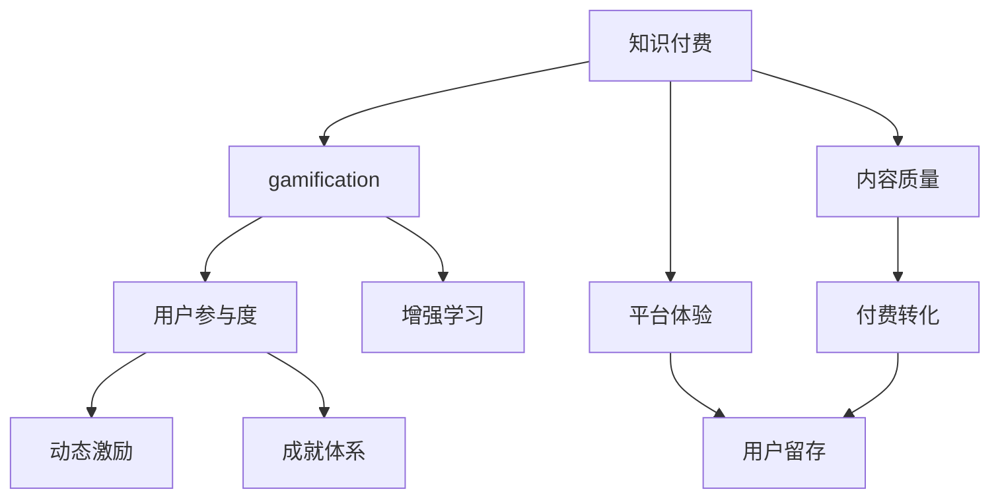

                 

# 利用gamification提升知识付费参与度

> 关键词：知识付费, 参与度提升, gamification, 用户行为, 数据驱动, 用户界面(UI), 用户体验(UX), 增强学习, 动态激励

## 1. 背景介绍

### 1.1 问题由来
随着互联网的快速发展，知识付费领域逐渐兴起，越来越多的人通过订阅服务、购买课程等形式获取知识。但相较于传统的免费内容，知识付费的用户流失率较高，参与度有待提升。如何通过激励机制吸引和留住用户，成为知识付费平台亟需解决的痛点问题。

### 1.2 问题核心关键点
知识付费的核心在于为用户提供优质、有价值的内容。但只有优质的内容，并不能保证用户长期订阅或持续参与。因此，如何在获取高质量内容的同时，提升用户参与度，成为了知识付费平台的关键。

针对这一问题，本文将介绍gamification的概念及其实现方法，通过游戏化的设计思路，激励用户参与知识付费，提高平台黏性。

### 1.3 问题研究意义
研究gamification在知识付费中的应用，对于知识付费平台的商业模式和用户体验优化具有重要意义：

1. **增强用户黏性**：通过游戏化元素吸引用户，增加平台停留时间和使用频率。
2. **提升用户参与度**：通过动态激励，提高用户对内容的消费和互动，降低流失率。
3. **促进知识转化**：通过奖励和成就体系，激励用户不断学习和成长，实现知识的最大化价值。
4. **创新商业模式**：探索游戏化手段，实现付费和免费模式的有机结合，吸引更多用户。
5. **推动技术发展**：通过数据驱动、用户体验优化等技术手段，提升知识付费平台的技术水平。

## 2. 核心概念与联系

### 2.1 核心概念概述

为了更好地理解gamification在知识付费中的应用，本节将介绍几个核心概念：

- **知识付费**：以知识为主要内容，通过付费形式获取版权、技术、经验等内容的服务模式。
- **gamification**：将游戏设计元素引入非游戏环境，通过激励和反馈机制，提升用户参与度和行为的策略。
- **用户参与度**：指用户与平台互动的程度，包括内容消费、社区参与、付费行为等。
- **动态激励**：根据用户行为实时调整激励措施，如任务完成、学习进度等，提供个性化奖励。
- **成就体系**：根据用户行为赋予等级、徽章等成就，提升用户自豪感和归属感。
- **增强学习**：通过游戏化机制，使用户在学习过程中体验到成就感和进步，促进长期学习。

这些核心概念之间的逻辑关系可以通过以下Mermaid流程图来展示：



这个流程图展示了这个系统中的核心概念及其之间的关系：

1. 知识付费通过提供优质内容吸引用户。
2. gamification将游戏元素引入，提升用户参与度。
3. 动态激励根据用户行为实时调整，提高参与度。
4. 成就体系赋予用户成就，增强归属感。
5. 增强学习通过游戏化元素，激励用户长期学习。
6. 内容质量和平台体验是知识付费的基础。
7. 付费转化和用户留存是最终目标。

## 3. 核心算法原理 & 具体操作步骤
### 3.1 算法原理概述

gamification在知识付费中的应用，核心在于通过游戏化元素激励用户，提升参与度。其核心思想是：将知识付费内容与游戏元素结合，设计多种动态激励机制，引导用户完成一系列任务，从而实现对内容的付费和互动。

形式化地，假设知识付费平台的用户行为为 $U=(u_1,u_2,...,u_n)$，其中 $u_i$ 表示用户 $i$ 在第 $t$ 时刻的行为。知识付费平台的目标是最大化用户参与度，即：

$$
\max_{u_t} \sum_{i=1}^n \eta_i(t) \times \pi(u_i,t)
$$

其中 $\eta_i(t)$ 为在第 $t$ 时刻用户 $i$ 的行为得分，$\pi(u_i,t)$ 为行为得分与参与度的转化率。

平台通过设计游戏化元素，实时调整 $\eta_i(t)$ 和 $\pi(u_i,t)$，以提升用户参与度。

### 3.2 算法步骤详解

gamification在知识付费中的实施步骤包括：

**Step 1: 设计游戏化元素**
- 设计吸引用户的成就体系，如徽章、等级等。
- 设计动态激励，如任务完成、学习进度等。
- 设计奖励机制，如积分、优惠券等。

**Step 2: 实施动态激励**
- 根据用户行为实时调整动态激励，如任务完成、学习进度等。
- 实时计算用户行为得分 $\eta_i(t)$，结合用户画像和历史行为，调整 $\pi(u_i,t)$。

**Step 3: 评估和优化**
- 定期评估游戏化元素的实施效果，收集用户反馈。
- 根据反馈调整游戏化元素，优化用户行为得分和转化率。

**Step 4: 整合平台功能**
- 将游戏化元素整合到平台UI和UX设计中，实现无缝融合。
- 集成数据监控工具，实时追踪用户行为和参与度。

**Step 5: 持续迭代**
- 根据用户行为数据和平台反馈，持续迭代游戏化元素，实现动态优化。
- 引入用户参与度的长期监控，定期评估效果。

### 3.3 算法优缺点

gamification在知识付费中的应用具有以下优点：
1. 提升用户参与度。通过游戏化元素，增加用户对平台的黏性，提升活跃度和互动频率。
2. 促进长期学习。动态激励和成就体系鼓励用户持续学习，提升学习效果。
3. 增强平台转化。通过游戏化手段，提高付费转化率和用户留存率。
4. 优化用户体验。UI和UX设计融入游戏元素，提升用户体验，增强平台吸引力。

同时，该方法也存在一定的局限性：
1. 需要大量数据支持。游戏化元素的实施需要大量的用户行为数据，数据获取和分析成本较高。
2. 对内容质量要求高。游戏化元素的效果依赖于内容的优质，如果内容质量不佳，用户仍会流失。
3. 设计复杂度较高。设计复杂的游戏化元素，可能需要较多的开发和测试资源。
4. 用户参与度不均衡。不同用户对游戏化元素的响应可能不同，导致参与度分布不均。

尽管存在这些局限性，但就目前而言，gamification在知识付费中的应用正逐步成熟，成为提升用户参与度的有效手段。未来相关研究的方向在于如何进一步优化游戏化元素，降低实施成本，同时兼顾内容质量和用户体验。

### 3.4 算法应用领域

gamification在知识付费中的应用领域广泛，涵盖以下方面：

- **内容互动**：通过动态激励和成就体系，提升用户对内容的消费和互动。
- **社区参与**：设计社区游戏化元素，促进用户间的交流和协作。
- **学习进度**：设计学习路径和任务，激励用户完成学习计划。
- **付费行为**：设计积分和奖励机制，提高用户付费转化率。
- **用户留存**：通过游戏化元素，提升用户对平台的黏性，降低流失率。

除了上述这些主要应用外，gamification还可以应用于课程推荐、内容推荐、广告投放等多个环节，为知识付费平台带来更多的创新和活力。

## 4. 数学模型和公式 & 详细讲解 & 举例说明

### 4.1 数学模型构建

本节将使用数学语言对gamification在知识付费中的应用进行更加严格的刻画。

记知识付费平台的用户行为为 $U=(u_1,u_2,...,u_n)$，其中 $u_i$ 表示用户 $i$ 在第 $t$ 时刻的行为。设用户行为得分为 $\eta_i(t)$，行为得分与参与度的转化率为 $\pi(u_i,t)$。知识付费平台的目标是最大化用户参与度，即：

$$
\max_{u_t} \sum_{i=1}^n \eta_i(t) \times \pi(u_i,t)
$$

根据用户行为设计动态激励，设动态激励为 $I(u_i,t)$，则用户行为得分 $\eta_i(t)$ 可以表示为：

$$
\eta_i(t) = \sum_{j=1}^m \alpha_j \times I(u_i,t)
$$

其中 $\alpha_j$ 为激励权重，$I(u_i,t)$ 为第 $j$ 个激励措施的效果。

### 4.2 公式推导过程

以下我们以学习进度任务为例，推导动态激励的计算公式。

假设用户 $i$ 完成学习任务 $j$ 需要 $T_j$ 时间，当前完成度为 $P_j$，则动态激励 $I(u_i,t)$ 可以表示为：

$$
I(u_i,t) = k_j \times (1 - P_j)^{n_j} \times \log\left(\frac{1}{1 - P_j}\right)
$$

其中 $k_j$ 为任务激励系数，$n_j$ 为激励衰减指数。

将 $I(u_i,t)$ 代入用户行为得分 $\eta_i(t)$ 的公式中，得：

$$
\eta_i(t) = \sum_{j=1}^m \alpha_j \times k_j \times (1 - P_j)^{n_j} \times \log\left(\frac{1}{1 - P_j}\right)
$$

在得到用户行为得分后，将其与参与度的转化率 $\pi(u_i,t)$ 相乘，得：

$$
\sum_{i=1}^n \eta_i(t) \times \pi(u_i,t) = \sum_{i=1}^n \left(\sum_{j=1}^m \alpha_j \times k_j \times (1 - P_j)^{n_j} \times \log\left(\frac{1}{1 - P_j}\right)\right) \times \pi(u_i,t)
$$

该公式展示了如何通过动态激励提升用户参与度的计算过程。

### 4.3 案例分析与讲解

**案例：学习进度任务**

假设某知识付费平台的用户 $i$ 学习一门课程，完成度为 $P_j$，课程分 $m$ 个学习任务。用户每完成一个任务，可以获得激励 $I(u_i,t)$，激励效果与当前完成度相关。

设用户 $i$ 在第 $t$ 时刻的行为得分为 $\eta_i(t)$，行为得分与参与度的转化率为 $\pi(u_i,t)$，则目标函数为：

$$
\max_{P_j} \eta_i(t) \times \pi(u_i,t)
$$

在动态激励的公式中，设置 $k_j$ 为激励系数，$n_j$ 为激励衰减指数，则有：

$$
I(u_i,t) = k_j \times (1 - P_j)^{n_j} \times \log\left(\frac{1}{1 - P_j}\right)
$$

将 $I(u_i,t)$ 代入 $\eta_i(t)$ 的公式中，得：

$$
\eta_i(t) = \sum_{j=1}^m \alpha_j \times k_j \times (1 - P_j)^{n_j} \times \log\left(\frac{1}{1 - P_j}\right)
$$

通过实时调整 $k_j$ 和 $n_j$，可以动态调整激励强度和衰减速度，从而提升用户对课程的学习积极性。

## 5. 项目实践：代码实例和详细解释说明
### 5.1 开发环境搭建

在进行gamification实践前，我们需要准备好开发环境。以下是使用Python进行Flask开发的简单环境配置流程：

1. 安装Anaconda：从官网下载并安装Anaconda，用于创建独立的Python环境。

2. 创建并激活虚拟环境：
```bash
conda create -n gamification-env python=3.8 
conda activate gamification-env
```

3. 安装Flask：根据CUDA版本，从官网获取对应的安装命令。例如：
```bash
conda install flask
```

4. 安装需要的各类工具包：
```bash
pip install numpy pandas scikit-learn matplotlib tqdm jupyter notebook ipython
```

完成上述步骤后，即可在`gamification-env`环境中开始gamification实践。

### 5.2 源代码详细实现

下面我们以学习进度任务为例，给出使用Flask框架实现gamification的PyTorch代码实现。

首先，定义学习进度任务的函数：

```python
from flask import Flask, request
import numpy as np

app = Flask(__name__)

@app.route('/progress', methods=['POST'])
def progress():
    data = request.get_json()
    user_id = data['user_id']
    task_id = data['task_id']
    completion = data['completion']
    # 计算动态激励
    k = 1.0  # 激励系数
    n = 2.0  # 激励衰减指数
    i = k * (1 - completion)**n * np.log(1 / (1 - completion))
    # 计算行为得分
    alpha = 0.5  # 激励权重
    eta = alpha * i
    # 返回行为得分
    return {'eta': eta}

if __name__ == '__main__':
    app.run(debug=True)
```

然后，启动Flask服务器：

```bash
python app.py
```

### 5.3 代码解读与分析

让我们再详细解读一下关键代码的实现细节：

**progress函数**：
- 接收POST请求，解析用户ID、任务ID和完成度。
- 计算动态激励 $I(u_i,t)$，使用公式 $I(u_i,t) = k \times (1 - P_j)^n \times \log\left(\frac{1}{1 - P_j}\right)$。
- 计算行为得分 $\eta_i(t)$，使用公式 $\eta_i(t) = \alpha \times k \times (1 - P_j)^n \times \log\left(\frac{1}{1 - P_j}\right)$。
- 返回行为得分 $\eta_i(t)$。

**Flask服务器**：
- 启动Flask应用，监听请求并处理。
- 接收POST请求，解析用户ID、任务ID和完成度。
- 根据用户行为计算动态激励和行为得分。
- 返回行为得分。

以上代码实现了一个简单的gamification功能，即通过学习进度任务计算动态激励和行为得分。在实际应用中，还需要结合更多的游戏化元素，如成就体系、任务序列等，实现更复杂的gamification设计。

## 6. 实际应用场景
### 6.1 智能推荐系统

gamification在智能推荐系统中的应用，可以通过动态激励和成就体系，提升用户对推荐的兴趣和参与度。

**具体应用**：
- 学习进度任务：用户完成推荐内容后，根据完成度计算动态激励，提升后续推荐的关注度。
- 推荐反馈机制：用户对推荐内容进行评分，根据评分反馈调整推荐算法，优化推荐效果。
- 推荐进度成就：用户每完成一定数量的推荐，获得成就奖励，提升参与度。

**技术实现**：
- 设计推荐内容的学习进度任务，计算动态激励和行为得分。
- 集成推荐系统的反馈机制，根据用户反馈调整推荐策略。
- 设计推荐成就体系，提升用户对推荐的关注度和参与度。

**效果评估**：
- 通过A/B测试，评估gamification对推荐系统性能的影响。
- 收集用户反馈，优化游戏化元素的设计和实现。

**未来展望**：
- 引入更多游戏化元素，如排行榜、社交互动等，提升用户参与度。
- 结合多模态数据，提升推荐的个性化和精准度。

### 6.2 课程学习平台

gamification在课程学习平台中的应用，可以通过动态激励和成就体系，提升用户对课程的持续学习和完成度。

**具体应用**：
- 学习进度任务：用户完成课程内容后，根据完成度计算动态激励，提升后续课程的学习兴趣。
- 课程互动机制：用户参与课程讨论、测验等，根据互动程度计算行为得分。
- 课程成就体系：用户每完成一定数量的课程，获得成就奖励，提升完成度。

**技术实现**：
- 设计课程内容的学习进度任务，计算动态激励和行为得分。
- 集成课程互动机制，记录用户互动行为，计算行为得分。
- 设计课程成就体系，提升用户对课程的持续关注和学习。

**效果评估**：
- 通过A/B测试，评估gamification对课程学习平台的效果。
- 收集用户反馈，优化游戏化元素的设计和实现。

**未来展望**：
- 引入更多游戏化元素，如课程排行榜、学习小组等，提升用户参与度。
- 结合个性化推荐，优化课程内容的推送和呈现方式。

### 6.3 内容创作平台

gamification在内容创作平台中的应用，可以通过动态激励和成就体系，提升用户对内容的创作和分享兴趣。

**具体应用**：
- 内容互动机制：用户点赞、评论、分享内容后，根据互动程度计算动态激励。
- 内容成就体系：用户每完成一定数量的内容创作，获得成就奖励，提升创作兴趣。
- 内容排行榜：根据内容质量、互动度等指标，展示热门内容，提升用户关注度。

**技术实现**：
- 设计内容互动机制，记录用户互动行为，计算行为得分。
- 设计内容成就体系，提升用户对内容的持续关注和创作。
- 设计内容排行榜，展示热门内容，提升用户参与度。

**效果评估**：
- 通过A/B测试，评估gamification对内容创作平台的效果。
- 收集用户反馈，优化游戏化元素的设计和实现。

**未来展望**：
- 引入更多游戏化元素，如内容竞赛、主题创作等，提升用户参与度。
- 结合推荐系统，优化内容推送的精准度和个性化。

## 7. 工具和资源推荐
### 7.1 学习资源推荐

为了帮助开发者系统掌握gamification的理论基础和实践技巧，这里推荐一些优质的学习资源：

1. **《Gamification by Design》**：由Gamification设计大师Jesse James West所著，系统介绍了Gamification设计的基本原则和方法。

2. **Coursera《Gamification for Business and Education》课程**：由宾夕法尼亚大学开设的Gamification课程，提供大量实际案例和工具，帮助学生理解和应用Gamification。

3. **《Gamification by Gamification》**：Jesse James West的另一本著作，深入浅出地介绍了Gamification的设计思路和应用场景。

4. **Gamification Design Hub**：Gamification设计社区，提供丰富的学习资源和案例，帮助开发者设计、实施和优化Gamification。

5. **Gamification Network**：Gamification设计平台，提供各种Gamification工具和解决方案，助力企业和组织实现Gamification。

通过对这些资源的学习实践，相信你一定能够快速掌握Gamification的设计和应用技巧，实现知识付费平台的持续优化。

### 7.2 开发工具推荐

高效的开发离不开优秀的工具支持。以下是几款用于Gamification开发的常用工具：

1. **Flask**：Python的轻量级Web框架，简单易用，适合快速迭代开发。

2. **Django**：Python的全功能Web框架，适用于复杂的Web应用开发。

3. **SQLAlchemy**：Python的数据库ORM工具，支持多数据库操作，适用于数据存储和查询。

4. **Gunicorn**：Python的Web服务器，适用于生产环境部署。

5. **Apache Kafka**：分布式流处理平台，适用于实时数据采集和处理。

6. **Elasticsearch**：分布式搜索引擎，适用于海量数据的存储和查询。

合理利用这些工具，可以显著提升Gamification应用的开发效率，加快创新迭代的步伐。

### 7.3 相关论文推荐

Gamification的研究源于学界的持续研究。以下是几篇奠基性的相关论文，推荐阅读：

1. **《Gamification by Design》**：Jesse James West，介绍了Gamification设计的基本原则和方法。

2. **《Gamification: How to Gamify Learning, Business, and Everyday Life》**：Mitch Robertson，深入浅出地介绍了Gamification的应用场景和设计思路。

3. **《Designing Games: Building Usable Games for Real People》**：Alexlen Atkinson，系统介绍了游戏设计的基本方法和最佳实践。

4. **《The Gamification Toolkit: How Game Elements Can Boost Productivity, Engagement, and Satisfaction》**：Steven L. Porter，介绍了Gamification工具和实施方法，帮助开发者实现Gamification。

这些论文代表了大语言模型微调技术的发展脉络。通过学习这些前沿成果，可以帮助研究者把握学科前进方向，激发更多的创新灵感。

## 8. 总结：未来发展趋势与挑战

### 8.1 总结

本文对gamification在知识付费中的应用进行了全面系统的介绍。首先阐述了gamification的概念及其实现方法，明确了gamification在提升用户参与度方面的独特价值。其次，从原理到实践，详细讲解了gamification的数学模型和核心算法，给出了gamification任务开发的完整代码实例。同时，本文还广泛探讨了gamification在智能推荐系统、课程学习平台、内容创作平台等多个行业领域的应用前景，展示了gamification范式的巨大潜力。

通过本文的系统梳理，可以看到，gamification在提升知识付费平台的用户参与度方面具有重要意义。通过游戏化元素，平台可以更加灵活地激励用户，提升用户体验和满意度。未来，伴随gamification技术的持续演进，知识付费平台必将在获取高质量内容的同时，实现用户参与度的最大化，成为更加可持续发展的业务模式。

### 8.2 未来发展趋势

展望未来，gamification在知识付费中的应用将呈现以下几个发展趋势：

1. **游戏化元素的创新**：随着技术的发展，游戏化元素的设计将更加多样和灵活，涵盖更多的用户行为和需求。

2. **多渠道融合**：gamification将不仅限于Web应用，还将拓展到移动应用、游戏平台等多个渠道，实现多渠道融合。

3. **AI与Gamification结合**：通过AI技术，实时调整游戏化元素，实现个性化激励和动态优化。

4. **数据驱动的优化**：通过大数据分析，不断优化游戏化元素的设计，提升用户参与度和满意度。

5. **社区互动增强**：通过社区游戏化元素，增强用户间的互动和协作，提升平台黏性。

6. **用户体验优化**：通过UI和UX设计，提升游戏化元素的用户体验，增强平台吸引力。

以上趋势凸显了gamification在知识付费领域的广泛应用前景，通过不断的技术创新和优化，gamification必将在提升用户参与度方面发挥更大的作用。

### 8.3 面临的挑战

尽管gamification在知识付费中的应用已经取得了一定成效，但在迈向更加智能化、普适化应用的过程中，它仍面临诸多挑战：

1. **用户行为多样**：不同用户对游戏化元素的响应可能不同，导致参与度分布不均。

2. **游戏化元素设计复杂**：设计复杂的游戏化元素，可能需要较多的开发和测试资源。

3. **数据获取难度高**：游戏化元素的实施需要大量的用户行为数据，数据获取和分析成本较高。

4. **平台粘性不足**：如果游戏化元素的设计不当，可能导致平台粘性不足，用户流失率较高。

5. **技术实现复杂**：gamification的实施需要结合多种技术手段，包括数据存储、实时计算、用户行为分析等，技术实现较为复杂。

尽管存在这些挑战，但随着技术的发展和用户需求的不断变化，gamification在游戏化设计和应用方面将不断进步。通过更多的数据积累和用户反馈，优化游戏化元素的设计和实现，gamification必将在知识付费平台中发挥更大的作用。

### 8.4 研究展望

面对gamification面临的挑战，未来的研究需要在以下几个方面寻求新的突破：

1. **用户行为分析**：通过深入分析用户行为数据，实现更精准的游戏化元素设计，提高用户参与度。

2. **技术手段优化**：通过优化数据存储和实时计算等技术手段，提升gamification的实现效率和用户体验。

3. **多渠道融合**：探索多渠道游戏化元素的融合应用，提升平台的跨平台黏性。

4. **AI与Gamification结合**：引入AI技术，实时调整游戏化元素，实现个性化激励和动态优化。

5. **社区互动增强**：设计社区游戏化元素，增强用户间的互动和协作，提升平台黏性。

6. **用户体验优化**：通过UI和UX设计，提升游戏化元素的用户体验，增强平台吸引力。

这些研究方向将引领gamification技术迈向更高的台阶，为知识付费平台的持续优化和用户参与度的提升提供新的动力。

## 9. 附录：常见问题与解答

**Q1：什么是gamification？**

A: Gamification是将游戏设计元素引入非游戏环境，通过激励和反馈机制，提升用户参与度和行为的策略。

**Q2：如何设计有效的游戏化元素？**

A: 设计游戏化元素需要考虑用户行为、平台目标、技术实现等因素。通过数据分析和用户反馈，不断优化游戏化元素的设计和实现。

**Q3：gamification在知识付费中的应用有哪些？**

A: Gamification在知识付费中的应用包括课程学习、智能推荐、内容创作等多个领域。通过动态激励和成就体系，提升用户对内容的持续学习和关注。

**Q4：如何评估gamification的效果？**

A: 通过A/B测试、用户反馈、行为数据分析等方式，评估gamification的效果。收集数据，不断优化游戏化元素的设计和实现。

**Q5：gamification在知识付费中需要哪些技术支持？**

A: Gamification在知识付费中需要数据存储、实时计算、用户行为分析等技术支持。合理利用这些技术，可以提升gamification的实现效率和用户体验。

---

作者：禅与计算机程序设计艺术 / Zen and the Art of Computer Programming

