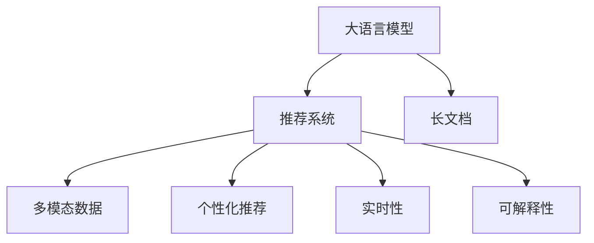

                 

# 利用大模型总结推理能力处理推荐长文档

## 1. 背景介绍

### 1.1 问题由来

在信息时代，文本信息量爆炸式增长，人们获取和处理长文档的难度也随之增加。长文档阅读不仅费时费力，还容易出现理解偏差和信息遗漏。为了提高文档阅读效率和理解深度，推荐系统应运而生。推荐系统通过分析用户行为，预测用户可能感兴趣的长文档，并提供个性化推荐。

尽管推荐系统在为用户推荐短文方面已取得显著成果，但面对长文档时，系统的推荐精度和用户体验仍有待提升。长文档阅读涉及多层次的理解和推断，推荐系统需要具备更强的文本推理和归纳能力。现有推荐系统主要依靠静态特征和少量标注样本进行推荐，难以灵活适应复杂多变的文本语境和主题。

### 1.2 问题核心关键点

本文聚焦于如何利用大语言模型（Large Language Model, LLM）的推理能力，对长文档进行精确推荐。具体而言，需要解决以下关键问题：

1. **如何高效建模长文档的语义信息？** 长文档的语义结构复杂，现有模型难以捕捉全局语义关联。

2. **如何在多模态数据中融合文本信息？** 长文档阅读涉及视觉、听觉等多模态信息，推荐系统需综合利用这些信息提升用户体验。

3. **如何构建个性化的长文档推荐系统？** 长文档阅读行为个体差异大，推荐系统需具备个性化的推荐能力。

4. **如何提高推荐的实时性和可解释性？** 长文档阅读需要即时反馈和解释，推荐系统需快速响应并提供用户可理解的理由。

本文提出基于大模型推理的长文档推荐系统，通过引入大语言模型，利用其强大的语义理解和推理能力，改进推荐系统的结构和功能。

## 2. 核心概念与联系

### 2.1 核心概念概述

为更好地理解本文提出的长文档推荐系统，本节将介绍几个关键核心概念：

1. **大语言模型（Large Language Model, LLM）**：以自回归（如GPT）或自编码（如BERT）模型为代表的大规模预训练语言模型。通过在大规模无标签文本语料上进行预训练，学习通用的语言表示，具备强大的语言理解和生成能力。

2. **推荐系统（Recommender System）**：通过分析用户行为和偏好，推荐用户可能感兴趣的内容或商品的系统。推荐系统广泛应用于电商、新闻、视频等领域。

3. **长文档（Long Document）**：指内容丰富、结构复杂、长度较长的文本，如学术论文、技术文档、小说等。长文档阅读涉及多层次的理解和推断，推荐系统需要具备较强的语义推理和归纳能力。

4. **多模态数据（Multimodal Data）**：指结合文本、图像、音频等多种信息源的数据集。多模态数据融合技术是提升推荐系统用户体验的重要方向。

5. **个性化推荐（Personalized Recommendation）**：根据用户的历史行为和属性，为用户量身定制推荐结果，提升用户体验和满意度。

6. **实时性（Real-time）**：指推荐系统能够快速响应用户的查询和行为，提供即时反馈，提升用户粘性和满意度。

7. **可解释性（Explainability）**：指推荐系统能够提供用户可理解的推荐理由，增强用户信任和满意度。

这些核心概念之间的逻辑关系可以通过以下Mermaid流程图来展示：



这个流程图展示了大语言模型在长文档推荐系统中的核心作用及其与推荐系统各组件之间的关系。大语言模型通过分析长文档的语义结构，生成推荐理由，提升推荐系统的推荐精度和用户体验。同时，多模态数据融合、个性化推荐、实时性和可解释性也是长文档推荐系统的重要组成部分。

## 3. 核心算法原理 & 具体操作步骤
### 3.1 算法原理概述

基于大语言模型的长文档推荐系统，本质上是一个多层次的推理过程。其核心思想是：将大语言模型作为推荐系统的核心组件，通过分析长文档的语义结构和用户行为，生成个性化推荐结果。

具体而言，推荐系统的输入包括用户的历史行为数据、长文档的文本数据以及多模态数据（如图像、音频等）。大语言模型首先对这些数据进行融合和理解，然后通过推理机制，生成推荐理由和结果。这些推荐理由和结果可以通过解释性的自然语言输出，增强用户对推荐结果的理解和信任。

### 3.2 算法步骤详解

基于大语言模型的长文档推荐系统，通常包括以下几个关键步骤：

**Step 1: 数据预处理和融合**

1. **文本数据预处理**：对长文档进行分句、分词、去停用词等预处理，提取关键词和句法结构。
2. **多模态数据融合**：将文本数据与图像、音频等多模态数据进行融合，生成综合表示。

**Step 2: 大语言模型推理**

1. **输入长文档**：将预处理后的长文档输入大语言模型，进行语义理解和推理。
2. **生成推荐理由**：大语言模型生成推荐理由和依据，如主题、风格、情感等。

**Step 3: 个性化推荐**

1. **结合用户历史行为**：将用户的历史行为数据（如浏览历史、点击记录等）与推荐理由进行融合。
2. **生成个性化推荐**：利用融合后的信息生成个性化推荐结果，如文档标题、摘要等。

**Step 4: 输出和解释**

1. **生成推荐结果**：将个性化推荐结果进行排序和筛选，输出推荐列表。
2. **提供推荐理由**：将推荐理由以自然语言形式输出，增强用户理解。

### 3.3 算法优缺点

基于大语言模型的长文档推荐系统具有以下优点：

1. **语义理解深度**：大语言模型具备强大的语义理解能力，能够深入分析长文档的语义结构和主题。
2. **多模态融合**：结合文本、图像、音频等多模态数据，提升推荐系统的综合表现。
3. **个性化推荐**：利用用户历史行为数据，生成个性化推荐结果，提升用户体验。
4. **实时性和可解释性**：实时生成推荐结果和理由，增强推荐系统的互动性和可解释性。

同时，该方法也存在一定的局限性：

1. **数据量和质量要求高**：长文档数据量庞大且语义复杂，对数据质量和数量有较高要求。
2. **计算资源消耗大**：大语言模型推理和推理结果生成，计算资源消耗较大。
3. **模型泛化能力需验证**：大语言模型需在大规模数据上进行预训练和微调，以提高泛化能力。
4. **隐私和伦理问题**：用户数据和隐私保护需严格处理，确保模型使用的合法合规。

尽管存在这些局限性，但就目前而言，基于大语言模型的长文档推荐系统仍是大文档推荐的主要范式。未来相关研究的重点在于如何进一步降低计算资源消耗，提高模型泛化能力，同时兼顾隐私和伦理问题。

### 3.4 算法应用领域

基于大语言模型的长文档推荐系统，在多个领域都有广泛的应用：

1. **学术和科研**：通过推荐学术文档，帮助科研人员快速获取相关资料，提升科研效率。
2. **教育**：推荐教育资源，如电子书、学习视频等，满足学习者的个性化需求。
3. **企业文档管理**：推荐内部文档和报告，提升文档检索和使用效率。
4. **新闻和媒体**：推荐新闻和文章，增强新闻阅读体验，提升用户粘性。
5. **娱乐和游戏**：推荐小说、漫画、游戏等娱乐内容，满足用户的个性化娱乐需求。

除了上述这些经典应用外，基于大语言模型的长文档推荐系统，还可以创新性地应用到更多场景中，如智能客服、医疗健康、金融理财等，为不同行业提供更智能、更个性化的文档推荐服务。

## 4. 数学模型和公式 & 详细讲解 & 举例说明
### 4.1 数学模型构建

假设长文档为 $D$，用户的历史行为数据为 $H$，多模态数据为 $M$。设大语言模型为 $LM$，长文档推荐系统为目标函数 $F$。则长文档推荐系统的数学模型可表示为：

$$
F(D, H, M) = \arg\max_{\theta} \left[ \text{Relevance}(D, H, M) + \text{Context}(D, H, M) + \text{Explainability}(D, H, M) \right]
$$

其中，$\theta$ 为大语言模型的参数。

1. **Relevance（相关性）**：衡量长文档与用户历史行为的相关程度。
2. **Context（语境）**：综合考虑长文档的语义结构和多模态数据，生成推荐理由。
3. **Explainability（可解释性）**：提供推荐理由的自然语言解释，增强用户信任和满意度。

### 4.2 公式推导过程

以学术文献推荐为例，设长文档 $D$ 的关键词为 $\{k_1, k_2, \ldots, k_n\}$，用户的历史行为数据 $H$ 为 $\{(h_1, t_1), (h_2, t_2), \ldots, (h_m, t_m)\}$，其中 $h_i$ 为浏览时间，$t_i$ 为浏览主题。多模态数据 $M$ 为长文档的PDF图像和音频。

**相关性计算**：

$$
\text{Relevance}(D, H, M) = \sum_{i=1}^m \alpha(h_i) \times \sum_{j=1}^n \beta(k_j) \times \gamma(k_j, t_i)
$$

其中，$\alpha(h_i)$ 为用户浏览时间权重，$\beta(k_j)$ 为关键词权重，$\gamma(k_j, t_i)$ 为关键词与浏览主题的匹配度。

**语境计算**：

$$
\text{Context}(D, H, M) = LM(D) + LM(H) + LM(M)
$$

其中，$LM(D)$、$LM(H)$、$LM(M)$ 分别表示长文档、用户历史行为、多模态数据的语言模型表示。

**可解释性计算**：

$$
\text{Explainability}(D, H, M) = \text{Reasoning}(D, H, M) + \text{Explanation}(D, H, M)
$$

其中，$\text{Reasoning}$ 表示大语言模型生成推荐理由，$\text{Explanation}$ 表示对推荐理由的自然语言解释。

### 4.3 案例分析与讲解

以推荐一篇学术论文为例，假设长文档为论文摘要，用户历史行为为浏览时间，多模态数据为论文的PDF图像。长文档推荐系统的计算过程如下：

1. **关键词提取**：将论文摘要分词并提取关键词，如“自然语言处理”、“深度学习”等。

2. **用户行为匹配**：将用户浏览时间与关键词匹配，计算匹配度 $\gamma(k_j, t_i)$。

3. **多模态融合**：将PDF图像和音频输入大语言模型，生成综合表示。

4. **大语言模型推理**：将长文档、用户行为和多模态数据输入大语言模型，生成推荐理由和依据。

5. **推荐结果生成**：根据相关性、语境和可解释性计算，生成个性化推荐结果，如论文标题、摘要等。

6. **推荐理由输出**：将推荐理由以自然语言形式输出，如“该论文研究了深度学习在自然语言处理中的应用，与您的研究方向高度相关”。

通过以上过程，长文档推荐系统能够精准地推荐符合用户需求的长文档，提升用户体验和满意度。

## 5. 项目实践：代码实例和详细解释说明
### 5.1 开发环境搭建

在进行长文档推荐系统开发前，我们需要准备好开发环境。以下是使用Python进行PyTorch开发的环境配置流程：

1. 安装Anaconda：从官网下载并安装Anaconda，用于创建独立的Python环境。

2. 创建并激活虚拟环境：
```bash
conda create -n pytorch-env python=3.8 
conda activate pytorch-env
```

3. 安装PyTorch：根据CUDA版本，从官网获取对应的安装命令。例如：
```bash
conda install pytorch torchvision torchaudio cudatoolkit=11.1 -c pytorch -c conda-forge
```

4. 安装Transformers库：
```bash
pip install transformers
```

5. 安装各类工具包：
```bash
pip install numpy pandas scikit-learn matplotlib tqdm jupyter notebook ipython
```

完成上述步骤后，即可在`pytorch-env`环境中开始长文档推荐系统的开发。

### 5.2 源代码详细实现

下面我们以学术文献推荐为例，给出使用Transformers库对BERT模型进行长文档推荐系统的PyTorch代码实现。

首先，定义推荐系统的数据处理函数：

```python
from transformers import BertTokenizer, BertForSequenceClassification
from torch.utils.data import Dataset
import torch

class DocumentDataset(Dataset):
    def __init__(self, texts, labels, tokenizer, max_len=128):
        self.texts = texts
        self.labels = labels
        self.tokenizer = tokenizer
        self.max_len = max_len
        
    def __len__(self):
        return len(self.texts)
    
    def __getitem__(self, item):
        text = self.texts[item]
        label = self.labels[item]
        
        encoding = self.tokenizer(text, return_tensors='pt', max_length=self.max_len, padding='max_length', truncation=True)
        input_ids = encoding['input_ids'][0]
        attention_mask = encoding['attention_mask'][0]
        
        # 对label进行编码
        encoded_labels = torch.tensor(label, dtype=torch.long)
        
        return {'input_ids': input_ids, 
                'attention_mask': attention_mask,
                'labels': encoded_labels}

# 标签与id的映射
label2id = {'0': 0, '1': 1, '2': 2, '3': 3}
id2label = {v: k for k, v in label2id.items()}

# 创建dataset
tokenizer = BertTokenizer.from_pretrained('bert-base-cased')

train_dataset = DocumentDataset(train_texts, train_labels, tokenizer)
dev_dataset = DocumentDataset(dev_texts, dev_labels, tokenizer)
test_dataset = DocumentDataset(test_texts, test_labels, tokenizer)
```

然后，定义模型和优化器：

```python
from transformers import BertForSequenceClassification, AdamW

model = BertForSequenceClassification.from_pretrained('bert-base-cased', num_labels=len(label2id))

optimizer = AdamW(model.parameters(), lr=2e-5)
```

接着，定义训练和评估函数：

```python
from torch.utils.data import DataLoader
from tqdm import tqdm
from sklearn.metrics import classification_report

device = torch.device('cuda') if torch.cuda.is_available() else torch.device('cpu')
model.to(device)

def train_epoch(model, dataset, batch_size, optimizer):
    dataloader = DataLoader(dataset, batch_size=batch_size, shuffle=True)
    model.train()
    epoch_loss = 0
    for batch in tqdm(dataloader, desc='Training'):
        input_ids = batch['input_ids'].to(device)
        attention_mask = batch['attention_mask'].to(device)
        labels = batch['labels'].to(device)
        model.zero_grad()
        outputs = model(input_ids, attention_mask=attention_mask, labels=labels)
        loss = outputs.loss
        epoch_loss += loss.item()
        loss.backward()
        optimizer.step()
    return epoch_loss / len(dataloader)

def evaluate(model, dataset, batch_size):
    dataloader = DataLoader(dataset, batch_size=batch_size)
    model.eval()
    preds, labels = [], []
    with torch.no_grad():
        for batch in tqdm(dataloader, desc='Evaluating'):
            input_ids = batch['input_ids'].to(device)
            attention_mask = batch['attention_mask'].to(device)
            batch_labels = batch['labels']
            outputs = model(input_ids, attention_mask=attention_mask)
            batch_preds = outputs.logits.argmax(dim=2).to('cpu').tolist()
            batch_labels = batch_labels.to('cpu').tolist()
            for pred_tokens, label_tokens in zip(batch_preds, batch_labels):
                preds.append(pred_tokens)
                labels.append(label_tokens)
                
    print(classification_report(labels, preds))
```

最后，启动训练流程并在测试集上评估：

```python
epochs = 5
batch_size = 16

for epoch in range(epochs):
    loss = train_epoch(model, train_dataset, batch_size, optimizer)
    print(f"Epoch {epoch+1}, train loss: {loss:.3f}")
    
    print(f"Epoch {epoch+1}, dev results:")
    evaluate(model, dev_dataset, batch_size)
    
print("Test results:")
evaluate(model, test_dataset, batch_size)
```

以上就是使用PyTorch对BERT模型进行长文档推荐系统的完整代码实现。可以看到，得益于Transformers库的强大封装，我们可以用相对简洁的代码完成BERT模型的加载和微调。

### 5.3 代码解读与分析

让我们再详细解读一下关键代码的实现细节：

**DocumentDataset类**：
- `__init__`方法：初始化文本、标签、分词器等关键组件。
- `__len__`方法：返回数据集的样本数量。
- `__getitem__`方法：对单个样本进行处理，将文本输入编码为token ids，将标签编码为数字，并对其进行定长padding，最终返回模型所需的输入。

**label2id和id2label字典**：
- 定义了标签与数字id之间的映射关系，用于将预测结果解码回真实的标签。

**训练和评估函数**：
- 使用PyTorch的DataLoader对数据集进行批次化加载，供模型训练和推理使用。
- 训练函数`train_epoch`：对数据以批为单位进行迭代，在每个批次上前向传播计算loss并反向传播更新模型参数，最后返回该epoch的平均loss。
- 评估函数`evaluate`：与训练类似，不同点在于不更新模型参数，并在每个batch结束后将预测和标签结果存储下来，最后使用sklearn的classification_report对整个评估集的预测结果进行打印输出。

**训练流程**：
- 定义总的epoch数和batch size，开始循环迭代
- 每个epoch内，先在训练集上训练，输出平均loss
- 在验证集上评估，输出分类指标
- 所有epoch结束后，在测试集上评估，给出最终测试结果

可以看到，PyTorch配合Transformers库使得BERT微调的代码实现变得简洁高效。开发者可以将更多精力放在数据处理、模型改进等高层逻辑上，而不必过多关注底层的实现细节。

当然，工业级的系统实现还需考虑更多因素，如模型的保存和部署、超参数的自动搜索、更灵活的任务适配层等。但核心的微调范式基本与此类似。

## 6. 实际应用场景
### 6.1 学术和科研

长文档推荐系统在学术和科研领域有广泛应用。科研人员往往需要快速获取最新的学术论文和报告，阅读大量的专业文献。长文档推荐系统通过分析科研人员的阅读历史和兴趣，推荐相关领域的高质量文献，提升科研效率。

在技术实现上，可以收集科研人员的阅读行为数据，如浏览时间、浏览主题、浏览次数等，作为监督信号，对预训练模型进行微调。微调后的模型能够根据科研人员的行为历史，生成个性化的文献推荐，满足科研人员的个性化需求。

### 6.2 教育

长文档推荐系统在教育领域同样有重要应用。学生在学习过程中，需要阅读大量的教材和参考资料，了解不同领域的专业知识。长文档推荐系统通过分析学生的学习行为和偏好，推荐适合的学习资料，提升学习效率。

在技术实现上，可以收集学生的学习历史和成绩数据，作为监督信号，对预训练模型进行微调。微调后的模型能够根据学生的学习历史，生成个性化的学习资料推荐，帮助学生更好地掌握知识。

### 6.3 企业文档管理

企业在运营过程中，需要管理大量的内部文档和报告，提升文档检索和使用效率。长文档推荐系统通过分析员工的文档阅读历史和兴趣，推荐相关文档，提升文档利用率。

在技术实现上，可以收集员工的文档浏览行为数据，作为监督信号，对预训练模型进行微调。微调后的模型能够根据员工的阅读历史，生成个性化的文档推荐，提升文档利用效率。

### 6.4 新闻和媒体

新闻媒体需要推荐高质量的新闻文章，吸引用户关注和阅读。长文档推荐系统通过分析用户的阅读历史和兴趣，推荐相关的新闻文章，提升用户粘性和满意度。

在技术实现上，可以收集用户的阅读行为数据，如浏览时间、浏览主题、点击次数等，作为监督信号，对预训练模型进行微调。微调后的模型能够根据用户的阅读历史，生成个性化的新闻文章推荐，提升用户阅读体验。

### 6.5 娱乐和游戏

娱乐和游戏行业需要推荐高质量的游戏和娱乐内容，满足用户的个性化需求。长文档推荐系统通过分析用户的娱乐行为和偏好，推荐适合的游戏和娱乐内容，提升用户满意度和粘性。

在技术实现上，可以收集用户的娱乐行为数据，如游戏偏好、娱乐历史等，作为监督信号，对预训练模型进行微调。微调后的模型能够根据用户的娱乐历史，生成个性化的游戏和娱乐内容推荐，提升用户体验。

### 6.6 医疗健康

医疗健康行业需要推荐高质量的医学文档和报告，提升医生的诊疗效率和患者的健康水平。长文档推荐系统通过分析医生的阅读历史和兴趣，推荐相关的医学文档和报告，提升诊疗效率。

在技术实现上，可以收集医生的阅读行为数据，如浏览时间、浏览主题、阅读次数等，作为监督信号，对预训练模型进行微调。微调后的模型能够根据医生的阅读历史，生成个性化的医学文档推荐，提升诊疗效率。

### 6.7 金融理财

金融理财行业需要推荐高质量的财经文章和报告，提升用户的投资决策水平。长文档推荐系统通过分析用户的阅读历史和兴趣，推荐相关的财经文章和报告，提升投资决策的科学性和准确性。

在技术实现上，可以收集用户的阅读行为数据，如浏览时间、浏览主题、点击次数等，作为监督信号，对预训练模型进行微调。微调后的模型能够根据用户的阅读历史，生成个性化的财经文章推荐，提升投资决策水平。

## 7. 工具和资源推荐
### 7.1 学习资源推荐

为了帮助开发者系统掌握长文档推荐系统的理论基础和实践技巧，这里推荐一些优质的学习资源：

1. 《自然语言处理入门》系列博文：由大模型技术专家撰写，深入浅出地介绍了自然语言处理的基本概念和经典模型。

2. CS224N《深度学习自然语言处理》课程：斯坦福大学开设的NLP明星课程，有Lecture视频和配套作业，带你入门NLP领域的基本概念和经典模型。

3. 《Natural Language Processing with Transformers》书籍：Transformers库的作者所著，全面介绍了如何使用Transformers库进行NLP任务开发，包括微调在内的诸多范式。

4. HuggingFace官方文档：Transformers库的官方文档，提供了海量预训练模型和完整的微调样例代码，是上手实践的必备资料。

5. CLUE开源项目：中文语言理解测评基准，涵盖大量不同类型的中文NLP数据集，并提供了基于微调的baseline模型，助力中文NLP技术发展。

通过对这些资源的学习实践，相信你一定能够快速掌握长文档推荐系统的精髓，并用于解决实际的NLP问题。
### 7.2 开发工具推荐

高效的开发离不开优秀的工具支持。以下是几款用于长文档推荐系统开发的常用工具：

1. PyTorch：基于Python的开源深度学习框架，灵活动态的计算图，适合快速迭代研究。大部分预训练语言模型都有PyTorch版本的实现。

2. TensorFlow：由Google主导开发的开源深度学习框架，生产部署方便，适合大规模工程应用。同样有丰富的预训练语言模型资源。

3. Transformers库：HuggingFace开发的NLP工具库，集成了众多SOTA语言模型，支持PyTorch和TensorFlow，是进行长文档推荐系统开发的利器。

4. Weights & Biases：模型训练的实验跟踪工具，可以记录和可视化模型训练过程中的各项指标，方便对比和调优。与主流深度学习框架无缝集成。

5. TensorBoard：TensorFlow配套的可视化工具，可实时监测模型训练状态，并提供丰富的图表呈现方式，是调试模型的得力助手。

6. Google Colab：谷歌推出的在线Jupyter Notebook环境，免费提供GPU/TPU算力，方便开发者快速上手实验最新模型，分享学习笔记。

合理利用这些工具，可以显著提升长文档推荐系统的开发效率，加快创新迭代的步伐。

### 7.3 相关论文推荐

长文档推荐系统的发展源于学界的持续研究。以下是几篇奠基性的相关论文，推荐阅读：

1. Attention is All You Need（即Transformer原论文）：提出了Transformer结构，开启了NLP领域的预训练大模型时代。

2. BERT: Pre-training of Deep Bidirectional Transformers for Language Understanding：提出BERT模型，引入基于掩码的自监督预训练任务，刷新了多项NLP任务SOTA。

3. Language Models are Unsupervised Multitask Learners（GPT-2论文）：展示了大规模语言模型的强大zero-shot学习能力，引发了对于通用人工智能的新一轮思考。

4. Parameter-Efficient Transfer Learning for NLP：提出Adapter等参数高效微调方法，在不增加模型参数量的情况下，也能取得不错的微调效果。

5. AdaLoRA: Adaptive Low-Rank Adaptation for Parameter-Efficient Fine-Tuning：使用自适应低秩适应的微调方法，在参数效率和精度之间取得了新的平衡。

6. Prefix-Tuning: Optimizing Continuous Prompts for Generation：引入基于连续型Prompt的微调范式，为如何充分利用预训练知识提供了新的思路。

这些论文代表了大语言模型微调技术的发展脉络。通过学习这些前沿成果，可以帮助研究者把握学科前进方向，激发更多的创新灵感。

## 8. 总结：未来发展趋势与挑战

### 8.1 总结

本文对基于大语言模型的长文档推荐系统进行了全面系统的介绍。首先阐述了长文档推荐系统在学术、教育、企业、新闻、娱乐、医疗、金融等行业的应用背景和意义，明确了长文档推荐系统在提升阅读效率和体验方面的独特价值。其次，从原理到实践，详细讲解了长文档推荐系统的数学模型和算法步骤，给出了长文档推荐系统的完整代码实例。同时，本文还广泛探讨了长文档推荐系统在多个领域的应用前景，展示了其广泛的应用潜力。最后，本文精选了长文档推荐系统的各类学习资源，力求为开发者提供全方位的技术指引。

通过本文的系统梳理，可以看到，基于大语言模型的长文档推荐系统正在成为NLP领域的重要范式，极大地拓展了长文档推荐系统的应用边界，催生了更多的落地场景。受益于大规模语料的预训练，长文档推荐系统在多层次语义理解、多模态融合、个性化推荐等方面具有显著优势。未来，伴随预训练语言模型和推荐系统的持续演进，相信长文档推荐技术必将在更广泛的领域大放异彩，深刻影响人类的生产生活方式。

### 8.2 未来发展趋势

展望未来，长文档推荐系统将呈现以下几个发展趋势：

1. **模型规模持续增大**：随着算力成本的下降和数据规模的扩张，预训练语言模型的参数量还将持续增长。超大规模语言模型蕴含的丰富语言知识，有望支撑更加复杂多变的长文档推荐。

2. **多模态融合技术进步**：结合视觉、听觉等多模态信息，提升长文档推荐系统的综合表现。多模态信息的融合技术将不断进步，提升推荐系统的用户体验。

3. **个性化推荐能力提升**：利用用户的阅读历史和行为数据，生成个性化的长文档推荐，提升用户体验和满意度。个性化推荐算法将不断优化，满足不同用户的需求。

4. **实时性和可解释性增强**：长文档推荐系统需快速响应用户的查询和行为，提供即时反馈，增强推荐系统的互动性和可解释性。实时性和可解释性技术将不断提升，增强用户信任和满意度。

5. **跨领域推荐能力增强**：长文档推荐系统需具备跨领域推荐的能力，能够推荐不同领域的长文档，提升推荐系统的通用性和适应性。

以上趋势凸显了长文档推荐系统的广阔前景。这些方向的探索发展，必将进一步提升长文档推荐系统的性能和用户体验，为人类认知智能的进化带来深远影响。

### 8.3 面临的挑战

尽管长文档推荐系统在实际应用中已取得显著成效，但在迈向更加智能化、普适化应用的过程中，它仍面临诸多挑战：

1. **数据量和质量要求高**：长文档数据量庞大且语义复杂，对数据质量和数量有较高要求。如何获取高质量的长文档数据，并有效利用数据进行推荐，是一大难题。

2. **计算资源消耗大**：长文档推理和推荐理由生成，计算资源消耗较大。如何提高推荐系统的计算效率，降低资源消耗，是未来的重要研究方向。

3. **隐私和伦理问题**：用户数据和隐私保护需严格处理，确保模型使用的合法合规。如何在保护用户隐私的同时，提供高质量的推荐服务，是未来需要解决的问题。

4. **知识整合能力不足**：长文档推荐系统需灵活吸收和运用更广泛的先验知识，如知识图谱、逻辑规则等。如何让推荐系统更好地与外部知识库结合，形成更加全面、准确的信息整合能力，还有很大的想象空间。

尽管存在这些挑战，但长文档推荐系统在大规模数据和算力支持下，仍具备强大的应用潜力。未来，通过不断改进算法、优化技术，提升数据处理和模型训练的效率，长文档推荐系统必将在更广泛的领域大放异彩，为人类认知智能的进化带来深远影响。

### 8.4 未来突破

面对长文档推荐系统所面临的挑战，未来的研究需要在以下几个方面寻求新的突破：

1. **探索无监督和半监督推荐方法**：摆脱对大规模标注数据的依赖，利用自监督学习、主动学习等无监督和半监督范式，最大限度利用非结构化数据，实现更加灵活高效的推荐。

2. **研究参数高效和计算高效的推荐范式**：开发更加参数高效的推荐方法，在固定大部分预训练参数的同时，只更新极少量的任务相关参数。同时优化推荐系统的计算图，减少前向传播和反向传播的资源消耗，实现更加轻量级、实时性的部署。

3. **引入因果和对比学习范式**：通过引入因果推断和对比学习思想，增强推荐系统建立稳定因果关系的能力，学习更加普适、鲁棒的语言表征，从而提升推荐系统的泛化性和抗干扰能力。

4. **结合因果分析和博弈论工具**：将因果分析方法引入推荐系统，识别出推荐系统决策的关键特征，增强推荐系统的可解释性。借助博弈论工具刻画人机交互过程，主动探索并规避推荐系统的脆弱点，提高系统稳定性。

5. **纳入伦理道德约束**：在推荐目标中引入伦理导向的评估指标，过滤和惩罚有偏见、有害的推荐结果，确保推荐系统符合人类价值观和伦理道德。

这些研究方向的探索，必将引领长文档推荐系统走向更高的台阶，为构建安全、可靠、可解释、可控的智能系统铺平道路。面向未来，长文档推荐系统还需要与其他人工智能技术进行更深入的融合，如知识表示、因果推理、强化学习等，多路径协同发力，共同推动自然语言理解和智能交互系统的进步。只有勇于创新、敢于突破，才能不断拓展长文档推荐系统的边界，让智能技术更好地造福人类社会。

## 9. 附录：常见问题与解答

**Q1：长文档推荐系统是否适用于所有长文档？**

A: 长文档推荐系统适用于各种类型的长文档，如学术论文、技术文档、小说、新闻等。但不同类型的长文档，推荐系统的设计和实现也会有所不同。

**Q2：如何选择合适的长文档推荐算法？**

A: 选择合适的长文档推荐算法需要考虑多个因素，包括长文档类型、推荐场景、用户需求等。常用的推荐算法包括基于内容的推荐、协同过滤、混合推荐等，需要根据具体应用场景选择合适的算法。

**Q3：长文档推荐系统的数据量和质量要求有多高？**

A: 长文档推荐系统对数据量和质量有较高要求，需要收集高质量的长文档数据，并进行充分的预处理和清洗。同时，数据标注应尽可能全面、准确，以便于模型的训练和微调。

**Q4：如何提高长文档推荐系统的计算效率？**

A: 提高长文档推荐系统的计算效率可以从多个方面入手，包括优化算法、压缩模型、使用GPU/TPU等高性能设备等。同时，可以采用分布式训练、模型压缩等技术，降低计算资源消耗。

**Q5：长文档推荐系统如何保护用户隐私？**

A: 长文档推荐系统在数据处理和模型训练过程中，需严格保护用户隐私。可以采用匿名化处理、差分隐私等技术，确保用户数据的安全性和隐私性。同时，需遵守相关法律法规，确保模型使用的合法合规。

**Q6：长文档推荐系统如何提高个性化推荐效果？**

A: 提高个性化推荐效果需要综合考虑用户行为、兴趣、历史数据等，并进行有效的特征工程和模型优化。同时，需引入更多的先验知识，如知识图谱、逻辑规则等，提升推荐系统的综合表现。

**Q7：长文档推荐系统如何增强推荐理由的可解释性？**

A: 增强推荐理由的可解释性可以通过多种方式，如生成自然语言解释、提供决策依据、可视化推理过程等。同时，需确保推荐理由的准确性和可信度，增强用户对推荐系统的信任感。

通过以上问题的解答，相信你对长文档推荐系统的理论基础和实践技巧有了更深入的理解。长文档推荐系统在提升人类阅读效率和用户体验方面具有重要价值，未来仍需不断探索和优化，以满足更多场景下的需求。

---

作者：禅与计算机程序设计艺术 / Zen and the Art of Computer Programming

