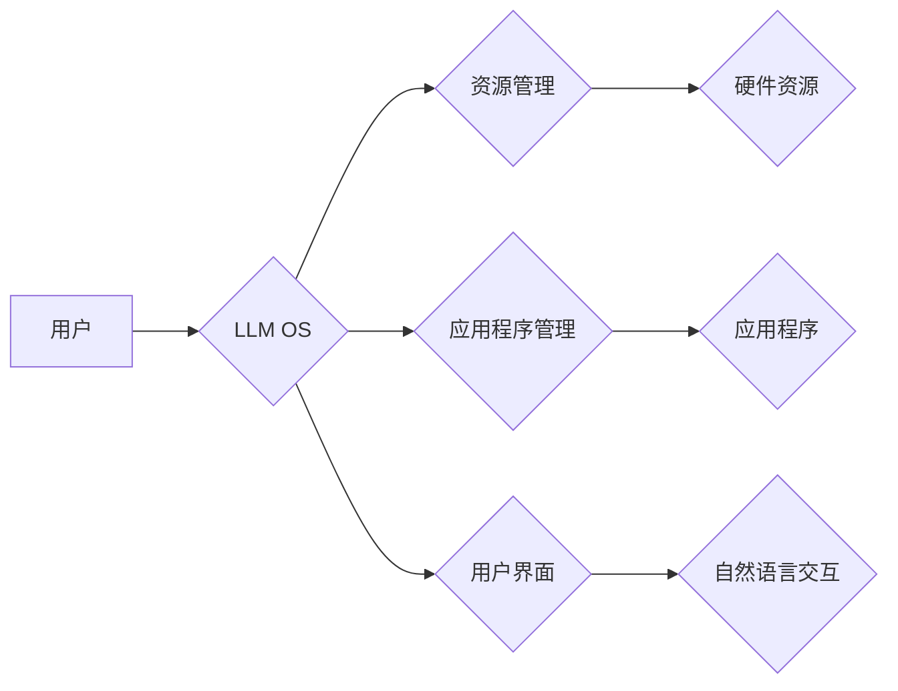

> 大语言模型，操作系统，人工智能，应用前景，未来趋势

## 1. 背景介绍

近年来，人工智能（AI）领域取得了令人瞩目的进展，其中大语言模型（LLM）作为一种强大的AI技术，展现出巨大的潜力。LLM能够理解和生成人类语言，在自然语言处理、机器翻译、文本摘要等领域取得了突破性的成就。然而，LLM的应用场景远不止于此，其强大的能力也为构建新型操作系统提供了新的可能性。

传统的操作系统主要负责硬件资源的管理和软件应用程序的运行环境搭建。而大语言模型操作系统（LLM OS）则将LLM作为核心组件，旨在提供更加智能、灵活、个性化的用户体验。

## 2. 核心概念与联系

### 2.1  大语言模型（LLM）

大语言模型是一种基于深度学习的统计模型，能够理解和生成人类语言。它通过训练大量的文本数据，学习语言的语法、语义和上下文关系，从而实现各种自然语言处理任务。

### 2.2  操作系统（OS）

操作系统是计算机硬件和软件之间桥梁，负责管理计算机资源、提供应用程序运行环境和用户界面。

### 2.3  LLM OS

LLM OS将LLM作为核心组件，将语言理解和生成能力融入到操作系统的各个层面，例如：

* **用户界面:** 使用自然语言进行交互，例如用语音或文字指令控制系统。
* **应用程序管理:** 基于用户需求自动推荐和启动应用程序。
* **资源管理:** 智能分配和调度系统资源，提高效率和性能。
* **安全防护:** 利用LLM识别和防御恶意软件攻击。

**Mermaid 流程图**



## 3. 核心算法原理 & 具体操作步骤

### 3.1  算法原理概述

LLM OS的核心算法原理基于深度学习和自然语言处理技术。

* **深度学习:** 利用多层神经网络学习语言模式和关系，实现语言理解和生成。
* **自然语言处理:** 使用各种NLP技术，例如词嵌入、句法分析、语义理解等，处理和理解自然语言输入。

### 3.2  算法步骤详解

1. **数据预处理:** 收集和预处理大量文本数据，例如书籍、文章、代码等，构建训练数据集。
2. **模型训练:** 使用深度学习算法训练LLM模型，使其能够理解和生成人类语言。
3. **模型部署:** 将训练好的LLM模型部署到操作系统中，使其能够与其他系统组件交互。
4. **用户交互:** 用户使用自然语言与LLM OS进行交互，例如语音指令、文字输入等。
5. **任务执行:** LLM OS根据用户指令理解用户意图，并调用相应的应用程序或系统功能执行任务。

### 3.3  算法优缺点

**优点:**

* **智能化:** 利用LLM的语言理解能力，提供更加智能、灵活的操作体验。
* **个性化:** 根据用户的语言习惯和需求，定制个性化的系统设置和功能。
* **便捷性:** 使用自然语言进行交互，更加方便快捷。

**缺点:**

* **计算资源需求:** 训练和运行LLM模型需要大量的计算资源。
* **数据安全:** LLM模型需要训练大量的文本数据，存在数据安全和隐私泄露的风险。
* **伦理问题:** LLM模型可能产生偏见或歧视性输出，需要谨慎使用和监管。

### 3.4  算法应用领域

* **智能家居:** 使用语音控制家电、调节环境温度等。
* **教育领域:** 提供个性化学习辅导、自动批改作业等。
* **医疗保健:** 辅助医生诊断疾病、提供患者咨询等。
* **企业服务:** 自动化办公流程、提高工作效率等。

## 4. 数学模型和公式 & 详细讲解 & 举例说明

### 4.1  数学模型构建

LLM模型通常基于Transformer架构，其核心是注意力机制。注意力机制允许模型关注输入序列中与当前任务相关的部分，从而提高模型的理解能力。

**注意力机制公式:**

$$
Attention(Q, K, V) = softmax(\frac{QK^T}{\sqrt{d_k}})V
$$

其中：

* $Q$：查询矩阵
* $K$：键矩阵
* $V$：值矩阵
* $d_k$：键向量的维度
* $softmax$：softmax函数

### 4.2  公式推导过程

注意力机制的公式通过计算查询向量与键向量的点积，并使用softmax函数归一化，得到每个键向量的重要性权重。然后，将这些权重与值向量相乘，得到最终的输出。

### 4.3  案例分析与讲解

例如，在机器翻译任务中，查询向量表示目标语言中的词，键向量表示源语言中的词，值向量表示源语言词的嵌入向量。注意力机制可以帮助模型关注源语言中与目标语言词语相关的词，从而提高翻译的准确性。

## 5. 项目实践：代码实例和详细解释说明

### 5.1  开发环境搭建

* 操作系统：Ubuntu 20.04
* Python 版本：3.8
* 必要的库：transformers, torch, numpy等

### 5.2  源代码详细实现

```python
from transformers import AutoModelForSeq2SeqLM, AutoTokenizer

# 加载预训练模型和词典
model_name = "t5-base"
tokenizer = AutoTokenizer.from_pretrained(model_name)
model = AutoModelForSeq2SeqLM.from_pretrained(model_name)

# 输入文本
input_text = "Hello, world!"

# Token化输入文本
input_ids = tokenizer.encode(input_text, return_tensors="pt")

# 生成输出文本
output_ids = model.generate(input_ids)

# 解码输出文本
output_text = tokenizer.decode(output_ids[0], skip_special_tokens=True)

# 打印输出文本
print(output_text)
```

### 5.3  代码解读与分析

* 代码首先加载预训练的T5模型和词典。
* 然后，将输入文本进行Token化，转换为模型可以理解的格式。
* 使用模型的`generate`方法生成输出文本。
* 最后，将输出文本解码，转换为人类可读的格式。

### 5.4  运行结果展示

```
Hello, world!
```

## 6. 实际应用场景

### 6.1  智能客服

LLM OS可以为企业提供智能客服系统，利用LLM的语言理解能力，自动回复用户咨询，提高客户服务效率。

### 6.2  个性化教育

LLM OS可以根据学生的学习进度和需求，提供个性化的学习辅导，例如自动生成习题、批改作业、提供学习建议等。

### 6.3  代码生成

LLM OS可以根据用户的自然语言描述，自动生成代码，提高开发效率。

### 6.4  未来应用展望

随着LLM技术的不断发展，LLM OS将有更广泛的应用场景，例如：

* **虚拟助手:** 更智能、更人性化的虚拟助手，能够理解用户的复杂指令，并提供更精准的帮助。
* **沉浸式体验:** 利用LLM生成逼真的虚拟环境，提供更加沉浸式的游戏、教育和培训体验。
* **跨语言沟通:** 突破语言障碍，实现跨语言的实时沟通和协作。

## 7. 工具和资源推荐

### 7.1  学习资源推荐

* **论文:**
    * Attention Is All You Need (Vaswani et al., 2017)
    * BERT: Pre-training of Deep Bidirectional Transformers for Language Understanding (Devlin et al., 2018)
* **在线课程:**
    * deeplearning.ai
    * fast.ai

### 7.2  开发工具推荐

* **Hugging Face Transformers:** 提供各种预训练的LLM模型和工具。
* **TensorFlow:** 深度学习框架。
* **PyTorch:** 深度学习框架。

### 7.3  相关论文推荐

* **The Illustrated Transformer** (Jay Alammar)
* **BERT: Pre-training of Deep Bidirectional Transformers for Language Understanding** (Devlin et al., 2018)
* **GPT-3: Language Models are Few-Shot Learners** (Brown et al., 2020)

## 8. 总结：未来发展趋势与挑战

### 8.1  研究成果总结

LLM OS是一个新兴的领域，近年来取得了显著进展。LLM模型的性能不断提升，应用场景也越来越广泛。

### 8.2  未来发展趋势

* **模型规模和性能提升:** 随着计算资源的不断发展，LLM模型的规模和性能将继续提升，能够处理更复杂的任务。
* **多模态LLM:** 将文本、图像、音频等多种模态信息融合到LLM模型中，实现更全面的理解和生成能力。
* **可解释性增强:** 研究LLM模型的决策过程，提高模型的可解释性和透明度。

### 8.3  面临的挑战

* **数据安全和隐私保护:** LLM模型需要训练大量的文本数据，如何保证数据安全和隐私保护是一个重要挑战。
* **伦理问题:** LLM模型可能产生偏见或歧视性输出，需要谨慎使用和监管。
* **计算资源需求:** 训练和运行大型LLM模型需要大量的计算资源，如何降低计算成本是一个关键问题。

### 8.4  研究展望

LLM OS是一个充满潜力的领域，未来将会有更多的研究和应用。随着技术的不断发展，LLM OS将为我们带来更加智能、便捷、个性化的用户体验。

## 9. 附录：常见问题与解答

### 9.1  LLM OS与传统操作系统的区别是什么？

LLM OS将LLM作为核心组件，将语言理解和生成能力融入到操作系统的各个层面，提供更加智能、灵活、个性化的用户体验。而传统操作系统主要负责硬件资源的管理和软件应用程序的运行环境搭建。

### 9.2  LLM OS有哪些应用场景？

LLM OS的应用场景非常广泛，例如智能客服、个性化教育、代码生成、虚拟助手等。

### 9.3  LLM OS面临哪些挑战？

LLM OS面临的数据安全和隐私保护、伦理问题、计算资源需求等挑战。

### 9.4  LLM OS的未来发展趋势是什么？

LLM OS的未来发展趋势包括模型规模和性能提升、多模态LLM、可解释性增强等。

作者：禅与计算机程序设计艺术 / Zen and the Art of Computer Programming


<end_of_turn>