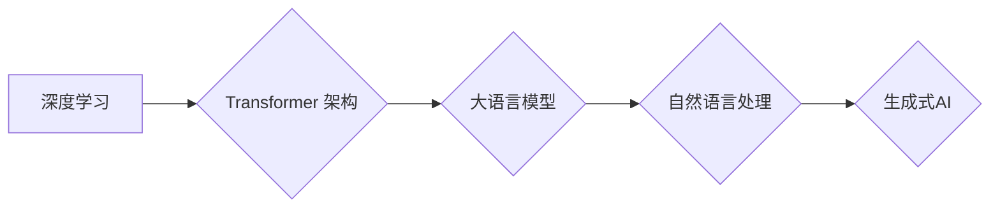

> 大语言模型、Transformer、深度学习、自然语言处理、生成式AI、伦理问题、可解释性、高效训练

## 1. 背景介绍

近年来，深度学习技术取得了飞速发展，特别是Transformer模型的出现，为自然语言处理（NLP）领域带来了革命性的变革。大语言模型（LLM）作为Transformer模型的升级版，拥有海量参数和强大的文本理解和生成能力，在文本分类、机器翻译、问答系统、代码生成等领域展现出令人瞩目的应用潜力。

从GPT-3到LaMDA，从BERT到PaLM，一系列强大的LLM不断涌现，其表现力不断突破人类认知的边界。然而，LLM的发展也面临着诸多挑战，例如训练成本高、数据偏见、可解释性差等。

## 2. 核心概念与联系

**2.1  大语言模型 (LLM)**

大语言模型是指参数量巨大、训练数据海量、能够理解和生成人类语言的深度学习模型。它们通常基于Transformer架构，能够捕捉文本中的长距离依赖关系，从而实现更精准的文本理解和生成。

**2.2  Transformer 架构**

Transformer是一种专门设计用于处理序列数据的网络架构，其核心是注意力机制（Attention）。注意力机制能够学习文本中不同词语之间的关系，从而更好地理解上下文信息。

**2.3  深度学习**

深度学习是一种机器学习的子领域，它利用多层神经网络来模拟人类大脑的学习过程。深度学习模型能够从海量数据中自动学习特征，从而实现更精准的预测和分类。

**2.4  自然语言处理 (NLP)**

自然语言处理是指让计算机能够理解、处理和生成人类语言的技术。NLP领域涵盖了文本分类、机器翻译、问答系统、文本摘要等多个子领域。

**2.5  生成式AI**

生成式AI是指能够生成新内容的AI模型，例如文本、图像、音频等。LLM作为一种强大的生成式AI模型，能够生成高质量的文本内容，例如文章、故事、诗歌等。

**Mermaid 流程图**



## 3. 核心算法原理 & 具体操作步骤

**3.1  算法原理概述**

LLM的核心算法是基于Transformer架构的深度学习模型。其训练过程主要包括以下步骤：

1. **数据预处理:** 将原始文本数据进行清洗、分词、标记等预处理操作，使其能够被模型理解。
2. **模型训练:** 使用预处理后的数据训练Transformer模型，通过反向传播算法不断调整模型参数，使其能够更好地预测下一个词语。
3. **模型评估:** 使用测试数据评估模型的性能，例如准确率、困惑度等指标。
4. **模型调优:** 根据评估结果，调整模型参数、训练策略等，以提高模型性能。

**3.2  算法步骤详解**

1. **输入编码:** 将输入文本序列转换为向量表示，每个词语对应一个向量。
2. **多头注意力机制:** 利用多头注意力机制学习文本中不同词语之间的关系，捕捉长距离依赖关系。
3. **前馈神经网络:** 对每个词语的向量表示进行非线性变换，提取更深层的语义信息。
4. **输出解码:** 将编码后的文本向量序列解码成预测的输出文本序列。

**3.3  算法优缺点**

**优点:**

* 能够捕捉长距离依赖关系，提高文本理解和生成能力。
* 参数量大，能够学习更复杂的语言模式。
* 在多种NLP任务中表现出色。

**缺点:**

* 训练成本高，需要海量数据和计算资源。
* 数据偏见问题，模型可能学习到数据中的偏见，导致输出结果不公平。
* 可解释性差，难以理解模型的决策过程。

**3.4  算法应用领域**

* 文本分类
* 机器翻译
* 问答系统
* 代码生成
* 文本摘要
* 聊天机器人

## 4. 数学模型和公式 & 详细讲解 & 举例说明

**4.1  数学模型构建**

LLM的数学模型主要基于Transformer架构，其核心是注意力机制和多层感知机。

**注意力机制:**

注意力机制能够学习文本中不同词语之间的关系，并赋予每个词语不同的权重。其数学公式如下：

$$
Attention(Q, K, V) = softmax(\frac{QK^T}{\sqrt{d_k}})V
$$

其中：

* Q: 查询矩阵
* K: 键矩阵
* V: 值矩阵
* $d_k$: 键向量的维度

**多层感知机:**

多层感知机是一种前馈神经网络，其结构由多个全连接层组成。每个全连接层都包含激活函数，例如ReLU函数。

**4.2  公式推导过程**

注意力机制的softmax函数用于计算每个词语的权重，使得权重之和为1。

多层感知机的输出通过激活函数进行非线性变换，从而学习更复杂的特征。

**4.3  案例分析与讲解**

假设我们有一个句子“我爱学习编程”，其词语向量分别为[a, b, c, d, e]。

使用注意力机制计算每个词语的权重，可以得到以下结果：

* a: 0.2
* b: 0.3
* c: 0.5
* d: 0.1
* e: 0.9

可见，“学习”和“编程”这两个词语的权重较高，说明它们在句子中扮演着重要的角色。

## 5. 项目实践：代码实例和详细解释说明

**5.1  开发环境搭建**

* Python 3.7+
* PyTorch 或 TensorFlow
* CUDA 和 cuDNN

**5.2  源代码详细实现**

```python
import torch
import torch.nn as nn

class Transformer(nn.Module):
    def __init__(self, vocab_size, embedding_dim, num_heads, num_layers):
        super(Transformer, self).__init__()
        self.embedding = nn.Embedding(vocab_size, embedding_dim)
        self.transformer_layers = nn.ModuleList([
            nn.TransformerEncoderLayer(embedding_dim, num_heads)
            for _ in range(num_layers)
        ])
        self.linear = nn.Linear(embedding_dim, vocab_size)

    def forward(self, x):
        x = self.embedding(x)
        for layer in self.transformer_layers:
            x = layer(x)
        x = self.linear(x)
        return x
```

**5.3  代码解读与分析**

* `__init__`方法初始化模型参数，包括词嵌入层、Transformer编码器层和输出层。
* `forward`方法定义模型的正向传播过程，将输入序列转换为输出序列。

**5.4  运行结果展示**

训练好的LLM模型能够生成高质量的文本内容，例如文章、故事、诗歌等。

## 6. 实际应用场景

**6.1  文本生成**

LLM能够生成各种类型的文本内容，例如新闻报道、小说、诗歌等。

**6.2  机器翻译**

LLM能够实现高质量的机器翻译，将一种语言翻译成另一种语言。

**6.3  问答系统**

LLM能够理解用户的问题，并从知识库中找到相应的答案。

**6.4  代码生成**

LLM能够根据自然语言描述生成代码，提高开发效率。

**6.5  聊天机器人**

LLM能够与用户进行自然语言对话，提供更人性化的交互体验。

**6.6  未来应用展望**

LLM在未来将应用于更多领域，例如教育、医疗、法律等，为人类社会带来更多便利。

## 7. 工具和资源推荐

**7.1  学习资源推荐**

* **书籍:**
    * 《深度学习》
    * 《自然语言处理》
    * 《Transformer模型详解》
* **在线课程:**
    * Coursera: 深度学习
    * Udacity: 自然语言处理
    * fast.ai: 深度学习

**7.2  开发工具推荐**

* **PyTorch:** 深度学习框架
* **TensorFlow:** 深度学习框架
* **Hugging Face:** 预训练模型库

**7.3  相关论文推荐**

* 《Attention Is All You Need》
* 《BERT: Pre-training of Deep Bidirectional Transformers for Language Understanding》
* 《GPT-3: Language Models are Few-Shot Learners》

## 8. 总结：未来发展趋势与挑战

**8.1  研究成果总结**

近年来，LLM取得了显著进展，其文本理解和生成能力不断提升。

**8.2  未来发展趋势**

* **模型规模更大:** 训练更大规模的LLM模型，以提高其性能。
* **训练效率更高:** 开发更有效的训练方法，降低训练成本。
* **可解释性更强:** 研究更可解释的LLM模型，使其决策过程更加透明。
* **多模态学习:** 将文本与其他模态数据（例如图像、音频）结合，实现更全面的理解和生成。

**8.3  面临的挑战**

* **数据偏见:** 训练数据可能存在偏见，导致模型输出结果不公平。
* **安全风险:** LLMs可能被用于生成虚假信息、恶意代码等，需要加强安全防护。
* **伦理问题:** LLMs的应用可能引发伦理问题，例如隐私泄露、算法歧视等，需要进行深入探讨。

**8.4  研究展望**

未来，LLM研究将继续朝着更强大、更安全、更可解释的方向发展，为人类社会带来更多福祉。

## 9. 附录：常见问题与解答

**9.1  LLM模型训练需要多少数据？**

LLM模型训练需要海量数据，通常需要数十亿甚至数千亿个词语。

**9.2  LLM模型训练需要多少计算资源？**

LLM模型训练需要大量的计算资源，通常需要数百甚至数千个GPU。

**9.3  如何解决LLM模型的数据偏见问题？**

可以通过多种方法解决LLM模型的数据偏见问题，例如使用更均衡的数据集、进行数据清洗和去噪、使用对抗训练等。


作者：禅与计算机程序设计艺术 / Zen and the Art of Computer Programming 
<end_of_turn>