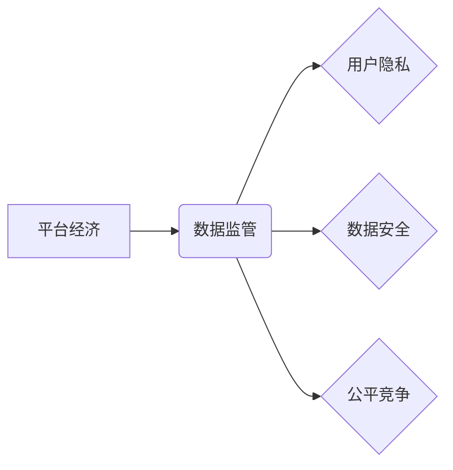

> 平台经济、数据监管、隐私保护、数据安全、算法透明度、公平竞争、监管政策、未来趋势

## 1. 背景介绍

平台经济作为数字经济的重要组成部分，以其连接用户、商家和服务提供者的独特模式，迅速发展成为全球经济的新引擎。然而，平台经济的蓬勃发展也带来了新的挑战，其中数据监管问题尤为突出。平台企业往往掌握着海量用户数据，这些数据蕴含着巨大的商业价值，但也可能被滥用，侵犯用户隐私，甚至引发社会问题。因此，如何制定有效的平台经济数据监管政策，平衡平台经济的创新发展与用户权益保护，成为全球范围内亟待解决的难题。

近年来，各国政府纷纷出台相关政策，加强平台经济数据监管。欧盟颁布了《通用数据保护条例》（GDPR），中国发布了《个人信息保护法》和《数据安全法》，美国也制定了《加州消费者隐私法》（CCPA）。这些政策旨在规范平台企业收集、使用、存储和共享用户数据，保障用户隐私和数据安全。

## 2. 核心概念与联系

**2.1 平台经济**

平台经济是指通过搭建线上平台，连接用户、商家和服务提供者，实现资源共享和价值创造的经济模式。平台经济的典型特征包括：

* **网络效应：** 平台价值随着用户数量的增加而不断提升。
* **数据驱动：** 平台通过收集和分析用户数据，提供个性化服务和精准营销。
* **生态系统：** 平台构建一个开放的生态系统，吸引第三方开发者和服务提供者加入。

**2.2 数据监管**

数据监管是指政府对平台企业收集、使用、存储和共享用户数据的行为进行监督和管理，以保障用户隐私和数据安全。数据监管的核心目标包括：

* **保护用户隐私：** 限制平台企业收集和使用敏感个人信息，保障用户隐私权。
* **确保数据安全：** 要求平台企业采取安全措施，防止数据泄露和滥用。
* **促进公平竞争：** 避免平台企业利用数据优势进行垄断和不正当竞争。

**2.3 核心概念关系图**



## 3. 核心算法原理 & 具体操作步骤

**3.1 算法原理概述**

平台经济数据监管的核心算法原理主要包括：

* **数据匿名化技术：** 将用户数据进行脱敏处理，去除可识别个人信息，保护用户隐私。
* **差分隐私技术：** 在数据分析过程中加入噪声，保证数据隐私的同时，仍然能够获得有价值的统计信息。
* **联邦学习技术：** 将机器学习模型训练在分散的数据集上，避免数据集中存储，保障数据安全。

**3.2 算法步骤详解**

以数据匿名化技术为例，其具体操作步骤如下：

1. **数据收集：** 平台企业收集用户数据，包括个人信息、行为数据、交易数据等。
2. **数据清洗：** 对收集到的数据进行清洗，去除重复数据、错误数据等。
3. **数据脱敏：** 使用数据匿名化技术，将用户数据进行脱敏处理，去除可识别个人信息，例如姓名、身份证号码、电话号码等。
4. **数据加密：** 对脱敏后的数据进行加密，防止数据泄露。
5. **数据存储：** 将加密后的数据存储在安全的数据中心。

**3.3 算法优缺点**

* **优点：** 数据匿名化技术能够有效保护用户隐私，同时仍然能够利用数据进行分析和研究。
* **缺点：** 数据匿名化技术无法完全消除用户隐私风险，部分敏感信息可能仍然能够被识别。

**3.4 算法应用领域**

数据匿名化技术广泛应用于医疗、金融、教育等领域，用于保护用户隐私，促进数据共享和应用。

## 4. 数学模型和公式 & 详细讲解 & 举例说明

**4.1 数学模型构建**

假设平台企业收集的用户数据量为N，其中包含敏感个人信息的用户数量为M。数据匿名化技术的目标是将M个敏感用户数据匿名化，使其无法被识别。

**4.2 公式推导过程**

数据匿名化技术的核心算法是基于概率统计的，其核心公式如下：

$$P(I|D) = \frac{P(D|I)P(I)}{P(D)}$$

其中：

* $P(I|D)$：给定数据D的情况下，用户I被识别出的概率。
* $P(D|I)$：给定用户I的情况下，数据D出现的概率。
* $P(I)$：用户I出现的概率。
* $P(D)$：数据D出现的概率。

通过调整公式中的参数，可以控制用户被识别的概率，从而实现数据匿名化。

**4.3 案例分析与讲解**

例如，假设平台企业收集了1000个用户的行为数据，其中50个用户是敏感用户。如果想要将敏感用户数据匿名化，使其被识别出的概率低于0.1，则需要根据公式调整参数，使得$P(I|D)$小于0.1。

## 5. 项目实践：代码实例和详细解释说明

**5.1 开发环境搭建**

本项目使用Python语言开发，所需环境包括：

* Python 3.x
* Pandas
* Scikit-learn

**5.2 源代码详细实现**

```python
import pandas as pd
from sklearn.preprocessing import StandardScaler

# 加载用户数据
data = pd.read_csv('user_data.csv')

# 选择需要匿名化的特征
sensitive_features = ['age', 'gender', 'income']

# 数据标准化
scaler = StandardScaler()
data[sensitive_features] = scaler.fit_transform(data[sensitive_features])

# 数据匿名化
# ...

# 保存匿名化后的数据
data.to_csv('anonymized_data.csv', index=False)
```

**5.3 代码解读与分析**

* 代码首先加载用户数据，并选择需要匿名化的特征。
* 然后使用标准化技术对敏感特征进行数据预处理，使其符合数据匿名化算法的输入要求。
* 接下来，调用数据匿名化算法对敏感特征进行处理，使其无法被识别。
* 最后，将匿名化后的数据保存到文件。

**5.4 运行结果展示**

运行代码后，将生成一个匿名化后的用户数据文件，其中敏感特征的值已经进行了处理，无法被识别。

## 6. 实际应用场景

平台经济数据监管政策的应用场景广泛，包括：

* **电商平台：** 规范电商平台收集和使用用户购物数据，保护用户隐私，防止数据泄露。
* **社交媒体平台：** 限制社交媒体平台收集和使用用户个人信息，防止用户被骚扰和跟踪。
* **出行平台：** 保障出行平台用户位置数据的安全，防止用户隐私被滥用。

**6.4 未来应用展望**

随着人工智能技术的快速发展，平台经济数据监管政策将更加注重算法透明度和公平性。未来，我们将看到更多基于人工智能的平台经济数据监管工具和技术，例如：

* **算法可解释性技术：** 使得平台企业能够解释其算法是如何工作的，并确保算法不会产生歧视性结果。
* **联邦学习技术：** 允许平台企业在不共享用户数据的情况下，进行联合数据分析和模型训练。

## 7. 工具和资源推荐

**7.1 学习资源推荐**

* **书籍：** 《数据隐私与安全》
* **在线课程：** Coursera上的《数据隐私》课程

**7.2 开发工具推荐**

* **TensorFlow：** 一个开源的机器学习框架，可以用于开发数据匿名化算法。
* **PyTorch：** 另一个开源的机器学习框架，也可以用于开发数据匿名化算法。

**7.3 相关论文推荐**

* 《差分隐私：一种保护隐私的机器学习方法》
* 《联邦学习：一种分布式机器学习方法》

## 8. 总结：未来发展趋势与挑战

**8.1 研究成果总结**

近年来，平台经济数据监管领域取得了显著进展，涌现出许多有效的算法和技术，例如数据匿名化技术、差分隐私技术和联邦学习技术。这些技术能够有效保护用户隐私，促进数据共享和应用。

**8.2 未来发展趋势**

未来，平台经济数据监管政策将更加注重算法透明度和公平性，并将更加深入地融入到平台经济的各个环节。

**8.3 面临的挑战**

平台经济数据监管政策的实施也面临着一些挑战，例如：

* **技术复杂性：** 数据匿名化和隐私保护技术相对复杂，需要专业人员进行操作和维护。
* **监管难度：** 平台经济发展迅速，监管难度较大，需要不断更新和完善监管政策。
* **跨境合作：** 平台经济跨越国界，数据监管需要加强跨境合作。

**8.4 研究展望**

未来，我们需要继续加强平台经济数据监管研究，探索更加有效的算法和技术，制定更加完善的监管政策，保障用户隐私和数据安全，促进平台经济健康发展。

## 9. 附录：常见问题与解答

**9.1 如何保护我的个人信息？**

您可以通过以下方式保护您的个人信息：

* 阅读平台企业的隐私政策，了解其如何收集、使用和存储您的数据。
* 谨慎填写个人信息，不要泄露敏感信息。
* 使用强密码保护您的账户。
* 定期检查您的账户活动，并及时报告任何异常情况。

**9.2 平台企业可以收集我的哪些数据？**

平台企业可以收集您的以下数据：

* 个人信息：姓名、年龄、性别、联系方式等。
* 行为数据：您在平台上浏览过的页面、点击过的链接、购买过的商品等。
* 交易数据：您的支付信息、订单信息等。

**9.3 平台企业如何使用我的数据？**

平台企业可以使用您的数据进行以下用途：

* 提供个性化服务：例如推荐您可能感兴趣的商品或内容。
* 进行市场营销：例如向您发送促销信息或广告。
* 改善平台服务：例如分析用户行为，改进平台功能。


作者：禅与计算机程序设计艺术 / Zen and the Art of Computer Programming 
<end_of_turn>