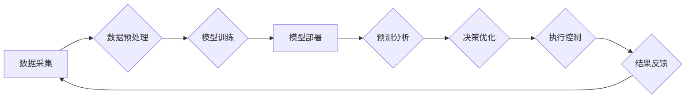

> AI大模型，智能物流，供应链管理，预测分析，优化算法，机器学习，深度学习

## 1. 背景介绍

在当今全球化经济的背景下，物流和供应链管理扮演着至关重要的角色。高效、灵活、可持续的物流和供应链管理对于企业降低成本、提高效率、增强竞争力至关重要。然而，传统物流和供应链管理模式面临着诸多挑战，例如：

* **数据孤岛问题：** 不同环节的数据分散存储，难以进行有效整合和分析。
* **预测精度低：** 传统的预测模型难以准确预测需求变化、运输成本、库存水平等关键指标。
* **决策效率低下：** 决策过程依赖于经验和主观判断，缺乏数据支撑和科学依据。
* **资源配置不合理：** 物流资源配置缺乏优化，导致运输成本高、库存积压等问题。

随着人工智能（AI）技术的快速发展，特别是大模型技术的突破，为物流和供应链管理带来了新的机遇。AI大模型能够有效处理海量数据，挖掘隐藏的模式和规律，为物流和供应链管理提供更精准、更智能的解决方案。

## 2. 核心概念与联系

**2.1 智能物流与供应链管理**

智能物流是指利用人工智能、物联网、大数据等技术，实现物流过程的自动化、智能化和优化。智能供应链管理是指通过整合供应链各环节的信息和资源，利用AI技术进行预测、优化和控制，实现供应链的协同、高效和可持续发展。

**2.2 AI大模型**

AI大模型是指在海量数据上训练的深度学习模型，具有强大的泛化能力和学习能力。常见的AI大模型包括：

* **自然语言处理模型：** 例如BERT、GPT-3，能够理解和生成人类语言。
* **计算机视觉模型：** 例如YOLO、ResNet，能够识别和理解图像和视频。
* **推荐系统模型：** 例如Collaborative Filtering、Content-Based Filtering，能够根据用户行为和偏好推荐相关商品或服务。

**2.3 AI大模型在智能物流与供应链管理中的应用**

AI大模型可以应用于智能物流和供应链管理的各个环节，例如：

* **需求预测：** 利用历史数据和外部因素预测未来需求，优化库存管理和生产计划。
* **运输优化：** 规划最优的运输路线和配送方案，降低运输成本和时间。
* **仓储管理：** 自动化仓储作业，提高仓储效率和准确性。
* **风险管理：** 识别和预测潜在的供应链风险，制定相应的应对措施。
* **客户服务：** 利用聊天机器人等技术提供智能化的客户服务。

**2.4 架构图**



## 3. 核心算法原理 & 具体操作步骤

**3.1 算法原理概述**

在智能物流与供应链管理中，常用的AI算法包括：

* **机器学习算法：** 例如线性回归、逻辑回归、决策树、支持向量机、神经网络等，用于预测、分类、聚类等任务。
* **深度学习算法：** 例如卷积神经网络（CNN）、循环神经网络（RNN）、Transformer等，用于处理复杂的数据模式，例如图像识别、自然语言处理等。
* **强化学习算法：** 例如Q学习、SARSA等，用于训练智能体在环境中做出最优决策。

**3.2 算法步骤详解**

以需求预测为例，使用机器学习算法进行需求预测的步骤如下：

1. **数据收集：** 收集历史销售数据、市场趋势数据、季节性数据等相关信息。
2. **数据预处理：** 清洗、转换、归一化数据，使其适合模型训练。
3. **模型选择：** 根据数据特点和预测目标选择合适的机器学习算法。
4. **模型训练：** 使用训练数据训练模型，调整模型参数，使其能够准确预测未来需求。
5. **模型评估：** 使用测试数据评估模型的预测精度，并进行模型调优。
6. **模型部署：** 将训练好的模型部署到生产环境中，用于实时预测未来需求。

**3.3 算法优缺点**

不同的算法具有不同的优缺点，需要根据实际情况选择合适的算法。例如，线性回归算法简单易实现，但预测精度较低；深度学习算法预测精度高，但训练成本高。

**3.4 算法应用领域**

机器学习算法广泛应用于智能物流与供应链管理的各个领域，例如：

* **需求预测：** 预测未来产品需求，优化库存管理和生产计划。
* **运输优化：** 规划最优的运输路线和配送方案，降低运输成本和时间。
* **仓储管理：** 自动化仓储作业，提高仓储效率和准确性。
* **风险管理：** 识别和预测潜在的供应链风险，制定相应的应对措施。
* **客户服务：** 利用聊天机器人等技术提供智能化的客户服务。

## 4. 数学模型和公式 & 详细讲解 & 举例说明

**4.1 数学模型构建**

在智能物流与供应链管理中，可以使用数学模型来描述和分析各种现象。例如，可以使用线性规划模型来优化运输路线，可以使用库存模型来预测库存水平，可以使用队列模型来分析等待时间。

**4.2 公式推导过程**

例如，可以使用以下公式来计算运输成本：

$$
Cost = Distance \times FuelConsumptionRate \times FuelPrice
$$

其中：

* $Distance$：运输距离
* $FuelConsumptionRate$：燃油消耗率
* $FuelPrice$：燃油价格

**4.3 案例分析与讲解**

例如，假设一家公司需要将货物从A点运输到B点，距离为100公里，燃油消耗率为10公里/升，燃油价格为8元/升。则运输成本为：

$$
Cost = 100 \times 10 \times 8 = 800元
$$

## 5. 项目实践：代码实例和详细解释说明

**5.1 开发环境搭建**

可以使用Python语言和相关的库来开发智能物流与供应链管理的应用。例如，可以使用TensorFlow、PyTorch等深度学习库进行模型训练，可以使用Scikit-learn等机器学习库进行模型评估和调优。

**5.2 源代码详细实现**

以下是一个使用Python语言和Scikit-learn库进行需求预测的简单代码示例：

```python
from sklearn.linear_model import LinearRegression
from sklearn.model_selection import train_test_split
from sklearn.metrics import mean_squared_error

# 加载数据
data = pd.read_csv('sales_data.csv')

# 划分训练集和测试集
X_train, X_test, y_train, y_test = train_test_split(data[['previous_sales', 'marketing_spend']], data['sales'], test_size=0.2)

# 创建线性回归模型
model = LinearRegression()

# 训练模型
model.fit(X_train, y_train)

# 预测测试集数据
y_pred = model.predict(X_test)

# 计算模型精度
mse = mean_squared_error(y_test, y_pred)
print('Mean Squared Error:', mse)
```

**5.3 代码解读与分析**

这段代码首先加载销售数据，然后将数据划分成训练集和测试集。接着，创建了一个线性回归模型，并使用训练集数据训练模型。最后，使用测试集数据预测销售额，并计算模型的精度。

**5.4 运行结果展示**

运行这段代码后，会输出模型的平均平方误差（MSE）值，该值越小，模型的预测精度越高。

## 6. 实际应用场景

**6.1 需求预测**

AI大模型可以根据历史销售数据、市场趋势数据、季节性数据等信息，准确预测未来产品需求，帮助企业优化库存管理和生产计划。

**6.2 运输优化**

AI大模型可以根据运输距离、运输时间、运输成本等因素，规划最优的运输路线和配送方案，降低运输成本和时间。

**6.3 仓储管理**

AI大模型可以帮助企业优化仓储布局、自动化仓储作业，提高仓储效率和准确性。

**6.4 未来应用展望**

随着AI技术的不断发展，AI大模型在智能物流与供应链管理领域的应用将更加广泛和深入。例如，未来可能出现以下应用场景：

* **智能化物流机器人：** 利用AI技术，开发能够自主导航、搬运货物、自动分拣的物流机器人。
* **个性化物流服务：** 根据用户的需求和偏好，提供个性化的物流服务，例如定制化配送路线、灵活的配送时间等。
* **可持续物流：** 利用AI技术，优化物流流程，减少碳排放，实现可持续发展。

## 7. 工具和资源推荐

**7.1 学习资源推荐**

* **在线课程：** Coursera、edX、Udacity等平台提供丰富的AI和机器学习课程。
* **书籍：** 《深度学习》、《机器学习实战》等书籍是学习AI和机器学习的经典教材。
* **开源项目：** TensorFlow、PyTorch等开源项目提供了丰富的代码示例和学习资源。

**7.2 开发工具推荐**

* **Python：** Python是一种流行的编程语言，广泛应用于AI和机器学习领域。
* **Jupyter Notebook：** Jupyter Notebook是一种交互式编程环境，方便进行代码编写、调试和可视化。
* **TensorFlow、PyTorch：** TensorFlow和PyTorch是流行的深度学习框架，提供了丰富的工具和功能。

**7.3 相关论文推荐**

* **Attention Is All You Need：** 这篇论文介绍了Transformer模型，是一种强大的自然语言处理模型。
* **Deep Reinforcement Learning：** 这篇论文介绍了强化学习算法，是一种能够训练智能体的学习方法。

## 8. 总结：未来发展趋势与挑战

**8.1 研究成果总结**

近年来，AI大模型在智能物流与供应链管理领域取得了显著的成果，例如：

* **需求预测精度提高：** AI大模型能够更准确地预测未来需求，帮助企业优化库存管理和生产计划。
* **运输成本降低：** AI大模型能够规划最优的运输路线和配送方案，降低运输成本。
* **仓储效率提升：** AI大模型能够帮助企业优化仓储布局、自动化仓储作业，提高仓储效率。

**8.2 未来发展趋势**

未来，AI大模型在智能物流与供应链管理领域的应用将更加广泛和深入，例如：

* **更智能的物流机器人：** 利用AI技术，开发能够自主导航、搬运货物、自动分拣的物流机器人。
* **个性化物流服务：** 根据用户的需求和偏好，提供个性化的物流服务，例如定制化配送路线、灵活的配送时间等。
* **可持续物流：** 利用AI技术，优化物流流程，减少碳排放，实现可持续发展。

**8.3 面临的挑战**

尽管AI大模型在智能物流与供应链管理领域具有巨大的潜力，但也面临一些挑战，例如：

* **数据质量问题：** AI大模型的训练需要大量高质量的数据，而现实中数据往往存在不完整、不准确、格式不统一等问题。
* **模型解释性问题：** 许多AI大模型是黑箱模型，难以解释模型的决策过程，这可能会导致企业难以信任模型的预测结果。
* **伦理问题：** AI大模型的应用可能会带来一些伦理问题，例如数据隐私、算法偏见等。

**8.4 研究展望**

未来，需要进一步研究解决上述挑战，例如：

* 开发能够处理不完整、不准确数据的AI算法。
* 研究可解释性AI模型，提高