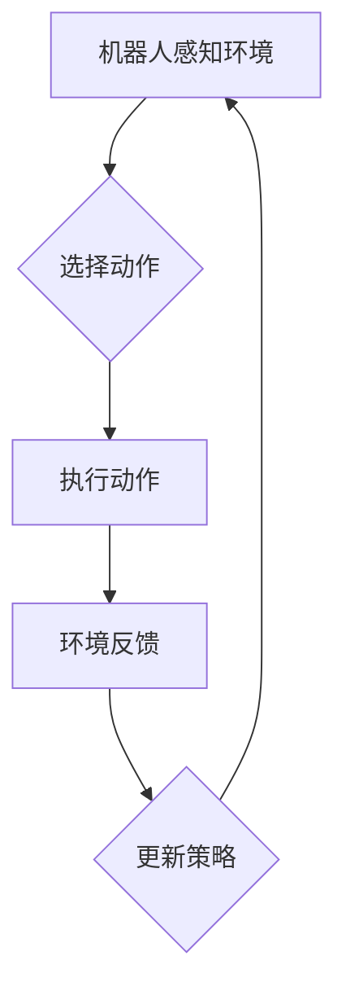

> 强化学习，机器人，互动学习，深度强化学习，环境建模，动作选择，奖励机制

## 1. 背景介绍

在人工智能领域，强化学习（Reinforcement Learning，RL）作为一种学习方式，已展现出强大的学习能力和应用潜力。它通过让智能体在与环境的交互中学习，不断调整策略以最大化累积奖励，从而实现目标。机器人领域作为人工智能的应用场景之一，与强化学习的结合，为机器人赋予了更强的自主学习和适应能力。

传统的机器人控制方法通常依赖于预先编程或规则驱动的策略，难以应对复杂、动态的环境变化。而强化学习则可以帮助机器人从经验中学习，不断优化行为策略，从而实现更灵活、更智能的控制。

## 2. 核心概念与联系

**2.1 强化学习核心概念**

* **智能体（Agent）：** 与环境交互并采取行动的实体。
* **环境（Environment）：** 智能体所处的外部世界，会根据智能体的行动产生相应的反馈。
* **状态（State）：** 环境在特定时刻的描述，反映了环境的当前状况。
* **动作（Action）：** 智能体在特定状态下可以采取的行动。
* **奖励（Reward）：** 环境对智能体采取的行动的反馈，可以是正向奖励或负向惩罚。
* **策略（Policy）：** 智能体在不同状态下选择动作的规则。

**2.2 强化学习与机器人的互动学习机制**

强化学习与机器人的互动学习机制可以概括为以下步骤：

1. 机器人感知环境，获取当前状态信息。
2. 根据策略，机器人选择一个动作。
3. 机器人执行动作，环境产生新的状态和奖励。
4. 机器人根据奖励信息更新策略，以提高未来获得奖励的概率。

**2.3 Mermaid 流程图**



## 3. 核心算法原理 & 具体操作步骤

**3.1 算法原理概述**

强化学习算法的核心是通过不断地与环境交互，学习一个最优的策略，使得智能体在环境中获得最大的累积奖励。常见的强化学习算法包括：

* **Q-学习:** 通过构建一个Q表，存储每个状态-动作对的期望奖励，并通过迭代更新Q表，学习最优策略。
* **SARSA:** 与Q-学习类似，但SARSA在更新Q表时，使用的是当前状态-动作对的实际奖励，而不是期望奖励。
* **Deep Q-Network (DQN):** 将深度神经网络应用于Q-学习，可以处理高维状态空间和复杂环境。

**3.2 算法步骤详解**

以Q-学习为例，其具体操作步骤如下：

1. 初始化Q表，将所有状态-动作对的Q值设置为0。
2. 在环境中进行交互，收集状态-动作-奖励-下一个状态的数据。
3. 根据Bellman方程更新Q表：

$$Q(s,a) = Q(s,a) + \alpha [r + \gamma \max_{a'} Q(s',a') - Q(s,a)]$$

其中：

* $Q(s,a)$ 是当前状态s下采取动作a的Q值。
* $\alpha$ 是学习率，控制着Q值更新的幅度。
* $r$ 是当前状态下获得的奖励。
* $\gamma$ 是折扣因子，控制着未来奖励的权重。
* $s'$ 是下一个状态。
* $a'$ 是下一个状态下采取的动作。

4. 重复步骤2和3，直到Q表收敛。

**3.3 算法优缺点**

* **优点:**

    * 能够学习复杂的策略。
    * 不需要预先定义环境模型。
    * 可以应用于各种机器人控制任务。

* **缺点:**

    * 训练过程可能需要大量的时间和数据。
    * 容易陷入局部最优解。
    * 对环境噪声和不确定性敏感。

**3.4 算法应用领域**

* 机器人控制
* 游戏人工智能
* 自动驾驶
* 医疗诊断
* 金融投资

## 4. 数学模型和公式 & 详细讲解 & 举例说明

**4.1 数学模型构建**

强化学习的数学模型可以概括为一个马尔可夫决策过程（Markov Decision Process，MDP）。MDP由以下五个要素组成：

* 状态空间 $S$：所有可能的系统状态的集合。
* 动作空间 $A$：在每个状态下可执行的动作集合。
* 转移概率 $P(s',r|s,a)$：从状态 $s$ 执行动作 $a$ 后，转移到状态 $s'$ 并获得奖励 $r$ 的概率。
* 奖励函数 $R(s,a)$：在状态 $s$ 执行动作 $a$ 后获得的奖励。
* 策略 $\pi(a|s)$：在状态 $s$ 下选择动作 $a$ 的概率分布。

**4.2 公式推导过程**

强化学习的目标是找到一个最优策略 $\pi^*$，使得智能体在环境中获得最大的累积奖励。最优策略的定义是：

$$
\pi^* = \arg\max_{\pi} \mathbb{E}_{\pi} [R_t]
$$

其中：

* $\mathbb{E}_{\pi}$ 表示根据策略 $\pi$ 采样的期望。
* $R_t$ 是从时间步 $t$ 开始到终点的累积奖励。

**4.3 案例分析与讲解**

例如，考虑一个机器人需要在迷宫中找到出口的任务。

* 状态空间 $S$：迷宫中的所有位置。
* 动作空间 $A$：向上、向下、向左、向右四个方向。
* 转移概率 $P(s',r|s,a)$：取决于机器人当前位置和选择的行动，例如，向右移动会以一定的概率到达下一个位置，并获得奖励，否则会停留在原地或撞墙。
* 奖励函数 $R(s,a)$：到达出口时获得最大奖励，撞墙时获得负奖励，其他情况下获得较小的奖励。
* 策略 $\pi(a|s)$：根据当前位置和环境信息，选择最有可能到达出口的动作。

通过强化学习算法，机器人可以不断地探索迷宫，学习最优的路径，最终找到出口。

## 5. 项目实践：代码实例和详细解释说明

**5.1 开发环境搭建**

* Python 3.x
* TensorFlow 或 PyTorch 深度学习框架
* OpenAI Gym 机器人仿真环境

**5.2 源代码详细实现**

```python
import gym
import numpy as np
from tensorflow.keras.models import Sequential
from tensorflow.keras.layers import Dense

# 创建环境
env = gym.make('CartPole-v1')

# 定义神经网络模型
model = Sequential()
model.add(Dense(128, activation='relu', input_shape=(4,)))
model.add(Dense(64, activation='relu'))
model.add(Dense(2, activation='softmax'))

# 定义损失函数和优化器
model.compile(loss='categorical_crossentropy', optimizer='adam')

# 训练模型
for episode in range(1000):
    state = env.reset()
    done = False
    total_reward = 0

    while not done:
        # 选择动作
        action = np.argmax(model.predict(state.reshape(1, -1)))

        # 执行动作
        next_state, reward, done, _ = env.step(action)

        # 更新状态
        state = next_state

        # 更新奖励
        total_reward += reward

    # 更新模型
    model.fit(state.reshape(1, -1), np.eye(2)[action], epochs=1, verbose=0)

    print(f'Episode: {episode}, Total Reward: {total_reward}')

# 保存模型
model.save('cartpole_model.h5')
```

**5.3 代码解读与分析**

* 代码首先创建了一个CartPole-v1环境，这是一个经典的机器人控制任务。
* 然后定义了一个神经网络模型，用于学习策略。
* 模型使用深度学习框架TensorFlow进行训练，采用Q学习算法。
* 训练过程包括以下步骤：
    * 从环境中获取初始状态。
    * 根据策略选择动作。
    * 执行动作，获取奖励和下一个状态。
    * 更新状态和奖励。
    * 更新模型参数。
* 训练完成后，模型可以用来控制机器人完成任务。

**5.4 运行结果展示**

运行代码后，会看到训练过程中的奖励值不断提高，最终机器人能够成功控制杆子保持平衡。

## 6. 实际应用场景

**6.1 机器人导航**

强化学习可以帮助机器人学习在复杂环境中导航，例如在仓库中搬运货物、在医院中巡逻、在城市中自动驾驶。

**6.2 机器人抓取**

强化学习可以帮助机器人学习抓取不同形状和大小的物体，例如在制造业中进行装配、在物流中进行包裹处理。

**6.3 机器人协作**

强化学习可以帮助多个机器人协作完成任务，例如在建筑工地中共同建造房屋、在农业中共同采摘果实。

**6.4 未来应用展望**

随着强化学习技术的不断发展，其在机器人领域的应用场景将会更加广泛，例如：

* 更智能的机器人服务员
* 更安全的自动驾驶汽车
* 更高效的工业机器人
* 更灵活的医疗机器人

## 7. 工具和资源推荐

**7.1 学习资源推荐**

* **书籍:**
    * Reinforcement Learning: An Introduction by Richard S. Sutton and Andrew G. Barto
    * Deep Reinforcement Learning Hands-On by Maxim Lapan
* **在线课程:**
    * Deep Reinforcement Learning Specialization by DeepLearning.AI
    * Reinforcement Learning by David Silver (University of DeepMind)

**7.2 开发工具推荐**

* **OpenAI Gym:** 一个用于机器人控制和强化学习研究的开源环境。
* **TensorFlow:** 一个开源深度学习框架。
* **PyTorch:** 另一个开源深度学习框架。

**7.3 相关论文推荐**

* Deep Q-Network (DQN) by Volodymyr Mnih et al. (2015)
* Proximal Policy Optimization Algorithms (PPO) by John Schulman et al. (2017)
* Asynchronous Methods for Deep Reinforcement Learning by Volodymyr Mnih et al. (2016)

## 8. 总结：未来发展趋势与挑战

**8.1 研究成果总结**

近年来，强化学习在机器人领域取得了显著的进展，例如：

* 深度强化学习算法的出现，使得机器人能够学习更复杂的策略。
* 结合强化学习和其他机器学习技术的应用，例如强化学习与模仿学习的结合，可以加速机器人学习过程。
* 强化学习在机器人控制中的应用越来越广泛，例如在导航、抓取、协作等方面取得了成功。

**8.2 未来发展趋势**

* **更鲁棒的强化学习算法:** 能够更好地应对环境噪声和不确定性。
* **更有效的强化学习方法:** 能够更快地学习，并减少训练数据需求。
* **更安全可靠的机器人:** 强化学习可以帮助机器人学习更安全的行为策略，避免危险事件发生。
* **更智能的机器人:** 强化学习可以帮助机器人学习更复杂的技能，例如语言理解、图像识别、决策推理等。

**8.3 面临的挑战**

* **样本效率:** 强化学习算法通常需要大量的训练数据，这在现实世界中可能难以获得。
* **安全性和可靠性:** 强化学习算法的决策过程可能难以解释，这可能会导致安全性和可靠性问题。
