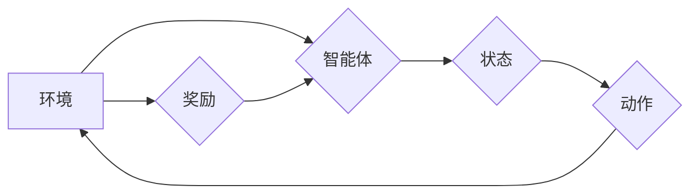

> 强化学习、深度强化学习、Q学习、SARSA、Bellman方程、价值函数、策略梯度、环境、状态、动作、奖励

## 1. 背景介绍

在人工智能领域，强化学习 (Reinforcement Learning, RL) 作为一种重要的机器学习范式，近年来取得了显著进展，并在许多应用场景中展现出强大的潜力。与监督学习和无监督学习不同，强化学习的核心在于让智能体通过与环境的交互学习最优策略，以最大化累积的奖励。

强化学习的灵感来源于动物行为学和心理学，它模拟了动物通过试错学习和奖励机制来获得最佳行为模式的过程。在强化学习中，智能体被视为一个决策者，它会根据当前状态选择动作，并根据环境的反馈获得奖励或惩罚。通过不断地学习和调整策略，智能体最终能够找到最优策略，从而在环境中取得最佳结果。

强化学习的应用领域非常广泛，包括游戏、机器人控制、推荐系统、医疗诊断、金融交易等。例如，AlphaGo通过强化学习战胜了世界围棋冠军，DeepMind的AlphaStar在星际争霸2游戏中取得了职业水平的表现，而强化学习也应用于个性化推荐系统，帮助用户发现更符合其兴趣的内容。

## 2. 核心概念与联系

**核心概念:**

* **环境 (Environment):** 强化学习系统中的外部世界，它提供给智能体状态信息和对动作的反馈。
* **智能体 (Agent):**  学习和决策的实体，它会根据环境的状态选择动作。
* **状态 (State):** 环境的当前描述，它包含了所有与智能体决策相关的关键信息。
* **动作 (Action):** 智能体可以采取的行动，它会改变环境的状态。
* **奖励 (Reward):** 环境对智能体动作的反馈，它可以是正向的（奖励）或负向的（惩罚）。
* **策略 (Policy):** 智能体选择动作的规则，它将状态映射到动作。
* **价值函数 (Value Function):**  评估状态或状态-动作对的期望回报，它帮助智能体选择最优动作。

**Mermaid 流程图:**



**核心联系:**

智能体与环境交互，通过感知环境状态，选择动作并执行，从而获得奖励。智能体通过学习价值函数和策略，不断调整行为策略，以最大化累积的奖励。

## 3. 核心算法原理 & 具体操作步骤

### 3.1  算法原理概述

强化学习算法的核心是学习一个策略，该策略能够指导智能体在环境中采取最优动作，以最大化累积的奖励。常见的强化学习算法包括：

* **Q学习:**  一种基于价值函数的强化学习算法，它学习一个状态-动作价值函数 Q(s, a)，该函数估计在状态 s 下执行动作 a 的期望回报。
* **SARSA:**  与 Q 学习类似，但 SARSA 在更新 Q 函数时使用的是当前策略，而不是最优策略。
* **策略梯度:**  一种基于策略的强化学习算法，它直接优化策略参数，以最大化累积的奖励。

### 3.2  算法步骤详解

**Q 学习算法步骤:**

1. 初始化状态-动作价值函数 Q(s, a) 为 0。
2. 在环境中进行交互，观察状态 s 和获得奖励 r。
3. 选择动作 a，并执行该动作。
4. 观察下一个状态 s'。
5. 更新 Q(s, a) 为：

```
Q(s, a) = Q(s, a) + α [r + γ max_a' Q(s', a') - Q(s, a)]
```

其中：

* α 是学习率，控制着学习速度。
* γ 是折扣因子，控制着未来奖励的权重。
* max_a' Q(s', a') 是下一个状态 s' 下所有动作的价值函数的最大值。

6. 重复步骤 2-5，直到策略收敛。

### 3.3  算法优缺点

**Q 学习算法的优点:**

* 能够学习最优策略。
* 算法相对简单易懂。

**Q 学习算法的缺点:**

* 需要探索环境，可能会导致学习过程较慢。
* 对于高维状态空间，学习难度较大。

### 3.4  算法应用领域

Q 学习算法广泛应用于各种领域，例如：

* **游戏:**  学习游戏策略，例如 AlphaGo。
* **机器人控制:**  学习机器人控制策略，例如移动机器人导航。
* **推荐系统:**  学习用户偏好，推荐个性化内容。

## 4. 数学模型和公式 & 详细讲解 & 举例说明

### 4.1  数学模型构建

强化学习的核心数学模型是价值函数，它评估状态或状态-动作对的期望回报。常见的价值函数包括：

* **状态价值函数 (State-Value Function):**  评估状态 s 的期望累积奖励。

$$
V(s) = E[R_{t+1} + γ R_{t+2} + γ^2 R_{t+3} + ... | S_t = s]
$$

* **状态-动作价值函数 (State-Action Value Function):**  评估在状态 s 下执行动作 a 的期望累积奖励。

$$
Q(s, a) = E[R_{t+1} + γ V(S_{t+1}) | S_t = s, A_t = a]
$$

其中：

* $R_t$ 是时间 t 的奖励。
* $γ$ 是折扣因子，控制着未来奖励的权重。
* $E[]$ 表示期望值。

### 4.2  公式推导过程

Q 学习算法的目标是最大化状态-动作价值函数 Q(s, a)。它使用 Bellman 方程来更新 Q 函数：

$$
Q(s, a) = Q(s, a) + α [r + γ max_{a'} Q(s', a') - Q(s, a)]
$$

其中：

* $α$ 是学习率。
* $r$ 是从状态 s 执行动作 a 得到的奖励。
* $s'$ 是执行动作 a 后到达的状态。
* $max_{a'} Q(s', a')$ 是下一个状态 $s'$ 下所有动作的价值函数的最大值。

### 4.3  案例分析与讲解

假设一个智能体在玩一个简单的游戏，游戏环境有两种状态： "红灯" 和 "绿灯"。智能体可以选择两种动作： "前进" 和 "停止"。

* 当智能体在 "红灯" 状态下执行 "前进" 动作时，会得到 -1 的惩罚。
* 当智能体在 "绿灯" 状态下执行 "前进" 动作时，会得到 1 的奖励。
* 当智能体在任何状态下执行 "停止" 动作时，会得到 0 的奖励。

使用 Q 学习算法，智能体可以学习到在不同状态下执行不同动作的最佳策略。例如，在 "红灯" 状态下，智能体应该选择 "停止" 动作，因为这可以避免惩罚。在 "绿灯" 状态下，智能体应该选择 "前进" 动作，因为这可以获得奖励。

## 5. 项目实践：代码实例和详细解释说明

### 5.1  开发环境搭建

* Python 3.x
* TensorFlow 或 PyTorch

### 5.2  源代码详细实现

```python
import numpy as np

# 定义环境
class Environment:
    def __init__(self):
        self.state = "red"

    def step(self, action):
        if self.state == "red" and action == "stop":
            reward = 0
            self.state = "red"
        elif self.state == "red" and action == "forward":
            reward = -1
            self.state = "red"
        elif self.state == "green" and action == "stop":
            reward = 0
            self.state = "green"
        elif self.state == "green" and action == "forward":
            reward = 1
            self.state = "red"
        return reward, self.state

# 定义 Q 学习算法
class QLearning:
    def __init__(self, learning_rate=0.1, discount_factor=0.9, epsilon=0.1):
        self.learning_rate = learning_rate
        self.discount_factor = discount_factor
        self.epsilon = epsilon
        self.q_table = {}

    def choose_action(self, state):
        if np.random.uniform(0, 1) < self.epsilon:
            return np.random.choice(list(self.q_table[state].keys()))
        else:
            return max(self.q_table[state], key=self.q_table[state].get)

    def update_q_table(self, state, action, reward, next_state):
        if state not in self.q_table:
            self.q_table[state] = {}
        if next_state not in self.q_table:
            self.q_table[next_state] = {}
        self.q_table[state][action] = self.q_table[state].get(action, 0) + self.learning_rate * (
            reward + self.discount_factor * max(self.q_table[next_state].values()) - self.q_table[state][action]
        )

# 创建环境和 Q 学习算法实例
env = Environment()
agent = QLearning()

# 训练 Q 学习算法
for episode in range(1000):
    state = env.state
    while state != "red":
        action = agent.choose_action(state)
        reward, next_state = env.step(action)
        agent.update_q_table(state, action, reward, next_state)
        state = next_state

# 打印 Q 表
print(agent.q_table)
```

### 5.3  代码解读与分析

* **环境类 (Environment):** 定义了游戏环境，包括状态、动作、奖励等。
* **Q 学习类 (QLearning):** 实现 Q 学习算法，包括初始化 Q 表、选择动作、更新 Q 表等方法。
* **训练循环:** 训练 Q 学习算法，通过与环境交互，更新 Q 表，最终学习到最优策略。

### 5.4  运行结果展示

运行代码后，会输出 Q 表，其中包含了在不同状态下执行不同动作的价值函数。

## 6. 实际应用场景

### 6.1  游戏

* **AlphaGo:**  DeepMind 使用强化学习算法训练 AlphaGo，使其能够战胜世界围棋冠军。
* **Dota 2:**  OpenAI 使用强化学习算法训练 Dota 2 比赛机器人，使其能够达到职业水平。

### 6.2  机器人控制

* **移动机器人导航:**  强化学习算法可以帮助机器人学习在复杂环境中导航。
* **机器人抓取:**  强化学习算法可以帮助机器人学习抓取不同形状和大小的物体。

### 6.3  推荐系统

* **个性化推荐:**  强化学习算法可以学习用户的偏好，并推荐个性化的内容。
* **广告推荐:**  强化学习算法可以帮助广告平台优化广告投放，提高广告效果。

### 6.4  未来应用展望

强化学习在未来将有更广泛的应用，例如：

* **自动驾驶:**  强化学习可以帮助自动驾驶汽车学习驾驶技能。
* **医疗诊断:**  强化学习可以帮助医生诊断疾病。
* **金融交易:**  强化学习可以帮助交易系统做出更优的交易决策。

## 7. 工具和资源推荐

### 7.1  学习资源推荐

* **书籍:**
    * Reinforcement Learning: An Introduction by Richard S. Sutton and Andrew G. Barto
    * Deep Reinforcement Learning Hands-On by Maxim Lapan
