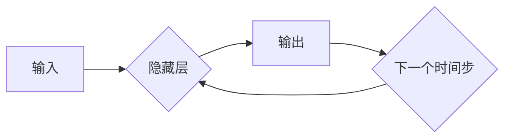

> 循环神经网络(RNN)、长短期记忆网络(LSTM)、反向传播算法(Backpropagation)、自然语言处理(NLP)、时间序列预测

## 1. 背景介绍

循环神经网络(RNN) 是一种专门设计用于处理序列数据的深度学习模型。与传统的多层感知机(MLP) 不同，RNN 具有记忆机制，能够捕捉序列中时间步之间的依赖关系。这使得 RNN 在许多自然语言处理(NLP) 任务，如机器翻译、文本生成和情感分析，以及时间序列预测等领域表现出色。

随着深度学习的蓬勃发展，RNN 的变体，如长短期记忆网络(LSTM) 和门控循环单元(GRU)，被提出并取得了显著的成果。这些改进型 RNN 能够更好地处理长序列数据，并克服了传统 RNN 的梯度消失问题。

## 2. 核心概念与联系

**2.1 RNN 的基本结构**

RNN 的核心结构是一个循环单元，它包含一个隐藏层和一个输出层。隐藏层接收当前输入和上一时刻隐藏层的输出作为输入，并输出新的隐藏层状态。输出层则根据当前隐藏层状态生成输出。

**2.2 RNN 的工作原理**

RNN 的工作原理可以理解为一个时间步的迭代过程。在每个时间步，RNN 会接收一个输入，并根据当前输入和上一时刻隐藏层状态计算新的隐藏层状态和输出。

**2.3 RNN 的优势**

* 能够处理序列数据，捕捉时间步之间的依赖关系。
* 具有记忆机制，可以记住过去的输入信息。

**2.4 RNN 的局限性**

* 难以处理长序列数据，容易出现梯度消失问题。
* 训练过程相对复杂，需要更多的计算资源。

**2.5 Mermaid 流程图**



## 3. 核心算法原理 & 具体操作步骤

**3.1 算法原理概述**

RNN 的核心算法是反向传播算法(Backpropagation)。反向传播算法通过计算误差梯度，更新网络参数，从而使网络模型的预测结果越来越准确。

**3.2 算法步骤详解**

1. **前向传播:** 将输入序列逐个输入到 RNN 中，计算每个时间步的隐藏层状态和输出。
2. **误差计算:** 将 RNN 的输出与真实标签进行比较，计算误差。
3. **反向传播:** 将误差沿着网络反向传播，计算每个参数的梯度。
4. **参数更新:** 使用梯度下降算法更新网络参数，减小误差。

**3.3 算法优缺点**

**优点:**

* 能够有效地训练 RNN 模型。
* 广泛应用于各种深度学习任务。

**缺点:**

* 训练过程复杂，需要大量的计算资源。
* 难以处理长序列数据，容易出现梯度消失问题。

**3.4 算法应用领域**

* 自然语言处理 (NLP)：机器翻译、文本生成、情感分析、问答系统等。
* 时间序列预测：股票价格预测、天气预报、用户行为预测等。
* 语音识别：语音转文本、语音助手等。

## 4. 数学模型和公式 & 详细讲解 & 举例说明

**4.1 数学模型构建**

RNN 的数学模型可以表示为以下公式：

$$h_t = f(W_{hh}h_{t-1} + W_{xh}x_t + b_h)$$

$$y_t = g(W_{hy}h_t + b_y)$$

其中：

* $h_t$ 是时间步 $t$ 的隐藏层状态。
* $x_t$ 是时间步 $t$ 的输入。
* $y_t$ 是时间步 $t$ 的输出。
* $W_{hh}$、$W_{xh}$、$W_{hy}$ 是权重矩阵。
* $b_h$、$b_y$ 是偏置项。
* $f$ 和 $g$ 是激活函数。

**4.2 公式推导过程**

RNN 的公式推导过程涉及到矩阵运算和微积分。

**4.3 案例分析与讲解**

假设我们有一个简单的 RNN 模型，用于预测下一个单词。输入序列为 "The cat sat on the"，目标是预测下一个单词 "mat"。

在训练过程中，RNN 会学习到每个单词的隐藏层状态和输出。最终，RNN 会将 "the" 作为最后一个输入，并预测下一个单词为 "mat"。

## 5. 项目实践：代码实例和详细解释说明

**5.1 开发环境搭建**

* Python 3.6+
* TensorFlow 或 PyTorch

**5.2 源代码详细实现**

```python
import tensorflow as tf

# 定义 RNN 模型
model = tf.keras.Sequential([
    tf.keras.layers.Embedding(input_dim=vocab_size, output_dim=embedding_dim),
    tf.keras.layers.LSTM(units=128),
    tf.keras.layers.Dense(units=vocab_size, activation='softmax')
])

# 编译模型
model.compile(optimizer='adam', loss='sparse_categorical_crossentropy', metrics=['accuracy'])

# 训练模型
model.fit(x_train, y_train, epochs=10)

# 预测结果
predictions = model.predict(x_test)
```

**5.3 代码解读与分析**

* `Embedding` 层将单词转换为稠密的向量表示。
* `LSTM` 层是 RNN 的核心组件，用于捕捉序列数据中的依赖关系。
* `Dense` 层是一个全连接层，用于将隐藏层状态映射到输出层。
* `adam` 是一个常用的优化器，用于更新网络参数。
* `sparse_categorical_crossentropy` 是一个用于分类任务的损失函数。

**5.4 运行结果展示**

训练完成后，可以将模型应用于新的文本数据，并预测下一个单词。

## 6. 实际应用场景

**6.1 自然语言处理 (NLP)**

* **机器翻译:** RNN 可以用于将一种语言翻译成另一种语言。
* **文本生成:** RNN 可以用于生成文本，例如诗歌、小说、新闻报道等。
* **情感分析:** RNN 可以用于分析文本的情感，例如判断文本是积极的、消极的还是中性的。
* **问答系统:** RNN 可以用于构建问答系统，能够理解用户的问题并给出相应的答案。

**6.2 时间序列预测**

* **股票价格预测:** RNN 可以用于预测股票价格的未来走势。
* **天气预报:** RNN 可以用于预测未来几天的天气情况。
* **用户行为预测:** RNN 可以用于预测用户的行为，例如购买商品、点击广告等。

**6.3 其他应用场景**

* **语音识别:** RNN 可以用于将语音转为文本。
* **音乐生成:** RNN 可以用于生成音乐。
* **图像识别:** RNN 可以用于识别图像中的物体。

**6.4 未来应用展望**

随着深度学习技术的不断发展，RNN 的应用场景将会更加广泛。例如，RNN 可以用于构建更智能的聊天机器人、更精准的医疗诊断系统、更安全的金融交易系统等。

## 7. 工具和资源推荐

**7.1 学习资源推荐**

* **书籍:**
    * 《深度学习》 by Ian Goodfellow, Yoshua Bengio, and Aaron Courville
    * 《自然语言处理入门》 by Jacob Eisenstein
* **在线课程:**
    * Coursera: Deep Learning Specialization
    * Udacity: Deep Learning Nanodegree
* **博客:**
    * Jay Alammar's Blog: https://jalammar.github.io/
    * Towards Data Science: https://towardsdatascience.com/

**7.2 开发工具推荐**

* **TensorFlow:** https://www.tensorflow.org/
* **PyTorch:** https://pytorch.org/
* **Keras:** https://keras.io/

**7.3 相关论文推荐**

* **Long Short-Term Memory** by Sepp Hochreiter and Jürgen Schmidhuber (1997)
* **Gated Recurrent Unit** by Kyunghyun Cho et al. (2014)

## 8. 总结：未来发展趋势与挑战

**8.1 研究成果总结**

RNN 在自然语言处理和时间序列预测等领域取得了显著的成果。LSTM 和 GRU 等改进型 RNN 能够更好地处理长序列数据，并克服了传统 RNN 的梯度消失问题。

**8.2 未来发展趋势**

* **更强大的 RNN 模型:** 研究人员将继续探索新的 RNN 模型结构，以提高模型的性能和效率。
* **更有效的训练方法:** 研究人员将继续研究新的训练方法，以更快、更有效地训练 RNN 模型。
* **更广泛的应用场景:** RNN 将被应用于更多新的领域，例如医疗、金融、教育等。

**8.3 面临的挑战**

* **梯度消失问题:** RNN 仍然难以处理非常长的序列数据，因为梯度会随着时间步的增加而衰减。
* **计算资源需求:** 训练大型 RNN 模型需要大量的计算资源。
* **可解释性:** RNN 的决策过程难以解释，这使得其在一些应用场景中难以被接受。

**8.4 研究展望**

未来，RNN 研究将继续朝着更强大、更有效、更可解释的方向发展。


## 9. 附录：常见问题与解答

**9.1 什么是梯度消失问题？**

梯度消失问题是指在训练 RNN 模型时，随着时间步的增加，梯度会逐渐减小，最终导致模型无法学习到长序列数据中的依赖关系。

**9.2 如何解决梯度消失问题？**

一些方法可以用来解决梯度消失问题，例如：

* 使用 LSTM 或 GRU 等改进型 RNN。
* 使用残差连接。
* 使用梯度裁剪。

**9.3 RNN 的应用场景有哪些？**

RNN 的应用场景非常广泛，包括：

* 自然语言处理 (NLP)
* 时间序列预测
* 语音识别
* 音乐生成
* 图像识别

作者：禅与计算机程序设计艺术 / Zen and the Art of Computer Programming


<end_of_turn>