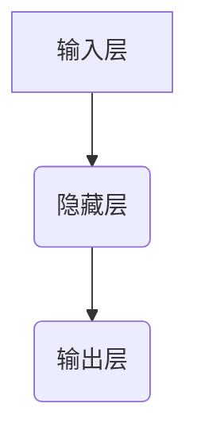

> 深度学习，神经网络，卷积神经网络，循环神经网络，自然语言处理，计算机视觉，人工智能

## 1. 背景介绍

人工智能（AI）正以惊人的速度发展，深刻地改变着我们生活的方方面面。从自动驾驶汽车到智能语音助手，从医疗诊断到金融预测，AI技术的应用日益广泛。在这个快速发展的时代，深入理解人工智能的核心概念和原理显得尤为重要。

深度学习作为人工智能领域最前沿的技术之一，凭借其强大的学习能力和泛化能力，在图像识别、语音识别、自然语言处理等领域取得了突破性的进展。然而，深度学习的原理和算法却往往被 shrouded in mystery，让许多人望而却步。

本书旨在为读者提供一个清晰、深入的理解深度学习的指南。我们将从概念的层面出发，逐步揭示深度学习的奥秘，并通过具体的算法原理、代码实例和应用场景，帮助读者掌握深度学习的精髓。

## 2. 核心概念与联系

深度学习的核心概念是**人工神经网络（ANN）**。ANN 是一种模仿人脑神经网络结构的计算模型。它由大量的**神经元**组成，这些神经元相互连接，并通过**权重**来传递信息。

**人工神经网络的结构**



**核心概念联系**

* **输入层:**接收原始数据，例如图像像素值、文本单词等。
* **隐藏层:**对输入数据进行处理和转换，提取特征和模式。
* **输出层:**输出最终结果，例如图像分类标签、文本翻译结果等。
* **权重:**连接神经元之间的参数，决定信息传递的强度。

深度学习的关键在于**深度**。深度神经网络拥有多层隐藏层，能够学习更复杂的特征表示。

**深度学习的优势:**

* **强大的学习能力:**深度神经网络能够从海量数据中自动学习特征，无需人工特征工程。
* **良好的泛化能力:**深度神经网络能够将学习到的知识应用于新的、未见过的数据。
* **可解释性:**随着深度学习研究的深入，我们对深度神经网络的内部机制的理解也在不断提高，可解释性也在逐步增强。

## 3. 核心算法原理 & 具体操作步骤

### 3.1  算法原理概述

深度学习的核心算法是**反向传播算法（Backpropagation）**。反向传播算法用于训练深度神经网络，通过调整神经元的权重，使网络的输出与实际目标值之间的误差最小化。

反向传播算法的基本步骤如下：

1. **前向传播:**将输入数据通过神经网络传递，得到输出结果。
2. **计算误差:**比较输出结果与实际目标值之间的误差。
3. **反向传播:**根据误差，反向计算每个神经元的梯度。
4. **更新权重:**使用梯度下降算法，更新神经元的权重，使误差最小化。

### 3.2  算法步骤详解

1. **初始化权重:**随机初始化神经网络的权重。
2. **前向传播:**将输入数据输入到神经网络的第一层，并通过激活函数进行处理。然后将处理后的结果传递到下一层，依此类推，直到输出层。
3. **计算损失函数:**比较输出结果与实际目标值之间的误差，使用损失函数来量化误差。
4. **反向传播:**计算每个神经元的梯度，即权重变化的方向和幅度。
5. **更新权重:**使用梯度下降算法，更新神经元的权重，使损失函数最小化。
6. **重复步骤2-5:**重复上述步骤，直到损失函数收敛，即误差达到预设的阈值。

### 3.3  算法优缺点

**优点:**

* **高效:**反向传播算法能够有效地训练深度神经网络。
* **通用:**反向传播算法可以应用于各种类型的深度神经网络。

**缺点:**

* **梯度消失/爆炸问题:**在训练深层网络时，梯度可能会消失或爆炸，导致训练不稳定。
* **局部最优解:**反向传播算法可能会陷入局部最优解，无法找到全局最优解。

### 3.4  算法应用领域

反向传播算法广泛应用于各种深度学习领域，例如：

* **图像识别:**识别物体、场景、人脸等。
* **语音识别:**将语音转换为文本。
* **自然语言处理:**机器翻译、文本摘要、情感分析等。
* **推荐系统:**根据用户的历史行为推荐商品或内容。

## 4. 数学模型和公式 & 详细讲解 & 举例说明

### 4.1  数学模型构建

深度学习的数学模型主要基于线性代数、微积分和概率论。

**线性代数:**用于表示和操作神经网络的权重、激活函数和输出结果。

**微积分:**用于计算梯度，更新权重。

**概率论:**用于处理不确定性，例如在神经网络的输出层使用softmax函数进行概率分布。

### 4.2  公式推导过程

**激活函数:**

激活函数用于引入非线性，使神经网络能够学习复杂的模式。常见的激活函数包括sigmoid函数、ReLU函数、tanh函数等。

**sigmoid函数:**

$$
f(x) = \frac{1}{1 + e^{-x}}
$$

**ReLU函数:**

$$
f(x) = max(0, x)
$$

**损失函数:**

损失函数用于衡量模型的预测结果与实际目标值之间的误差。常见的损失函数包括均方误差（MSE）、交叉熵损失等。

**均方误差:**

$$
L = \frac{1}{n} \sum_{i=1}^{n} (y_i - \hat{y}_i)^2
$$

**交叉熵损失:**

$$
L = -\sum_{i=1}^{n} y_i \log(\hat{y}_i)
$$

### 4.3  案例分析与讲解

**图像分类:**

假设我们有一个图像分类任务，目标是将图像分类为猫、狗或鸟。我们可以使用卷积神经网络（CNN）来解决这个问题。

CNN 是一种专门用于处理图像数据的深度神经网络。它利用卷积层和池化层来提取图像特征。

**卷积层:**

卷积层使用卷积核对图像进行卷积运算，提取图像局部特征。

**池化层:**

池化层对卷积层的输出进行降维，减少计算量并提高鲁棒性。

## 5. 项目实践：代码实例和详细解释说明

### 5.1  开发环境搭建

* **操作系统:** Linux、macOS 或 Windows
* **编程语言:** Python
* **深度学习框架:** TensorFlow、PyTorch 或 Keras

### 5.2  源代码详细实现

```python
import tensorflow as tf

# 定义模型
model = tf.keras.models.Sequential([
    tf.keras.layers.Conv2D(32, (3, 3), activation='relu', input_shape=(28, 28, 1)),
    tf.keras.layers.MaxPooling2D((2, 2)),
    tf.keras.layers.Conv2D(64, (3, 3), activation='relu'),
    tf.keras.layers.MaxPooling2D((2, 2)),
    tf.keras.layers.Flatten(),
    tf.keras.layers.Dense(10, activation='softmax')
])

# 编译模型
model.compile(optimizer='adam',
              loss='sparse_categorical_crossentropy',
              metrics=['accuracy'])

# 训练模型
model.fit(x_train, y_train, epochs=5)

# 评估模型
loss, accuracy = model.evaluate(x_test, y_test)
print('Test loss:', loss)
print('Test accuracy:', accuracy)
```

### 5.3  代码解读与分析

* **定义模型:** 使用 TensorFlow 的 Keras API 定义一个卷积神经网络模型。
* **编译模型:** 使用 Adam 优化器、交叉熵损失函数和准确率指标编译模型。
* **训练模型:** 使用训练数据训练模型，设置训练轮数为 5。
* **评估模型:** 使用测试数据评估模型的性能，打印测试损失和准确率。

### 5.4  运行结果展示

训练完成后，模型将输出测试损失和准确率。

## 6. 实际应用场景

### 6.1  图像识别

* **人脸识别:** 用于解锁手机、验证身份。
* **物体检测:** 用于自动驾驶汽车、安防监控。
* **医学图像分析:** 用于诊断疾病、辅助手术。

### 6.2  语音识别

* **语音助手:** 例如 Siri、Alexa、Google Assistant。
* **语音翻译:** 将语音转换为不同语言的文本。
* **语音转文字:** 用于会议记录、听力训练。

### 6.3  自然语言处理

* **机器翻译:** 将文本从一种语言翻译成另一种语言。
* **文本摘要:** 自动生成文本的简短摘要。
* **情感分析:** 分析文本的情感倾向，例如正面、负面或中性。

### 6.4  未来应用展望

深度学习的应用前景广阔，未来将应用于更多领域，例如：

* **个性化推荐:** 根据用户的兴趣和行为推荐个性化的商品或内容。
* **自动写作:** 自动生成新闻报道、小说、诗歌等文本。
* **药物研发:** 利用深度学习加速药物研发过程。

## 7. 工具和资源推荐

### 7.1  学习资源推荐

* **书籍:**
    * 深度学习 (Deep Learning) - Ian Goodfellow, Yoshua Bengio, Aaron Courville
    * 深度学习实践 (Deep Learning with Python) - Francois Chollet
* **在线课程:**
    * Coursera: 深度学习 Specialization
    * Udacity: 深度学习 Nanodegree
    * fast.ai: 深度学习课程

### 7.2  开发工具推荐

* **TensorFlow:** Google 开发的开源深度学习框架。
* **PyTorch:** Facebook 开发的开源深度学习框架。
* **Keras:** TensorFlow 上的深度学习 API，易于使用。

### 7.3  相关论文推荐

* **ImageNet Classification with Deep Convolutional Neural Networks** - Alex Krizhevsky, Ilya Sutskever, Geoffrey E. Hinton
* **Sequence to Sequence Learning with Neural Networks** - Ilya Sutskever, Oriol Vinyals, Quoc V. Le
* **Attention Is All You Need** - Ashish Vaswani, Noam Shazeer, Niki Parmar, Jakob Uszkoreit, Llion Jones, Aidan N. Gomez, Łukasz Kaiser, Illia Polosukhin

## 8. 总结：未来发展趋势与挑战

### 8.1  研究成果总结

深度学习取得了令人瞩目的成就，在图像识别、语音识别、自然语言处理等领域取得了突破性的进展。

### 8.2  未来发展趋势

* **模型规模和复杂度:** 深度学习模型将继续朝着更大、更复杂的方向发展。
* **数据效率:** 研究更有效的训练方法，减少对大量数据的依赖。
* **可解释性:** 提高深度学习模型的可解释性，帮助人们理解模型的决策过程。
* **安全性和鲁棒性:** 研究提高深度学习模型的安全性和鲁棒性，防止模型受到攻击或误用。

### 8.3  面临的挑战

* **计算资源:** 训练大型深度学习模型需要大量的计算资源。
* **数据获取和标注:** 获取高质量的训练数据并进行标注是一项耗时和费力的工作。
* **伦理问题:** 深度学习的应用可能带来一些伦理问题，例如隐私泄露、算法偏见等。

### 8.4  研究展望

未来，深度学习研究将继续朝着更智能、更安全、更可解释的方向发展，为人类社会带来更多福祉。

## 9. 附录：常见问题与解答

**Q1: 什么是深度学习？**

A1: 深度学习是一种机器学习的子领域，它使用多层神经网络来学习数据特征。

**