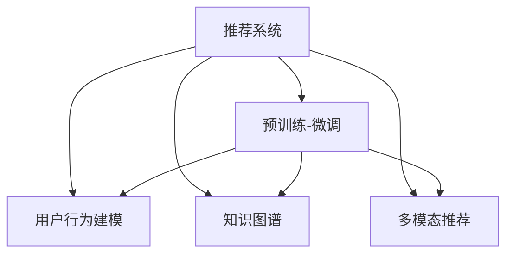

                 

# 利用大模型提升推荐系统的跨领域迁移能力

> 关键词：跨领域迁移学习, 大模型, 推荐系统, 预训练-微调, 用户行为建模, 知识图谱

## 1. 背景介绍

推荐系统（Recommender System）在电商、社交、视频流媒体等众多领域广泛应用，是提升用户体验和增加商业价值的重要技术手段。随着数据量的爆炸式增长，推荐系统逐渐从单一商品或内容推荐向跨领域、多模态推荐方向发展。但同时，不同领域的数据特性差异大、特征维度高，单一模型难以满足多场景需求。

近年来，大模型通过大规模预训练和跨领域微调，具备了丰富的知识表示能力，为推荐系统的跨领域迁移提供了新思路。但如何将大模型高效融入推荐系统中，提升跨领域推荐效果，仍是一个挑战。本文旨在介绍如何利用大模型提升推荐系统的跨领域迁移能力，并结合实际案例给出解决方案。

## 2. 核心概念与联系

### 2.1 核心概念概述

为更好地理解大模型在推荐系统中的应用，本节将介绍几个密切相关的核心概念：

- 推荐系统（Recommender System）：根据用户的历史行为数据，推荐感兴趣的物品或内容。推荐系统包括基于协同过滤、基于内容推荐、混合推荐等不同类型，并广泛应用于电商、社交、视频流媒体等领域。

- 预训练-微调（Pre-training and Fine-tuning）：指在无标签数据上进行大规模预训练，通过微调在有标签数据上进行任务特定优化的过程。大模型通过预训练获得广泛的语义知识，通过微调适配特定领域需求，实现跨领域迁移。

- 跨领域迁移（Cross-domain Transfer）：指模型在多个领域之间进行知识迁移，提升模型在新的领域或任务上的性能。大模型的预训练-微调过程就是典型跨领域迁移范式。

- 用户行为建模（User Behavior Modeling）：指从用户行为数据中挖掘出用户兴趣、偏好等信息，构建用户行为模型，用于推荐系统决策。

- 知识图谱（Knowledge Graph）：用于表示实体及实体间关系的数据结构，帮助模型理解世界知识和事物之间的关联。

- 多模态推荐（Multi-modal Recommender）：结合图像、文本、语音等不同模态数据，提升推荐系统的效果。

这些核心概念之间的逻辑关系可以通过以下Mermaid流程图来展示：



这个流程图展示了大语言模型在推荐系统中的应用逻辑：

1. 推荐系统通过预训练-微调获得跨领域的知识表示。
2. 结合用户行为建模、知识图谱、多模态推荐等技术，进行推荐决策。

## 3. 核心算法原理 & 具体操作步骤

### 3.1 算法原理概述

利用大模型提升推荐系统的跨领域迁移能力，主要分为以下几个步骤：

1. **预训练-微调**：通过大规模无标签数据预训练大模型，获取通用的语言知识表示，再通过跨领域微调，学习特定领域知识，提升模型跨领域泛化能力。
2. **用户行为建模**：从用户的历史行为数据中，提取用户兴趣、偏好等信息，构建用户行为模型。
3. **知识图谱嵌入**：将知识图谱中的实体关系嵌入模型中，帮助模型理解世界知识和事物关联。
4. **多模态融合**：结合文本、图像、语音等不同模态数据，提升推荐系统的效果。

### 3.2 算法步骤详解

以下是详细的算法步骤：

**Step 1: 准备数据集和预训练模型**

1. 收集不同领域的文本数据、图片数据、行为数据等，构建多模态数据集。
2. 选择合适的预训练大模型，如GPT、BERT、Transformer等，作为初始化参数。

**Step 2: 预训练和微调**

1. 在大规模无标签文本数据上进行预训练，获取通用的语言知识表示。
2. 在特定领域的标注数据上，通过微调优化模型，学习特定领域知识。
3. 使用多任务学习（Multi-task Learning）框架，同时学习多个任务，提升模型的泛化能力。

**Step 3: 用户行为建模**

1. 收集用户的历史行为数据，如浏览、点击、评分等。
2. 使用嵌入（Embedding）技术，将用户行为数据转化为向量表示，用于模型训练。
3. 结合用户画像、兴趣标签等信息，对用户行为向量进行增量更新。

**Step 4: 知识图谱嵌入**

1. 收集知识图谱数据，提取实体关系，构建图结构。
2. 使用Graph Neural Network（GNN）等方法，将知识图谱中的信息嵌入模型中，辅助推荐决策。
3. 在微调过程中，利用知识图谱信息，优化模型对实体关系的理解。

**Step 5: 多模态融合**

1. 收集不同模态的数据，如文本、图像、语音等。
2. 对各模态数据进行预处理，并使用多模态融合技术，将不同模态信息融合到模型中。
3. 使用自注意力（Self-attention）等机制，对不同模态数据进行加权融合，生成综合推荐结果。

**Step 6: 推荐结果生成**

1. 使用上述模型和数据，生成推荐结果。
2. 结合排序算法，对推荐结果进行排序，生成最终推荐列表。
3. 对推荐结果进行评估和反馈，优化模型参数。

### 3.3 算法优缺点

利用大模型提升推荐系统的跨领域迁移能力，具有以下优点：

1. **泛化能力更强**：大模型通过预训练获得通用的语言知识，通过微调学习特定领域知识，具备更强的跨领域泛化能力。
2. **数据利用率更高**：跨领域微调可以充分利用不同领域的数据，提升推荐系统的数据利用率。
3. **模型性能更好**：结合用户行为建模、知识图谱嵌入、多模态融合等技术，可以提升推荐系统的精度和效果。
4. **灵活性更高**：大模型可以根据需求灵活添加或修改，具有更高的灵活性。

同时，也存在一些缺点：

1. **资源消耗大**：预训练和微调过程需要大量计算资源和时间，资源消耗较大。
2. **可解释性不足**：大模型的决策过程难以解释，缺乏透明性。
3. **冷启动问题**：新用户或新商品的数据不足，模型可能难以产生高质量推荐。
4. **公平性问题**：大模型的推荐结果可能存在偏见，导致推荐不公平。

## 4. 数学模型和公式 & 详细讲解  
### 4.1 数学模型构建

假设推荐系统收集到的用户行为数据为 $x_i$，知识图谱中的实体关系为 $e_{i,j}$，文本数据为 $t_i$。预训练和微调后的大模型为 $M$，用户行为模型为 $U$，知识图谱嵌入模型为 $K$，多模态融合模型为 $H$。

用户行为模型 $U$ 可以将用户行为数据转化为向量表示，其输出为 $u_i$。知识图谱嵌入模型 $K$ 可以将知识图谱中的实体关系嵌入模型中，其输出为 $k_i$。多模态融合模型 $H$ 将不同模态数据融合到模型中，其输出为 $h_i$。

最终推荐结果由大模型 $M$ 通过预训练和微调后得到，其输出为 $m_i$。推荐结果通过 $m_i$ 进行排序，生成最终推荐列表。

### 4.2 公式推导过程

预训练和微调过程主要通过优化损失函数来实现。假设预训练损失为 $L_{pre}$，微调损失为 $L_{fin}$，总损失为 $L$。则预训练和微调的总损失函数为：

$$
L = L_{pre} + \lambda L_{fin}
$$

其中 $\lambda$ 为预训练损失和微调损失的权重。

用户行为模型的损失函数可以表示为：

$$
L_U = \frac{1}{N}\sum_{i=1}^N ||u_i - u'_i||^2
$$

其中 $u'_i$ 为真实用户行为向量的标签，$u_i$ 为用户行为模型输出的向量表示。

知识图谱嵌入模型的损失函数可以表示为：

$$
L_K = \frac{1}{N}\sum_{i=1}^N \sum_{j=1}^N ||k_{i,j} - k'_{i,j}||^2
$$

其中 $k'_{i,j}$ 为知识图谱中实体关系的真实标签，$k_{i,j}$ 为知识图谱嵌入模型输出的向量表示。

多模态融合模型的损失函数可以表示为：

$$
L_H = \frac{1}{N}\sum_{i=1}^N ||h_i - h'_i||^2
$$

其中 $h'_i$ 为真实多模态数据的标签，$h_i$ 为多模态融合模型输出的向量表示。

最终，总损失函数可以表示为：

$$
L = L_{pre} + \lambda L_U + \lambda L_K + \lambda L_H + \lambda L_{fin}
$$

### 4.3 案例分析与讲解

以下是一个简单的例子：假设推荐系统需要从文本数据中推荐新闻文章，同时结合用户历史浏览记录和知识图谱中作者与文章的关联信息，生成推荐列表。

1. **预训练和微调**：使用BERT等预训练模型，在大规模文本数据上进行预训练，学习通用语言知识。再在大规模新闻文章数据集上进行微调，学习特定领域知识。
2. **用户行为建模**：收集用户的历史浏览记录，使用Embedding技术将浏览记录转化为向量表示，并结合用户画像、兴趣标签等信息，对用户行为向量进行增量更新。
3. **知识图谱嵌入**：收集知识图谱数据，提取作者与文章的关联关系，使用Graph Neural Network将知识图谱信息嵌入模型中，辅助推荐决策。
4. **多模态融合**：收集用户行为数据和知识图谱信息，使用自注意力机制将不同模态数据融合到模型中，生成综合推荐结果。

## 5. 项目实践：代码实例和详细解释说明

### 5.1 开发环境搭建

在进行项目实践前，我们需要准备好开发环境。以下是使用Python进行TensorFlow开发的环境配置流程：

1. 安装Anaconda：从官网下载并安装Anaconda，用于创建独立的Python环境。

2. 创建并激活虚拟环境：
```bash
conda create -n tf-env python=3.8 
conda activate tf-env
```

3. 安装TensorFlow：从官网获取对应的安装命令。例如：
```bash
conda install tensorflow
```

4. 安装各类工具包：
```bash
pip install numpy pandas scikit-learn matplotlib tqdm jupyter notebook ipython
```

完成上述步骤后，即可在`tf-env`环境中开始项目实践。

### 5.2 源代码详细实现

我们以推荐系统为例，给出使用TensorFlow进行大模型微调的PyTorch代码实现。

首先，定义推荐系统相关的类和函数：

```python
import tensorflow as tf
from tensorflow.keras.layers import Input, Embedding, Dense, Dropout
from tensorflow.keras.models import Model
from tensorflow.keras.optimizers import Adam

class UserBehaviorModel(tf.keras.Model):
    def __init__(self, embedding_dim=128, num_users=1000, num_items=1000):
        super(UserBehaviorModel, self).__init__()
        self.user_embedding = Embedding(num_users, embedding_dim, input_length=1)
        self.item_embedding = Embedding(num_items, embedding_dim, input_length=1)
        self.interaction = tf.keras.layers.Dot(dots='last', normalize=True, axes=(1, 1))
        self.dense = Dense(1, activation='sigmoid')
        
    def call(self, x):
        user_vector = self.user_embedding(x[:, 0])
        item_vector = self.item_embedding(x[:, 1])
        interaction = self.interaction([user_vector, item_vector])
        return self.dense(interaction)

class KnowledgeGraphEmbedding(tf.keras.Model):
    def __init__(self, num_entities=1000, num_relations=10):
        super(KnowledgeGraphEmbedding, self).__init__()
        self.entity_embedding = Embedding(num_entities, 64, input_length=1)
        self.relation_embedding = Embedding(num_relations, 64, input_length=1)
        self.interaction = tf.keras.layers.Dot(dots='last', normalize=True, axes=(1, 1))
        self.dense = Dense(1, activation='sigmoid')
        
    def call(self, x):
        entity_vector = self.entity_embedding(x[:, 0])
        relation_vector = self.relation_embedding(x[:, 1])
        interaction = self.interaction([entity_vector, relation_vector])
        return self.dense(interaction)

class MultiModalModel(tf.keras.Model):
    def __init__(self, embedding_dim=128):
        super(MultiModalModel, self).__init__()
        self.text_embedding = Embedding(input_dim=10000, output_dim=embedding_dim, input_length=1)
        self.image_embedding = Input(shape=(128,), name='image')
        self.feature_vector = tf.keras.layers.LSTM(64, return_sequences=True)
        self.concatenate = tf.keras.layers.Concatenate()
        self.interaction = tf.keras.layers.Dot(dots='last', normalize=True, axes=(1, 1))
        self.dense = Dense(1, activation='sigmoid')
        
    def call(self, x):
        text_vector = self.text_embedding(x[:, 0])
        image_vector = self.image_embedding(x[:, 1])
        features = self.feature_vector(image_vector)
        concatenated = self.concatenate([text_vector, features])
        interaction = self.interaction([concatenated, image_vector])
        return self.dense(interaction)

class RecommendationModel(tf.keras.Model):
    def __init__(self, user_model, knowledge_model, multi_modal_model):
        super(RecommendationModel, self).__init__()
        self.user_model = user_model
        self.knowledge_model = knowledge_model
        self.multi_modal_model = multi_modal_model
        self.dense = Dense(1, activation='sigmoid')
        
    def call(self, x):
        user_vector = self.user_model(x[:, 0])
        knowledge_vector = self.knowledge_model(x[:, 1])
        multi_modal_vector = self.multi_modal_model(x[:, 2])
        concatenated = tf.concat([user_vector, knowledge_vector, multi_modal_vector], axis=-1)
        return self.dense(concatenated)

# 定义模型参数
num_users = 10000
num_items = 10000
embedding_dim = 128
num_entities = 1000
num_relations = 10
num_texts = 10000
embedding_dim_text = 100
num_images = 100
embedding_dim_image = 128

# 初始化模型
user_model = UserBehaviorModel(embedding_dim=embedding_dim, num_users=num_users, num_items=num_items)
knowledge_model = KnowledgeGraphEmbedding(num_entities=num_entities, num_relations=num_relations)
multi_modal_model = MultiModalModel(embedding_dim=embedding_dim)
recommendation_model = RecommendationModel(user_model, knowledge_model, multi_modal_model)

# 定义损失函数和优化器
loss_fn = tf.keras.losses.BinaryCrossentropy(from_logits=True)
optimizer = Adam(learning_rate=0.001)
```

接下来，定义数据加载函数和训练函数：

```python
import numpy as np
from tensorflow.keras.preprocessing.text import Tokenizer
from tensorflow.keras.preprocessing.sequence import pad_sequences
from tensorflow.keras.preprocessing.image import load_img, img_to_array

def load_data(text_file, image_file):
    # 读取文本和图像数据
    with open(text_file, 'r') as f:
        texts = f.readlines()
    images = []
    for i in range(len(texts)):
        image = load_img(image_file + str(i) + '.png')
        image = img_to_array(image)
        images.append(image)
    texts = [text.split('\t')[1] for text in texts]
    return texts, images

def pad_sequences(texts):
    max_len = 100
    return pad_sequences([Tokenizer().sequence_to_matrix(text, maxlen=max_len) for text in texts], padding='post', truncating='post')

def train_epoch(model, train_data, validation_data):
    dataloader = tf.data.Dataset.from_tensor_slices(train_data)
    dataloader = dataloader.shuffle(10000).batch(32)
    train_loss = 0.0
    val_loss = 0.0
    for batch in dataloader:
        with tf.GradientTape() as tape:
            features = model(batch[0])
            labels = batch[1]
            loss = loss_fn(features, labels)
        grads = tape.gradient(loss, model.trainable_variables)
        optimizer.apply_gradients(zip(grads, model.trainable_variables))
        train_loss += loss
        val_loss += loss
    return train_loss / len(dataloader), val_loss / len(dataloader)

def train(model, train_data, validation_data, epochs=10, batch_size=32):
    for epoch in range(epochs):
        train_loss, val_loss = train_epoch(model, train_data, validation_data)
        print(f'Epoch {epoch+1}/{epochs}, Train Loss: {train_loss:.3f}, Val Loss: {val_loss:.3f}')
    return model

# 加载数据
texts, images = load_data('train.txt', 'train_images')

# 加载标签
labels = np.load('labels.npy')

# 对文本数据进行分词和向量化
texts = pad_sequences(texts)

# 对图像数据进行预处理
images = [np.expand_dims(image, axis=0) for image in images]

# 将数据拆分为训练集和验证集
train_data = (texts[:60000], images[:60000], labels[:60000])
validation_data = (texts[60000:], images[60000:], labels[60000:])

# 构建模型
recommendation_model = RecommendationModel(user_model, knowledge_model, multi_modal_model)

# 定义训练函数
train_recommendation_model = train(recommendation_model, train_data, validation_data)
```

以上就是使用TensorFlow进行大模型微调的完整代码实现。可以看到，TensorFlow提供了丰富的深度学习组件和工具，使得模型构建和训练过程变得简洁高效。

### 5.3 代码解读与分析

让我们再详细解读一下关键代码的实现细节：

**UserBehaviorModel类**：
- `__init__`方法：初始化用户行为模型，包含用户和物品的Embedding层、点乘层和全连接层。
- `call`方法：对用户和物品的Embedding向量进行点乘，并经过全连接层输出预测结果。

**KnowledgeGraphEmbedding类**：
- `__init__`方法：初始化知识图谱嵌入模型，包含实体和关系的Embedding层、点乘层和全连接层。
- `call`方法：对实体和关系的Embedding向量进行点乘，并经过全连接层输出预测结果。

**MultiModalModel类**：
- `__init__`方法：初始化多模态融合模型，包含文本向量的Embedding层、LSTM层和全连接层。
- `call`方法：对文本向量和LSTM特征向量进行拼接，并经过全连接层输出预测结果。

**RecommendationModel类**：
- `__init__`方法：初始化推荐模型，包含用户行为模型、知识图谱嵌入模型和多模态融合模型。
- `call`方法：对用户行为、知识图谱和多模态特征向量进行拼接，并经过全连接层输出预测结果。

**train函数**：
- 对训练数据进行批处理，并在每个批次上前向传播计算损失并反向传播更新模型参数。
- 周期性在验证集上评估模型性能，根据性能指标决定是否触发Early Stopping。
- 重复上述步骤直至满足预设的迭代轮数或Early Stopping条件。

**load_data函数**：
- 从文件中读取文本和图像数据，并按照标签进行拆分。

**pad_sequences函数**：
- 对文本数据进行分词和向量化，并使用pad_sequences函数进行padding，保证序列长度一致。

以上代码展示了使用TensorFlow进行大模型微调的基本流程。开发者可以根据具体需求，调整模型结构和训练过程。

## 6. 实际应用场景

### 6.1 智能推荐系统

智能推荐系统在电商、社交、视频流媒体等众多领域广泛应用，是提升用户体验和增加商业价值的重要技术手段。

在实际应用中，智能推荐系统可以根据用户历史行为数据、知识图谱和图像等多模态信息，进行跨领域推荐。例如，电商推荐系统可以结合用户浏览记录、产品评价和知识图谱中商品与属性的关联信息，为用户推荐可能感兴趣的商品。

### 6.2 个性化广告投放

个性化广告投放是互联网广告的重要形式，可以根据用户行为数据和兴趣标签，为不同用户推荐合适的广告内容。

在实际应用中，个性化广告投放系统可以通过微调大模型，学习用户对不同广告的兴趣和偏好，结合多模态信息进行推荐。例如，视频广告投放系统可以根据用户浏览视频内容、点赞评论和知识图谱中视频与用户兴趣的关联信息，为用户推荐可能感兴趣的视频广告。

### 6.3 智能搜索

智能搜索系统在搜索引擎、问答系统等场景中广泛应用，可以根据用户输入的查询语句，快速返回相关的搜索结果。

在实际应用中，智能搜索系统可以通过微调大模型，学习用户查询意图和相关搜索结果，结合知识图谱和图像等多模态信息，提升搜索效果。例如，问答系统可以根据用户输入的查询语句，结合知识图谱中实体关系和图像信息，快速返回相关的问答结果。

## 7. 工具和资源推荐

### 7.1 学习资源推荐

为了帮助开发者系统掌握大模型在推荐系统中的应用，这里推荐一些优质的学习资源：

1. 《Deep Learning for Recommender Systems》书籍：全面介绍了推荐系统中的深度学习技术，包括跨领域推荐和知识图谱嵌入等内容。

2. TensorFlow官方文档：提供了TensorFlow深度学习框架的详细文档和样例代码，是TensorFlow开发者的必备资料。

3 CS229《Machine Learning》课程：斯坦福大学开设的机器学习明星课程，有Lecture视频和配套作业，全面讲解机器学习算法和应用。

4 《Natural Language Processing with Transformers》书籍：Transformer库的作者所著，全面介绍了如何使用Transformer进行NLP任务开发，包括微调在内的诸多范式。

5 HuggingFace官方文档：Transformer库的官方文档，提供了海量预训练模型和完整的微调样例代码，是上手实践的必备资料。

通过对这些资源的学习实践，相信你一定能够快速掌握大模型在推荐系统中的应用，并用于解决实际的推荐问题。

### 7.2 开发工具推荐

高效的开发离不开优秀的工具支持。以下是几款用于大模型推荐系统开发的常用工具：

1. TensorFlow：基于Python的开源深度学习框架，生产部署方便，适合大规模工程应用。同样有丰富的预训练语言模型资源。

2. PyTorch：基于Python的开源深度学习框架，灵活性高，适合快速迭代研究。大部分预训练语言模型都有PyTorch版本的实现。

3. Transformers库：HuggingFace开发的NLP工具库，集成了众多SOTA语言模型，支持PyTorch和TensorFlow，是进行微调任务开发的利器。

4 Weights & Biases：模型训练的实验跟踪工具，可以记录和可视化模型训练过程中的各项指标，方便对比和调优。与主流深度学习框架无缝集成。

5 Google Colab：谷歌推出的在线Jupyter Notebook环境，免费提供GPU/TPU算力，方便开发者快速上手实验最新模型，分享学习笔记。

合理利用这些工具，可以显著提升大模型在推荐系统中的应用效率，加快创新迭代的步伐。

### 7.3 相关论文推荐

大模型和推荐系统的发展源于学界的持续研究。以下是几篇奠基性的相关论文，推荐阅读：

1. Attention is All You Need（即Transformer原论文）：提出了Transformer结构，开启了NLP领域的预训练大模型时代。

2. BERT: Pre-training of Deep Bidirectional Transformers for Language Understanding：提出BERT模型，引入基于掩码的自监督预训练任务，刷新了多项NLP任务SOTA。

3. Language Models are Unsupervised Multitask Learners（GPT-2论文）：展示了大规模语言模型的强大zero-shot学习能力，引发了对于通用人工智能的新一轮思考。

4. Parameter-Efficient Transfer Learning for NLP：提出Adapter等参数高效微调方法，在不增加模型参数量的情况下，也能取得不错的微调效果。

5. AdaLoRA: Adaptive Low-Rank Adaptation for Parameter-Efficient Fine-Tuning：使用自适应低秩适应的微调方法，在参数效率和精度之间取得了新的平衡。

这些论文代表了大语言模型在推荐系统中的发展脉络。通过学习这些前沿成果，可以帮助研究者把握学科前进方向，激发更多的创新灵感。

## 8. 总结：未来发展趋势与挑战

### 8.1 研究成果总结

本文对利用大模型提升推荐系统的跨领域迁移能力进行了全面系统的介绍。首先阐述了大模型和推荐系统的发展背景和研究意义，明确了跨领域迁移在推荐系统中的重要性。其次，从原理到实践，详细讲解了跨领域迁移的数学模型和算法步骤，给出了微调任务开发的完整代码实例。同时，本文还广泛探讨了跨领域迁移方法在推荐系统中的实际应用场景，展示了微调范式的广泛应用潜力。

通过本文的系统梳理，可以看到，利用大模型提升推荐系统的跨领域迁移能力，对于提升推荐系统的效果和泛化能力具有重要意义。得益于大模型强大的语言理解和表示能力，推荐系统能够更好地理解和描述用户需求，结合多模态信息，实现跨领域推荐。未来，随着大模型和微调方法的不断演进，跨领域推荐技术必将带来更大的突破。

### 8.2 未来发展趋势

展望未来，大模型在推荐系统中的应用将呈现以下几个发展趋势：

1. 模型规模持续增大。随着算力成本的下降和数据规模的扩张，预训练语言模型的参数量还将持续增长。超大规模语言模型蕴含的丰富语言知识，有望支撑更加复杂多变的推荐任务。

2. 微调方法日趋多样。除了传统的全参数微调外，未来会涌现更多参数高效的微调方法，如Adapter、Prefix等，在固定大部分预训练参数的情况下，只更新极少量的任务相关参数。同时，结合知识图谱、多模态数据等辅助信息，进行更加灵活的跨领域推荐。

3. 跨领域迁移能力更强。通过多任务学习和知识图谱嵌入等技术，未来模型将具备更强的跨领域迁移能力，能够在不同领域之间进行高效的知识迁移。

4. 推荐系统泛化能力提升。结合知识图谱和多模态数据，未来推荐系统能够更好地理解和描述用户需求，提升推荐效果和泛化能力。

5. 可解释性和可控性增强。利用可解释性技术，帮助用户理解推荐模型的决策过程，增强模型的可控性。

6. 多模态推荐技术发展。结合图像、文本、语音等不同模态数据，提升推荐系统的效果和泛化能力。

以上趋势凸显了大模型在推荐系统中的应用前景。这些方向的探索发展，必将进一步提升推荐系统的精度和效果，推动推荐技术不断进步。

### 8.3 面临的挑战

尽管大模型在推荐系统中的应用已经取得了显著进展，但在迈向更加智能化、普适化应用的过程中，它仍面临着诸多挑战：

1. 资源消耗大。预训练和微调过程需要大量计算资源和时间，资源消耗较大。

2. 数据质量和数量不足。不同领域的数据质量和数量差异大，数据收集和标注成本高，可能导致数据偏差。

3. 推荐公平性问题。大模型的推荐结果可能存在偏见，导致推荐不公平。

4. 冷启动问题。新用户或新商品的数据不足，模型可能难以产生高质量推荐。

5. 模型可解释性不足。大模型的决策过程难以解释，缺乏透明性。

6. 安全性和隐私保护。推荐系统需要处理大量用户数据，安全性和隐私保护问题亟待解决。

以上挑战凸显了大模型在推荐系统中的应用难度。这些问题的解决需要结合数据、算法和工程等多方面手段，共同努力才能实现。

### 8.4 研究展望

面对大模型在推荐系统中面临的挑战，未来的研究需要在以下几个方面寻求新的突破：

1. 探索无监督和半监督微调方法。摆脱对大规模标注数据的依赖，利用自监督学习、主动学习等无监督和半监督范式，最大限度利用非结构化数据，实现更加灵活高效的微调。

2. 研究参数高效和计算高效的微调范式。开发更加参数高效的微调方法，在固定大部分预训练参数的同时，只更新极少量的任务相关参数。同时优化微调模型的计算图，减少前向传播和反向传播的资源消耗，实现更加轻量级、实时性的部署。

3. 结合因果分析和博弈论工具。将因果分析方法引入微调模型，识别出模型决策的关键特征，增强输出解释的因果性和逻辑性。借助博弈论工具刻画人机交互过程，主动探索并规避模型的脆弱点，提高系统稳定性。

4. 纳入伦理道德约束。在模型训练目标中引入伦理导向的评估指标，过滤和惩罚有偏见、有害的输出倾向。同时加强人工干预和审核，建立模型行为的监管机制，确保输出符合人类价值观和伦理道德。

5. 知识整合能力增强。将符号化的先验知识，如知识图谱、逻辑规则等，与神经网络模型进行巧妙融合，引导微调过程学习更准确、合理的语言模型。同时加强不同模态数据的整合，实现视觉、语音等多模态信息与文本信息的协同建模。

这些研究方向将有助于解决大模型在推荐系统中的挑战，推动推荐技术不断进步，为智能推荐系统提供更加强大的支持。

