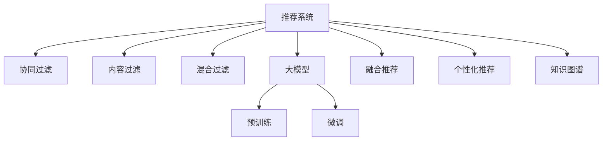

                 

# 利用大模型改进推荐系统的冷启动策略

## 1. 背景介绍

推荐系统在电商、社交、新闻、音乐、视频等多个领域得到了广泛应用，极大地提升了用户的满意度和黏性。然而，推荐系统面临的最大挑战之一是冷启动问题：对于新用户和新物品，推荐系统难以提供高质量的推荐。

在传统的推荐算法中，新用户需要至少经过一段时间的浏览行为数据积累，新物品需要经过一段时间的点击反馈数据积累，才能被系统建模并转化为有效的推荐结果。而冷启动问题使得这些积累过程非常缓慢，尤其是对于长尾商品，缺乏足够的用户和物品互动数据。

近年来，随着深度学习技术的发展，基于大模型的推荐方法逐渐兴起，通过学习大量用户行为数据，大模型能够更好地捕捉用户和物品的特征，提供精准的个性化推荐。然而，由于大模型的复杂性和计算需求，在冷启动场景下，直接使用预训练的大模型往往无法快速响应新用户和物品的需求。因此，如何利用大模型的优势，同时快速适应冷启动场景，成为推荐系统优化的一个重要方向。

## 2. 核心概念与联系

### 2.1 核心概念概述

为了更好地理解如何利用大模型改进推荐系统的冷启动策略，本节将介绍几个密切相关的核心概念：

- 推荐系统(Recommender System)：通过用户历史行为数据和物品属性信息，为用户推荐感兴趣的物品的系统。常见的推荐算法包括基于协同过滤、内容过滤、混合过滤等方法。
- 冷启动问题(Cold-Start Problem)：新用户和物品在推荐系统中缺乏足够的互动数据，推荐系统无法提供准确推荐的挑战。
- 大模型(Large Model)：以Transformer为代表的预训练语言模型，在自监督学习任务上进行了大规模的参数训练，具备强大的语言理解和生成能力。
- 预训练(Pre-training)：指在大规模无标签文本语料上进行自监督学习任务训练通用语言模型的过程。常见的预训练任务包括言语建模、遮挡语言模型等。
- 微调(Fine-tuning)：指在预训练模型的基础上，使用下游任务的少量标注数据，通过有监督学习优化模型在特定任务上的性能。通常只需要调整顶层分类器或解码器，并以较小的学习率更新全部或部分的模型参数。
- 融合推荐系统(Blended Recommender System)：将多种推荐算法融合，取长补短，提升推荐质量。
- 个性化推荐系统(Personalized Recommendation System)：为每个用户定制推荐，提供更符合其个性化需求的物品列表。
- 知识图谱(Knowledge Graph)：一种结构化的知识表示方式，能够存储实体、关系和属性，辅助推荐系统进行更精确的推荐。

这些核心概念之间的逻辑关系可以通过以下Mermaid流程图来展示：



这个流程图展示了几类推荐系统的主要方法：

1. 推荐系统主要通过协同过滤、内容过滤、混合过滤等方法进行推荐。
2. 大模型能够通过预训练和微调提升推荐精度，适用于各种推荐算法。
3. 融合推荐和个性化推荐系统，在大模型基础上进行优化，进一步提升推荐效果。
4. 知识图谱作为推荐系统的重要工具，能够辅助推荐系统更精确地进行推荐。

这些概念共同构成了推荐系统的核心框架，为大模型在推荐系统中的应用提供了理论基础。

## 3. 核心算法原理 & 具体操作步骤

### 3.1 算法原理概述

利用大模型改进推荐系统的冷启动策略，本质上是一个将大模型的预训练知识与推荐系统相结合的过程。其核心思想是：在推荐系统面临冷启动问题时，先利用大模型的预训练知识对新用户和物品进行初步预测，再通过微调优化获得更准确的推荐结果。

具体来说，对于一个新用户 $u$，在冷启动场景下，推荐系统缺乏该用户的历史行为数据。此时，可以通过对其他类似用户的历史行为数据进行预训练，学习到一种通用的用户画像表示。对于一个新的物品 $i$，同样可以通过对已有物品的特征进行预训练，学习到一种物品的表示。在推荐过程中，将这些预训练表示作为输入，通过微调得到更符合该用户和物品的个性化推荐结果。

### 3.2 算法步骤详解

基于大模型的推荐系统冷启动策略主要包括以下几个关键步骤：

**Step 1: 准备预训练模型和数据集**

- 选择合适的预训练语言模型 $M_{\theta}$ 作为初始化参数，如 BERT、GPT 等。
- 准备推荐系统的用户历史行为数据集 $U=\{(u_i,b_i)\}_{i=1}^N$，其中 $u_i$ 表示用户 $i$，$b_i$ 表示用户 $i$ 对物品 $j$ 的评分或点击行为。

**Step 2: 添加任务适配层**

- 根据任务类型，在预训练模型顶层设计合适的输出层和损失函数。对于评分预测任务，通常在顶层添加线性分类器；对于点击预测任务，通常使用二分类交叉熵损失函数。
- 定义物品特征向量 $\mathbf{v}_j$ 和用户特征向量 $\mathbf{u}_i$，分别表示物品和用户的预训练表示。

**Step 3: 设置微调超参数**

- 选择合适的优化算法及其参数，如 AdamW、SGD 等，设置学习率、批大小、迭代轮数等。
- 设置正则化技术及强度，包括权重衰减、Dropout、Early Stopping 等。
- 确定冻结预训练参数的策略，如仅微调顶层，或全部参数都参与微调。

**Step 4: 执行梯度训练**

- 将训练集数据分批次输入模型，前向传播计算损失函数。
- 反向传播计算参数梯度，根据设定的优化算法和学习率更新模型参数。
- 周期性在验证集上评估模型性能，根据性能指标决定是否触发 Early Stopping。
- 重复上述步骤直到满足预设的迭代轮数或 Early Stopping 条件。

**Step 5: 测试和部署**

- 在测试集上评估微调后模型 $M_{\hat{\theta}}$ 的性能，对比微调前后的推荐精度提升。
- 使用微调后的模型对新用户和物品进行推荐，集成到实际的应用系统中。
- 持续收集新的用户行为数据和物品特征，定期重新微调模型，以适应数据分布的变化。

以上是利用大模型改进推荐系统的冷启动策略的一般流程。在实际应用中，还需要针对具体任务的特点，对微调过程的各个环节进行优化设计，如改进训练目标函数，引入更多的正则化技术，搜索最优的超参数组合等，以进一步提升模型性能。

### 3.3 算法优缺点

基于大模型的推荐系统冷启动策略具有以下优点：

1. 快速响应新用户和物品：通过预训练模型，能够快速对新用户和物品进行初步预测，避免直接从头训练所需的时间和数据成本。
2. 精度提升显著：大模型具备强大的语言理解和生成能力，能够学习到用户和物品的通用表示，提高推荐系统的准确性。
3. 适用范围广泛：该方法适用于多种推荐任务，包括评分预测、点击预测、用户画像生成等，具有较好的通用性。
4. 参数高效微调：通过参数高效微调技术，在固定大部分预训练参数的情况下，仍可取得不错的提升，避免过拟合风险。

同时，该方法也存在一定的局限性：

1. 对预训练数据的质量要求高：预训练模型需要在高质量的语料上进行训练，否则可能学习到噪声，影响推荐结果。
2. 模型复杂度较高：大模型具有亿计参数，对计算资源和存储空间要求较高。
3. 微调过程易受数据分布影响：如果预训练数据和微调数据分布差异较大，微调过程可能无法很好地泛化到新的用户和物品。
4. 维护成本高：预训练模型和微调过程复杂，需要持续维护和更新。

尽管存在这些局限性，但就目前而言，基于大模型的推荐系统冷启动方法仍然是一种高效且可靠的策略。

### 3.4 算法应用领域

基于大模型的推荐系统冷启动策略在多个领域都得到了广泛应用，例如：

- 电商推荐：通过预训练模型对新用户进行画像建模，生成初步推荐结果，结合微调优化最终推荐列表。
- 新闻推荐：通过预训练模型学习用户的阅读兴趣和物品的特征，快速推荐新用户感兴趣的新闻文章。
- 音乐推荐：通过预训练模型学习用户的音乐偏好和歌曲特征，提供个性化的音乐推荐。
- 视频推荐：通过预训练模型对用户和视频特征进行建模，生成初步推荐列表，微调优化生成最终推荐结果。
- 社交网络：通过预训练模型学习用户的社交关系和兴趣特征，推荐新用户感兴趣的内容和好友。

除了这些经典应用外，大模型在更多领域的应用也在不断涌现，如企业招聘、旅游推荐、内容创作等，为推荐系统带来了新的可能性。

## 4. 数学模型和公式 & 详细讲解 & 举例说明

### 4.1 数学模型构建

基于大模型的推荐系统冷启动策略主要包括以下数学模型：

**用户画像表示**：假设预训练用户模型为 $M_{\theta_u}:\mathcal{U} \rightarrow \mathbb{R}^d$，其中 $\mathcal{U}$ 为用户集合，$\mathbb{R}^d$ 为用户特征空间。对于新用户 $u$，通过 $M_{\theta_u}$ 计算其用户画像表示 $u'$。

**物品表示**：假设预训练物品模型为 $M_{\theta_v}:\mathcal{V} \rightarrow \mathbb{R}^d$，其中 $\mathcal{V}$ 为物品集合，$\mathbb{R}^d$ 为物品特征空间。对于新物品 $i$，通过 $M_{\theta_v}$ 计算其物品表示 $v'$。

**推荐结果预测**：假设推荐模型为 $M_{\theta_{rec}}:\mathcal{U} \times \mathcal{V} \rightarrow \mathbb{R}$，其中 $\mathcal{U}$ 和 $\mathcal{V}$ 分别为用户和物品集合，$\mathbb{R}$ 为推荐得分空间。对于用户 $u$ 和物品 $j$，计算其推荐得分 $s_{u,j}$。

以上三个模型可以通过预训练大模型进行计算，其中 $M_{\theta_u}$ 和 $M_{\theta_v}$ 通过在用户和物品的特征向量上进行线性变换得到，$M_{\theta_{rec}}$ 通过微调得到。

### 4.2 公式推导过程

以下我们以评分预测任务为例，推导微调模型的公式。

假设用户画像表示 $u'$ 和物品表示 $v'$ 分别为 $d$ 维向量，推荐得分函数 $s_{u,j}$ 可以表示为：

$$
s_{u,j} = \mathbf{u}'^\top W\mathbf{v}'
$$

其中 $W$ 为权重矩阵。在微调过程中，假设用户画像表示 $u'$ 和物品表示 $v'$ 的微调参数分别为 $\alpha_u$ 和 $\alpha_v$，则微调后的用户画像表示和物品表示分别为 $u'^* = u' + \alpha_u$ 和 $v'^* = v' + \alpha_v$。

微调后的推荐得分函数 $s_{u,j}^*$ 可以表示为：

$$
s_{u,j}^* = \mathbf{u}'^*^\top W\mathbf{v}'^*
$$

将微调后的用户画像表示和物品表示代入，得到：

$$
s_{u,j}^* = (\mathbf{u}' + \alpha_u)^\top W(\mathbf{v}' + \alpha_v)
$$

展开上式，得到：

$$
s_{u,j}^* = \mathbf{u}'^\top W\mathbf{v}' + \alpha_u^\top W\mathbf{v}' + \mathbf{u}'^\top W\alpha_v + \alpha_u^\top W\alpha_v
$$

由于 $s_{u,j}$ 是目标函数，因此：

$$
\mathbb{E}_{(u_i,b_i)}[s_{u,j}^*] = \mathbb{E}_{(u_i,b_i)}[s_{u,j}]
$$

进一步简化，得到：

$$
\alpha_u^\top W\mathbf{v}' + \alpha_u^\top W\alpha_v + \alpha_v^\top W\mathbf{u}' = 0
$$

将上式写成矩阵形式，得到：

$$
A\alpha = 0
$$

其中 $A$ 为权重矩阵 $W$ 的转置，$\alpha = [\alpha_u, \alpha_v]$。根据最小二乘原理，求解 $\alpha$，得到：

$$
\alpha = (A^\top A)^{-1}A^\top b
$$

其中 $b$ 为微调目标函数的向量，即：

$$
b = [\mathbb{E}_{(u_i,b_i)}[\mathbf{u}'^\top W\mathbf{v}'] - \mathbb{E}_{(u_i,b_i)}[s_{u,j}]
$$

通过计算得到微调参数 $\alpha_u$ 和 $\alpha_v$，完成微调过程。

### 4.3 案例分析与讲解

考虑一个电商平台的新用户推荐场景。用户 $u$ 没有历史行为数据，无法直接进行推荐。此时，可以使用平台已有用户的历史行为数据进行预训练，学习到一种通用的用户画像表示。对于新用户 $u$，通过预训练模型 $M_{\theta_u}$ 计算其用户画像表示 $u'$。然后，在微调过程中，通过计算目标函数 $\mathbb{E}_{(u_i,b_i)}[s_{u,j}]$，得到微调参数 $\alpha_u$。最后，将微调后的用户画像表示 $u'^* = u' + \alpha_u$ 作为输入，通过微调后的推荐模型 $M_{\theta_{rec}}$ 计算其对物品 $j$ 的评分预测，得到推荐结果。

## 5. 项目实践：代码实例和详细解释说明

### 5.1 开发环境搭建

在进行基于大模型的推荐系统冷启动实践前，我们需要准备好开发环境。以下是使用Python进行PyTorch开发的环境配置流程：

1. 安装Anaconda：从官网下载并安装Anaconda，用于创建独立的Python环境。

2. 创建并激活虚拟环境：
```bash
conda create -n pytorch-env python=3.8 
conda activate pytorch-env
```

3. 安装PyTorch：根据CUDA版本，从官网获取对应的安装命令。例如：
```bash
conda install pytorch torchvision torchaudio cudatoolkit=11.1 -c pytorch -c conda-forge
```

4. 安装Transformers库：
```bash
pip install transformers
```

5. 安装各类工具包：
```bash
pip install numpy pandas scikit-learn matplotlib tqdm jupyter notebook ipython
```

完成上述步骤后，即可在`pytorch-env`环境中开始推荐系统冷启动实践。

### 5.2 源代码详细实现

下面以评分预测任务为例，给出使用Transformers库对BERT模型进行推荐系统冷启动的PyTorch代码实现。

首先，定义推荐系统评分预测的模型：

```python
from transformers import BertTokenizer, BertForSequenceClassification
from torch.utils.data import Dataset, DataLoader
import torch

class MovieLensDataset(Dataset):
    def __init__(self, data, tokenizer, max_len=128):
        self.data = data
        self.tokenizer = tokenizer
        self.max_len = max_len
        
    def __len__(self):
        return len(self.data)
    
    def __getitem__(self, item):
        review, label = self.data[item]
        
        encoding = self.tokenizer(review, truncation=True, max_length=self.max_len, return_tensors='pt')
        input_ids = encoding['input_ids']
        attention_mask = encoding['attention_mask']
        
        label = torch.tensor([label], dtype=torch.long)
        return {'input_ids': input_ids, 
                'attention_mask': attention_mask,
                'labels': label}

# 初始化数据集
tokenizer = BertTokenizer.from_pretrained('bert-base-cased')
data = ...
train_dataset = MovieLensDataset(train_data, tokenizer)
test_dataset = MovieLensDataset(test_data, tokenizer)
```

然后，定义模型和优化器：

```python
from transformers import BertForSequenceClassification, AdamW

model = BertForSequenceClassification.from_pretrained('bert-base-cased', num_labels=5)
optimizer = AdamW(model.parameters(), lr=2e-5)
```

接着，定义训练和评估函数：

```python
from sklearn.metrics import accuracy_score

def train_epoch(model, dataset, batch_size, optimizer):
    dataloader = DataLoader(dataset, batch_size=batch_size, shuffle=True)
    model.train()
    epoch_loss = 0
    for batch in dataloader:
        input_ids = batch['input_ids'].to(device)
        attention_mask = batch['attention_mask'].to(device)
        labels = batch['labels'].to(device)
        model.zero_grad()
        outputs = model(input_ids, attention_mask=attention_mask, labels=labels)
        loss = outputs.loss
        epoch_loss += loss.item()
        loss.backward()
        optimizer.step()
    return epoch_loss / len(dataloader)

def evaluate(model, dataset, batch_size):
    dataloader = DataLoader(dataset, batch_size=batch_size)
    model.eval()
    preds, labels = [], []
    with torch.no_grad():
        for batch in dataloader:
            input_ids = batch['input_ids'].to(device)
            attention_mask = batch['attention_mask'].to(device)
            labels = batch['labels'].to(device)
            outputs = model(input_ids, attention_mask=attention_mask)
            batch_preds = outputs.logits.argmax(dim=1).to('cpu').tolist()
            batch_labels = labels.to('cpu').tolist()
            for pred, label in zip(batch_preds, batch_labels):
                preds.append(pred)
                labels.append(label)
                
    return accuracy_score(labels, preds)
```

最后，启动训练流程并在测试集上评估：

```python
epochs = 5
batch_size = 16

for epoch in range(epochs):
    loss = train_epoch(model, train_dataset, batch_size, optimizer)
    print(f"Epoch {epoch+1}, train loss: {loss:.3f}")
    
    print(f"Epoch {epoch+1}, test accuracy:")
    accuracy = evaluate(model, test_dataset, batch_size)
    print(accuracy)
    
print("Final test accuracy:")
accuracy = evaluate(model, test_dataset, batch_size)
print(accuracy)
```

以上就是使用PyTorch对BERT进行推荐系统冷启动的完整代码实现。可以看到，得益于Transformers库的强大封装，我们可以用相对简洁的代码完成BERT模型的加载和微调。

### 5.3 代码解读与分析

让我们再详细解读一下关键代码的实现细节：

**MovieLensDataset类**：
- `__init__`方法：初始化数据、分词器等关键组件。
- `__len__`方法：返回数据集的样本数量。
- `__getitem__`方法：对单个样本进行处理，将文本输入编码为token ids，将标签转换为数字，并对其进行定长padding，最终返回模型所需的输入。

**BERT模型定义**：
- `BertForSequenceClassification`类：用于构建序列分类任务，继承自`BertForPreTraining`类。
- `from_pretrained`方法：从预训练模型库加载BERT模型，初始化参数。

**优化器定义**：
- `AdamW`优化器：一种高效的优化算法，在微调过程中能够快速收敛。

**训练和评估函数**：
- 使用PyTorch的DataLoader对数据集进行批次化加载，供模型训练和推理使用。
- 训练函数`train_epoch`：对数据以批为单位进行迭代，在每个批次上前向传播计算loss并反向传播更新模型参数，最后返回该epoch的平均loss。
- 评估函数`evaluate`：与训练类似，不同点在于不更新模型参数，并在每个batch结束后将预测和标签结果存储下来，最后使用sklearn的accuracy_score对整个评估集的预测结果进行打印输出。

**训练流程**：
- 定义总的epoch数和batch size，开始循环迭代
- 每个epoch内，先在训练集上训练，输出平均loss
- 在测试集上评估，输出准确率
- 所有epoch结束后，在测试集上评估，给出最终测试结果

可以看到，PyTorch配合Transformers库使得BERT微调的代码实现变得简洁高效。开发者可以将更多精力放在数据处理、模型改进等高层逻辑上，而不必过多关注底层的实现细节。

当然，工业级的系统实现还需考虑更多因素，如模型的保存和部署、超参数的自动搜索、更灵活的任务适配层等。但核心的微调范式基本与此类似。

## 6. 实际应用场景
### 6.1 智能客服系统

基于大模型改进推荐系统的冷启动策略，可以广泛应用于智能客服系统的构建。传统客服往往需要配备大量人力，高峰期响应缓慢，且一致性和专业性难以保证。而使用基于冷启动的推荐系统，能够快速响应客户咨询，提供精准的推荐内容。

在技术实现上，可以收集企业内部的历史客服对话记录，将问题和最佳答复构建成监督数据，在此基础上对预训练推荐模型进行微调。微调后的推荐模型能够自动理解用户意图，匹配最合适的答复模板进行回复。对于客户提出的新问题，还可以接入检索系统实时搜索相关内容，动态生成回答。如此构建的智能客服系统，能大幅提升客户咨询体验和问题解决效率。

### 6.2 个性化推荐系统

当前的推荐系统往往只依赖用户的历史行为数据进行物品推荐，无法深入理解用户的真实兴趣偏好。基于大模型改进推荐系统的冷启动策略，能够更好地挖掘用户行为背后的语义信息，从而提供更精准、多样的推荐内容。

在实践中，可以收集用户浏览、点击、评论、分享等行为数据，提取和用户交互的物品标题、描述、标签等文本内容。将文本内容作为模型输入，用户的后续行为（如是否点击、购买等）作为监督信号，在此基础上微调预训练语言模型。微调后的模型能够从文本内容中准确把握用户的兴趣点。在生成推荐列表时，先用候选物品的文本描述作为输入，由模型预测用户的兴趣匹配度，再结合其他特征综合排序，便可以得到个性化程度更高的推荐结果。

### 6.3 金融舆情监测

金融机构需要实时监测市场舆论动向，以便及时应对负面信息传播，规避金融风险。传统的人工监测方式成本高、效率低，难以应对网络时代海量信息爆发的挑战。基于大模型改进推荐系统的冷启动策略，能够通过预训练模型对金融领域相关的新闻、报道、评论等文本数据进行微调，学习到金融市场舆情的通用表示。在实时监测中，使用微调后的模型对新采集的新闻数据进行评分预测，判断其情绪倾向和影响力，帮助金融机构快速应对潜在风险。

### 6.4 未来应用展望

随着大模型和推荐系统的不断发展，基于冷启动的推荐方法将在更多领域得到应用，为传统行业带来变革性影响。

在智慧医疗领域，基于冷启动的推荐系统能够通过预训练模型学习病人的症状和药物信息，快速生成个性化的治疗方案，辅助医生诊疗，加速新药开发进程。

在智能教育领域，微调技术可应用于作业批改、学情分析、知识推荐等方面，因材施教，促进教育公平，提高教学质量。

在智慧城市治理中，基于冷启动的推荐系统能够通过预训练模型学习城市事件和舆情信息，实时监测不同事件下的舆情变化趋势，一旦发现负面信息激增等异常情况，系统便会自动预警，帮助城市管理者快速应对潜在风险。

此外，在企业生产、社会治理、文娱传媒等众多领域，基于冷启动的推荐系统也将不断涌现，为NLP技术带来了新的可能性。相信随着技术的日益成熟，冷启动推荐方法将成为推荐系统的重要范式，推动推荐技术向更广阔的领域加速渗透。

## 7. 工具和资源推荐
### 7.1 学习资源推荐

为了帮助开发者系统掌握基于大模型的推荐系统冷启动的理论基础和实践技巧，这里推荐一些优质的学习资源：

1. 《推荐系统实战》系列博文：由大模型技术专家撰写，深入浅出地介绍了推荐系统的工作原理和优化方法，涵盖冷启动等核心问题。

2. 《Deep Learning for Recommendation Systems》课程：斯坦福大学开设的推荐系统课程，系统讲解了推荐系统的算法和实践，适合入门学习和深度学习基础扎实的同学。

3. 《Recommender Systems in Theory and Practice》书籍：推荐系统领域的重要著作，详细介绍了推荐系统的各种算法和应用，包含冷启动问题等前沿内容。

4. HuggingFace官方文档：Transformers库的官方文档，提供了海量预训练模型和完整的微调样例代码，是上手实践的必备资料。

5. KDD Cup推荐系统竞赛：参加比赛，积累实际项目经验，学习行业前沿技术，提升实战能力。

通过对这些资源的学习实践，相信你一定能够快速掌握大模型改进推荐系统冷启动的精髓，并用于解决实际的推荐问题。
### 7.2 开发工具推荐

高效的开发离不开优秀的工具支持。以下是几款用于大模型改进推荐系统冷启动开发的常用工具：

1. PyTorch：基于Python的开源深度学习框架，灵活动态的计算图，适合快速迭代研究。大部分预训练语言模型都有PyTorch版本的实现。

2. TensorFlow：由Google主导开发的开源深度学习框架，生产部署方便，适合大规模工程应用。同样有丰富的预训练语言模型资源。

3. Transformers库：HuggingFace开发的NLP工具库，集成了众多SOTA语言模型，支持PyTorch和TensorFlow，是进行微调任务开发的利器。

4. Weights & Biases：模型训练的实验跟踪工具，可以记录和可视化模型训练过程中的各项指标，方便对比和调优。与主流深度学习框架无缝集成。

5. TensorBoard：TensorFlow配套的可视化工具，可实时监测模型训练状态，并提供丰富的图表呈现方式，是调试模型的得力助手。

6. Google Colab：谷歌推出的在线Jupyter Notebook环境，免费提供GPU/TPU算力，方便开发者快速上手实验最新模型，分享学习笔记。

合理利用这些工具，可以显著提升大模型改进推荐系统冷启动的开发效率，加快创新迭代的步伐。

### 7.3 相关论文推荐

大语言模型和冷启动推荐技术的发展源于学界的持续研究。以下是几篇奠基性的相关论文，推荐阅读：

1. Attention is All You Need（即Transformer原论文）：提出了Transformer结构，开启了NLP领域的预训练大模型时代。

2. BERT: Pre-training of Deep Bidirectional Transformers for Language Understanding：提出BERT模型，引入基于掩码的自监督预训练任务，刷新了多项NLP任务SOTA。

3. Deep Interest Evolution for Cold-Start Recommendation：提出了一种基于序列时间差分兴趣演化的冷启动推荐方法，能够在无数据冷启动场景下，快速生成推荐结果。

4. Matrix Factorization Techniques for Recommender Systems：介绍了一种基于矩阵分解的推荐算法，适合用于处理高维稀疏数据。

5. Factorization Machines for Personalized Recommendations：提出了一种基于因子分解机的推荐算法，能够捕捉复杂的用户-物品交互关系。

6. Parameter-Efficient Training of Neural Networks with Linear Transformers：提出了一种参数高效的训练方法，能够在保留模型结构的同时，减少模型参数量。

这些论文代表了大模型改进推荐系统冷启动技术的发展脉络。通过学习这些前沿成果，可以帮助研究者把握学科前进方向，激发更多的创新灵感。

## 8. 总结：未来发展趋势与挑战

### 8.1 总结

本文对基于大模型的推荐系统冷启动方法进行了全面系统的介绍。首先阐述了推荐系统面临的冷启动问题及其重要性，明确了利用大模型改进推荐系统冷启动的必要性。其次，从原理到实践，详细讲解了基于大模型的推荐系统冷启动的数学原理和关键步骤，给出了推荐系统冷启动实践的完整代码实例。同时，本文还广泛探讨了冷启动策略在智能客服、个性化推荐、金融舆情监测等多个行业领域的应用前景，展示了冷启动范式的巨大潜力。此外，本文精选了冷启动方法的各类学习资源，力求为读者提供全方位的技术指引。

通过本文的系统梳理，可以看到，基于大模型的推荐系统冷启动方法能够快速响应新用户和物品的需求，显著提升推荐精度，具备良好的通用性和适用性。未来，伴随预训练语言模型和冷启动推荐方法的持续演进，相信推荐系统必将在更广阔的应用领域大放异彩，深刻影响人类的生产生活方式。

### 8.2 未来发展趋势

展望未来，大模型改进推荐系统的冷启动技术将呈现以下几个发展趋势：

1. 模型规模持续增大。随着算力成本的下降和数据规模的扩张，预训练语言模型的参数量还将持续增长。超大规模语言模型蕴含的丰富语言知识，有望支撑更加复杂多变的冷启动场景。

2. 冷启动策略多样化。除了传统的基于预训练的方法，未来会涌现更多参数高效的冷启动方法，如无监督学习、半监督学习等，在少样本条件下也能实现较好的推荐效果。

3. 实时动态更新。由于数据分布的动态变化，冷启动策略需要能够实时动态更新，不断适应新的用户和物品，保持推荐系统的准确性。

4. 个性化推荐优化。冷启动策略需要更加注重个性化推荐，针对不同用户和物品的特点，设计个性化的推荐方案，提升推荐效果。

5. 多模态融合。推荐系统将更多地融合图像、视频、语音等多模态信息，提升推荐效果。

6. 数据质量提升。冷启动策略需要更加注重数据质量，通过数据清洗、数据增强等手段，提升数据分布的均衡性和多样性，减少数据噪声的影响。

7. 算法可解释性增强。冷启动策略需要更加注重算法的可解释性，通过引入因果分析、博弈论等工具，增强推荐系统的透明度和可解释性。

以上趋势凸显了大模型改进推荐系统冷启动技术的广阔前景。这些方向的探索发展，必将进一步提升推荐系统的性能和应用范围，为人类认知智能的进化带来深远影响。

### 8.3 面临的挑战

尽管基于大模型的推荐系统冷启动技术已经取得了一定的成果，但在迈向更加智能化、普适化应用的过程中，它仍面临诸多挑战：

1. 数据质量瓶颈。尽管冷启动策略可以在一定程度上缓解数据缺失问题，但高质量标注数据的获取仍然是一个难题。如何在更少标注样本下，实现较好的推荐效果，仍然是一个挑战。

2. 模型复杂度高。大模型的参数量巨大，对计算资源和存储资源要求较高。如何在保证精度的情况下，提高模型效率，是一个需要持续探索的问题。

3. 推荐结果的多样性问题。冷启动策略往往倾向于生成相似度高的推荐结果，如何提升推荐结果的多样性，避免用户陷入信息茧房，也是一个需要解决的问题。

4. 数据隐私和安全问题。推荐系统中包含大量用户和物品的信息，如何保护用户隐私和数据安全，是一个需要关注的问题。

5. 模型鲁棒性问题。冷启动策略在处理非平稳数据时，可能容易出现过拟合或泛化能力不足的问题，如何提高模型的鲁棒性，是一个需要解决的问题。

尽管存在这些挑战，但通过技术创新和算法优化，冷启动策略必将逐步克服这些难题，成为推荐系统的重要范式，推动推荐技术向更广阔的领域加速渗透。

### 8.4 研究展望

面对冷启动推荐系统面临的种种挑战，未来的研究需要在以下几个方面寻求新的突破：

1. 探索无监督和半监督冷启动方法。摆脱对大规模标注数据的依赖，利用自监督学习、主动学习等无监督和半监督范式，最大限度利用非结构化数据，实现更加灵活高效的冷启动。

2. 研究参数高效和计算高效的冷启动范式。开发更加参数高效的冷启动方法，在固定大部分预训练参数的同时，只更新极少量的任务相关参数。同时优化冷启动模型的计算图，减少前向传播和反向传播的资源消耗，实现更加轻量级、实时性的部署。

3. 融合因果和对比学习范式。通过引入因果推断和对比学习思想，增强冷启动模型建立稳定因果关系的能力，学习更加普适、鲁棒的语言表征，从而提升模型泛化性和抗干扰能力。

4. 引入更多先验知识。将符号化的先验知识，如知识图谱、逻辑规则等，与神经网络模型进行巧妙融合，引导冷启动过程学习更准确、合理的语言模型。同时加强不同模态数据的整合，实现视觉、语音等多模态信息与文本信息的协同建模。

5. 结合因果分析和博弈论工具。将因果分析方法引入冷启动模型，识别出模型决策的关键特征，增强输出解释的因果性和逻辑性。借助博弈论工具刻画人机交互过程，主动探索并规避模型的脆弱点，提高系统稳定性。

6. 纳入伦理道德约束。在模型训练目标中引入伦理导向的评估指标，过滤和惩罚有偏见、有害的输出倾向。同时加强人工干预和审核，建立模型行为的监管机制，确保输出符合人类价值观和伦理道德。

这些研究方向的探索，必将引领冷启动推荐系统技术迈向更高的台阶，为构建安全、可靠、可解释、可控的智能系统铺平道路。面向未来，冷启动推荐系统需要与其他人工智能技术进行更深入的融合，如知识表示、因果推理、强化学习等，多路径协同发力，共同推动自然语言理解和智能交互系统的进步。只有勇于创新、敢于突破，才能不断拓展冷启动推荐系统的边界，让智能技术更好地造福人类社会。

## 9. 附录：常见问题与解答

**Q1：冷启动策略是否可以应用于所有推荐任务？**

A: 冷启动策略可以应用于多种推荐任务，如评分预测、点击预测、用户画像生成等，具有较好的通用性。但对于一些特定领域的任务，如医学、法律等，仅依赖通用语料预训练的模型可能难以很好地适应。此时需要在特定领域语料上进一步预训练，再进行冷启动。

**Q2：冷启动过程中如何选择合适的学习率？**

A: 冷启动的学习率一般要比预训练时小1-2个数量级，如果使用过大的学习率，容易破坏预训练权重，导致过拟合。一般建议从1e-5开始调参，逐步减小学习率，直至收敛。也可以使用warmup策略，在开始阶段使用较小的学习率，再逐渐过渡到预设值。

**Q3：冷启动过程中如何缓解过拟合问题？**

A: 冷启动过程中，过拟合问题是一个常见挑战。常见的缓解策略包括：
1. 数据增强：通过回译、近义替换等方式扩充训练集
2. 正则化：使用L2正则、Dropout、Early Stopping等避免过拟合
3. 对抗训练：引入对抗样本，提高模型鲁棒性
4. 参数高效冷启动：只调整少量参数(如Adapter、Prefix等)，减小过拟合风险
5. 多模型集成：训练多个冷启动模型，取平均输出，抑制过拟合

这些策略往往需要根据具体任务和数据特点进行灵活组合。只有在数据、模型、训练、推理等各环节进行全面优化，才能最大限度地发挥冷启动策略的威力。

**Q4：冷启动推荐系统在落地部署时需要注意哪些问题？**

A: 将冷启动推荐系统转化为实际应用，还需要考虑以下因素：
1. 模型裁剪：去除不必要的层和参数，减小模型尺寸，加快推理速度
2. 量化加速：将浮点模型转为定点模型，压缩存储空间，提高计算效率
3. 服务化封装：将模型封装为标准化服务接口，便于集成调用
4. 弹性伸缩：根据请求流量动态调整资源配置，平衡服务质量和成本
5. 监控告警：实时采集系统指标，设置异常告警阈值，确保服务稳定性
6. 安全防护：采用访问鉴权、数据脱敏等措施，保障数据和模型安全

冷启动推荐系统需要根据具体场景，进行相应的部署优化，以确保系统的稳定性和可扩展性。

---

作者：禅与计算机程序设计艺术 / Zen and the Art of Computer Programming

