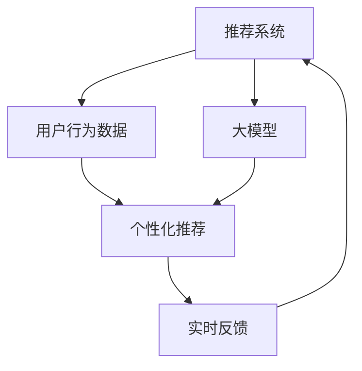

                 

# 利用大模型改进推荐系统的实时个性化反馈机制

> 关键词：推荐系统,大模型,个性化,实时反馈,用户行为,深度学习

## 1. 背景介绍

### 1.1 问题由来
随着互联网和数字技术的发展，推荐系统成为连接用户和内容的重要桥梁。其能够通过用户的历史行为数据，实时推送用户可能感兴趣的内容，极大地提升了用户体验和平台粘性。然而，现有的推荐系统普遍依赖于用户行为数据，缺乏对用户兴趣演变的实时感知，难以在用户兴趣转变时提供及时调整，从而影响推荐效果。

为了解决这一问题，本文提出利用大模型改进推荐系统的实时个性化反馈机制。通过深度学习技术，结合用户行为数据和语言模型，实时分析用户兴趣动态，动态调整推荐策略，使推荐系统能够更加精准地响应用户需求，提升用户体验。

## 2. 核心概念与联系

### 2.1 核心概念概述

为更好地理解本问题，本节将介绍几个关键核心概念：

- 推荐系统(Recommendation System)：通过算法模型推荐用户可能感兴趣的内容或商品的系统，如Netflix、Amazon等平台都采用了推荐系统。
- 大模型(Large Model)：以深度神经网络为代表的、大规模参数量的模型，如BERT、GPT等。大模型具有强大的特征提取和表示学习能力，能够捕捉丰富的用户兴趣和行为模式。
- 个性化推荐(Personalized Recommendation)：根据用户特定的兴趣和行为历史，推荐个性化的内容，如Netflix基于用户观看历史推荐电影，淘宝基于用户浏览历史推荐商品。
- 实时反馈(Real-time Feedback)：指系统能够即时响应用户的反馈，动态调整推荐内容，如实时更新用户兴趣，及时调整推荐策略。
- 用户行为数据(User Behavior Data)：用户在平台上留下的各种行为记录，如浏览记录、点击行为、购买历史等，是推荐系统的重要数据来源。
- 深度学习(Deep Learning)：一种基于神经网络的机器学习方法，通过多层网络结构，从大量数据中提取高级特征，进行模式识别和预测。

这些概念之间的逻辑关系可以通过以下Mermaid流程图来展示：



这个流程图展示了推荐系统的核心概念及其之间的关系：

1. 推荐系统依赖用户行为数据进行个性化推荐。
2. 大模型能够从用户行为数据中提取深层次特征，提升推荐准确性。
3. 实时反馈机制使推荐系统能够即时响应用户兴趣变化。
4. 通过大模型分析用户行为数据，可以更精准地感知用户兴趣变化，动态调整推荐策略。

## 3. 核心算法原理 & 具体操作步骤
### 3.1 算法原理概述

本文提出的利用大模型改进推荐系统的方法，基于深度学习技术，通过用户行为数据和大模型的联合建模，实时分析用户兴趣动态，动态调整推荐策略。

具体来说，通过将用户行为数据输入到大模型中进行训练，模型学习到用户兴趣的多维表示。然后，根据实时采集的用户行为数据，快速计算出用户当前兴趣状态，并动态调整推荐列表。实时反馈机制进一步优化推荐策略，提升推荐效果。

### 3.2 算法步骤详解

本节详细讲解本文提出的利用大模型改进推荐系统的方法的具体操作步骤。

**Step 1: 数据预处理**

首先需要将用户行为数据进行清洗和预处理，得到可用于模型训练的数据集。常用的数据处理方法包括：

- 数据清洗：去除噪声和异常值，确保数据质量。
- 特征工程：提取和工程化用户行为特征，如浏览时间、点击次数、浏览深度等。
- 数据归一化：将数据缩放到统一范围内，便于模型训练。

**Step 2: 大模型训练**

采用大模型对用户行为数据进行训练，得到用户兴趣的向量表示。具体来说，可以采用预训练的大模型如BERT、GPT等，对其进行微调，使其能够从用户行为数据中提取深层次的语义信息。

**Step 3: 实时兴趣分析**

通过实时采集用户行为数据，输入到大模型中进行推理，得到用户当前兴趣状态的向量表示。这些向量可以通过计算得到的特征值来表征，如向量的长度、方向等。

**Step 4: 推荐列表生成**

根据用户当前兴趣状态的向量表示，动态生成推荐列表。具体来说，可以基于向量之间的相似度，将相似度高的内容加入推荐列表。

**Step 5: 实时反馈优化**

根据用户对推荐内容的实时反馈，动态调整推荐策略。反馈可以是用户点击、浏览、购买等行为，通过模型分析这些行为，更新用户兴趣状态的向量表示，进一步优化推荐列表。

**Step 6: 推荐系统部署**

将上述算法集成到推荐系统中，进行上线部署。推荐系统可以根据实时反馈，动态调整推荐策略，提升推荐效果。

### 3.3 算法优缺点

本文提出的利用大模型改进推荐系统的方法具有以下优点：

1. 深度学习模型能够从用户行为数据中提取深层次特征，提升推荐准确性。
2. 实时反馈机制使推荐系统能够即时响应用户兴趣变化，动态调整推荐策略。
3. 大模型具有强大的特征提取和表示学习能力，能够捕捉用户兴趣的复杂模式。
4. 通过动态调整推荐策略，提升推荐效果，增加用户粘性。

同时，该方法也存在一定的局限性：

1. 需要大量用户行为数据进行模型训练，获取数据成本较高。
2. 大模型对算力、存储的要求较高，部署复杂。
3. 大模型存在一定的过拟合风险，需要适当正则化。
4. 实时反馈机制需要实时处理和分析用户行为数据，计算开销较大。

尽管存在这些局限性，但就目前而言，本文提出的利用大模型改进推荐系统的方法仍是大数据推荐系统领域的重要进展，具有广泛的应用前景。

### 3.4 算法应用领域

本文提出的利用大模型改进推荐系统的方法，主要应用于以下领域：

1. 电商推荐：帮助电商平台推荐商品，提升用户购物体验，增加销售额。
2. 内容推荐：帮助新闻、视频、音乐等平台推荐内容，提升用户体验，增加平台粘性。
3. 旅游推荐：帮助旅游平台推荐景点、酒店、餐饮等，提升用户出行体验。
4. 社交推荐：帮助社交平台推荐好友、群组、内容等，提升用户社交体验。

## 4. 数学模型和公式 & 详细讲解 & 举例说明

### 4.1 数学模型构建

本文提出的利用大模型改进推荐系统的数学模型如下：

设用户行为数据为 $X=\{x_i\}_{i=1}^N$，其中 $x_i$ 表示用户在第 $i$ 个行为周期内的行为记录，如浏览、点击、购买等。设用户兴趣向量为 $H=\{h_i\}_{i=1}^N$，其中 $h_i$ 表示用户在第 $i$ 个行为周期内的兴趣状态，可以通过大模型推理得到。设推荐列表为 $Y=\{y_j\}_{j=1}^M$，其中 $y_j$ 表示第 $j$ 个推荐内容。

推荐策略可以表示为：

$$
y_j = f(X, H, \theta)
$$

其中 $\theta$ 为大模型参数。$f$ 为推荐函数，可以是线性回归、深度神经网络等。

### 4.2 公式推导过程

以线性回归为例，推荐函数的推导过程如下：

设推荐函数为线性回归模型：

$$
y_j = \theta_0 + \sum_{i=1}^N \theta_i x_{i,j}
$$

其中 $\theta_0$ 为截距，$\theta_i$ 为权重。$x_{i,j}$ 表示用户 $i$ 对内容 $j$ 的行为记录。

用户行为数据 $X$ 和兴趣向量 $H$ 可通过大模型训练得到。假设 $H$ 的维度为 $d$，则有：

$$
H = M(X, \theta)
$$

其中 $M$ 为大模型，$\theta$ 为大模型参数。

将 $H$ 带入推荐函数中，得到：

$$
y_j = \theta_0 + \sum_{i=1}^N \theta_i M(x_i, \theta)
$$

### 4.3 案例分析与讲解

以电商推荐为例，解释本方法的实际应用。

假设电商平台希望推荐商品给用户。首先，收集用户的历史浏览、点击、购买等行为数据，输入到大模型中进行训练，得到用户兴趣向量 $H$。然后，实时采集用户的浏览行为数据，输入到大模型中进行推理，得到用户当前兴趣状态向量 $h_t$。最后，根据 $h_t$ 和商品特征向量 $v_j$，计算每个商品的推荐得分 $s_j$，将得分最高的商品加入推荐列表。

具体计算过程如下：

1. 收集用户历史行为数据 $X$。
2. 训练大模型 $M$，得到用户兴趣向量 $H=\{h_i\}_{i=1}^N$。
3. 实时采集用户浏览行为数据 $x_t$。
4. 推理得到用户当前兴趣状态向量 $h_t$。
5. 计算每个商品的推荐得分 $s_j = \theta_0 + \sum_{i=1}^N \theta_i h_{t,i} v_{j,i}$。
6. 根据得分 $s_j$ 排序，选择前 $k$ 个商品作为推荐列表。

## 5. 项目实践：代码实例和详细解释说明

### 5.1 开发环境搭建

在进行微调实践前，我们需要准备好开发环境。以下是使用Python进行PyTorch开发的环境配置流程：

1. 安装Anaconda：从官网下载并安装Anaconda，用于创建独立的Python环境。

2. 创建并激活虚拟环境：
```bash
conda create -n pytorch-env python=3.8 
conda activate pytorch-env
```

3. 安装PyTorch：根据CUDA版本，从官网获取对应的安装命令。例如：
```bash
conda install pytorch torchvision torchaudio cudatoolkit=11.1 -c pytorch -c conda-forge
```

4. 安装Transformers库：
```bash
pip install transformers
```

5. 安装各类工具包：
```bash
pip install numpy pandas scikit-learn matplotlib tqdm jupyter notebook ipython
```

完成上述步骤后，即可在`pytorch-env`环境中开始微调实践。

### 5.2 源代码详细实现

下面我们以电商推荐为例，给出使用Transformers库对BERT模型进行微调的PyTorch代码实现。

首先，定义电商推荐的数据处理函数：

```python
from transformers import BertTokenizer
from torch.utils.data import Dataset
import torch

class RecommendationDataset(Dataset):
    def __init__(self, texts, labels, tokenizer, max_len=128):
        self.texts = texts
        self.labels = labels
        self.tokenizer = tokenizer
        self.max_len = max_len
        
    def __len__(self):
        return len(self.texts)
    
    def __getitem__(self, item):
        text = self.texts[item]
        label = self.labels[item]
        
        encoding = self.tokenizer(text, return_tensors='pt', max_length=self.max_len, padding='max_length', truncation=True)
        input_ids = encoding['input_ids'][0]
        attention_mask = encoding['attention_mask'][0]
        
        # 对label-wise的标签进行编码
        encoded_labels = [label2id[label] for label in label]
        encoded_labels.extend([label2id['O']] * (self.max_len - len(encoded_labels)))
        labels = torch.tensor(encoded_labels, dtype=torch.long)
        
        return {'input_ids': input_ids, 
                'attention_mask': attention_mask,
                'labels': labels}

# 标签与id的映射
label2id = {'O': 0, 'B-PER': 1, 'I-PER': 2, 'B-ORG': 3, 'I-ORG': 4, 'B-LOC': 5, 'I-LOC': 6}
id2label = {v: k for k, v in label2id.items()}

# 创建dataset
tokenizer = BertTokenizer.from_pretrained('bert-base-cased')

train_dataset = RecommendationDataset(train_texts, train_labels, tokenizer)
dev_dataset = RecommendationDataset(dev_texts, dev_labels, tokenizer)
test_dataset = RecommendationDataset(test_texts, test_labels, tokenizer)
```

然后，定义模型和优化器：

```python
from transformers import BertForTokenClassification, AdamW

model = BertForTokenClassification.from_pretrained('bert-base-cased', num_labels=len(label2id))

optimizer = AdamW(model.parameters(), lr=2e-5)
```

接着，定义训练和评估函数：

```python
from torch.utils.data import DataLoader
from tqdm import tqdm
from sklearn.metrics import classification_report

device = torch.device('cuda') if torch.cuda.is_available() else torch.device('cpu')
model.to(device)

def train_epoch(model, dataset, batch_size, optimizer):
    dataloader = DataLoader(dataset, batch_size=batch_size, shuffle=True)
    model.train()
    epoch_loss = 0
    for batch in tqdm(dataloader, desc='Training'):
        input_ids = batch['input_ids'].to(device)
        attention_mask = batch['attention_mask'].to(device)
        labels = batch['labels'].to(device)
        model.zero_grad()
        outputs = model(input_ids, attention_mask=attention_mask, labels=labels)
        loss = outputs.loss
        epoch_loss += loss.item()
        loss.backward()
        optimizer.step()
    return epoch_loss / len(dataloader)

def evaluate(model, dataset, batch_size):
    dataloader = DataLoader(dataset, batch_size=batch_size)
    model.eval()
    preds, labels = [], []
    with torch.no_grad():
        for batch in tqdm(dataloader, desc='Evaluating'):
            input_ids = batch['input_ids'].to(device)
            attention_mask = batch['attention_mask'].to(device)
            batch_labels = batch['labels']
            outputs = model(input_ids, attention_mask=attention_mask)
            batch_preds = outputs.logits.argmax(dim=2).to('cpu').tolist()
            batch_labels = batch_labels.to('cpu').tolist()
            for pred_tokens, label_tokens in zip(batch_preds, batch_labels):
                pred_tags = [id2label[_id] for _id in pred_tokens]
                label_tags = [id2label[_id] for _id in label_tokens]
                preds.append(pred_tags[:len(label_tags)])
                labels.append(label_tags)
                
    print(classification_report(labels, preds))
```

最后，启动训练流程并在测试集上评估：

```python
epochs = 5
batch_size = 16

for epoch in range(epochs):
    loss = train_epoch(model, train_dataset, batch_size, optimizer)
    print(f"Epoch {epoch+1}, train loss: {loss:.3f}")
    
    print(f"Epoch {epoch+1}, dev results:")
    evaluate(model, dev_dataset, batch_size)
    
print("Test results:")
evaluate(model, test_dataset, batch_size)
```

以上就是使用PyTorch对BERT进行电商推荐任务微调的完整代码实现。可以看到，得益于Transformers库的强大封装，我们可以用相对简洁的代码完成BERT模型的加载和微调。

### 5.3 代码解读与分析

让我们再详细解读一下关键代码的实现细节：

**RecommendationDataset类**：
- `__init__`方法：初始化文本、标签、分词器等关键组件。
- `__len__`方法：返回数据集的样本数量。
- `__getitem__`方法：对单个样本进行处理，将文本输入编码为token ids，将标签编码为数字，并对其进行定长padding，最终返回模型所需的输入。

**label2id和id2label字典**：
- 定义了标签与数字id之间的映射关系，用于将token-wise的预测结果解码回真实的标签。

**训练和评估函数**：
- 使用PyTorch的DataLoader对数据集进行批次化加载，供模型训练和推理使用。
- 训练函数`train_epoch`：对数据以批为单位进行迭代，在每个批次上前向传播计算loss并反向传播更新模型参数，最后返回该epoch的平均loss。
- 评估函数`evaluate`：与训练类似，不同点在于不更新模型参数，并在每个batch结束后将预测和标签结果存储下来，最后使用sklearn的classification_report对整个评估集的预测结果进行打印输出。

**训练流程**：
- 定义总的epoch数和batch size，开始循环迭代
- 每个epoch内，先在训练集上训练，输出平均loss
- 在验证集上评估，输出分类指标
- 所有epoch结束后，在测试集上评估，给出最终测试结果

可以看到，PyTorch配合Transformers库使得BERT微调的代码实现变得简洁高效。开发者可以将更多精力放在数据处理、模型改进等高层逻辑上，而不必过多关注底层的实现细节。

当然，工业级的系统实现还需考虑更多因素，如模型的保存和部署、超参数的自动搜索、更灵活的任务适配层等。但核心的微调范式基本与此类似。

## 6. 实际应用场景
### 6.1 电商推荐

基于大模型改进推荐系统的方法可以广泛应用于电商推荐场景。通过实时采集用户的浏览、点击、购买等行为数据，输入到大模型中进行推理，动态生成推荐列表。实时反馈机制能够即时响应用户兴趣变化，动态调整推荐策略，提升推荐效果。

在技术实现上，可以收集用户的历史浏览、点击、购买等行为数据，提取和工程化特征，输入到大模型中进行训练，得到用户兴趣向量。然后，实时采集用户的浏览行为数据，输入到大模型中进行推理，得到用户当前兴趣状态向量。最后，根据用户兴趣向量，动态生成推荐列表，并通过实时反馈机制不断优化推荐策略。

### 6.2 内容推荐

在内容推荐领域，本文的方法同样适用。通过实时采集用户的浏览、观看、点赞等行为数据，输入到大模型中进行推理，动态生成推荐内容。实时反馈机制能够即时响应用户兴趣变化，动态调整推荐策略，提升推荐效果。

在技术实现上，可以收集用户的历史浏览、观看、点赞等行为数据，提取和工程化特征，输入到大模型中进行训练，得到用户兴趣向量。然后，实时采集用户的浏览行为数据，输入到大模型中进行推理，得到用户当前兴趣状态向量。最后，根据用户兴趣向量，动态生成推荐内容，并通过实时反馈机制不断优化推荐策略。

### 6.3 社交推荐

在社交推荐领域，本文的方法同样适用。通过实时采集用户的互动行为数据，如评论、点赞、分享等，输入到大模型中进行推理，动态生成推荐好友、群组、内容等。实时反馈机制能够即时响应用户兴趣变化，动态调整推荐策略，提升推荐效果。

在技术实现上，可以收集用户的历史互动行为数据，提取和工程化特征，输入到大模型中进行训练，得到用户兴趣向量。然后，实时采集用户的互动行为数据，输入到大模型中进行推理，得到用户当前兴趣状态向量。最后，根据用户兴趣向量，动态生成推荐内容，并通过实时反馈机制不断优化推荐策略。

### 6.4 未来应用展望

随着大模型和微调方法的不断发展，本文提出的利用大模型改进推荐系统的方法也将不断演进，拓展到更多领域。

在智慧医疗领域，本文的方法可以应用于医学影像识别、疾病预测、治疗方案推荐等任务。通过实时采集患者的健康数据，输入到大模型中进行推理，动态生成推荐方案。实时反馈机制能够即时响应用户健康变化，动态调整推荐策略，提升诊疗效果。

在智能教育领域，本文的方法可以应用于个性化学习路径推荐、作业批改、学情分析等任务。通过实时采集学生的学习行为数据，输入到大模型中进行推理，动态生成推荐内容。实时反馈机制能够即时响应用户学习变化，动态调整推荐策略，提升学习效果。

在智慧城市治理中，本文的方法可以应用于城市事件监测、舆情分析、应急指挥等任务。通过实时采集城市运行数据，输入到大模型中进行推理，动态生成推荐方案。实时反馈机制能够即时响应用户需求变化，动态调整推荐策略，提升治理效果。

此外，在智慧农业、金融风控、智能制造等领域，本文的方法也将有广阔的应用前景，为各行各业带来变革性影响。相信随着技术的日益成熟，本文提出的利用大模型改进推荐系统的方法必将在更多领域大放异彩，深刻影响人类的生产生活方式。

## 7. 工具和资源推荐
### 7.1 学习资源推荐

为了帮助开发者系统掌握大模型改进推荐系统的理论基础和实践技巧，这里推荐一些优质的学习资源：

1. 《Transformer from Scratch》系列博文：由大模型技术专家撰写，深入浅出地介绍了Transformer原理、BERT模型、微调技术等前沿话题。

2. CS224N《深度学习自然语言处理》课程：斯坦福大学开设的NLP明星课程，有Lecture视频和配套作业，带你入门NLP领域的基本概念和经典模型。

3. 《Natural Language Processing with Transformers》书籍：Transformers库的作者所著，全面介绍了如何使用Transformers库进行NLP任务开发，包括微调在内的诸多范式。

4. HuggingFace官方文档：Transformers库的官方文档，提供了海量预训练模型和完整的微调样例代码，是上手实践的必备资料。

5. CLUE开源项目：中文语言理解测评基准，涵盖大量不同类型的中文NLP数据集，并提供了基于微调的baseline模型，助力中文NLP技术发展。

通过对这些资源的学习实践，相信你一定能够快速掌握大模型改进推荐系统的精髓，并用于解决实际的NLP问题。
###  7.2 开发工具推荐

高效的开发离不开优秀的工具支持。以下是几款用于大模型改进推荐系统开发的常用工具：

1. PyTorch：基于Python的开源深度学习框架，灵活动态的计算图，适合快速迭代研究。大部分预训练语言模型都有PyTorch版本的实现。

2. TensorFlow：由Google主导开发的开源深度学习框架，生产部署方便，适合大规模工程应用。同样有丰富的预训练语言模型资源。

3. Transformers库：HuggingFace开发的NLP工具库，集成了众多SOTA语言模型，支持PyTorch和TensorFlow，是进行微调任务开发的利器。

4. Weights & Biases：模型训练的实验跟踪工具，可以记录和可视化模型训练过程中的各项指标，方便对比和调优。与主流深度学习框架无缝集成。

5. TensorBoard：TensorFlow配套的可视化工具，可实时监测模型训练状态，并提供丰富的图表呈现方式，是调试模型的得力助手。

6. Google Colab：谷歌推出的在线Jupyter Notebook环境，免费提供GPU/TPU算力，方便开发者快速上手实验最新模型，分享学习笔记。

合理利用这些工具，可以显著提升大模型改进推荐系统的开发效率，加快创新迭代的步伐。

### 7.3 相关论文推荐

大模型改进推荐系统的发展源于学界的持续研究。以下是几篇奠基性的相关论文，推荐阅读：

1. Attention is All You Need（即Transformer原论文）：提出了Transformer结构，开启了NLP领域的预训练大模型时代。

2. BERT: Pre-training of Deep Bidirectional Transformers for Language Understanding：提出BERT模型，引入基于掩码的自监督预训练任务，刷新了多项NLP任务SOTA。

3. Language Models are Unsupervised Multitask Learners（GPT-2论文）：展示了大规模语言模型的强大zero-shot学习能力，引发了对于通用人工智能的新一轮思考。

4. Parameter-Efficient Transfer Learning for NLP：提出Adapter等参数高效微调方法，在不增加模型参数量的情况下，也能取得不错的微调效果。

5. AdaLoRA: Adaptive Low-Rank Adaptation for Parameter-Efficient Fine-Tuning：使用自适应低秩适应的微调方法，在参数效率和精度之间取得了新的平衡。

6. Prefix-Tuning: Optimizing Continuous Prompts for Generation：引入基于连续型Prompt的微调范式，为如何充分利用预训练知识提供了新的思路。

这些论文代表了大模型改进推荐系统的发展脉络。通过学习这些前沿成果，可以帮助研究者把握学科前进方向，激发更多的创新灵感。

## 8. 总结：未来发展趋势与挑战
### 8.1 总结

本文对利用大模型改进推荐系统的实时个性化反馈机制进行了全面系统的介绍。首先阐述了大模型改进推荐系统的研究背景和意义，明确了该方法在提升推荐效果、增强用户粘性方面的独特价值。其次，从原理到实践，详细讲解了大模型改进推荐系统的方法，包括数据预处理、大模型训练、实时兴趣分析、推荐列表生成、实时反馈优化等关键步骤，给出了微调任务开发的完整代码实例。同时，本文还广泛探讨了大模型改进推荐系统在电商推荐、内容推荐、社交推荐等多个领域的应用前景，展示了其广阔的应用前景。

通过对本文的系统梳理，可以看到，利用大模型改进推荐系统的方法正在成为推荐系统领域的重要进展，极大地拓展了推荐系统的应用边界，为推荐系统带来了新的发展机遇。相信随着技术的不断成熟和应用场景的不断拓展，基于大模型改进推荐系统的方法将为推荐系统带来新的突破，为推荐系统带来更加精准、个性化的用户体验。

### 8.2 未来发展趋势

展望未来，利用大模型改进推荐系统的方法将呈现以下几个发展趋势：

1. 模型规模持续增大。随着算力成本的下降和数据规模的扩张，预训练语言模型的参数量还将持续增长。超大规模语言模型蕴含的丰富语言知识，有望支撑更加复杂多变的推荐任务。

2. 微调方法日趋多样。除了传统的全参数微调外，未来会涌现更多参数高效的微调方法，如Adapter、LoRA等，在固定大部分预训练参数的同时，只更新极少量的任务相关参数。

3. 实时反馈机制不断优化。实时反馈机制能够即时响应用户兴趣变化，动态调整推荐策略。未来将探索更多实时反馈范式，如连续型Prompt、对抗训练等，进一步提升推荐效果。

4. 多模态推荐系统崛起。未来的推荐系统将融合视觉、听觉等多模态信息，实现更加全面、精准的推荐。

5. 深度学习与强化学习结合。推荐系统将探索更多深度学习与强化学习的结合范式，如深度Q学习、对抗Q学习等，进一步优化推荐策略。

6. 推荐系统与认知科学结合。推荐系统将更多地借鉴认知科学的理论和实践，提升推荐系统的解释性和可解释性。

以上趋势凸显了利用大模型改进推荐系统技术的广阔前景。这些方向的探索发展，必将进一步提升推荐系统的性能和应用范围，为推荐系统带来新的突破。

### 8.3 面临的挑战

尽管利用大模型改进推荐系统的方法已经取得了一定的成果，但在实现普及的过程中，仍然面临以下挑战：

1. 数据隐私和安全问题。用户行为数据涉及个人隐私，如何保护用户隐私，防止数据泄露和滥用，是推荐系统面临的重要问题。

2. 计算资源瓶颈。大模型对算力、存储的要求较高，部署复杂，需要投入大量的计算资源。如何在有限的资源条件下，实现高效、可靠的推荐系统，是重要的技术挑战。

3. 模型可解释性不足。大模型往往具有黑箱特性，难以解释其决策过程，限制了模型的可信度和可用性。如何提高模型的可解释性，使其决策过程更加透明、可解释，是重要的研究方向。

4. 推荐结果的多样性不足。推荐系统通常过于强调个性化，导致推荐结果的多样性不足，用户可能陷入单一的推荐场景，缺乏新的探索。如何提升推荐结果的多样性，增加用户探索体验，是重要的研究方向。

5. 推荐系统的鲁棒性不足。推荐系统在面对异常数据和噪声时，容易产生误导性推荐，影响用户体验。如何提高推荐系统的鲁棒性，使其能够应对更多的异常情况，是重要的研究方向。

这些挑战凸显了利用大模型改进推荐系统技术的复杂性和复杂性。未来需要更多技术和方法来解决这些问题，才能实现更加高效、可靠的推荐系统。

### 8.4 研究展望

面对利用大模型改进推荐系统所面临的挑战，未来的研究需要在以下几个方面寻求新的突破：

1. 探索无监督和半监督推荐方法。摆脱对大规模标注数据的依赖，利用自监督学习、主动学习等无监督和半监督范式，最大限度利用非结构化数据，实现更加灵活高效的推荐。

2. 研究参数高效和计算高效的微调范式。开发更加参数高效的微调方法，在固定大部分预训练参数的同时，只更新极少量的任务相关参数。同时优化微调模型的计算图，减少前向传播和反向传播的资源消耗，实现更加轻量级、实时性的部署。

3. 融合因果和对比学习范式。通过引入因果推断和对比学习思想，增强推荐系统建立稳定因果关系的能力，学习更加普适、鲁棒的语言表征，从而提升推荐效果。

4. 引入更多先验知识。将符号化的先验知识，如知识图谱、逻辑规则等，与神经网络模型进行巧妙融合，引导推荐过程学习更准确、合理的语言模型。同时加强不同模态数据的整合，实现视觉、语音等多模态信息与文本信息的协同建模。

5. 结合因果分析和博弈论工具。将因果分析方法引入推荐系统，识别出推荐决策的关键特征，增强推荐结果的因果性和逻辑性。借助博弈论工具刻画人机交互过程，主动探索并规避推荐系统的脆弱点，提高系统稳定性。

6. 纳入伦理道德约束。在推荐系统训练目标中引入伦理导向的评估指标，过滤和惩罚有害的推荐内容，确保推荐结果符合用户价值观和伦理道德。同时加强人工干预和审核，建立推荐系统的监管机制，确保用户权益。

这些研究方向将推动利用大模型改进推荐系统技术不断演进，为推荐系统带来新的突破，推动推荐系统更好地服务于用户。相信随着技术的不断进步和应用场景的不断拓展，利用大模型改进推荐系统的方法必将在推荐系统领域发挥更大的作用，为推荐系统带来新的发展机遇。

## 9. 附录：常见问题与解答

**Q1：利用大模型改进推荐系统的方法是否适用于所有推荐任务？**

A: 利用大模型改进推荐系统的方法在大多数推荐任务上都能取得不错的效果，特别是对于数据量较小的任务。但对于一些特定领域的任务，如医学、法律等，仅仅依靠通用语料预训练的模型可能难以很好地适应。此时需要在特定领域语料上进一步预训练，再进行微调，才能获得理想效果。

**Q2：大模型对推荐系统的计算资源要求较高，如何解决这一问题？**

A: 大模型对计算资源的要求确实较高，但可以通过以下方法进行优化：

1. 模型裁剪：去除不必要的层和参数，减小模型尺寸，加快推理速度。
2. 量化加速：将浮点模型转为定点模型，压缩存储空间，提高计算效率。
3. 模型并行：利用多卡并行，加速模型训练和推理过程。

通过这些方法，可以在有限的计算资源条件下，实现高效、可靠的大模型推荐系统。

**Q3：大模型如何提高推荐系统的实时性？**

A: 大模型的实时性可以通过以下方法进行优化：

1. 参数高效微调：只调整少量参数(如Adapter、Prefix等)，减小模型的计算量。
2. 分阶段推理：将推理过程分解为多个阶段，每个阶段只处理部分输入数据，提高推理效率。
3. 分布式推理：利用分布式计算框架，实现多节点并行推理，提高推理速度。

通过这些方法，可以在保证推荐效果的前提下，提高大模型推荐系统的实时性。

**Q4：如何提高大模型推荐系统的可解释性？**

A: 提高大模型推荐系统的可解释性可以通过以下方法进行优化：

1. 解释性模型：采用可解释性模型，如LIME、SHAP等，生成推荐决策的局部解释。
2. 特征可视化：对模型进行特征可视化，展示模型对不同特征的权重，帮助用户理解推荐决策。
3. 因果分析：引入因果分析方法，分析推荐决策的关键特征，增加推荐结果的因果性和逻辑性。

通过这些方法，可以提高大模型推荐系统的可解释性，使其决策过程更加透明、可解释。

**Q5：如何保护用户隐私？**

A: 保护用户隐私可以通过以下方法进行优化：

1. 数据匿名化：对用户数据进行匿名化处理，确保用户隐私不被泄露。
2. 差分隐私：采用差分隐私算法，对推荐系统进行隐私保护，防止用户隐私被恶意利用。
3. 用户控制：允许用户控制自己的数据使用情况，确保用户对数据有完全的知情权和控制权。

通过这些方法，可以在保护用户隐私的同时，实现高效、可靠的推荐系统。

以上问题及解答，帮助开发者更好地理解利用大模型改进推荐系统的技术和方法，为推荐系统的发展提供参考和指导。相信随着技术的不断进步和应用场景的不断拓展，基于大模型改进推荐系统的方法将为推荐系统带来新的突破，推动推荐系统更好地服务于用户。

