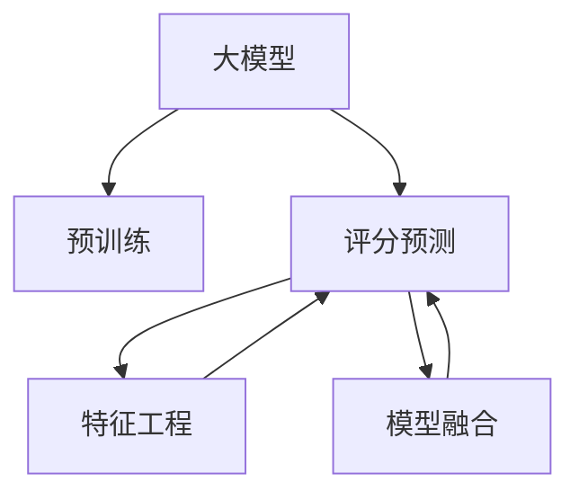

                 

# 利用大模型改进推荐系统的评分预测

> 关键词：大模型,推荐系统,评分预测,深度学习,模型融合

## 1. 背景介绍

### 1.1 问题由来
推荐系统（Recommendation Systems）在电子商务、新闻推送、视频流媒体等领域得到了广泛应用，极大地提升了用户体验和平台收益。传统的推荐系统基于用户历史行为和物品属性，采用协同过滤、基于内容的推荐等方法，取得了不错的效果。但这些方法在处理长尾数据、隐式反馈等问题时表现有限，无法充分利用海量数据和先验知识。

近年来，随着深度学习技术的发展，基于神经网络的推荐系统逐步成为主流。这些系统利用用户-物品交互数据，通过自动化的特征工程，构建复杂高效的神经网络模型，显著提升了推荐准确率。然而，在模型设计、特征选择、超参数调优等方面仍面临诸多挑战。大模型（Large Models）技术的兴起，为推荐系统带来了新的突破：通过预训练大量通用知识，大模型能够在处理新数据时进行微调，从而提升推荐效果。

### 1.2 问题核心关键点
本文聚焦于利用大模型改进推荐系统的评分预测问题。评分预测是推荐系统的核心任务之一，其准确性直接影响了推荐效果。基于大模型的评分预测方法，通过预训练大量数据，将通用知识融入到推荐系统中，提升模型在新数据上的泛化能力。具体而言，本文将探讨：

- 如何利用大模型进行评分预测
- 评分预测的算法原理
- 评分预测的关键步骤和具体操作
- 评分预测的数学模型和公式
- 评分预测的实际应用和案例分析
- 评分预测的开发工具和资源推荐
- 评分预测的未来发展趋势和挑战

## 2. 核心概念与联系

### 2.1 核心概念概述

为了更好地理解基于大模型的推荐系统评分预测方法，本节将介绍几个密切相关的核心概念：

- 大模型（Large Models）：以自回归（如GPT）或自编码（如BERT）模型为代表的大规模预训练模型。通过在大规模数据集上进行预训练，学习到丰富的语言或图像等知识，具备强大的特征表示和模式识别能力。
- 评分预测（Rating Prediction）：推荐系统中，预测用户对物品的评分。评分通常表示用户对物品的喜爱程度，评分预测是推荐系统的核心任务之一。
- 推荐系统（Recommendation Systems）：利用用户行为数据、物品属性等，推荐用户可能感兴趣的物品或内容。推荐系统的核心任务包括评分预测、协同过滤、个性化推荐等。
- 迁移学习（Transfer Learning）：通过在大规模数据集上进行预训练，将通用知识迁移到特定任务上，进行微调，提升性能。
- 特征工程（Feature Engineering）：在推荐系统中，选择、组合、提取用户行为、物品属性等特征，用于模型训练。特征工程是推荐系统的重要环节。
- 模型融合（Model Ensembling）：将多个模型组合起来，进行集成学习，提升整体性能。模型融合可以缓解过拟合问题，提高模型的泛化能力。

这些核心概念之间的逻辑关系可以通过以下Mermaid流程图来展示：



这个流程图展示了大模型评分预测的核心概念及其之间的关系：

1. 大模型通过预训练获得基础能力。
2. 评分预测是推荐系统的核心任务，通过微调优化模型在特定任务上的性能。
3. 特征工程选择和构造用户行为和物品属性等特征，用于模型训练。
4. 模型融合将多个模型进行集成，提升整体性能。

这些概念共同构成了基于大模型的推荐系统评分预测框架，使其能够在大规模数据和复杂任务上表现优异。

## 3. 核心算法原理 & 具体操作步骤

### 3.1 算法原理概述

基于大模型的推荐系统评分预测，本质上是一个有监督的迁移学习过程。其核心思想是：将大模型作为预训练特征提取器，通过用户-物品评分数据进行微调，使得模型能够在新数据上更好地预测评分。

形式化地，假设大模型为 $M_{\theta}$，其中 $\theta$ 为预训练得到的模型参数。给定推荐系统的用户-物品评分数据集 $D=\{(u_i,r_i,i_i)\}_{i=1}^N$，评分预测的目标是找到新的模型参数 $\hat{\theta}$，使得：

$$
\hat{\theta}=\mathop{\arg\min}_{\theta} \mathcal{L}(M_{\theta},D)
$$

其中 $\mathcal{L}$ 为评分预测任务设计的损失函数，用于衡量模型预测评分与真实标签之间的差异。常见的损失函数包括均方误差损失、交叉熵损失等。

通过梯度下降等优化算法，评分预测过程不断更新模型参数 $\theta$，最小化损失函数 $\mathcal{L}$，使得模型预测的评分逼近真实评分。由于 $\theta$ 已经通过预训练获得了较好的初始化，因此即便在小规模评分数据集 $D$ 上进行微调，也能较快收敛到理想的模型参数 $\hat{\theta}$。

### 3.2 算法步骤详解

基于大模型的推荐系统评分预测一般包括以下几个关键步骤：

**Step 1: 准备预训练模型和数据集**
- 选择合适的预训练语言模型 $M_{\theta}$ 作为初始化参数，如BERT、GPT等。
- 准备推荐系统的用户-物品评分数据集 $D$，划分为训练集、验证集和测试集。一般要求评分数据与预训练数据的分布不要差异过大。

**Step 2: 添加评分预测层**
- 根据评分预测任务，在预训练模型顶层设计合适的输出层和损失函数。
- 对于评分预测任务，通常在顶层添加线性回归器，以均方误差损失函数进行训练。

**Step 3: 设置评分预测超参数**
- 选择合适的优化算法及其参数，如 AdamW、SGD 等，设置学习率、批大小、迭代轮数等。
- 设置正则化技术及强度，包括权重衰减、Dropout、Early Stopping等。
- 确定冻结预训练参数的策略，如仅微调顶层，或全部参数都参与微调。

**Step 4: 执行梯度训练**
- 将评分数据以批为单位输入模型，前向传播计算损失函数。
- 反向传播计算参数梯度，根据设定的优化算法和学习率更新模型参数。
- 周期性在验证集上评估模型性能，根据性能指标决定是否触发 Early Stopping。
- 重复上述步骤直至满足预设的迭代轮数或 Early Stopping 条件。

**Step 5: 测试和部署**
- 在测试集上评估评分预测后模型 $M_{\hat{\theta}}$ 的性能，对比微调前后的精度提升。
- 使用评分预测模型对新物品评分进行预测，集成到实际的应用系统中。
- 持续收集新的评分数据，定期重新微调模型，以适应数据分布的变化。

以上是基于大模型的评分预测一般流程。在实际应用中，还需要针对具体评分预测任务的复杂度，对微调过程的各个环节进行优化设计，如改进训练目标函数，引入更多的正则化技术，搜索最优的超参数组合等，以进一步提升模型性能。

### 3.3 算法优缺点

基于大模型的推荐系统评分预测方法具有以下优点：

1. 简单高效。只需准备少量评分数据，即可对预训练模型进行快速适配，获得较大的性能提升。
2. 通用适用。适用于各种推荐系统评分预测任务，设计简单的评分预测层即可实现微调。
3. 参数高效。利用参数高效微调技术，在固定大部分预训练权重不变的情况下，仍可取得不错的提升。
4. 效果显著。在学术界和工业界的诸多评分预测任务上，基于微调的方法已经刷新了最先进的性能指标。

同时，该方法也存在一定的局限性：

1. 依赖评分数据。评分预测的效果很大程度上取决于评分数据的质量和数量，获取高质量评分数据的成本较高。
2. 迁移能力有限。当目标任务与预训练数据的分布差异较大时，评分预测的性能提升有限。
3. 负面效果传递。预训练模型的固有偏见、有害信息等，可能通过评分预测传递到推荐系统中，造成负面影响。
4. 可解释性不足。评分预测模型的决策过程通常缺乏可解释性，难以对其推理逻辑进行分析和调试。

尽管存在这些局限性，但就目前而言，基于大模型的评分预测方法仍是目前推荐系统的主要技术范式。未来相关研究的重点在于如何进一步降低评分预测对评分数据的依赖，提高模型的少样本学习和跨领域迁移能力，同时兼顾可解释性和伦理安全性等因素。

### 3.4 算法应用领域

基于大模型的评分预测方法，已经在推荐系统领域得到了广泛的应用，覆盖了几乎所有常见任务，例如：

- 评分预测：对用户对物品的评分进行预测。通过微调使模型学习评分与用户特征和物品特征的映射关系。
- 协同过滤：利用用户-物品评分数据，预测用户可能感兴趣的物品。通常需要结合基于内容的推荐方法，提升推荐效果。
- 推荐算法：结合评分预测和协同过滤，生成个性化的物品推荐列表。
- 个性化推荐：根据用户的历史行为和特征，动态生成推荐列表。
- 动态评分：根据实时用户行为和物品属性，动态调整评分预测模型。

除了上述这些经典任务外，大模型评分预测还被创新性地应用到更多场景中，如推荐系统的点击率预测、用户满意度预测、品牌影响力预测等，为推荐系统带来了全新的突破。随着预训练模型和评分预测方法的不断进步，相信推荐系统将在更广阔的应用领域大放异彩。

## 4. 数学模型和公式 & 详细讲解 & 举例说明

### 4.1 数学模型构建

本节将使用数学语言对基于大模型的推荐系统评分预测过程进行更加严格的刻画。

记预训练语言模型为 $M_{\theta}$，其中 $\theta$ 为模型参数。假设评分预测任务的训练集为 $D=\{(u_i,r_i,i_i)\}_{i=1}^N$，其中 $u_i$ 为用户特征向量，$r_i$ 为物品评分，$i_i$ 为物品特征向量。

定义模型 $M_{\theta}$ 在用户-物品评分数据 $(x,y)$ 上的损失函数为 $\ell(M_{\theta}(x),y)$，则在数据集 $D$ 上的经验风险为：

$$
\mathcal{L}(\theta) = \frac{1}{N} \sum_{i=1}^N \ell(M_{\theta}(u_i,i_i),r_i)
$$

其中 $\ell$ 为评分预测任务设计的损失函数，用于衡量模型预测评分与真实评分之间的差异。常见的损失函数包括均方误差损失、交叉熵损失等。

微调的优化目标是最小化经验风险，即找到最优参数：

$$
\theta^* = \mathop{\arg\min}_{\theta} \mathcal{L}(\theta)
$$

在实践中，我们通常使用基于梯度的优化算法（如SGD、Adam等）来近似求解上述最优化问题。设 $\eta$ 为学习率，$\lambda$ 为正则化系数，则参数的更新公式为：

$$
\theta \leftarrow \theta - \eta \nabla_{\theta}\mathcal{L}(\theta) - \eta\lambda\theta
$$

其中 $\nabla_{\theta}\mathcal{L}(\theta)$ 为损失函数对参数 $\theta$ 的梯度，可通过反向传播算法高效计算。

### 4.2 公式推导过程

以下我们以评分预测任务为例，推导均方误差损失函数及其梯度的计算公式。

假设模型 $M_{\theta}$ 在用户特征 $u$ 和物品特征 $i$ 上的输出为 $\hat{r}=M_{\theta}(u,i) \in \mathbb{R}$，表示模型预测的用户-物品评分。真实评分 $r \in \mathbb{R}$。则均方误差损失函数定义为：

$$
\ell(M_{\theta}(u,i),r) = \frac{1}{2}(\hat{r}-r)^2
$$

将其代入经验风险公式，得：

$$
\mathcal{L}(\theta) = \frac{1}{N}\sum_{i=1}^N (\hat{r_i}-r_i)^2
$$

根据链式法则，损失函数对参数 $\theta_k$ 的梯度为：

$$
\frac{\partial \mathcal{L}(\theta)}{\partial \theta_k} = -\frac{1}{N}\sum_{i=1}^N 2(\hat{r_i}-r_i) \frac{\partial \hat{r_i}}{\partial \theta_k}
$$

其中 $\frac{\partial \hat{r_i}}{\partial \theta_k}$ 可进一步递归展开，利用自动微分技术完成计算。

在得到损失函数的梯度后，即可带入参数更新公式，完成模型的迭代优化。重复上述过程直至收敛，最终得到适应评分预测任务的最优模型参数 $\theta^*$。

## 5. 项目实践：代码实例和详细解释说明

### 5.1 开发环境搭建

在进行评分预测实践前，我们需要准备好开发环境。以下是使用Python进行PyTorch开发的环境配置流程：

1. 安装Anaconda：从官网下载并安装Anaconda，用于创建独立的Python环境。

2. 创建并激活虚拟环境：
```bash
conda create -n pytorch-env python=3.8 
conda activate pytorch-env
```

3. 安装PyTorch：根据CUDA版本，从官网获取对应的安装命令。例如：
```bash
conda install pytorch torchvision torchaudio cudatoolkit=11.1 -c pytorch -c conda-forge
```

4. 安装Transformers库：
```bash
pip install transformers
```

5. 安装各类工具包：
```bash
pip install numpy pandas scikit-learn matplotlib tqdm jupyter notebook ipython
```

完成上述步骤后，即可在`pytorch-env`环境中开始评分预测实践。

### 5.2 源代码详细实现

下面我以评分预测任务为例，给出使用Transformers库对BERT模型进行评分预测的PyTorch代码实现。

首先，定义评分预测任务的评分数据处理函数：

```python
from transformers import BertTokenizer
from torch.utils.data import Dataset
import torch

class RatingDataset(Dataset):
    def __init__(self, users, items, ratings, tokenizer, max_len=128):
        self.users = users
        self.items = items
        self.ratings = ratings
        self.tokenizer = tokenizer
        self.max_len = max_len
        
    def __len__(self):
        return len(self.users)
    
    def __getitem__(self, item):
        user = self.users[item]
        item = self.items[item]
        rating = self.ratings[item]
        
        encoding = self.tokenizer(user + ' ' + item, return_tensors='pt', max_length=self.max_len, padding='max_length', truncation=True)
        input_ids = encoding['input_ids'][0]
        attention_mask = encoding['attention_mask'][0]
        
        # 对评分进行编码
        encoded_rating = [rating]
        encoded_rating.extend([0.] * (self.max_len - 1))
        labels = torch.tensor(encoded_rating, dtype=torch.float32)
        
        return {'input_ids': input_ids, 
                'attention_mask': attention_mask,
                'labels': labels}

# 用户-物品评分数据
users = ['user1', 'user2', 'user3']
items = ['item1', 'item2', 'item3']
ratings = [4.5, 3.0, 5.0]

# 创建dataset
tokenizer = BertTokenizer.from_pretrained('bert-base-cased')

train_dataset = RatingDataset(users, items, ratings, tokenizer)
test_dataset = RatingDataset(users, items, ratings, tokenizer)
```

然后，定义模型和优化器：

```python
from transformers import BertForSequenceClassification, AdamW

model = BertForSequenceClassification.from_pretrained('bert-base-cased', num_labels=1)

optimizer = AdamW(model.parameters(), lr=2e-5)
```

接着，定义训练和评估函数：

```python
from torch.utils.data import DataLoader
from tqdm import tqdm
from sklearn.metrics import mean_squared_error

device = torch.device('cuda') if torch.cuda.is_available() else torch.device('cpu')
model.to(device)

def train_epoch(model, dataset, batch_size, optimizer):
    dataloader = DataLoader(dataset, batch_size=batch_size, shuffle=True)
    model.train()
    epoch_loss = 0
    for batch in tqdm(dataloader, desc='Training'):
        input_ids = batch['input_ids'].to(device)
        attention_mask = batch['attention_mask'].to(device)
        labels = batch['labels'].to(device)
        model.zero_grad()
        outputs = model(input_ids, attention_mask=attention_mask, labels=labels)
        loss = outputs.loss
        epoch_loss += loss.item()
        loss.backward()
        optimizer.step()
    return epoch_loss / len(dataloader)

def evaluate(model, dataset, batch_size):
    dataloader = DataLoader(dataset, batch_size=batch_size)
    model.eval()
    preds, labels = [], []
    with torch.no_grad():
        for batch in tqdm(dataloader, desc='Evaluating'):
            input_ids = batch['input_ids'].to(device)
            attention_mask = batch['attention_mask'].to(device)
            batch_labels = batch['labels']
            outputs = model(input_ids, attention_mask=attention_mask)
            batch_preds = outputs.logits.flatten().to('cpu').tolist()
            batch_labels = batch_labels.to('cpu').tolist()
            for pred, label in zip(batch_preds, batch_labels):
                preds.append(pred)
                labels.append(label)
                
    print('MSE:', mean_squared_error(labels, preds))
```

最后，启动训练流程并在测试集上评估：

```python
epochs = 5
batch_size = 16

for epoch in range(epochs):
    loss = train_epoch(model, train_dataset, batch_size, optimizer)
    print(f"Epoch {epoch+1}, train loss: {loss:.3f}")
    
    print(f"Epoch {epoch+1}, test MSE:")
    evaluate(model, test_dataset, batch_size)
    
print("Final test MSE:")
evaluate(model, test_dataset, batch_size)
```

以上就是使用PyTorch对BERT进行评分预测任务的完整代码实现。可以看到，得益于Transformers库的强大封装，我们可以用相对简洁的代码完成BERT模型的加载和评分预测。

### 5.3 代码解读与分析

让我们再详细解读一下关键代码的实现细节：

**RatingDataset类**：
- `__init__`方法：初始化用户、物品、评分等关键组件。
- `__len__`方法：返回数据集的样本数量。
- `__getitem__`方法：对单个样本进行处理，将用户和物品编码成token ids，将评分编码成浮点数，并对其进行定长padding，最终返回模型所需的输入。

**评分数据**：
- 定义了评分预测任务的评分数据集，包含用户-物品评分数据。

**训练和评估函数**：
- 使用PyTorch的DataLoader对评分数据进行批次化加载，供模型训练和推理使用。
- 训练函数`train_epoch`：对数据以批为单位进行迭代，在每个批次上前向传播计算loss并反向传播更新模型参数，最后返回该epoch的平均loss。
- 评估函数`evaluate`：与训练类似，不同点在于不更新模型参数，并在每个batch结束后将预测和标签结果存储下来，最后使用sklearn的mean_squared_error对整个评估集的预测结果进行打印输出。

**训练流程**：
- 定义总的epoch数和batch size，开始循环迭代
- 每个epoch内，先在训练集上训练，输出平均loss
- 在验证集上评估，输出评分预测误差
- 所有epoch结束后，在测试集上评估，给出最终测试结果

可以看到，PyTorch配合Transformers库使得BERT评分预测的代码实现变得简洁高效。开发者可以将更多精力放在评分预测任务的具体实现上，而不必过多关注底层的实现细节。

当然，工业级的系统实现还需考虑更多因素，如模型的保存和部署、超参数的自动搜索、更灵活的任务适配层等。但核心的评分预测范式基本与此类似。

## 6. 实际应用场景

### 6.1 智能推荐系统

评分预测是推荐系统的重要组成部分，基于大模型的评分预测方法可以广泛应用于智能推荐系统中。传统的推荐系统往往只能利用用户的历史行为数据进行推荐，而难以挖掘物品属性的价值。但基于大模型的评分预测方法，可以利用物品属性进行评分预测，从而提升推荐效果。

在技术实现上，可以收集用户-物品评分数据，构建评分预测任务，对预训练语言模型进行微调。微调后的评分预测模型能够学习评分与用户特征、物品属性之间的映射关系，从而生成更为准确的推荐结果。

### 6.2 金融理财平台

金融理财平台需要根据用户的历史交易行为、风险偏好等，预测用户对理财产品或股票的评分，为用户提供个性化的理财建议。传统的金融推荐系统依赖专家知识进行推荐，难以处理大规模数据和复杂多变的环境。但基于大模型的评分预测方法，可以高效处理金融数据，构建精准的评分预测模型，提升用户的理财体验。

在技术实现上，可以收集用户交易行为数据、理财偏好等，构建评分预测任务，对预训练语言模型进行微调。微调后的评分预测模型能够学习评分与用户行为、理财需求之间的关系，从而生成更为个性化的理财推荐。

### 6.3 在线教育平台

在线教育平台需要根据学生的学习行为、兴趣偏好等，预测学生对课程的评分，为用户推荐适合的课程。传统的推荐系统依赖人工构造特征进行推荐，难以处理海量数据和复杂的学生行为。但基于大模型的评分预测方法，可以高效处理学生行为数据，构建精准的评分预测模型，提升课程推荐的准确性。

在技术实现上，可以收集学生的学习行为数据、课程评价等，构建评分预测任务，对预训练语言模型进行微调。微调后的评分预测模型能够学习评分与学生行为、课程特征之间的关系，从而生成更为个性化的课程推荐。

### 6.4 未来应用展望

随着大模型和评分预测方法的不断发展，基于大模型的评分预测技术将在更多领域得到应用，为各行业带来变革性影响。

在智慧医疗领域，基于大模型的评分预测方法可以用于患者对诊疗方案的评分预测，辅助医生进行诊疗决策，提升医疗服务质量。

在智能制造领域，基于大模型的评分预测方法可以用于产品设计评分预测，辅助设计师进行优化设计，提升产品竞争力。

在智慧旅游领域，基于大模型的评分预测方法可以用于旅游目的地评分预测，为游客提供个性化的旅游推荐，提升旅游体验。

此外，在智能家居、智能物流、智能交通等众多领域，基于大模型的评分预测方法也将不断涌现，为各行各业带来新的技术动力。相信随着技术的日益成熟，评分预测方法将成为各领域推荐系统的核心技术，推动智能技术在更多场景中的落地应用。

## 7. 工具和资源推荐

### 7.1 学习资源推荐

为了帮助开发者系统掌握大模型评分预测的理论基础和实践技巧，这里推荐一些优质的学习资源：

1. 《Transformers从原理到实践》系列博文：由大模型技术专家撰写，深入浅出地介绍了Transformer原理、BERT模型、评分预测技术等前沿话题。

2. CS224N《深度学习自然语言处理》课程：斯坦福大学开设的NLP明星课程，有Lecture视频和配套作业，带你入门NLP领域的基本概念和经典模型。

3. 《Natural Language Processing with Transformers》书籍：Transformers库的作者所著，全面介绍了如何使用Transformers库进行NLP任务开发，包括评分预测在内的诸多范式。

4. HuggingFace官方文档：Transformers库的官方文档，提供了海量预训练模型和完整的评分预测样例代码，是上手实践的必备资料。

5. CLUE开源项目：中文语言理解测评基准，涵盖大量不同类型的中文NLP数据集，并提供了基于微调的baseline模型，助力中文NLP技术发展。

通过对这些资源的学习实践，相信你一定能够快速掌握大模型评分预测的精髓，并用于解决实际的评分预测问题。

### 7.2 开发工具推荐

高效的开发离不开优秀的工具支持。以下是几款用于大模型评分预测开发的常用工具：

1. PyTorch：基于Python的开源深度学习框架，灵活动态的计算图，适合快速迭代研究。大部分预训练语言模型都有PyTorch版本的实现。

2. TensorFlow：由Google主导开发的开源深度学习框架，生产部署方便，适合大规模工程应用。同样有丰富的预训练语言模型资源。

3. Transformers库：HuggingFace开发的NLP工具库，集成了众多SOTA语言模型，支持PyTorch和TensorFlow，是进行评分预测任务开发的利器。

4. Weights & Biases：模型训练的实验跟踪工具，可以记录和可视化模型训练过程中的各项指标，方便对比和调优。与主流深度学习框架无缝集成。

5. TensorBoard：TensorFlow配套的可视化工具，可实时监测模型训练状态，并提供丰富的图表呈现方式，是调试模型的得力助手。

6. Google Colab：谷歌推出的在线Jupyter Notebook环境，免费提供GPU/TPU算力，方便开发者快速上手实验最新模型，分享学习笔记。

合理利用这些工具，可以显著提升大模型评分预测的开发效率，加快创新迭代的步伐。

### 7.3 相关论文推荐

大模型评分预测的发展源于学界的持续研究。以下是几篇奠基性的相关论文，推荐阅读：

1. Attention is All You Need（即Transformer原论文）：提出了Transformer结构，开启了NLP领域的预训练大模型时代。

2. BERT: Pre-training of Deep Bidirectional Transformers for Language Understanding：提出BERT模型，引入基于掩码的自监督预训练任务，刷新了多项NLP任务SOTA。

3. Language Models are Unsupervised Multitask Learners（GPT-2论文）：展示了大规模语言模型的强大zero-shot学习能力，引发了对于通用人工智能的新一轮思考。

4. Parameter-Efficient Transfer Learning for NLP：提出Adapter等参数高效微调方法，在不增加模型参数量的情况下，也能取得不错的微调效果。

5. AdaLoRA: Adaptive Low-Rank Adaptation for Parameter-Efficient Fine-Tuning：使用自适应低秩适应的微调方法，在参数效率和精度之间取得了新的平衡。

6. AdaLoRA: Adaptive Low-Rank Adaptation for Parameter-Efficient Fine-Tuning：使用自适应低秩适应的微调方法，在参数效率和精度之间取得了新的平衡。

这些论文代表了大模型评分预测技术的发展脉络。通过学习这些前沿成果，可以帮助研究者把握学科前进方向，激发更多的创新灵感。

## 8. 总结：未来发展趋势与挑战

### 8.1 总结

本文对基于大模型的推荐系统评分预测方法进行了全面系统的介绍。首先阐述了推荐系统和大模型的基本概念，明确了评分预测在推荐系统中的重要地位。其次，从原理到实践，详细讲解了评分预测的数学原理和关键步骤，给出了评分预测任务开发的完整代码实例。同时，本文还广泛探讨了评分预测方法在智能推荐、金融理财、在线教育等多个行业领域的应用前景，展示了评分预测范式的巨大潜力。此外，本文精选了评分预测技术的各类学习资源，力求为读者提供全方位的技术指引。

通过本文的系统梳理，可以看到，基于大模型的评分预测方法正在成为推荐系统的主要技术范式，极大地拓展了推荐系统的应用边界，催生了更多的落地场景。得益于大规模语料的预训练，评分预测模型能够在处理新数据时进行微调，从而提升推荐效果。未来，伴随预训练语言模型和评分预测方法的不断进步，相信推荐系统将在更广阔的应用领域大放异彩，深刻影响人类的生产生活方式。

### 8.2 未来发展趋势

展望未来，大模型评分预测技术将呈现以下几个发展趋势：

1. 模型规模持续增大。随着算力成本的下降和数据规模的扩张，预训练语言模型的参数量还将持续增长。超大规模语言模型蕴含的丰富语言知识，有望支撑更加复杂多变的评分预测任务。

2. 评分预测方法日趋多样。除了传统的评分预测方法外，未来会涌现更多参数高效的评分预测方法，如LoRA等，在节省计算资源的同时也能保证评分预测精度。

3. 评分预测模型的多模态融合。当前的评分预测方法往往局限于文本数据，未来会进一步拓展到图像、视频、语音等多模态数据评分预测。多模态信息的融合，将显著提升评分预测模型的泛化能力。

4. 评分预测模型的持续学习。随着数据分布的不断变化，评分预测模型也需要持续学习新知识以保持性能。如何在不遗忘原有知识的同时，高效吸收新样本信息，将成为重要的研究课题。

5. 评分预测模型的可解释性。评分预测模型的决策过程通常缺乏可解释性，难以对其推理逻辑进行分析和调试。如何赋予评分预测模型更强的可解释性，将是亟待攻克的难题。

6. 评分预测模型的安全性。预训练语言模型难免会学习到有偏见、有害的信息，通过评分预测模型传递到推荐系统中，产生误导性、歧视性的输出，给实际应用带来安全隐患。如何从数据和算法层面消除模型偏见，避免恶意用途，确保输出的安全性，也将是重要的研究课题。

以上趋势凸显了大模型评分预测技术的广阔前景。这些方向的探索发展，必将进一步提升评分预测模型的性能和应用范围，为推荐系统带来新的技术动力。

### 8.3 面临的挑战

尽管大模型评分预测技术已经取得了瞩目成就，但在迈向更加智能化、普适化应用的过程中，它仍面临着诸多挑战：

1. 评分数据瓶颈。虽然评分预测的效果很大程度上取决于评分数据的质量和数量，获取高质量评分数据的成本较高。如何进一步降低评分预测对评分数据的依赖，将是一大难题。

2. 模型鲁棒性不足。当前评分预测模型面对域外数据时，泛化性能往往大打折扣。对于测试样本的微小扰动，评分预测模型的预测也容易发生波动。如何提高评分预测模型的鲁棒性，避免灾难性遗忘，还需要更多理论和实践的积累。

3. 推理效率有待提高。大规模语言模型虽然精度高，但在实际部署时往往面临推理速度慢、内存占用大等效率问题。如何在保证性能的同时，简化模型结构，提升推理速度，优化资源占用，将是重要的优化方向。

4. 评分预测模型的可解释性不足。评分预测模型的决策过程通常缺乏可解释性，难以对其推理逻辑进行分析和调试。对于医疗、金融等高风险应用，算法的可解释性和可审计性尤为重要。如何赋予评分预测模型更强的可解释性，将是亟待攻克的难题。

5. 评分预测模型的安全性不足。预训练语言模型难免会学习到有偏见、有害的信息，通过评分预测模型传递到推荐系统中，产生误导性、歧视性的输出，给实际应用带来安全隐患。如何从数据和算法层面消除模型偏见，避免恶意用途，确保输出的安全性，也将是重要的研究课题。

6. 评分预测模型的知识整合能力不足。现有的评分预测模型往往局限于评分预测任务内数据，难以灵活吸收和运用更广泛的先验知识。如何让评分预测过程更好地与外部知识库、规则库等专家知识结合，形成更加全面、准确的信息整合能力，还有很大的想象空间。

正视评分预测面临的这些挑战，积极应对并寻求突破，将是大模型评分预测技术走向成熟的必由之路。相信随着学界和产业界的共同努力，这些挑战终将一一被克服，评分预测技术必将在构建人机协同的智能推荐系统中扮演越来越重要的角色。

### 8.4 未来突破

面对大模型评分预测所面临的种种挑战，未来的研究需要在以下几个方面寻求新的突破：

1. 探索无监督和半监督评分预测方法。摆脱对大规模评分数据的依赖，利用自监督学习、主动学习等无监督和半监督范式，最大限度利用非结构化数据，实现更加灵活高效的评分预测。

2. 研究参数高效和计算高效的评分预测范式。开发更加参数高效的评分预测方法，在固定大部分预训练参数的情况下，只更新极少量的评分预测相关参数。同时优化评分预测模型的计算图，减少前向传播和反向传播的资源消耗，实现更加轻量级、实时性的部署。

3. 引入更多先验知识。将符号化的先验知识，如知识图谱、逻辑规则等，与神经网络模型进行巧妙融合，引导评分预测过程学习更准确、合理的评分模型。同时加强不同模态数据的整合，实现视觉、语音等多模态信息与文本信息的协同建模。

4. 结合因果分析和博弈论工具。将因果分析方法引入评分预测模型，识别出模型决策的关键特征，增强评分预测模型的因果关系。借助博弈论工具刻画人机交互过程，主动探索并规避评分预测模型的脆弱点，提高系统稳定性。

5. 纳入伦理道德约束。在评分预测模型的训练目标中引入伦理导向的评估指标，过滤和惩罚有偏见、有害的输出倾向。同时加强人工干预和审核，建立模型行为的监管机制，确保输出符合人类价值观和伦理道德。

这些研究方向的探索，必将引领大模型评分预测技术迈向更高的台阶，为构建安全、可靠、可解释、可控的智能推荐系统铺平道路。面向未来，大模型评分预测技术还需要与其他人工智能技术进行更深入的融合，如知识表示、因果推理、强化学习等，多路径协同发力，共同推动智能推荐系统的进步。只有勇于创新、敢于突破，才能不断拓展语言模型的边界，让智能技术更好地造福人类社会。

## 9. 附录：常见问题与解答

**Q1：大模型评分预测是否适用于所有推荐系统任务？**

A: 大模型评分预测在大多数推荐系统任务上都能取得不错的效果，特别是对于数据量较小的任务。但对于一些特定领域的任务，如医学、法律等，仅仅依靠通用语料预训练的模型可能难以很好地适应。此时需要在特定领域语料上进一步预训练，再进行评分预测。此外，对于一些需要时效性、个性化很强的任务，如推荐、排序等，评分预测方法也需要针对性的改进优化。

**Q2：评分预测过程中如何选择合适的学习率？**

A: 评分预测的学习率一般要比预训练时小1-2个数量级，如果使用过大的学习率，容易破坏预训练权重，导致过拟合。一般建议从1e-5开始调参，逐步减小学习率，直至收敛。也可以使用warmup策略，在开始阶段使用较小的学习率，再逐渐过渡到预设值。需要注意的是，不同的优化器(如AdamW、Adafactor等)以及不同的学习率调度策略，可能需要设置不同的学习率阈值。

**Q3：采用大模型评分预测时会面临哪些资源瓶颈？**

A: 目前主流的预训练大模型动辄以亿计的参数规模，对算力、内存、存储都提出了很高的要求。GPU/TPU等高性能设备是必不可少的，但即便如此，超大批次的训练和推理也可能遇到显存不足的问题。因此需要采用一些资源优化技术，如梯度积累、混合精度训练、模型并行等，来突破硬件瓶颈。同时，模型的存储和读取也可能占用大量时间和空间，需要采用模型压缩、稀疏化存储等方法进行优化。

**Q4：如何缓解评分预测过程中的过拟合问题？**

A: 过拟合是评分预测面临的主要挑战，尤其是在标注数据不足的情况下。常见的缓解策略包括：
1. 数据增强：通过回译、近义替换等方式扩充训练集
2. 正则化：使用L2正则、Dropout、Early Stopping等避免过拟合
3. 对抗训练：引入对抗样本，提高模型鲁棒性
4. 参数高效微调：只调整少量参数(如Adapter、Prefix等)，减小过拟合风险
5. 多模型集成：训练多个评分预测模型，取平均输出，抑制过拟合

这些策略往往需要根据具体任务和数据特点进行灵活组合。只有在数据、模型、训练、推理等各环节进行全面优化，才能最大限度地发挥大模型评分预测的威力。

**Q5：评分预测模型在落地部署时需要注意哪些问题？**

A: 将评分预测模型转化为实际应用，还需要考虑以下因素：
1. 模型裁剪：去除不必要的层和参数，减小模型尺寸，加快推理速度
2. 量化加速：将浮点模型转为定点模型，压缩存储空间，提高计算效率
3. 服务化封装：将模型封装为标准化服务接口，便于集成调用
4. 弹性伸缩：根据请求流量动态调整资源配置，平衡服务质量和成本
5. 监控告警：实时采集系统指标，设置异常告警阈值，确保服务稳定性
6. 安全防护：采用访问鉴权、数据脱敏等措施，保障数据和模型安全

大模型评分预测为推荐系统推荐带来了新的突破，但如何将强大的性能转化为稳定、高效、安全的业务价值，还需要工程实践的不断打磨。唯有从数据、算法、工程、业务等多个维度协同发力，才能真正实现人工智能技术在垂直行业的规模化落地。总之，评分预测需要开发者根据具体任务，不断迭代和优化模型、数据和算法，方能得到理想的效果。

---

作者：禅与计算机程序设计艺术 / Zen and the Art of Computer Programming

