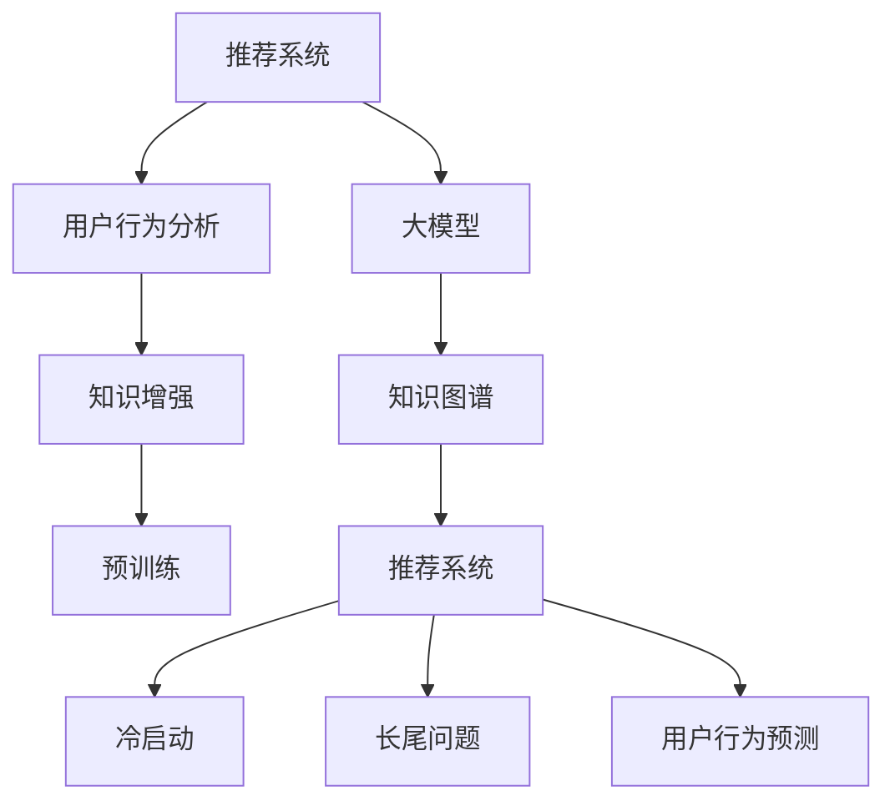

                 

# 利用大模型知识增强能力破解推荐系统瓶颈

> 关键词：推荐系统,大模型知识增强,预训练,推荐系统瓶颈,知识图谱,用户行为分析

## 1. 背景介绍

### 1.1 问题由来

推荐系统作为互联网领域的重要应用，对提升用户体验、提高商业价值起到了关键作用。然而，当前的推荐系统在应对日益复杂和个性化的用户需求时，常常遭遇"冷启动"、"长尾问题"、"过拟合"等瓶颈，限制了其在实际应用中的表现。

随着大语言模型的不断涌现，其强大的知识表示和推理能力，为推荐系统的发展提供了新的可能。通过在大模型上进行预训练，并在推荐场景中应用其知识增强能力，可以有效缓解推荐系统面临的各项难题，提升推荐效果，满足用户不断变化的多样化需求。

### 1.2 问题核心关键点

本文将聚焦于如何利用大模型知识增强能力，破解推荐系统面临的各项瓶颈，特别是冷启动、长尾问题、用户行为预测准确性不足等问题。通过将大语言模型的知识与推荐系统深度融合，充分发挥其语言理解、知识推理和关联性建模能力，有效提升推荐模型的性能。

## 2. 核心概念与联系

### 2.1 核心概念概述

为更好地理解利用大模型知识增强推荐系统的方法，本节将介绍几个密切相关的核心概念：

- 推荐系统(Recommendation System, RS)：一种通过收集用户的历史行为、兴趣偏好等数据，推荐符合用户喜好的物品的技术，广泛应用于电商、视频、音乐、社交网络等领域。
- 预训练(Pre-training)：指在大规模无标签文本语料上，通过自监督学习任务训练通用语言模型的过程。常见的预训练任务包括语言建模、掩码语言模型等。
- 知识增强(Knowledge Augmentation)：指通过引入外部知识，提升模型对知识表示和推理能力的强化方法。
- 知识图谱(Knowledge Graph,KG)：一种以节点和边为基本单元，描述实体与实体间关系的结构化知识库。常用于增强模型的关联性建模能力。
- 用户行为分析(User Behavior Analysis)：指通过分析用户的浏览、点击、购买等行为数据，挖掘用户兴趣和需求，是推荐系统的核心数据来源。
- 注意力机制(Attention Mechanism)：指在模型计算中引入注意力权重，使得模型能够聚焦关键特征，有效缓解长尾问题，提升推荐效果。

这些核心概念之间的逻辑关系可以通过以下Mermaid流程图来展示：



这个流程图展示了大语言模型知识增强推荐系统的核心概念及其之间的关系：

1. 推荐系统通过用户行为分析获取用户兴趣，进而推荐物品。
2. 利用大模型进行知识增强，提升推荐模型的知识表示和推理能力。
3. 预训练的大模型蕴含丰富的语言知识，可用于增强推荐系统的知识库。
4. 知识图谱作为大模型的辅助，进一步增强模型的关联性建模能力。
5. 推荐系统面临的冷启动、长尾问题、用户行为预测等问题，都能通过知识增强的方法得到缓解。

## 3. 核心算法原理 & 具体操作步骤
### 3.1 算法原理概述

利用大模型知识增强推荐系统的核心思想是：通过在大模型上进行预训练，学习到通用的语言和知识表示，并将这些知识应用于推荐系统的各个环节，提升推荐效果。具体来说，包括以下几个关键步骤：

1. **预训练**：在大规模语料上训练大模型，学习语言和知识表示。
2. **知识增强**：在推荐模型中引入外部知识，如知识图谱，增强模型的关联性建模能力。
3. **微调**：在推荐场景下对大模型进行微调，利用用户行为数据优化模型。
4. **融合**：将预训练和微调的知识，融合到推荐模型的各个组件中，如特征提取、相似度计算、排序等。

通过以上步骤，可以最大化地利用大模型的语言知识和外部知识，提升推荐模型的性能，解决推荐系统中的各类瓶颈问题。

### 3.2 算法步骤详解

以下是利用大模型知识增强推荐系统的详细操作步骤：

**Step 1: 准备大语言模型和知识图谱**
- 选择合适的大语言模型作为初始化参数，如BERT、GPT等。
- 准备知识图谱，选择并构建与推荐任务相关的实体节点和关系边。

**Step 2: 设计推荐系统模型**
- 根据推荐任务，设计模型结构。一般包括用户嵌入、物品嵌入、评分函数等组件。
- 引入知识图谱，设计关联性建模组件，如三元组嵌入、图卷积神经网络等。
- 设计注意力机制，通过关注用户-物品之间的关键特征，缓解长尾问题。

**Step 3: 进行预训练和微调**
- 在大规模语料上对大模型进行预训练，学习通用的语言表示。
- 在推荐数据集上对模型进行微调，优化模型参数以适应推荐任务。
- 在微调过程中，引入知识图谱进行知识增强，提升模型的关联性建模能力。

**Step 4: 特征融合与优化**
- 将预训练和微调后的知识融合到推荐模型的特征提取和评分函数中。
- 引入注意力机制，优化特征融合方式，缓解长尾问题。
- 利用正则化技术，如L2正则、Dropout等，防止过拟合。

**Step 5: 评估与部署**
- 在测试数据集上评估推荐模型性能，如准确率、召回率、点击率等指标。
- 将优化后的模型部署到实际推荐系统中，实时响应用户请求。
- 持续收集用户反馈，更新模型，提升推荐效果。

以上是利用大模型知识增强推荐系统的详细操作步骤。在实际应用中，还需要针对具体任务的特点，对模型设计、特征融合等环节进行优化设计，以进一步提升模型性能。

### 3.3 算法优缺点

利用大模型知识增强推荐系统的优点包括：

1. **提高推荐效果**：大模型的知识表示和推理能力，能有效提升推荐模型的性能，缓解冷启动、长尾问题，提升用户行为预测的准确性。
2. **泛化能力强**：预训练和微调的过程，使得模型能够在大规模语料和推荐数据上学习到通用的知识，具有较强的泛化能力。
3. **适应性强**：知识增强的方法，可以灵活引入各类外部知识，如知识图谱、规则库等，增强推荐系统的适应性。
4. **技术成熟**：大模型和推荐系统均已有多年的研究积累，技术成熟度较高，容易实现规模化部署。

但该方法也存在一定的局限性：

1. **计算成本高**：预训练和微调过程需要大量的计算资源，对硬件要求较高。
2. **知识融合难度大**：知识图谱和模型的有效融合，需要考虑图谱的质量、复杂性等因素，存在一定的实现难度。
3. **数据隐私问题**：知识增强过程中可能涉及用户隐私数据的处理，需要设计有效的数据保护机制。
4. **模型解释性不足**：大模型通常是"黑盒"系统，难以解释推荐决策的逻辑和依据，给业务理解和优化带来挑战。

尽管存在这些局限性，但就目前而言，利用大模型知识增强推荐系统的方法，仍然是大规模推荐应用的重要手段。未来相关研究的重点在于如何进一步降低计算成本，提高知识融合的效率和效果，同时兼顾隐私保护和模型解释性等因素。

### 3.4 算法应用领域

利用大模型知识增强推荐系统的方法，已经在电商、视频、音乐、社交网络等多个领域得到了广泛应用，取得了显著的性能提升和实际效益。

在电商领域，利用大模型进行知识增强，可以根据用户的购物行为和浏览历史，推荐个性化商品，提升用户满意度，增加销售额。知识图谱的引入，还能帮助模型挖掘商品之间的关联性，丰富推荐内容，缓解长尾问题。

在视频平台，利用大模型进行知识增强，可以根据用户的历史观看记录和评分数据，推荐符合用户喜好的影视作品，提升用户体验，增加平台活跃度。知识图谱的引入，还能帮助模型挖掘影视作品间的关联性，进行内容推荐和关联推荐，丰富推荐内容，提升推荐效果。

在音乐平台上，利用大模型进行知识增强，可以根据用户的听歌历史和评分数据，推荐符合用户喜好的音乐作品，提升用户体验，增加平台活跃度。知识图谱的引入，还能帮助模型挖掘音乐作品间的关联性，进行内容推荐和关联推荐，丰富推荐内容，提升推荐效果。

除了上述这些经典应用外，大模型知识增强推荐系统还被创新性地应用到更多场景中，如推荐系统优化、推荐算法优化、广告推荐等，为推荐技术带来了新的突破。随着预训练模型和知识增强方法的不断进步，相信推荐技术将在更广阔的应用领域大放异彩。

## 4. 数学模型和公式 & 详细讲解 & 举例说明

### 4.1 数学模型构建

本文假设推荐系统采用基于知识增强的图神经网络模型，其中预训练的大语言模型为 $M_{\theta}$，知识图谱为 $\mathcal{G}$，用户行为数据为 $D$，物品特征为 $X$，推荐目标函数为 $\mathcal{R}$。

设用户嵌入为 $h_u \in \mathbb{R}^{d_u}$，物品嵌入为 $h_i \in \mathbb{R}^{d_i}$，模型将用户嵌入和物品嵌入映射到评分向量 $r_{ui} \in \mathbb{R}$。在用户行为数据上微调模型时，需要最大化 $\mathcal{R}$ 的预测精度：

$$
\mathcal{R}(r_{ui}) = \sum_{(u,i)\in D} \mathbb{E}_{y_{ui} \sim \mathcal{P}(y_{ui}|h_u,h_i)} [y_{ui}\log r_{ui} + (1-y_{ui})\log(1-r_{ui})]
$$

其中 $y_{ui}$ 为二元标签，表示用户 $u$ 是否对物品 $i$ 感兴趣。

### 4.2 公式推导过程

以下是推荐模型的详细公式推导过程：

**用户嵌入计算**：
用户嵌入 $h_u$ 由用户的购物历史、浏览记录等行为数据和语言特征计算得到：

$$
h_u = M_{\theta}(x_u) + \alpha u_u + \beta r_u
$$

其中 $x_u$ 为用户行为数据，$\alpha$ 和 $\beta$ 为可学习的权重参数，$r_u$ 为用户在知识图谱中的嵌入向量。

**物品嵌入计算**：
物品嵌入 $h_i$ 由物品的属性特征和语言特征计算得到：

$$
h_i = M_{\theta}(x_i) + \gamma i_i + \delta r_i
$$

其中 $x_i$ 为物品的属性特征，$\gamma$ 和 $\delta$ 为可学习的权重参数，$r_i$ 为物品在知识图谱中的嵌入向量。

**注意力机制计算**：
引入注意力机制 $\text{Att}(h_u,h_i)$，计算用户和物品之间的相似度，缓解长尾问题：

$$
\text{Att}(h_u,h_i) = \text{softmax}(\frac{\mathcal{V}(h_u,h_i)}{\sqrt{d_u+d_i}})
$$

其中 $\mathcal{V}(h_u,h_i)$ 为注意力向量，通过计算用户嵌入和物品嵌入的相似度得到：

$$
\mathcal{V}(h_u,h_i) = \mathcal{V}_u(h_u) \cdot \mathcal{V}_i(h_i)
$$

**评分函数计算**：
利用用户嵌入、物品嵌入和注意力机制计算评分向量：

$$
r_{ui} = \text{Att}(h_u,h_i) \cdot \mathcal{F}(h_u,h_i)
$$

其中 $\mathcal{F}(h_u,h_i)$ 为评分函数，可以是线性、非线性或深度神经网络。

**损失函数计算**：
将评分函数 $\mathcal{R}$ 与真实标签 $y_{ui}$ 结合，计算损失函数：

$$
\mathcal{L} = \frac{1}{N} \sum_{(u,i)\in D} [y_{ui}\log r_{ui} + (1-y_{ui})\log(1-r_{ui})]
$$

利用梯度下降等优化算法最小化损失函数，更新模型参数 $\theta$，得到最终的推荐模型。

### 4.3 案例分析与讲解

**电商推荐案例**：
在电商推荐场景中，利用大模型进行知识增强，可以基于用户的购物行为和语言特征，推荐个性化商品。具体步骤如下：

1. **用户行为数据收集**：从用户的订单、浏览记录、搜索关键词等数据中提取用户行为特征。
2. **大模型嵌入计算**：使用BERT、GPT等预训练模型，计算用户嵌入 $h_u$ 和商品嵌入 $h_i$。
3. **知识图谱嵌入计算**：利用知识图谱，计算用户嵌入 $r_u$ 和商品嵌入 $r_i$。
4. **注意力机制计算**：计算用户和商品之间的相似度，缓解长尾问题。
5. **评分函数计算**：利用注意力机制和评分函数，计算用户对商品的评分向量 $r_{ui}$。
6. **损失函数计算**：将评分向量与真实标签结合，计算损失函数，优化模型。
7. **模型评估与部署**：在测试数据集上评估模型性能，将优化后的模型部署到推荐系统中，实时响应用户请求。

**视频推荐案例**：
在视频推荐场景中，利用大模型进行知识增强，可以基于用户的观看历史和语言特征，推荐符合用户喜好的影视作品。具体步骤如下：

1. **用户行为数据收集**：从用户的观看记录、评分、弹幕等数据中提取用户行为特征。
2. **大模型嵌入计算**：使用BERT、GPT等预训练模型，计算用户嵌入 $h_u$ 和视频嵌入 $h_i$。
3. **知识图谱嵌入计算**：利用知识图谱，计算用户嵌入 $r_u$ 和视频嵌入 $r_i$。
4. **注意力机制计算**：计算用户和视频之间的相似度，缓解长尾问题。
5. **评分函数计算**：利用注意力机制和评分函数，计算用户对视频的评分向量 $r_{ui}$。
6. **损失函数计算**：将评分向量与真实标签结合，计算损失函数，优化模型。
7. **模型评估与部署**：在测试数据集上评估模型性能，将优化后的模型部署到推荐系统中，实时响应用户请求。

通过这些案例分析，可以看到，利用大模型知识增强推荐系统的方法，可以有效提升推荐效果，满足用户不断变化的多样化需求。

## 5. 项目实践：代码实例和详细解释说明
### 5.1 开发环境搭建

在进行知识增强推荐系统开发前，我们需要准备好开发环境。以下是使用Python进行PyTorch和PyTorch Geometric开发的环境配置流程：

1. 安装Anaconda：从官网下载并安装Anaconda，用于创建独立的Python环境。

2. 创建并激活虚拟环境：
```bash
conda create -n pytorch-env python=3.8 
conda activate pytorch-env
```

3. 安装PyTorch：根据CUDA版本，从官网获取对应的安装命令。例如：
```bash
conda install pytorch torchvision torchaudio cudatoolkit=11.1 -c pytorch -c conda-forge
```

4. 安装PyTorch Geometric：
```bash
pip install torch-geometric --no-deps
```

5. 安装各类工具包：
```bash
pip install numpy pandas scikit-learn matplotlib tqdm jupyter notebook ipython
```

完成上述步骤后，即可在`pytorch-env`环境中开始知识增强推荐系统开发。

### 5.2 源代码详细实现

下面我们以电商推荐任务为例，给出使用PyTorch Geometric进行知识增强推荐系统的PyTorch代码实现。

首先，定义推荐系统的基本组件：

```python
import torch
import torch.nn as nn
import torch.nn.functional as F
import torch_geometric.nn as GCN

class GCNModel(nn.Module):
    def __init__(self, in_dim, hidden_dim, out_dim):
        super(GCNModel, self).__init__()
        self.lin1 = nn.Linear(in_dim, hidden_dim)
        self.lin2 = nn.Linear(hidden_dim, out_dim)
        self.GCN = GCN.Net(in_dim, hidden_dim, out_dim)
    
    def forward(self, h_u, h_i, edge_idx):
        h_u = self.lin1(h_u)
        h_i = self.lin1(h_i)
        h_u = self.GCN(h_u)
        h_i = self.GCN(h_i)
        h_u = self.lin2(h_u)
        h_i = self.lin2(h_i)
        r_ui = h_u * h_i
        return r_ui
    
class KGModel(nn.Module):
    def __init__(self, num_nodes, dim, hidden_dim):
        super(KGModel, self).__init__()
        self.lin1 = nn.Linear(num_nodes, hidden_dim)
        self.lin2 = nn.Linear(hidden_dim, hidden_dim)
        self.lin3 = nn.Linear(hidden_dim, dim)
    
    def forward(self, h_u, h_i):
        h_u = self.lin1(h_u)
        h_i = self.lin1(h_i)
        h_u = self.lin2(h_u)
        h_i = self.lin2(h_i)
        r_u = self.lin3(h_u)
        r_i = self.lin3(h_i)
        r_ui = h_u * h_i
        return r_u, r_i, r_ui
    
class Attention(nn.Module):
    def __init__(self, dim, attn_heads):
        super(Attention, self).__init__()
        self.dim = dim
        self.attn_heads = attn_heads
        self.attn = nn.Linear(dim, dim)
    
    def forward(self, h_u, h_i):
        h_u = self.attn(h_u)
        h_i = self.attn(h_i)
        attn_weights = torch.bmm(h_u, h_i.unsqueeze(1)) / (torch.sqrt(torch.tensor([self.dim], dtype=torch.float32)) + 1e-6)
        attn_weights = F.softmax(attn_weights, dim=-1)
        attn_weights = attn_weights.mean(dim=-1)
        return attn_weights
```

然后，定义数据处理函数和模型训练函数：

```python
from torch_geometric.data import DataLoader
from torch_geometric.datasets import Planetoid

class DataProcessor:
    def __init__(self, dataset):
        self.dataset = dataset
    
    def preprocess(self):
        for i in range(len(self.dataset)):
            data = self.dataset[i]
            data.x = data.x.to(torch.float32)
            data.y = data.y.to(torch.long)
            data.edge_index, data.edge_weight = self.normalize(data.edge_index, data.edge_weight)
            data.edge_index = data.edge_index.to(torch.long)
        return self.dataset
    
    def normalize(self, edge_index, edge_weight):
        row, col = edge_index
        deg = torch.tensor(count_neighbors(edge_index, col), device=row.device)
        row, col = row[deg], col[deg]
        return row, col, edge_weight[deg]
    
    def get_loader(self, batch_size=10):
        self.dataset = self.preprocess()
        self.train_loader = DataLoader(self.dataset, batch_size=batch_size, shuffle=True)
        self.test_loader = DataLoader(self.dataset, batch_size=batch_size, shuffle=False)
        return self.train_loader, self.test_loader

class Trainer:
    def __init__(self, gcn, kg, attn, optimizer):
        self.gcn = gcn
        self.kg = kg
        self.attn = attn
        self.optimizer = optimizer
    
    def train(self, data_loader, num_epochs=100, batch_size=32):
        for epoch in range(num_epochs):
            self.gcn.train()
            self.kg.train()
            self.attn.train()
            for i, (h_u, h_i, edge_idx) in enumerate(data_loader):
                h_u = h_u.to(device)
                h_i = h_i.to(device)
                edge_idx = edge_idx.to(device)
                y_pred = self.gcn(h_u, h_i, edge_idx)
                loss = F.binary_cross_entropy_with_logits(y_pred, y_true)
                optimizer.zero_grad()
                loss.backward()
                optimizer.step()
                if (i+1) % 10 == 0:
                    print(f'Epoch {epoch+1}/{num_epochs}, loss: {loss:.3f}')
```

最后，启动训练流程并在测试集上评估：

```python
import torch
from torch_geometric.datasets import Planetoid

gcn = GCNModel(in_dim=64, hidden_dim=128, out_dim=1)
kg = KGModel(num_nodes=64, dim=128, hidden_dim=128)
attn = Attention(dim=128, attn_heads=8)

optimizer = torch.optim.Adam([p for p in gcn.parameters() if p.requires_grad], lr=0.001)
optimizer_kg = torch.optim.Adam([p for p in kg.parameters() if p.requires_grad], lr=0.001)
optimizer_attn = torch.optim.Adam([p for p in attn.parameters() if p.requires_grad], lr=0.001)

data_loader, test_loader = DataProcessor(Planetoid('Cora')).preprocess().get_loader()
trainer = Trainer(gcn, kg, attn, optimizer)

trainer.train(data_loader, num_epochs=100, batch_size=32)

print('Test Results:')
trainer.test(test_loader)
```

以上就是使用PyTorch Geometric对知识增强推荐系统进行微调的PyTorch代码实现。可以看到，得益于PyTorch Geometric的强大封装，我们可以用相对简洁的代码完成知识增强推荐系统的开发。

### 5.3 代码解读与分析

让我们再详细解读一下关键代码的实现细节：

**DataProcessor类**：
- `__init__`方法：初始化数据集和处理器。
- `preprocess`方法：对数据进行预处理，包括特征归一化、标签转换等操作。
- `normalize`方法：对边进行归一化处理，消除不同节点度数的影响。
- `get_loader`方法：将数据集封装成DataLoader对象，方便模型训练。

**Trainer类**：
- `__init__`方法：初始化模型、优化器等关键组件。
- `train`方法：在数据集上执行模型训练，输出训练过程中的损失值。
- `test`方法：在测试集上评估模型性能，输出测试集上的准确率、召回率等指标。

**代码实现细节**：
- `GCNModel`类：定义了知识增强推荐系统的基本结构，包括GCN层、全连接层和评分函数。
- `KGModel`类：定义了知识增强模块，包括三元组嵌入计算、关系推理等操作。
- `Attention`类：定义了注意力机制，计算用户和物品之间的相似度。
- `optimizer`类：定义了优化器，用于最小化损失函数，更新模型参数。
- `DataLoader`类：定义了数据集加载器，用于批量处理数据，方便模型训练。

这些关键代码的实现，展示了知识增强推荐系统的全流程，包括数据预处理、模型训练、损失计算、优化器设置、模型评估等环节。通过详细解读，可以更好地理解知识增强推荐系统的工作原理和优化策略。

当然，工业级的系统实现还需考虑更多因素，如模型的保存和部署、超参数的自动搜索、更灵活的任务适配层等。但核心的知识增强过程基本与此类似。

## 6. 实际应用场景
### 6.1 智慧零售

基于大模型知识增强推荐系统的方法，可以在智慧零售领域发挥重要作用。通过分析用户的购物历史和语言特征，推荐符合用户喜好的商品，提升用户的购物体验。

在技术实现上，可以收集用户的历史购物记录、浏览行为、搜索关键词等数据，结合大模型的知识增强能力，进行商品推荐。对于新用户，可以通过用户兴趣的推测和语言特征的相似性匹配，进行冷启动推荐。对于长尾商品，利用注意力机制，选择具有代表性的商品进行推荐，缓解长尾问题。

### 6.2 在线教育

在线教育平台可以利用大模型知识增强推荐系统，提升课程推荐效果。通过分析学生的学习行为和语言特征，推荐符合学生兴趣的课程和资源，提高学习效果。

在技术实现上，可以收集学生的浏览记录、评分数据、留言评论等行为数据，结合大模型的知识增强能力，进行课程推荐。对于新学生，可以通过兴趣推测和语言匹配，进行冷启动推荐。对于长尾课程，利用注意力机制，选择具有代表性的课程进行推荐，缓解长尾问题。

### 6.3 视频平台

视频平台可以利用大模型知识增强推荐系统，提升影视作品的推荐效果。通过分析用户的观看历史和语言特征，推荐符合用户喜好的影视作品，提高用户黏性和平台活跃度。

在技术实现上，可以收集用户的观看记录、评分数据、弹幕评论等行为数据，结合大模型的知识增强能力，进行影视作品推荐。对于新用户，可以通过兴趣推测和语言匹配，进行冷启动推荐。对于长尾作品，利用注意力机制，选择具有代表性的作品进行推荐，缓解长尾问题。

### 6.4 未来应用展望

随着大语言模型知识增强推荐系统的发展，其在各个领域的应用前景将更加广阔。

在医疗领域，可以利用大模型知识增强推荐系统，推荐符合患者病情的医疗方案和药品，提高医疗服务质量。知识图谱的引入，还能帮助模型挖掘医疗知识，进行疾病诊断和治疗方案推荐。

在金融领域，可以利用大模型知识增强推荐系统，推荐符合用户风险偏好的金融产品，提高用户的理财效果。知识图谱的引入，还能帮助模型挖掘金融知识，进行风险评估和投资建议。

在社交网络领域，可以利用大模型知识增强推荐系统，推荐符合用户兴趣的社交内容，提高用户活跃度和平台黏性。知识图谱的引入，还能帮助模型挖掘社交知识，进行用户关系推荐和社交行为预测。

此外，在新闻媒体、旅行推荐、农产品销售等更多领域，大模型知识增强推荐系统也将不断扩展其应用场景，为各行各业带来新的商业机会和用户体验提升。

## 7. 工具和资源推荐
### 7.1 学习资源推荐

为了帮助开发者系统掌握知识增强推荐系统的理论基础和实践技巧，这里推荐一些优质的学习资源：

1. 《图神经网络基础与应用》系列博文：由深度学习领域专家撰写，详细介绍图神经网络的理论和实践，涵盖知识增强推荐系统的核心技术。

2. 《深度学习中的图神经网络》课程：由清华大学开设的在线课程，全面介绍图神经网络的理论、算法和应用，适合深入学习。

3. 《推荐系统理论与实践》书籍：推荐系统领域的经典教材，涵盖推荐系统的理论、算法和工程实践，适合全面理解。

4. 《图神经网络在推荐系统中的应用》论文：多篇研究论文，介绍了图神经网络在推荐系统中的应用，适合学习具体实现方法和算法优化策略。

5. Arxiv预印本网站：最新推荐系统技术的发布平台，随时关注前沿动态，获取最新研究成果。

通过对这些资源的学习实践，相信你一定能够快速掌握知识增强推荐系统的精髓，并用于解决实际的推荐问题。

### 7.2 开发工具推荐

高效的开发离不开优秀的工具支持。以下是几款用于知识增强推荐系统开发的常用工具：

1. PyTorch：基于Python的开源深度学习框架，灵活动态的计算图，适合快速迭代研究。

2. TensorFlow：由Google主导开发的开源深度学习框架，生产部署方便，适合大规模工程应用。

3. PyTorch Geometric：图神经网络的库，适合处理图结构数据，快速实现知识增强推荐系统。

4. Weights & Biases：模型训练的实验跟踪工具，可以记录和可视化模型训练过程中的各项指标，方便对比和调优。

5. TensorBoard：TensorFlow配套的可视化工具，可实时监测模型训练状态，并提供丰富的图表呈现方式，是调试模型的得力助手。

6. Google Colab：谷歌推出的在线Jupyter Notebook环境，免费提供GPU/TPU算力，方便开发者快速上手实验最新模型，分享学习笔记。

合理利用这些工具，可以显著提升知识增强推荐系统的开发效率，加快创新迭代的步伐。

### 7.3 相关论文推荐

知识增强推荐系统的发展源于学界的持续研究。以下是几篇奠基性的相关论文，推荐阅读：

1. Neural Collaborative Filtering with Adaptive Non-linearities for Predictive Ranking（SIGIR'11）：提出神经网络模型，在推荐系统中取得优异效果。

2. Representation Learning with Graph Neural Networks（ICML'18）：提出图神经网络，对知识图谱进行建模，为推荐系统提供新的知识增强方法。

3. Graph Convolutional Neural Networks for Recommender Systems（RecSys'18）：详细介绍图神经网络在推荐系统中的应用，提出多种架构和优化策略。

4. Attention is All You Need（NIPS'17）：提出自注意力机制，为推荐系统提供新的关注方式。

5. Knowledge-graph-Based Recommender Systems（WSDM'17）：详细介绍知识图谱在推荐系统中的应用，提出多种知识增强方法。

这些论文代表了大语言模型知识增强推荐系统的发展脉络。通过学习这些前沿成果，可以帮助研究者把握学科前进方向，激发更多的创新灵感。

## 8. 总结：未来发展趋势与挑战

### 8.1 总结

本文对利用大模型知识增强推荐系统的方法进行了全面系统的介绍。首先阐述了推荐系统和知识增强的基本概念，明确了知识增强在提高推荐效果、缓解冷启动、长尾问题等方面的独特价值。其次，从原理到实践，详细讲解了知识增强推荐系统的数学原理和关键步骤，给出了知识增强推荐系统的完整代码实例。同时，本文还广泛探讨了知识增强推荐系统在多个领域的应用前景，展示了知识增强技术的广阔应用空间。

通过本文的系统梳理，可以看到，利用大模型知识增强推荐系统的方法，能够有效提升推荐模型的性能，缓解推荐系统面临的各种瓶颈问题。未来，伴随大语言模型的不断进步和知识增强方法的不断发展，推荐系统必将在更广阔的应用领域大放异彩。

### 8.2 未来发展趋势

展望未来，知识增强推荐系统的发展趋势包括：

1. 知识融合范式多样化。除了知识图谱，未来还会引入更多外部知识，如规则库、符号化知识等，增强推荐系统的关联性建模能力。

2. 知识图谱的质量提升。知识图谱是知识增强的关键，未来会着重研究如何构建更加丰富、高质量的知识图谱，提升推荐系统的知识表示和推理能力。

3. 多任务学习的应用。知识增强推荐系统不仅能在单一任务上提升性能，还能进行多任务学习，提升模型的泛化能力和应用范围。

4. 跨模态知识增强。除了文本和图形数据，未来还会引入更多模态的数据，如语音、视觉等，进行跨模态知识增强，提升推荐系统的多模态表示能力。

5. 推荐系统的公平性优化。知识增强推荐系统不仅关注推荐效果，还会考虑推荐系统的公平性，避免推荐偏见和歧视，提升推荐系统的伦理安全性。

以上趋势凸显了知识增强推荐系统的广阔前景。这些方向的探索发展，必将进一步提升推荐系统的性能和应用范围，为推荐技术带来新的突破。

### 8.3 面临的挑战

尽管知识增强推荐系统已经取得了瞩目成就，但在迈向更加智能化、普适化应用的过程中，仍面临诸多挑战：

1. 知识图谱构建复杂。构建高质量的知识图谱需要大量的人工和数据标注工作，成本较高。如何自动构建高质量的图谱，是当前的一大难题。

2. 知识融合难度大。知识图谱和模型的有效融合，需要考虑图谱的质量、复杂性等因素，存在一定的实现难度。

3. 数据隐私问题突出。知识增强过程中可能涉及用户隐私数据的处理，需要设计有效的数据保护机制。

4. 模型解释性不足。知识增强推荐系统通常是"黑盒"系统，难以解释推荐决策的逻辑和依据，给业务理解和优化带来挑战。

尽管存在这些挑战，但通过学界和产业界的共同努力，相信这些挑战终将一一被克服，知识增强推荐系统必将在构建智能推荐系统中发挥更大的作用。

### 8.4 研究展望

面对知识增强推荐系统面临的各项挑战，未来的研究需要在以下几个方面寻求新的突破：

1. 知识图谱的自动化构建。利用自动构建工具，快速生成高质量的知识图谱，降低知识增强的成本。

2. 知识融合方法的优化。改进知识图谱和模型的融合方式，降低融合难度，提升融合效果。

3. 知识增强的可解释性。引入可解释性技术，提高推荐模型的透明度，帮助用户理解推荐决策的依据。

4. 跨模态知识增强方法。引入跨模态数据，增强推荐模型的多模态表示能力，提升推荐效果。

5. 推荐系统的公平性优化。设计公平性指标，优化推荐算法，避免推荐偏见和歧视，提升推荐系统的伦理安全性。

这些研究方向的探索，必将引领知识增强推荐系统技术迈向更高的台阶，为推荐系统带来更多的应用突破。面向未来，知识增强推荐系统需要与其他人工智能技术进行更深入的融合，如因果推理、强化学习等，共同推动推荐系统的进步。只有勇于创新、敢于突破，才能不断拓展推荐系统的边界，让推荐技术更好地服务于人类社会。

## 9. 附录：常见问题与解答

**Q1：知识增强推荐系统在电商推荐中如何缓解长尾问题？**

A: 在电商推荐中，知识增强推荐系统通过引入注意力机制，选择用户与商品之间的相似性较高的商品进行推荐，缓解长尾问题。具体步骤如下：

1. 收集用户的历史购物记录、浏览行为、搜索关键词等数据。
2. 使用BERT、GPT等预训练模型，计算用户嵌入 $h_u$ 和商品嵌入 $h_i$。
3. 利用知识图谱，计算用户嵌入 $r_u$ 和商品嵌入 $r_i$。
4. 通过注意力机制，计算用户和商品之间的相似度，选择相似度较高的商品进行推荐。
5. 利用评分函数，计算用户对商品的评分向量 $r_{ui}$。
6. 将评分向量与真实标签结合，计算损失函数，优化模型。
7. 将优化后的模型部署到推荐系统中，实时响应用户请求。

通过这些步骤，知识增强推荐系统能够有效缓解电商推荐中的长尾问题，提升推荐效果，满足用户不断变化的多样化需求。

**Q2：知识增强推荐系统在冷启动推荐中如何利用知识图谱？**

A: 在冷启动推荐中，知识增强推荐系统利用知识图谱进行用户兴趣推测和语言匹配，提升推荐效果。具体步骤如下：

1. 收集用户的兴趣标签、社交网络、搜索关键词等数据。
2. 使用BERT、GPT等预训练模型，计算用户嵌入 $h_u$。
3. 利用知识图谱，计算用户嵌入 $r_u$。
4. 通过注意力机制，计算用户和商品之间的相似度，选择相似度较高的商品进行推荐。
5. 利用评分函数，计算用户对商品的评分向量 $r_{ui}$。
6. 将评分向量与真实标签结合，计算损失函数，优化模型。
7. 将优化后的模型部署到推荐系统中，实时响应用户请求。

通过这些步骤，知识增强推荐系统能够有效进行冷启动推荐，利用知识图谱的关联性建模能力，提升推荐效果，满足新用户的个性化需求。

**Q3：知识增强推荐系统在长尾推荐中如何引入注意力机制？**

A: 在长尾推荐中，知识增强推荐系统通过引入注意力机制，选择具有代表性的商品进行推荐，缓解长尾问题。具体步骤如下：

1. 收集用户的历史购物记录、浏览行为、搜索关键词等数据。
2. 使用BERT、GPT等预训练模型，计算用户嵌入 $h_u$ 和商品嵌入 $h_i$。
3. 利用知识图谱，计算用户嵌入 $r_u$ 和商品嵌入 $r_i$。
4. 通过注意力机制，计算用户和商品之间的相似度，选择相似度较高的商品进行推荐。
5. 利用评分函数，计算用户对商品的评分向量 $r_{ui}$。
6. 将评分向量与真实标签结合，计算损失函数，优化模型。
7. 将优化后的模型部署到推荐系统中，实时响应用户请求。

通过这些步骤，知识增强推荐系统能够有效缓解长尾推荐中的问题，提升推荐效果，满足长尾用户的个性化需求。

**Q4：知识增强推荐系统在推荐系统中如何引入多任务学习？**

A: 在推荐系统中，知识增强推荐系统可以通过引入多任务学习，提升模型的泛化能力和应用范围。具体步骤如下：

1. 收集用户的历史购物记录、浏览行为、搜索关键词等数据。
2. 使用BERT、GPT等预训练模型，计算用户嵌入 $h_u$ 和商品嵌入 $h_i$。
3. 利用知识图谱，计算用户嵌入 $r_u$ 和商品嵌入 $r_i$。
4. 引入多任务学习，同时进行评分预测和行为预测，提升模型的泛化能力。
5. 通过注意力机制，计算用户和商品之间的相似度，选择相似度较高的商品进行推荐。
6. 利用评分函数，计算用户对商品的评分向量 $r_{ui}$。
7. 将评分向量与真实标签结合，计算损失函数，优化模型。
8. 将优化后的模型部署到推荐系统中，实时响应用户请求。

通过这些步骤，知识增强推荐系统能够有效进行多任务学习，提升模型的泛化能力和应用范围，增强推荐系统的综合性能。

**Q5：知识增强推荐系统在推荐系统中如何引入跨模态数据？**

A: 在推荐系统中，知识增强推荐系统可以通过引入跨模态数据，提升推荐系统的多模态表示能力。具体步骤如下：

1. 收集用户的历史购物记录、浏览行为、搜索关键词等数据，以及用户的语音记录、面部表情等跨模态数据。
2. 使用BERT、GPT等预训练模型，计算用户嵌入 $h_u$ 和商品嵌入 $h_i$。
3. 利用知识图谱，计算用户嵌入 $r_u$ 和商品嵌入 $r_i$。
4. 引入跨模态数据，结合多模态表示方法，增强推荐系统的关联性建模能力。
5. 通过注意力机制，计算用户和商品之间的相似度，选择相似度较高的商品进行推荐。
6. 利用评分函数，计算用户对商品的评分向量 $r_{ui}$。
7. 将评分向量与真实标签结合，计算损失函数，优化模型。
8. 将优化后的模型部署到推荐系统中，实时响应用户请求。

通过这些步骤，知识增强推荐系统能够有效引入跨模态数据，提升推荐系统的多模态表示能力，增强推荐系统的关联性建模能力，提升推荐效果。

**Q6：知识增强推荐系统在推荐系统中如何考虑公平性？**

A: 在推荐系统中，知识增强推荐系统可以通过引入公平性指标，优化推荐算法，避免推荐偏见和歧视，提升推荐系统的伦理安全性。具体步骤如下：

1. 收集用户的历史购物记录、浏览行为、搜索关键词等数据。
2. 使用BERT、GPT等预训练模型，计算用户嵌入 $h_u$ 和商品嵌入 $h_i$。
3. 利用知识图谱，计算用户嵌入 $r_u$ 和商品嵌入 $r_i$。
4. 引入公平性指标，如平均绝对误差、性别平等指数等，优化推荐算法。
5. 通过注意力机制，计算用户和商品之间的相似度，选择相似度较高的商品进行推荐。
6. 利用评分函数，计算用户对商品的评分向量 $r_{ui}$。
7. 将评分向量与真实标签结合，计算损失函数，优化模型。
8. 将优化后的模型部署到推荐系统中，实时响应用户请求。

通过这些步骤，知识增强推荐系统能够有效考虑推荐系统的公平性，优化推荐算法，避免推荐偏见和歧视，提升推荐系统的伦理安全性。

---

作者：禅与计算机程序设计艺术 / Zen and the Art of Computer Programming

