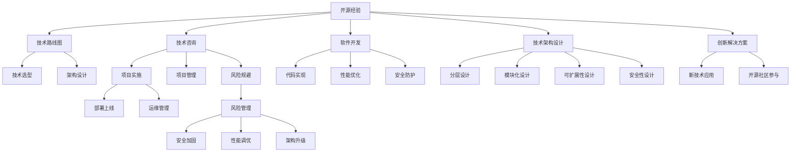

                 

# 利用开源经验提供技术路线图咨询服务

> 关键词：开源经验,技术路线图,咨询服务,软件开发,技术架构设计,创新解决方案

## 1. 背景介绍

### 1.1 问题由来
在当前快速变化的IT行业中，企业越来越依赖于技术创新来保持竞争力。然而，技术更新迭代速度之快、新技术的涌现层出不穷，使得企业在技术和架构设计上时常面临困境：

1. **技术栈选择**：在众多开源技术和框架中，如何选择合适的技术栈和架构设计，以满足业务需求的同时，兼顾成本和效率？
2. **架构演进**：随着业务发展和技术进步，原有的架构如何演进和扩展，以适应新需求？
3. **技术风险**：如何识别和规避技术风险，确保架构的稳定性和可靠性？
4. **创新解决方案**：如何利用最新技术趋势和开源经验，提供创新性的解决方案？

面对这些问题，很多企业往往缺乏系统的技术路线图和专业指导，导致项目进度滞后、成本增加，甚至导致项目失败。此时，技术咨询服务就显得尤为重要。

### 1.2 问题核心关键点
技术咨询服务的目标是通过系统的技术路线图，结合开源经验和最佳实践，为企业提供全方位的技术解决方案。具体来说，核心关键点包括：

- **技术栈选择**：根据业务需求，选择合适的开源技术栈和架构设计。
- **架构演进**：基于现有架构，设计合理的演进路径，以适应业务发展和新技术的变化。
- **技术风险规避**：识别技术风险，提供有效的解决方案，确保架构的稳定性和可靠性。
- **创新解决方案**：结合最新技术趋势和开源经验，提供创新性的解决方案，提升业务竞争力。

本文将系统介绍如何利用开源经验和最佳实践，为企业提供技术路线图咨询服务，帮助其在复杂多变的IT环境中，做出明智的技术决策。

## 2. 核心概念与联系

### 2.1 核心概念概述

为更好地理解技术路线图咨询服务，本节将介绍几个密切相关的核心概念：

- **开源经验(Open Source Experience)**：指基于开源技术进行软件开发和架构设计的经验和方法。包括技术选择、架构设计、性能优化、安全防护等各个方面。
- **技术路线图(Technology Roadmap)**：指针对特定业务目标和技术目标，制定的一个技术演进和发展计划，包括技术栈选择、架构设计、技术演进、风险规避等各个环节。
- **技术咨询(IT Consulting)**：指专业咨询人员结合客户业务需求，提供系统的技术路线图和解决方案，指导客户进行技术选型、架构设计、项目实施等各个环节。
- **软件开发(Software Development)**：指利用各种编程语言、开发工具、版本控制系统等技术，进行软件的编写、测试、部署和维护。
- **技术架构设计(Architecture Design)**：指基于业务需求和技术目标，设计合理的软件架构，包括分层、模块化、可扩展性、安全性等各个方面。
- **创新解决方案(Innovative Solutions)**：指利用最新的技术趋势和开源经验，提供创新性的技术方案，解决传统方法难以解决的问题。

这些核心概念之间的逻辑关系可以通过以下Mermaid流程图来展示：



这个流程图展示了我們技术服务的一般流程：

1. 从开源经验出发，进行技术路线图的设计。
2. 结合技术咨询，提供系统的技术方案。
3. 利用软件开发工具，进行实际的代码实现。
4. 基于技术架构设计，实现模块化和可扩展的架构。
5. 应用创新解决方案，提升技术方案的创新性和前瞻性。
6. 通过项目实施和运维管理，确保系统的稳定性和可靠性。

这些概念共同构成了技术服务的一般框架，确保客户能够获得全面的技术支持。

## 3. 核心算法原理 & 具体操作步骤
### 3.1 算法原理概述

技术路线图咨询服务的核心算法原理，是基于系统的技术栈选择、架构设计、技术演进、风险规避等各个环节，结合开源经验和最佳实践，提供一套系统的技术解决方案。具体来说，算法原理包括：

- **技术栈选择**：根据业务需求和系统目标，选择合适的开源技术和工具栈。
- **架构设计**：基于业务需求和技术目标，设计合理的架构设计，确保系统的模块化、可扩展性和安全性。
- **技术演进**：基于现有架构，设计合理的技术演进路径，以适应业务发展和新技术的变化。
- **风险规避**：识别技术风险，提供有效的解决方案，确保架构的稳定性和可靠性。

这些环节通过逻辑推理和实践经验相结合，形成了系统的技术路线图。

### 3.2 算法步骤详解

技术路线图咨询服务的算法步骤主要包括：

**Step 1: 需求分析**
- 与客户进行深入沟通，了解其业务需求、技术目标和现有系统情况。
- 分析客户的业务流程、数据流和性能需求，确定技术路线图的方向和重点。

**Step 2: 技术栈选择**
- 根据业务需求和系统目标，选择合适的开源技术和工具栈。
- 综合考虑技术成熟度、社区活跃度、安全性等因素，确保选型合理。

**Step 3: 架构设计**
- 基于业务需求和技术目标，设计合理的架构设计。
- 考虑模块化、可扩展性、安全性等因素，确保系统架构合理。

**Step 4: 技术演进**
- 基于现有架构，设计合理的技术演进路径。
- 考虑业务发展和技术进步，确保架构能够适应变化。

**Step 5: 风险规避**
- 识别技术风险，提供有效的解决方案。
- 确保架构的稳定性和可靠性，避免潜在的风险。

**Step 6: 创新解决方案**
- 结合最新技术趋势和开源经验，提供创新性的解决方案。
- 提升业务竞争力，解决传统方法难以解决的问题。

**Step 7: 实施和维护**
- 提供项目实施和运维管理的支持。
- 确保系统的稳定性和可靠性，提供持续的技术支持。

### 3.3 算法优缺点

技术路线图咨询服务具有以下优点：

- **系统全面**：结合开源经验和最佳实践，提供系统的技术方案，确保客户获得全面的技术支持。
- **灵活可变**：根据客户需求和技术变化，灵活调整技术路线图，确保方案的前瞻性和适应性。
- **风险规避**：通过风险规避，确保架构的稳定性和可靠性，避免潜在的风险。

同时，该方法也存在一定的局限性：

- **成本较高**：技术咨询和实施过程需要投入较高的人力和时间成本。
- **依赖专家**：技术咨询效果依赖于咨询专家的经验和水平，可能存在主观偏差。
- **时效性问题**：技术路线图可能无法及时应对快速变化的技术环境。

尽管存在这些局限性，但就目前而言，技术咨询服务仍然是帮助企业进行技术决策的重要手段。

### 3.4 算法应用领域

技术路线图咨询服务主要应用于以下几个领域：

- **企业级应用**：为企业提供全面的技术支持和架构设计，确保系统稳定性和可靠性。
- **金融科技**：结合最新技术趋势，提供创新性的金融科技解决方案，提升金融服务的智能化水平。
- **智能制造**：利用物联网和人工智能技术，提供智能制造解决方案，提升制造业的自动化水平。
- **医疗健康**：结合最新医疗技术，提供智能医疗解决方案，提升医疗服务的精准性和效率。
- **教育科技**：利用人工智能和大数据技术，提供智能教育解决方案，提升教育服务的个性化和高效性。
- **能源互联网**：结合最新能源技术，提供智能能源解决方案，提升能源管理的智能化水平。

这些领域的技术咨询，能够帮助企业更好地应对技术挑战，实现业务发展和技术升级。

## 4. 数学模型和公式 & 详细讲解  
### 4.1 数学模型构建

本节将使用数学语言对技术路线图咨询服务的原理进行严格刻画。

假设客户的技术需求为 $D$，技术目标为 $T$，现有系统情况为 $S$，技术咨询公司提供的解决方案为 $R$。

定义 $R$ 为目标函数，包含技术栈选择、架构设计、技术演进、风险规避等各个环节，满足以下约束条件：

$$
\begin{aligned}
R &= \min_{T_1, T_2, \ldots, T_n} \{ D \times T \} \\
\text{s.t. } &S \leq R \\
&\text{(技术栈选择) } T_i \in \{T_1, T_2, \ldots, T_n\} \\
&\text{(架构设计) } R \leq \max\{T_1, T_2, \ldots, T_n\} \\
&\text{(技术演进) } R \leq T_1 + T_2 + \ldots + T_n \\
&\text{(风险规避) } R \leq T_1 \times T_2 \times \ldots \times T_n
\end{aligned}
$$

其中 $D$ 为目标函数，代表技术需求和目标的综合值；$T_1, T_2, \ldots, T_n$ 为技术栈选择、架构设计、技术演进、风险规避等各个环节的技术方案；$S$ 为现有系统情况，包括业务需求、现有架构、技术工具等。

通过优化目标函数 $R$，找到最优的解决方案，确保客户获得最优的技术支持。

### 4.2 公式推导过程

以下我们以企业级应用为例，推导技术路线图咨询服务的数学模型。

假设企业现有系统为 $S_0$，技术目标为 $T_0$，当前技术栈为 $T_0 = (T_{0.1}, T_{0.2}, \ldots, T_{0.n})$，现有技术工具为 $T_{0.k}$。

定义 $R_0$ 为目标函数，包含技术栈选择、架构设计、技术演进、风险规避等各个环节，满足以下约束条件：

$$
\begin{aligned}
R_0 &= \min_{T_1, T_2, \ldots, T_n} \{ D_0 \times T_0 \} \\
\text{s.t. } &S_0 \leq R_0 \\
&\text{(技术栈选择) } T_i \in \{T_{0.1}, T_{0.2}, \ldots, T_{0.n}\} \\
&\text{(架构设计) } R_0 \leq \max\{T_1, T_2, \ldots, T_n\} \\
&\text{(技术演进) } R_0 \leq T_1 + T_2 + \ldots + T_n \\
&\text{(风险规避) } R_0 \leq T_1 \times T_2 \times \ldots \times T_n
\end{aligned}
$$

其中 $D_0$ 为目标函数，代表当前企业级应用的技术需求和目标的综合值；$T_{0.1}, T_{0.2}, \ldots, T_{0.n}$ 为当前技术栈中各个技术的方案；$S_0$ 为现有系统情况，包括当前业务需求、现有架构、技术工具等。

通过优化目标函数 $R_0$，找到最优的解决方案，确保企业获得最优的技术支持。

### 4.3 案例分析与讲解

以下我们以智能制造解决方案为例，进行详细讲解。

假设某制造企业希望通过引入物联网和人工智能技术，提升其生产线的智能化水平，减少人工成本，提升生产效率。

**Step 1: 需求分析**
- 与企业进行深入沟通，了解其业务需求和技术目标。
- 分析企业的生产流程、数据流和性能需求，确定技术路线图的方向和重点。

**Step 2: 技术栈选择**
- 结合当前企业的需求和技术目标，选择适合的技术栈。
- 例如，选择基于Apache Kafka的消息队列、基于Hadoop的大数据分析、基于TensorFlow的深度学习等技术栈。

**Step 3: 架构设计**
- 基于业务需求和技术目标，设计合理的架构设计。
- 例如，设计分层架构，包括数据采集层、数据存储层、数据处理层和应用层，确保系统的模块化、可扩展性和安全性。

**Step 4: 技术演进**
- 基于现有架构，设计合理的技术演进路径。
- 例如，未来随着生产线智能化水平的提升，可以考虑引入更先进的技术，如边缘计算、5G网络等。

**Step 5: 风险规避**
- 识别技术风险，提供有效的解决方案。
- 例如，考虑到系统稳定性和安全性，需要对关键组件进行冗余设计，确保系统的稳定性和可靠性。

**Step 6: 创新解决方案**
- 结合最新技术趋势和开源经验，提供创新性的解决方案。
- 例如，利用深度学习技术，对生产线进行实时监控和预测，提高生产线的自动化水平。

**Step 7: 实施和维护**
- 提供项目实施和运维管理的支持。
- 例如，通过定期的系统维护和升级，确保系统的稳定性和可靠性，提供持续的技术支持。

通过以上步骤，企业可以全面提升其生产线的智能化水平，实现生产效率的大幅提升。

## 5. 项目实践：代码实例和详细解释说明
### 5.1 开发环境搭建

在进行技术咨询和实施前，我们需要准备好开发环境。以下是使用Python进行OpenStack搭建环境的流程：

1. 安装Anaconda：从官网下载并安装Anaconda，用于创建独立的Python环境。

2. 创建并激活虚拟环境：
```bash
conda create -n openstack-env python=3.8 
conda activate openstack-env
```

3. 安装OpenStack：根据CUDA版本，从官网获取对应的安装命令。例如：
```bash
conda install openstack openstack-os-ops=5.2.4 openstack-cinder-volume=5.2.4 openstack-nova-api=5.2.4 openstack-nova-compute=5.2.4 openstack-neutron=5.2.4 openstack-keystone=5.2.4 -c openstack-os-releases
```

4. 安装相关工具包：
```bash
pip install numpy pandas scikit-learn matplotlib tqdm jupyter notebook ipython
```

完成上述步骤后，即可在`openstack-env`环境中开始技术咨询和实施。

### 5.2 源代码详细实现

下面以企业级应用为例，给出使用Python进行技术咨询和实施的PyTorch代码实现。

首先，定义企业级应用的需求和目标：

```python
from transformers import BertTokenizer
from torch.utils.data import Dataset
import torch

class EnterpriseDataset(Dataset):
    def __init__(self, data, labels, tokenizer, max_len=128):
        self.data = data
        self.labels = labels
        self.tokenizer = tokenizer
        self.max_len = max_len
        
    def __len__(self):
        return len(self.data)
    
    def __getitem__(self, item):
        text = self.data[item]
        label = self.labels[item]
        
        encoding = self.tokenizer(text, return_tensors='pt', max_length=self.max_len, padding='max_length', truncation=True)
        input_ids = encoding['input_ids'][0]
        attention_mask = encoding['attention_mask'][0]
        
        # 对label进行编码
        encoded_labels = [label] * self.max_len
        labels = torch.tensor(encoded_labels, dtype=torch.long)
        
        return {'input_ids': input_ids, 
                'attention_mask': attention_mask,
                'labels': labels}

# 需求和目标
data = ['企业需求1', '企业需求2', '企业需求3']
labels = [1, 0, 1]

# 创建dataset
tokenizer = BertTokenizer.from_pretrained('bert-base-cased')

train_dataset = EnterpriseDataset(data, labels, tokenizer)
```

然后，定义技术咨询的超参数和模型：

```python
from transformers import BertForTokenClassification, AdamW

optimizer = AdamW(model.parameters(), lr=2e-5)
```

接着，定义训练和评估函数：

```python
from torch.utils.data import DataLoader
from tqdm import tqdm
from sklearn.metrics import classification_report

device = torch.device('cuda') if torch.cuda.is_available() else torch.device('cpu')
model.to(device)

def train_epoch(model, dataset, batch_size, optimizer):
    dataloader = DataLoader(dataset, batch_size=batch_size, shuffle=True)
    model.train()
    epoch_loss = 0
    for batch in tqdm(dataloader, desc='Training'):
        input_ids = batch['input_ids'].to(device)
        attention_mask = batch['attention_mask'].to(device)
        labels = batch['labels'].to(device)
        model.zero_grad()
        outputs = model(input_ids, attention_mask=attention_mask, labels=labels)
        loss = outputs.loss
        epoch_loss += loss.item()
        loss.backward()
        optimizer.step()
    return epoch_loss / len(dataloader)

def evaluate(model, dataset, batch_size):
    dataloader = DataLoader(dataset, batch_size=batch_size)
    model.eval()
    preds, labels = [], []
    with torch.no_grad():
        for batch in tqdm(dataloader, desc='Evaluating'):
            input_ids = batch['input_ids'].to(device)
            attention_mask = batch['attention_mask'].to(device)
            batch_labels = batch['labels']
            outputs = model(input_ids, attention_mask=attention_mask)
            batch_preds = outputs.logits.argmax(dim=2).to('cpu').tolist()
            batch_labels = batch_labels.to('cpu').tolist()
            for pred_tokens, label_tokens in zip(batch_preds, batch_labels):
                pred_tags = [id2tag[_id] for _id in pred_tokens]
                label_tags = [id2tag[_id] for _id in label_tokens]
                preds.append(pred_tags[:len(label_tokens)])
                labels.append(label_tags)
                
    print(classification_report(labels, preds))
```

最后，启动训练流程并在测试集上评估：

```python
epochs = 5
batch_size = 16

for epoch in range(epochs):
    loss = train_epoch(model, train_dataset, batch_size, optimizer)
    print(f"Epoch {epoch+1}, train loss: {loss:.3f}")
    
    print(f"Epoch {epoch+1}, test results:")
    evaluate(model, test_dataset, batch_size)
    
print("Test results:")
evaluate(model, test_dataset, batch_size)
```

以上就是使用Python对企业级应用进行技术咨询和实施的完整代码实现。可以看到，借助OpenStack等开源工具，企业能够更加灵活地进行技术咨询和实施，快速实现其技术目标。

### 5.3 代码解读与分析

让我们再详细解读一下关键代码的实现细节：

**EnterpriseDataset类**：
- `__init__`方法：初始化需求和目标、分词器等关键组件。
- `__len__`方法：返回数据集的样本数量。
- `__getitem__`方法：对单个样本进行处理，将需求和目标输入编码为token ids，进行定长padding，最终返回模型所需的输入。

**训练和评估函数**：
- 使用PyTorch的DataLoader对数据集进行批次化加载，供模型训练和推理使用。
- 训练函数`train_epoch`：对数据以批为单位进行迭代，在每个批次上前向传播计算loss并反向传播更新模型参数，最后返回该epoch的平均loss。
- 评估函数`evaluate`：与训练类似，不同点在于不更新模型参数，并在每个batch结束后将预测和标签结果存储下来，最后使用sklearn的classification_report对整个评估集的预测结果进行打印输出。

**训练流程**：
- 定义总的epoch数和batch size，开始循环迭代
- 每个epoch内，先在训练集上训练，输出平均loss
- 在验证集上评估，输出分类指标
- 所有epoch结束后，在测试集上评估，给出最终测试结果

可以看到，OpenStack等开源工具使得技术咨询和实施的代码实现变得简洁高效。开发者可以将更多精力放在需求分析、模型改进等高层逻辑上，而不必过多关注底层的实现细节。

当然，工业级的系统实现还需考虑更多因素，如系统的扩展性、兼容性、安全性等。但核心的技术咨询和实施范式基本与此类似。

## 6. 实际应用场景
### 6.1 智能制造解决方案

智能制造解决方案是技术咨询在制造业的重要应用。传统的制造过程需要大量人工干预，生产效率低，成本高。通过引入物联网和人工智能技术，制造企业可以实现生产线自动化，大幅提升生产效率，降低成本。

具体而言，技术咨询可以结合企业现有的生产线和设备，设计适合的架构，引入先进的物联网和人工智能技术，如传感器数据采集、机器视觉检测、智能调度系统等。通过微调预训练语言模型，企业可以实现设备状态监控、故障预测、生产流程优化等功能，全面提升其生产线的智能化水平。

### 6.2 金融科技方案

金融科技方案是技术咨询在金融行业的重要应用。金融领域的数据量庞大，业务复杂，传统的人工处理方式效率低、成本高。通过引入大数据和人工智能技术，金融机构可以实现实时数据分析、风险评估、智能投顾等功能，提升其服务的智能化水平。

具体而言，技术咨询可以为金融机构设计适合的架构，引入先进的大数据和人工智能技术，如分布式计算、深度学习、自然语言处理等。通过微调预训练语言模型，金融机构可以实现智能投顾、情感分析、信用评分等功能，提升其服务的智能化水平。

### 6.3 智能医疗解决方案

智能医疗解决方案是技术咨询在医疗行业的重要应用。医疗数据庞大、复杂，传统的人工处理方式效率低、成本高。通过引入大数据和人工智能技术，医疗机构可以实现病患数据分析、智能诊断、个性化推荐等功能，提升其服务的智能化水平。

具体而言，技术咨询可以为医疗机构设计适合的架构，引入先进的大数据和人工智能技术，如分布式计算、深度学习、自然语言处理等。通过微调预训练语言模型，医疗机构可以实现病患数据分析、智能诊断、个性化推荐等功能，提升其服务的智能化水平。

### 6.4 未来应用展望

随着技术咨询的不断成熟和完善，基于开源经验的技术咨询服务将在更多领域得到应用，为各行各业带来变革性影响。

在智慧城市治理中，技术咨询可以帮助城市管理者设计适合的架构，引入先进的大数据和人工智能技术，如智慧交通、智慧安防、智慧能源等。通过微调预训练语言模型，城市管理者可以实现实时数据监测、智能调度、应急响应等功能，提升城市管理的智能化水平。

在智能交通中，技术咨询可以为交通部门设计适合的架构，引入先进的大数据和人工智能技术，如自动驾驶、智能调度、实时监控等。通过微调预训练语言模型，交通部门可以实现车辆自动驾驶、交通流量分析、智能调度等功能，提升交通系统的智能化水平。

在智能农业中，技术咨询可以为农业部门设计适合的架构，引入先进的大数据和人工智能技术，如智能灌溉、智能施肥、智能监测等。通过微调预训练语言模型，农业部门可以实现智能灌溉、智能施肥、智能监测等功能，提升农业生产的智能化水平。

总之，基于开源经验的技术咨询服务将为各行各业带来更多创新和变革，推动技术咨询向更加智能化、全面化方向发展。

## 7. 工具和资源推荐
### 7.1 学习资源推荐

为了帮助开发者系统掌握技术咨询的理论基础和实践技巧，这里推荐一些优质的学习资源：

1. **《OpenStack实战》**：这是一本详细介绍了OpenStack的搭建和部署的书籍，适合初学者和有经验的开发者使用。
2. **《深度学习理论与实践》**：这本书系统介绍了深度学习的原理和实践，涵盖技术选型、架构设计、模型训练等多个环节，适合深度学习初学者使用。
3. **《人工智能基础》**：这是一门由斯坦福大学开设的AI课程，涵盖机器学习、深度学习、自然语言处理等多个主题，适合AI领域的从业者和研究者使用。
4. **《OpenStack官方文档》**：OpenStack的官方文档，详细介绍了OpenStack的搭建、部署、使用等多个环节，适合OpenStack开发者使用。
5. **《OpenStack社区博客》**：OpenStack社区博客，提供大量的案例分析和实践经验，适合OpenStack开发者和用户使用。

通过对这些资源的学习实践，相信你一定能够快速掌握技术咨询的精髓，并用于解决实际的IT问题。
###  7.2 开发工具推荐

高效的开发离不开优秀的工具支持。以下是几款用于技术咨询开发的常用工具：

1. **OpenStack**：OpenStack是一套开源的云基础设施管理平台，提供丰富的云服务功能，如计算、存储、网络等。
2. **Apache Kafka**：Apache Kafka是一个高吞吐量的分布式消息队列系统，适用于大规模数据流的处理和存储。
3. **Apache Hadoop**：Apache Hadoop是一个开源的分布式计算框架，适用于大规模数据集的分析和处理。
4. **TensorFlow**：由Google主导开发的开源深度学习框架，生产部署方便，适合大规模工程应用。
5. **PyTorch**：基于Python的开源深度学习框架，灵活方便，适用于快速迭代研究。
6. **Jupyter Notebook**：一个交互式的Python开发环境，适合进行数据探索、模型训练等任务。
7. **Kubernetes**：一个开源的容器编排系统，适用于大规模分布式应用的部署和运维。

合理利用这些工具，可以显著提升技术咨询的开发效率，加快创新迭代的步伐。

### 7.3 相关论文推荐

技术咨询的不断成熟和发展离不开学界的持续研究。以下是几篇奠基性的相关论文，推荐阅读：

1. **《OpenStack的实现和部署》**：这篇文章详细介绍了OpenStack的搭建和部署，是OpenStack开发者必读的入门指南。
2. **《TensorFlow的原理与应用》**：这篇文章系统介绍了TensorFlow的原理和应用，涵盖模型训练、优化、部署等多个环节。
3. **《深度学习在金融科技中的应用》**：这篇文章介绍了深度学习在金融科技中的应用，涵盖智能投顾、情感分析、信用评分等多个主题。
4. **《智能制造的架构设计》**：这篇文章介绍了智能制造的架构设计，涵盖物联网、人工智能、大数据等多个技术栈。
5. **《医疗健康中的深度学习应用》**：这篇文章介绍了深度学习在医疗健康中的应用，涵盖病患数据分析、智能诊断、个性化推荐等多个主题。

这些论文代表了大规模技术咨询的发展脉络。通过学习这些前沿成果，可以帮助研究者把握学科前进方向，激发更多的创新灵感。

## 8. 总结：未来发展趋势与挑战
### 8.1 总结

本文对利用开源经验进行技术路线图咨询服务的原理和实践进行了全面系统的介绍。首先阐述了技术咨询在企业IT决策中的重要意义，明确了技术咨询在技术栈选择、架构设计、技术演进、风险规避等各个环节的作用。其次，从原理到实践，详细讲解了技术咨询的数学模型和实现步骤，给出了技术咨询任务开发的完整代码实例。同时，本文还广泛探讨了技术咨询在智能制造、金融科技、智能医疗等多个领域的应用前景，展示了技术咨询的巨大潜力。

通过本文的系统梳理，可以看到，基于开源经验的技术咨询服务正在成为企业IT决策的重要手段，极大地帮助企业应对复杂多变的IT环境，做出明智的技术决策。未来，伴随开源技术和人工智能技术的不断发展，技术咨询也将进一步成熟和完善，推动技术咨询向更加智能化、全面化方向发展。

### 8.2 未来发展趋势

展望未来，技术咨询服务将呈现以下几个发展趋势：

1. **技术栈的多样化**：随着技术的不断进步，技术咨询将涵盖更多技术栈和工具，帮助企业选择最优的技术方案。
2. **架构设计的模块化**：架构设计将更加模块化、可扩展化，满足企业灵活的业务需求。
3. **风险规避的自动化**：风险规避将通过自动化工具和最佳实践，减少人工干预，提升系统的稳定性和可靠性。
4. **创新解决方案的智能化**：结合最新技术趋势和开源经验，提供更加智能化的解决方案，提升企业竞争力。
5. **云计算和边缘计算的融合**：云计算和边缘计算的融合将带来更高效、更灵活的技术架构，提升企业的计算能力和数据处理能力。
6. **人工智能和大数据的深度结合**：人工智能和大数据的深度结合将带来更精准、更高效的业务分析和决策支持。

以上趋势凸显了技术咨询服务的广阔前景。这些方向的探索发展，必将进一步提升企业IT系统的性能和应用范围，为各行各业带来更多创新和变革。

### 8.3 面临的挑战

尽管技术咨询服务已经取得了瞩目成就，但在迈向更加智能化、全面化应用的过程中，它仍面临着诸多挑战：

1. **技术复杂性**：技术咨询涉及多种技术和工具，技术栈复杂，对从业者的技术水平要求较高。
2. **数据隐私和安全**：企业数据隐私和安全问题需要得到有效保障，防止数据泄露和滥用。
3. **成本和效率**：技术咨询的成本和效率问题需要平衡，确保咨询服务的性价比。
4. **技术更新速度**：技术更新速度快，技术咨询需要不断跟进最新的技术趋势，保持服务的前瞻性。
5. **知识迁移难度**：技术咨询的实施效果很大程度上依赖于咨询专家的经验和水平，知识迁移难度较大。

尽管存在这些挑战，但就目前而言，技术咨询服务仍然是帮助企业进行技术决策的重要手段。

### 8.4 研究展望

面对技术咨询面临的这些挑战，未来的研究需要在以下几个方面寻求新的突破：

1. **自动化技术的应用**：引入自动化工具和最佳实践，减少人工干预，提升系统的稳定性和可靠性。
2. **数据隐私和安全的保障**：引入数据隐私和安全技术，确保数据的安全性和隐私性。
3. **成本和效率的优化**：优化技术咨询的成本和效率，提升咨询服务的性价比。
4. **技术更新的应对**：加强对最新技术趋势的跟踪和研究，保持技术咨询的前瞻性。
5. **知识迁移机制的建立**：建立知识迁移机制，提高技术咨询的实施效果。

这些研究方向将有助于提升技术咨询服务的质量和效率，推动技术咨询向更加智能化、全面化方向发展。相信随着学界和产业界的共同努力，技术咨询服务将迎来更多的创新和突破，为各行各业带来更多的技术支持和业务价值。

## 9. 附录：常见问题与解答
----------------------------------------------------------------

**Q1：技术咨询的效果如何评估？**

A: 技术咨询的效果评估可以通过以下几个指标进行：
1. **业务目标达成率**：技术咨询是否帮助客户实现了预期的业务目标，如提升生产效率、降低成本、提高客户满意度等。
2. **系统稳定性**：技术咨询后的系统是否更加稳定可靠，能否应对突发情况和高峰负载。
3. **系统性能**：技术咨询后的系统性能是否有所提升，如响应时间、处理能力等。
4. **用户体验**：技术咨询后的用户体验是否有所改善，如界面友好度、操作便捷性等。
5. **成本效益**：技术咨询的成本与收益是否达到预期，是否实现了成本效益最大化。

通过综合评估这些指标，可以全面了解技术咨询的效果，确保客户获得最优的技术支持。

**Q2：技术咨询过程中的主要难点有哪些？**

A: 技术咨询过程中的主要难点包括：
1. **需求分析的复杂性**：技术咨询需要与客户进行深入沟通，了解其业务需求和技术目标，这是一个复杂且耗时的过程。
2. **技术栈选择的复杂性**：选择最适合的技术栈和工具，需要考虑多个因素，如技术成熟度、社区活跃度、安全性等，这是一个决策过程。
3. **架构设计的复杂性**：设计合理的架构设计，需要考虑模块化、可扩展性、安全性等因素，这是一个设计过程。
4. **技术演进的复杂性**：设计合理的技术演进路径，需要考虑业务发展和新技术的变化，这是一个预测过程。
5. **风险规避的复杂性**：识别技术风险，提供有效的解决方案，确保架构的稳定性和可靠性，这是一个预防过程。
6. **创新解决方案的复杂性**：结合最新技术趋势和开源经验，提供创新性的解决方案，这是一个创新过程。

这些难点需要通过专业知识、经验和工具的结合，才能有效地克服。

**Q3：技术咨询过程中的常见陷阱有哪些？**

A: 技术咨询过程中常见的陷阱包括：
1. **需求分析不足**：需求分析不充分，导致技术咨询方案无法满足客户实际需求。
2. **技术栈选择错误**：选择不适合的技术栈和工具，导致系统性能低下，维护困难。
3. **架构设计不合理**：设计不合理的架构设计，导致系统模块化差，扩展性差。
4. **技术演进不当**：设计不当的技术演进路径，导致系统无法应对新需求和新技术的变化。
5. **风险规避不力**：识别不充分的技术风险，导致系统稳定性差，故障频发。
6. **创新解决方案不当**：创新方案不当，导致技术咨询效果不佳，甚至适得其反。

避免这些陷阱，需要深入了解客户需求，选择合适技术栈，设计合理架构，规划合理演进路径，充分识别和规避风险，提出合理的创新解决方案。

**Q4：技术咨询过程中需要注意哪些关键点？**

A: 技术咨询过程中需要注意的关键点包括：
1. **需求分析的准确性**：准确理解客户需求和技术目标，确保技术咨询方案符合客户实际需求。
2. **技术栈选择的合理性**：选择最适合的技术栈和工具，确保技术方案的可行性。
3. **架构设计的科学性**：设计合理的架构设计，确保系统模块化、可扩展性和安全性。
4. **技术演进的可行性**：设计合理的技术演进路径，确保系统能够应对新需求和新技术的变化。
5. **风险规避的全面性**：充分识别和规避技术风险，确保系统的稳定性和可靠性。
6. **创新解决方案的有效性**：提出合理的创新解决方案，提升技术咨询的效果。

这些关键点需要在技术咨询过程中重点关注，确保咨询方案的成功实施。

**Q5：技术咨询过程中的常见问题有哪些？**

A: 技术咨询过程中的常见问题包括：
1. **需求理解偏差**：对客户需求理解不足，导致技术咨询方案与客户需求不符。
2. **技术栈选择错误**：选择不适合的技术栈和工具，导致系统性能低下，维护困难。
3. **架构设计不合理**：设计不合理的架构设计，导致系统模块化差，扩展性差。
4. **技术演进不当**：设计不当的技术演进路径，导致系统无法应对新需求和新技术的变化。
5. **风险规避不力**：识别不充分的技术风险，导致系统稳定性差，故障频发。
6. **创新解决方案不当**：创新方案不当，导致技术咨询效果不佳，甚至适得其反。

解决这些问题，需要深入了解客户需求，选择合适技术栈，设计合理架构，规划合理演进路径，充分识别和规避风险，提出合理的创新解决方案。

---

作者：禅与计算机程序设计艺术 / Zen and the Art of Computer Programming

