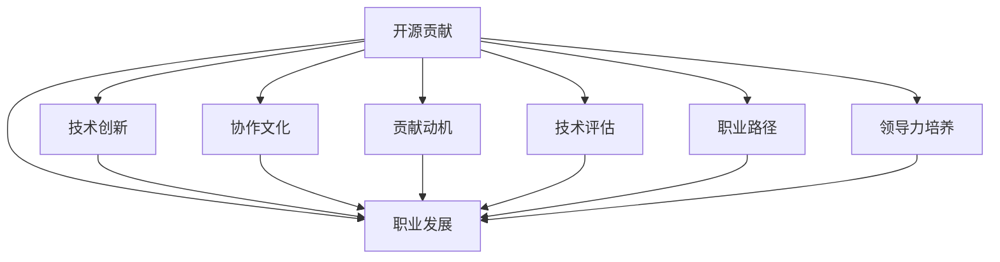

                 

# 利用开源贡献提升职场竞争力

> 关键词：开源社区,技术创新,职业发展,协作文化,贡献动机,技术评估,职业路径,领导力培养

## 1. 背景介绍

在当今快速发展的技术世界中，开源项目已经成为了推动技术创新和业界进步的重要力量。无论是软件开发、数据分析，还是机器学习领域，开源社区提供了无尽的资源和平台，为技术从业者提供了展示才华、交流思想、获取反馈和合作的场所。对于职场人士而言，积极参与开源项目不仅能够提升个人技术能力，还能在竞争激烈的职场中脱颖而出，塑造和提升个人品牌，形成独特的职业发展路径。

### 1.1 开源社区的作用与影响

开源社区是技术创新和知识共享的重要平台。其作用和影响主要体现在以下几个方面：

1. **技术迭代与更新**：开源社区汇聚了大量技术专家，通过共同开发、测试和优化，不断迭代和更新技术解决方案。无论是开发新工具还是改进旧技术，开源项目都能提供即时的反馈和改进。

2. **知识共享与学习**：社区成员通过编写文档、发布博客、进行讲座和参与讨论，分享他们的经验和知识。这种交流使得社区成员能够从他人的经验中学习，迅速提升自己的技术水平。

3. **协作与合作**：开源项目鼓励跨地域、跨组织的协作，促进了团队间的沟通与合作。协作过程中，成员能够锻炼团队合作能力，提升项目管理与沟通技能。

4. **职业发展与机会**：参与开源项目可以为技术人员提供展示才能的机会，帮助他们在行业内建立个人品牌，吸引潜在的雇主和合作伙伴。同时，优秀的开源贡献往往能够提升个人的技术声誉，促进职业发展。

5. **职业路径多样化**：开源贡献不仅限于技术代码的编写，还涉及项目维护、社区管理、培训指导等多个方面。多样化的贡献方式帮助技术人员在职业生涯中探索多种角色和机会。

### 1.2 当前职场竞争的严峻形势

在数字经济蓬勃发展的背景下，技术岗位需求激增，但人才竞争也日益激烈。企业对于技术人才的需求不仅限于编程能力，还包括解决问题的能力、创新思维、团队合作和沟通能力等综合素质。对于职场人士而言，如何在激烈的竞争中脱颖而出，成为企业和合作伙伴都需要的"全面型"人才，是当下亟需解决的难题。

开源社区无疑成为了提升个人竞争力的重要平台。通过在开源项目中的积极贡献，技术人士不仅能够展现自己的技术实力，还能在合作和创新中积累宝贵的实践经验和软技能。

## 2. 核心概念与联系

### 2.1 核心概念概述

为了更好地理解如何通过开源贡献提升职场竞争力，本文将介绍以下几个核心概念：

1. **开源贡献**：指技术人员通过编写代码、编写文档、组织会议、教学指导等方式，为开源项目提供价值的行动。

2. **技术创新**：在开源项目中提出和实现新的技术方案或改进现有技术的能力。

3. **职业发展**：通过开源项目展示个人技术能力，建立职业品牌，进而获得晋升和职业转型的机会。

4. **协作文化**：在开源社区中培养的重视合作、共享、开放和多样性的文化。

5. **贡献动机**：个人参与开源项目的动力和目的，包括技术提升、职业发展、兴趣探索等。

6. **技术评估**：社区和雇主对开源贡献的质量、数量和影响力的评价标准。

7. **职业路径**：基于开源贡献积累的经验和技能，制定的个人职业发展道路。

8. **领导力培养**：在开源项目中担任项目领导、组织活动等角色，提升领导能力和项目管理能力。

这些核心概念之间的联系可以通过以下Mermaid流程图来展示：

这个流程图展示了开源贡献如何通过技术创新、职业发展、协作文化、贡献动机、技术评估、职业路径和领导力培养，最终提升职场竞争力。

## 3. 核心算法原理 & 具体操作步骤

### 3.1 算法原理概述

通过开源贡献提升职场竞争力的核心算法原理在于，积极参与开源项目，不仅能提升个人的技术能力和项目管理经验，还能通过协作与交流，建立行业内的人脉网络。

技术创新和职业发展的核心在于持续学习和实践，开源项目提供了丰富的学习资源和实践机会。在社区中，技术人员能够接触到最新的技术趋势和最佳实践，通过实际项目经验的积累，提升自己的技术实力和行业影响力。

协作文化、贡献动机、技术评估和领导力培养则体现了参与开源项目对于个人软技能和职业发展的贡献。良好的协作文化能激发个人潜力，贡献动机驱动持续投入，技术评估保障质量，领导力培养提升职业发展的高度。

### 3.2 算法步骤详解

1. **选择开源项目**：
   - 根据自己的技术兴趣和职业目标，选择合适的开源项目。
   - 考虑项目的活跃度、社区规模、技术方向和贡献机会。

2. **加入社区**：
   - 注册开源社区账号，了解项目文档和代码库。
   - 通过阅读文档、参与讨论、观看会议等方式，熟悉项目生态。

3. **开始贡献**：
   - 根据项目的贡献指南，选择适合的贡献方式，如编写代码、修复Bug、添加功能、编写文档等。
   - 设立具体的贡献目标和里程碑，逐步推进贡献计划。

4. **提升技术能力**：
   - 在项目中实践新技术，不断提升自己的编程和架构能力。
   - 参与项目讨论和代码评审，学习他人的最佳实践。

5. **建立职业品牌**：
   - 在社交媒体和社区平台上分享自己的贡献和项目进展，展示技术实力。
   - 参与社区会议和讲座，提升个人影响力。

6. **获得职业发展机会**：
   - 通过开源贡献，获得晋升机会，加入更高级别的技术团队。
   - 吸引潜在的雇主和合作伙伴，为职业转型和跨界合作提供契机。

7. **培养领导力和项目管理能力**：
   - 在项目中担任领导角色，组织会议、指导新成员、推动项目进程。
   - 通过项目管理和跨团队协作，提升领导力和团队合作能力。

### 3.3 算法优缺点

开源贡献能够为技术人士带来诸多优势，但同时也存在一些挑战：

**优点**：
1. **提升技术实力**：通过实际项目的锻炼，快速提升编程、架构和项目管理能力。
2. **建立职业网络**：通过社区互动，建立行业内的人脉关系，扩大职业发展机会。
3. **展示技术影响力**：通过开源项目，向外界展示个人技术实力和创新能力。
4. **职业发展多样化**：多样化的贡献方式和角色能够探索多种职业路径。
5. **领导力培养**：通过担任领导角色，提升团队管理能力和领导魅力。

**缺点**：
1. **时间投入**：开源项目需要持续的时间投入，可能会与日常工作产生冲突。
2. **技术竞争**：开源社区竞争激烈，需要具备良好的竞争力和时间管理能力。
3. **资源限制**：参与大型项目可能面临资源和信息不对称的问题。
4. **文化适应**：不同社区有不同的文化和规范，需要适应和学习。
5. **贡献认同**：贡献质量可能受社区标准和评估机制的影响，有时难以得到公平评价。

### 3.4 算法应用领域

开源贡献不仅适用于软件开发领域，还在数据分析、机器学习、自然语言处理等多个领域得到广泛应用。具体的应用领域包括：

1. **软件开发**：参与开源软件项目，通过编写代码、修复Bug、优化性能等方式提升技术能力。
2. **数据分析**：利用开源数据分析工具和库，进行数据处理、可视化和机器学习模型开发。
3. **机器学习**：通过开源模型和框架，进行模型训练、优化和应用部署。
4. **自然语言处理**：在开源NLP项目中，进行文本处理、情感分析和语言模型训练。
5. **网络安全**：参与开源安全项目，进行漏洞扫描、代码审计和威胁情报分析。
6. **云计算**：在开源云项目中，进行云资源管理、分布式系统和容器编排。
7. **教育与培训**：通过开源教育资源和平台，编写教程、创建课程和提供在线指导。

## 4. 数学模型和公式 & 详细讲解 & 举例说明

### 4.1 数学模型构建

开源贡献的效果可以通过数学模型来量化。假设开源项目 $P$ 的贡献度为 $C$，由以下几个因素构成：

1. **代码提交量**：$C_{code} = \sum_i c_i$，其中 $c_i$ 为每次提交的代码量。
2. **修复Bug数**：$C_{bug} = \sum_i b_i$，其中 $b_i$ 为每次修复的Bug数量。
3. **文档编写量**：$C_{doc} = \sum_i d_i$，其中 $d_i$ 为每次文档更新的页数。
4. **社区活动参与度**：$C_{activity} = \sum_i a_i$，其中 $a_i$ 为参与讨论、会议等活动的次数。
5. **技术评估得分**：$C_{score} = S$，其中 $S$ 为社区或雇主对贡献的评分。

则整体贡献度 $C$ 可以表示为：

$$
C = \alpha C_{code} + \beta C_{bug} + \gamma C_{doc} + \delta C_{activity} + \eta C_{score}
$$

其中 $\alpha, \beta, \gamma, \delta, \eta$ 为各个因素的权重，可根据实际情况进行调整。

### 4.2 公式推导过程

根据上述数学模型，可以进一步推导出衡量贡献度的算法公式：

假设项目 $P$ 贡献度为 $C$，当前时间为 $t$，过去 $T$ 天内的贡献量为 $C_t$，贡献度得分函数为 $F(C_t)$，则有：

$$
C = \sum_{t=0}^T C_t
$$

其中，$t$ 为时间变量，$T$ 为评估时间窗口。贡献度得分函数 $F(C_t)$ 可以表示为：

$$
F(C_t) = \begin{cases}
1, & C_t > C_{min} \\
0, & C_t \leq C_{min}
\end{cases}
$$

其中 $C_{min}$ 为贡献度的最低门槛。当 $C_t$ 超过 $C_{min}$ 时，贡献得分为 1，否则为 0。

### 4.3 案例分析与讲解

假设某开源项目 $P$，贡献度函数为：

$$
C = 0.6C_{code} + 0.3C_{bug} + 0.1C_{doc} + 0.05C_{activity} + 0.05C_{score}
$$

其中 $C_{code} = 1000$，$C_{bug} = 200$，$C_{doc} = 100$，$C_{activity} = 50$，$C_{score} = 0.9$。

计算得：

$$
C = 0.6 \times 1000 + 0.3 \times 200 + 0.1 \times 100 + 0.05 \times 50 + 0.05 \times 0.9 = 640.25
$$

该开源项目 $P$ 的综合贡献度为 640.25，说明在过去一段时间内，项目 $P$ 的贡献效果显著。

## 5. 项目实践：代码实例和详细解释说明

### 5.1 开发环境搭建

为了进行开源贡献的实践，需要先搭建好开发环境。以下是基于Python的开发环境配置流程：

1. **安装Python**：
   - 从官网下载并安装最新版本的Python。
   - 添加Python环境变量，确保开发工具能够正确调用。

2. **安装必要的库和工具**：
   - 安装PyCharm等IDE。
   - 安装Git、GitHub等版本控制工具。
   - 安装虚拟环境管理工具，如Venv。

3. **创建虚拟环境**：
   - 在虚拟环境管理器中，创建新的虚拟环境。
   - 激活虚拟环境，开始编写代码。

### 5.2 源代码详细实现

以下是一个简单的开源项目贡献示例，展示如何在GitHub上创建一个新的开源项目，并进行代码贡献。

1. **创建项目仓库**：
   - 在GitHub上注册账号，创建新的项目仓库。
   - 填写项目信息，包括README文件、LICENSE文件等。

2. **编写代码**：
   - 在本地IDE中编写代码，确保代码格式规范，注释清晰。
   - 将代码提交到Git仓库，使用Git命令进行版本控制。

3. **代码审核与合并**：
   - 提交代码后，其他社区成员会对代码进行审核。
   - 根据审核反馈，修改代码并再次提交。
   - 代码审核通过后，会被合并到主分支。

4. **文档更新与贡献**：
   - 在GitHub Wiki中编写项目文档，记录项目进展和API接口。
   - 通过Markdown格式编写文档，确保格式一致，易于阅读。

5. **社区互动与反馈**：
   - 在项目issue和pull request中，积极与社区成员互动，回答问题。
   - 关注社区讨论和反馈，及时调整贡献计划。

### 5.3 代码解读与分析

以下是GitHub代码贡献流程的详细解读：

1. **代码提交**：
   - 使用Git命令进行代码提交，如 `git add .` 和 `git commit -m "提交代码说明"`。
   - 将代码推送到远程仓库，如 `git push origin master`。

2. **代码审核**：
   - 社区成员通过pull request (PR)查看代码，提出修改建议。
   - 通过 `git fetch origin` 和 `git pull origin master` 命令，合并最新代码。
   - 解决社区反馈的问题，并再次提交代码。

3. **代码合并**：
   - 提交PR后，社区管理员或核心开发人员进行审核。
   - 审核通过后，代码被合并到主分支。

4. **文档更新**：
   - 在GitHub Wiki中创建或更新文档，确保文档与代码同步。
   - 使用Markdown语法编写文档，并提交到Wiki。

5. **社区互动**：
   - 在项目issue和PR中，积极回复社区成员的问题。
   - 参与社区讨论和会议，分享项目进展和经验。

### 5.4 运行结果展示

在完成代码贡献后，可以通过GitHub等平台展示自己的贡献记录。例如，在GitHub个人资料中查看自己的开源项目贡献数、提交代码量、文档更新等数据。

## 6. 实际应用场景

开源贡献的实际应用场景非常广泛，涵盖多个行业和领域。以下是一些典型的应用场景：

### 6.1 软件开发

开源软件开发项目通常包含多种编程语言和框架，技术人员可以根据自己的技术专长和兴趣选择贡献。例如，参与TensorFlow项目，可以贡献模型优化、文档编写、性能测试等任务。通过实际项目的实践，提升自己的编程和架构能力。

### 6.2 数据分析

开源数据分析工具如Pandas、NumPy、Scikit-learn等，为数据分析提供了强大的支持。技术人员可以通过编写数据处理脚本、优化算法模型、撰写数据文档等方式进行贡献。通过数据分析项目的实践，提升数据处理和机器学习能力。

### 6.3 机器学习

开源机器学习框架如TensorFlow、PyTorch等，为模型训练和应用提供了丰富的资源。技术人员可以通过实现新算法、优化模型性能、编写教程等方式进行贡献。通过机器学习项目的实践，提升模型构建和优化能力。

### 6.4 自然语言处理

开源自然语言处理工具如NLTK、spaCy、HuggingFace Transformers等，为文本处理提供了广泛的支持。技术人员可以通过文本分析、情感分析、语言模型训练等方式进行贡献。通过自然语言处理项目的实践，提升文本处理和语言模型能力。

### 6.5 网络安全

开源网络安全项目如OWASP、Bugcrowd等，为安全漏洞分析和修复提供了平台。技术人员可以通过漏洞扫描、代码审计、威胁情报分析等方式进行贡献。通过网络安全项目的实践，提升安全分析和修复能力。

### 6.6 云计算

开源云计算项目如OpenStack、Kubernetes等，为云资源管理和分布式系统提供了支持。技术人员可以通过云资源管理、容器编排、分布式计算等方式进行贡献。通过云计算项目的实践，提升云资源管理和分布式系统能力。

## 7. 工具和资源推荐

### 7.1 学习资源推荐

为了帮助技术人员更好地理解和参与开源贡献，推荐以下学习资源：

1. **GitHub官方文档**：提供Git和GitHub的基础使用教程，帮助初学者快速上手。

2. **GitHub Guides**：GitHub官方提供的编程和项目管理指南，涵盖Git、GitHub和开源项目的各个方面。

3. **GitHub Learning Lab**：GitHub提供的互动学习平台，提供实战案例和模拟练习，帮助用户掌握Git和GitHub的基本操作。

4. **Codecademy**：提供交互式的编程课程，涵盖多种编程语言和框架，帮助用户提升编程能力。

5. **Coursera**：提供多种开源相关的课程，涵盖数据分析、机器学习、自然语言处理等领域。

6. **edX**：提供开源技术和项目管理的课程，涵盖开源社区、版本控制、项目管理等方面。

### 7.2 开发工具推荐

为了支持开源贡献的实践，推荐以下开发工具：

1. **PyCharm**：Google推出的Python IDE，支持Git和GitHub集成，适合编写开源代码。

2. **Visual Studio Code**：微软推出的轻量级代码编辑器，支持多种编程语言和扩展，适合编写开源代码。

3. **Atom**：GitHub推出的开源文本编辑器，支持Git和GitHub集成，适合编写开源代码。

4. **Sublime Text**：功能强大的文本编辑器，支持Git和GitHub集成，适合编写开源代码。

5. **Jupyter Notebook**：支持多种编程语言和格式，适合编写数据处理和分析脚本。

### 7.3 相关论文推荐

为了深入理解开源贡献的原理和技术细节，推荐以下相关论文：

1. **“Open Source Software: The Secret to Rapid Software Development”**：这篇文章介绍了开源软件开发的优势和实践，提供了开源贡献的案例和策略。

2. **“Collaboration Across Boundaries: A Study of Open Source Software Community”**：本文通过分析开源社区的协作模式，探讨了如何提升开源贡献的质量和效率。

3. **“Contributing to Open Source: Challenges and Strategies”**：本文分析了开源贡献过程中面临的挑战和解决策略，提供了详细的实践建议。

4. **“Open Source Software Development: Principles, Practices, and Economics”**：本文探讨了开源软件开发的原则和实践，分析了开源项目的经济效益。

5. **“Open Source Software in Academia: The Role of Open Source in Research”**：本文分析了开源软件在学术研究中的作用和价值，探讨了开源贡献对学术研究的影响。

## 8. 总结：未来发展趋势与挑战

### 8.1 总结

本文详细探讨了如何通过开源贡献提升职场竞争力，介绍了开源贡献的核心概念、算法原理和具体操作步骤，并通过实例展示了开源贡献的实践方法。开源贡献不仅能够提升技术实力和职业品牌，还能通过社区互动和学习，拓展职业发展路径，提升领导力和项目管理能力。

### 8.2 未来发展趋势

开源贡献的未来发展趋势主要体现在以下几个方面：

1. **技术创新和应用加速**：开源社区将继续推动技术创新和应用落地，技术人员能够通过开源项目快速掌握最新的技术趋势和应用场景。

2. **职业路径多样化**：开源贡献不仅限于编程和开发，还可以拓展到项目管理和社区建设等多个方面，为技术人员提供多样化的职业路径。

3. **协作文化深化**：开源社区将进一步深化协作文化，鼓励跨地域、跨组织的合作，提升项目管理和团队协作能力。

4. **领导力培养和提升**：开源贡献提供了丰富的领导力培养机会，技术人员通过担任项目领导、组织活动等方式，提升团队管理和领导能力。

5. **职业品牌和影响力**：开源贡献能够显著提升个人技术实力和职业品牌，吸引潜在的雇主和合作伙伴，为职业转型和跨界合作提供契机。

### 8.3 面临的挑战

开源贡献虽然具有诸多优势，但也面临一些挑战：

1. **时间管理**：开源项目通常需要持续的时间投入，可能会与日常工作产生冲突。

2. **技术竞争**：开源社区竞争激烈，需要具备良好的竞争力和时间管理能力。

3. **资源限制**：参与大型项目可能面临资源和信息不对称的问题。

4. **文化适应**：不同社区有不同的文化和规范，需要适应和学习。

5. **贡献认同**：贡献质量可能受社区标准和评估机制的影响，有时难以得到公平评价。

### 8.4 研究展望

未来的研究需要在以下几个方面寻求新的突破：

1. **技术评估标准的优化**：研究如何制定更公平、客观的技术评估标准，激励更多的开源贡献。

2. **协作效率的提升**：研究如何通过工具和平台，提升开源项目的协作效率，减少沟通和协调成本。

3. **贡献动机的挖掘**：研究如何激发技术人员的贡献动机，提高开源贡献的可持续性。

4. **职业发展的多样化**：研究如何通过开源贡献，探索更多的职业路径和发展机会。

5. **领导力的培养机制**：研究如何通过开源项目，培养技术人员的领导力和项目管理能力。

总之，开源贡献在提升职场竞争力方面具有重要作用，但也需要不断优化和改进。只有在技术、文化和组织等多方面协同发力，开源贡献才能更好地推动技术创新和职业发展。

## 9. 附录：常见问题与解答

### Q1: 什么是开源贡献？

A: 开源贡献指的是技术人员通过编写代码、修复Bug、编写文档等方式，为开源项目提供价值的行动。

### Q2: 开源贡献对职场竞争力提升有哪些帮助？

A: 开源贡献能够提升技术实力、建立职业品牌、拓展职业路径、培养领导力和管理能力，从而提升职场竞争力。

### Q3: 如何选择合适的开源项目？

A: 选择开源项目需要考虑项目的活跃度、社区规模、技术方向和贡献机会，选择与自身技术兴趣和职业目标相匹配的项目。

### Q4: 如何有效管理开源贡献的时间？

A: 制定明确的贡献计划和时间表，优先处理高优先级和重要的任务，合理安排时间，确保开源贡献与日常工作平衡。

### Q5: 如何获得社区对贡献的公平评价？

A: 遵循社区的贡献指南和标准，积极参与社区讨论和反馈，及时解决社区成员的问题，确保贡献质量。

---

作者：禅与计算机程序设计艺术 / Zen and the Art of Computer Programming

