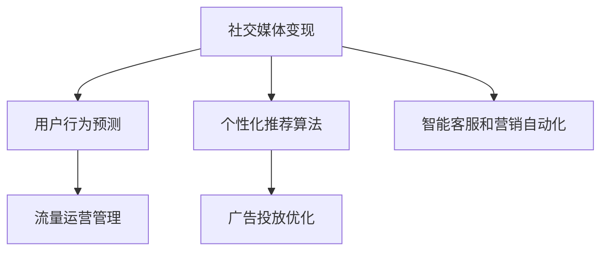

                 

# 利用技术优势进行社交媒体变现

> 关键词：社交媒体变现, 技术优势, 数据分析, 人工智能, 机器学习, 广告推荐, 流量运营, 用户行为预测

## 1. 背景介绍

### 1.1 问题由来
社交媒体已成为全球网民日常生活中不可或缺的一部分，用户通过发布、分享、评论和互动，形成了庞大的社交网络。据统计，全球社交媒体用户数量已超过40亿，市场规模超过3000亿美元。在社交媒体的商业变现方面，广告收入是主要收入来源，占据了70%以上的份额。然而，随着用户隐私保护意识的增强和广告阻断工具的普及，传统基于展示广告的变现模式正在逐渐失效。

为了应对这一挑战，社交媒体平台纷纷探索新的变现方式，如电商导流、知识付费、会员订阅等，但这些方式依然面临用户流失、运营成本高等问题。如何在社交媒体生态中挖掘新价值，实现稳定可持续的变现，成为平台亟待解决的问题。

### 1.2 问题核心关键点
社交媒体变现的核心在于提升用户粘性和活跃度，通过精准的用户行为预测和个性化推荐，最大化用户的互动和消费潜力，从而增加平台收入。技术在此过程中起着至关重要的作用，主要体现在以下几个方面：

1. **用户行为数据分析**：通过数据挖掘和机器学习技术，理解用户行为模式和偏好，精准预测用户的下一步行为。
2. **个性化推荐算法**：利用推荐系统技术，向用户推荐最感兴趣的内容和产品，提高用户满意度和转化率。
3. **广告投放优化**：应用广告优化技术，提高广告的点击率和转化率，实现更高效的广告投放。
4. **流量运营管理**：通过大数据分析和用户画像建模，优化流量分配和运营策略，提升平台的用户留存率和用户生命周期价值。
5. **智能客服和营销自动化**：利用自然语言处理和机器学习技术，提升客服响应速度和质量，降低营销运营成本。

这些技术优势的充分利用，可以大幅提升社交媒体的变现能力，创造新的增长点。

### 1.3 问题研究意义
利用技术优势进行社交媒体变现，对于提升平台收入、优化用户体验、增强市场竞争力具有重要意义：

1. **提升变现效率**：通过数据分析和算法优化，精准预测用户行为，提高广告和推荐的效果，实现更高效的变现。
2. **增强用户体验**：个性化推荐和智能客服技术，提升用户满意度，增加用户粘性，促进平台持续增长。
3. **降低运营成本**：自动化和智能化的运营管理，减少人工干预，提高运营效率，降低营销和客服成本。
4. **探索新变现模式**：通过技术创新，探索新的变现途径，如电商导流、知识付费等，拓宽收入来源。
5. **应对市场变化**：技术进步为社交媒体应对市场变化提供了有力工具，增强平台的抗风险能力。

综上所述，技术优势的充分利用，是社交媒体平台实现长期稳定变现的关键。

## 2. 核心概念与联系

### 2.1 核心概念概述

为更好地理解利用技术优势进行社交媒体变现的方法，本节将介绍几个密切相关的核心概念：

- **社交媒体变现**：通过各种方式从社交媒体平台获得收入的过程，包括广告、电商导流、知识付费等。
- **用户行为预测**：利用机器学习技术，根据用户历史行为数据，预测其未来的行为，如点击、购买、分享等。
- **个性化推荐算法**：根据用户偏好和历史行为，推荐最符合其兴趣的内容和产品，提升用户满意度和转化率。
- **广告投放优化**：应用广告优化技术，提高广告的点击率和转化率，实现更高效的广告投放。
- **流量运营管理**：通过大数据分析和用户画像建模，优化流量分配和运营策略，提升平台的用户留存率和用户生命周期价值。
- **智能客服和营销自动化**：利用自然语言处理和机器学习技术，提升客服响应速度和质量，降低营销运营成本。

这些核心概念之间的逻辑关系可以通过以下Mermaid流程图来展示：



这个流程图展示了几类技术优势在社交媒体变现过程中的相互作用：

1. **用户行为预测**：根据用户行为数据，预测其未来的行为，为个性化推荐和广告投放提供依据。
2. **个性化推荐算法**：利用预测结果，推荐符合用户兴趣的内容和产品，提高用户满意度和转化率。
3. **广告投放优化**：优化广告策略，提高广告的点击率和转化率，实现更高效的广告投放。
4. **流量运营管理**：通过数据分析，优化流量分配和运营策略，提升用户留存率和平台价值。
5. **智能客服和营销自动化**：提高客服响应速度和质量，降低营销成本，提升用户体验。

这些概念共同构成了社交媒体变现的技术框架，使得社交媒体平台能够在激烈的市场竞争中脱颖而出。

## 3. 核心算法原理 & 具体操作步骤
### 3.1 算法原理概述

利用技术优势进行社交媒体变现，本质上是一个数据驱动的个性化推荐和优化过程。其核心思想是：

1. **数据驱动**：通过收集、分析和利用用户行为数据，驱动推荐算法和广告投放策略的优化。
2. **个性化**：根据用户的历史行为和兴趣偏好，提供个性化推荐，提升用户满意度和转化率。
3. **动态调整**：实时监测和调整推荐和广告策略，适应用户行为的变化，实现更高效的变现。

形式化地，假设社交媒体平台有N个用户，每个用户有多个行为特征 $x_i$，对应的变现目标是 $y_i$（如点击率、转化率等）。利用机器学习模型 $f(x_i, \theta)$ 来预测 $y_i$，其中 $\theta$ 为模型参数。推荐和广告投放的目标是最大化总体变现 $Y=\sum_{i=1}^N y_i$。

通过最大化总体变现 $Y$，可以实现以下目标：

- 提升广告点击率和转化率。
- 增加用户粘性和活跃度。
- 实现更精准的用户行为预测。
- 优化广告投放策略，提高广告ROI。

### 3.2 算法步骤详解

利用技术优势进行社交媒体变现，一般包括以下几个关键步骤：

**Step 1: 数据收集与预处理**
- 收集社交媒体平台上的用户行为数据，包括点击、浏览、评论、点赞等行为数据。
- 数据预处理，包括数据清洗、特征提取、缺失值处理等。

**Step 2: 特征工程与建模**
- 根据业务需求，设计特征工程，选择对变现有重要影响的特征。
- 利用机器学习模型（如线性回归、逻辑回归、决策树、随机森林等）或深度学习模型（如神经网络、卷积神经网络、循环神经网络等）进行建模。
- 训练模型并验证模型效果。

**Step 3: 推荐系统开发**
- 利用推荐算法（如协同过滤、矩阵分解、神经网络推荐等）进行个性化推荐。
- 集成推荐系统到社交媒体平台的用户界面，提高用户互动和转化率。

**Step 4: 广告投放优化**
- 利用广告优化算法（如线性规划、强化学习等）进行广告投放优化。
- 实时监测广告效果，调整广告策略，提高广告的点击率和转化率。

**Step 5: 流量运营管理**
- 通过大数据分析，优化流量分配和运营策略，提升用户留存率和平台价值。
- 实时监测用户行为，及时调整运营策略，提高运营效率。

**Step 6: 智能客服和营销自动化**
- 利用自然语言处理和机器学习技术，提升客服响应速度和质量。
- 利用自动化营销工具，降低营销运营成本。

**Step 7: 持续优化与反馈**
- 持续收集用户反馈和行为数据，优化推荐和广告策略。
- 利用A/B测试等方法，不断迭代和优化推荐和广告模型。

以上是利用技术优势进行社交媒体变现的一般流程。在实际应用中，还需要针对具体业务场景进行优化设计，如改进推荐算法、优化广告投放策略、加强流量运营管理等。

### 3.3 算法优缺点

利用技术优势进行社交媒体变现的方法具有以下优点：

1. **提高变现效率**：通过数据驱动的个性化推荐和广告投放优化，提高变现效率，提升平台收入。
2. **增强用户体验**：个性化推荐和智能客服技术，提升用户满意度，增加用户粘性，促进平台增长。
3. **降低运营成本**：自动化和智能化的运营管理，减少人工干预，提高运营效率，降低营销和客服成本。
4. **精准预测和投放**：利用机器学习和深度学习技术，实现精准的用户行为预测和广告投放，提高广告效果。
5. **多渠道变现**：结合广告、电商导流、知识付费等多种变现方式，拓宽收入来源。

同时，该方法也存在一定的局限性：

1. **数据依赖**：依赖高质量的用户行为数据，数据获取和处理成本较高。
2. **算法复杂度**：机器学习和深度学习模型的训练和优化需要较高的计算资源和专业知识。
3. **模型可解释性**：复杂的模型如神经网络难以解释，难以对其决策过程进行分析和调试。
4. **隐私问题**：数据隐私保护成为制约数据收集和使用的瓶颈，需要合理合规使用数据。
5. **公平性和偏见**：模型可能存在数据偏见，导致不公平的推荐和广告投放。

尽管存在这些局限性，但就目前而言，利用技术优势进行社交媒体变现的方法仍是最主流范式。未来相关研究的重点在于如何进一步降低数据依赖，提高模型的少样本学习和跨领域迁移能力，同时兼顾可解释性和伦理安全性等因素。

### 3.4 算法应用领域

利用技术优势进行社交媒体变现的方法在社交媒体领域已经得到了广泛的应用，覆盖了广告推荐、用户行为预测、流量运营管理等多个领域，具体如下：

- **广告推荐**：根据用户历史行为和兴趣偏好，推荐最符合其兴趣的广告内容。
- **用户行为预测**：利用机器学习技术，预测用户的行为和兴趣，提供个性化推荐和广告投放策略。
- **流量运营管理**：通过大数据分析，优化流量分配和运营策略，提升用户留存率和平台价值。
- **智能客服和营销自动化**：利用自然语言处理和机器学习技术，提升客服响应速度和质量，降低营销运营成本。

除了上述这些经典应用外，社交媒体变现技术还被创新性地应用到更多场景中，如精准营销、社交电商、用户细分等，为社交媒体平台的商业化提供了新的方向。

## 4. 数学模型和公式 & 详细讲解 & 举例说明

### 4.1 数学模型构建

本节将使用数学语言对利用技术优势进行社交媒体变现的过程进行更加严格的刻画。

记社交媒体平台有N个用户，每个用户有多个行为特征 $x_i$，对应的变现目标是 $y_i$（如点击率、转化率等）。利用机器学习模型 $f(x_i, \theta)$ 来预测 $y_i$，其中 $\theta$ 为模型参数。推荐和广告投放的目标是最大化总体变现 $Y=\sum_{i=1}^N y_i$。

定义用户行为预测模型的损失函数为：

$$
\mathcal{L}(\theta) = \frac{1}{N}\sum_{i=1}^N \ell(f(x_i, \theta), y_i)
$$

其中 $\ell$ 为预测值和真实值之间的损失函数，如均方误差损失、交叉熵损失等。

通过最小化损失函数 $\mathcal{L}(\theta)$，训练出最优的模型参数 $\theta^*$。

### 4.2 公式推导过程

以下我们以点击率预测为例，推导点击率预测模型的损失函数及其梯度计算公式。

假设用户行为预测模型的输出为 $\hat{y}_i=f(x_i, \theta)$，真实点击率为 $y_i$。则点击率预测模型的损失函数定义为：

$$
\ell(\hat{y}_i, y_i) = -\log \hat{y}_i \quad \text{if } y_i=1 \\
= -\log (1-\hat{y}_i) \quad \text{if } y_i=0
$$

将其代入总体变现损失函数，得：

$$
\mathcal{L}(\theta) = -\frac{1}{N}\sum_{i=1}^N \left[\log \hat{y}_i \quad \text{if } y_i=1 \\
= \log (1-\hat{y}_i) \quad \text{if } y_i=0\right]
$$

根据链式法则，损失函数对模型参数 $\theta$ 的梯度为：

$$
\nabla_{\theta}\mathcal{L}(\theta) = -\frac{1}{N}\sum_{i=1}^N \left[\frac{1}{\hat{y}_i} - \frac{1}{1-\hat{y}_i} \quad \text{if } y_i=1 \\
= \frac{1}{1-\hat{y}_i} - \frac{1}{\hat{y}_i} \quad \text{if } y_i=0\right]
$$

其中 $\frac{1}{\hat{y}_i} - \frac{1}{1-\hat{y}_i}$ 的计算可以使用逻辑回归模型的预测公式 $p(y_i=1|x_i, \theta)=\frac{1}{1+\exp(-\hat{y}_i)}$ 和 $p(y_i=0|x_i, \theta)=\frac{\exp(-\hat{y}_i)}{1+\exp(-\hat{y}_i)}$ 来计算。

在得到损失函数的梯度后，即可带入参数更新公式，完成模型的迭代优化。重复上述过程直至收敛，最终得到适应社交媒体变现的最优模型参数 $\theta^*$。

## 5. 项目实践：代码实例和详细解释说明

### 5.1 开发环境搭建

在进行社交媒体变现的实践前，我们需要准备好开发环境。以下是使用Python进行Scikit-learn和TensorFlow开发的环境配置流程：

1. 安装Anaconda：从官网下载并安装Anaconda，用于创建独立的Python环境。

2. 创建并激活虚拟环境：
```bash
conda create -n social-media python=3.8 
conda activate social-media
```

3. 安装Scikit-learn和TensorFlow：根据CUDA版本，从官网获取对应的安装命令。例如：
```bash
conda install scikit-learn tensorflow cudatoolkit=11.1 -c pytorch -c conda-forge
```

4. 安装各类工具包：
```bash
pip install numpy pandas scikit-learn matplotlib tqdm jupyter notebook ipython
```

完成上述步骤后，即可在`social-media`环境中开始社交媒体变现的实践。

### 5.2 源代码详细实现

下面我们以点击率预测为例，给出使用Scikit-learn和TensorFlow进行社交媒体变现的Python代码实现。

首先，定义点击率预测任务的训练集和测试集：

```python
from sklearn.model_selection import train_test_split
import numpy as np

# 假设有N个用户，每个用户有多个行为特征
X = np.random.randn(100, 10)  # 特征矩阵
y = np.random.randint(2, size=100)  # 点击标签

# 将数据分为训练集和测试集
X_train, X_test, y_train, y_test = train_test_split(X, y, test_size=0.2, random_state=42)
```

然后，定义点击率预测模型的训练和评估函数：

```python
from sklearn.linear_model import LogisticRegression
from sklearn.metrics import roc_auc_score
from tensorflow.keras.models import Sequential
from tensorflow.keras.layers import Dense
from tensorflow.keras.optimizers import Adam

def train_model(X_train, y_train, X_test, y_test):
    # 定义逻辑回归模型
    model = LogisticRegression(solver='liblinear', random_state=42)
    
    # 训练模型
    model.fit(X_train, y_train)
    
    # 评估模型
    y_pred = model.predict_proba(X_test)[:, 1]
    auc = roc_auc_score(y_test, y_pred)
    print(f"AUC: {auc:.4f}")
    
    return model

def evaluate_model(model, X_test, y_test):
    # 评估模型
    y_pred = model.predict_proba(X_test)[:, 1]
    auc = roc_auc_score(y_test, y_pred)
    print(f"AUC: {auc:.4f}")
    
    return auc

# 训练模型
model = train_model(X_train, y_train, X_test, y_test)

# 评估模型
auc = evaluate_model(model, X_test, y_test)
```

可以看到，利用Scikit-learn和TensorFlow可以快速搭建一个简单的点击率预测模型，进行社交媒体变现的实践。

### 5.3 代码解读与分析

让我们再详细解读一下关键代码的实现细节：

**train_model函数**：
- 定义逻辑回归模型，使用liblinear算法，避免过拟合。
- 训练模型，并返回训练后的模型。
- 评估模型，使用ROC-AUC指标衡量模型性能。

**evaluate_model函数**：
- 评估模型，计算ROC-AUC指标。
- 输出评估结果。

**训练流程**：
- 定义训练集和测试集。
- 训练模型，输出训练结果。
- 评估模型，输出评估结果。

可以看到，Scikit-learn和TensorFlow结合使用，可以方便地进行机器学习和深度学习的混合建模。开发者可以灵活运用Scikit-learn的算法和TensorFlow的计算图能力，快速迭代和优化模型，提升预测效果。

当然，工业级的系统实现还需考虑更多因素，如模型的保存和部署、超参数的自动搜索、更灵活的特征工程等。但核心的变现范式基本与此类似。

## 6. 实际应用场景
### 6.1 精准广告投放

精准广告投放是社交媒体变现的重要环节，通过利用用户行为预测和个性化推荐算法，最大化广告的点击率和转化率。

在实际应用中，社交媒体平台可以收集用户的浏览、点击、点赞等行为数据，构建用户画像，预测其点击和购买意向。然后，利用个性化推荐算法，向用户推荐最符合其兴趣的广告内容，提高广告的效果。

### 6.2 智能客服和营销自动化

智能客服和营销自动化是提升社交媒体变现效率的重要手段。通过自然语言处理和机器学习技术，可以显著提高客服响应速度和质量，降低运营成本。

具体而言，社交媒体平台可以集成智能客服系统，利用自然语言理解技术，自动回答用户常见问题，提高用户体验。同时，利用自动化营销工具，根据用户行为数据，实时推送个性化推荐，增加用户粘性和购买意愿。

### 6.3 用户行为预测

用户行为预测是社交媒体变现的关键技术之一。通过机器学习模型，预测用户的行为和兴趣，可以为个性化推荐和广告投放提供依据。

在实际应用中，社交媒体平台可以收集用户的浏览、点击、评论等行为数据，构建用户画像，预测其未来的行为，如点击、购买、分享等。然后，利用预测结果，推荐最符合其兴趣的内容和产品，提高用户满意度和转化率。

### 6.4 未来应用展望

随着技术的发展，社交媒体变现技术将呈现以下几个发展趋势：

1. **多渠道变现**：结合广告、电商导流、知识付费等多种变现方式，拓宽收入来源。
2. **个性化推荐**：通过深度学习和大数据分析，实现更精准的用户行为预测和个性化推荐，提升用户体验和转化率。
3. **智能运营管理**：利用大数据分析和用户画像建模，优化流量分配和运营策略，提升平台的用户留存率和价值。
4. **跨平台协同**：整合不同平台的用户数据和行为信息，实现跨平台的用户行为预测和推荐，提高变现效率。
5. **实时预测和投放**：利用实时数据流和流式计算技术，实现实时预测和广告投放，提高变现效率和用户满意度。

以上趋势凸显了社交媒体变现技术的广阔前景。这些方向的探索发展，必将进一步提升社交媒体平台的变现能力和用户体验，创造新的增长点。

## 7. 工具和资源推荐
### 7.1 学习资源推荐

为了帮助开发者系统掌握社交媒体变现的理论基础和实践技巧，这里推荐一些优质的学习资源：

1. **《机器学习实战》**：一本详细介绍机器学习基础和实践的书籍，适合初学者入门。
2. **《深度学习入门》**：一本介绍深度学习基础和应用的书，涵盖卷积神经网络、循环神经网络等前沿技术。
3. **《Python数据科学手册》**：一本介绍数据科学和数据分析的书籍，涵盖数据预处理、特征工程、机器学习等技术。
4. **Coursera《机器学习》课程**：斯坦福大学开设的机器学习课程，有Lecture视频和配套作业，带你入门机器学习基础和经典模型。
5. **Kaggle数据科学竞赛**：全球最大的数据科学竞赛平台，通过参加竞赛，实践机器学习和数据分析技术。

通过对这些资源的学习实践，相信你一定能够快速掌握社交媒体变现的核心技术，并用于解决实际的业务问题。
###  7.2 开发工具推荐

高效的开发离不开优秀的工具支持。以下是几款用于社交媒体变现开发的常用工具：

1. Scikit-learn：Python的机器学习库，提供丰富的机器学习算法和工具，适合快速迭代和优化模型。
2. TensorFlow：Google主导的深度学习框架，生产部署方便，适合大规模工程应用。
3. Keras：基于TensorFlow的高级深度学习API，易于使用，适合快速原型开发。
4. Pandas：Python的数据分析库，提供高效的数据处理和分析工具。
5. Jupyter Notebook：开源的交互式笔记本环境，支持多种语言和工具，适合开发和分享研究笔记。

合理利用这些工具，可以显著提升社交媒体变现任务的开发效率，加快创新迭代的步伐。

### 7.3 相关论文推荐

社交媒体变现技术的发展源于学界的持续研究。以下是几篇奠基性的相关论文，推荐阅读：

1. **Click-Through Rate Prediction in Recommendation Systems**：提出基于深度神经网络的点击率预测方法，大幅提升推荐系统的点击率预测精度。
2. **Attention is All You Need**：提出Transformer结构，广泛应用于推荐系统和个性化广告推荐。
3. **Recommender Systems with TensorFlow**：介绍TensorFlow在推荐系统中的应用，涵盖协同过滤、深度学习等技术。
4. **Adaptive Recommendation Using Adaptive Attention**：提出基于自适应注意机制的推荐系统，提升推荐效果和用户满意度。
5. **Deep Learning for Advertisement: A Survey**：综述深度学习在广告推荐中的应用，包括神经网络、卷积神经网络、循环神经网络等技术。

这些论文代表了大语言模型微调技术的发展脉络。通过学习这些前沿成果，可以帮助研究者把握学科前进方向，激发更多的创新灵感。

## 8. 总结：未来发展趋势与挑战

### 8.1 总结

本文对利用技术优势进行社交媒体变现的方法进行了全面系统的介绍。首先阐述了社交媒体变现的背景和意义，明确了技术在此过程中起到的重要作用。其次，从原理到实践，详细讲解了社交媒体变现的数学模型和关键步骤，给出了社交媒体变现的完整代码实例。同时，本文还广泛探讨了社交媒体变现技术在广告推荐、智能客服、用户行为预测等多个行业领域的应用前景，展示了技术的巨大潜力。最后，本文精选了社交媒体变现技术的各类学习资源，力求为读者提供全方位的技术指引。

通过本文的系统梳理，可以看到，利用技术优势进行社交媒体变现，对于提升平台收入、优化用户体验、增强市场竞争力具有重要意义。技术优势的充分利用，是社交媒体平台实现长期稳定变现的关键。

### 8.2 未来发展趋势

展望未来，社交媒体变现技术将呈现以下几个发展趋势：

1. **多渠道变现**：结合广告、电商导流、知识付费等多种变现方式，拓宽收入来源。
2. **个性化推荐**：通过深度学习和大数据分析，实现更精准的用户行为预测和个性化推荐，提升用户体验和转化率。
3. **智能运营管理**：利用大数据分析和用户画像建模，优化流量分配和运营策略，提升平台的用户留存率和价值。
4. **跨平台协同**：整合不同平台的用户数据和行为信息，实现跨平台的用户行为预测和推荐，提高变现效率。
5. **实时预测和投放**：利用实时数据流和流式计算技术，实现实时预测和广告投放，提高变现效率和用户满意度。

以上趋势凸显了社交媒体变现技术的广阔前景。这些方向的探索发展，必将进一步提升社交媒体平台的变现能力和用户体验，创造新的增长点。

### 8.3 面临的挑战

尽管社交媒体变现技术已经取得了瞩目成就，但在迈向更加智能化、普适化应用的过程中，它仍面临着诸多挑战：

1. **数据依赖**：依赖高质量的用户行为数据，数据获取和处理成本较高。
2. **算法复杂度**：机器学习和深度学习模型的训练和优化需要较高的计算资源和专业知识。
3. **模型可解释性**：复杂的模型如神经网络难以解释，难以对其决策过程进行分析和调试。
4. **隐私问题**：数据隐私保护成为制约数据收集和使用的瓶颈，需要合理合规使用数据。
5. **公平性和偏见**：模型可能存在数据偏见，导致不公平的推荐和广告投放。

尽管存在这些挑战，但通过学界和产业界的共同努力，这些挑战终将逐步被克服。未来的社交媒体变现技术，必将更加智能化、普适化和公平化。

### 8.4 研究展望

面对社交媒体变现技术所面临的挑战，未来的研究需要在以下几个方面寻求新的突破：

1. **无监督和半监督学习**：摆脱对大规模标注数据的依赖，利用自监督学习、主动学习等无监督和半监督范式，最大限度利用非结构化数据，实现更加灵活高效的变现。
2. **跨模态学习**：结合文本、图像、视频等多模态数据，实现多模态信息与文本信息的协同建模，提升推荐效果和广告效果。
3. **实时流计算**：利用流式计算技术，实现实时预测和广告投放，提高变现效率和用户满意度。
4. **隐私保护技术**：开发隐私保护算法和机制，确保用户隐私安全，同时充分利用用户数据进行变现。
5. **公平性和透明性**：在推荐和广告模型中引入公平性和透明性约束，减少数据偏见，提升推荐和广告的公平性和透明性。

这些研究方向的探索，必将引领社交媒体变现技术迈向更高的台阶，为社交媒体平台的商业化提供更强的技术保障。面向未来，社交媒体变现技术还需要与其他人工智能技术进行更深入的融合，如知识表示、因果推理、强化学习等，多路径协同发力，共同推动社交媒体变现系统的进步。只有勇于创新、敢于突破，才能不断拓展社交媒体变现的边界，让技术更好地服务于用户和社会。

## 9. 附录：常见问题与解答

**Q1：社交媒体变现的核心技术是什么？**

A: 社交媒体变现的核心技术包括用户行为预测、个性化推荐、广告投放优化和流量运营管理等。这些技术通过数据驱动的机器学习和深度学习模型，实现对用户行为的精准预测和推荐，提升广告和内容的变现效率。

**Q2：如何选择合适的推荐算法？**

A: 选择合适的推荐算法需要考虑多个因素，包括数据规模、推荐内容类型、用户行为特征等。常见的推荐算法包括协同过滤、矩阵分解、神经网络推荐等。一般可以从算法原理、计算复杂度、推荐效果等方面进行对比和选择。

**Q3：如何进行用户行为预测？**

A: 用户行为预测通常使用机器学习模型，如线性回归、逻辑回归、决策树、随机森林、深度神经网络等。通过收集用户的历史行为数据，构建用户画像，预测其未来的行为和兴趣。常用的特征包括点击率、浏览时间、评论内容等。

**Q4：如何优化广告投放策略？**

A: 广告投放优化通常使用广告优化算法，如线性规划、强化学习等。通过实时监测广告效果，调整广告策略，提高广告的点击率和转化率。常见的优化目标包括最大化点击率、转化率、用户参与度等。

**Q5：如何提升用户满意度？**

A: 提升用户满意度需要结合个性化推荐和智能客服技术，提高用户的互动和转化率。同时，利用自动化营销工具，实时推送个性化推荐，增加用户粘性和购买意愿。

这些问题的解答，有助于开发者更好地理解社交媒体变现的核心技术，并应用于实际业务场景中。

---

作者：禅与计算机程序设计艺术 / Zen and the Art of Computer Programming

