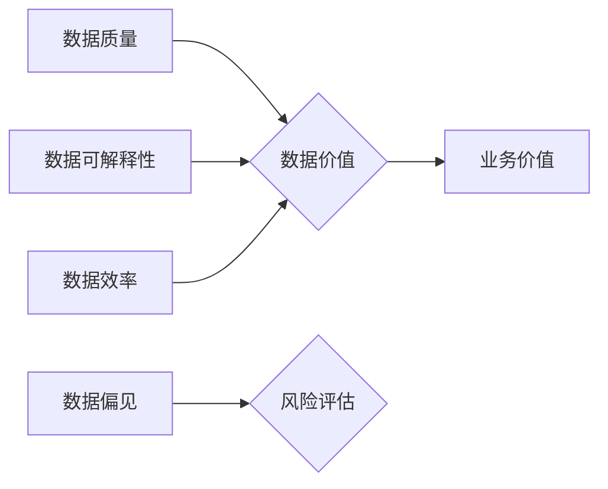

> 数据集评估, 数据价值, 度量体系, 数据质量, 数据可解释性, 数据效率, 数据偏见

## 1. 背景介绍

在数据驱动时代，高质量的数据集是机器学习和人工智能模型成功的关键。然而，传统的评估指标往往侧重于数据集的规模和结构，而忽略了数据价值的内在本质。随着数据量的爆炸式增长和应用场景的不断拓展，如何有效地评估数据集的价值，并将其转化为实际效益，成为一个亟待解决的难题。

传统的评估指标主要包括：

* **数据规模:** 指数据集的大小，通常以样本数量或特征维度来衡量。
* **数据结构:** 指数据集的组织方式，例如结构化、半结构化或非结构化。
* **数据完整性:** 指数据集中的缺失值、错误值和重复值的数量。
* **数据一致性:** 指数据集中的数据是否符合预期的格式和规则。

然而，这些指标仅仅反映了数据集的表面特征，而无法全面地衡量其价值。例如，一个规模庞大但质量低劣的数据集，可能无法为模型训练提供有效的信息，反而会降低模型的性能。

## 2. 核心概念与联系

数据价值的本质在于其对特定任务或目标的贡献。因此，评估数据集的价值，需要从任务目标出发，量化其对模型训练、预测准确率、业务决策等方面的贡献。

**数据价值度量体系**应包含以下核心概念：

* **数据质量:** 指数据集的准确性、完整性、一致性和时效性等方面。
* **数据可解释性:** 指数据集中的信息是否易于理解和解释，以及模型对数据的依赖程度。
* **数据效率:** 指数据集的大小与模型性能之间的关系，即使用较小数据集也能获得良好性能。
* **数据偏见:** 指数据集中的潜在偏差，例如样本分布不均匀、标签噪声等，可能导致模型产生不公平或不准确的预测结果。

**数据价值度量体系架构**



## 3. 核心算法原理 & 具体操作步骤

### 3.1  算法原理概述

数据价值度量体系的构建需要结合多种算法和技术，例如：

* **数据质量评估算法:** 使用统计方法和机器学习模型，评估数据集的准确性、完整性和一致性等指标。
* **数据可解释性评估算法:** 使用可视化技术和模型解释方法，分析模型对数据的依赖程度和预测结果的可解释性。
* **数据效率评估算法:** 使用模型压缩和迁移学习等技术，评估数据集的大小与模型性能之间的关系。
* **数据偏见检测算法:** 使用统计方法和机器学习模型，检测数据集中的潜在偏差，并提出相应的缓解措施。

### 3.2  算法步骤详解

具体操作步骤如下：

1. **数据收集和预处理:** 收集相关数据集，并进行清洗、转换和格式化等预处理操作。
2. **数据质量评估:** 使用数据质量评估算法，评估数据集的准确性、完整性和一致性等指标。
3. **数据可解释性评估:** 使用数据可解释性评估算法，分析模型对数据的依赖程度和预测结果的可解释性。
4. **数据效率评估:** 使用数据效率评估算法，评估数据集的大小与模型性能之间的关系。
5. **数据偏见检测:** 使用数据偏见检测算法，检测数据集中的潜在偏差，并提出相应的缓解措施。
6. **数据价值度量:** 根据上述评估结果，综合计算数据集的整体价值，并将其与任务目标进行关联。

### 3.3  算法优缺点

**优点:**

* **全面性:** 涵盖了数据质量、可解释性、效率和偏见等多个方面，能够更全面地评估数据集的价值。
* **客观性:** 基于算法和数据分析，能够提供更客观的评估结果。
* **可量化:** 将数据价值量化，方便进行比较和决策。

**缺点:**

* **复杂性:** 建立数据价值度量体系需要整合多种算法和技术，有一定的复杂度。
* **主观性:** 数据价值的最终评估仍然需要结合实际应用场景和业务目标，有一定的主观性。

### 3.4  算法应用领域

数据价值度量体系可以应用于以下领域：

* **机器学习模型训练:** 选择最合适的训练数据集，提高模型性能。
* **数据资源管理:** 评估数据资源的价值，制定数据采集和存储策略。
* **数据交易和共享:** 评估数据资产的价值，促进数据交易和共享。
* **数据治理:** 监控数据质量和偏见，保障数据安全和合规性。

## 4. 数学模型和公式 & 详细讲解 & 举例说明

### 4.1  数学模型构建

数据价值度量体系可以构建一个数学模型，将数据价值与任务目标、数据质量、可解释性、效率和偏见等因素进行关联。

例如，可以构建一个线性回归模型，将数据价值作为因变量，数据质量、可解释性、效率和偏见等因素作为自变量。

$$
Value = \beta_0 + \beta_1 * Quality + \beta_2 * Interpretability + \beta_3 * Efficiency + \beta_4 * Bias
$$

其中：

* Value: 数据价值
* Quality: 数据质量
* Interpretability: 数据可解释性
* Efficiency: 数据效率
* Bias: 数据偏见
* $\beta_0$, $\beta_1$, $\beta_2$, $\beta_3$, $\beta_4$: 模型参数

### 4.2  公式推导过程

模型参数的确定可以通过最小二乘法等方法进行。

最小二乘法目标是找到使得模型预测值与实际值之间的误差平方和最小的参数值。

$$
\min_{\beta} \sum_{i=1}^{n} (Value_i - \hat{Value}_i)^2
$$

其中：

* $Value_i$: 第 $i$ 个样本的实际数据价值
* $\hat{Value}_i$: 第 $i$ 个样本的模型预测数据价值

### 4.3  案例分析与讲解

假设我们有一个用于预测房价的机器学习模型，需要评估训练数据集的价值。

我们可以使用上述数学模型，将数据质量、可解释性、效率和偏见等因素作为自变量，将模型预测准确率作为因变量，并通过最小二乘法确定模型参数。

通过分析模型参数，我们可以了解哪些因素对模型性能影响最大，从而更好地评估训练数据集的价值。

## 5. 项目实践：代码实例和详细解释说明

### 5.1  开发环境搭建

* 操作系统: Ubuntu 20.04
* Python 版本: 3.8
* 必要的库: pandas, scikit-learn, matplotlib, seaborn

### 5.2  源代码详细实现

```python
import pandas as pd
from sklearn.model_selection import train_test_split
from sklearn.linear_model import LinearRegression
from sklearn.metrics import mean_squared_error

# 数据加载
data = pd.read_csv('housing_data.csv')

# 数据预处理
# ...

# 特征选择
X = data[['feature1', 'feature2', 'feature3']]
y = data['price']

# 数据分割
X_train, X_test, y_train, y_test = train_test_split(X, y, test_size=0.2, random_state=42)

# 模型训练
model = LinearRegression()
model.fit(X_train, y_train)

# 模型评估
y_pred = model.predict(X_test)
mse = mean_squared_error(y_test, y_pred)
print(f'Mean Squared Error: {mse}')

# 数据价值度量
# ...
```

### 5.3  代码解读与分析

* 数据加载和预处理: 使用 pandas 库加载数据，并进行必要的清洗、转换和格式化操作。
* 特征选择: 选择与目标变量相关的特征作为模型输入。
* 数据分割: 将数据分为训练集和测试集，用于模型训练和评估。
* 模型训练: 使用线性回归模型训练模型，并使用训练集数据进行模型拟合。
* 模型评估: 使用测试集数据评估模型性能，并计算均方误差 (MSE) 作为评估指标。
* 数据价值度量: 根据模型性能和数据质量等因素，计算数据集的价值。

### 5.4  运行结果展示

运行代码后，会输出模型的均方误差值，以及数据集的价值度量结果。

## 6. 实际应用场景

### 6.1  数据驱动的决策支持

数据价值度量体系可以帮助企业更好地理解数据资产的价值，并将其转化为实际效益。例如，可以用于评估不同数据源的价值，选择最合适的训练数据集，提高模型预测准确率，从而支持更科学的数据驱动的决策。

### 6.2  数据资源管理

数据价值度量体系可以帮助企业更好地管理数据资源，提高数据利用效率。例如，可以用于评估数据资源的价值，制定数据采集和存储策略，并进行数据共享和交易。

### 6.3  数据质量控制

数据价值度量体系可以帮助企业监控数据质量，并及时发现和解决数据问题。例如，可以用于评估数据质量指标，检测数据偏见，并提出相应的缓解措施。

### 6.4  未来应用展望

随着人工智能技术的不断发展，数据价值度量体系将发挥越来越重要的作用。未来，数据价值度量体系将更加智能化、自动化，并能够更好地适应复杂的数据场景。

## 7. 工具和资源推荐

### 7.1  学习资源推荐

* **书籍:**
    * "Data Science for Business" by Foster Provost and Tom Fawcett
    * "The Elements of Statistical Learning" by Trevor Hastie, Robert Tibshirani, and Jerome Friedman
* **在线课程:**
    * Coursera: Machine Learning by Andrew Ng
    * edX: Data Science Fundamentals

### 7.2  开发工具推荐

* **Python:** 
    * pandas: 数据分析和处理
    * scikit-learn: 机器学习算法
    * matplotlib: 数据可视化
    * seaborn: 数据可视化
* **R:** 
    * tidyverse: 数据分析和可视化
    * caret: 机器学习算法

### 7.3  相关论文推荐

* "Measuring the Value of Data" by Luca Massaron et al.
* "Data Quality Assessment: A Survey" by Jian Pei et al.
* "Fairness and Bias in Machine Learning" by Timnit Gebru et al.

## 8. 总结：未来发展趋势与挑战

### 8.1  研究成果总结

数据价值度量体系的研究取得了显著进展，为评估和利用数据资产提供了新的思路和方法。

### 8.2  未来发展趋势

* **更加智能化和自动化:** 利用人工智能技术，自动评估数据价值，并提供个性化的建议。
* **更加细粒度和场景化:** 针对不同应用场景，构建更加细粒度的价值度量模型。
* **更加注重数据可解释性:** 提高数据价值度量模型的可解释性，帮助用户更好地理解数据价值的来源和影响因素。

### 8.3  面临的挑战

* **数据价值的定义和度量:** 数据价值是一个复杂的概念，缺乏统一的定义和度量标准。
* **数据价值的计算方法:** 现有的数据价值度量方法仍然存在局限性，需要进一步改进和完善。
* **数据价值的应用场景:** 数据价值度量体系的应用场景仍然有限，需要更多的实践和探索。

### 8.4  研究展望

未来，数据价值度量体系的研究将继续深入，并朝着更加智能化、自动化、细粒度和场景化的方向发展。


## 9. 附录：常见问题与解答

**1. 如何评估数据质量？**

数据质量可以评估通过多种指标，例如准确性、完整性、一致性和时效性等