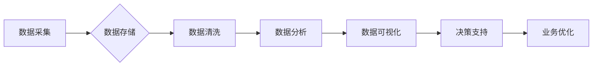

> 数据驱动，数字化转型，数据分析，机器学习，人工智能，企业架构，数据可视化，数据治理

## 1. 背景介绍

在当今数字化时代，数据已成为企业最重要的资产。企业通过收集、分析和利用数据，可以洞察市场趋势、优化运营流程、提升客户体验，最终实现业务增长和竞争优势。然而，仅仅拥有大量数据并不能带来价值，企业需要将数据转化为可行动的洞察，并将其融入到业务决策和运营流程中。这就是数据驱动的企业转型。

数据驱动的企业转型是指企业利用数据分析、机器学习、人工智能等技术，将数据作为核心驱动力，推动企业业务模式、运营流程、组织结构和文化等方面的变革，实现数字化转型。

## 2. 核心概念与联系

**2.1 数据驱动**

数据驱动是指以数据为基础，通过数据分析和洞察，指导企业决策和行动。数据驱动强调数据质量、数据可访问性和数据分析能力，并将其融入到企业战略、运营和管理各个环节。

**2.2 数字化转型**

数字化转型是指企业利用数字化技术，重构业务模式、运营流程和组织结构，实现业务创新和价值创造。数字化转型涵盖多个方面，包括业务流程数字化、数据化、智能化、平台化等。

**2.3 数据驱动的企业转型关系**

数据驱动是数字化转型的关键驱动力。通过数据分析和洞察，企业可以更好地了解客户需求、市场趋势和业务运营状况，从而制定更精准的战略、优化运营流程、提升客户体验，最终实现数字化转型目标。

**2.4 数据驱动的企业转型架构**



**2.5 数据驱动的企业转型流程**

1. **数据采集:** 收集来自各种来源的数据，例如客户数据、销售数据、运营数据等。
2. **数据存储:** 将收集到的数据存储在安全可靠的数据库中。
3. **数据清洗:** 对数据进行清洗和处理，去除无效数据、错误数据和重复数据，确保数据质量。
4. **数据分析:** 使用数据分析工具和技术，对数据进行分析和挖掘，发现数据中的规律和趋势。
5. **数据可视化:** 将数据分析结果以图表、报表等形式进行可视化展示，方便用户理解和决策。
6. **决策支持:** 基于数据分析结果，为企业决策提供支持和建议。
7. **业务优化:** 根据数据分析结果，优化企业业务流程、运营策略和产品服务，提升企业效率和效益。

## 3. 核心算法原理 & 具体操作步骤

**3.1 算法原理概述**

数据驱动的企业转型中，常用的算法包括：

* **回归分析:** 用于预测连续型变量，例如销售额、客户流失率等。
* **分类算法:** 用于分类离散型变量，例如客户类型、产品推荐等。
* **聚类算法:** 用于将数据点分组，例如客户细分、市场segmentation等。
* **关联规则挖掘:** 用于发现数据之间的关联关系，例如市场营销、产品组合推荐等。

**3.2 算法步骤详解**

以回归分析为例，其步骤如下：

1. **数据准备:** 收集相关数据，并进行清洗、处理和转换。
2. **模型选择:** 根据数据特点和预测目标，选择合适的回归模型，例如线性回归、逻辑回归等。
3. **模型训练:** 使用训练数据训练模型，学习数据之间的关系。
4. **模型评估:** 使用测试数据评估模型的性能，例如准确率、误差率等。
5. **模型优化:** 根据评估结果，调整模型参数，提高模型性能。
6. **模型部署:** 将训练好的模型部署到生产环境中，用于预测新的数据。

**3.3 算法优缺点**

不同的算法具有不同的优缺点，需要根据具体应用场景选择合适的算法。

**3.4 算法应用领域**

数据驱动的算法广泛应用于各个行业，例如：

* **金融行业:** 风险评估、信用评分、欺诈检测等。
* **零售行业:** 商品推荐、库存管理、客户关系管理等。
* **医疗行业:** 疾病诊断、药物研发、患者管理等。
* **制造业:** 预测性维护、质量控制、生产优化等。

## 4. 数学模型和公式 & 详细讲解 & 举例说明

**4.1 数学模型构建**

在数据驱动的企业转型中，数学模型是描述数据关系和预测未来趋势的重要工具。常见的数学模型包括线性回归模型、逻辑回归模型、支持向量机模型等。

**4.2 公式推导过程**

以线性回归模型为例，其目标是找到一条直线，使得这条直线与数据点之间的距离最小。

线性回归模型的数学公式如下：

$$y = mx + c$$

其中：

* $y$ 是预测值
* $x$ 是输入变量
* $m$ 是斜率
* $c$ 是截距

**4.3 案例分析与讲解**

假设我们想要预测房屋价格，输入变量为房屋面积，输出变量为房屋价格。我们可以使用线性回归模型来建立房屋价格预测模型。

通过收集房屋面积和房屋价格的数据，我们可以使用最小二乘法来估计模型参数 $m$ 和 $c$。

**4.4 举例说明**

假设我们收集了以下数据：

| 房屋面积 (平方米) | 房屋价格 (万元) |
|---|---|
| 60 | 100 |
| 80 | 150 |
| 100 | 200 |
| 120 | 250 |

使用最小二乘法，我们可以得到以下线性回归模型：

$$y = 1.67x + 66.67$$

其中：

* $y$ 是房屋价格 (万元)
* $x$ 是房屋面积 (平方米)

**4.5 模型预测**

如果我们想要预测面积为 150 平方米的房屋价格，我们可以将 $x = 150$ 代入模型公式：

$$y = 1.67 * 150 + 66.67 = 300.00$$

因此，我们预测面积为 150 平方米的房屋价格为 300 万元。

## 5. 项目实践：代码实例和详细解释说明

**5.1 开发环境搭建**

* 操作系统: Ubuntu 20.04 LTS
* Python 版本: 3.8.10
* 必要的库: pandas, numpy, scikit-learn

**5.2 源代码详细实现**

```python
import pandas as pd
from sklearn.linear_model import LinearRegression
from sklearn.model_selection import train_test_split

# 加载数据
data = pd.read_csv('house_data.csv')

# 划分训练集和测试集
X = data[['面积']]
y = data['价格']
X_train, X_test, y_train, y_test = train_test_split(X, y, test_size=0.2, random_state=42)

# 创建线性回归模型
model = LinearRegression()

# 训练模型
model.fit(X_train, y_train)

# 预测测试集数据
y_pred = model.predict(X_test)

# 评估模型性能
from sklearn.metrics import mean_squared_error
mse = mean_squared_error(y_test, y_pred)
print(f'均方误差: {mse}')

# 打印模型参数
print(f'斜率: {model.coef_[0]}')
print(f'截距: {model.intercept_}')
```

**5.3 代码解读与分析**

* 首先，我们加载数据并划分训练集和测试集。
* 然后，我们创建线性回归模型并训练模型。
* 接着，我们使用训练好的模型预测测试集数据。
* 最后，我们评估模型性能并打印模型参数。

**5.4 运行结果展示**

运行代码后，会输出模型的均方误差和模型参数。

## 6. 实际应用场景

**6.1 客户关系管理 (CRM)**

数据驱动的企业转型可以帮助企业更好地了解客户需求，提供个性化服务，提升客户满意度和忠诚度。例如，企业可以利用客户购买历史、浏览记录、反馈意见等数据，进行客户细分，并针对不同客户群体的需求，提供个性化的产品推荐、营销活动和服务方案。

**6.2 市场营销**

数据驱动的企业转型可以帮助企业优化营销策略，提高营销效率和投资回报率。例如，企业可以利用市场调研数据、客户行为数据、广告投放数据等，进行市场分析和预测，制定更精准的营销目标、选择更有效的营销渠道，并根据营销效果进行实时调整。

**6.3 运营管理**

数据驱动的企业转型可以帮助企业优化运营流程，提高运营效率和成本效益。例如，企业可以利用生产数据、物流数据、库存数据等，进行运营分析和优化，提高生产效率、降低物流成本、优化库存管理。

**6.4 产品开发**

数据驱动的企业转型可以帮助企业更好地了解客户需求，开发更符合市场需求的产品。例如，企业可以利用用户反馈、市场调研数据、竞争对手产品分析等，进行产品需求分析和市场调研，开发更具竞争力的产品。

**6.5 未来应用展望**

随着数据量的不断增长和人工智能技术的不断发展，数据驱动的企业转型将更加深入和广泛。未来，数据驱动的企业转型将更加注重以下几个方面：

* **数据智能化:** 利用人工智能技术，对数据进行更深入的分析和挖掘，发现更隐含的规律和趋势。
* **数据可视化:** 利用数据可视化技术，将数据分析结果以更直观的方式呈现，方便用户理解和决策。
* **数据安全和隐私保护:** 加强数据安全和隐私保护措施，确保数据的安全性和可靠性。

## 7. 工具和资源推荐

**7.1 学习资源推荐**

* **书籍:**
    * 《数据科学实战》
    * 《Python数据分析》
    * 《机器学习》
* **在线课程:**
    * Coursera: 数据科学、机器学习
    * edX: 数据分析、人工智能
    * Udemy: Python编程、数据分析

**7.2 开发工具推荐**

* **Python:** 数据分析、机器学习、人工智能
* **R:** 数据分析、统计学
* **SQL:** 数据查询、数据管理
* **Tableau:** 数据可视化
* **Power BI:** 数据可视化

**7.3 相关论文推荐**

* 《数据驱动决策的理论与实践》
* 《人工智能在企业转型中的应用》
* 《数据可视化在企业管理中的应用》

## 8. 总结：未来发展趋势与挑战

**8.1 研究成果总结**

数据驱动的企业转型已经取得了显著的成果，帮助企业提高运营效率、降低成本、提升客户体验，并实现业务增长和竞争优势。

**8.2 未来发展趋势**

未来，数据驱动的企业转型将更加注重以下几个方面：

* **数据智能化:** 利用人工智能技术，对数据进行更深入的分析和挖掘，发现更隐含的规律和趋势。
* **数据可视化:** 利用数据可视化技术，将数据分析结果以更直观的方式呈现，方便用户理解和决策。
* **数据安全和隐私保护:** 加强数据安全和隐私保护措施，确保数据的安全性和可靠性。

**8.3 面临的挑战**

数据驱动的企业转型也面临着一些挑战，例如：

* **数据质量问题:** 企业数据往往存在不完整、不准确、不一致等问题，需要进行数据清洗和处理。
* **数据安全和隐私问题:** 企业需要加强数据安全和隐私保护措施，防止数据泄露