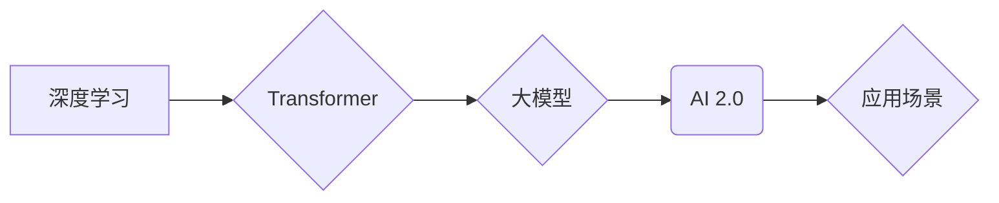

> 人工智能，深度学习，Transformer，大模型，AI 2.0，应用场景，未来趋势

## 1. 背景介绍

人工智能（AI）技术近年来发展迅速，从最初的局限于特定领域的应用，逐渐发展到涵盖各个领域的广泛应用。随着深度学习算法的突破和计算能力的提升，人工智能进入了新的发展阶段——AI 2.0时代。

AI 2.0时代的特点是：

* **模型规模的指数级增长:**  大型语言模型（LLM）的出现，如GPT-3、LaMDA等，拥有数十亿甚至数千亿的参数，展现出强大的泛化能力和学习能力。
* **跨模态学习的兴起:**  AI 2.0时代不仅限于文本处理，还开始融合图像、音频、视频等多模态数据，实现更全面的理解和交互。
* **应用场景的广泛拓展:**  AI 2.0技术应用于医疗、教育、金融、制造等各个领域，为社会发展带来巨大变革。

## 2. 核心概念与联系

**2.1 深度学习**

深度学习是机器学习的一种重要分支，它利用多层神经网络来模拟人类大脑的学习过程。深度学习模型能够从海量数据中自动提取特征，并进行复杂的模式识别和预测。

**2.2 Transformer**

Transformer是一种新型的神经网络架构，它引入了注意力机制，能够有效地捕捉序列数据中的长距离依赖关系。Transformer在自然语言处理领域取得了突破性的进展，成为构建大型语言模型的基础。

**2.3 大模型**

大模型是指参数规模庞大的深度学习模型，通常拥有数十亿甚至数千亿的参数。大模型具有强大的泛化能力和学习能力，能够在多种任务上表现出色。

**2.4 AI 2.0**

AI 2.0时代是指深度学习、Transformer、大模型等技术的融合，以及这些技术应用于各个领域的广泛拓展。AI 2.0时代标志着人工智能技术进入了一个新的发展阶段，其应用场景和影响力将更加广泛和深刻。

**2.5 应用场景**

AI 2.0技术应用于各个领域，例如：

* **自然语言处理:**  机器翻译、文本摘要、对话系统、问答系统等。
* **计算机视觉:**  图像识别、物体检测、图像生成、视频分析等。
* **语音识别:**  语音转文本、语音合成、语音助手等。
* **医疗保健:**  疾病诊断、药物研发、个性化医疗等。
* **金融服务:**  欺诈检测、风险管理、投资决策等。

**Mermaid 流程图**



## 3. 核心算法原理 & 具体操作步骤

### 3.1 算法原理概述

Transformer是一种基于注意力机制的神经网络架构，它能够有效地捕捉序列数据中的长距离依赖关系。Transformer由编码器和解码器两部分组成，编码器用于将输入序列编码成上下文向量，解码器则利用上下文向量生成输出序列。

**注意力机制**

注意力机制是一种机制，它允许模型关注输入序列中与当前任务相关的部分，并忽略无关的部分。注意力机制可以提高模型的准确性和效率。

### 3.2 算法步骤详解

1. **输入序列编码:** 将输入序列中的每个单词转换为词向量，并通过编码器进行编码，生成上下文向量。
2. **解码器生成输出:** 解码器利用上下文向量生成输出序列，每个单词的生成都依赖于之前生成的单词和上下文向量。
3. **注意力机制:** 在编码和解码过程中，注意力机制被用来选择与当前任务相关的输入信息，提高模型的准确性和效率。

### 3.3 算法优缺点

**优点:**

* 能够有效地捕捉长距离依赖关系。
* 训练速度快，收敛性好。
* 在自然语言处理任务上取得了突破性的进展。

**缺点:**

* 参数量大，需要大量的计算资源。
* 对训练数据要求较高。

### 3.4 算法应用领域

Transformer算法广泛应用于自然语言处理领域，例如：

* 机器翻译
* 文本摘要
* 问答系统
* 对话系统
* 代码生成

## 4. 数学模型和公式 & 详细讲解 & 举例说明

### 4.1 数学模型构建

Transformer模型的数学模型主要包括以下几个部分：

* **词嵌入:** 将每个单词转换为一个低维向量，表示单词的语义信息。
* **多头注意力机制:** 允许模型关注输入序列中与当前任务相关的部分，并忽略无关的部分。
* **前馈神经网络:** 对每个单词的上下文向量进行非线性变换，提取更深层次的语义信息。
* **位置编码:** 为每个单词添加位置信息，使模型能够理解单词在序列中的顺序。

### 4.2 公式推导过程

**注意力机制公式:**

$$
Attention(Q, K, V) = softmax(\frac{QK^T}{\sqrt{d_k}})V
$$

其中：

* $Q$：查询矩阵
* $K$：键矩阵
* $V$：值矩阵
* $d_k$：键向量的维度
* $softmax$：softmax函数

**多头注意力机制公式:**

$$
MultiHead(Q, K, V) = Concat(head_1, head_2, ..., head_h)W_O
$$

其中：

* $head_i$：第 $i$ 个注意力头的输出
* $h$：注意力头的数量
* $W_O$：最终输出层的权重矩阵

### 4.3 案例分析与讲解

**机器翻译案例:**

在机器翻译任务中，Transformer模型可以将源语言文本编码成上下文向量，然后利用解码器生成目标语言文本。注意力机制可以帮助模型关注源语言文本中与目标语言文本相关的部分，提高翻译的准确性和流畅度。

## 5. 项目实践：代码实例和详细解释说明

### 5.1 开发环境搭建

* Python 3.7+
* TensorFlow 2.0+
* PyTorch 1.0+

### 5.2 源代码详细实现

```python
# 导入必要的库
import tensorflow as tf

# 定义Transformer模型
class Transformer(tf.keras.Model):
    def __init__(self, vocab_size, embedding_dim, num_heads, num_layers):
        super(Transformer, self).__init__()
        self.embedding = tf.keras.layers.Embedding(vocab_size, embedding_dim)
        self.encoder = tf.keras.layers.StackedRNNCells([tf.keras.layers.LSTM(embedding_dim) for _ in range(num_layers)])
        self.decoder = tf.keras.layers.StackedRNNCells([tf.keras.layers.LSTM(embedding_dim) for _ in range(num_layers)])
        self.attention = tf.keras.layers.MultiHeadAttention(num_heads=num_heads, key_dim=embedding_dim)

    def call(self, inputs):
        # 嵌入输入序列
        embedded_inputs = self.embedding(inputs)
        # 对输入序列进行编码
        encoded_inputs = self.encoder(embedded_inputs)
        # 对编码后的输入序列进行解码
        decoded_inputs = self.decoder(encoded_inputs)
        # 使用注意力机制对解码后的输出序列进行处理
        attended_outputs = self.attention(decoded_inputs, encoded_inputs)
        return attended_outputs

# 实例化Transformer模型
model = Transformer(vocab_size=10000, embedding_dim=128, num_heads=8, num_layers=6)

# 训练模型
model.compile(optimizer='adam', loss='mse')
model.fit(x_train, y_train, epochs=10)

# 预测结果
predictions = model.predict(x_test)
```

### 5.3 代码解读与分析

* **模型定义:** Transformer模型由嵌入层、编码器、解码器和注意力机制组成。
* **嵌入层:** 将每个单词转换为一个低维向量，表示单词的语义信息。
* **编码器:** 对输入序列进行编码，生成上下文向量。
* **解码器:** 利用上下文向量生成输出序列。
* **注意力机制:** 帮助模型关注输入序列中与当前任务相关的部分。
* **训练模型:** 使用Adam优化器和均方误差损失函数训练模型。

### 5.4 运行结果展示

训练完成后，可以使用模型对新的输入序列进行预测，并展示预测结果。

## 6. 实际应用场景

### 6.1 自然语言处理

* **机器翻译:** Transformer模型在机器翻译任务上取得了突破性的进展，例如Google Translate、DeepL等翻译工具都使用了Transformer模型。
* **文本摘要:** Transformer模型可以自动生成文本摘要，例如新闻摘要、会议记录摘要等。
* **问答系统:** Transformer模型可以构建问答系统，例如自动回答用户的问题，例如搜索引擎、聊天机器人等。

### 6.2 计算机视觉

* **图像识别:** Transformer模型可以用于图像识别任务，例如识别物体、场景、人物等。
* **图像生成:** Transformer模型可以生成新的图像，例如绘画、照片合成等。

### 6.3 语音识别

* **语音转文本:** Transformer模型可以将语音转换为文本，例如语音助手、语音输入等。
* **语音合成:** Transformer模型可以将文本转换为语音，例如语音播报、语音合成等。

### 6.4 其他领域

* **医疗保健:** Transformer模型可以用于疾病诊断、药物研发、个性化医疗等。
* **金融服务:** Transformer模型可以用于欺诈检测、风险管理、投资决策等。

### 6.5 未来应用展望

AI 2.0技术将继续发展，并应用于更多领域，例如：

* **自动驾驶:** Transformer模型可以用于自动驾驶系统的决策和控制。
* **机器人:** Transformer模型可以用于机器人感知、决策和控制。
* **教育:** Transformer模型可以用于个性化教育、智能辅导等。

## 7. 工具和资源推荐

### 7.1 学习资源推荐

* **书籍:**
    * 《深度学习》
    * 《Transformer 详解》
* **在线课程:**
    * Coursera: 深度学习
    * Udacity: 自然语言处理
* **博客:**
    * The Gradient
    * Towards Data Science

### 7.2 开发工具推荐

* **TensorFlow:** 开源深度学习框架
* **PyTorch:** 开源深度学习框架
* **Hugging Face:** 提供预训练模型和工具

### 7.3 相关论文推荐

* **Attention Is All You Need:** https://arxiv.org/abs/1706.03762
* **BERT: Pre-training of Deep Bidirectional Transformers for Language Understanding:** https://arxiv.org/abs/1810.04805
* **GPT-3: Language Models are Few-Shot Learners:** https://arxiv.org/abs/2005.14165

## 8. 总结：未来发展趋势与挑战

### 8.1 研究成果总结

AI 2.0时代取得了显著的成果，例如：

* **模型规模的指数级增长:** 大模型的出现，例如GPT-3、LaMDA等，展现出强大的泛化能力和学习能力。
* **跨模态学习的兴起:** AI 2.0时代开始融合图像、音频、视频等多模态数据，实现更全面的理解和交互。
* **应用场景的广泛拓展:** AI 2.0技术应用于各个领域，例如医疗、教育、金融等，为社会发展带来巨大变革。

### 8.2 未来发展趋势

* **模型规模的进一步增长:** 未来将出现规模更大的模型，拥有更强的学习能力和泛化能力。
* **多模态学习的深入发展:** AI 2.0将更加注重多模态数据的融合，实现更全面的理解和交互。
* **应用场景的进一步拓展:** AI 2.0将应用于更多