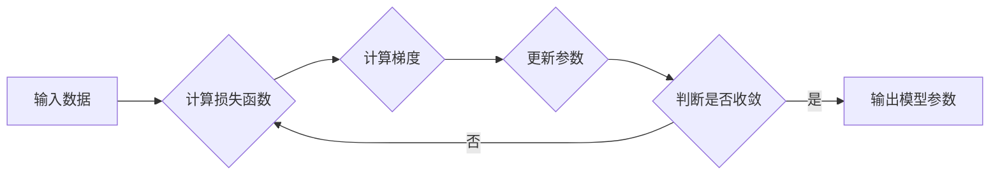

> 梯度下降，机器学习，优化算法，损失函数，偏导数，学习率，代码实例

## 1. 背景介绍

在机器学习领域，模型训练的核心是找到最优的模型参数，使得模型在给定数据上表现最佳。而梯度下降算法作为一种经典的优化算法，在机器学习模型训练中扮演着至关重要的角色。它通过迭代更新模型参数，逐步降低模型的损失函数值，最终逼近最优解。

梯度下降算法的应用范围非常广泛，涵盖了图像识别、自然语言处理、推荐系统等众多领域。理解梯度下降算法的原理和实现细节对于机器学习 practitioners 来说至关重要。

## 2. 核心概念与联系

**2.1 核心概念**

* **损失函数 (Loss Function):** 用于衡量模型预测结果与真实值的差距。损失函数越小，模型的预测效果越好。
* **梯度 (Gradient):** 损失函数在当前参数值处的导数，表示损失函数变化的方向和速率。
* **学习率 (Learning Rate):** 用于控制参数更新的步长。学习率过大可能会导致模型震荡，学习率过小可能会导致训练速度过慢。

**2.2 核心联系**

梯度下降算法的核心思想是利用梯度信息来迭代更新模型参数，逐步降低损失函数值。具体来说，算法会计算损失函数在当前参数值处的梯度，然后根据梯度方向和学习率更新参数值。

**2.3 流程图**



## 3. 核心算法原理 & 具体操作步骤

### 3.1 算法原理概述

梯度下降算法的基本原理是利用损失函数的梯度信息来迭代更新模型参数。

* 首先，算法会选择一个初始的模型参数值。
* 然后，算法会计算损失函数在当前参数值处的梯度。
* 接着，算法会根据梯度方向和学习率更新参数值。
* 算法会重复以上步骤，直到损失函数值收敛到一个足够小的值，或者达到预设的迭代次数。

### 3.2 算法步骤详解

1. **初始化参数:** 随机选择一个初始的模型参数值。
2. **计算损失函数:** 使用当前参数值计算模型在给定数据上的损失函数值。
3. **计算梯度:** 计算损失函数在当前参数值处的梯度。
4. **更新参数:** 根据梯度方向和学习率更新参数值。
5. **重复步骤2-4:** 重复以上步骤，直到损失函数值收敛或者达到预设的迭代次数。

### 3.3 算法优缺点

**优点:**

* 算法简单易懂，易于实现。
* 能够找到局部最优解。

**缺点:**

* 容易陷入局部最优解。
* 学习率的选择对算法性能影响较大。
* 对于高维数据，梯度下降算法的收敛速度可能较慢。

### 3.4 算法应用领域

梯度下降算法广泛应用于机器学习领域，例如：

* 线性回归
* Logistic 回归
* 神经网络
* 支持向量机

## 4. 数学模型和公式 & 详细讲解 & 举例说明

### 4.1 数学模型构建

假设我们有一个模型参数向量 $\theta$，以及一个损失函数 $J(\theta)$。我们的目标是找到最优的 $\theta$，使得 $J(\theta)$ 最小。

### 4.2 公式推导过程

梯度下降算法的更新规则如下：

$$\theta = \theta - \alpha \nabla J(\theta)$$

其中：

* $\theta$ 是模型参数向量
* $\alpha$ 是学习率
* $\nabla J(\theta)$ 是损失函数 $J(\theta)$ 在当前参数值处的梯度

### 4.3 案例分析与讲解

假设我们有一个线性回归模型，损失函数为均方误差：

$$J(\theta) = \frac{1}{2m} \sum_{i=1}^{m} (h_\theta(x^{(i)}) - y^{(i)})^2$$

其中：

* $m$ 是训练样本的数量
* $h_\theta(x^{(i)})$ 是模型在输入 $x^{(i)}$ 上的预测值
* $y^{(i)}$ 是真实值

梯度下降算法的更新规则为：

$$\theta = \theta - \alpha \frac{1}{m} \sum_{i=1}^{m} (h_\theta(x^{(i)}) - y^{(i)})x^{(i)}$$

## 5. 项目实践：代码实例和详细解释说明

### 5.1 开发环境搭建

* Python 3.x
* NumPy
* Matplotlib

### 5.2 源代码详细实现

```python
import numpy as np
import matplotlib.pyplot as plt

# 生成随机数据
X = np.random.rand(100, 1)
y = 2 * X + 1 + np.random.randn(100, 1)

# 定义损失函数
def loss_function(theta, X, y):
    return np.mean((X @ theta - y)**2)

# 定义梯度下降算法
def gradient_descent(X, y, theta, learning_rate, iterations):
    for i in range(iterations):
        gradient = (1 / len(X)) * X.T @ (X @ theta - y)
        theta -= learning_rate * gradient
    return theta

# 初始化参数
theta = np.zeros((1, 1))

# 设置学习率和迭代次数
learning_rate = 0.01
iterations = 1000

# 执行梯度下降算法
theta = gradient_descent(X, y, theta, learning_rate, iterations)

# 绘制结果
plt.scatter(X, y)
plt.plot(X, X @ theta, color='red')
plt.show()
```

### 5.3 代码解读与分析

* 首先，我们生成随机数据，并定义损失函数和梯度下降算法。
* 然后，我们初始化参数，设置学习率和迭代次数。
* 最后，我们执行梯度下降算法，并绘制结果。

### 5.4 运行结果展示

运行代码后，会生成一个散点图，其中每个点代表一个训练样本。红色曲线表示模型的预测结果。

## 6. 实际应用场景

梯度下降算法在机器学习领域有着广泛的应用场景，例如：

* **图像识别:** 训练卷积神经网络进行图像分类、目标检测等任务。
* **自然语言处理:** 训练循环神经网络进行文本分类、机器翻译等任务。
* **推荐系统:** 训练协同过滤模型进行用户兴趣推荐。

### 6.4 未来应用展望

随着机器学习技术的不断发展，梯度下降算法的应用场景将会更加广泛。例如，在深度学习领域，梯度下降算法被用于训练越来越复杂的模型，例如生成对抗网络 (GAN) 和 transformers。

## 7. 工具和资源推荐

### 7.1 学习资源推荐

* **书籍:**
    * "Deep Learning" by Ian Goodfellow, Yoshua Bengio, and Aaron Courville
    * "Hands-On Machine Learning with Scikit-Learn, Keras & TensorFlow" by Aurélien Géron
* **在线课程:**
    * Coursera: Machine Learning by Andrew Ng
    * Udacity: Deep Learning Nanodegree

### 7.2 开发工具推荐

* **Python:** 
    * NumPy
    * Scikit-learn
    * TensorFlow
    * PyTorch

### 7.3 相关论文推荐

* "On the Convergence of Gradient Descent" by Robbins and Monro
* "Stochastic Gradient Descent" by Bottou

## 8. 总结：未来发展趋势与挑战

### 8.1 研究成果总结

梯度下降算法作为一种经典的优化算法，在机器学习领域取得了巨大的成功。它为训练各种机器学习模型提供了强大的工具。

### 8.2 未来发展趋势

未来，梯度下降算法的研究将继续朝着以下方向发展：

* **加速梯度下降算法:** 探索新的算法和技巧，提高梯度下降算法的收敛速度。
* **解决梯度下降算法的缺陷:** 研究如何解决梯度下降算法容易陷入局部最优解的问题。
* **将梯度下降算法应用于更复杂的任务:** 将梯度下降算法应用于更复杂的机器学习任务，例如强化学习和生成对抗网络。

### 8.3 面临的挑战

梯度下降算法也面临着一些挑战，例如：

* **高维数据:** 对于高维数据，梯度下降算法的收敛速度可能较慢。
* **非凸损失函数:** 当损失函数是非凸的时，梯度下降算法可能难以找到全局最优解。
* **稀疏数据:** 对于稀疏数据，梯度下降算法的性能可能下降。

### 8.4 研究展望

未来，梯度下降算法的研究将继续深入，探索新的算法和技巧，以解决上述挑战，并将其应用于更广泛的机器学习领域。

## 9. 附录：常见问题与解答

**问题 1:** 学习率应该如何选择？

**答案:** 学习率的选择对梯度下降算法的性能影响很大。学习率过大可能会导致模型震荡，学习率过小可能会导致训练速度过慢。通常，可以先选择一个较小的学习率，然后逐渐增大学习率，直到模型收敛。

**问题 2:** 梯度下降算法容易陷入局部最优解，如何解决这个问题？

**答案:** 

* 使用随机梯度下降 (SGD) 或 mini-batch gradient descent，可以避免陷入局部最优解。
* 使用动量 (momentum) 或自适应学习率 (Adam, RMSprop) 等技巧，可以加速收敛速度，并避免陷入局部最优解。

**问题 3:** 梯度下降算法适用于哪些类型的损失函数？

**答案:** 梯度下降算法适用于大多数类型的连续损失函数，例如均方误差、交叉熵损失等。


作者：禅与计算机程序设计艺术 / Zen and the Art of Computer Programming 
<end_of_turn>