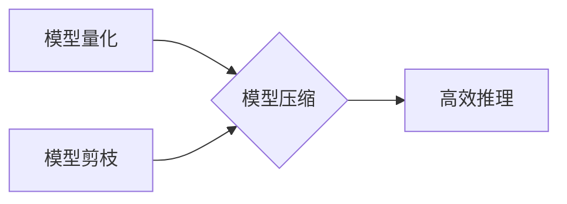

> 模型量化，模型剪枝，深度学习，模型压缩，高效推理，代码实战

## 1. 背景介绍

深度学习模型在图像识别、自然语言处理等领域取得了显著成就，但其庞大的模型规模和高昂的计算成本限制了其在移动设备、嵌入式系统等资源受限环境中的应用。为了解决这一问题，模型量化和模型剪枝等模型压缩技术应运而生。

模型量化是指将模型参数的精度降低，例如将32位浮点数转换为8位整数，从而减少模型参数的存储空间和计算量。模型剪枝是指通过移除模型中不重要的参数或连接，从而减小模型规模。

模型量化和模型剪枝都是有效的模型压缩技术，它们可以显著降低模型的尺寸和计算成本，同时保持模型性能。

## 2. 核心概念与联系

模型量化和模型剪枝都是为了解决深度学习模型体积庞大、计算成本高的问题而提出的技术。

**模型量化**

* 将模型参数的精度降低，例如将32位浮点数转换为8位整数。
* 降低模型参数的存储空间和计算量。
* 常见的量化方法包括：
    * 量化感知训练 (Quantization-Aware Training)
    * 后向量化 (Post-Training Quantization)

**模型剪枝**

* 通过移除模型中不重要的参数或连接，从而减小模型规模。
* 常见的剪枝方法包括：
    * 权重剪枝 (Weight Pruning)
    * 稀疏连接剪枝 (Sparse Connectivity Pruning)

**模型量化与模型剪枝的联系**

模型量化和模型剪枝可以相互配合使用，以进一步压缩模型规模和降低计算成本。例如，可以先对模型进行剪枝，然后对剪枝后的模型进行量化。



## 3. 核心算法原理 & 具体操作步骤

### 3.1  算法原理概述

模型量化和模型剪枝都是基于以下原理：

* **冗余性:** 深度学习模型中存在大量的冗余参数和连接，这些参数和连接对模型性能贡献很小。
* **可近似性:** 模型参数和连接的精度可以降低，而不会显著影响模型性能。

### 3.2  算法步骤详解

**模型量化**

1. **选择量化方法:** 根据模型结构和应用场景选择合适的量化方法，例如量化感知训练或后向量化。
2. **量化参数:** 将模型参数的精度降低，例如将32位浮点数转换为8位整数。
3. **调整模型结构:** 可能需要对模型结构进行调整，例如增加量化层或修改激活函数。
4. **重新训练模型:** 使用量化后的模型进行微调，以恢复模型性能。

**模型剪枝**

1. **选择剪枝方法:** 根据模型结构和应用场景选择合适的剪枝方法，例如权重剪枝或稀疏连接剪枝。
2. **计算参数重要性:** 使用一些方法，例如梯度下降或L1正则化，计算每个参数的重要性。
3. **移除不重要的参数:** 根据参数重要性，移除一些不重要的参数或连接。
4. **重新训练模型:** 使用剪枝后的模型进行微调，以恢复模型性能。

### 3.3  算法优缺点

**模型量化**

* **优点:**
    * 压缩率高
    * 计算成本低
    * 易于实现
* **缺点:**
    * 可能导致模型性能下降
    * 对于某些模型类型，效果不佳

**模型剪枝**

* **优点:**
    * 可以显著降低模型规模
    * 性能损失相对较小
* **缺点:**
    * 算法复杂度高
    * 需要大量的计算资源

### 3.4  算法应用领域

模型量化和模型剪枝在以下领域有广泛的应用:

* **移动设备:** 将深度学习模型部署到移动设备上，以实现实时语音识别、图像识别等功能。
* **嵌入式系统:** 将深度学习模型部署到嵌入式系统上，以实现资源受限环境下的智能感知。
* **边缘计算:** 将深度学习模型部署到边缘设备上，以实现数据本地处理和快速响应。

## 4. 数学模型和公式 & 详细讲解 & 举例说明

### 4.1  数学模型构建

模型量化可以看作是一个离散化的过程，将连续的浮点数参数映射到离散的整数范围内。

假设模型参数为 $w$，其原始精度为 $b$ 位浮点数，目标精度为 $a$ 位整数。则模型量化过程可以表示为：

$$
w_{quantized} = \text{round}(w / 2^{(b-a)}) * 2^{(b-a)}
$$

其中，$\text{round}$ 函数表示取整操作。

### 4.2  公式推导过程

该公式的推导过程如下：

1. 将原始参数 $w$ 转换为整数范围：$w / 2^{(b-a)}$
2. 使用取整函数 $\text{round}$ 将结果取整：$\text{round}(w / 2^{(b-a)})$
3. 将结果乘以 $2^{(b-a)}$，恢复到目标精度：$\text{round}(w / 2^{(b-a)}) * 2^{(b-a)}$

### 4.3  案例分析与讲解

例如，将32位浮点数参数量化为8位整数，则 $b = 32$，$a = 8$。

假设原始参数 $w = 1.23456789$，则量化后的参数为：

$$
w_{quantized} = \text{round}(1.23456789 / 2^{(32-8)}) * 2^{(32-8)} = 1
$$

## 5. 项目实践：代码实例和详细解释说明

### 5.1  开发环境搭建

* Python 3.7+
* TensorFlow 2.x
* PyTorch 1.x

### 5.2  源代码详细实现

```python
import tensorflow as tf

# 定义一个简单的卷积神经网络模型
model = tf.keras.models.Sequential([
    tf.keras.layers.Conv2D(32, (3, 3), activation='relu', input_shape=(28, 28, 1)),
    tf.keras.layers.MaxPooling2D((2, 2)),
    tf.keras.layers.Flatten(),
    tf.keras.layers.Dense(10, activation='softmax')
])

# 训练模型
model.compile(optimizer='adam',
              loss='sparse_categorical_crossentropy',
              metrics=['accuracy'])
model.fit(x_train, y_train, epochs=10)

# 模型量化
converter = tf.lite.TFLiteConverter.from_keras_model(model)
tflite_model = converter.convert()

# 保存模型
with open('model.tflite', 'wb') as f:
    f.write(tflite_model)
```

### 5.3  代码解读与分析

* 代码首先定义了一个简单的卷积神经网络模型。
* 然后使用 TensorFlow Lite 的 `TFLiteConverter` 将模型转换为 TensorFlow Lite 格式。
* 最后将转换后的模型保存为 `.tflite` 文件。

### 5.4  运行结果展示

运行上述代码后，将生成一个 `model.tflite` 文件，该文件是一个量化的 TensorFlow Lite 模型。

## 6. 实际应用场景

模型量化和模型剪枝在以下实际应用场景中发挥着重要作用:

* **移动设备上的语音识别:** 将语音识别模型量化后，可以部署到移动设备上，实现实时语音识别功能。
* **嵌入式系统上的图像识别:** 将图像识别模型剪枝后，可以部署到嵌入式系统上，实现资源受限环境下的图像识别功能。
* **边缘计算上的物体检测:** 将物体检测模型量化后，可以部署到边缘设备上，实现数据本地处理和快速响应的物体检测功能。

### 6.4  未来应用展望

随着深度学习模型规模的不断增长，模型量化和模型剪枝技术将发挥越来越重要的作用。未来，这些技术将应用于更多领域，例如:

* **自动驾驶:** 将自动驾驶模型量化后，可以部署到汽车上，实现更安全、更可靠的自动驾驶功能。
* **医疗诊断:** 将医疗诊断模型剪枝后，可以部署到医疗设备上，实现更快速、更准确的疾病诊断。
* **工业自动化:** 将工业自动化模型量化后，可以部署到工业设备上，实现更高效、更智能的工业生产。

## 7. 工具和资源推荐

### 7.1  学习资源推荐

* **论文:**
    * "Quantization-aware Training"
    * "Pruning Filters for Efficient ConvNets"
* **博客:**
    * TensorFlow Blog: https://blog.tensorflow.org/
    * PyTorch Blog: https://pytorch.org/blog/

### 7.2  开发工具推荐

* **TensorFlow Lite:** https://www.tensorflow.org/lite
* **PyTorch Mobile:** https://pytorch.org/mobile/

### 7.3  相关论文推荐

* "MobileBERT: A Compact BERT for Mobile Devices"
* "EfficientNet: Rethinking Model Scaling for Convolutional Neural Networks"

## 8. 总结：未来发展趋势与挑战

### 8.1  研究成果总结

模型量化和模型剪枝技术取得了显著的成果，能够有效地压缩模型规模和降低计算成本，同时保持模型性能。

### 8.2  未来发展趋势

未来，模型量化和模型剪枝技术将朝着以下方向发展:

* **更有效的量化方法:** 研究更有效的量化方法，例如混合精度量化和神经架构搜索量化。
* **更智能的剪枝方法:** 研究更智能的剪枝方法，例如基于知识蒸馏的剪枝和自适应剪枝。
* **模型量化与剪枝的联合优化:** 研究模型量化与剪枝的联合优化方法，以进一步压缩模型规模和降低计算成本。

### 8.3  面临的挑战

模型量化和模型剪枝技术还面临一些挑战:

* **性能损失:** 模型量化和模型剪枝可能会导致模型性能损失，需要找到平衡模型压缩和性能的方案。
* **可解释性:** 模型量化和模型剪枝的原理和过程相对复杂，需要提高其可解释性。
* **硬件支持:** 模型量化和模型剪枝需要硬件的支持，例如量化加速器和剪枝加速器。

### 8.4  研究展望

未来，模型量化和模型剪枝技术将继续发展，为深度学习模型的部署和应用提供更有效的解决方案。


## 9. 附录：常见问题与解答

**Q1: 模型量化和模型剪枝哪个更好？**

**A1:** 两种技术各有优缺点，选择哪种技术取决于具体的应用场景。

* 模型量化压缩率高，易于实现，但可能导致性能损失。
* 模型剪枝性能损失相对较小，但算法复杂度高。

**Q2: 如何选择合适的量化方法？**

**A2:** 选择合适的量化方法取决于模型结构和应用场景。

* 量化感知训练可以获得更好的性能，但需要额外的训练时间。
* 后向量化更简单，但性能可能不如量化感知训练。

**Q3: 如何评估模型量化和模型剪枝的效果？**

**A3:** 可以通过以下指标评估模型量化和模型剪枝的效果:

* 模型大小
* 计算成本
* 准确率
* 速度

**Q4: 模型量化和模型剪枝是否可以同时使用？**

**A4:** 可以，模型量化和模型剪枝可以相互配合使用，以进一步压缩模型规模和降低计算成本。


作者：禅