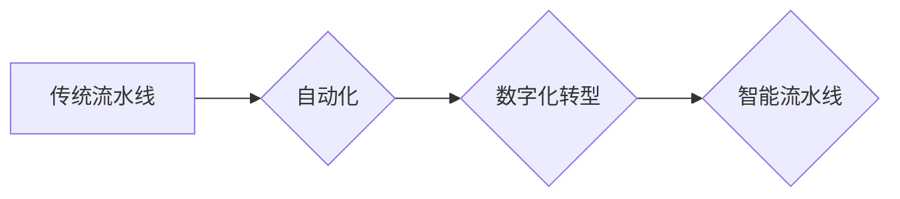

> 流水线, 生产模式, 自动化, 效率, 质量, 可持续性, 柔性制造, 数字化转型

## 1. 背景介绍

随着工业革命的不断发展，生产模式也经历了从手工制作到流水线生产的重大转变。流水线生产模式，以其高效率、低成本和标准化产品为特点，推动了工业生产的快速发展。然而，随着科技的进步和市场需求的变化，流水线生产模式也面临着新的挑战和机遇。

传统的流水线生产模式通常采用分工细化、重复操作的模式，生产效率高，但缺乏灵活性，难以应对产品多样化和个性化的需求。随着数字化转型和智能制造的兴起，流水线生产模式正在经历新的变革，朝着更加智能化、柔性化和可持续化的方向发展。

## 2. 核心概念与联系

### 2.1 流水线生产模式

流水线生产模式是一种将生产过程分解成多个独立的工序，并通过传送带或其他设备将产品在各个工序之间传递的生产方式。每个工序负责完成特定的任务，工人只需对特定工序进行操作，从而提高生产效率和产品一致性。

### 2.2 自动化

自动化是指利用机器、设备和软件来代替人工完成生产过程中的某些或全部操作。自动化技术在流水线生产中应用广泛，例如机器人焊接、自动喷漆、自动装配等，可以提高生产效率、降低生产成本和提高产品质量。

### 2.3 数字化转型

数字化转型是指利用数字化技术和方法来改造企业运营模式、业务流程和管理方式。在流水线生产中，数字化转型可以实现生产过程的实时监控、数据分析和优化，从而提高生产效率、降低生产成本和提升产品质量。

**Mermaid 流程图**



## 3. 核心算法原理 & 具体操作步骤

### 3.1 算法原理概述

流水线生产模式的核心算法原理是将生产过程分解成多个独立的工序，并通过合理的调度和控制机制，使产品在各个工序之间高效地流动。

### 3.2 算法步骤详解

1. **生产过程分解:** 将生产过程分解成多个独立的工序，每个工序负责完成特定的任务。
2. **工序安排:** 根据产品结构和生产需求，合理安排工序的顺序和数量。
3. **资源分配:** 为每个工序分配必要的资源，例如人员、设备和材料。
4. **生产调度:** 根据生产计划和实际情况，对生产过程进行调度和控制，确保产品按时完成生产。
5. **质量控制:** 在各个工序进行质量控制，确保产品质量符合标准。

### 3.3 算法优缺点

**优点:**

* **提高生产效率:** 分工细化、重复操作可以提高生产效率。
* **降低生产成本:** 通过自动化和标准化，可以降低生产成本。
* **提高产品一致性:** 标准化的生产流程可以提高产品一致性。

**缺点:**

* **缺乏灵活性:** 流水线生产模式难以应对产品多样化和个性化的需求。
* **维护成本高:** 流水线设备复杂，维护成本较高。
* **人员技能单一:** 工人技能单一，难以适应生产过程的变化。

### 3.4 算法应用领域

流水线生产模式广泛应用于汽车制造、电子制造、食品加工等行业。

## 4. 数学模型和公式 & 详细讲解 & 举例说明

### 4.1 数学模型构建

流水线生产效率可以采用以下数学模型进行描述：

$$
\text{生产效率} = \frac{\text{产品产量}}{\text{生产时间}}
$$

其中：

* 产品产量：指单位时间内生产的产品数量。
* 生产时间：指完成生产过程所需的时间。

### 4.2 公式推导过程

生产效率的计算公式可以根据生产过程的各个环节进行推导。例如，假设一个流水线生产过程包含三个工序，每个工序的生产时间分别为 $t_1$, $t_2$, $t_3$，则总的生产时间为 $t_1 + t_2 + t_3$。如果每个工序的产量相同，则总的产量为 $n \times \text{产量}$，其中 $n$ 为工序数量。

因此，流水线生产效率可以表示为：

$$
\text{生产效率} = \frac{n \times \text{产量}}{t_1 + t_2 + t_3}
$$

### 4.3 案例分析与讲解

假设一个流水线生产汽车，每个工序的生产时间分别为 1 小时、2 小时和 3 小时，每个工序的产量相同，为 100 辆汽车。则总的生产时间为 6 小时，总的产量为 300 辆汽车。

根据公式，流水线生产效率为：

$$
\text{生产效率} = \frac{300 \text{ 辆汽车}}{6 \text{ 小时}} = 50 \text{ 辆汽车/小时}
$$

## 5. 项目实践：代码实例和详细解释说明

### 5.1 开发环境搭建

本项目使用 Python 语言进行开发，开发环境包括 Python 3.x 版本、PyCharm IDE 和必要的库文件。

### 5.2 源代码详细实现

```python
class ProductionLine:
    def __init__(self, stations):
        self.stations = stations
        self.current_product = None

    def add_product(self, product):
        self.current_product = product

    def move_product(self):
        if self.current_product:
            for station in self.stations:
                station.process(self.current_product)
                self.current_product = station.output

    def run(self):
        while True:
            self.move_product()

class Station:
    def __init__(self, name):
        self.name = name

    def process(self, product):
        print(f"{self.name} station processing {product}")

    def output(self):
        return product

# 创建流水线
stations = [
    Station("Station 1"),
    Station("Station 2"),
    Station("Station 3")
]
production_line = ProductionLine(stations)

# 添加产品
production_line.add_product("Product A")

# 启动流水线
production_line.run()
```

### 5.3 代码解读与分析

代码实现了一个简单的流水线生产模型。

* `ProductionLine` 类代表流水线，包含多个 `Station` 对象。
* `Station` 类代表流水线上的一个工序，负责处理产品并输出处理后的产品。
* `add_product()` 方法添加产品到流水线。
* `move_product()` 方法将产品移动到下一个工序。
* `run()` 方法启动流水线，不断地移动产品。

### 5.4 运行结果展示

运行代码后，会输出每个工序处理产品的日志信息，例如：

```
Station 1 station processing Product A
Station 2 station processing Product A
Station 3 station processing Product A
```

## 6. 实际应用场景

### 6.1 汽车制造

流水线生产模式在汽车制造业中应用广泛，从汽车底盘的组装到车身的喷漆和内饰的装配，都采用流水线生产模式。

### 6.2 电子制造

电子制造业也广泛采用流水线生产模式，例如手机、电脑、平板电脑等电子产品的生产。

### 6.3 食品加工

食品加工业也利用流水线生产模式，例如面包、饼干、方便面等食品的生产。

### 6.4 未来应用展望

随着人工智能、机器学习和物联网技术的不断发展，流水线生产模式将更加智能化、柔性化和可持续化。例如，

* **智能化流水线:** 利用人工智能和机器学习技术，实现生产过程的自动优化和控制，提高生产效率和产品质量。
* **柔性化流水线:** 通过模块化设计和灵活的配置，实现流水线对产品多样化和个性化需求的适应。
* **可持续化流水线:** 通过节能减排、资源回收利用等措施，实现流水线生产过程的环保和可持续发展。

## 7. 工具和资源推荐

### 7.1 学习资源推荐

* **书籍:**
    * 《生产系统管理》
    * 《流水线设计与优化》
* **在线课程:**
    * Coursera: Production and Operations Management
    * edX: Lean Manufacturing

### 7.2 开发工具推荐

* **编程语言:** Python, C++, Java
* **仿真软件:** Arena, AnyLogic
* **自动化工具:** ROS, PLC

### 7.3 相关论文推荐

* **论文:**
    * "The Impact of Automation on Manufacturing Productivity"
    * "A Review of Lean Manufacturing Principles and Practices"

## 8. 总结：未来发展趋势与挑战

### 8.1 研究成果总结

流水线生产模式在工业生产中发挥着重要作用，提高了生产效率和产品一致性。随着科技的进步，流水线生产模式正在朝着更加智能化、柔性化和可持续化的方向发展。

### 8.2 未来发展趋势

* **智能化流水线:** 利用人工智能、机器学习和物联网技术，实现生产过程的自动优化和控制。
* **柔性化流水线:** 通过模块化设计和灵活的配置，实现流水线对产品多样化和个性化需求的适应。
* **可持续化流水线:** 通过节能减排、资源回收利用等措施，实现流水线生产过程的环保和可持续发展。

### 8.3 面临的挑战

* **技术挑战:** 智能化流水线需要强大的计算能力和数据处理能力，需要突破人工智能、机器学习和物联网等技术的瓶颈。
* **经济挑战:** 智能化流水线建设成本高，需要企业进行大量的投资。
* **社会挑战:** 智能化流水线可能会导致部分岗位的失业，需要政府和企业共同应对。

### 8.4 研究展望

未来，需要进一步研究智能化流水线的设计、控制和优化算法，开发更加高效、灵活和可持续的流水线生产模式，推动工业生产的智能化转型。

## 9. 附录：常见问题与解答

### 9.1 流水线生产模式的优缺点是什么？

**优点:**

* 提高生产效率
* 降低生产成本
* 提高产品一致性

**缺点:**

* 缺乏灵活性
* 维修成本高
* 人员技能单一

### 9.2 流水线生产模式的应用领域有哪些？

流水线生产模式广泛应用于汽车制造、电子制造、食品加工等行业。

### 9.3 如何实现智能化流水线？

实现智能化流水线需要利用人工智能、机器学习和物联网等技术，例如：

* 利用机器学习算法进行生产过程的预测和优化。
* 利用人工智能技术实现生产过程的自动控制。
* 利用物联网技术实现生产过程的实时监控和数据分析。


作者：禅与计算机程序设计艺术 / Zen and the Art of Computer Programming 
<end_of_turn>