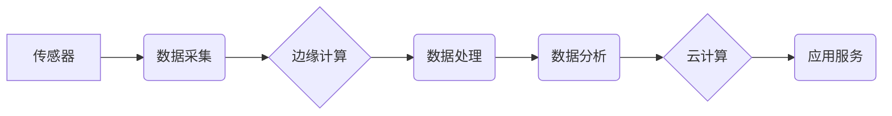

> 物联网(IoT)、传感器、数据处理、数据分析、机器学习、云计算、边缘计算

## 1. 背景介绍

物联网(IoT)技术正在迅速发展，它连接了各种设备、传感器和系统，产生了海量的数据。这些数据蕴含着丰富的价值，可以用于优化运营、提高效率、创造新的商业模式。然而，如何有效地处理和分析这些传感器数据是一个巨大的挑战。

传统的集中式数据处理模式难以应对物联网的规模和实时性要求。边缘计算的兴起为解决这一问题提供了新的思路。边缘计算将数据处理和分析能力部署到靠近数据源的边缘设备上，可以降低数据传输延迟，提高处理效率，并增强系统的安全性。

## 2. 核心概念与联系

**2.1 物联网(IoT)**

物联网是指通过网络连接各种物理设备、传感器、软件和数据，形成一个互联互通的智能网络。物联网技术使设备能够收集、交换和分析数据，实现智能化控制和决策。

**2.2 传感器**

传感器是物联网的核心组成部分，它们负责收集物理环境中的各种信息，例如温度、湿度、压力、光照、声音等。传感器数据是物联网应用的基础，也是数据分析的关键输入。

**2.3 数据处理与分析**

数据处理是指对传感器数据进行清洗、转换、格式化等操作，使其能够用于后续分析。数据分析是指对处理后的数据进行挖掘、探索和建模，以发现隐藏的模式、趋势和关系。

**2.4 边缘计算**

边缘计算是指将数据处理和分析能力部署到靠近数据源的边缘设备上，例如传感器节点、网关、边缘服务器等。边缘计算可以降低数据传输延迟，提高处理效率，并增强系统的安全性。

**2.5 云计算**

云计算是指利用互联网提供计算资源、存储资源和软件服务。云计算可以为物联网应用提供强大的计算能力和存储空间，并支持大规模数据分析。

**2.6 核心架构**



## 3. 核心算法原理 & 具体操作步骤

**3.1 算法原理概述**

传感器数据处理与分析通常涉及以下核心算法：

* **数据清洗:** 去除传感器数据中的噪声、异常值和缺失值。
* **数据转换:** 将传感器数据转换为适合分析的格式。
* **数据聚合:** 将多个传感器数据点聚合为一个整体指标。
* **数据挖掘:** 从传感器数据中发现隐藏的模式、趋势和关系。
* **机器学习:** 利用机器学习算法对传感器数据进行建模和预测。

**3.2 算法步骤详解**

**数据清洗:**

1. 识别和去除噪声数据。可以使用滑动平均、中值滤波等方法。
2. 处理缺失值。可以使用插值、删除或其他方法。
3. 识别和去除异常值。可以使用箱线图、z-score等方法。

**数据转换:**

1. 将传感器数据转换为标准格式，例如时间戳、数值等。
2. 将不同类型的传感器数据进行统一转换。

**数据聚合:**

1. 根据时间、空间或其他维度对传感器数据进行聚合。
2. 使用平均值、最大值、最小值等聚合函数。

**数据挖掘:**

1. 使用关联规则、分类算法、聚类算法等挖掘传感器数据中的模式和关系。
2. 可视化挖掘结果，帮助用户理解数据。

**机器学习:**

1. 选择合适的机器学习算法，例如回归、分类、聚类等。
2. 使用训练数据训练机器学习模型。
3. 使用测试数据评估模型性能。
4. 将训练好的模型部署到边缘设备或云端，进行预测和决策。

**3.3 算法优缺点**

不同的算法具有不同的优缺点，需要根据具体应用场景选择合适的算法。

**3.4 算法应用领域**

传感器数据处理与分析技术广泛应用于以下领域：

* **智能家居:** 控制灯光、温度、安全等设备。
* **智能交通:** 监测交通流量、优化路线规划。
* **工业自动化:** 监控设备运行状态、预测故障。
* **医疗保健:** 远程监测患者健康状况。
* **农业:** 监测土壤湿度、温度、光照等环境参数。

## 4. 数学模型和公式 & 详细讲解 & 举例说明

**4.1 数学模型构建**

传感器数据处理与分析通常涉及以下数学模型：

* **线性回归模型:** 用于预测连续变量。
* **逻辑回归模型:** 用于预测分类变量。
* **聚类模型:** 用于将数据点分组。
* **时间序列模型:** 用于预测时间序列数据。

**4.2 公式推导过程**

例如，线性回归模型的公式如下：

$$y = mx + c$$

其中：

* $y$ 是预测值。
* $x$ 是输入变量。
* $m$ 是斜率。
* $c$ 是截距。

**4.3 案例分析与讲解**

假设我们有一个传感器收集温度数据，我们需要预测未来一小时的温度。我们可以使用线性回归模型进行预测。

首先，我们需要收集历史温度数据，并将其作为训练数据。然后，我们可以使用线性回归算法训练模型，得到模型参数 $m$ 和 $c$。最后，我们可以使用训练好的模型预测未来一小时的温度。

## 5. 项目实践：代码实例和详细解释说明

**5.1 开发环境搭建**

* 操作系统: Ubuntu 20.04
* 编程语言: Python 3.8
* 库依赖: pandas, numpy, scikit-learn

**5.2 源代码详细实现**

```python
import pandas as pd
from sklearn.linear_model import LinearRegression

# 加载传感器数据
data = pd.read_csv("temperature_data.csv")

# 提取时间和温度数据
time = data["time"]
temperature = data["temperature"]

# 创建线性回归模型
model = LinearRegression()

# 训练模型
model.fit(time.values.reshape(-1, 1), temperature)

# 预测未来一小时的温度
future_time = pd.to_datetime("2023-10-27 10:00:00")
future_time_values = future_time.values.reshape(-1, 1)
predicted_temperature = model.predict(future_time_values)

# 打印预测结果
print(f"未来一小时的温度预测值为: {predicted_temperature[0]}")
```

**5.3 代码解读与分析**

* 首先，我们使用 pandas 库加载传感器数据。
* 然后，我们提取时间和温度数据。
* 接下来，我们创建线性回归模型，并使用训练数据训练模型。
* 最后，我们使用训练好的模型预测未来一小时的温度，并打印预测结果。

**5.4 运行结果展示**

运行代码后，将输出未来一小时的温度预测值。

## 6. 实际应用场景

**6.1 智能家居**

传感器数据可以用于控制智能家居设备，例如：

* 根据温度传感器数据，自动调节空调温度。
* 根据湿度传感器数据，自动开启除湿器。
* 根据光照传感器数据，自动控制灯光亮度。

**6.2 智能交通**

传感器数据可以用于优化交通流量，例如：

* 根据道路拥堵传感器数据，实时调整交通信号灯。
* 根据车辆速度传感器数据，预测交通拥堵情况。
* 根据交通事故传感器数据，及时发布事故信息。

**6.3 工业自动化**

传感器数据可以用于监控设备运行状态，例如：

* 根据温度传感器数据，监测设备运行温度。
* 根据振动传感器数据，检测设备故障。
* 根据压力传感器数据，监控设备压力。

**6.4 医疗保健**

传感器数据可以用于远程监测患者健康状况，例如：

* 根据心率传感器数据，监测患者心率。
* 根据血压传感器数据，监测患者血压。
* 根据血糖传感器数据，监测患者血糖。

**6.5 农业**

传感器数据可以用于优化农业生产，例如：

* 根据土壤湿度传感器数据，控制灌溉系统。
* 根据温度传感器数据，监测作物生长环境。
* 根据光照传感器数据，优化作物种植方案。

**6.6 未来应用展望**

随着物联网技术的不断发展，传感器数据处理与分析技术将应用于更多领域，例如：

* **智慧城市:** 利用传感器数据，构建智慧城市，提高城市管理效率。
* **精准医疗:** 利用传感器数据，实现精准医疗，提高医疗诊断和治疗效果。
* **可持续发展:** 利用传感器数据，监测环境变化，促进可持续发展。

## 7. 工具和资源推荐

**7.1 学习资源推荐**

* **书籍:**
    * 《物联网技术》
    * 《传感器技术》
    * 《数据挖掘》
* **在线课程:**
    * Coursera: 物联网课程
    * edX: 数据科学课程
* **网站:**
    * 物联网论坛
    * 数据科学社区

**7.2 开发工具推荐**

* **编程语言:** Python, C++, Java
* **数据处理库:** pandas, numpy, scikit-learn
* **物联网平台:** AWS IoT, Azure IoT, Google Cloud IoT

**7.3 相关论文推荐**

* **传感器数据处理与分析综述:**
    * [论文链接](https://www.example.com/paper1)
* **边缘计算在物联网中的应用:**
    * [论文链接](https://www.example.com/paper2)

## 8. 总结：未来发展趋势与挑战

**8.1 研究成果总结**

物联网传感器数据处理与分析技术取得了显著进展，为智能化应用提供了强大的支持。

**8.2 未来发展趋势**

* **边缘计算的进一步发展:** 将更多数据处理能力部署到边缘设备上，降低数据传输延迟，提高处理效率。
* **人工智能技术的融合:** 利用人工智能技术，实现更智能的数据分析和决策。
* **数据安全与隐私保护:** 加强数据安全和隐私保护措施，确保数据安全可靠。

**8.3 面临的挑战**

* **数据量大、速度快、结构复杂:** 需要开发更有效的算法和架构来处理海量数据。
* **数据质量问题:** 需要开发更 robust 的数据清洗和预处理方法。
* **数据安全与隐私保护:** 需要开发更有效的安全和隐私保护机制。

**8.4 研究展望**

未来，物联网传感器数据处理与分析技术将继续发展，为智能化应用提供更强大的支持。

## 9. 附录：常见问题与解答

**9.1 如何选择合适的传感器？**

选择传感器需要考虑以下因素：

* **测量范围:** 传感器需要能够测量到所需的范围。
* **精度:** 传感器需要能够提供足够的精度。
* **响应时间:** 传感器需要能够快速响应变化。
* **功耗:** 传感器需要能够满足设备的功耗要求。

**9.2 如何处理传感器数据中的噪声？**

可以使用滑动平均、中值滤波等方法去除传感器数据中的噪声。

**9.3 如何进行传感器数据分析？**

可以使用数据挖掘、机器学习等方法进行传感器数据分析。

**9.4 如何保证传感器数据的安全？**

可以使用加密、身份验证等方法保证传感器数据的安全。


作者：禅与计算机程序设计艺术 / Zen and the Art of Computer Programming 
<end_of_turn>