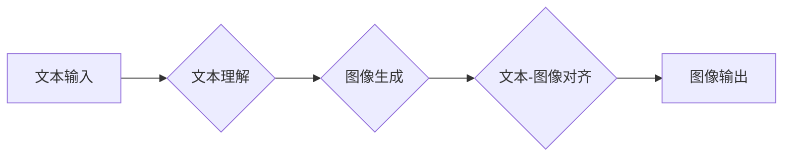

> 生图AI, DALL·E 2, Imagen, 扩散模型, 生成对抗网络, 图像生成, 自然语言处理, 计算机视觉

## 1. 背景介绍

近年来，人工智能领域取得了令人瞩目的进展，其中生成式人工智能（Generative AI）尤为引人注目。生图AI，即通过文本描述生成图像的技术，正以其强大的创造力和应用潜力，迅速成为人工智能研究和应用的热点。

DALL·E 2 和 Imagen 是近年来最具代表性的生图AI模型，它们都基于强大的深度学习算法，能够从自然语言文本描述中生成逼真的图像。DALL·E 2 由 OpenAI 开发，Imagen 由 Google DeepMind 开发。这两款模型在图像生成质量、文本理解能力和应用场景等方面都展现出令人惊叹的潜力。

## 2. 核心概念与联系

生图AI 的核心概念是将文本描述和图像表示进行映射。

**2.1  文本理解:**

生图AI 模型需要首先理解文本描述中的语义信息，例如物体、场景、属性等。这通常需要结合自然语言处理（NLP）技术，例如词嵌入、句法分析和语义解析。

**2.2  图像生成:**

生图AI 模型需要根据文本描述生成图像，这通常需要利用深度学习算法，例如生成对抗网络（GAN）或扩散模型。这些算法能够学习图像的潜在表示，并根据文本描述生成符合描述的图像。

**2.3  文本-图像对齐:**

生图AI 模型需要将文本描述和生成的图像进行对齐，确保生成的图像与文本描述相匹配。这通常需要利用注意力机制等技术，将文本描述中的关键信息与图像中的对应部分进行关联。

**2.4  Mermaid 流程图:**



## 3. 核心算法原理 & 具体操作步骤

### 3.1  算法原理概述

DALL·E 2 和 Imagen 都基于扩散模型的原理进行图像生成。扩散模型是一种生成模型，它通过逐步添加噪声到图像中，然后学习逆向过程，从噪声图像中恢复出清晰的图像。

### 3.2  算法步骤详解

1. **前向扩散:** 将图像逐步添加噪声，直到变成纯噪声。
2. **逆向扩散:** 学习从纯噪声中逐步恢复出清晰图像的过程。
3. **文本引导:** 在逆向扩散过程中，利用文本描述引导图像生成方向。

### 3.3  算法优缺点

**优点:**

* 生成图像质量高，细节丰富。
* 可以生成多种风格和类型的图像。
* 文本理解能力强，能够理解复杂的文本描述。

**缺点:**

* 计算量大，训练和推理成本高。
* 容易生成一些不合理或违反逻辑的图像。
* 对文本描述的依赖性强，文本描述的质量直接影响图像生成结果。

### 3.4  算法应用领域

* **图像创作:** 艺术家、设计师可以使用生图AI生成创意图像。
* **内容创作:** 写作、视频制作等领域可以使用生图AI生成相关图像素材。
* **教育和研究:** 生图AI可以帮助人们更好地理解和学习图像相关知识。
* **游戏开发:** 生图AI可以用于生成游戏场景、角色和道具。

## 4. 数学模型和公式 & 详细讲解 & 举例说明

### 4.1  数学模型构建

扩散模型的核心是构建一个概率模型，描述图像的生成过程。

**4.1.1  概率分布:**

假设图像的像素值服从一个概率分布，例如高斯分布。

**4.1.2  噪声添加:**

在每个时间步长，向图像中添加一定量的噪声，使得图像逐渐变成纯噪声。

**4.1.3  逆向过程:**

学习一个逆向过程，从纯噪声中逐步恢复出清晰图像。

### 4.2  公式推导过程

**4.2.1  前向扩散过程:**

$$
x_t = \sqrt{1-\beta_t}x_{t-1} + \sqrt{\beta_t}\epsilon_t
$$

其中：

* $x_t$ 是时间步长为 $t$ 的图像。
* $\beta_t$ 是噪声添加系数。
* $\epsilon_t$ 是服从标准正态分布的噪声。

**4.2.2  逆向扩散过程:**

$$
x_{t-1} = (1-\beta_t)^{-1}(x_t - \sqrt{\beta_t}\epsilon_t)
$$

### 4.3  案例分析与讲解

假设我们想要生成一张猫的图像。

1. 我们首先输入一个文本描述 "一只可爱的猫"。
2. 模型会将文本描述转换为一个向量表示，并将其作为引导信息。
3. 模型会根据引导信息和扩散模型的逆向过程，从纯噪声中逐步恢复出猫的图像。

## 5. 项目实践：代码实例和详细解释说明

### 5.1  开发环境搭建

* Python 3.7+
* PyTorch 1.7+
* CUDA 10.2+

### 5.2  源代码详细实现

```python
# 导入必要的库
import torch
import torch.nn as nn

# 定义扩散模型的网络结构
class DiffusionModel(nn.Module):
    def __init__(self):
        super(DiffusionModel, self).__init__()
        # ...

    def forward(self, x, t):
        # ...

# 实例化扩散模型
model = DiffusionModel()

# 加载预训练模型权重
model.load_state_dict(torch.load('diffusion_model_weights.pth'))

# 将模型设置为评估模式
model.eval()

# 输入文本描述
text_description = "一只可爱的猫"

# 将文本描述转换为向量表示
text_embedding = text_encoder(text_description)

# 生成图像
generated_image = model.generate_image(text_embedding)

# 保存生成的图像
torch.save(generated_image, 'generated_cat.png')
```

### 5.3  代码解读与分析

* 扩散模型的网络结构通常由多个卷积层、自注意力层和全连接层组成。
* 扩散模型的训练过程需要使用大量的图像数据和文本数据。
* 扩散模型的生成过程需要根据文本描述和扩散模型的逆向过程，逐步恢复出图像。

### 5.4  运行结果展示

运行上述代码后，将生成一张名为 "generated_cat.png" 的猫图像。

## 6. 实际应用场景

### 6.1  艺术创作

艺术家可以使用生图AI生成创意图像，例如抽象艺术、概念艺术等。

### 6.2  内容创作

写作者可以使用生图AI生成文章插图、漫画等，视频制作人员可以使用生图AI生成视频素材。

### 6.3  教育和研究

生图AI可以帮助人们更好地理解和学习图像相关知识，例如图像识别、图像分割等。

### 6.4  未来应用展望

生图AI 的应用场景还在不断扩展，未来可能应用于以下领域：

* **虚拟现实和增强现实:** 生图AI 可以用于生成虚拟场景和增强现实体验。
* **医疗保健:** 生图AI 可以用于生成医学图像、辅助诊断等。
* **设计和制造:** 生图AI 可以用于生成产品设计、制造流程等。

## 7. 工具和资源推荐

### 7.1  学习资源推荐

* **论文:**

    * DALL·E 2: https://arxiv.org/abs/2204.06945
    * Imagen: https://arxiv.org/abs/2205.11487

* **博客:**

    * OpenAI Blog: https://openai.com/blog/
    * Google AI Blog: https://ai.googleblog.com/

### 7.2  开发工具推荐

* **PyTorch:** https://pytorch.org/
* **TensorFlow:** https://www.tensorflow.org/

### 7.3  相关论文推荐

* **Generative Adversarial Networks:** https://arxiv.org/abs/1406.2661
* **Diffusion Models Beat GANs on Image Synthesis:** https://arxiv.org/abs/2006.11239

## 8. 总结：未来发展趋势与挑战

### 8.1  研究成果总结

生图AI 技术取得了显著进展，能够生成逼真的图像，并理解复杂的文本描述。

### 8.2  未来发展趋势

* **图像质量提升:** 研究者将继续探索新的算法和模型，以提高生图AI 的图像质量。
* **文本理解能力增强:** 研究者将继续改进文本理解模型，使其能够理解更复杂的文本描述。
* **多模态生成:** 研究者将探索将生图AI 与其他模态（例如音频、视频）结合，实现多模态生成。

### 8.3  面临的挑战

* **数据偏见:** 生图AI 模型的训练数据可能存在偏见，导致生成的图像也存在偏见。
* **伦理问题:** 生图AI 的应用可能引发一些伦理问题，例如图像著作权、虚假信息传播等。
* **计算资源:** 训练和推理生图AI 模型需要大量的计算资源。

### 8.4  研究展望

未来，生图AI 技术将继续发展，并应用于更广泛的领域。研究者需要关注数据偏见、伦理问题和计算资源等挑战，确保生图AI 技术的健康发展。

## 9. 附录：常见问题与解答

**Q1: 生图AI 模型的训练数据是什么？**

**A1:** 生图AI 模型的训练数据通常包括大量的图像和文本对。

**Q2: 生图AI 模型的生成图像质量如何？**

**A2:** 生图AI 模型能够生成逼真的图像，但图像质量取决于模型的复杂度、训练数据的大小和文本描述的清晰度。

**Q3: 生图AI 模型是否可以生成任何类型的图像？**

**A3:** 生图AI 模型可以生成多种类型的图像，但其生成能力受限于训练数据和模型的架构。

**Q4: 生图AI 模型的应用场景有哪些？**

**A4:** 生图AI 的应用场景包括艺术创作、内容创作、教育和研究、虚拟现实和增强现实等。

**Q5: 生图AI 技术的未来发展趋势是什么？**

**A5:** 生图AI 技术将继续发展，朝着更高质量、更强大的方向发展，并应用于更广泛的领域。


作者：禅与计算机程序设计艺术 / Zen and the Art of Computer Programming 
<end_of_turn>