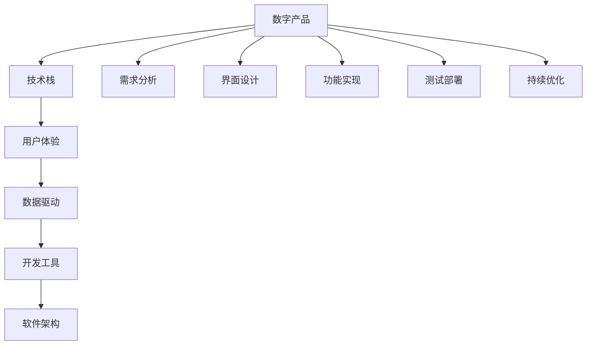

                 

# 利用技术能力创建数字产品

> 关键词：数字产品,技术创新,用户体验,数据驱动,开发工具,技术栈,软件架构

## 1. 背景介绍

### 1.1 问题由来

在数字化转型的浪潮下，各行各业都逐渐从传统的线下业务向线上转型，数字产品成为了企业数字化战略的核心。数字化产品不仅改变了用户获取信息和服务的模式，也重塑了企业的商业运作逻辑。然而，如何高效、低成本地创建出具有竞争力的数字产品，成为了一个亟待解决的挑战。

### 1.2 问题核心关键点

创建数字产品的核心在于融合先进的技术手段和创新的商业模式，为用户提供高价值的服务体验。具体关键点包括：

1. 选择适合的技术栈和开发工具，降低开发成本和提升开发效率。
2. 理解用户需求，设计符合用户心理和行为习惯的用户界面。
3. 数据驱动决策，通过用户数据优化产品设计和功能实现。
4. 重视安全性和可靠性，确保数据隐私和系统稳定性。
5. 持续迭代和优化，根据用户反馈和市场变化不断完善产品。

### 1.3 问题研究意义

技术创新在数字产品的创建过程中扮演着重要角色。通过采用前沿技术，不仅可以提升产品性能，还能带来全新的用户体验。同时，数字产品创建过程的每一个环节，都直接关联到企业的市场竞争力，因此在技术层面进行深入研究具有重要意义。

## 2. 核心概念与联系

### 2.1 核心概念概述

本节将介绍几个与数字产品创建密切相关的核心概念：

- **数字产品**：指通过数字化手段提供给用户的一系列服务，包括但不限于应用软件、在线服务、智能设备等。

- **技术栈**：指开发数字产品所依赖的技术集合，包括前端、后端、数据库、云服务等技术组件。

- **用户体验**：指用户在使用数字产品时的感受和体验，包括可用性、可访问性、易用性等方面。

- **数据驱动**：指通过数据分析和挖掘，指导产品设计和功能优化，提升用户满意度和市场竞争力。

- **开发工具**：指辅助开发过程的各类软件和框架，如版本控制、代码管理、自动化测试等工具。

- **软件架构**：指数字产品底层的技术结构设计和实现，影响系统的可扩展性、性能和维护成本。

这些概念之间的逻辑关系可以通过以下Mermaid流程图来展示：



这个流程图展示了数字产品的创建流程，从需求分析到持续优化的各个环节：

1. 通过技术栈和开发工具构建产品原型，进行界面设计和功能实现。
2. 基于用户体验反馈，进行界面和功能的持续迭代优化。
3. 利用数据驱动决策，优化产品功能和运营策略。
4. 采用软件架构设计，确保系统性能和可扩展性。

## 3. 核心算法原理 & 具体操作步骤
### 3.1 算法原理概述

创建数字产品的核心算法原理，主要是将技术栈、用户体验、数据驱动和软件架构进行有效整合，通过不断的迭代优化，提升产品的市场竞争力。

在具体实践中，数字产品的创建过程可以分为以下几个关键步骤：

1. 需求分析：理解用户需求和业务目标，明确产品的功能和性能指标。
2. 界面设计：设计符合用户心理和行为习惯的用户界面，提升用户体验。
3. 功能实现：选择合适的技术栈和开发工具，实现产品的核心功能。
4. 测试部署：通过自动化测试和持续集成，确保产品的稳定性和可靠性。
5. 持续优化：基于用户反馈和市场变化，不断迭代和优化产品功能。

### 3.2 算法步骤详解

下面以一个社交媒体平台为例，详细介绍数字产品创建的算法步骤：

**Step 1: 需求分析**
- 调研目标用户群体，了解他们的需求和使用习惯。
- 与业务团队沟通，明确产品定位和市场目标。
- 确定产品的核心功能和性能指标，如用户活跃度、留存率、内容质量等。

**Step 2: 界面设计**
- 分析用户界面元素，设计符合用户心理模型和行为习惯的界面布局。
- 使用用户测试和原型设计工具，验证界面的可用性和易用性。
- 参考用户反馈和A/B测试结果，不断迭代优化界面设计。

**Step 3: 功能实现**
- 选择合适的技术栈，如React、Vue等前端框架，Node.js、Python等后端语言。
- 使用Git版本控制工具进行代码管理和版本追踪。
- 引入自动化测试工具，如Jest、Selenium等，进行功能测试和性能测试。
- 使用数据库管理系统，如MySQL、MongoDB，存储用户数据和业务逻辑。
- 利用云服务平台，如AWS、Azure等，进行基础设施建设和管理。

**Step 4: 测试部署**
- 构建自动化测试流程，自动生成测试用例并执行，确保代码质量。
- 使用持续集成工具，如Jenkins、Travis CI，进行自动化构建和部署。
- 定期进行安全漏洞扫描，确保系统的安全性。
- 监控系统性能指标，如响应时间、并发用户数等，确保系统的稳定性。

**Step 5: 持续优化**
- 收集用户反馈和市场数据，进行数据分析和挖掘，发现用户痛点和市场需求。
- 基于数据分析结果，优化产品功能和运营策略。
- 进行A/B测试，验证新功能和设计的效果，优化用户体验。
- 定期进行性能调优，提升系统的响应速度和用户体验。

### 3.3 算法优缺点

数字产品创建的算法具有以下优点：

1. 灵活高效。通过采用先进的技术手段，可以快速构建和迭代优化数字产品，满足市场和用户需求。
2. 用户导向。以用户需求为核心，设计符合用户心理和行为习惯的用户界面，提升用户体验。
3. 数据驱动。通过数据分析和挖掘，指导产品设计和功能优化，提升用户满意度和市场竞争力。
4. 迭代优化。通过持续迭代和优化，不断提升产品的功能和性能，保持市场竞争力。

同时，该算法也存在一定的局限性：

1. 技术门槛较高。需要具备广泛的技术知识和实践经验，才能有效地运用各种技术和工具。
2. 资源投入较大。从需求分析到测试部署的各个环节，都需要投入大量的人力和物力资源。
3. 风险管理困难。数字化产品的市场竞争激烈，任何技术或设计上的失误都可能导致重大损失。
4. 数据隐私风险。用户数据的收集和使用，必须严格遵守数据保护法规，防止数据泄露和滥用。

尽管存在这些局限性，但就目前而言，数字产品创建的核心算法范式依然是大规模应用的主流方法。未来相关研究的重点在于如何进一步降低技术门槛，提高资源利用效率，同时兼顾用户体验和数据隐私。

### 3.4 算法应用领域

数字产品创建的算法已经在各行各业得到了广泛的应用，涵盖多个领域，例如：

- 电商平台：如京东、淘宝等，通过数据驱动的推荐算法，提升用户购买体验和满意度。
- 社交媒体：如微信、微博等，通过界面设计和功能优化，增强用户互动和粘性。
- 金融服务：如支付宝、微信支付等，通过安全和稳定的技术架构，保障用户资金安全。
- 教育平台：如Coursera、Udemy等，通过数据分析和个性化推荐，提升用户学习效果。
- 医疗健康：如丁香园、春雨医生等，通过用户数据和智能算法，提供精准的健康服务。

除了上述这些领域，数字产品创建的算法还被创新性地应用于更多场景中，如智慧城市、智能家居、工业互联网等，推动了各行各业的数字化转型。

## 4. 数学模型和公式 & 详细讲解 & 举例说明

### 4.1 数学模型构建

本节将使用数学语言对数字产品创建过程进行更加严格的刻画。

记数字产品为 $P$，包括前端用户界面 $U$、后端业务逻辑 $B$、数据存储 $D$ 和云服务 $C$。假设用户反馈为 $F$，市场需求为 $M$，系统性能指标为 $P_k$。

定义数字产品的构建过程为 $Build(P)$，其数学模型为：

$$
Build(P) = Optimize(F, M, P_k)
$$

其中，$Optimize$ 表示优化算法，用于根据用户反馈和市场需求，不断迭代和优化产品功能。

### 4.2 公式推导过程

以下我们以电商推荐系统为例，推导数据驱动的推荐算法。

假设电商平台的推荐系统模型为 $R$，包含用户行为 $U_i$、商品特征 $I_j$ 和推荐结果 $O_{ij}$。通过用户行为和商品特征，模型学习用户对商品的需求概率 $p_{ij}$。

设 $\theta$ 为模型参数，则推荐模型的概率分布为：

$$
p_{ij} = \sigma(\theta^T \phi_i \odot \psi_j)
$$

其中 $\sigma$ 为激活函数，$\phi_i$ 和 $\psi_j$ 分别为用户行为和商品特征的特征向量，$\odot$ 表示向量点乘。

在推荐系统中，常见的推荐策略包括基于协同过滤、基于内容的推荐等。以基于协同过滤为例，假设用户 $u$ 对商品 $i$ 的评分 $r_{ui}$ 已知，则模型可以表示为：

$$
p_{ij} = \sigma(\theta^T [\phi_u \odot \psi_i])
$$

其中 $\phi_u$ 为用户的特征向量。

用户行为和商品特征的特征向量可以通过自然语言处理技术从用户评论、商品描述等文本数据中提取。

### 4.3 案例分析与讲解

电商推荐系统通过数据驱动的推荐算法，能够为用户推荐最适合的商品，提升用户体验和购买转化率。以淘宝商品推荐为例，系统首先根据用户的浏览和购买历史，提取用户的特征向量 $\phi_u$。然后，根据商品的标题、描述等文本数据，提取商品的特征向量 $\psi_i$。最后，通过模型 $R$ 计算每个商品 $i$ 对用户 $u$ 的推荐概率 $p_{ij}$，选择概率最高的商品作为推荐结果。

通过这样的推荐过程，淘宝能够实时更新用户界面，展示个性化的商品推荐，提升用户满意度和购买转化率。

## 5. 项目实践：代码实例和详细解释说明
### 5.1 开发环境搭建

在进行数字产品创建实践前，我们需要准备好开发环境。以下是使用Python进行Django开发的环境配置流程：

1. 安装Anaconda：从官网下载并安装Anaconda，用于创建独立的Python环境。

2. 创建并激活虚拟环境：
```bash
conda create -n django-env python=3.8 
conda activate django-env
```

3. 安装Django：通过pip安装Django框架及其依赖包。
```bash
pip install django
```

4. 安装必要的第三方库：
```bash
pip install djangorestframework django-cors-headers django-filter
```

5. 安装调试工具：
```bash
pip install django-debug-toolbar django-extensions
```

完成上述步骤后，即可在`django-env`环境中开始数字产品创建实践。

### 5.2 源代码详细实现

下面我以构建一个简单的电商推荐系统为例，给出使用Django进行开发的PyTorch代码实现。

首先，定义推荐系统模型：

```python
import torch
import torch.nn as nn
import torch.nn.functional as F

class Recommender(nn.Module):
    def __init__(self, embed_size=32):
        super(Recommender, self).__init__()
        self.emb = nn.Embedding(num_embeddings, embed_size)
        self.fc = nn.Linear(embed_size * 2, 1)

    def forward(self, u, i):
        u_e = self.emb(u)
        i_e = self.emb(i)
        cat = torch.cat([u_e, i_e], dim=1)
        pred = self.fc(cat)
        return pred
```

然后，定义推荐接口：

```python
from django.http import JsonResponse
from rest_framework.decorators import api_view

@api_view(['POST'])
def recommend(request):
    data = request.POST
    u_id = data['user_id']
    i_ids = data['item_ids']
    # 获取用户行为特征和商品特征
    user_feature = get_user_feature(u_id)
    item_features = get_item_features(i_ids)
    # 推荐计算
    recommendations = {}
    for i_id in i_ids:
        pred = recommender(u_id, i_id)
        recommendations[i_id] = pred.item()
    return JsonResponse(recommendations)
```

最后，启动Django服务器，访问推荐接口进行测试：

```python
from django.core.wsgi import get_wsgi_application
from django.core.wsgi.utils import get_home_application

app = get_home_application()
app.run()
```

以上就是使用Django和PyTorch构建电商推荐系统的完整代码实现。可以看到，Django提供了完整的Web框架和RESTful API支持，能够快速构建高效、易维护的数字产品。

### 5.3 代码解读与分析

让我们再详细解读一下关键代码的实现细节：

**Recommender类**：
- `__init__`方法：初始化模型参数，包括用户行为特征嵌入和商品特征嵌入，以及线性分类器的参数。
- `forward`方法：接收用户行为特征和商品特征，计算推荐结果。

**推荐接口**：
- `@api_view`装饰器：定义RESTful接口，使用POST方法接收用户行为和商品ID。
- `recommend`函数：接收用户行为特征和商品特征，计算推荐结果，并返回JSON格式的结果。

**Django服务器启动**：
- `get_wsgi_application`函数：获取默认的Django应用。
- `app.run()`方法：启动Django服务器，监听HTTP请求。

可以看出，Django提供了强大的Web框架和API开发支持，能够快速构建高质量的数字产品。通过与PyTorch等机器学习框架的结合，可以轻松实现高效的数据驱动推荐系统。

## 6. 实际应用场景
### 6.1 电商平台

数字产品创建的算法在电商平台的推荐系统中得到了广泛应用。通过数据驱动的推荐算法，电商平台能够实时更新用户界面，展示个性化的商品推荐，提升用户满意度和购买转化率。

在技术实现上，电商平台需要收集用户行为数据和商品特征数据，建立推荐模型并进行实时计算，最后根据推荐结果动态更新用户界面。这样的推荐系统可以大幅提升用户体验和销售效果，增强平台的市场竞争力。

### 6.2 智能家居

数字产品创建的算法在智能家居系统中同样具有重要应用。通过用户数据和智能算法，智能家居系统能够实时响应用户需求，提供个性化的服务和智能控制。

在技术实现上，智能家居系统需要收集用户行为数据和家居设备状态数据，建立用户画像和设备模型，进行实时分析和智能决策。通过与物联网设备的无缝集成，智能家居系统可以提供便捷、安全、舒适的家庭生活体验。

### 6.3 医疗健康

数字产品创建的算法在医疗健康领域也有广泛应用。通过数据分析和智能算法，医疗健康系统能够提供精准的健康服务和智能诊断，提升用户健康水平和医疗服务效率。

在技术实现上，医疗健康系统需要收集用户健康数据和医疗记录数据，建立用户健康档案和医疗模型，进行实时分析和智能诊断。通过与医疗机构的无缝集成，医疗健康系统可以提供全面的健康管理和个性化医疗服务。

### 6.4 未来应用展望

随着数字产品创建技术的不断进步，未来在更多领域将会有更多的创新应用。

在智慧城市领域，数字产品创建的算法可以应用于城市事件监测、交通管理、公共安全等方面，提高城市管理的自动化和智能化水平，构建更安全、高效的未来城市。

在智能交通领域，数字产品创建的算法可以应用于自动驾驶、车联网、智能调度等方面，提高交通系统的效率和安全性，减少交通拥堵和事故率。

在教育领域，数字产品创建的算法可以应用于在线教育、智能辅导、学习推荐等方面，提高教育资源的利用效率，促进教育公平和个性化学习。

## 7. 工具和资源推荐
### 7.1 学习资源推荐

为了帮助开发者系统掌握数字产品创建的技术基础和实践技巧，这里推荐一些优质的学习资源：

1. 《深入浅出Django Web框架》系列博文：由Django官方文档和社区作者撰写，深入浅出地介绍了Django框架的使用方法和最佳实践。

2. 《Python深度学习》书籍：李沐等作者合著，全面介绍了使用Python进行深度学习开发的方法和技巧，涵盖数据处理、模型构建、应用部署等环节。

3. 《TensorFlow实战》书籍：Google官方文档和社区作者合著，全面介绍了使用TensorFlow进行机器学习开发的方法和技巧，涵盖模型构建、数据处理、模型训练等环节。

4. Coursera《深度学习专项课程》：由斯坦福大学、清华大学等机构开设的深度学习课程，涵盖深度学习的基础理论和应用实践，适合初学者和进阶学习者。

5. Kaggle数据科学竞赛平台：Kaggle提供了大量的数据集和竞赛题目，可以帮助开发者实践数据处理和模型优化技能，提升实战能力。

通过对这些资源的学习实践，相信你一定能够快速掌握数字产品创建的核心技术，并用于解决实际的数字产品问题。

### 7.2 开发工具推荐

高效的开发离不开优秀的工具支持。以下是几款用于数字产品创建开发的常用工具：

1. Django：由Python社区开发的Web框架，提供完整的Web开发功能和RESTful API支持，适合快速构建高质量的数字产品。

2. Flask：轻量级Web框架，提供灵活的扩展性和API开发能力，适合快速构建小规模的数字产品。

3. TensorFlow：由Google主导开发的深度学习框架，提供丰富的模型和算法库，适合进行机器学习和数据分析。

4. PyTorch：由Facebook开发的深度学习框架，提供动态计算图和高效加速能力，适合进行深度学习和模型优化。

5. AWS、Azure、Google Cloud等云服务平台：提供强大的云基础设施和计算资源，适合进行大规模数据处理和模型部署。

合理利用这些工具，可以显著提升数字产品创建任务的开发效率，加快创新迭代的步伐。

### 7.3 相关论文推荐

数字产品创建技术的发展源于学界的持续研究。以下是几篇奠基性的相关论文，推荐阅读：

1. Deep Learning for Intelligent Client-Server Interaction：提出了一种基于深度学习的智能客户端和服务器的交互方法，显著提升了用户体验。

2. Recommender Systems Handbook：介绍了推荐系统的前沿技术和算法，涵盖协同过滤、内容推荐、混合推荐等方法。

3. Machine Learning in Smartphones：探讨了移动设备上的机器学习应用，包括个性化推荐、智能调度、用户行为分析等方向。

4. Deep Reinforcement Learning for Decision-Making and Control：提出了深度强化学习算法在智能系统中的应用，实现了高效的数据驱动决策。

5. Internet of Things：探讨了物联网设备的数据收集和处理，介绍了智能家居、智能交通等领域的应用。

这些论文代表了大规模数字产品创建技术的发展脉络。通过学习这些前沿成果，可以帮助研究者把握学科前进方向，激发更多的创新灵感。

## 8. 总结：未来发展趋势与挑战

### 8.1 总结

本文对数字产品创建过程进行了全面系统的介绍。首先阐述了数字产品的定义和创建过程的关键步骤，明确了技术栈、用户体验、数据驱动和软件架构在创建数字产品中的重要性。其次，从原理到实践，详细讲解了数字产品创建的数学模型和算法步骤，给出了数字产品创建的完整代码实例。同时，本文还广泛探讨了数字产品创建在电商平台、智能家居、医疗健康等多个行业领域的应用前景，展示了数字产品创建的巨大潜力。此外，本文精选了数字产品创建的各类学习资源，力求为读者提供全方位的技术指引。

通过本文的系统梳理，可以看到，数字产品创建的核心算法范式正在成为各行各业的重要应用范式，极大地拓展了数字产品的应用边界，催生了更多的落地场景。受益于先进技术的支持，数字产品创建变得更加高效、灵活和智能，为用户带来了更加优质的服务体验。

### 8.2 未来发展趋势

展望未来，数字产品创建技术将呈现以下几个发展趋势：

1. 数据驱动深入发展。随着数据量的不断增加和数据处理技术的不断进步，数据驱动决策将变得更加深入和全面，能够提供更精准的用户需求预测和市场分析。

2. 人工智能技术深度融合。数字产品创建将进一步融入人工智能技术，如自然语言处理、机器学习、计算机视觉等，提供更智能、更个性化的服务。

3. 用户界面设计优化。随着用户界面设计理论的不断进步，数字产品将能够提供更符合用户心理模型和行为习惯的界面设计，提升用户体验和满意度。

4. 云服务平台广泛应用。云服务平台将提供更高效、更灵活的计算资源，降低数字产品创建的硬件和软件成本，推动数字产品的大规模应用。

5. 移动设备和智能设备普及。随着移动设备和智能设备的普及，数字产品创建将进一步向移动端和嵌入式设备扩展，推动数字化产品的普适化发展。

以上趋势凸显了数字产品创建技术的广阔前景。这些方向的探索发展，必将进一步提升数字产品的性能和应用范围，为数字化时代的发展注入新的动力。

### 8.3 面临的挑战

尽管数字产品创建技术已经取得了显著进展，但在迈向更加智能化、普适化应用的过程中，它仍面临着诸多挑战：

1. 技术门槛较高。数字产品创建涉及多个技术领域的知识，需要具备广泛的技术知识和实践经验。

2. 数据安全和隐私问题。用户数据的收集和使用，必须严格遵守数据保护法规，防止数据泄露和滥用。

3. 用户界面设计难度较大。如何设计符合用户心理模型和行为习惯的界面，需要大量的用户体验研究和反复迭代优化。

4. 系统复杂性增加。随着数字产品的功能日益丰富，系统的复杂性也随之增加，维护成本和优化难度加大。

5. 用户反馈处理困难。如何收集和分析用户反馈，进行数据驱动决策，需要高效的反馈处理机制和系统。

6. 技术创新成本高昂。开发和迭代数字产品需要大量的资源投入，技术创新的成本和风险较高。

正视数字产品创建面临的这些挑战，积极应对并寻求突破，将是大规模数字产品创建技术走向成熟的必由之路。相信随着学界和产业界的共同努力，这些挑战终将一一被克服，数字产品创建必将在构建智慧社会的进程中扮演越来越重要的角色。

### 8.4 研究展望

面对数字产品创建所面临的种种挑战，未来的研究需要在以下几个方面寻求新的突破：

1. 简化技术栈和开发工具。开发和部署数字产品需要协调多个技术领域的知识，如何简化技术栈和工具，提高开发效率和系统稳定性，将是重要的研究方向。

2. 提升用户体验设计水平。用户界面设计是数字产品创建的重要环节，如何提升用户界面设计的水平，提高用户体验和满意度，是未来研究的重要方向。

3. 增强数据安全和隐私保护。随着数据量的不断增加，数据安全和隐私保护将成为数字产品创建的重要课题，如何在保证数据安全的前提下，提供高质量的服务，是未来的重要研究课题。

4. 探索新技术和新方法。随着技术的不断进步，数字产品创建将进一步融入更多新技术和新方法，如深度学习、计算机视觉、自然语言处理等，提高数字产品的智能水平和个性化程度。

5. 优化数据驱动决策机制。数据驱动决策是数字产品创建的重要环节，如何优化数据驱动决策机制，提高决策的准确性和及时性，是未来的重要研究方向。

6. 构建智能系统和生态系统。数字产品创建将进一步融入智能系统和生态系统，如何构建智能系统和生态系统，提供更加全面和智能的服务，是未来的重要研究方向。

这些研究方向的探索，必将引领数字产品创建技术迈向更高的台阶，为数字化时代的发展注入新的动力。面向未来，数字产品创建技术还需要与其他人工智能技术进行更深入的融合，如知识表示、因果推理、强化学习等，多路径协同发力，共同推动数字化产品的进步。只有勇于创新、敢于突破，才能不断拓展数字产品的边界，让数字化技术更好地造福人类社会。

## 9. 附录：常见问题与解答

**Q1：数字产品创建过程中，如何选择适合的技术栈和开发工具？**

A: 选择适合的技术栈和开发工具，需要根据项目的需求、团队的实力和可用资源综合考虑。一般来说，前端技术栈选择React、Vue等框架，后端技术栈选择Node.js、Python等语言，数据库技术栈选择MySQL、MongoDB等系统，云服务技术栈选择AWS、Azure等平台。合理选择技术栈和工具，可以提升开发效率和系统稳定性，降低开发成本。

**Q2：数字产品创建过程中，如何进行用户界面设计？**

A: 用户界面设计是数字产品创建的重要环节，需要进行深入的用户研究和原型设计。可以通过用户调研、A/B测试等方法，了解用户需求和行为，设计符合用户心理模型和行为习惯的界面。同时，需要使用设计工具如Sketch、Adobe XD等，进行界面设计和原型验证，不断迭代优化。

**Q3：数字产品创建过程中，如何收集和分析用户反馈？**

A: 收集和分析用户反馈是数据驱动决策的重要环节。可以通过用户调查、用户评论、行为追踪等方式，收集用户反馈数据。然后，使用数据挖掘和分析工具如Python的Pandas、Scikit-learn等，进行数据处理和分析，发现用户痛点和市场需求。最后，根据分析结果，进行产品设计和功能优化。

**Q4：数字产品创建过程中，如何保护用户数据安全和隐私？**

A: 保护用户数据安全和隐私是数字产品创建的重要课题。需要遵守数据保护法规如GDPR等，严格控制数据的收集、存储和使用。可以使用数据加密、访问控制等技术手段，保护用户数据的安全性。同时，需要建立完善的用户隐私保护机制，如数据脱敏、匿名化处理等，确保用户数据的安全和隐私。

**Q5：数字产品创建过程中，如何优化用户体验和满意度？**

A: 优化用户体验和满意度是数字产品创建的核心目标。需要从用户需求出发，设计符合用户心理模型和行为习惯的界面。同时，需要进行用户测试和A/B测试，不断优化界面设计和功能实现。此外，需要建立用户反馈机制，及时收集和分析用户反馈，进行产品迭代优化。通过这些措施，可以不断提升用户体验和满意度，增强用户黏性和忠诚度。

---

作者：禅与计算机程序设计艺术 / Zen and the Art of Computer Programming

