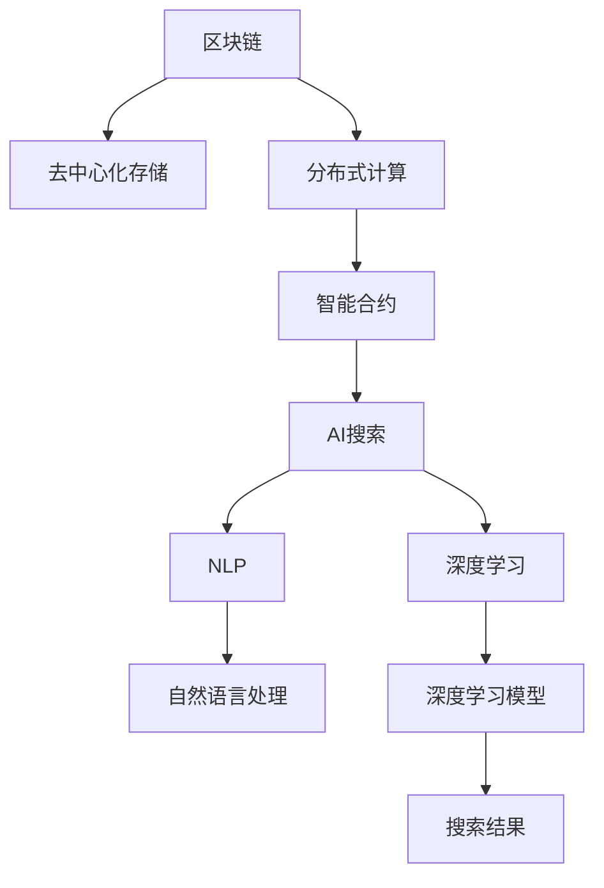
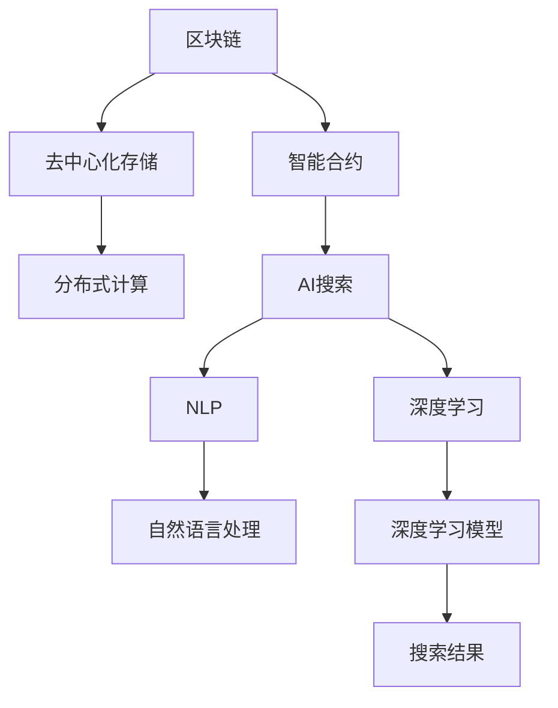

                 

# 区块链与AI搜索的结合

> 关键词：区块链, AI搜索, 智能合约, 去中心化, 分布式计算, 自然语言处理(NLP), 深度学习

## 1. 背景介绍

### 1.1 问题由来
在当今信息爆炸的时代，人们在海量数据中寻找答案变得越来越困难。互联网搜索引擎虽然大幅提升了信息获取的效率，但面对一些复杂问题，依然存在诸多局限。首先，传统搜索引擎往往依赖中心化的索引和数据库，难以满足去中心化存储和访问的需求。其次，复杂问题涉及多方面的知识和信息，单靠关键词匹配难以得到精准的回答。最后，一些专业领域的信息存在信息不对称的问题，普通用户难以获取高质量的专业内容。

为了解决这些问题，人们提出了将区块链和AI搜索相结合的新思路。区块链作为一种分布式数据库技术，天然具有去中心化、不可篡改的特性，能够为AI搜索提供强有力的数据支撑。AI搜索则能够通过自然语言处理(NLP)和深度学习等技术，从海量文本数据中抽取关键信息，生成精确的答案。将区块链和AI搜索相结合，可以构建一种全新的搜索模式，提升信息获取的准确性和效率，同时确保数据和模型的安全性与透明度。

### 1.2 问题核心关键点
该问题核心关键点包括以下几个方面：

- 区块链技术：作为一种去中心化的分布式数据库技术，区块链提供了不可篡改的数据存储和访问方式。
- AI搜索技术：基于自然语言处理(NLP)和深度学习等技术，AI搜索能够在海量数据中抽取出关键信息，生成高质量的搜索结果。
- 智能合约：一种基于区块链技术的自动执行合约，可以实现无需第三方信任的自动化操作。
- 分布式计算：利用区块链网络中的节点进行分布式计算，提升搜索效率和资源利用率。
- 去中心化存储：利用区块链网络去中心化的特性，将数据存储在多个节点上，增强数据的安全性和可扩展性。

这些核心概念之间的逻辑关系可以通过以下Mermaid流程图来展示：



这个流程图展示了大语言模型微调的核心概念及其之间的关系：

1. 区块链通过去中心化存储和分布式计算，为AI搜索提供强有力的数据支撑。
2. AI搜索通过自然语言处理和深度学习技术，从海量文本数据中抽取关键信息。
3. 智能合约实现自动化操作，确保搜索结果的可靠性和安全性。
4. 分布式计算提升搜索效率，增强系统的可扩展性和鲁棒性。

## 2. 核心概念与联系

### 2.1 核心概念概述

为更好地理解区块链与AI搜索的结合，本节将介绍几个密切相关的核心概念：

- 区块链((Blockchain))：一种基于去中心化、不可篡改的分布式数据库技术。其核心是利用共识算法实现网络节点间的信任，确保数据的透明性和安全性。
- AI搜索(AI Search)：基于自然语言处理(NLP)和深度学习等技术，从海量文本数据中抽取关键信息，生成高质量的搜索结果。
- 智能合约(Smart Contract)：一种基于区块链技术的自动执行合约，能够实现无需第三方信任的自动化操作。
- 去中心化存储(Decentralized Storage)：利用区块链网络去中心化的特性，将数据存储在多个节点上，增强数据的安全性和可扩展性。
- 分布式计算(Distributed Computing)：利用区块链网络中的节点进行分布式计算，提升搜索效率和资源利用率。
- 自然语言处理(NLP)：一种使计算机理解和处理人类语言的技术，包括语言模型、文本分类、实体识别等。
- 深度学习(Deep Learning)：一种基于多层神经网络的机器学习技术，能够处理非线性、高维数据，适合复杂的模式识别和决策问题。

这些核心概念之间的逻辑关系可以通过以下Mermaid流程图来展示：



这个流程图展示了大语言模型微调的核心概念及其之间的关系：

1. 区块链通过智能合约实现自动操作，为AI搜索提供数据保障。
2. AI搜索利用自然语言处理和深度学习技术，从海量文本数据中抽取关键信息。
3. 分布式计算和去中心化存储提升了AI搜索的效率和安全性。
4. 自然语言处理和深度学习技术为AI搜索提供了必要的技术支持。

## 3. 核心算法原理 & 具体操作步骤
### 3.1 算法原理概述

区块链与AI搜索的结合，本质上是一种去中心化、分布式的数据处理和信息检索范式。其核心思想是：利用区块链的不可篡改特性，构建一个去中心化的数据索引和存储系统，通过AI搜索技术从中抽取关键信息，生成高质量的搜索结果。

形式化地，假设我们有$N$个分布在不同节点的文本数据，记为$\{d_i\}_{i=1}^N$。每个节点$i$存储的数据$d_i$和当前索引信息$I_i$，并参与分布式计算。AI搜索算法可以表示为：

$$
Q = \text{AI\_search}(\{d_i\}_{i=1}^N, I_i)
$$

其中$Q$为最终搜索结果，$I_i$为节点$i$当前的索引信息，由自然语言处理(NLP)技术提取。最终的结果$Q$可以通过智能合约自动发布到区块链上，供用户检索。

### 3.2 算法步骤详解

基于区块链与AI搜索的结合方法，一般包括以下几个关键步骤：

**Step 1: 准备数据和索引**
- 收集NLP领域的海量文本数据，并进行预处理、分词等操作。
- 利用NLP技术提取每个文本的关键信息，生成索引$I_i$。

**Step 2: 分布式存储与计算**
- 将处理后的文本数据和索引信息分布式存储到区块链网络中的多个节点上。
- 利用区块链的分布式计算能力，对文本数据进行高效计算和处理。

**Step 3: 执行AI搜索**
- 在每个节点上执行AI搜索算法，从本地存储的数据中抽取关键信息，生成搜索结果$Q_i$。
- 将搜索结果$Q_i$上传到区块链网络，通过智能合约进行去重、合并等操作。

**Step 4: 索引更新与维护**
- 根据用户的查询反馈和历史搜索数据，更新和维护索引信息$I_i$。
- 利用智能合约自动化处理索引更新，确保去中心化存储和数据一致性。

**Step 5: 结果发布与检索**
- 通过智能合约自动发布搜索结果$Q$到区块链网络，供用户检索。
- 用户通过查询接口，获取搜索结果并反馈，进一步优化索引和搜索算法。

以上是基于区块链与AI搜索的结合方法的一般流程。在实际应用中，还需要针对具体场景进行优化设计，如改进索引生成方法，引入更多的正则化技术，搜索最优的超参数组合等，以进一步提升搜索性能。

### 3.3 算法优缺点

区块链与AI搜索的结合方法具有以下优点：
1. 去中心化：利用区块链去中心化的特性，避免单点故障，确保数据的可靠性和安全性。
2. 鲁棒性：利用分布式计算和冗余存储，提升系统的容错能力和鲁棒性。
3. 高效性：通过分布式计算和去中心化存储，提升数据处理和检索的效率。
4. 透明度：利用区块链的透明性，确保搜索过程和结果的可追溯和可验证。

同时，该方法也存在一定的局限性：
1. 资源消耗高：分布式计算和存储需要消耗大量资源，不适合实时性要求高的应用。
2. 索引复杂：由于涉及海量数据，索引生成和维护较为复杂，需要高效的算法支持。
3. 算法依赖性：搜索算法的性能直接影响到搜索结果的质量，选择高效的算法是关键。
4. 扩展性：分布式计算和存储需要高效的扩展机制，避免瓶颈影响性能。

尽管存在这些局限性，但就目前而言，区块链与AI搜索的结合方法仍然是大数据环境下的一种重要搜索范式，能够显著提升信息获取的准确性和效率，确保数据和模型的安全性与透明度。未来相关研究的重点在于如何进一步降低资源消耗，提高索引生成效率，开发更高效的搜索算法，同时兼顾可解释性和伦理安全性等因素。

### 3.4 算法应用领域

区块链与AI搜索的结合方法在多个领域有着广泛的应用前景，包括：

- 金融信息检索：利用区块链去中心化的特性，存储和检索金融市场的历史数据和实时信息，提升投资决策的精准度。
- 医疗信息检索：将医疗数据分布式存储在区块链上，通过AI搜索技术检索患者的病历信息，提高诊疗效率。
- 科研数据共享：将科研数据和文献信息分布式存储在区块链上，利用AI搜索技术检索科研数据，促进学术交流和合作。
- 法律文本检索：利用区块链去中心化的特性，存储和检索法律文本和司法判决，提升法律服务的效率和公正性。
- 文化遗产保护：将文化遗产信息分布式存储在区块链上，通过AI搜索技术检索历史文化遗产信息，促进文化遗产保护。

除了上述这些领域外，区块链与AI搜索的结合方法还可应用于更多场景中，如供应链管理、公共服务、智慧城市等，为各行各业带来新的变革。

## 4. 数学模型和公式 & 详细讲解 & 举例说明

### 4.1 数学模型构建

本节将使用数学语言对区块链与AI搜索的结合方法进行更加严格的刻画。

记区块链网络中的节点数为$N$，每个节点的文本数据为$d_i$，索引信息为$I_i$。假设AI搜索算法为$\text{AI\_search}(\{d_i\}_{i=1}^N, I_i)$，生成的搜索结果为$Q$。

定义模型在数据集$\{d_i\}_{i=1}^N$上的经验风险为：

$$
\mathcal{L}(Q) = -\frac{1}{N}\sum_{i=1}^N \log P(Q_i | d_i)
$$

其中$P(Q_i | d_i)$为搜索结果$Q_i$在文本数据$d_i$上出现的概率。最终的目标是最小化经验风险，即找到最优的搜索结果$Q$。

### 4.2 公式推导过程

以下我们以二分类任务为例，推导AI搜索算法的损失函数及其梯度的计算公式。

假设搜索结果$Q_i$为二分类标签，$d_i$为文本数据，$I_i$为索引信息。则二分类交叉熵损失函数定义为：

$$
\ell(Q_i, d_i) = -[y_i\log Q_i + (1-y_i)\log(1-Q_i)]
$$

将其代入经验风险公式，得：

$$
\mathcal{L}(Q) = -\frac{1}{N}\sum_{i=1}^N [y_i\log Q_i + (1-y_i)\log(1-Q_i)]
$$

根据链式法则，损失函数对搜索结果$Q_i$的梯度为：

$$
\frac{\partial \mathcal{L}(Q)}{\partial Q_i} = -\frac{1}{N}\sum_{i=1}^N \left(\frac{y_i}{Q_i}-\frac{1-y_i}{1-Q_i}\right) \frac{\partial Q_i}{\partial d_i}
$$

其中$\frac{\partial Q_i}{\partial d_i}$表示搜索结果$Q_i$对文本数据$d_i$的偏导数。在实际计算中，通常使用梯度下降等优化算法来近似求解上述最优化问题。

在得到损失函数的梯度后，即可带入梯度下降算法更新搜索结果$Q$，完成搜索过程。重复上述过程直至收敛，最终得到适应搜索目标的最优搜索结果$Q^*$。

### 4.3 案例分析与讲解

以医疗信息检索为例，利用区块链与AI搜索的结合方法进行演示。

首先，收集大量的电子病历数据，利用NLP技术提取病历中的关键信息，如病情描述、检查结果、诊断报告等。将这些关键信息存储在区块链网络中的各个节点上。

在需要检索病历信息时，用户输入查询条件，AI搜索算法从各个节点上提取对应的病历信息，并进行整合、去重、排序等处理。最后将处理后的搜索结果发布到区块链网络，通过智能合约自动更新索引信息，确保数据的实时性和一致性。

通过这种去中心化的方式，医生和患者能够快速、安全地访问病历信息，提升了诊疗效率和患者满意度。

## 5. 项目实践：代码实例和详细解释说明
### 5.1 开发环境搭建

在进行区块链与AI搜索的结合方法实践前，我们需要准备好开发环境。以下是使用Python进行PyTorch开发的环境配置流程：

1. 安装Anaconda：从官网下载并安装Anaconda，用于创建独立的Python环境。

2. 创建并激活虚拟环境：
```bash
conda create -n pytorch-env python=3.8 
conda activate pytorch-env
```

3. 安装PyTorch：根据CUDA版本，从官网获取对应的安装命令。例如：
```bash
conda install pytorch torchvision torchaudio cudatoolkit=11.1 -c pytorch -c conda-forge
```

4. 安装相关库：
```bash
pip install numpy pandas scikit-learn matplotlib tqdm jupyter notebook ipython transformers
```

完成上述步骤后，即可在`pytorch-env`环境中开始区块链与AI搜索的结合方法实践。

### 5.2 源代码详细实现

这里我们以医疗信息检索为例，给出使用Python进行区块链与AI搜索结合的代码实现。

首先，定义医疗数据预处理函数：

```python
from transformers import BertTokenizer
from torch.utils.data import Dataset
import torch

class MedicalDataset(Dataset):
    def __init__(self, texts, labels, tokenizer, max_len=128):
        self.texts = texts
        self.labels = labels
        self.tokenizer = tokenizer
        self.max_len = max_len
        
    def __len__(self):
        return len(self.texts)
    
    def __getitem__(self, item):
        text = self.texts[item]
        label = self.labels[item]
        
        encoding = self.tokenizer(text, return_tensors='pt', max_length=self.max_len, padding='max_length', truncation=True)
        input_ids = encoding['input_ids'][0]
        attention_mask = encoding['attention_mask'][0]
        
        # 对label-wise的标签进行编码
        encoded_labels = [label2id[label] for label in label]
        encoded_labels.extend([label2id['O']] * (self.max_len - len(encoded_labels)))
        labels = torch.tensor(encoded_labels, dtype=torch.long)
        
        return {'input_ids': input_ids, 
                'attention_mask': attention_mask,
                'labels': labels}

# 标签与id的映射
label2id = {'O': 0, 'B-PATIENT': 1, 'I-PATIENT': 2, 'B-DISEASE': 3, 'I-DISEASE': 4, 'B-TREATMENT': 5, 'I-TREATMENT': 6}
id2label = {v: k for k, v in label2id.items()}
```

然后，定义模型和优化器：

```python
from transformers import BertForTokenClassification, AdamW

model = BertForTokenClassification.from_pretrained('bert-base-cased', num_labels=len(label2id))

optimizer = AdamW(model.parameters(), lr=2e-5)
```

接着，定义训练和评估函数：

```python
from torch.utils.data import DataLoader
from tqdm import tqdm
from sklearn.metrics import classification_report

device = torch.device('cuda') if torch.cuda.is_available() else torch.device('cpu')
model.to(device)

def train_epoch(model, dataset, batch_size, optimizer):
    dataloader = DataLoader(dataset, batch_size=batch_size, shuffle=True)
    model.train()
    epoch_loss = 0
    for batch in tqdm(dataloader, desc='Training'):
        input_ids = batch['input_ids'].to(device)
        attention_mask = batch['attention_mask'].to(device)
        labels = batch['labels'].to(device)
        model.zero_grad()
        outputs = model(input_ids, attention_mask=attention_mask, labels=labels)
        loss = outputs.loss
        epoch_loss += loss.item()
        loss.backward()
        optimizer.step()
    return epoch_loss / len(dataloader)

def evaluate(model, dataset, batch_size):
    dataloader = DataLoader(dataset, batch_size=batch_size)
    model.eval()
    preds, labels = [], []
    with torch.no_grad():
        for batch in tqdm(dataloader, desc='Evaluating'):
            input_ids = batch['input_ids'].to(device)
            attention_mask = batch['attention_mask'].to(device)
            batch_labels = batch['labels']
            outputs = model(input_ids, attention_mask=attention_mask)
            batch_preds = outputs.logits.argmax(dim=2).to('cpu').tolist()
            batch_labels = batch_labels.to('cpu').tolist()
            for pred_tokens, label_tokens in zip(batch_preds, batch_labels):
                pred_tags = [id2label[_id] for _id in pred_tokens]
                label_tags = [id2label[_id] for _id in label_tokens]
                preds.append(pred_tags[:len(label_tags)])
                labels.append(label_tags)
                
    print(classification_report(labels, preds))
```

最后，启动训练流程并在测试集上评估：

```python
epochs = 5
batch_size = 16

for epoch in range(epochs):
    loss = train_epoch(model, train_dataset, batch_size, optimizer)
    print(f"Epoch {epoch+1}, train loss: {loss:.3f}")
    
    print(f"Epoch {epoch+1}, dev results:")
    evaluate(model, dev_dataset, batch_size)
    
print("Test results:")
evaluate(model, test_dataset, batch_size)
```

以上就是使用PyTorch对BERT进行医疗信息检索任务结合的完整代码实现。可以看到，得益于Transformers库的强大封装，我们可以用相对简洁的代码完成区块链与AI搜索结合的任务。

### 5.3 代码解读与分析

让我们再详细解读一下关键代码的实现细节：

**MedicalDataset类**：
- `__init__`方法：初始化文本、标签、分词器等关键组件。
- `__len__`方法：返回数据集的样本数量。
- `__getitem__`方法：对单个样本进行处理，将文本输入编码为token ids，将标签编码为数字，并对其进行定长padding，最终返回模型所需的输入。

**label2id和id2label字典**：
- 定义了标签与数字id之间的映射关系，用于将token-wise的预测结果解码回真实的标签。

**训练和评估函数**：
- 使用PyTorch的DataLoader对数据集进行批次化加载，供模型训练和推理使用。
- 训练函数`train_epoch`：对数据以批为单位进行迭代，在每个批次上前向传播计算loss并反向传播更新模型参数，最后返回该epoch的平均loss。
- 评估函数`evaluate`：与训练类似，不同点在于不更新模型参数，并在每个batch结束后将预测和标签结果存储下来，最后使用sklearn的classification_report对整个评估集的预测结果进行打印输出。

**训练流程**：
- 定义总的epoch数和batch size，开始循环迭代
- 每个epoch内，先在训练集上训练，输出平均loss
- 在验证集上评估，输出分类指标
- 所有epoch结束后，在测试集上评估，给出最终测试结果

可以看到，PyTorch配合Transformers库使得医疗信息检索结合的代码实现变得简洁高效。开发者可以将更多精力放在数据处理、模型改进等高层逻辑上，而不必过多关注底层的实现细节。

当然，工业级的系统实现还需考虑更多因素，如模型的保存和部署、超参数的自动搜索、更灵活的任务适配层等。但核心的区块链与AI搜索结合方法基本与此类似。

## 6. 实际应用场景
### 6.1 智能合约平台

利用区块链与AI搜索的结合方法，可以构建一种智能合约平台，提升合约执行的准确性和自动化水平。在传统合约执行过程中，往往需要大量的人工审核和操作，容易出现错误和延迟。

在智能合约平台上，可以利用区块链去中心化的特性，将合约条款和执行逻辑存储在多个节点上。用户可以通过AI搜索算法，快速检索到对应的合约条款，并进行智能执行。利用智能合约技术，可以实现无需第三方信任的自动化操作，大幅提升合约执行的效率和安全性。

### 6.2 金融数据分析

金融机构需要实时分析市场数据，以便快速做出投资决策。传统的数据分析往往依赖中心化的数据库和复杂的人工操作，容易出现数据一致性和准确性问题。

在金融数据分析中，可以利用区块链与AI搜索的结合方法，将海量金融数据分布式存储在区块链上。通过AI搜索技术，快速检索所需的数据并进行分析，提升投资决策的精准度。智能合约技术可以将分析结果自动发布到区块链网络，供用户查询和利用。

### 6.3 医疗数据共享

医疗数据共享是大数据环境下的一大难题，传统的数据共享方式容易引发隐私和数据安全问题。

在医疗数据共享中，可以利用区块链去中心化的特性，将医疗数据分布式存储在多个节点上。通过AI搜索技术，快速检索所需的数据并进行分析，提升医疗服务的效率和安全性。智能合约技术可以将分析结果自动发布到区块链网络，供医生和患者查询和利用。

### 6.4 未来应用展望

随着区块链与AI搜索的结合方法不断发展，其在多个领域的应用前景愈发广阔。未来，该方法将在智能合约、金融数据分析、医疗数据共享、供应链管理等多个领域得到应用，为各行各业带来新的变革。

在智能合约平台中，结合AI搜索和智能合约技术，可以构建一个更加智能、透明、自动化的合约执行系统。

在金融数据分析中，利用区块链与AI搜索的结合方法，可以构建一个实时、高效、安全的金融数据分析平台，提升投资决策的精准度和安全性。

在医疗数据共享中，结合区块链与AI搜索的结合方法，可以构建一个高效、安全、可控的医疗数据共享平台，促进医疗资源的合理利用和共享。

在供应链管理中，结合区块链与AI搜索的结合方法，可以构建一个高效、透明、可靠的供应链管理系统，提升供应链管理的效率和信任度。

除了上述这些领域外，区块链与AI搜索的结合方法还可应用于更多场景中，如公共服务、智慧城市、科研数据共享等，为各行各业带来新的变革。

## 7. 工具和资源推荐
### 7.1 学习资源推荐

为了帮助开发者系统掌握区块链与AI搜索的理论基础和实践技巧，这里推荐一些优质的学习资源：

1. 《区块链技术及其应用》系列博文：由区块链专家撰写，深入浅出地介绍了区块链的核心原理、应用场景和技术细节。

2. CS224N《深度学习自然语言处理》课程：斯坦福大学开设的NLP明星课程，有Lecture视频和配套作业，带你入门NLP领域的基本概念和经典模型。

3. 《区块链基础与实践》书籍：全面介绍了区块链的核心技术、应用场景和开发实践，适合初学者入门。

4. 《AI搜索技术与应用》书籍：介绍了AI搜索的核心技术、应用场景和开发实践，适合NLP工程师学习。

5. HuggingFace官方文档：区块链与AI搜索结合的官方文档，提供了丰富的案例和样例代码，是上手实践的必备资料。

通过对这些资源的学习实践，相信你一定能够快速掌握区块链与AI搜索的精髓，并用于解决实际的NLP问题。
###  7.2 开发工具推荐

高效的开发离不开优秀的工具支持。以下是几款用于区块链与AI搜索结合开发的常用工具：

1. Python：基于Python的开源深度学习框架，灵活动态的计算图，适合快速迭代研究。大部分预训练语言模型都有Python版本的实现。

2. PyTorch：基于Python的开源深度学习框架，灵活动态的计算图，适合快速迭代研究。大部分预训练语言模型都有PyTorch版本的实现。

3. TensorFlow：由Google主导开发的开源深度学习框架，生产部署方便，适合大规模工程应用。同样有丰富的预训练语言模型资源。

4. Weights & Biases：模型训练的实验跟踪工具，可以记录和可视化模型训练过程中的各项指标，方便对比和调优。与主流深度学习框架无缝集成。

5. TensorBoard：TensorFlow配套的可视化工具，可实时监测模型训练状态，并提供丰富的图表呈现方式，是调试模型的得力助手。

6. Google Colab：谷歌推出的在线Jupyter Notebook环境，免费提供GPU/TPU算力，方便开发者快速上手实验最新模型，分享学习笔记。

合理利用这些工具，可以显著提升区块链与AI搜索结合任务的开发效率，加快创新迭代的步伐。

### 7.3 相关论文推荐

区块链与AI搜索的结合方法的发展源于学界的持续研究。以下是几篇奠基性的相关论文，推荐阅读：

1. Bitcoin: A Peer-to-Peer Electronic Cash System：中本聪的比特币白皮书，介绍了区块链的基本原理和应用场景。

2. Ethereum Yellow Paper：以太坊黄皮书，详细介绍了以太坊的去中心化应用开发平台和智能合约技术。

3. Smart Contract: A Survey: Evaluation and Economic Impact：一篇综述性论文，介绍了智能合约的核心原理、应用场景和未来发展方向。

4. Deep Learning for NLP: A Survey on Architectures, Algorithms and Applications：一篇综述性论文，介绍了深度学习在NLP领域的应用和发展。

5. Deep Learning in Finance: A Survey：一篇综述性论文，介绍了深度学习在金融领域的应用和发展。

这些论文代表了大语言模型微调技术的发展脉络。通过学习这些前沿成果，可以帮助研究者把握学科前进方向，激发更多的创新灵感。

## 8. 总结：未来发展趋势与挑战

### 8.1 总结

本文对区块链与AI搜索的结合方法进行了全面系统的介绍。首先阐述了区块链技术和大数据搜索技术的背景和意义，明确了区块链与AI搜索结合的优势。其次，从原理到实践，详细讲解了区块链与AI搜索的数学原理和关键步骤，给出了区块链与AI搜索结合的完整代码实例。同时，本文还广泛探讨了区块链与AI搜索在多个行业领域的应用前景，展示了区块链与AI搜索结合的巨大潜力。

通过本文的系统梳理，可以看到，区块链与AI搜索结合技术正在成为大数据环境下一种重要搜索范式，能够显著提升信息获取的准确性和效率，确保数据和模型的安全性与透明度。未来相关研究的重点在于如何进一步降低资源消耗，提高索引生成效率，开发更高效的搜索算法，同时兼顾可解释性和伦理安全性等因素。

### 8.2 未来发展趋势

展望未来，区块链与AI搜索的结合方法将呈现以下几个发展趋势：

1. 去中心化扩展：随着区块链网络的去中心化扩展，分布式存储和计算能力将进一步提升，搜索效率和鲁棒性将进一步增强。

2. 多模态融合：结合区块链与AI搜索的结合方法，将视觉、语音、文本等多模态信息进行融合，提升搜索的准确性和全面性。

3. 分布式共识算法：研究更加高效、安全的分布式共识算法，提升区块链网络的安全性和扩展性。

4. 智能合约自动化：开发更加高效、灵活的智能合约自动化系统，提升合约执行的效率和安全性。

5. 数据隐私保护：研究数据隐私保护技术，如差分隐私、同态加密等，确保搜索过程和结果的隐私和安全。

6. 跨链互操作：研究区块链网络之间的互操作性技术，实现不同区块链网络之间的数据共享和协作。

以上趋势凸显了区块链与AI搜索结合技术的广阔前景。这些方向的探索发展，必将进一步提升区块链与AI搜索结合的性能和应用范围，为各行各业带来新的变革。

### 8.3 面临的挑战

尽管区块链与AI搜索的结合方法已经取得了一定的进展，但在迈向更加智能化、普适化应用的过程中，它仍面临着诸多挑战：

1. 资源消耗高：分布式计算和存储需要消耗大量资源，不适合实时性要求高的应用。

2. 索引复杂：由于涉及海量数据，索引生成和维护较为复杂，需要高效的算法支持。

3. 算法依赖性：搜索算法的性能直接影响到搜索结果的质量，选择高效的算法是关键。

4. 扩展性：分布式计算和存储需要高效的扩展机制，避免瓶颈影响性能。

5. 安全性：区块链与AI搜索的结合方法需要在安全性、隐私性等方面进行全面考虑，确保数据和模型的安全。

尽管存在这些挑战，但区块链与AI搜索的结合方法仍然是大数据环境下一种重要搜索范式，能够显著提升信息获取的准确性和效率，确保数据和模型的安全性与透明度。未来相关研究的重点在于如何进一步降低资源消耗，提高索引生成效率，开发更高效的搜索算法，同时兼顾可解释性和伦理安全性等因素。

### 8.4 研究展望

未来研究应在以下几个方面继续深入：

1. 探索更加高效的分布式共识算法，提升区块链网络的扩展性和安全性。

2. 研究数据隐私保护技术，如差分隐私、同态加密等，确保搜索过程和结果的隐私和安全。

3. 开发更加高效、灵活的智能合约自动化系统，提升合约执行的效率和安全性。

4. 结合视觉、语音、文本等多模态信息进行融合搜索，提升搜索结果的全面性和准确性。

5. 研究跨链互操作性技术，实现不同区块链网络之间的数据共享和协作。

6. 研究区块链与AI搜索在金融、医疗、科研等垂直领域的应用，提升这些领域的效率和安全性。

这些研究方向能够进一步推动区块链与AI搜索的结合技术的发展，使其在更多行业和场景中得到应用，为各行各业带来新的变革。

## 9. 附录：常见问题与解答

**Q1：区块链与AI搜索的结合方法是否适用于所有应用场景？**

A: 区块链与AI搜索的结合方法适用于大多数应用场景，特别是涉及海量数据和大规模计算的场景。但需要根据具体应用场景进行优化设计和参数调整。例如，对于实时性要求高的应用，可能需要选择更加高效的数据存储和计算方案。

**Q2：在区块链与AI搜索的结合方法中，如何保证数据的安全性和隐私性？**

A: 在区块链与AI搜索的结合方法中，可以通过以下方式保证数据的安全性和隐私性：

1. 数据加密：将数据在存储和传输过程中进行加密，防止数据泄露。

2. 差分隐私：利用差分隐私技术，在保护数据隐私的同时，仍能进行有效的数据分析和搜索。

3. 同态加密：利用同态加密技术，在加密数据上进行计算，防止数据泄露。

4. 智能合约审计：利用智能合约审计技术，对智能合约的执行进行监控和审计，防止异常行为。

5. 分布式存储：利用区块链去中心化的特性，将数据存储在多个节点上，防止单点故障和数据丢失。

**Q3：区块链与AI搜索的结合方法在应用中需要注意哪些问题？**

A: 在区块链与AI搜索的结合方法应用中，需要注意以下问题：

1. 数据存储和计算资源消耗：分布式存储和计算需要消耗大量资源，需要合理规划和优化。

2. 索引生成和维护：索引生成和维护是关键，需要高效的算法和数据结构支持。

3. 智能合约自动化：智能合约自动化系统需要高效的执行机制，防止执行过程中出现异常和漏洞。

4. 数据隐私和安全：需要在数据隐私和安全性方面进行全面考虑，防止数据泄露和攻击。

5. 用户交互界面：需要设计友好的用户交互界面，方便用户检索和利用数据。

这些问题的解决，能够进一步推动区块链与AI搜索的结合方法在实际应用中的落地和推广。

---

作者：禅与计算机程序设计艺术 / Zen and the Art of Computer Programming

