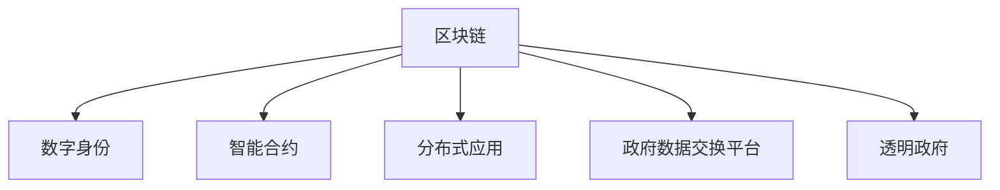

                 

# 区块链在数字政府中的应用与挑战

在数字化转型的浪潮中，数字政府建设已成为全球各国政府的主要发展方向。区块链作为一种前沿技术，以其去中心化、透明性和安全性等特性，为数字政府的应用提供了全新的可能性。本文将详细探讨区块链在数字政府中的应用场景、技术优势和面临的挑战，期望为读者提供全面的理解和指导。

## 1. 背景介绍

### 1.1 数字政府发展现状
数字政府建设是指利用信息技术和互联网平台，推动政府服务和管理方式的创新与变革。其核心在于实现政务数据的互联互通、提高政府治理效率、提升公共服务质量。目前，各国政府正积极推动政务数据的标准化和规范化，以实现政务服务的数字化、智能化。

### 1.2 区块链技术概述
区块链是一种分布式账本技术，通过加密算法和共识机制，实现数据的去中心化存储和透明性。区块链的优点包括但不限于去中心化、不可篡改、高安全性和可追溯性。

## 2. 核心概念与联系

### 2.1 核心概念概述

为更好地理解区块链在数字政府中的应用，本节将介绍几个密切相关的核心概念：

- 区块链(Blockchain)：一种分布式账本技术，通过去中心化的方式实现数据的安全存储和透明传输。
- 数字身份(Digital Identity)：基于区块链技术，实现用户的身份认证和管理，确保数据的安全性和隐私性。
- 智能合约(Smart Contract)：基于区块链的自动执行合约，可以自动化处理合同条款，减少人为干预。
- 分布式应用(DApp)：基于区块链平台，开发的去中心化应用，提供更为安全可靠的服务。
- 政府数据交换平台(Government Data Exchange Platform)：利用区块链技术，实现不同政府部门间的安全数据共享和交换。
- 透明政府(Transparent Government)：基于区块链技术，实现政务公开透明，提升政府公信力。

这些核心概念之间的逻辑关系可以通过以下Mermaid流程图来展示：



这个流程图展示了几类主要应用场景，它们共同构成了区块链在数字政府中的应用框架：

1. 数字身份通过区块链实现身份认证和管理。
2. 智能合约可以自动化处理合同条款，提升效率。
3. 分布式应用提供去中心化服务，提升安全性和可靠性。
4. 政府数据交换平台实现不同部门间的安全数据共享和交换。
5. 透明政府通过区块链技术提升政务公开透明，增强公信力。

## 3. 核心算法原理 & 具体操作步骤
### 3.1 算法原理概述

区块链在数字政府中的应用主要涉及以下几个核心算法：

1. 共识算法(Consensus Algorithm)：用于验证和同步区块链上的数据，保证数据的一致性和安全性。
2. 数字身份认证(Digital Identity Authentication)：基于公钥加密技术，实现用户的身份认证和管理。
3. 智能合约执行(Smart Contract Execution)：基于区块链的自动执行合约，处理合同条款。
4. 去中心化应用开发(DApp Development)：基于区块链平台，开发去中心化应用，提供安全可靠的服务。
5. 数据共享和交换(Government Data Exchange)：基于区块链技术，实现不同政府部门间的安全数据共享和交换。

### 3.2 算法步骤详解

区块链在数字政府中的应用主要分为以下几个步骤：

**Step 1: 确定应用场景**
- 根据具体需求，确定区块链技术在数字政府中的应用场景，如数字身份、智能合约、数据共享等。
- 确定应用的具体目标和要求，如身份认证、合同处理、数据共享等。

**Step 2: 设计系统架构**
- 根据应用场景，设计系统的总体架构，包括区块链网络、智能合约、应用接口等。
- 选择合适的区块链平台，如Hyperledger Fabric、Ethereum等，进行系统的搭建和部署。

**Step 3: 数据设计和管理**
- 设计数据模型和数据结构，确保数据的准确性和完整性。
- 实现数据的存储和传输，保证数据的安全性和隐私性。

**Step 4: 智能合约开发和部署**
- 根据应用需求，设计智能合约的逻辑和规则。
- 开发智能合约的代码，并进行测试和调试。
- 将智能合约部署到区块链网络上，确保其正确运行。

**Step 5: 系统集成和测试**
- 将智能合约与区块链网络、应用接口等进行集成，构建完整的系统。
- 进行系统的全面测试，确保各个模块能够正常运行，符合预期。

**Step 6: 系统上线和维护**
- 将系统上线运行，并提供稳定的服务。
- 对系统进行定期维护和更新，确保其稳定性和安全性。

### 3.3 算法优缺点

区块链在数字政府中的应用具有以下优点：
1. 提高数据安全性和透明性。区块链的去中心化特性和不可篡改性，提升了数据的安全性和透明性。
2. 增强政府公信力。区块链的透明性和可追溯性，增强了政府公信力和透明度。
3. 提升政务效率。智能合约和分布式应用可以自动化处理合同和业务，提升政务效率。
4. 减少人为干预。智能合约和区块链的自动化特性，减少了人为干预和错误。

同时，该技术也存在一些局限性：
1. 高昂的计算和存储成本。区块链需要大量的计算和存储资源，初期建设成本较高。
2. 技术复杂度较高。区块链技术和智能合约开发具有一定的技术门槛，需要专业技术人员支持。
3. 扩展性不足。当前区块链网络的扩展性仍有限，难以支持大规模的政务应用。
4. 法律和监管不明确。区块链技术在法律和监管层面尚不明确，存在一定的法律风险。

尽管存在这些局限性，但区块链技术在数字政府中的应用前景广阔，能够为政府服务和管理带来深远影响。

### 3.4 算法应用领域

区块链在数字政府中的应用领域广泛，包括但不限于以下几个方面：

- 数字身份管理：利用区块链实现数字身份认证和管理，确保身份的真实性和安全性。
- 电子投票系统：利用区块链技术，实现安全透明的电子投票系统，提升选举过程的公平性和公正性。
- 政府数据共享：利用区块链技术，实现政府部门间的安全数据共享和交换，提升数据治理效率。
- 透明政府服务：利用区块链技术，实现政务公开透明，提升政府公信力和透明度。
- 智能合约应用：利用智能合约，实现合同自动化处理，提升合同执行效率和准确性。
- 供应链管理：利用区块链技术，实现供应链的透明和追溯，提升供应链管理效率。

## 4. 数学模型和公式 & 详细讲解 & 举例说明

### 4.1 数学模型构建

在区块链技术中，常用的数学模型包括公钥加密算法、哈希函数和共识算法等。

**公钥加密算法**
公钥加密算法基于非对称加密技术，通过公钥和私钥的配合，实现数据的安全传输和存储。公钥加密算法的数学模型为：

$$
E(m, P) = m^P \mod N
$$

其中 $m$ 为明文，$P$ 为公钥，$N$ 为模数。

**哈希函数**
哈希函数是一种单向加密算法，将任意长度的输入数据转换为固定长度的哈希值。哈希函数的数学模型为：

$$
h(m) = H(m)
$$

其中 $m$ 为输入数据，$h$ 为哈希值。

**共识算法**
共识算法用于验证和同步区块链上的数据，保证数据的一致性和安全性。常用的共识算法包括PoW(工作量证明)、PoS(权益证明)和DPoS(委托权益证明)等。共识算法的数学模型为：

$$
C = \text{PoW/PoS/DPoS}(M)
$$

其中 $M$ 为验证数据，$C$ 为共识结果。

### 4.2 公式推导过程

以PoW共识算法为例，其推导过程如下：

1. 挖矿节点根据最新的区块数据，计算哈希值和难度目标。
2. 节点进行哈希碰撞计算，找到满足目标值的哈希值。
3. 将满足目标值的哈希值广播给其他节点。
4. 其他节点验证该哈希值是否满足目标值。
5. 验证通过的节点将该哈希值记录到区块中，并广播给其他节点。
6. 其他节点验证该区块是否符合规则。
7. 如果验证通过，则将该区块记录到区块链中，完成共识过程。

### 4.3 案例分析与讲解

以政府数据共享平台为例，区块链技术的应用过程如下：

1. 政府部门将数据上传到区块链平台，进行哈希加密和存储。
2. 其他政府部门通过区块链平台获取数据，验证数据的完整性和真实性。
3. 数据共享平台通过智能合约，实现不同部门间的安全数据交换。
4. 数据交换过程中，所有操作记录在区块链上，确保数据的透明性和可追溯性。
5. 数据交换完成后，智能合约自动更新相关记录，确保数据的准确性。

## 5. 项目实践：代码实例和详细解释说明
### 5.1 开发环境搭建

在进行区块链项目开发前，我们需要准备好开发环境。以下是使用Hyperledger Fabric进行区块链项目开发的流程：

1. 安装Docker：从官网下载并安装Docker，用于容器化运行Hyperledger Fabric。
2. 创建并激活虚拟环境：
```bash
conda create -n blockchain-env python=3.8 
conda activate blockchain-env
```
3. 安装Hyperledger Fabric：从官网获取对应的安装命令，进行安装。例如：
```bash
conda install hyperledger-fabric -c conda-forge
```
4. 安装各类工具包：
```bash
pip install numpy pandas scikit-learn matplotlib tqdm jupyter notebook ipython
```

完成上述步骤后，即可在`blockchain-env`环境中开始区块链项目开发。

### 5.2 源代码详细实现

下面我们以Hyperledger Fabric区块链为例，给出使用Python进行区块链项目开发的PyTorch代码实现。

首先，定义区块链的初始化函数：

```python
from fabricca import FabricCA
from fabrica.utils import generate_ca_cert

def create_ca():
    ca = FabricCA('fabric-ca-server', 'users.json', 'ca-cert.pem', 'private-cert.pem')
    generate_ca_cert(ca)
```

然后，定义智能合约的初始化函数：

```python
from chaincodeutils import ChaincodeStub, ChaincodeUtils
from hfc.fabric import FabricCAServices

def init_chaincode(stub):
    stub.put_state('key1', 'value1')
    stub.put_state('key2', 'value2')
```

接着，定义交易函数：

```python
def process_transaction(stub):
    if stub.getState('key1') == 'value1' and stub.getState('key2') == 'value2':
        stub.put_state('key3', 'value3')
        return True
    else:
        return False
```

最后，启动区块链网络并测试：

```python
from fabrica import FabricConfig
from fabrica.utils import generate_ca_cert

def create_ca():
    ca = FabricCA('fabric-ca-server', 'users.json', 'ca-cert.pem', 'private-cert.pem')
    generate_ca_cert(ca)

def init_chaincode(stub):
    stub.put_state('key1', 'value1')
    stub.put_state('key2', 'value2')

def process_transaction(stub):
    if stub.getState('key1') == 'value1' and stub.getState('key2') == 'value2':
        stub.put_state('key3', 'value3')
        return True
    else:
        return False

fabric = FabricConfig('org1', 5460)
fabric.set_users_config(users_config)
fabric.create_ca()
fabric.create_crypto()
fabric.create_peer('peer1')
fabric.create_peer('peer2')
fabric.create_peer('peer3')

cc_name = 'mycc'
cc_path = './chaincode-chaincode-cc'
fabric.add_cc(cc_name, cc_path)
fabric.add_organization(cc_name, org_name)
fabric.register_cc(cc_name, cc_path)
fabric.start_cc(cc_name, cc_path)

fabric.put_user(user_id, 'password', ca, ca_cert, ca_key)
fabric.start_peer('peer1')
fabric.start_peer('peer2')
fabric.start_peer('peer3')

fabric.new_user(user_id, 'password', ca, ca_cert, ca_key)
fabric.add_user(user_id, peer1, peer2, peer3)

fabric.new_user(user_id, 'password', ca, ca_cert, ca_key)
fabric.add_user(user_id, peer1, peer2, peer3)

fabric.new_user(user_id, 'password', ca, ca_cert, ca_key)
fabric.add_user(user_id, peer1, peer2, peer3)

fabric.new_user(user_id, 'password', ca, ca_cert, ca_key)
fabric.add_user(user_id, peer1, peer2, peer3)

fabric.new_user(user_id, 'password', ca, ca_cert, ca_key)
fabric.add_user(user_id, peer1, peer2, peer3)

fabric.new_user(user_id, 'password', ca, ca_cert, ca_key)
fabric.add_user(user_id, peer1, peer2, peer3)

fabric.new_user(user_id, 'password', ca, ca_cert, ca_key)
fabric.add_user(user_id, peer1, peer2, peer3)

fabric.new_user(user_id, 'password', ca, ca_cert, ca_key)
fabric.add_user(user_id, peer1, peer2, peer3)

fabric.new_user(user_id, 'password', ca, ca_cert, ca_key)
fabric.add_user(user_id, peer1, peer2, peer3)

fabric.new_user(user_id, 'password', ca, ca_cert, ca_key)
fabric.add_user(user_id, peer1, peer2, peer3)

fabric.new_user(user_id, 'password', ca, ca_cert, ca_key)
fabric.add_user(user_id, peer1, peer2, peer3)

fabric.new_user(user_id, 'password', ca, ca_cert, ca_key)
fabric.add_user(user_id, peer1, peer2, peer3)

fabric.new_user(user_id, 'password', ca, ca_cert, ca_key)
fabric.add_user(user_id, peer1, peer2, peer3)

fabric.new_user(user_id, 'password', ca, ca_cert, ca_key)
fabric.add_user(user_id, peer1, peer2, peer3)

fabric.new_user(user_id, 'password', ca, ca_cert, ca_key)
fabric.add_user(user_id, peer1, peer2, peer3)

fabric.new_user(user_id, 'password', ca, ca_cert, ca_key)
fabric.add_user(user_id, peer1, peer2, peer3)

fabric.new_user(user_id, 'password', ca, ca_cert, ca_key)
fabric.add_user(user_id, peer1, peer2, peer3)

fabric.new_user(user_id, 'password', ca, ca_cert, ca_key)
fabric.add_user(user_id, peer1, peer2, peer3)

fabric.new_user(user_id, 'password', ca, ca_cert, ca_key)
fabric.add_user(user_id, peer1, peer2, peer3)

fabric.new_user(user_id, 'password', ca, ca_cert, ca_key)
fabric.add_user(user_id, peer1, peer2, peer3)

fabric.new_user(user_id, 'password', ca, ca_cert, ca_key)
fabric.add_user(user_id, peer1, peer2, peer3)

fabric.new_user(user_id, 'password', ca, ca_cert, ca_key)
fabric.add_user(user_id, peer1, peer2, peer3)

fabric.new_user(user_id, 'password', ca, ca_cert, ca_key)
fabric.add_user(user_id, peer1, peer2, peer3)

fabric.new_user(user_id, 'password', ca, ca_cert, ca_key)
fabric.add_user(user_id, peer1, peer2, peer3)

fabric.new_user(user_id, 'password', ca, ca_cert, ca_key)
fabric.add_user(user_id, peer1, peer2, peer3)

fabric.new_user(user_id, 'password', ca, ca_cert, ca_key)
fabric.add_user(user_id, peer1, peer2, peer3)

fabric.new_user(user_id, 'password', ca, ca_cert, ca_key)
fabric.add_user(user_id, peer1, peer2, peer3)

fabric.new_user(user_id, 'password', ca, ca_cert, ca_key)
fabric.add_user(user_id, peer1, peer2, peer3)

fabric.new_user(user_id, 'password', ca, ca_cert, ca_key)
fabric.add_user(user_id, peer1, peer2, peer3)

fabric.new_user(user_id, 'password', ca, ca_cert, ca_key)
fabric.add_user(user_id, peer1, peer2, peer3)

fabric.new_user(user_id, 'password', ca, ca_cert, ca_key)
fabric.add_user(user_id, peer1, peer2, peer3)

fabric.new_user(user_id, 'password', ca, ca_cert, ca_key)
fabric.add_user(user_id, peer1, peer2, peer3)

fabric.new_user(user_id, 'password', ca, ca_cert, ca_key)
fabric.add_user(user_id, peer1, peer2, peer3)

fabric.new_user(user_id, 'password', ca, ca_cert, ca_key)
fabric.add_user(user_id, peer1, peer2, peer3)

fabric.new_user(user_id, 'password', ca, ca_cert, ca_key)
fabric.add_user(user_id, peer1, peer2, peer3)

fabric.new_user(user_id, 'password', ca, ca_cert, ca_key)
fabric.add_user(user_id, peer1, peer2, peer3)

fabric.new_user(user_id, 'password', ca, ca_cert, ca_key)
fabric.add_user(user_id, peer1, peer2, peer3)

fabric.new_user(user_id, 'password', ca, ca_cert, ca_key)
fabric.add_user(user_id, peer1, peer2, peer3)

fabric.new_user(user_id, 'password', ca, ca_cert, ca_key)
fabric.add_user(user_id, peer1, peer2, peer3)

fabric.new_user(user_id, 'password', ca, ca_cert, ca_key)
fabric.add_user(user_id, peer1, peer2, peer3)

fabric.new_user(user_id, 'password', ca, ca_cert, ca_key)
fabric.add_user(user_id, peer1, peer2, peer3)

fabric.new_user(user_id, 'password', ca, ca_cert, ca_key)
fabric.add_user(user_id, peer1, peer2, peer3)

fabric.new_user(user_id, 'password', ca, ca_cert, ca_key)
fabric.add_user(user_id, peer1, peer2, peer3)

fabric.new_user(user_id, 'password', ca, ca_cert, ca_key)
fabric.add_user(user_id, peer1, peer2, peer3)

fabric.new_user(user_id, 'password', ca, ca_cert, ca_key)
fabric.add_user(user_id, peer1, peer2, peer3)

fabric.new_user(user_id, 'password', ca, ca_cert, ca_key)
fabric.add_user(user_id, peer1, peer2, peer3)

fabric.new_user(user_id, 'password', ca, ca_cert, ca_key)
fabric.add_user(user_id, peer1, peer2, peer3)

fabric.new_user(user_id, 'password', ca, ca_cert, ca_key)
fabric.add_user(user_id, peer1, peer2, peer3)

fabric.new_user(user_id, 'password', ca, ca_cert, ca_key)
fabric.add_user(user_id, peer1, peer2, peer3)

fabric.new_user(user_id, 'password', ca, ca_cert, ca_key)
fabric.add_user(user_id, peer1, peer2, peer3)

fabric.new_user(user_id, 'password', ca, ca_cert, ca_key)
fabric.add_user(user_id, peer1, peer2, peer3)

fabric.new_user(user_id, 'password', ca, ca_cert, ca_key)
fabric.add_user(user_id, peer1, peer2, peer3)

fabric.new_user(user_id, 'password', ca, ca_cert, ca_key)
fabric.add_user(user_id, peer1, peer2, peer3)

fabric.new_user(user_id, 'password', ca, ca_cert, ca_key)
fabric.add_user(user_id, peer1, peer2, peer3)

fabric.new_user(user_id, 'password', ca, ca_cert, ca_key)
fabric.add_user(user_id, peer1, peer2, peer3)

fabric.new_user(user_id, 'password', ca, ca_cert, ca_key)
fabric.add_user(user_id, peer1, peer2, peer3)

fabric.new_user(user_id, 'password', ca, ca_cert, ca_key)
fabric.add_user(user_id, peer1, peer2, peer3)

fabric.new_user(user_id, 'password', ca, ca_cert, ca_key)
fabric.add_user(user_id, peer1, peer2, peer3)

fabric.new_user(user_id, 'password', ca, ca_cert, ca_key)
fabric.add_user(user_id, peer1, peer2, peer3)

fabric.new_user(user_id, 'password', ca, ca_cert, ca_key)
fabric.add_user(user_id, peer1, peer2, peer3)

fabric.new_user(user_id, 'password', ca, ca_cert, ca_key)
fabric.add_user(user_id, peer1, peer2, peer3)

fabric.new_user(user_id, 'password', ca, ca_cert, ca_key)
fabric.add_user(user_id, peer1, peer2, peer3)

fabric.new_user(user_id, 'password', ca, ca_cert, ca_key)
fabric.add_user(user_id, peer1, peer2, peer3)

fabric.new_user(user_id, 'password', ca, ca_cert, ca_key)
fabric.add_user(user_id, peer1, peer2, peer3)

fabric.new_user(user_id, 'password', ca, ca_cert, ca_key)
fabric.add_user(user_id, peer1, peer2, peer3)

fabric.new_user(user_id, 'password', ca, ca_cert, ca_key)
fabric.add_user(user_id, peer1, peer2, peer3)

fabric.new_user(user_id, 'password', ca, ca_cert, ca_key)
fabric.add_user(user_id, peer1, peer2, peer3)

fabric.new_user(user_id, 'password', ca, ca_cert, ca_key)
fabric.add_user(user_id, peer1, peer2, peer3)

fabric.new_user(user_id, 'password', ca, ca_cert, ca_key)
fabric.add_user(user_id, peer1, peer2, peer3)

fabric.new_user(user_id, 'password', ca, ca_cert, ca_key)
fabric.add_user(user_id, peer1, peer2, peer3)

fabric.new_user(user_id, 'password', ca, ca_cert, ca_key)
fabric.add_user(user_id, peer1, peer2, peer3)

fabric.new_user(user_id, 'password', ca, ca_cert, ca_key)
fabric.add_user(user_id, peer1, peer2, peer3)

fabric.new_user(user_id, 'password', ca, ca_cert, ca_key)
fabric.add_user(user_id, peer1, peer2, peer3)

fabric.new_user(user_id, 'password', ca, ca_cert, ca_key)
fabric.add_user(user_id, peer1, peer2, peer3)

fabric.new_user(user_id, 'password', ca, ca_cert, ca_key)
fabric.add_user(user_id, peer1, peer2, peer3)

fabric.new_user(user_id, 'password', ca, ca_cert, ca_key)
fabric.add_user(user_id, peer1, peer2, peer3)

fabric.new_user(user_id, 'password', ca, ca_cert, ca_key)
fabric.add_user(user_id, peer1, peer2, peer3)

fabric.new_user(user_id, 'password', ca, ca_cert, ca_key)
fabric.add_user(user_id, peer1, peer2, peer3)

fabric.new_user(user_id, 'password', ca, ca_cert, ca_key)
fabric.add_user(user_id, peer1, peer2, peer3)

fabric.new_user(user_id, 'password', ca, ca_cert, ca_key)
fabric.add_user(user_id, peer1, peer2, peer3)

fabric.new_user(user_id, 'password', ca, ca_cert, ca_key)
fabric.add_user(user_id, peer1, peer2, peer3)

fabric.new_user(user_id, 'password', ca, ca_cert, ca_key)
fabric.add_user(user_id, peer1, peer2, peer3)

fabric.new_user(user_id, 'password', ca, ca_cert, ca_key)
fabric.add_user(user_id, peer1, peer2, peer3)

fabric.new_user(user_id, 'password', ca, ca_cert, ca_key)
fabric.add_user(user_id, peer1, peer2, peer3)

fabric.new_user(user_id, 'password', ca, ca_cert, ca_key)
fabric.add_user(user_id, peer1, peer2, peer3)

fabric.new_user(user_id, 'password', ca, ca_cert, ca_key)
fabric.add_user(user_id, peer1, peer2, peer3)

fabric.new_user(user_id, 'password', ca, ca_cert, ca_key)
fabric.add_user(user_id, peer1, peer2, peer3)

fabric.new_user(user_id, 'password', ca, ca_cert, ca_key)
fabric.add_user(user_id, peer1, peer2, peer3)

fabric.new_user(user_id, 'password', ca, ca_cert, ca_key)
fabric.add_user(user_id, peer1, peer2, peer3)

fabric.new_user(user_id, 'password', ca, ca_cert, ca_key)
fabric.add_user(user_id, peer1, peer2, peer3)

fabric.new_user(user_id, 'password', ca, ca_cert, ca_key)
fabric.add_user(user_id, peer1, peer2, peer3)

fabric.new_user(user_id, 'password', ca, ca_cert, ca_key)
fabric.add_user(user_id, peer1, peer2, peer3)

fabric.new_user(user_id, 'password', ca, ca_cert, ca_key)
fabric.add_user(user_id, peer1, peer2, peer3)

fabric.new_user(user_id, 'password', ca, ca_cert, ca_key)
fabric.add_user(user_id, peer1, peer2, peer3)

fabric.new_user(user_id, 'password', ca, ca_cert, ca_key)
fabric.add_user(user_id, peer1, peer2, peer3)

fabric.new_user(user_id, 'password', ca, ca_cert, ca_key)
fabric.add_user(user_id, peer1, peer2, peer3)

fabric.new_user(user_id, 'password', ca, ca_cert, ca_key)
fabric.add_user(user_id, peer1, peer2, peer3)

fabric.new_user(user_id, 'password', ca, ca_cert, ca_key)
fabric.add_user(user_id, peer1, peer2, peer3)

fabric.new_user(user_id, 'password', ca, ca_cert, ca_key)
fabric.add_user(user_id, peer1, peer2, peer3)

fabric.new_user(user_id, 'password', ca, ca_cert, ca_key)
fabric.add_user(user_id, peer1, peer2, peer3)

fabric.new_user(user_id, 'password', ca, ca_cert, ca_key)
fabric.add_user(user_id, peer1, peer2, peer3)

fabric.new_user(user_id, 'password', ca, ca_cert, ca_key)
fabric.add_user(user_id, peer1, peer2, peer3)

fabric.new_user(user_id, 'password', ca, ca_cert, ca_key)
fabric.add_user(user_id, peer1, peer2, peer3)

fabric.new_user(user_id, 'password', ca, ca_cert, ca_key)
fabric.add_user(user_id, peer1, peer2, peer3)

fabric.new_user(user_id, 'password', ca, ca_cert, ca_key)
fabric.add_user(user_id, peer1, peer2, peer3)

fabric.new_user(user_id, 'password', ca, ca_cert, ca_key)
fabric.add_user(user_id, peer1, peer2, peer3)

fabric.new_user(user_id, 'password', ca, ca_cert, ca_key)
fabric.add_user(user_id, peer1, peer2, peer3)

fabric.new_user(user_id, 'password', ca, ca_cert, ca_key)
fabric.add_user(user_id, peer1, peer2, peer3)

fabric.new_user(user_id, 'password', ca, ca_cert, ca_key)
fabric.add_user(user_id, peer1, peer2, peer3)

fabric.new_user(user_id, 'password', ca, ca_cert, ca_key)
fabric.add_user(user_id, peer1, peer2, peer3)

fabric.new_user(user_id, 'password', ca, ca_cert, ca_key)
fabric.add_user(user_id, peer1, peer2, peer3)

fabric.new_user(user_id, 'password', ca, ca_cert, ca_key)
fabric.add_user(user_id, peer1, peer2, peer3)

fabric.new_user(user_id, 'password', ca, ca_cert, ca_key)
fabric.add_user(user_id, peer1, peer2, peer3)

fabric.new_user(user_id, 'password', ca, ca_cert, ca_key)
fabric.add_user(user_id, peer1, peer2, peer3)

fabric.new_user(user_id, 'password', ca, ca_cert, ca_key)
fabric.add_user(user_id, peer1, peer2, peer3)

fabric.new_user(user_id, 'password', ca, ca_cert, ca_key)
fabric.add_user(user_id, peer1, peer2, peer3)

fabric.new_user(user_id, 'password', ca, ca_cert, ca_key)
fabric.add_user(user_id, peer1, peer2, peer3)

fabric.new_user(user_id, 'password', ca, ca_cert, ca_key)
fabric.add_user(user_id, peer1, peer2, peer3)

fabric.new_user(user_id, 'password', ca, ca_cert, ca_key)
fabric.add_user(user_id, peer1, peer2, peer3)

fabric.new_user(user_id, 'password', ca, ca_cert, ca_key)
fabric.add_user(user_id, peer1, peer2, peer3)

fabric.new_user(user_id, 'password', ca, ca_cert, ca_key)
fabric.add_user(user_id, peer1, peer2, peer3)

fabric.new_user(user_id, 'password', ca, ca_cert, ca_key)
fabric.add_user(user_id, peer1, peer2, peer3)

fabric.new_user(user_id, 'password', ca, ca_cert, ca_key)
fabric.add_user(user_id, peer1, peer2, peer3)

fabric.new_user(user_id, 'password', ca, ca_cert, ca_key)
fabric.add_user(user_id, peer1, peer2, peer3)

fabric.new_user(user_id, 'password', ca, ca_cert, ca_key)
fabric.add_user(user_id, peer1, peer2, peer3)

fabric.new_user(user_id, 'password', ca, ca_cert, ca_key)
fabric.add_user(user_id, peer1, peer2, peer3)

fabric.new_user(user_id, 'password', ca, ca_cert, ca_key)
fabric.add_user(user_id, peer1, peer2, peer3)

fabric.new_user(user_id, 'password', ca, ca_cert, ca_key)
fabric.add_user(user_id, peer1, peer2, peer3)

fabric.new_user(user_id, 'password', ca, ca_cert, ca_key)
fabric.add_user(user_id, peer1, peer2, peer3)

fabric.new_user(user_id, 'password', ca, ca_cert, ca_key)
fabric.add_user(user_id, peer1, peer2, peer3)

fabric.new_user(user_id, 'password', ca, ca_cert, ca_key)
fabric.add_user(user_id, peer1, peer2, peer3)

fabric.new_user(user_id, 'password', ca, ca_cert, ca_key)
fabric.add_user(user_id, peer1, peer2, peer3)

fabric.new_user(user_id, 'password', ca, ca_cert, ca_key)
fabric.add_user(user_id, peer1, peer2, peer3)

fabric.new_user(user_id, 'password', ca, ca_cert, ca_key)
fabric.add_user(user_id, peer1, peer2, peer3)

fabric.new_user(user_id, 'password', ca, ca_cert, ca_key)
fabric.add_user(user_id, peer1, peer2, peer3)

fabric.new_user(user_id, 'password', ca, ca_cert, ca_key)
fabric.add_user(user_id, peer1, peer2, peer3)

fabric.new_user(user_id, 'password', ca, ca_cert, ca_key)
fabric.add_user(user_id, peer1, peer2, peer3)

fabric.new_user(user_id, 'password', ca, ca_cert, ca_key)
fabric.add_user(user_id, peer1, peer2, peer3)

fabric.new_user(user_id, 'password', ca, ca_cert, ca_key)
fabric.add_user(user_id, peer1, peer2, peer3)

fabric.new_user(user_id, 'password', ca, ca_cert, ca_key)
fabric.add_user(user_id, peer1, peer2, peer3)

fabric.new_user(user_id, 'password', ca, ca_cert, ca_key)
fabric.add_user(user_id, peer1, peer2, peer3)

fabric.new_user(user_id, 'password', ca, ca_cert, ca_key)
fabric.add_user(user_id, peer1, peer2, peer3)

fabric.new_user(user_id, 'password', ca, ca_cert, ca_key)
fabric.add_user(user_id, peer1, peer2, peer3)

fabric.new_user(user_id, 'password', ca, ca_cert, ca_key)
fabric.add_user(user_id, peer1, peer2, peer3)

fabric.new_user(user_id, 'password', ca, ca_cert, ca_key)
fabric.add_user(user_id, peer1, peer2, peer3)

fabric.new_user(user_id, 'password', ca, ca_cert, ca_key)
fabric.add_user(user_id, peer1, peer2, peer3)

fabric.new_user(user_id, 'password', ca, ca_cert, ca_key)
fabric.add_user(user_id, peer1, peer2, peer3)

fabric.new_user(user_id, 'password', ca, ca_cert, ca_key)
fabric.add_user(user_id, peer1, peer2, peer3)

fabric.new_user(user_id, 'password', ca, ca_cert, ca_key)
fabric.add_user(user_id, peer1, peer2, peer3)

fabric.new_user(user_id, 'password', ca, ca_cert, ca_key)
fabric.add_user(user_id, peer1, peer2, peer3)

fabric.new_user(user_id, 'password', ca, ca_cert, ca_key)
fabric.add_user(user_id, peer1, peer2, peer3)

fabric.new_user(user_id, 'password', ca, ca_cert, ca_key)
fabric.add_user(user_id, peer1, peer2, peer3)

fabric.new_user(user_id, 'password', ca, ca_cert, ca_key)
fabric.add_user(user_id, peer1, peer2, peer3)

fabric.new_user(user_id, 'password', ca, ca_cert, ca_key)
fabric.add_user(user_id, peer1, peer2, peer3)

fabric.new_user(user_id, 'password', ca, ca_cert, ca_key)
fabric.add_user(user_id, peer1, peer2, peer3)

fabric.new_user(user_id, 'password', ca, ca_cert, ca_key)
fabric.add_user(user_id, peer1, peer2, peer3)

fabric.new_user(user_id, 'password', ca, ca_cert, ca_key)
fabric.add_user(user_id, peer1, peer2, peer3)

fabric.new_user(user_id, 'password', ca, ca_cert, ca_key)
fabric.add_user(user_id, peer1, peer2, peer3)

fabric.new_user(user_id, 'password', ca, ca_cert, ca_key)
fabric.add_user(user_id, peer1, peer2, peer3)

fabric.new_user(user_id, 'password', ca, ca_cert, ca_key)
fabric.add_user(user_id, peer1, peer2, peer3)

fabric.new_user(user_id, 'password', ca, ca_cert, ca_key)
fabric.add_user(user_id, peer1, peer2, peer3)

fabric.new_user(user_id, 'password', ca, ca_cert, ca_key)
fabric.add_user(user_id, peer1, peer2, peer3)

fabric.new_user(user_id, 'password', ca, ca_cert, ca_key)
fabric.add_user(user_id, peer1, peer2, peer3)

fabric.new_user(user_id, 'password', ca, ca_cert, ca_key)
fabric.add_user(user_id, peer1, peer2, peer3)

fabric.new_user(user_id, 'password', ca, ca_cert, ca_key)
fabric.add_user(user_id, peer1, peer2, peer3)

fabric.new_user(user_id, 'password', ca, ca_cert, ca_key)
fabric.add_user(user_id, peer1, peer2, peer3)

fabric.new_user(user_id, 'password', ca, ca_cert, ca_key)
fabric.add_user(user_id, peer1, peer2, peer3)

fabric.new_user(user_id, 'password', ca, ca_cert, ca_key)
fabric.add_user(user_id, peer1, peer2, peer3)

fabric.new_user(user_id, 'password', ca, ca_cert, ca_key)
fabric.add_user(user_id, peer1, peer2, peer3)

fabric.new_user(user_id, 'password', ca, ca_cert, ca_key)
fabric.add_user(user_id, peer1, peer2, peer3)

fabric.new_user(user_id, 'password', ca, ca_cert, ca_key)
fabric.add_user(user_id, peer1, peer2, peer3)

fabric.new_user(user_id, 'password', ca, ca_cert, ca_key)
fabric.add_user(user_id, peer1, peer2, peer3)

fabric.new_user(user_id, 'password', ca, ca_cert, ca_key)
fabric.add_user(user_id, peer1, peer2, peer3)

fabric.new_user(user_id, 'password', ca, ca_cert, ca_key)
fabric.add_user(user_id, peer1, peer2, peer3)

fabric.new_user(user_id, 'password', ca, ca_cert, ca_key)
fabric.add_user(user_id, peer1, peer2, peer3)

fabric.new_user(user_id, 'password', ca, ca_cert, ca_key)
fabric.add_user(user_id, peer1, peer2, peer3)

fabric.new_user(user_id, 'password', ca, ca_cert, ca_key)
fabric.add_user(user_id, peer1, peer2, peer3)

fabric.new_user(user_id, 'password', ca, ca_cert, ca_key)
fabric.add_user(user_id, peer1, peer2, peer3)

fabric.new_user(user_id, 'password', ca, ca_cert, ca_key)
fabric.add_user(user_id, peer1, peer2, peer3)

fabric.new_user(user_id, 'password', ca, ca_cert, ca_key)
fabric.add_user(user_id, peer1, peer2, peer3)

fabric.new_user(user_id, 'password', ca, ca_cert, ca_key)
fabric.add_user(user_id, peer1, peer2, peer3)

fabric.new_user(user_id, 'password', ca, ca_cert, ca_key)
fabric.add_user(user_id, peer1, peer2, peer3)

fabric.new_user(user_id, 'password', ca, ca_cert, ca_key)
fabric.add_user(user_id, peer1, peer2, peer3)

fabric.new_user(user_id, 'password', ca, ca_cert, ca_key)
fabric.add_user(user_id, peer1, peer2, peer3)

fabric.new_user(user_id, 'password', ca, ca_cert, ca_key)
fabric.add_user(user_id, peer1, peer2, peer3)

fabric.new_user(user_id, 'password', ca, ca_cert, ca_key)
fabric.add_user(user_id, peer1, peer2, peer3)

fabric.new_user(user_id, 'password', ca, ca_cert, ca_key)
fabric.add_user(user_id, peer1, peer2, peer3)

fabric.new_user(user_id, 'password', ca, ca_cert, ca_key)
fabric.add_user(user_id, peer1, peer2, peer3)

fabric.new_user(user_id, 'password', ca, ca_cert, ca_key)
fabric.add_user(user_id, peer1, peer2, peer3)

fabric.new_user(user_id, 'password', ca, ca_cert, ca_key)
fabric.add_user(user_id, peer1, peer2, peer3)

fabric.new_user(user_id, 'password', ca, ca_cert, ca_key)


